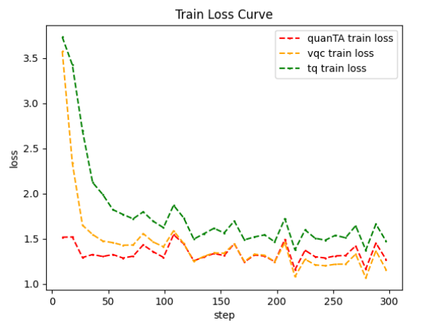

.. _llm:

Quantum Large Model Fine-Tuning demo
****************************************

In recent years, with the widespread adoption of large models and the gradual increase in their scale, training large-scale quantum machine learning models has led to a significant rise in training costs. To reduce the training resources required for fine-tuning large models, several fine-tuning methods have been proposed. These methods no longer fine-tune all parameters of the large model but instead train a small number of parameters through the proposed techniques, allowing the large model to achieve performance on downstream tasks that is no worse than full-parameter fine-tuning. However, fine-tuning methods based on quantum circuits have not yet gained widespread adoption.

``VQNet`` , in combination with ``Llama Factory`` and ``peft`` , enables large model fine-tuning tasks based on quantum circuits.

Quantum Large Model Fine-Tuning Dependency Installation
-----------------------------------------------------------------

Introduction to the Module: Installing Dependencies for Quantum Circuit-Based Large Model Fine-Tuning

To use quantum macromodel fine-tuning, you need the ``quantum-llm`` and ``pyvqnet`` packages, ``pyvqnet`` requires a version of ``2.15.0`` or above.

The first step is to install the ``quantum-llm`` library.

.. code-block::
    
    git clone https://gitee.com/craftsman_lei/quantum-llm.git

Afterwards, install the other dependencies and files according to the ``README.md`` file in ``quantum-llm``.

.. code-block::
    
    # Download additional dependent libraries
    pip install -r requirements.txt

    # install peft_vqc
    cd peft_vqc && pip install -e .

After installing the ``quantum-llm`` library and dependencies, install ``pyvqnet``.

.. code-block::
    
    # install pyvqnet
    pip install pyvqnet # pyvqnet>=2.15.0

Steps for fine-tuning training of quantum grand models
----------------------------------------------------------

After installing the requirements package, you can refer to scripts such as ``train.sh`` under the directory ``/quantum-llm/examples/qlora_single_gpu/``, and specify the parameters of the training base model, the selection of the fine-tuning module, and the path of the output of the fine-tuning module according to the scripts.

The ``Qwen2.5-0.5B`` model is available for download at https://huggingface.co/Qwen/Qwen2.5-0.5B?clone=true, as are the other models: ``Qwen2.5-0.5B`` If the download is not possible, you can download individual files from the URL and use them.

.. code-block::
    
    # Download Qwen2.5-0.5B
    git clone https://huggingface.co/Qwen/Qwen2.5-0.5B

The ``train.sh`` script sample is as follows, determining the baseline model, dataset, output path and other parameter information, where ``model_name_or_path`` is put into the specified model, or if it is not accessible, it is put into the absolute path of the baseline model after downloading the baseline model by itself.

.. note::
    Scripts such as ``train.sh``, ``eval.sh``, ``cli.sh``, etc. are executed in the ``/quantum-llm/examples/qlora_single_gpu/`` directory.

.. code-block::

    #!/bin/bash

    CUDA_VISIBLE_DEVICES=1 python ../../src/train_bash.py \
        --stage sft \
        --model_name_or_path /download path/Qwen2.5-0.5B/ \
        --dataset alpaca_gpt4_en \
        --tokenized_path ../../data/tokenized/alpaca_gpt4_en/ \
        --dataset_dir ../../data \
        --template qwen \
        --finetuning_type vqc \
        --lora_target q_proj,v_proj \
        --output_dir ../../saves/Qwen2.5-0.5B/vqc/alpaca_gpt4_en \
        --overwrite_cache \
        --overwrite_output_dir \
        --cutoff_len 1024 \
        --preprocessing_num_workers 16 \
        --per_device_train_batch_size 1 \
        --per_device_eval_batch_size 1 \
        --gradient_accumulation_steps 8 \
        --lr_scheduler_type cosine \
        --logging_steps 10 \
        --warmup_steps 20 \
        --save_steps 100 \
        --eval_steps 100 \
        --evaluation_strategy steps \
        --load_best_model_at_end \
        --learning_rate 5e-5 \
        --num_train_epochs 3.0 \
        --max_samples 1000 \
        --val_size 0.1 \
        --plot_loss \
        --fp16 \
        --do-train \

    # 
    sh train.sh 

In the quantum macromodel fine-tuning module, compared with the classical macromodel fine-tuning module, three additional fine-tuning methods are added, which are:

``vqc`` : vqc fine-tuning module based on VQNet implementation 

``quanTA`` : module for quantum tensor decomposition 

``tq`` : vqc module based on torch quantum implementation  

The above ``train.sh`` sample is a sample script for fine-tuning the ``vqc`` module, if you use the other two fine-tuning modules, change ``finetuning_type`` to ``quanTA`` , ``tq`` and plot the results of the three module experiments, the results are as follows.

|

The above figure shows the training results based on the ``Qwen2.5-0.5B`` benchmark model on the dataset ``alpaca_gpt4_en``, in which it can be observed that the VQNet-based ``vqc`` module achieves the best loss convergence, thus proving the validity of the task of fine-tuning the large model based on the quantum lines.

The ``train.sh`` training script saves the fine-tuned module parameters to a specified directory with the ``--output_dir`` parameter. 
This is then evaluated by the ``eval.sh`` script in the same directory ``/quantum-llm/examples/qlora_single_gpu/``, which reads as follows.

.. code-block::

    #!/bin/bash

    CUDA_VISIBLE_DEVICES=1 python ../../src/evaluate.py \
        --model_name_or_path /download path/Qwen2.5-0.5B/ \
        --template qwen \
        --finetuning_type vqc \
        --task cmmlu \
        --task_dir ../../evaluation/ \
        --adapter_name_or_path ../../saves/Qwen2.5-0.5B/vqc/alpaca_gpt4_en \

    # 
    sh eval.sh 

Specify the baseline model path by ``--model_name_or_path``, and load the trained module for evaluation on the relevant task according to ``--adapter_name_or_path``, with the ``-task`` parameter describing the ``cmmlu``, ``ceval``, ``mmlu`` parameters.

The quiz is then executed by calling the ``cli_demo.py`` file, again based on the ``cli.sh`` script in the current directory, which reads.

.. code-block::

    #!/bin/bash

    CUDA_VISIBLE_DEVICES=1 python ../../src/cli_demo.py  \
        --model_name_or_path /download path/Qwen2.5-0.5B/ \
        --template qwen \
        --finetuning_type vqc \
        --adapter_name_or_path ../../saves/Qwen2.5-0.5B/vqc/alpaca_gpt4_en \
        --max_new_tokens 1024

    sh cli.sh 

More specific information about the relevant parameters
------------------------------------------------------------

==============================     ===================================================================
                        PEFT Parameter Description
------------------------------------------------------------------------------------------------------
parameter name                                  Detailed introduction
==============================     ===================================================================
stage                               Determine the large model training mode, pt for pre-training, sft for fine-tuning stage, and sft for experimentation.
model_name_or_path                  model_name_or_path Select the path of the baseline model.
dataset                             Select dataset, such as identity, alpaca_gpt4_zh, etc.
tokenized_path                      Select the dataset tokenized path.
dataset_dir                         Select the dataset path.
template                            model template type, e.g. llama3, etc.
finetuning_type                     Specify the finetuning method, such as lora, tq, vqc, quanTA.
lora_target                         The function module is q_proj, v_proj.
output_dir                          The path where the fine-tuning module is stored.
overwrite_cache                     Whether to overwrite the cached training and evaluation sets.
overwrite_output_dir                Whether to overwrite existing files in the output directory.
cutoff_len                          Specifies the length of the cutoff when processing data.
preprocessing_num_workers           Specifies the number of work processes to be used for preprocessing the data.
per_device_train_batch_size         Batch size per gpu, training parameter
per_device_eval_batch_size          Batch size per gpu, training parameter
gradient_accumulation_steps         Number of steps for gradient accumulation, training parameter
lr_scheduler_type                   learning rate scheduler, training parameter
logging_steps                       Printing interval
warmup_steps                        warmup steps
save_steps                          model save interval
eval_steps                          evaluation save interval
evaluation_strategy                 Evaluation strategy, set here to step-by-step evaluation.
load_best_model_at_end              Load the best performing model at the end of training.
learning_rate                       learning rate
num_train_epochs                    number of training rounds to be executed
max_samples                         Maximum number of training samples
val_size                            Validation set size 
plot_loss                           whether to save the training loss curve
fp16                                Whether to train with fp16 mixed precision, or float32 in the vqc module.
do-train                            whether to specify a training task
adapter_name_or_path                Select the path of the file to be generated after training.
task                                Select the task, currently supports ceval, cmmlu, mmlu.
task_dir                            Specify the path of the task.
q_d                                 Specify the number of tensor decomposition of quanTA module, default is 4.
per_dim_features                    Specify the number of tensor decomposition features of quanTA module, default is [16,8,4,2].
==============================     ===================================================================
