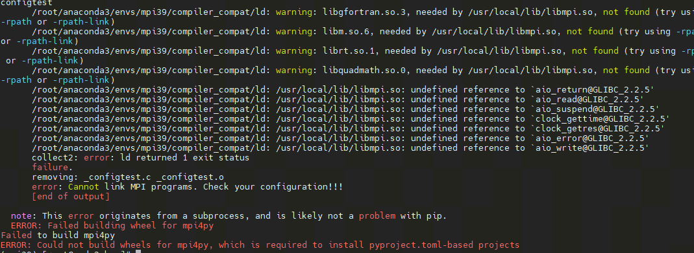

Classical Neural Network Module
#########################################

The following classical neural network modules support automatic back propagation computation.After running the forward function, you can calculate the gradient by executing the reverse function.A simple example of the convolution layer is as follows:

.. code-block::

        from pyvqnet.tensor import arange
        from pyvqnet import kfloat32
        from pyvqnet.nn import Conv2D

        # an image feed into two dimension convolution layer
        b = 2        # batch size
        ic = 2       # input channels
        oc = 2      # output channels
        hw = 4      # input width and heights

        # two dimension convolution layer
        test_conv = Conv2D(ic,oc,(2,2),(2,2),"same")

        # input of shape [b,ic,hw,hw]
        x0 = arange(1,b*ic*hw*hw+1,requires_grad=True,dtype=kfloat32).reshape([b,ic,hw,hw])

        #forward function
        x = test_conv(x0)

        #backward function with autograd
        x.backward()
        print(x0.grad)

        # [
        # [[[0.0958736, 0.3032238, 0.0958736, 0.3032238],
        #  [-0.2665333, 0.1081382, -0.2665333, 0.1081382],
        #  [0.0958736, 0.3032238, 0.0958736, 0.3032238],
        #  [-0.2665333, 0.1081382, -0.2665333, 0.1081382]],
        # [[-0.0068994, 0.0914679, -0.0068994, 0.0914679],
        #  [-0.2820665, 0.3160213, -0.2820665, 0.3160213],
        #  [-0.0068994, 0.0914679, -0.0068994, 0.0914679],
        #  [-0.2820665, 0.3160213, -0.2820665, 0.3160213]]],
        # [[[0.0958736, 0.3032238, 0.0958736, 0.3032238],
        #  [-0.2665333, 0.1081382, -0.2665333, 0.1081382],
        #  [0.0958736, 0.3032238, 0.0958736, 0.3032238],
        #  [-0.2665333, 0.1081382, -0.2665333, 0.1081382]],
        # [[-0.0068994, 0.0914679, -0.0068994, 0.0914679],
        #  [-0.2820665, 0.3160213, -0.2820665, 0.3160213],
        #  [-0.0068994, 0.0914679, -0.0068994, 0.0914679],
        #  [-0.2820665, 0.3160213, -0.2820665, 0.3160213]]]
        # ]

.. currentmodule:: pyvqnet.nn

Module Class
********************************************************

abstract calculation module

Module
=================================

.. py:class:: pyvqnet.nn.module.Module

    Base class for all neural network modules including quantum modules or classic modules.
    Your models should also be subclass of this class for autograd calculation.

    Modules can also contain other Modules, allowing to nest them in
    a tree structure. You can assign the submodules as regular attributes::

        class Model(Module):
            def __init__(self):
                super(Model, self).__init__()
                self.conv1 = pyvqnet.nn.Conv2d(1, 20, (5,5))
                self.conv2 = pyvqnet.nn.Conv2d(20, 20, (5,5))

            def forward(self, x):
                x = pyvqnet.nn.activation.relu(self.conv1(x))
                return pyvqnet.nn.activation.relu(self.conv2(x))

    Submodules assigned in this way will be registered

forward
=================================

.. py:method:: pyvqnet.nn.module.Module.forward(x, *args, **kwargs)

    Abstract method which performs forward pass.

    :param x: input QTensor
    :param \*args: A non-keyword variable parameter
    :param \*\*kwargs: A keyword variable parameter
    :return: module output

    Example::

        import numpy as np
        from pyvqnet.tensor import QTensor
        import pyvqnet as vq
        from pyvqnet.nn import Conv2D
        b = 2
        ic = 3
        oc = 2
        test_conv = Conv2D(ic, oc, (3, 3), (2, 2), "same")
        x0 = QTensor(np.arange(1, b * ic * 5 * 5 + 1).reshape([b, ic, 5, 5]),
                    requires_grad=True,
                    dtype=vq.kfloat32)
        x = test_conv.forward(x0)
        print(x)

        # [
        # [[[4.3995643, 3.9317808, -2.0707254],
        #  [20.1951981, 21.6946659, 14.2591858],
        #  [38.4702759, 31.9730244, 24.5977650]],
        # [[-17.0607567, -31.5377998, -7.5618000],
        #  [-22.5664024, -40.3876266, -15.1564388],
        #  [-3.1080279, -18.5986233, -8.0648050]]],
        # [[[6.6493244, -13.4840755, -20.2554188],
        #  [54.4235802, 34.4462433, 26.8171902],
        #  [90.2827682, 62.9092331, 51.6892929]],
        # [[-22.3385429, -45.2448578, 5.7101378],
        #  [-32.9464149, -60.9557228, -10.4994345],
        #  [5.9029331, -20.5480480, -0.9379558]]]
        # ]

state_dict 
=================================

.. py:method:: pyvqnet.nn.module.Module.state_dict(destination=None, prefix='')

    Return a dictionary containing a whole state of the module.

    Both parameters and persistent buffers (e.g. running averages) are
    included. Keys are corresponding parameter and buffer names.

    :param destination: a dict where state will be stored
    :param prefix: the prefix for parameters and buffers used in this
        module

    :return: a dictionary containing a whole state of the module

    Example::

        from pyvqnet.nn import Conv2D
        test_conv = Conv2D(2,3,(3,3),(2,2),"same")
        print(test_conv.state_dict().keys())
        #odict_keys(['weights', 'bias'])

toGPU
=================================

.. py:function:: pyvqnet.nn.module.Module.toGPU(device: int = DEV_GPU_0)

    Move the parameters and buffer data of a module and its submodules to the specified GPU device.

    device specifies the device whose internal data is stored. When device >= DEV_GPU_0, the data is stored on the GPU. If your computer has multiple GPUs,
    You can specify different devices to store data. For example, device = DEV_GPU_1 , DEV_GPU_2, DEV_GPU_3, ... means it is stored on GPUs with different serial numbers.
    
    .. note::
        Module cannot be calculated on different GPUs. A Cuda error will be raised if you try to create a QTensor on a GPU whose ID exceeds the maximum number of verified GPUs.

    :param device: The device currently saving QTensor, default=DEV_GPU_0. device = pyvqnet.DEV_GPU_0, stored in the first GPU, devcie = DEV_GPU_1, stored in the second GPU, and so on.
    :return: Module moved to GPU device.

    Examples::

        from pyvqnet.nn.conv import ConvT2D 
        test_conv = ConvT2D(3, 2, [4,4], [2, 2], "same")
        test_conv = test_conv.toGPU()
        print(test_conv.backend)
        #1000

toCPU
=================================

.. py:function:: pyvqnet.nn.module.Module.toCPU()

    Moves the parameters and buffer data of a module and its submodules to a specific CPU device.

    :return: Module moved to CPU device.

    Examples::

        from pyvqnet.nn.conv import ConvT2D 
        test_conv = ConvT2D(3, 2, [4,4], [2, 2], "same")
        test_conv = test_conv.toCPU()
        print(test_conv.backend)
        #0

save_parameters
=================================

.. py:function:: pyvqnet.utils.storage.save_parameters(obj, f)

    Saves model parmeters to a disk file.

    :param obj: saved OrderedDict from ``state_dict()``
    :param f: a string or os.PathLike object containing a file name
    :return: None

    Example::

        from pyvqnet.nn import Module,Conv2D
        import pyvqnet
        class Net(Module):
            def __init__(self):
                super(Net, self).__init__()
                self.conv1 = Conv2D(input_channels=1, output_channels=6, kernel_size=(5, 5), stride=(1, 1), padding="valid")

            def forward(self, x):
                return super().forward(x)

        model = Net()
        pyvqnet.utils.storage.save_parameters(model.state_dict(),"tmp.model")

load_parameters
=================================

.. py:function:: pyvqnet.utils.storage.load_parameters(f)

    Loads model paramters from a disk file.

    The model instance should be created first.

    :param f: a string or os.PathLike object containing a file name
    :return: saved OrderedDict for ``load_state_dict()``

    Example::

        from pyvqnet.nn import Module,Conv2D
        import pyvqnet

        class Net(Module):
            def __init__(self):
                super(Net, self).__init__()
                self.conv1 = Conv2D(input_channels=1, output_channels=6, kernel_size=(5, 5), stride=(1, 1), padding="valid")

            def forward(self, x):
                return super().forward(x)

        model = Net()
        model1 = Net()  # another Module object
        pyvqnet.utils.storage.save_parameters( model.state_dict(),"tmp.model")
        model_para =  pyvqnet.utils.storage.load_parameters("tmp.model")
        model1.load_state_dict(model_para)

ModuleList
**************************************************************************************************************************************************************************

.. py:class:: pyvqnet.nn.module.ModuleList([pyvqnet.nn.module.Module])

    Save submodules in a list. ModuleList can be indexed like a normal Python list, and the internal parameters of the Module it contains can be saved.

    :param modules: list of nn.Modules

    :return: a list of modules

    Example::

        from pyvqnet.tensor import *
        from pyvqnet.nn import Module,Linear,ModuleList
        from pyvqnet.qnn import ProbsMeasure,QuantumLayer
        import pyqpanda as pq
        def pqctest (input,param,qubits,cubits,m_machine):
            circuit = pq.QCircuit()
            circuit.insert(pq.H(qubits[0]))
            circuit.insert(pq.H(qubits[1]))
            circuit.insert(pq.H(qubits[2]))
            circuit.insert(pq.H(qubits[3]))

            circuit.insert(pq.RZ(qubits[0],input[0]))
            circuit.insert(pq.RZ(qubits[1],input[1]))
            circuit.insert(pq.RZ(qubits[2],input[2]))
            circuit.insert(pq.RZ(qubits[3],input[3]))

            circuit.insert(pq.CNOT(qubits[0],qubits[1]))
            circuit.insert(pq.RZ(qubits[1],param[0]))
            circuit.insert(pq.CNOT(qubits[0],qubits[1]))

            circuit.insert(pq.CNOT(qubits[1],qubits[2]))
            circuit.insert(pq.RZ(qubits[2],param[1]))
            circuit.insert(pq.CNOT(qubits[1],qubits[2]))

            circuit.insert(pq.CNOT(qubits[2],qubits[3]))
            circuit.insert(pq.RZ(qubits[3],param[2]))
            circuit.insert(pq.CNOT(qubits[2],qubits[3]))
            #print(circuit)

            prog = pq.QProg()
            prog.insert(circuit)

            rlt_prob = ProbsMeasure([0,2],prog,m_machine,qubits)
            return rlt_prob

        class M(Module):
            def __init__(self):
                super(M, self).__init__()
                self.pqc2 = ModuleList([QuantumLayer(pqctest,3,"cpu",4,1), Linear(4,1)
                ])

            def forward(self, x, *args, **kwargs):
                y = self.pqc2[0](x)  + self.pqc2[1](x)
                return y

        mm = M()
        print(mm.state_dict().keys())
        #odict_keys(['pqc2.0.m_para', 'pqc2.1.weights', 'pqc2.1.bias'])

ParameterList
*********************************************************
.. py:class:: pyvqnet.nn.module.ParameterList([pyvqnet.nn.module.Module])

    To store parameters in a list, a ParameterList can be indexed like a normal Python list, and the internal parameters of the Parameter it contains can be stored.

    :param modules: nn.Parameter list.

    :return: a Parameter list.

    Example::

        from pyvqnet import nn
        class MyModule(nn.Module):
            def __init__(self):
                super().__init__()
                self.params = nn.ParameterList([nn.Parameter((10, 10)) for i in range(10)])
            def forward(self, x):

                # ParameterList can act as an iterable, or be indexed using ints
                for i, p in enumerate(self.params):
                    x = self.params[i // 2] * x + p * x
                return x

        model = MyModule()
        print(model.state_dict().keys())

Sequential
*********************************************************
.. py:class:: pyvqnet.nn.module.Sequential([pyvqnet.nn.module.Module])

    Modules will be added in the order they are passed in. Alternatively, a ``OrderedDict`` of modules can be passed in. The ``forward()`` method of ``Sequential`` takes any input and forwards it to its first module.
    It then ``Sequential`` the output to the input of each subsequent module in turn, and finally returns the output of the last module.

    :param modules: module to append.

    :return: Sequential.

    Example::
        
        from pyvqnet import nn
        from collections import OrderedDict

        # Using Sequential to create a small model.
        model = nn.Sequential(
                  nn.Conv2D(1,20,(5, 5)),
                  nn.ReLu(),
                  nn.Conv2D(20,64,(5, 5)),
                  nn.ReLu()
                )
        print(model.state_dict().keys())

        # Using Sequential with OrderedDict. This is functionally the same as the above code
                
        model = nn.Sequential(OrderedDict([
                  ('conv1', nn.Conv2D(1,20,(5, 5))),
                  ('relu1', nn.ReLu()),
                  ('conv2', nn.Conv2D(20,64,(5, 5))),
                  ('relu2', nn.ReLu())
                ]))
        print(model.state_dict().keys())

Classical Neural Network Layer
********************************************************

Conv1D
=================================

.. py:class:: pyvqnet.nn.Conv1D(input_channels:int,output_channels:int,kernel_size:int ,stride:int= 1,padding = "valid",use_bias:str = True,kernel_initializer = None,bias_initializer =None, dilation_rate: int = 1, group: int = 1, dtype=None, name='')

    Apply a 1-dimensional convolution kernel over an input . Inputs to the conv module are of shape (batch_size, input_channels, height)

    :param input_channels: `int` - Number of input channels
    :param output_channels: `int` - Number of kernels
    :param kernel_size: `int` - Size of a single kernel. kernel shape = [output_channels,input_channels/group,kernel_size,1]
    :param stride: `int` - Stride, defaults to 1
    :param padding: `str|int` - padding option, which can be a string {'valid', 'same'} or an integer giving the amount of implicit padding to apply . Default "valid".
    :param use_bias: `bool` - if use bias, defaults to True
    :param kernel_initializer: `callable` - Defaults to None
    :param bias_initializer: `callable` - Defaults to None
    :param dilation_rate: `int` - dilated size, defaults: 1
    :param group: `int` -  number of groups of grouped convolutions. Default: 1
    :param dtype: The data type of the parameter, defaults: None, use the default data type kfloat32, which represents a 32-bit floating point number.
    :param name: The name of the module, default: "".
    :return: a Conv1D class

    .. note::
        ``padding='valid'`` is the same as no padding.

        ``padding='same'`` pads the input so the output has the shape as the input.

    Example::

        import numpy as np
        from pyvqnet.tensor import QTensor
        from pyvqnet.nn import Conv1D
        import pyvqnet
        b= 2
        ic =3
        oc = 2
        test_conv = Conv1D(ic,oc,3,2,"same")
        x0 = QTensor(np.arange(1,b*ic*5*5 +1).reshape([b,ic,25]),requires_grad=True,dtype=pyvqnet.kfloat32)
        x = test_conv.forward(x0)
        print(x)

        # [
        # [[12.4438553, 14.8618164, 15.5595102, 16.2572021, 16.9548950, 17.6525879, 18.3502808, 19.0479736, 19.7456665, 20.4433594, 21.1410522, 21.8387432, 10.5725441],
        #  [-13.7539215, 1.0263026, 1.2747254, 1.5231485, 1.7715728, 2.0199962, 2.2684195, 2.5168428, 2.7652662, 3.0136888, 3.2621140, 3.5105357, 14.0515862]],
        # [[47.4924164, 41.0252953, 41.7229881, 42.4206772, 43.1183739, 43.8160667, 44.5137596, 45.2114487, 45.9091415, 46.6068344, 47.3045311, 48.0022240, 18.3216572],
        #  [-47.2381554, 10.3421783, 10.5906038, 10.8390274, 11.0874519, 11.3358765, 11.5842953, 11.8327246, 12.0811434, 12.3295631, 12.5779924, 12.8264122, 39.4719162]]
        # ]

Conv2D
=================================

.. py:class:: pyvqnet.nn.Conv2D(input_channels:int,output_channels:int,kernel_size:tuple,stride:tuple=(1, 1),padding="valid",use_bias = True,kernel_initializer=None,bias_initializer=None, dilation_rate: int = 1, group: int = 1, dtype = None, name = "")

    Apply a two-dimensional convolution kernel over an input . Inputs to the conv module are of shape (batch_size, input_channels, height, width)

    :param input_channels: `int` - Number of input channels
    :param output_channels: `int` - Number of kernels
    :param kernel_size: `tuple|list` - Size of a single kernel. kernel shape = [output_channels,input_channels/group,kernel_size,kernel_size]
    :param stride: `tuple|list` - Stride, defaults to (1, 1)|[1,1]
    :param padding: `str|tuple` - padding option, which can be a string {'valid', 'same'} or a tuple of integers giving the amount of implicit padding to apply on both sides. Default "valid".
    :param use_bias: `bool` - if use bias, defaults to True
    :param kernel_initializer: `callable` - Defaults to None
    :param bias_initializer: `callable` - Defaults to None
    :param dilation_rate: `int` - dilated size, defaults: 1
    :param group: `int` -  number of groups of grouped convolutions. Default: 1.
    :param dtype: The data type of the parameter, defaults: None, use the default data type kfloat32, which represents a 32-bit floating point number.
    :param name: The name of the module, default: "".

    :return: a Conv2D class

    .. note::
        ``padding='valid'`` is the same as no padding.

        ``padding='same'`` pads the input so the output has the shape as the input.

    Example::

        import numpy as np
        from pyvqnet.tensor import QTensor
        from pyvqnet.nn import Conv2D
        import pyvqnet
        b= 2
        ic =3
        oc = 2
        test_conv = Conv2D(ic,oc,(3,3),(2,2),"same")
        x0 = QTensor(np.arange(1,b*ic*5*5+1).reshape([b,ic,5,5]),requires_grad=True,dtype=pyvqnet.kfloat32)
        x = test_conv.forward(x0)
        print(x)

        # [
        # [[[-0.1256833, 23.8978596, 26.7449780],
        #  [-7.2959919, 33.4023743, 42.1283913],
        #  [-8.7684336, 25.2698975, 40.4024887]],
        # [[33.0653763, 40.3120155, 27.3781891],
        #  [39.2921371, 45.8685760, 38.1885109],
        #  [23.1873779, 12.0480318, 12.7278290]]],
        # [[[-0.9730744, 61.3967094, 79.0511856],
        #  [-29.3652401, 75.0349350, 112.7325439],
        #  [-26.4682808, 59.0924797, 104.2572098]],
        # [[66.8064194, 96.0953140, 72.9157486],
        #  [90.9154129, 110.7232437, 91.2616043],
        #  [56.8825951, 34.6904907, 30.1957760]]]
        # ]

ConvT2D
=================================

.. py:class:: pyvqnet.nn.ConvT2D(input_channels,output_channels,kernel_size,stride=[1, 1],padding="valid",use_bias="True", kernel_initializer=None,bias_initializer=None, dilation_rate: int = 1, group: int = 1, dtype=None, name='')

    Apply a two-dimensional transposed convolution kernel over an input. Inputs to the convT module are of shape (batch_size, input_channels, height, width)

    :param input_channels: `int` - Number of input channels
    :param output_channels: `int` - Number of kernels
    :param kernel_size: `tuple|list` - Size of a single kernel. kernel shape = [input_channels,output_channels/group,kernel_size,kernel_size]
    :param stride: `tuple|list` - Stride, defaults to (1, 1)|[1,1]
    :param padding: `str|tuple` - padding option, which can be a string {'valid', 'same'} or a tuple of integers giving the amount of implicit padding to apply on both sides. Default "valid".
    :param use_bias: `bool` - Whether to use a offset item. Default to use
    :param kernel_initializer: `callable` - Defaults to None
    :param bias_initializer: `callable` - Defaults to None
    :param dilation_rate: `int` - dilated size, defaults: 1
    :param group: `int` -  number of groups of grouped convolutions. Default: 1.
    :param dtype: The data type of the parameter, defaults: None, use the default data type kfloat32, which represents a 32-bit floating point number.
    :param name: The name of the module, default: "".

    :return: a ConvT2D class

    .. note::
        ``padding='valid'`` is the same as no padding.

        ``padding='same'`` pads the input so the output has the shape as the input.

    Example::

        import numpy as np
        from pyvqnet.tensor import QTensor
        from pyvqnet.nn import ConvT2D
        import pyvqnet
        test_conv = ConvT2D(3, 2, (3, 3), (1, 1), "valid")
        x = QTensor(np.arange(1, 1 * 3 * 5 * 5+1).reshape([1, 3, 5, 5]), requires_grad=True,dtype=pyvqnet.kfloat32)
        y = test_conv.forward(x)
        print(y)

        # [
        # [[[-3.3675897, 4.8476148, 14.2448473, 14.8897810, 15.5347166, 20.0420666, 10.9831696],
        #  [-14.0110836, -3.2500827, 6.4022207, 6.5149083, 6.6275964, 23.7946320, 12.1828709],
        #  [-22.2661152, -3.5112300, 12.9493723, 13.5486069, 14.1478367, 39.6327629, 18.8349991],
        #  [-24.4063797, -3.0093837, 15.9455290, 16.5447617, 17.1439915, 44.7691879, 21.3293095],
        #  [-26.5466480, -2.5075383, 18.9416828, 19.5409145, 20.1401463, 49.9056053, 23.8236179],
        #  [-24.7624626, -13.7395811, -7.9510674, -7.9967723, -8.0424776, 19.2783546, 7.0562835],
        #  [-3.5170188, 10.2280807, 16.1939259, 16.6804695, 17.1670132, 21.2262039, 6.2889833]],
        # [[-2.0570512, -9.5056667, -25.0429192, -25.9464111, -26.8499031, -24.7305946, -16.9881954],
        #  [-0.7620960, -18.3383904, -49.8948288, -51.2528229, -52.6108208, -52.2179604, -34.3664169],
        #  [-11.7121849, -27.1864738, -62.2154846, -63.6433640, -65.0712280, -52.6787071, -38.4497032],
        #  [-13.3643141, -29.0211792, -69.3548126, -70.7826691, -72.2105408, -58.1659012, -43.7543182],
        #  [-15.0164423, -30.8558884, -76.4941254, -77.9219971, -79.3498535, -63.6530838, -49.0589256],
        #  [-11.6070204, -14.1940546, -35.5471687, -36.0715408, -36.5959129, -23.9147663, -22.8668022],
        #  [-14.4390459, -4.9011412, -6.4719801, -6.5418491, -6.6117167, 9.3329525, -1.7254852]]]
        # ]

AvgPool1D
=================================

.. py:class:: pyvqnet.nn.AvgPool1D(kernel, stride, padding='valid', name='')

    This operation applies a 1D average pooling over an input signal composed of several input planes.

    :param kernel: size of the average pooling windows
    :param strides: factor by which to downscale
    :param padding: one of "valid", "same" or integer specifies the padding value, defaults to "valid"
    :param name: name of the output layer.

    :return: AvgPool1D layer

    .. note::
        ``padding='valid'`` is the same as no padding.

        ``padding='same'`` pads the input so the output has the shape as the input.

    Example::

        import numpy as np
        from pyvqnet.tensor import QTensor
        from pyvqnet.nn import AvgPool1D
        test_mp = AvgPool1D([3],[2],"same")
        x= QTensor(np.array([0, 1, 0, 4, 5,
                                    2, 3, 2, 1, 3,
                                    4, 4, 0, 4, 3,
                                    2, 5, 2, 6, 4,
                                    1, 0, 0, 5, 7],dtype=float).reshape([1,5,5]),requires_grad=True)

        y= test_mp.forward(x)
        print(y)
        # [
        # [[0.3333333, 1.6666666, 3],
        #  [1.6666666, 2, 1.3333334],
        #  [2.6666667, 2.6666667, 2.3333333],
        #  [2.3333333, 4.3333335, 3.3333333],
        #  [0.3333333, 1.6666666, 4]]
        # ]

MaxPool1D
=================================

.. py:class:: pyvqnet.nn.MaxPool1D(kernel, stride, padding='valid', dtype=None, name='')

    This operation applies a 1D max pooling over an input signal composed of several input planes.

    :param kernel: size of the max pooling windows
    :param strides: factor by which to downscale
    :param padding: one of "valid", "same" or integer specifies the padding value, defaults to "valid"
    :param name: The name of the module, default: "".

    :return: MaxPool1D layer

    .. note::

        ``padding='valid'`` is the same as no padding.

        ``padding='same'`` pads the input so the output has the shape as the input.

    Example::

        import numpy as np
        from pyvqnet.tensor import QTensor
        from pyvqnet.nn import MaxPool1D
        test_mp = MaxPool1D([3],[2],"same")
        x= QTensor(np.array([0, 1, 0, 4, 5,
                                    2, 3, 2, 1, 3,
                                    4, 4, 0, 4, 3,
                                    2, 5, 2, 6, 4,
                                    1, 0, 0, 5, 7],dtype=float).reshape([1,5,5]),requires_grad=True)

        y= test_mp.forward(x)
        print(y)
        #[[[1. 4. 5.]
        #   [3. 3. 3.]
        #   [4. 4. 4.]
        #   [5. 6. 6.]
        #   [1. 5. 7.]]]

AvgPool2D
=================================

.. py:class:: pyvqnet.nn.AvgPool2D(kernel, stride, padding='valid', name='')

    This operation applies 2D average pooling over input features .

    :param kernel: size of the average pooling windows
    :param strides: factors by which to downscale
    :param padding: one of "valid", "same" or tuple with integers specifies the padding value of column and row,defaults to "valid"
    :param name: name of the output layer
    :return: AvgPool2D layer

    .. note::
        ``padding='valid'`` is the same as no padding.

        ``padding='same'`` pads the input so the output has the shape as the input.

    Example::

        import numpy as np
        from pyvqnet.tensor import QTensor
        from pyvqnet.nn import AvgPool2D
        test_mp = AvgPool2D([2,2],[2,2],"valid")
        x= QTensor(np.array([0, 1, 0, 4, 5,
                                    2, 3, 2, 1, 3,
                                    4, 4, 0, 4, 3,
                                    2, 5, 2, 6, 4,
                                    1, 0, 0, 5, 7],dtype=float).reshape([1,1,5,5]),requires_grad=True)

        y= test_mp.forward(x)
        print(y)
        #[[[[1.5  1.75]
        #    [3.75 3.  ]]]]

MaxPool2D
=================================

.. py:class:: pyvqnet.nn.MaxPool2D(kernel, stride, padding='valid', name='')

    This operation applies 2D max pooling over input features.

    :param kernel: size of the max pooling windows
    :param strides: factor by which to downscale
    :param padding: one of "valid", "same" or tuple with integers specifies the padding value of column and row, defaults to "valid"
    :param name: name of the output layer
    :return: MaxPool2D layer

    .. note::
        ``padding='valid'`` is the same as no padding.

        ``padding='same'`` pads the input so the output has the shape as the input.

    Example::

        import numpy as np
        from pyvqnet.tensor import QTensor
        from pyvqnet.nn import MaxPool2D
        test_mp = MaxPool2D([2,2],[2,2],"valid")
        x= QTensor(np.array([0, 1, 0, 4, 5,
                                    2, 3, 2, 1, 3,
                                    4, 4, 0, 4, 3,
                                    2, 5, 2, 6, 4,
                                    1, 0, 0, 5, 7],dtype=float).reshape([1,1,5,5]),requires_grad=True)

        y= test_mp.forward(x)
        print(y)
        # [[[[3. 4.]
        #    [5. 6.]]]]

Embedding
=================================

.. py:class:: pyvqnet.nn.embedding.Embedding(num_embeddings, embedding_dim, weight_initializer=<function xavier_normal>,dtype=None, name: str = '')

    This module is often used to store word embeddings and retrieve them using indices.
    The input to the module is a list of indices, and the output is the corresponding
    word embeddings.

    :param num_embeddings: `int` - size of the dictionary of embeddings.
    :param embedding_dim: `int` - the size of each embedding vector.
    :param weight_initializer: `callable` - defaults to normal.
    :param dtype: The data type of the parameter, defaults: None, use the default data type kfloat32, which represents a 32-bit floating point number.
    :param name: name of the output layer.

    :return: a Embedding class

    Example::

        import numpy as np
        from pyvqnet.tensor import QTensor
        from pyvqnet.nn.embedding import Embedding
        import pyvqnet
        vlayer = Embedding(30,3)
        x = QTensor(np.arange(1,25).reshape([2,3,2,2]),dtype= pyvqnet.kint64)
        y = vlayer(x)
        print(y)

        # [
        # [[[[-0.3168081, 0.0329394, -0.2934906],
        #  [0.1057295, -0.2844988, -0.1687456]],
        # [[-0.2382513, -0.3642318, -0.2257225],
        #  [0.1563180, 0.1567665, 0.3038477]]],
        # [[[-0.4131152, -0.0564500, -0.2804018],
        #  [-0.2955172, -0.0009581, -0.1641144]],
        # [[0.0692555, 0.1094901, 0.4099118],
        #  [0.4348361, 0.0304361, -0.0061203]]],
        # [[[-0.3310401, -0.1836129, 0.1098949],
        #  [-0.1840732, 0.0332474, -0.0261806]],
        # [[-0.1489778, 0.2519453, 0.3299376],
        #  [-0.1942692, -0.1540277, -0.2335350]]]],
        # [[[[-0.2620637, -0.3181309, -0.1857461],
        #  [-0.0878164, -0.4180320, -0.1831555]],
        # [[-0.0738970, -0.1888980, -0.3034399],
        #  [0.1955448, -0.0409723, 0.3023460]]],
        # [[[0.2430045, 0.0880465, 0.4309453],
        #  [-0.1796514, -0.1432367, -0.1253638]],
        # [[-0.5266719, 0.2386262, -0.0329155],
        #  [0.1033449, -0.3442690, -0.0471130]]],
        # [[[-0.5336705, -0.1939755, -0.3000667],
        #  [0.0059001, 0.5567381, 0.1926173]],
        # [[-0.2385869, -0.3910453, 0.2521235],
        #  [-0.0246447, -0.0241158, -0.1402829]]]]
        # ]

BatchNorm2d
=================================

.. py:class:: pyvqnet.nn.BatchNorm2d(channel_num:int, momentum:float=0.1, epsilon:float = 1e-5,beta_initializer=zeros, gamma_initializer=ones, dtype=None, name="")

    Applies Batch Normalization over a 4D input (B,C,H,W) as described in the paper
    `Batch Normalization: Accelerating Deep Network Training by Reducing
    Internal Covariate Shift <https://arxiv.org/abs/1502.03167>`__ .

    .. math::

        y = \frac{x - \mathrm{E}[x]}{\sqrt{\mathrm{Var}[x] + \epsilon}} * \gamma + \beta

    where :math:`\gamma` and :math:`\beta` are learnable parameters.Also by default, during training this layer keeps running
    estimates of its computed mean and variance, which are then used for normalization during evaluation.
    The running estimates are kept with a default momentum of 0.1.

    :param channel_num: `int` - the number of input features channels.
    :param momentum: `float` - momentum when calculation exponentially weighted average, defaults to 0.1.
    :param beta_initializer: `callable` - defaults to zeros.
    :param gamma_initializer: `callable` - defaults to ones.
    :param epsilon: `float` - numerical stability constant, defaults to 1e-5.
    :param dtype: The data type of the parameter, defaults: None, use the default data type kfloat32, which represents a 32-bit floating point number.
    :param name: name of the output layer
    :return: a BatchNorm2d class

    Example::

        import numpy as np
        from pyvqnet.tensor import QTensor
        from pyvqnet.nn import BatchNorm2d
        import pyvqnet
        b = 2
        ic = 2
        test_conv = BatchNorm2d(ic)

        x = QTensor(np.arange(1, 17).reshape([b, ic, 4, 1]),
                    requires_grad=True,
                    dtype=pyvqnet.kfloat32)
        y = test_conv.forward(x)
        print(y)

        # [
        # [[[-1.3242440],
        #  [-1.0834724],
        #  [-0.8427007],
        #  [-0.6019291]],
        # [[-1.3242440],
        #  [-1.0834724],
        #  [-0.8427007],
        #  [-0.6019291]]],
        # [[[0.6019291],
        #  [0.8427007],
        #  [1.0834724],
        #  [1.3242440]],
        # [[0.6019291],
        #  [0.8427007],
        #  [1.0834724],
        #  [1.3242440]]]
        # ]

BatchNorm1d
=================================

.. py:class:: pyvqnet.nn.BatchNorm1d(channel_num:int, momentum:float=0.1, epsilon:float = 1e-5, beta_initializer=zeros, gamma_initializer=ones, dtype=None, name="")

    Applies Batch Normalization over a 2D input (B,C) as described in the paper
    `Batch Normalization: Accelerating Deep Network Training by Reducing
    Internal Covariate Shift <https://arxiv.org/abs/1502.03167>`__ .

    .. math::

        y = \frac{x - \mathrm{E}[x]}{\sqrt{\mathrm{Var}[x] + \epsilon}} * \gamma + \beta

    where :math:`\gamma` and :math:`\beta` are learnable parameters.Also by default, during training this layer keeps running
    estimates of its computed mean and variance, which are then used for normalization during evaluation.
    The running estimates are kept with a default momentum of 0.1.

    :param channel_num: `int` - the number of input features channels.
    :param momentum: `float` - momentum when calculation exponentially weighted average, defaults to 0.1
    :param beta_initializer: `callable` - defaults to zeros.
    :param gamma_initializer: `callable` - defaults to ones.
    :param epsilon: `float` - numerical stability constant, defaults to 1e-5.
    :param dtype: The data type of the parameter, defaults: None, use the default data type kfloat32, which represents a 32-bit floating point number.
    :param name: name of the output layer
    :return: a BatchNorm1d class

    Example::

        import numpy as np
        from pyvqnet.tensor import QTensor
        from pyvqnet.nn import BatchNorm1d
        import pyvqnet
        test_conv = BatchNorm1d(4)

        x = QTensor(np.arange(1, 17).reshape([4, 4]),
                    requires_grad=True,
                    dtype=pyvqnet.kfloat32)
        y = test_conv.forward(x)
        print(y)

        # [
        # [-1.3416405, -1.3416405, -1.3416405, -1.3416405],
        # [-0.4472135, -0.4472135, -0.4472135, -0.4472135],
        # [0.4472135, 0.4472135, 0.4472135, 0.4472135],
        # [1.3416405, 1.3416405, 1.3416405, 1.3416405]
        # ]

LayerNormNd
=================================

.. py:class:: pyvqnet.nn.layer_norm.LayerNormNd(normalized_shape: list, epsilon: float = 1e-5, affine: bool = True, dtype=None,name="")

    Layer normalization is performed on the last several dimensions of any input. The specific method is as described in the paper:
    `Layer Normalization <https://arxiv.org/abs/1607.06450>`__。

    .. math::
        y = \frac{x - \mathrm{E}[x]}{ \sqrt{\mathrm{Var}[x] + \epsilon}} * \gamma + \beta

    For inputs like (B,C,H,W,D), ``norm_shape`` can be [C,H,W,D],[H,W,D],[W,D] or [D] .

    :param norm_shape: `float` - standardize the shape.
    :param epsilon: `float` - numerical stability constant, defaults to 1e-5.
    :param affine: `bool` - whether to use the applied affine transformation, the default is True.
    :param name: name of the output layer.
    :param dtype: The data type of the parameter, defaults: None, use the default data type kfloat32, which represents a 32-bit floating point number.
    
    :return: a LayerNormNd class.

    Example::

        import numpy as np
        from pyvqnet.tensor import QTensor,kfloat32
        from pyvqnet.nn.layer_norm import LayerNormNd
        ic = 4
        test_conv = LayerNormNd([2,2])
        x = QTensor(np.arange(1,17).reshape([2,2,2,2]),requires_grad=True,dtype=kfloat32)
        y = test_conv.forward(x)
        print(y)
        # [
        # [[[-1.3416355, -0.4472118],
        #  [0.4472118, 1.3416355]],
        # [[-1.3416355, -0.4472118],
        #  [0.4472118, 1.3416355]]],
        # [[[-1.3416355, -0.4472118],
        #  [0.4472118, 1.3416355]],
        # [[-1.3416355, -0.4472118],
        #  [0.4472118, 1.3416355]]]
        # ]

LayerNorm2d
=================================

.. py:class:: pyvqnet.nn.layer_norm.LayerNorm2d(norm_size:int, epsilon:float = 1e-5, affine: bool = True, dtype=None, name="")

    Applies Layer Normalization over a mini-batch of 4D inputs as described in
    the paper `Layer Normalization <https://arxiv.org/abs/1607.06450>`__

    .. math::
        y = \frac{x - \mathrm{E}[x]}{ \sqrt{\mathrm{Var}[x] + \epsilon}} * \gamma + \beta

    The mean and standard-deviation are calculated over the last  `D` dimensions size.

    For input like (B,C,H,W), ``norm_size`` should equals to C * H * W.

    :param norm_size: `float` - normalize size,equals to C * H * W
    :param epsilon: `float` - numerical stability constant, defaults to 1e-5
    :param affine: `bool` - whether to use the applied affine transformation, the default is True
    :param name: name of the output layer
    :param dtype: The data type of the parameter, defaults: None, use the default data type kfloat32, which represents a 32-bit floating point number.
    
    :return: a LayerNorm2d class

    Example::

        import numpy as np
        import pyvqnet
        from pyvqnet.tensor import QTensor
        from pyvqnet.nn.layer_norm import LayerNorm2d
        ic = 4
        test_conv = LayerNorm2d(8)
        x = QTensor(np.arange(1,17).reshape([2,2,4,1]),requires_grad=True,dtype=pyvqnet.kfloat32)
        y = test_conv.forward(x)
        print(y)

        # [
        # [[[-1.5275238],
        #  [-1.0910884],
        #  [-0.6546531],
        #  [-0.2182177]],
        # [[0.2182177],
        #  [0.6546531],
        #  [1.0910884],
        #  [1.5275238]]],
        # [[[-1.5275238],
        #  [-1.0910884],
        #  [-0.6546531],
        #  [-0.2182177]],
        # [[0.2182177],
        #  [0.6546531],
        #  [1.0910884],
        #  [1.5275238]]]
        # ]

LayerNorm1d
=================================

.. py:class:: pyvqnet.nn.layer_norm.LayerNorm1d(norm_size:int, epsilon:float = 1e-5, affine: bool = True, dtype=None,name="")

    Applies Layer Normalization over a mini-batch of 2D inputs as described in
    the paper `Layer Normalization <https://arxiv.org/abs/1607.06450>`__

    .. math::
        y = \frac{x - \mathrm{E}[x]}{ \sqrt{\mathrm{Var}[x] + \epsilon}} * \gamma + \beta

    The mean and standard-deviation are calculated over the last dimensions size, where ``norm_size`` 
    is the value of last dim size.

    :param norm_size: `float` - normalize size,equals to last dim
    :param epsilon: `float` - numerical stability constant, defaults to 1e-5
    :param affine: `bool` - whether to use the applied affine transformation, the default is True
    :param dtype: The data type of the parameter, defaults: None, use the default data type kfloat32, which represents a 32-bit floating point number.
    
    :param name: name of the output layer

    :return: a LayerNorm1d class

    Example::

        import numpy as np
        import pyvqnet
        from pyvqnet.tensor import QTensor
        from pyvqnet.nn.layer_norm import LayerNorm1d
        test_conv = LayerNorm1d(4)
        x = QTensor(np.arange(1,17).reshape([4,4]),requires_grad=True,dtype=pyvqnet.kfloat32)
        y = test_conv.forward(x)
        print(y)

        # [
        # [-1.3416355, -0.4472118, 0.4472118, 1.3416355],
        # [-1.3416355, -0.4472118, 0.4472118, 1.3416355],
        # [-1.3416355, -0.4472118, 0.4472118, 1.3416355],
        # [-1.3416355, -0.4472118, 0.4472118, 1.3416355]
        # ]

Linear
=================================

.. py:class:: pyvqnet.nn.Linear(input_channels, output_channels, weight_initializer=None, bias_initializer=None,use_bias=True, dtype=None, name: str = "")

    Linear module (fully-connected layer).
    :math:`y = Ax + b`

    :param input_channels: `int` - number of inputs features
    :param output_channels: `int` - number of output features
    :param weight_initializer: `callable` - defaults to normal
    :param bias_initializer: `callable` - defaults to zeros
    :param use_bias: `bool` - defaults to True
    :param dtype: The data type of the parameter, defaults: None, use the default data type kfloat32, which represents a 32-bit floating point number.
    :param name: name of the output layer

    :return: a Linear class

    Example::

        import numpy as np
        import pyvqnet
        from pyvqnet.tensor import QTensor
        from pyvqnet.nn import Linear
        c1 =2
        c2 = 3
        cin = 7
        cout = 5
        n = Linear(cin,cout)
        input = QTensor(np.arange(1,c1*c2*cin+1).reshape((c1,c2,cin)),requires_grad=True,dtype=pyvqnet.kfloat32)
        y = n.forward(input)
        print(y)

        # [
        # [[4.3084583, -1.9228780, -0.3428757, 1.2840536, -0.5865945],
        #  [9.8339605, -5.5135884, -3.1228657, 4.3025794, -4.1492314],
        #  [15.3594627, -9.1042995, -5.9028554, 7.3211040, -7.7118683]],
        # [[20.8849659, -12.6950111, -8.6828451, 10.3396301, -11.2745066],
        #  [26.4104652, -16.2857227, -11.4628344, 13.3581581, -14.8371439],
        #  [31.9359703, -19.8764324, -14.2428246, 16.3766804, -18.3997803]]
        # ]

Dropout
=================================

.. py:class:: pyvqnet.nn.dropout.Dropout(dropout_rate = 0.5)

    Dropout module.The dropout module randomly sets the outputs of some units to zero, while upscale others according to the given dropout probability.

    :param dropout_rate: `float` - probability that a neuron will be set to zero
    :return: a Dropout class

    Example::

        from pyvqnet.nn.dropout import Dropout
        import numpy as np
        from pyvqnet.tensor import QTensor
        b = 2
        ic = 2
        x = QTensor(np.arange(-1*ic*2*2,(b-1)*ic*2*2).reshape([b,ic,2,2]),requires_grad=True)
        droplayer = Dropout(0.5)
        droplayer.train()
        y = droplayer(x)
        print(y)
        # [[[[-16. -14.]
        #    [-12.   0.]]

        #   [[ -8.  -6.]
        #    [ -4.  -2.]]]

        #  [[[  0.   2.]
        #    [  0.   6.]]

        #   [[  0.   0.]
        #    [  0.  14.]]]]

Pixel_Shuffle 
=================================

.. py:class:: pyvqnet.nn.pixel_shuffle.Pixel_Shuffle(upscale_factors)

    Rearrange tensors of shape: (*, C * r^2, H, W) to a tensor of shape (*, C, H * r, W * r) where r is the scaling factor.

    :param upscale_factors: factor to increase the scale transformation

    :return:
            Pixel_Shuffle module

    Example::

        from pyvqnet.nn import Pixel_Shuffle
        from pyvqnet.tensor import tensor
        ps = Pixel_Shuffle(3)
        inx = tensor.ones([5,2,3,18,4,4])
        inx.requires_grad=  True
        y = ps(inx)
        print(y.shape)
        #[5, 2, 3, 2, 12, 12]

Pixel_Unshuffle 
=================================

.. py:class:: pyvqnet.nn.pixel_shuffle.Pixel_Unshuffle(downscale_factors)

    Reverses the Pixel_Shuffle operation by rearranging the elements. Shuffles a Tensor of shape (*, C, H * r, W * r) to (*, C * r^2, H, W) , where r is the shrink factor.
    
    :param downscale_factors: factor to increase the scale transformation

    :return:
            Pixel_Unshuffle module

    Example::

        from pyvqnet.nn import Pixel_Unshuffle
        from pyvqnet.tensor import tensor
        ps = Pixel_Unshuffle(3)
        inx = tensor.ones([5, 2, 3, 2, 12, 12])
        inx.requires_grad = True
        y = ps(inx)
        print(y.shape)
        #[5, 2, 3, 18, 4, 4]

GRU
=================================

.. py:class:: pyvqnet.nn.gru.GRU(input_size, hidden_size, num_layers=1, nonlinearity='tanh', batch_first=True, use_bias=True, bidirectional=False, dtype=None, name: str = '')

    Gated Recurrent Unit (GRU) module. Support multi-layer stacking, bidirectional configuration.
    The calculation formula of the single-layer one-way GRU is as follows:

    .. math::
        \begin{array}{ll}
            r_t = \sigma(W_{ir} x_t + b_{ir} + W_{hr} h_{(t-1)} + b_{hr}) \\
            z_t = \sigma(W_{iz} x_t + b_{iz} + W_{hz} h_{(t-1)} + b_{hz}) \\
            n_t = \tanh(W_{in} x_t + b_{in} + r_t * (W_{hn} h_{(t-1)}+ b_{hn})) \\
            h_t = (1 - z_t) * n_t + z_t * h_{(t-1)}
        \end{array}

    :param input_size: Input feature dimensions.
    :param hidden_size: Hidden feature dimensions.
    :param num_layers: Stack layer numbers. default: 1.
    :param batch_first: If batch_first is True, input shape should be [batch_size,seq_len,feature_dim],
     if batch_first is False, the input shape should be [seq_len,batch_size,feature_dim],default: True.
    :param use_bias: If use_bias is False, this module will not contain bias. default: True.
    :param bidirectional: If bidirectional is True, the module will be bidirectional GRU. default: False.
    :param dtype: The data type of the parameter, defaults: None, use the default data type kfloat32, which represents a 32-bit floating point number.
    :param name: name of the output layer

    :return: A GRU module instance.

    Example::

        from pyvqnet.nn import GRU
        from pyvqnet.tensor import tensor

        rnn2 = GRU(4, 6, 2, batch_first=False, bidirectional=True)

        input = tensor.ones([5, 3, 4])
        h0 = tensor.ones([4, 3, 6])

        output, hn = rnn2(input, h0)
        print(output)
        print(hn)
        # [
        # [[0.2815045, 0.2056844, 0.0750246, 0.5802019, 0.3536537, 0.8136684, -0.0034523, 0.1634004, 0.6099871, 0.8451654, -0.2833570, 0.7294812],
        #  [0.2815045, 0.2056844, 0.0750246, 0.5802019, 0.3536537, 0.8136684, -0.0034523, 0.1634004, 0.6099871, 0.8451654, -0.2833570, 0.7294812],
        #  [0.2815045, 0.2056844, 0.0750246, 0.5802019, 0.3536537, 0.8136684, -0.0034523, 0.1634004, 0.6099871, 0.8451654, -0.2833570, 0.7294812]],
        # [[0.0490867, 0.0115325, -0.2797680, 0.4711050, -0.0687061, 0.7216146, 0.0258964, 0.0619203, 0.6341010, 0.8445141, -0.4164453, 0.7409840],
        #  [0.0490867, 0.0115325, -0.2797680, 0.4711050, -0.0687061, 0.7216146, 0.0258964, 0.0619203, 0.6341010, 0.8445141, -0.4164453, 0.7409840],
        #  [0.0490867, 0.0115325, -0.2797680, 0.4711050, -0.0687061, 0.7216146, 0.0258964, 0.0619203, 0.6341010, 0.8445141, -0.4164453, 0.7409840]],
        # [[0.0182974, -0.0536071, -0.4478674, 0.4315647, -0.2191887, 0.6492687, 0.1572548, 0.0839213, 0.6707115, 0.8444533, -0.3811499, 0.7448123],
        #  [0.0182974, -0.0536071, -0.4478674, 0.4315647, -0.2191887, 0.6492687, 0.1572548, 0.0839213, 0.6707115, 0.8444533, -0.3811499, 0.7448123],
        #  [0.0182974, -0.0536071, -0.4478674, 0.4315647, -0.2191887, 0.6492687, 0.1572548, 0.0839213, 0.6707115, 0.8444533, -0.3811499, 0.7448123]],
        # [[0.0722285, -0.0636698, -0.5457084, 0.3817562, -0.1890205, 0.5696942, 0.3855782, 0.2057217, 0.7370453, 0.8646453, -0.1967214, 0.7630759],
        #  [0.0722285, -0.0636698, -0.5457084, 0.3817562, -0.1890205, 0.5696942, 0.3855782, 0.2057217, 0.7370453, 0.8646453, -0.1967214, 0.7630759],
        #  [0.0722285, -0.0636698, -0.5457084, 0.3817562, -0.1890205, 0.5696942, 0.3855782, 0.2057217, 0.7370453, 0.8646453, -0.1967214, 0.7630759]],
        # [[0.1834545, -0.0489200, -0.6343678, 0.3061281, -0.0449328, 0.4901535, 0.6941375, 0.4570828, 0.8433002, 0.9152645, 0.2342478, 0.8299093],
        #  [0.1834545, -0.0489200, -0.6343678, 0.3061281, -0.0449328, 0.4901535, 0.6941375, 0.4570828, 0.8433002, 0.9152645, 0.2342478, 0.8299093],
        #  [0.1834545, -0.0489200, -0.6343678, 0.3061281, -0.0449328, 0.4901535, 0.6941375, 0.4570828, 0.8433002, 0.9152645, 0.2342478, 0.8299093]]
        # ]
        # [
        # [[-0.8070476, -0.5560303, 0.7575479, -0.2368367, 0.4228620, -0.2573725],
        #  [-0.8070476, -0.5560303, 0.7575479, -0.2368367, 0.4228620, -0.2573725],
        #  [-0.8070476, -0.5560303, 0.7575479, -0.2368367, 0.4228620, -0.2573725]],
        # [[-0.3857390, -0.3195596, 0.0281313, 0.8734715, -0.4499536, 0.2270730],
        #  [-0.3857390, -0.3195596, 0.0281313, 0.8734715, -0.4499536, 0.2270730],
        #  [-0.3857390, -0.3195596, 0.0281313, 0.8734715, -0.4499536, 0.2270730]],
        # [[0.1834545, -0.0489200, -0.6343678, 0.3061281, -0.0449328, 0.4901535],
        #  [0.1834545, -0.0489200, -0.6343678, 0.3061281, -0.0449328, 0.4901535],
        #  [0.1834545, -0.0489200, -0.6343678, 0.3061281, -0.0449328, 0.4901535]],
        # [[-0.0034523, 0.1634004, 0.6099871, 0.8451654, -0.2833570, 0.7294812],
        #  [-0.0034523, 0.1634004, 0.6099871, 0.8451654, -0.2833570, 0.7294812],
        #  [-0.0034523, 0.1634004, 0.6099871, 0.8451654, -0.2833570, 0.7294812]]
        # ]

RNN 
=================================

.. py:class:: pyvqnet.nn.rnn.RNN(input_size, hidden_size, num_layers=1, nonlinearity='tanh', batch_first=True, use_bias=True, bidirectional=False, dtype=None, name: str = '')

    Recurrent Neural Network (RNN) Module, use :math:`\tanh` or :math:`\text{ReLU}` as activation function.
    bidirectional RNN and multi-layer RNN is supported.
    The calculation formula of single-layer unidirectional RNN is as follows:

    .. math::
        h_t = \tanh(W_{ih} x_t + b_{ih} + W_{hh} h_{(t-1)} + b_{hh})

    If :attr:`nonlinearity` is ``'relu'``, then :math:`\text{ReLU}` will replace :math:`\tanh`.

    :param input_size: Input feature dimensions.
    :param hidden_size: Hidden feature dimensions.
    :param num_layers: Stack layer numbers. default: 1.
    :param nonlinearity: non-linear activation function, default: ``'tanh'`` .
    :param batch_first: If batch_first is True, input shape should be [batch_size,seq_len,feature_dim],
     if batch_first is False, the input shape should be [seq_len,batch_size,feature_dim],default: True.
    :param use_bias: If use_bias is False, this module will not contain bias. default: True.
    :param bidirectional: If bidirectional is True, the module will be bidirectional RNN. default: False.
    :param dtype: The data type of the parameter, defaults: None, use the default data type kfloat32, which represents a 32-bit floating point number.
    :param name: name of the output layer

    :return: A RNN module instance.

    Example::

        from pyvqnet.nn import RNN
        from pyvqnet.tensor import tensor

        rnn2 = RNN(4, 6, 2, batch_first=False, bidirectional = True)

        input = tensor.ones([5, 3, 4])
        h0 = tensor.ones([4, 3, 6])
        output, hn = rnn2(input, h0)
        print(output)
        print(hn)
        # [
        # [[-0.4481719, 0.4345263, 0.0284741, 0.6886298, 0.8672314, -0.3574123, 0.8238092, -0.2751125, -0.4704098, 0.7624499, -0.4156595, -0.1646518],
        #  [-0.4481719, 0.4345263, 0.0284741, 0.6886298, 0.8672314, -0.3574123, 0.8238092, -0.2751125, -0.4704098, 0.7624499, -0.4156595, -0.1646518],
        #  [-0.4481719, 0.4345263, 0.0284741, 0.6886298, 0.8672314, -0.3574123, 0.8238092, -0.2751125, -0.4704098, 0.7624499, -0.4156595, -0.1646518]],
        # [[-0.5737326, 0.1401956, -0.6656274, 0.3557707, 0.4083472, 0.3605195, 0.6767184, -0.2054843, -0.2875977, 0.6573941, -0.3289444, -0.1988498],
        #  [-0.5737326, 0.1401956, -0.6656274, 0.3557707, 0.4083472, 0.3605195, 0.6767184, -0.2054843, -0.2875977, 0.6573941, -0.3289444, -0.1988498],
        #  [-0.5737326, 0.1401956, -0.6656274, 0.3557707, 0.4083472, 0.3605195, 0.6767184, -0.2054843, -0.2875977, 0.6573941, -0.3289444, -0.1988498]],
        # [[-0.4233001, 0.1252111, -0.7437832, 0.2092323, 0.5826398, 0.5207447, 0.7403980, -0.0006015, -0.4055642, 0.6553873, -0.0861093, -0.2096289],
        #  [-0.4233001, 0.1252111, -0.7437832, 0.2092323, 0.5826398, 0.5207447, 0.7403980, -0.0006015, -0.4055642, 0.6553873, -0.0861093, -0.2096289],
        #  [-0.4233001, 0.1252111, -0.7437832, 0.2092323, 0.5826398, 0.5207447, 0.7403980, -0.0006015, -0.4055642, 0.6553873, -0.0861093, -0.2096289]],
        # [[-0.3636788, 0.3627384, -0.6542842, 0.0563165, 0.5711210, 0.5174620, 0.4968840, -0.3591014, -0.5738643, 0.7505787, -0.1767489, 0.2954176], [-0.3636788, 0.3627384, -0.6542842, 0.0563165, 0.5711210, 0.5174620, 0.4968840, -0.3591014, -0.5738643, 0.7505787, -0.1767489, 0.2954176], [-0.3636788, 0.3627384, -0.6542842, 0.0563165, 0.5711210, 0.5174620, 0.4968840, -0.3591014, -0.5738643, 0.7505787, -0.1767489, 0.2954176]],
        # [[-0.1619987, 0.3079547, -0.5022690, -0.2989357, 0.2861646, 0.4965633, 0.4618312, -0.4173903, 0.1423969, -0.2332578, -0.4014739, 0.0601179],
        #  [-0.1619987, 0.3079547, -0.5022690, -0.2989357, 0.2861646, 0.4965633, 0.4618312, -0.4173903, 0.1423969, -0.2332578, -0.4014739, 0.0601179],
        #  [-0.1619987, 0.3079547, -0.5022690, -0.2989357, 0.2861646, 0.4965633, 0.4618312, -0.4173903, 0.1423969, -0.2332578, -0.4014739, 0.0601179]]
        # ]
        # [
        # [[-0.1878589, -0.5177042, -0.3672480, 0.1613673, 0.4321197, 0.6168041],
        #  [-0.1878589, -0.5177042, -0.3672480, 0.1613673, 0.4321197, 0.6168041],
        #  [-0.1878589, -0.5177042, -0.3672480, 0.1613673, 0.4321197, 0.6168041]],
        # [[-0.7923757, 0.0184400, -0.2851982, -0.6367047, 0.5933805, -0.6244841],
        #  [-0.7923757, 0.0184400, -0.2851982, -0.6367047, 0.5933805, -0.6244841],
        #  [-0.7923757, 0.0184400, -0.2851982, -0.6367047, 0.5933805, -0.6244841]],
        # [[-0.1619987, 0.3079547, -0.5022690, -0.2989357, 0.2861646, 0.4965633],
        #  [-0.1619987, 0.3079547, -0.5022690, -0.2989357, 0.2861646, 0.4965633],
        #  [-0.1619987, 0.3079547, -0.5022690, -0.2989357, 0.2861646, 0.4965633]],
        # [[0.8238092, -0.2751125, -0.4704098, 0.7624499, -0.4156595, -0.1646518],
        #  [0.8238092, -0.2751125, -0.4704098, 0.7624499, -0.4156595, -0.1646518],
        #  [0.8238092, -0.2751125, -0.4704098, 0.7624499, -0.4156595, -0.1646518]]
        # ]

LSTM
=================================

.. py:class:: pyvqnet.nn.lstm.LSTM(input_size, hidden_size, num_layers=1, batch_first=True, use_bias=True, bidirectional=False, dtype=None, name: str = '')

    Long Short-Term Memory (LSTM) module. Support bidirectional LSTM, stacked multi-layer LSTM and other configurations.
    The calculation formula of single-layer unidirectional LSTM is as follows:

    .. math::
        \begin{array}{ll} \\
            i_t = \sigma(W_{ii} x_t + b_{ii} + W_{hi} h_{t-1} + b_{hi}) \\
            f_t = \sigma(W_{if} x_t + b_{if} + W_{hf} h_{t-1} + b_{hf}) \\
            g_t = \tanh(W_{ig} x_t + b_{ig} + W_{hg} h_{t-1} + b_{hg}) \\
            o_t = \sigma(W_{io} x_t + b_{io} + W_{ho} h_{t-1} + b_{ho}) \\
            c_t = f_t \odot c_{t-1} + i_t \odot g_t \\
            h_t = o_t \odot \tanh(c_t) \\
        \end{array}

    :param input_size: Input feature dimensions.
    :param hidden_size: Hidden feature dimensions.
    :param num_layers: Stack layer numbers. default: 1.
    :param batch_first: If batch_first is True, input shape should be [batch_size,seq_len,feature_dim],
     if batch_first is False, the input shape should be [seq_len,batch_size,feature_dim],default: True.
    :param use_bias: If use_bias is False, this module will not contain bias. default: True.
    :param bidirectional: If bidirectional is True, the module will be bidirectional LSTM. default: False.
    :param dtype: The data type of the parameter, defaults: None, use the default data type kfloat32, which represents a 32-bit floating point number.
    :param name: name of the output layer

    :return: A LSTM module instance.

    Example::

        from pyvqnet.nn import LSTM
        from pyvqnet.tensor import tensor

        rnn2 = LSTM(4, 6, 2, batch_first=False, bidirectional = True)

        input = tensor.ones([5, 3, 4])
        h0 = tensor.ones([4, 3, 6])
        c0 = tensor.ones([4, 3, 6])
        output, (hn, cn) = rnn2(input, (h0, c0))

        print(output)
        print(hn)
        print(cn)

        # [
        # [[0.1585344, 0.1758823, 0.4273642, 0.1640685, 0.1030634, 0.1657819, -0.0197110, 0.2073366, 0.0050953, -0.1467141, -0.1413236, -0.1404487], 
        #  [0.1585344, 0.1758823, 0.4273642, 0.1640685, 0.1030634, 0.1657819, -0.0197110, 0.2073366, 0.0050953, -0.1467141, -0.1413236, -0.1404487], 
        #  [0.1585344, 0.1758823, 0.4273642, 0.1640685, 0.1030634, 0.1657819, -0.0197110, 0.2073366, 0.0050953, -0.1467141, -0.1413236, -0.1404487]],[[0.0366294, 0.1421610, 0.2401645, 0.0672358, 0.2205958, 0.1306419, 0.0129892, 0.1626964, 0.0116193, -0.1181969, -0.1101109, -0.0844855],  
        #  [0.0366294, 0.1421610, 0.2401645, 0.0672358, 0.2205958, 0.1306419, 0.0129892, 0.1626964, 0.0116193, -0.1181969, -0.1101109, -0.0844855],  
        #  [0.0366294, 0.1421610, 0.2401645, 0.0672358, 0.2205958, 0.1306419, 0.0129892, 0.1626964, 0.0116193, -0.1181969, -0.1101109, -0.0844855]], 
        # [[0.0169496, 0.1236289, 0.1416115, -0.0382225, 0.2277734, 0.0378894, 0.0252284, 0.1317508, 0.0191879, -0.0379719, -0.0707748, -0.0134158], 
        #  [0.0169496, 0.1236289, 0.1416115, -0.0382225, 0.2277734, 0.0378894, 0.0252284, 0.1317508, 0.0191879, -0.0379719, -0.0707748, -0.0134158], 
        #  [0.0169496, 0.1236289, 0.1416115, -0.0382225, 0.2277734, 0.0378894, 0.0252284, 0.1317508, 0.0191879, -0.0379719, -0.0707748, -0.0134158]],[[0.0223647, 0.1227054, 0.0959055, -0.1043864, 0.2314414, -0.0289589, 0.0346038, 0.1147739, 0.0461321, 0.0998507, 0.0097069, 0.0886721],   
        #  [0.0223647, 0.1227054, 0.0959055, -0.1043864, 0.2314414, -0.0289589, 0.0346038, 0.1147739, 0.0461321, 0.0998507, 0.0097069, 0.0886721],   
        #  [0.0223647, 0.1227054, 0.0959055, -0.1043864, 0.2314414, -0.0289589, 0.0346038, 0.1147739, 0.0461321, 0.0998507, 0.0097069, 0.0886721]],  
        # [[0.0345177, 0.1308527, 0.0884205, -0.1468191, 0.2236451, -0.0705002, 0.0672482, 0.1278620, 0.1676001, 0.2955882, 0.2448514, 0.1802391],   
        #  [0.0345177, 0.1308527, 0.0884205, -0.1468191, 0.2236451, -0.0705002, 0.0672482, 0.1278620, 0.1676001, 0.2955882, 0.2448514, 0.1802391],   
        #  [0.0345177, 0.1308527, 0.0884205, -0.1468191, 0.2236451, -0.0705002, 0.0672482, 0.1278620, 0.1676001, 0.2955882, 0.2448514, 0.1802391]]   
        # ]
        # [
        # [[0.1687095, -0.2087553, 0.0254020, 0.3340017, 0.2515125, 0.2364762],
        #  [0.1687095, -0.2087553, 0.0254020, 0.3340017, 0.2515125, 0.2364762],
        #  [0.1687095, -0.2087553, 0.0254020, 0.3340017, 0.2515125, 0.2364762]],
        # [[0.2621196, 0.2436198, -0.1790378, 0.0883382, -0.0479185, -0.0838870],
        #  [0.2621196, 0.2436198, -0.1790378, 0.0883382, -0.0479185, -0.0838870],
        #  [0.2621196, 0.2436198, -0.1790378, 0.0883382, -0.0479185, -0.0838870]],
        # [[0.0345177, 0.1308527, 0.0884205, -0.1468191, 0.2236451, -0.0705002],
        #  [0.0345177, 0.1308527, 0.0884205, -0.1468191, 0.2236451, -0.0705002],
        #  [0.0345177, 0.1308527, 0.0884205, -0.1468191, 0.2236451, -0.0705002]],
        # [[-0.0197110, 0.2073366, 0.0050953, -0.1467141, -0.1413236, -0.1404487],
        #  [-0.0197110, 0.2073366, 0.0050953, -0.1467141, -0.1413236, -0.1404487],
        #  [-0.0197110, 0.2073366, 0.0050953, -0.1467141, -0.1413236, -0.1404487]]
        # ]
        # [
        # [[0.3588709, -0.3877619, 0.0519047, 0.5984558, 0.7709259, 1.0954115],
        #  [0.3588709, -0.3877619, 0.0519047, 0.5984558, 0.7709259, 1.0954115],
        #  [0.3588709, -0.3877619, 0.0519047, 0.5984558, 0.7709259, 1.0954115]],
        # [[0.4557160, 0.6420789, -0.4407433, 0.1704233, -0.1592798, -0.1966903],
        #  [0.4557160, 0.6420789, -0.4407433, 0.1704233, -0.1592798, -0.1966903],
        #  [0.4557160, 0.6420789, -0.4407433, 0.1704233, -0.1592798, -0.1966903]],
        # [[0.0681112, 0.4060420, 0.1333674, -0.3497016, 0.7122995, -0.1229735],
        #  [0.0681112, 0.4060420, 0.1333674, -0.3497016, 0.7122995, -0.1229735],
        #  [0.0681112, 0.4060420, 0.1333674, -0.3497016, 0.7122995, -0.1229735]],
        # [[-0.0378819, 0.4589431, 0.0142352, -0.3194987, -0.3059436, -0.3285254],
        #  [-0.0378819, 0.4589431, 0.0142352, -0.3194987, -0.3059436, -0.3285254],
        #  [-0.0378819, 0.4589431, 0.0142352, -0.3194987, -0.3059436, -0.3285254]]
        # ]

Dynamic_GRU
=================================

.. py:class:: pyvqnet.nn.gru.Dynamic_GRU(input_size,hidden_size, num_layers=1, batch_first=True, use_bias=True, bidirectional=False, dtype=None, name: str = '')
    
    Apply a multilayer gated recurrent unit (GRU) RNN to a dynamic-length input sequence.

    The first input should be a variable-length batch sequence input defined
    Through the ``tensor.PackedSequence`` class.
    The ``tensor.PackedSequence`` class can be constructed as
    Call the next function in succession: ``pad_sequence``, ``pack_pad_sequence``.

    The first output of Dynamic_GRU is also a ``tensor.PackedSequence`` class,
    It can be unpacked into a normal QTensor using ``tensor.pad_pack_sequence``.

    For each element in the input sequence, each layer computes the following formula:

    .. math::
        \begin{array}{ll}
            r_t = \sigma(W_{ir} x_t + b_{ir} + W_{hr} h_{(t-1)} + b_{hr}) \\
            z_t = \sigma(W_{iz} x_t + b_{iz} + W_{hz} h_{(t-1)} + b_{hz}) \\
            n_t = \tanh(W_{in} x_t + b_{in} + r_t * (W_{hn} h_{(t-1)}+ b_{hn})) \\
            h_t = (1 - z_t) * n_t + z_t * h_{(t-1)}
        \end{array}

    :param input_size: Input feature dimension.
    :param hidden_size: Hidden feature dimension.
    :param num_layers: Number of loop layers. Default: 1
    :param batch_first: If True, the input shape is provided as [batch size, sequence length, feature dimension]. If False, input shape is provided as [sequence length, batch size, feature dimension], default True.
    :param use_bias: If False, the layer does not use bias weights b_ih and b_hh. Default: true.
    :param bidirectional: If true, becomes a bidirectional GRU. Default: false.
    :param dtype: The data type of the parameter, defaults: None, use the default data type kfloat32, which represents a 32-bit floating point number.
    :param name: name of the output layer

    :return: A Dynamic_GRU class

    Example::

        from pyvqnet.nn import Dynamic_GRU
        from pyvqnet.tensor import tensor
        seq_len = [4,1,2]
        input_size = 4
        batch_size =3
        hidden_size = 2
        ml = 2
        rnn2 = Dynamic_GRU(input_size,
                        hidden_size=2,
                        num_layers=2,
                        batch_first=False,
                        bidirectional=True)

        a = tensor.arange(1, seq_len[0] * input_size + 1).reshape(
            [seq_len[0], input_size])
        b = tensor.arange(1, seq_len[1] * input_size + 1).reshape(
            [seq_len[1], input_size])
        c = tensor.arange(1, seq_len[2] * input_size + 1).reshape(
            [seq_len[2], input_size])

        y = tensor.pad_sequence([a, b, c], False)

        input = tensor.pack_pad_sequence(y,
                                        seq_len,
                                        batch_first=False,
                                        enforce_sorted=False)

        h0 = tensor.ones([ml * 2, batch_size, hidden_size])

        output, hn = rnn2(input, h0)

        seq_unpacked, lens_unpacked = \
        tensor.pad_packed_sequence(output, batch_first=False)
        print(seq_unpacked)
        print(lens_unpacked)
        # [
        # [[-0.3918380, 0.0056273, 0.9018179, 0.9006662],
        #  [-0.3715909, 0.0307644, 0.9756137, 0.9705784],
        #  [-0.3917399, 0.0057521, 0.9507942, 0.9456232]],
        # [[-0.6348240, -0.0603764, 0.9014163, 0.8903066],
        #  [0, 0, 0, 0],
        #  [-0.6333261, -0.0592172, 0.9660671, 0.9580816]],
        # [[-0.4571511, 0.0210018, 0.9151242, 0.9011748],
        #  [0, 0, 0, 0],
        #  [0, 0, 0, 0]],
        # [[-0.3585358, 0.0918219, 0.9496037, 0.9391552],
        #  [0, 0, 0, 0],
        #  [0, 0, 0, 0]]
        # ]
        # [4 1 2]

Dynamic_RNN 
=================================

.. py:class:: pyvqnet.nn.rnn.Dynamic_RNN(input_size, hidden_size, num_layers=1, nonlinearity='tanh', batch_first=True, use_bias=True, bidirectional=False, dtype=None, name: str = '')
    
    Applies recurrent neural networks (RNNs) to dynamic-length input sequences.

    The first input should be a variable-length batch sequence input defined
    Through the ``tensor.PackedSequence`` class.
    The ``tensor.PackedSequence`` class can be constructed as
    Call the next function in succession: ``pad_sequence``, ``pack_pad_sequence``.

    The first output of Dynamic_RNN is also a ``tensor.PackedSequence`` class,
    It can be unpacked into a normal QTensor using ``tensor.pad_pack_sequence``.

    Recurrent Neural Network (RNN) module, using :math:`\tanh` or :math:`\text{ReLU}` as activation function. Support two-way, multi-layer configuration.
    The calculation formula of single-layer one-way RNN is as follows:

    .. math::
        h_t = \tanh(W_{ih} x_t + b_{ih} + W_{hh} h_{(t-1)} + b_{hh})
    
    If :attr:`nonlinearity` is ``'relu'``, then :math:`\text{ReLU}` will replace :math:`\tanh`.

    :param input_size: Input feature dimension.
    :param hidden_size: Hidden feature dimension.
    :param num_layers: Number of stacked RNN layers, default: 1.
    :param nonlinearity: Non-linear activation function, default is ``'tanh'``.
    :param batch_first: If True, the input shape is [batch size, sequence length, feature dimension],
      If False, the input shape is [sequence length, batch size, feature dimension], default True.
    :param use_bias: If False, the module does not apply bias items, default: True.
    :param bidirectional: If True, it becomes bidirectional RNN, default: False.
    :param dtype: The data type of the parameter, defaults: None, use the default data type kfloat32, which represents a 32-bit floating point number.
    :param name: name of the output layer

    :return: Dynamic_RNN instance

    Example::

        from pyvqnet.nn import Dynamic_RNN
        from pyvqnet.tensor import tensor
        seq_len = [4,1,2]
        input_size = 4
        batch_size =3
        hidden_size = 2
        ml = 2
        rnn2 = Dynamic_RNN(input_size,
                        hidden_size=2,
                        num_layers=2,
                        batch_first=False,
                        bidirectional=True,
                        nonlinearity='relu')

        a = tensor.arange(1, seq_len[0] * input_size + 1).reshape(
            [seq_len[0], input_size])
        b = tensor.arange(1, seq_len[1] * input_size + 1).reshape(
            [seq_len[1], input_size])
        c = tensor.arange(1, seq_len[2] * input_size + 1).reshape(
            [seq_len[2], input_size])

        y = tensor.pad_sequence([a, b, c], False)

        input = tensor.pack_pad_sequence(y,
                                        seq_len,
                                        batch_first=False,
                                        enforce_sorted=False)

        h0 = tensor.ones([ml * 2, batch_size, hidden_size])

        output, hn = rnn2(input, h0)

        seq_unpacked, lens_unpacked = \
        tensor.pad_packed_sequence(output, batch_first=False)
        print(seq_unpacked)
        print(lens_unpacked)

        # [
        # [[1.2980951, 0, 0, 0],
        #  [1.5040692, 0, 0, 0],
        #  [1.4927036, 0, 0, 0.1065927]],
        # [[2.6561704, 0, 0, 0.2532321],
        #  [0, 0, 0, 0],
        #  [3.1472805, 0, 0, 0]],
        # [[5.1231661, 0, 0, 0.7596353],
        #  [0, 0, 0, 0],
        #  [0, 0, 0, 0]],
        # [[8.4954977, 0, 0, 0.8191229],
        #  [0, 0, 0, 0],
        #  [0, 0, 0, 0]]
        # ]
        # [4 1 2]

Dynamic_LSTM
=================================

.. py:class:: pyvqnet.nn.lstm.Dynamic_LSTM(input_size, hidden_size, num_layers=1, batch_first=True, use_bias=True, bidirectional=False, dtype=None, name: str = '')
    
    Apply Long Short-Term Memory (LSTM) RNNs to dynamic-length input sequences.

    The first input should be a variable-length batch sequence input defined
    Through the ``tensor.PackedSequence`` class.
    The ``tensor.PackedSequence`` class can be constructed as
    Call the next function in succession: ``pad_sequence``, ``pack_pad_sequence``.

    The first output of Dynamic_LSTM is also a ``tensor.PackedSequence`` class,
    It can be unpacked into a normal QTensor using ``tensor.pad_pack_sequence``.

    Recurrent Neural Network (RNN) module, using :math:`\tanh` or :math:`\text{ReLU}` as activation function. Support two-way, multi-layer configuration.
    The calculation formula of single-layer one-way RNN is as follows:

    .. math::
        \begin{array}{ll} \\
            i_t = \sigma(W_{ii} x_t + b_{ii} + W_{hi} h_{t-1} + b_{hi}) \\
            f_t = \sigma(W_{if} x_t + b_{if} + W_{hf} h_{t-1} + b_{hf}) \\
            g_t = \tanh(W_{ig} x_t + b_{ig} + W_{hg} h_{t-1} + b_{hg}) \\
            o_t = \sigma(W_{io} x_t + b_{io} + W_{ho} h_{t-1} + b_{ho}) \\
            c_t = f_t \odot c_{t-1} + i_t \odot g_t \\
            h_t = o_t \odot \tanh(c_t) \\
        \end{array}

    :param input_size: Input feature dimension.
    :param hidden_size: Hidden feature dimension.
    :param num_layers: Number of stacked LSTM layers, default: 1.
    :param batch_first: If True, the input shape is [batch size, sequence length, feature dimension],
      If False, the input shape is [sequence length, batch size, feature dimension], default True.
    :param use_bias: If False, the module does not apply bias items, default: True.
    :param bidirectional: If True, it becomes a bidirectional LSTM, default: False.
    :param dtype: The data type of the parameter, defaults: None, use the default data type kfloat32, which represents a 32-bit floating point number.
    :param name: name of the output layer

    :return: Dynamic_LSTM instance

    Example::

        from pyvqnet.nn import Dynamic_LSTM
        from pyvqnet.tensor import tensor

        input_size = 2
        hidden_size = 2
        ml = 2
        seq_len = [3, 4, 1]
        batch_size = 3
        rnn2 = Dynamic_LSTM(input_size,
                            hidden_size=hidden_size,
                            num_layers=ml,
                            batch_first=False,
                            bidirectional=True)

        a = tensor.arange(1, seq_len[0] * input_size + 1).reshape(
            [seq_len[0], input_size])
        b = tensor.arange(1, seq_len[1] * input_size + 1).reshape(
            [seq_len[1], input_size])
        c = tensor.arange(1, seq_len[2] * input_size + 1).reshape(
            [seq_len[2], input_size])
        a.requires_grad = True
        b.requires_grad = True
        c.requires_grad = True
        y = tensor.pad_sequence([a, b, c], False)

        input = tensor.pack_pad_sequence(y,
                                        seq_len,
                                        batch_first=False,
                                        enforce_sorted=False)

        h0 = tensor.ones([ml * 2, batch_size, hidden_size])
        c0 = tensor.ones([ml * 2, batch_size, hidden_size])

        output, (hn, cn) = rnn2(input, (h0, c0))

        seq_unpacked, lens_unpacked = \
        tensor.pad_packed_sequence(output, batch_first=False)

        print(seq_unpacked)
        print(lens_unpacked)

        # [
        # [[0.2038177, 0.1139005, 0.2312966, -0.1140076],
        #  [0.1992285, 0.1221137, 0.2277344, -0.3147154],
        #  [0.2293468, 0.0681745, 0.2426863, 0.2572871]],
        # [[0.1398094, -0.0150359, 0.2513067, 0.0783743],
        #  [0.1328388, -0.0031956, 0.2324090, -0.1962151],
        #  [0, 0, 0, 0]],
        # [[0.0898260, -0.0706460, 0.2396922, 0.2323916],
        #  [0.0817787, -0.0449937, 0.2388873, -0.0000469],
        #  [0, 0, 0, 0]],
        # [[0, 0, 0, 0],
        #  [0.0532839, -0.0870574, 0.2397324, 0.2103822],
        #  [0, 0, 0, 0]]
        # ]
        # [3 4 1]

Loss Function Layer
********************************************************

.. note::

        Please note that unlike pytorch and other frameworks, in the forward function of the following loss function, the first parameter is the label, and the second parameter is the predicted value.

MeanSquaredError
=================================

.. py:class:: pyvqnet.nn.MeanSquaredError

    Creates a criterion that measures the mean squared error (squared L2 norm) between
    each element in the input :math:`x` and target :math:`y`.

    The unreduced loss can be described as:

    .. math::
        \ell(x, y) = L = \{l_1,\dots,l_N\}^\top, \quad
        l_n = \left( x_n - y_n \right)^2,

    where :math:`N` is the batch size. , then:

    .. math::
        \ell(x, y) =
            \operatorname{mean}(L)

    :math:`x` and :math:`y` are QTensors of arbitrary shapes with a total
    of :math:`n` elements each.

    The mean operation still operates over all the elements, and divides by :math:`n`.

    :param name: name of the output layer

    :return: a MeanSquaredError class

    Parameters for loss forward function:

        x: :math:`(N, *)` where :math:`*` means, any number of additional dimensions

        y: :math:`(N, *)`, same shape as the input

    Example::
    
        from pyvqnet.tensor import QTensor, kfloat64
        from pyvqnet.nn import MeanSquaredError
        y = QTensor([[0, 0, 1, 0, 0, 0, 0, 0, 0, 0]],
                    requires_grad=False,
                    dtype=kfloat64)
        x = QTensor([[0.1, 0.05, 0.7, 0, 0.05, 0.1, 0, 0, 0, 0]],
                    requires_grad=True,
                    dtype=kfloat64)

        loss_result = MeanSquaredError()
        result = loss_result(y, x)
        print(result)

        # [0.0115000]
        

BinaryCrossEntropy
=================================

.. py:class:: pyvqnet.nn.BinaryCrossEntropy

    Measures the Binary Cross Entropy between the target and the output:

    The unreduced loss can be described as:

    .. math::
        \ell(x, y) = L = \{l_1,\dots,l_N\}^\top, \quad
        l_n = - w_n \left[ y_n \cdot \log x_n + (1 - y_n) \cdot \log (1 - x_n) \right],

    where :math:`N` is the batch size.

    .. math::
        \ell(x, y) = \operatorname{mean}(L)

    :return: a BinaryCrossEntropy class

    Parameters for loss forward function:

        x: :math:`(N, *)` where :math:`*` means, any number of additional dimensions

        y: :math:`(N, *)`, same shape as the input

    Example::

        import pyvqnet
        from pyvqnet.tensor import QTensor
        x = QTensor([[0.3, 0.7, 0.2], [0.2, 0.3, 0.1]], requires_grad=True)
        y = QTensor([[0, 1.0, 0], [0, 0.0, 1]], requires_grad=True)

        loss_result = pyvqnet.nn.BinaryCrossEntropy()
        result = loss_result(y, x)
        result.backward()
        print(result)

        # [0.6364825]

CategoricalCrossEntropy
=================================

.. py:class:: pyvqnet.nn.CategoricalCrossEntropy

    This criterion combines LogSoftmax and NLLLoss in one single class.

    The loss can be described as below, where `class` is index of target's class:

    .. math::
        \text{loss}(x, class) = -\log\left(\frac{\exp(x[class])}{\sum_j \exp(x[j])}\right)
                       = -x[class] + \log\left(\sum_j \exp(x[j])\right)

    :return: a CategoricalCrossEntropy class

    Parameters for loss forward function:

        x: :math:`(N, *)` where :math:`*` means, any number of additional dimensions

        y: :math:`(N, *)`, same shape as the input, should have data type of the 64-bit integer.

    Example::

        from pyvqnet.tensor import QTensor,kfloat32,kint64
        from pyvqnet.nn import CategoricalCrossEntropy
        x = QTensor([[1, 2, 3, 4, 5],
        [1, 2, 3, 4, 5],
        [1, 2, 3, 4, 5]], requires_grad=True,dtype=kfloat32)
        y = QTensor([[0, 1, 0, 0, 0], [0, 1, 0, 0, 0], [1, 0, 0, 0, 0]], requires_grad=False,dtype=kint64)
        loss_result = CategoricalCrossEntropy()
        result = loss_result(y, x)
        print(result)

        # [3.7852428]

SoftmaxCrossEntropy
=================================

.. py:class:: pyvqnet.nn.SoftmaxCrossEntropy

    This criterion combines LogSoftmax and NLLLoss in one single class with more numeral stablity.

    The loss can be described as below, where `class` is index of target's class:

    .. math::
        \text{loss}(x, class) = -\log\left(\frac{\exp(x[class])}{\sum_j \exp(x[j])}\right)
                       = -x[class] + \log\left(\sum_j \exp(x[j])\right)

    :return: a SoftmaxCrossEntropy class

    Parameters for loss forward function:

        x: :math:`(N, *)` where :math:`*` means, any number of additional dimensions

        y: :math:`(N, *)`, same shape as the input, should have data type of the 64-bit integer.

    Example::

        from pyvqnet.tensor import QTensor, kfloat32, kint64
        from pyvqnet.nn import SoftmaxCrossEntropy
        x = QTensor([[1, 2, 3, 4, 5], [1, 2, 3, 4, 5], [1, 2, 3, 4, 5]],
                    requires_grad=True,
                    dtype=kfloat32)
        y = QTensor([[0, 1, 0, 0, 0], [0, 1, 0, 0, 0], [1, 0, 0, 0, 0]],
                    requires_grad=False,
                    dtype=kint64)
        loss_result = SoftmaxCrossEntropy()
        result = loss_result(y, x)
        result.backward()
        print(result)

        # [3.7852478]

NLL_Loss
=================================

.. py:class:: pyvqnet.nn.NLL_Loss()

    The average negative log likelihood loss. It is useful to train a classification problem with `C` classes

    The `x` given through a forward call is expected to contain log-probabilities of each class. `x` has to be a Tensor of size either :math:`(N, C)` or :math:`(N, C, d_1, d_2, ..., d_K)`
    with :math:`K \geq 1` for the `K`-dimensional case. The `y` that this loss expects should be a class index in the range :math:`[0, C-1]` where `C = number of classes`.

    .. math::

        \ell(x, y) = L = \{l_1,\dots,l_N\}^\top, \quad
        l_n = -
            \sum_{n=1}^N \frac{1}{N}x_{n,y_n}, \quad

    :return: a NLL_Loss class

    Parameters for loss forward function:

        x: :math:`(N, *)`, the output of the loss function, which can be a multidimensional variable.

        y: :math:`(N, *)`, the true value expected by the loss function, should have data type of the 64-bit integer.

    Example::

        from pyvqnet.tensor import QTensor, kint64
        from pyvqnet.nn import NLL_Loss

        x = QTensor([
            0.9476322568516703, 0.226547421131723, 0.5944201443911326,
            0.42830868492969476, 0.76414068655387, 0.00286059168094277,
            0.3574236812873617, 0.9096948856639084, 0.4560809854582528,
            0.9818027091583286, 0.8673569904602182, 0.9860275114020933,
            0.9232667066664217, 0.303693313961628, 0.8461034903175555
        ])
        x.reshape_([1, 3, 1, 5])
        x.requires_grad = True
        y = QTensor([[[2, 1, 0, 0, 2]]], dtype=kint64)

        loss_result = NLL_Loss()
        result = loss_result(y, x)
        print(result)
        #[-0.6187226]

CrossEntropyLoss
=================================

.. py:class:: pyvqnet.nn.CrossEntropyLoss()

    This criterion combines LogSoftmax and NLLLoss in one single class.

    `x` is expected to contain raw, unnormalized scores for each class. `x` has to be a Tensor of size :math:`(C)` for unbatched input, :math:`(N, C)` or :math:`(N, C, d_1, d_2, ..., d_K)` with :math:`K \geq 1` for the `K`-dimensional case.

    The loss can be described as below, where `class` is index of target's class:

    .. math::

        \text{loss}(x, class) = -\log\left(\frac{\exp(x[class])}{\sum_j \exp(x[j])}\right)
                       = -x[class] + \log\left(\sum_j \exp(x[j])\right)

    :return: a CrossEntropyLoss class

    Parameters for loss forward function:

        x: :math:`(N, *)`, the output of the loss function, which can be a multidimensional variable.

        y: :math:`(N, *)`, the true value expected by the loss function, should have data type of the 64-bit integer.

    Example::

        from pyvqnet.tensor import QTensor, kint64
        from pyvqnet.nn import CrossEntropyLoss
        x = QTensor([
            0.9476322568516703, 0.226547421131723, 0.5944201443911326,
            0.42830868492969476, 0.76414068655387, 0.00286059168094277,
            0.3574236812873617, 0.9096948856639084, 0.4560809854582528,
            0.9818027091583286, 0.8673569904602182, 0.9860275114020933,
            0.9232667066664217, 0.303693313961628, 0.8461034903175555
        ])
        x.reshape_([1, 3, 1, 5])
        x.requires_grad = True
        y = QTensor([[[2, 1, 0, 0, 2]]], dtype=kint64)

        loss_result = CrossEntropyLoss()
        result = loss_result(y, x)
        print(result)

        #[1.1508200]

Activation Function
********************************************************

Activation
=================================
.. py:class:: pyvqnet.nn.activation.Activation

    Base class of activation. Specific activation functions inherit  this functions.

Sigmoid
=================================
.. py:class:: pyvqnet.nn.Sigmoid(name: str = '')

        Applies a sigmoid activation function to the given layer.

        .. math::
            \text{Sigmoid}(x) = \frac{1}{1 + \exp(-x)}

        :param name: name of the output layer
        :return: sigmoid Activation layer

        Examples::

            from pyvqnet.nn import Sigmoid
            from pyvqnet.tensor import QTensor
            layer = Sigmoid()
            y = layer(QTensor([1.0, 2.0, 3.0, 4.0]))
            print(y)

            # [0.7310586, 0.8807970, 0.9525741, 0.9820138]

Softplus
=================================
.. py:class:: pyvqnet.nn.Softplus(name: str = '')

        Applies the softplus activation function to the given layer.

        .. math::
            \text{Softplus}(x) = \log(1 + \exp(x))

        :param name: name of the output layer
        :return: softplus Activation layer

    Examples::

        from pyvqnet.nn import Softplus
        from pyvqnet.tensor import QTensor
        layer = Softplus()
        y = layer(QTensor([1.0, 2.0, 3.0, 4.0]))
        print(y)

        # [1.3132616, 2.1269281, 3.0485873, 4.0181499]

Softsign
=================================
.. py:class:: pyvqnet.nn.Softsign(name: str = '')

        Applies the softsign activation function to the given layer.

        .. math::
            \text{SoftSign}(x) = \frac{x}{ 1 + |x|}

        :param name: name of the output layer
        :return: softsign Activation layer

        Examples::

            from pyvqnet.nn import Softsign
            from pyvqnet.tensor import QTensor
            layer = Softsign()
            y = layer(QTensor([1.0, 2.0, 3.0, 4.0]))
            print(y)

            # [0.5000000, 0.6666667, 0.7500000, 0.8000000]

Softmax
=================================
.. py:class:: pyvqnet.nn.Softmax(axis: int = - 1, name: str = '')

    Applies a softmax activation function to the given layer.

    .. math::
        \text{Softmax}(x_{i}) = \frac{\exp(x_i)}{\sum_j \exp(x_j)}

    :param axis: dimension on which to operate (-1 for last axis),default = -1
    :param name: name of the output layer
    :return: softmax Activation layer

    Examples::

        from pyvqnet.nn import Softmax
        from pyvqnet.tensor import QTensor
        layer = Softmax()
        y = layer(QTensor([1.0, 2.0, 3.0, 4.0]))
        print(y)

        # [0.0320586, 0.0871443, 0.2368828, 0.6439142]

HardSigmoid
=================================
.. py:class:: pyvqnet.nn.HardSigmoid(name: str = '')

    Applies a hard sigmoid activation function to the given layer.

    .. math::
        \text{Hardsigmoid}(x) = \begin{cases}
            0 & \text{ if } x \le -3, \\
            1 & \text{ if } x \ge +3, \\
            x / 6 + 1 / 2 & \text{otherwise}
        \end{cases}

    :param name: name of the output layer
    :return: hard sigmoid Activation layer

    Examples::

        from pyvqnet.nn import HardSigmoid
        from pyvqnet.tensor import QTensor
        layer = HardSigmoid()
        y = layer(QTensor([1.0, 2.0, 3.0, 4.0]))
        print(y)

        # [0.6666667, 0.8333334, 1, 1]

ReLu
=================================
.. py:class:: pyvqnet.nn.ReLu(name: str = '')

    Applies a rectified linear unit activation function to the given layer.

    .. math::
        \text{ReLu}(x) = \begin{cases}
        x, & \text{ if } x > 0\\
        0, & \text{ if } x \leq 0
        \end{cases}

    :param name: name of the output layer
    :return: ReLu Activation layer

    Examples::

        from pyvqnet.nn import ReLu
        from pyvqnet.tensor import QTensor
        layer = ReLu()
        y = layer(QTensor([-1, 2.0, -3, 4.0]))
        print(y)

        # [0, 2, 0, 4]

LeakyReLu
=================================
.. py:class:: pyvqnet.nn.LeakyReLu(alpha: float = 0.01, name: str = '')

    Applies the leaky version of a rectified linear unit activation
    function to the given layer.

    .. math::
        \text{LeakyRelu}(x) =
        \begin{cases}
        x, & \text{ if } x \geq 0 \\
        \alpha * x, & \text{ otherwise }
        \end{cases}

    :param alpha: LeakyRelu coefficient, default: 0.01
    :param name: name of the output layer
    :return: leaky ReLu Activation layer

    Examples::

        from pyvqnet.nn import LeakyReLu
        from pyvqnet.tensor import QTensor
        layer = LeakyReLu()
        y = layer(QTensor([-1, 2.0, -3, 4.0]))
        print(y)

        # [-0.0100000, 2, -0.0300000, 4]

ELU
=================================
.. py:class:: pyvqnet.nn.ELU(alpha: float = 1.0, name: str = '')

    Applies the exponential linear unit activation function to the given layer.

    .. math::
        \text{ELU}(x) = \begin{cases}
        x, & \text{ if } x > 0\\
        \alpha * (\exp(x) - 1), & \text{ if } x \leq 0
        \end{cases}

    :param alpha: Elu coefficient, default: 1.0
    :param name: name of the output layer
    :return: Elu Activation layer

    Examples::

        from pyvqnet.nn import ELU
        from pyvqnet.tensor import QTensor
        layer = ELU()
        y = layer(QTensor([-1, 2.0, -3, 4.0]))
        print(y)

        # [-0.6321205, 2, -0.9502130, 4]

Tanh
=================================
.. py:class:: pyvqnet.nn.Tanh(name: str = '')

    Applies the hyperbolic tangent activation function to the given layer.

    .. math::
        \text{Tanh}(x) = \frac{\exp(x) - \exp(-x)} {\exp(x) + \exp(-x)}

    :param name: name of the output layer
    :return: hyperbolic tangent Activation layer

    Examples::

        from pyvqnet.nn import Tanh
        from pyvqnet.tensor import QTensor
        layer = Tanh()
        y = layer(QTensor([-1, 2.0, -3, 4.0]))
        print(y)

        # [-0.7615942, 0.9640276, -0.9950548, 0.9993293]

Optimizer Module
********************************************************

Optimizer
=================================
.. py:class:: pyvqnet.optim.optimizer.Optimizer(params, lr=0.01)

    Base class for all optimizers.

    :param params: params of model which need to be optimized
    :param lr: learning_rate of model (default: 0.01)

adadelta
=================================
.. py:class:: pyvqnet.optim.adadelta.Adadelta(params, lr=0.01, beta=0.99, epsilon=1e-8)

    ADADELTA: An Adaptive Learning Rate Method. reference: (https://arxiv.org/abs/1212.5701)

    .. math::

        E(g_t^2) &= \beta * E(g_{t-1}^2) + (1-\beta) * g^2\\
        Square\_avg &= \sqrt{ ( E(dx_{t-1}^2) + \epsilon ) / ( E(g_t^2) + \epsilon ) }\\
        E(dx_t^2) &= \beta * E(dx_{t-1}^2) + (1-\beta) * (-g*square\_avg)^2 \\
        param\_new &= param - lr * Square\_avg

    :param params: params of model which need to be optimized
    :param lr: learning_rate of model (default: 0.01)
    :param beta: for computing a running average of squared gradients (default: 0.99)
    :param epsilon: term added to the denominator to improve numerical stability (default: 1e-8)
    :return: a Adadelta optimizer

    Example::

        import numpy as np
        from pyvqnet.optim import adadelta
        from pyvqnet.tensor import QTensor
        w = np.arange(24).reshape(1,2,3,4).astype(np.float64)    
        param = QTensor(w)
        param.grad = QTensor(np.arange(24).reshape(1, 2, 3, 4).astype(np.float64))
        params = [param]
        opti = adadelta.Adadelta(params)

        for i in range(1,3):
            opti._step()
            print(param)

        # [
        # [[[0, 0.9999900, 1.9999900, 2.9999900],    
        #  [3.9999900, 4.9999900, 5.9999900, 6.9999900],     
        #  [7.9999900, 8.9999905, 9.9999905, 10.9999905]],   
        # [[11.9999905, 12.9999905, 13.9999905, 14.9999905], 
        #  [15.9999905, 16.9999905, 17.9999905, 18.9999905], 
        #  [19.9999905, 20.9999905, 21.9999905, 22.9999905]]]
        # ]

        # [
        # [[[0, 0.9999800, 1.9999800, 2.9999800],    
        #  [3.9999800, 4.9999800, 5.9999800, 6.9999800],     
        #  [7.9999800, 8.9999800, 9.9999800, 10.9999800]],   
        # [[11.9999800, 12.9999800, 13.9999800, 14.9999800], 
        #  [15.9999800, 16.9999809, 17.9999809, 18.9999809], 
        #  [19.9999809, 20.9999809, 21.9999809, 22.9999809]]]
        # ]

adagrad
=================================
.. py:class:: pyvqnet.optim.adagrad.Adagrad(params, lr=0.01, epsilon=1e-8)

    Implements Adagrad algorithm. reference: (https://databricks.com/glossary/adagrad)

    .. math::
        \begin{align}
        moment\_new &= moment + g * g\\param\_new 
        &= param - \frac{lr * g}{\sqrt{moment\_new} + \epsilon}
        \end{align}

    :param params: params of model which need to be optimized
    :param lr: learning_rate of model (default: 0.01)
    :param epsilon: term added to the denominator to improve numerical stability (default: 1e-8)
    :return: a Adagrad optimizer

    Example::

        import numpy as np
        from pyvqnet.optim import adagrad
        from pyvqnet.tensor import QTensor
        w = np.arange(24).reshape(1,2,3,4).astype(np.float64)    
        param = QTensor(w)
        param.grad = QTensor(np.arange(24).reshape(1, 2, 3, 4).astype(np.float64))
        params = [param]
        opti = adagrad.Adagrad(params)

        for i in range(1,3):
            opti._step() 
            print(param)

        # [
        # [[[0, 0.9900000, 1.9900000, 2.9900000],
        #  [3.9900000, 4.9899998, 5.9899998, 6.9899998],
        #  [7.9899998, 8.9899998, 9.9899998, 10.9899998]],
        # [[11.9899998, 12.9899998, 13.9899998, 14.9899998],
        #  [15.9899998, 16.9899998, 17.9899998, 18.9899998],
        #  [19.9899998, 20.9899998, 21.9899998, 22.9899998]]]
        # ]

        # [
        # [[[0, 0.9829289, 1.9829290, 2.9829290],
        #  [3.9829290, 4.9829288, 5.9829288, 6.9829288],
        #  [7.9829288, 8.9829283, 9.9829283, 10.9829283]],
        # [[11.9829283, 12.9829283, 13.9829283, 14.9829283],
        #  [15.9829283, 16.9829292, 17.9829292, 18.9829292],
        #  [19.9829292, 20.9829292, 21.9829292, 22.9829292]]]
        # ]

adam
=================================
.. py:class:: pyvqnet.optim.adam.Adam(params, lr=0.01, beta1=0.9, beta2=0.999, epsilon=1e-8,amsgrad: bool = False)

    Adam: A Method for Stochastic Optimization reference: (https://arxiv.org/abs/1412.6980),it can dynamically adjusts the learning rate of each parameter using the 1st moment estimates and the 2nd moment estimates of the gradient.

    .. math::
        t = t + 1 
    .. math::
        moment\_1\_new=\beta1∗moment\_1+(1−\beta1)g
    .. math::
        moment\_2\_new=\beta2∗moment\_2+(1−\beta2)g*g
    .. math::
        lr = lr*\frac{\sqrt{1-\beta2^t}}{1-\beta1^t}

    if amsgrad = True
    
    .. math::
        moment\_2\_max = max(moment\_2\_max,moment\_2)
    .. math::
        param\_new=param-lr*\frac{moment\_1}{\sqrt{moment\_2\_max}+\epsilon} 

    else

    .. math::
        param\_new=param-lr*\frac{moment\_1}{\sqrt{moment\_2}+\epsilon} 

    :param params: params of model which need to be optimized
    :param lr: learning_rate of model (default: 0.01)
    :param beta1: coefficients used for computing running averages of gradient and its square (default: 0.9)
    :param beta2: coefficients used for computing running averages of gradient and its square (default: 0.999)
    :param epsilon: term added to the denominator to improve numerical stability (default: 1e-8)
    :param amsgrad: whether to use the AMSGrad variant of this algorithm (default: False)
    :return: a Adam optimizer

    Example::

        import numpy as np
        from pyvqnet.optim import adam
        from pyvqnet.tensor import QTensor
        w = np.arange(24).reshape(1,2,3,4).astype(np.float64)    
        param = QTensor(w)
        param.grad = QTensor(np.arange(24).reshape(1, 2, 3, 4).astype(np.float64))
        params = [param]
        opti = adam.Adam(params)
        
        for i in range(1,3):
            opti._step()
            print(param)

        # [
        # [[[0, 0.9900000, 1.9900000, 2.9900000],
        #  [3.9900000, 4.9899998, 5.9899998, 6.9899998],
        #  [7.9899998, 8.9899998, 9.9899998, 10.9899998]],
        # [[11.9899998, 12.9899998, 13.9899998, 14.9899998],
        #  [15.9899998, 16.9899998, 17.9899998, 18.9899998],
        #  [19.9899998, 20.9899998, 21.9899998, 22.9899998]]]
        # ]

        # [
        # [[[0, 0.9800000, 1.9800000, 2.9800000],
        #  [3.9800000, 4.9799995, 5.9799995, 6.9799995],
        #  [7.9799995, 8.9799995, 9.9799995, 10.9799995]],
        # [[11.9799995, 12.9799995, 13.9799995, 14.9799995],
        #  [15.9799995, 16.9799995, 17.9799995, 18.9799995],
        #  [19.9799995, 20.9799995, 21.9799995, 22.9799995]]]
        # ]

adamax
=================================
.. py:class:: pyvqnet.optim.adamax.Adamax(params, lr=0.01, beta1=0.9, beta2=0.999, epsilon=1e-8)

    Implements Adamax algorithm (a variant of Adam based on infinity norm).reference: (https://arxiv.org/abs/1412.6980)

    .. math::
        \\t = t + 1
    .. math::
        moment\_new=\beta1∗moment+(1−\beta1)g
    .. math::
        norm\_new = \max{(\beta1∗norm+\epsilon, \left|g\right|)}
    .. math::
        lr = \frac{lr}{1-\beta1^t}
    .. math::
        param\_new = param − lr*\frac{moment\_new}{norm\_new}\\

    :param params: params of model which need to be optimized
    :param lr: learning_rate of model (default: 0.01)
    :param beta1: coefficients used for computing running averages of gradient and its square (default: 0.9)
    :param beta2: coefficients used for computing running averages of gradient and its square (default: 0.999)
    :param epsilon: term added to the denominator to improve numerical stability (default: 1e-8)
    :return: a Adamax optimizer

    Example::

        import numpy as np
        from pyvqnet.optim import adamax
        from pyvqnet.tensor import QTensor
        w = np.arange(24).reshape(1,2,3,4).astype(np.float64)    
        param = QTensor(w)
        param.grad = QTensor(np.arange(24).reshape(1,2,3,4).astype(np.float64))
        params = [param]
        opti = adamax.Adamax(params)
        
        for i in range(1,3):
            opti._step()
            print(param)

        # [
        # [[[0, 0.9900000, 1.9900000, 2.9900000],
        #  [3.9900000, 4.9899998, 5.9899998, 6.9899998],
        #  [7.9899998, 8.9899998, 9.9899998, 10.9899998]],
        # [[11.9899998, 12.9899998, 13.9899998, 14.9899998],
        #  [15.9899998, 16.9899998, 17.9899998, 18.9899998],
        #  [19.9899998, 20.9899998, 21.9899998, 22.9899998]]]
        # ]

        # [
        # [[[0, 0.9800000, 1.9800000, 2.9800000],
        #  [3.9800000, 4.9799995, 5.9799995, 6.9799995],
        #  [7.9799995, 8.9799995, 9.9799995, 10.9799995]],
        # [[11.9799995, 12.9799995, 13.9799995, 14.9799995],
        #  [15.9799995, 16.9799995, 17.9799995, 18.9799995],
        #  [19.9799995, 20.9799995, 21.9799995, 22.9799995]]]
        # ]

rmsprop
=================================
.. py:class:: pyvqnet.optim.rmsprop.RMSProp(params, lr=0.01, beta=0.99, epsilon=1e-8)

    Implements RMSprop algorithm. reference: (https://arxiv.org/pdf/1308.0850v5.pdf)

    .. math::
        s_{t+1} = s_{t} + (1 - \beta)*(g)^2

    .. math::
        param_new = param -  \frac{g}{\sqrt{s_{t+1}} + epsilon}

    :param params: params of model which need to be optimized
    :param lr: learning_rate of model (default: 0.01)
    :param beta: coefficients used for computing running averages of gradient and its square (default: 0.99)
    :param epsilon: term added to the denominator to improve numerical stability (default: 1e-8)
    :return: a RMSProp optimizer

    Example::

        import numpy as np
        from pyvqnet.optim import rmsprop
        from pyvqnet.tensor import QTensor
        w = np.arange(24).reshape(1,2,3,4).astype(np.float64)    
        param = QTensor(w)
        param.grad = QTensor(np.arange(24).reshape(1,2,3,4).astype(np.float64))
        params = [param]
        opti = rmsprop.RMSProp(params)
        
        for i in range(1,3):
            opti._step()
            print(param)

        # [
        # [[[0, 0.9000000, 1.9000000, 2.8999999],
        #  [3.8999999, 4.9000001, 5.9000001, 6.9000001],
        #  [7.9000001, 8.8999996, 9.8999996, 10.8999996]],
        # [[11.8999996, 12.8999996, 13.8999996, 14.8999996],
        #  [15.8999996, 16.8999996, 17.8999996, 18.8999996],
        #  [19.8999996, 20.8999996, 21.8999996, 22.8999996]]]
        # ]

        # [
        # [[[0, 0.8291118, 1.8291118, 2.8291118],
        #  [3.8291118, 4.8291121, 5.8291121, 6.8291121],
        #  [7.8291121, 8.8291111, 9.8291111, 10.8291111]],
        # [[11.8291111, 12.8291111, 13.8291111, 14.8291111],
        #  [15.8291111, 16.8291111, 17.8291111, 18.8291111],
        #  [19.8291111, 20.8291111, 21.8291111, 22.8291111]]]
        # ]

sgd
=================================
.. py:class:: pyvqnet.optim.sgd.SGD(params, lr=0.01, momentum=0, nesterov=False)

    Implements SGD algorithm. reference: (https://en.wikipedia.org/wiki/Stochastic_gradient_descent)

    .. math::

        \\param\_new=param-lr*g\\

    :param params: params of model which need to be optimized
    :param lr: learning_rate of model (default: 0.01)
    :param momentum: momentum factor (default: 0)
    :param nesterov: enables Nesterov momentum (default: False)
    :return: a SGD optimizer

    Example::

        import numpy as np
        from pyvqnet.optim import sgd
        from pyvqnet.tensor import QTensor
        w = np.arange(24).reshape(1,2,3,4).astype(np.float64)    
        param = QTensor(w)
        param.grad = QTensor(np.arange(24).reshape(1,2,3,4).astype(np.float64))
        params = [param]
        opti = sgd.SGD(params)

        for i in range(1,3):
            opti._step()
            print(param) 

        # [
        # [[[0, 0.9900000, 1.9800000, 2.9700000],
        #  [3.9600000, 4.9499998, 5.9400001, 6.9299998],
        #  [7.9200001, 8.9099998, 9.8999996, 10.8900003]],
        # [[11.8800001, 12.8699999, 13.8599997, 14.8500004],
        #  [15.8400002, 16.8299999, 17.8199997, 18.8099995],
        #  [19.7999992, 20.7900009, 21.7800007, 22.7700005]]]
        # ]

        # [
        # [[[0, 0.9800000, 1.9600000, 2.9400001],
        #  [3.9200001, 4.8999996, 5.8800001, 6.8599997],
        #  [7.8400002, 8.8199997, 9.7999992, 10.7800007]],
        # [[11.7600002, 12.7399998, 13.7199993, 14.7000008],
        #  [15.6800003, 16.6599998, 17.6399994, 18.6199989],
        #  [19.5999985, 20.5800018, 21.5600014, 22.5400009]]]
        # ]

rotosolve
=================================

Rotosolve algorithm, which allows a direct jump to the optimal value of a single parameter relative to the fixed value of other parameters, can directly find the optimal parameters of the quantum circuit optimization algorithm.

.. py:class:: pyvqnet.optim.rotosolve.Rotosolve(max_iter =50)

    Rotosolve: The rotosolve algorithm can be used to minimize a linear combination
    of quantum measurement expectation values. See the following paper:
    https://arxiv.org/abs/1903.12166, Ken M. Nakanishi.
    https://arxiv.org/abs/1905.09692, Mateusz Ostaszewski.

    :param max_iter: max number of iterations of the rotosolve update
    :return: a Rotosolve optimizer

    Example::

        from pyvqnet.optim.rotosolve import Rotosolve
        import pyqpanda as pq
        from pyvqnet.tensor import QTensor,kfloat64
        from pyvqnet.qnn.measure import expval
        machine = pq.CPUQVM()
        machine.init_qvm()
        nqbits = machine.qAlloc_many(2)

        def gen(param, generators, qbits, circuit):
            if generators == "X":
                circuit.insert(pq.RX(qbits, param))
            elif generators == "Y":
                circuit.insert(pq.RY(qbits, param))
            else:
                circuit.insert(pq.RZ(qbits, param))

        def circuits(params, generators, circuit):
            gen(params[0], generators[0], nqbits[0], circuit)
            gen(params[1], generators[1], nqbits[1], circuit)
            circuit.insert(pq.CNOT(nqbits[0], nqbits[1]))
            prog = pq.QProg()
            prog.insert(circuit)
            return prog

        def ansatz1(params: QTensor, generators):
            circuit = pq.QCircuit()
            params = params.getdata()
            prog = circuits(params, generators, circuit)
            return expval(machine, prog, {"Z0": 1},
                        nqbits), expval(machine, prog, {"Y1": 1}, nqbits)

        def ansatz2(params: QTensor, generators):
            circuit = pq.QCircuit()
            params = params.getdata()
            prog = circuits(params, generators, circuit)
            return expval(machine, prog, {"X0": 1}, nqbits)

        def loss(params):
            Z, Y = ansatz1(params, ["X", "Y"])
            X = ansatz2(params, ["X", "Y"])
            return 0.5 * Y + 0.8 * Z - 0.2 * X

        t = QTensor([0.3, 0.25],dtype=kfloat64)
        opt = Rotosolve(max_iter=5)

        costs_rotosolve = opt.minimize(t, loss)
        print(costs_rotosolve)
        # [0.7642691884821847, -0.799999999999997, -0.799999999999997, -0.799999999999997, -0.799999999999997]

.. figure:: ./images/rotosolve.png

Metrics
********************************************************

MSE
=================================

.. py:class:: pyvqnet.utils.metrics.MSE(y_true_Qtensor, y_pred_Qtensor)

    MSE: Mean Squared Error.

    :param y_true_Qtensor: A QTensor of shape like (n_samples,) or (n_samples, n_outputs), true target value.
    :param y_pred_Qtensor: A QTensor of shape like (n_samples,) or (n_samples, n_outputs), estimated target values.
    :return:  return with float result.

    Example::

            import numpy as np
            from pyvqnet.tensor import tensor
            from pyvqnet.utils import metrics as vqnet_metrics
            from pyvqnet import _core
            _vqnet = _core.vqnet

            y_true_Qtensor = tensor.arange(1, 12)
            y_pred_Qtensor = tensor.arange(4, 15)
            result = vqnet_metrics.MSE(y_true_Qtensor, y_pred_Qtensor)
            print(result)
            # 9.0

            y_true_Qtensor = tensor.arange(1, 13).reshape([3, 4])
            y_pred_Qtensor = tensor.arange(4, 16).reshape([3, 4])
            result = vqnet_metrics.MSE(y_true_Qtensor, y_pred_Qtensor)
            print(result)
            # 9.0

RMSE
=================================

.. py:class:: pyvqnet.utils.metrics.RMSE(y_true_Qtensor, y_pred_Qtensor)

    RMSE: Root Mean Squared Error.

    :param y_true_Qtensor: A QTensor of shape like (n_samples,) or (n_samples, n_outputs), true target value.
    :param y_pred_Qtensor: A QTensor of shape like (n_samples,) or (n_samples, n_outputs), estimated target values.
    :return: return with float result.

    Example::

            import numpy as np
            from pyvqnet.tensor import tensor
            from pyvqnet.utils import metrics as vqnet_metrics
            from pyvqnet import _core
            _vqnet = _core.vqnet

            y_true_Qtensor = tensor.arange(1, 12)
            y_pred_Qtensor = tensor.arange(4, 15)
            result = vqnet_metrics.RMSE(y_true_Qtensor, y_pred_Qtensor)
            print(result)
            # 3.0

            y_true_Qtensor = tensor.arange(1, 13).reshape([3, 4])
            y_pred_Qtensor = tensor.arange(4, 16).reshape([3, 4])
            result = vqnet_metrics.RMSE(y_true_Qtensor, y_pred_Qtensor)
            print(result)
            # 3.0

MAE
=================================

.. py:class:: pyvqnet.utils.metrics.MAE(y_true_Qtensor, y_pred_Qtensor)

    MAE: Mean Absolute Error.

    :param y_true_Qtensor: A QTensor of shape like (n_samples,) or (n_samples, n_outputs), true target value.
    :param y_pred_Qtensor: A QTensor of shape like (n_samples,) or (n_samples, n_outputs), estimated target values.
    :return:  return with float result.

    Example::

            import numpy as np
            from pyvqnet.tensor import tensor
            from pyvqnet.utils import metrics as vqnet_metrics
            from pyvqnet import _core
            _vqnet = _core.vqnet

            y_true_Qtensor = tensor.arange(1, 12)
            y_pred_Qtensor = tensor.arange(4, 15)
            result = vqnet_metrics.MAE(y_true_Qtensor, y_pred_Qtensor)
            print(result)
            # 3.0

            y_true_Qtensor = tensor.arange(1, 13).reshape([3, 4])
            y_pred_Qtensor = tensor.arange(4, 16).reshape([3, 4])
            result = vqnet_metrics.MAE(y_true_Qtensor, y_pred_Qtensor)
            print(result)
            # 3.0

R_Square
=================================

.. py:class:: pyvqnet.utils.metrics.R_Square(y_true_Qtensor, y_pred_Qtensor, sample_weight=None)

    R_Square: R^2 (coefficient of determination) regression score function.
    The best possible score is 1.0, which can be negative
    (since the model can deteriorate arbitrarily).
    One that always predicts the expected value of y,
    ignoring the input features, will get an R^2 score of 0.0.
    
    :param y_true_Qtensor: A QTensor of shape like (n_samples,) or (n_samples, n_outputs), true target value.
    :param y_pred_Qtensor: A QTensor of shape like (n_samples,) or (n_samples, n_outputs), estimated target values.
    :param sample_weight: Array of shape like (n_samples,), optional sample weight, default:None.
    :return: return with float result.

    Example::

            import numpy as np
            from pyvqnet.tensor import tensor
            from pyvqnet.utils import metrics as vqnet_metrics
            from pyvqnet import _core
            _vqnet = _core.vqnet

            y_true_Qtensor = tensor.arange(1, 12)
            y_pred_Qtensor = tensor.arange(4, 15)
            result = vqnet_metrics.R_Square(y_true_Qtensor, y_pred_Qtensor)
            print(result)
            # 0.09999999999999998

            y_true_Qtensor = tensor.arange(1, 13).reshape([3, 4])
            y_pred_Qtensor = tensor.arange(4, 16).reshape([3, 4])
            result = vqnet_metrics.R_Square(y_true_Qtensor, y_pred_Qtensor)
            print(result)
            # 0.15625

precision_recall_f1_2_score
=================================

.. py:class:: pyvqnet.utils.metrics.precision_recall_f1_2_score(y_true_Qtensor, y_pred_Qtensor)

    Calculate the precision, recall and F1 score of the predicted values under the 2-classification task. The predicted and true values need to be QTensors of similar shape (n_samples, ), with a value of 0 or 1, representing the labels of the two classes.
    
    :param y_true_Qtensor: A 1D QTensor, true target value.
    :param y_pred_Qtensor: A 1D QTensor, estimated target value.

    :returns: 
        - precision - precision result
        - recall - recall result
        - f1 - f1 score

    Example::

            import numpy as np
            from pyvqnet.tensor import tensor
            from pyvqnet.utils import metrics as vqnet_metrics
            from pyvqnet import _core
            _vqnet = _core.vqnet

            y_true_Qtensor = tensor.QTensor([0, 0, 0, 0, 0, 1, 1, 1, 1, 1])
            y_pred_Qtensor = tensor.QTensor([0, 0, 1, 1, 1, 0, 0, 1, 1, 1])

            precision, recall, f1 = vqnet_metrics.precision_recall_f1_2_score(
                y_true_Qtensor, y_pred_Qtensor)
            print(precision, recall, f1)
            # 0.5 0.6 0.5454545454545454

precision_recall_f1_N_score
=================================

.. py:class:: pyvqnet.utils.metrics.precision_recall_f1_N_score(y_true_Qtensor, y_pred_Qtensor, N, average)

    Precision, recall, and F1 score calculations for multi-classification tasks. where the predicted value and the true value are QTensors of similar shape (n_samples, ), and the values are integers from 0 to N-1, representing the labels of N classes.

    :param y_true_Qtensor: A 1D QTensor, true target value.
    :param y_pred_Qtensor: A 1D QTensor, estimated target value.
    :param N: N classes (number of classes).
    :param average: string, ['micro', 'macro', 'weighted'].
             This parameter is required for multi-class/multi-label targets.
             
             ``'micro'``: Compute metrics globally by counting total true counts, false negatives and false positives.
             
             ``'macro'``: Calculate the metric for each label and find its unweighted value. Meaning that the balance of labels is not considered.
             
             ``'weighted'``: Calculate the metrics for each label and find their average (the number of true instances of each label). This changes ``'macro'`` to account for label imbalance; this may result in F-scores not being between precision and recall.
    
    :returns: 
        - precision - precision result
        - recall - recall result
        - f1 - f1 score

    Example::

                import numpy as np
                from pyvqnet.tensor import tensor
                from pyvqnet.utils import metrics as vqnet_metrics
                from pyvqnet import _core
                _vqnet = _core.vqnet

                reference_list = [1, 1, 2, 2, 2, 3, 3, 3, 3, 3]
                prediciton_list = [1, 2, 2, 2, 3, 1, 2, 3, 3, 3]
                y_true_Qtensor = tensor.QTensor(reference_list)
                y_pred_Qtensor = tensor.QTensor(prediciton_list)

                precision_micro, recall_micro, f1_micro = vqnet_metrics.precision_recall_f1_N_score(
                    y_true_Qtensor, y_pred_Qtensor, 3, average='micro')
                print(precision_micro, recall_micro, f1_micro)
                # 0.6 0.6 0.6

                precision_macro, recall_macro, f1_macro = vqnet_metrics.precision_recall_f1_N_score(
                    y_true_Qtensor, y_pred_Qtensor, 3, average='macro')
                print(precision_macro, recall_macro, f1_macro)
                # 0.5833333333333334 0.5888888888888889 0.5793650793650794

                precision_weighted, recall_weighted, f1_weighted = vqnet_metrics.precision_recall_f1_N_score(
                    y_true_Qtensor, y_pred_Qtensor, 3, average='weighted')
                print(precision_weighted, recall_weighted, f1_weighted)
                # 0.625 0.6 0.6047619047619047

precision_recall_f1_Multi_score
=================================^^^^^^^

.. py:class:: pyvqnet.utils.metrics.precision_recall_f1_Multi_score(y_true_Qtensor, y_pred_Qtensor, N, average)

    Precision, recall, and F1 score calculations for multi-classification tasks. where the predicted and true values are QTensors of similar shape (n_samples, N), where the values are N-dimensional one-hot encoded label values.

    :param y_true_Qtensor: A 1D QTensor, true target value.
    :param y_pred_Qtensor: A 1D QTensor, estimated target value.
    :param N: N classes (number of classes).
    :param average: string, ['micro', 'macro', 'weighted'].
             This parameter is required for multi-class/multi-label targets.
             
             ``'micro'``: Compute metrics globally by counting total true counts, false negatives and false positives.
             
             ``'macro'``: Calculate the metric for each label and find its unweighted value. Meaning that the balance of labels is not considered.
             
             ``'weighted'``: Calculate the metrics for each label and find their average (the number of true instances of each label). This changes ``'macro'`` to account for label imbalance; this may result in F-scores not being between precision and recall.
    
    :returns: 
        - precision - precision result
        - recall - recall result
        - f1 - f1 score

    Example::

                    import numpy as np
                    from pyvqnet.tensor import tensor
                    from pyvqnet.utils import metrics as vqnet_metrics
                    from pyvqnet import _core
                    _vqnet = _core.vqnet

                    reference_list = [[1, 0], [0, 1], [0, 0], [1, 1], [1, 0]]
                    prediciton_list = [[1, 0], [0, 0], [1, 0], [0, 0], [0, 0]]
                    y_true_Qtensor = tensor.QTensor(reference_list)
                    y_pred_Qtensor = tensor.QTensor(prediciton_list)

                    micro_precision, micro_recall, micro_f1 = vqnet_metrics.precision_recall_f1_Multi_score(y_true_Qtensor,
                                y_pred_Qtensor, 2, average='micro')
                    print(micro_precision, micro_recall, micro_f1)
                    # 0.5 0.2 0.28571428571428575

                    macro_precision, macro_recall, macro_f1 = vqnet_metrics.precision_recall_f1_Multi_score(y_true_Qtensor,
                                y_pred_Qtensor, 2, average='macro')
                    print(macro_precision, macro_recall, macro_f1)
                    # 0.25 0.16666666666666666 0.2

                    weighted_precision, weighted_recall, weighted_f1 = vqnet_metrics.precision_recall_f1_Multi_score(y_true_Qtensor,
                                y_pred_Qtensor, 2, average='weighted')
                    print(weighted_precision, weighted_recall, weighted_f1)
                    # 0.3 0.19999999999999998 0.24

                    reference_list = [[1, 0, 0], [0, 1, 0], [0, 0, 1], [1, 1, 0], [1, 0, 1]]
                    prediciton_list = [[1, 0, 0], [1, 0, 0], [1, 1, 1], [1, 0, 0], [0, 1, 1]]
                    y_true_Qtensor = tensor.QTensor(reference_list)
                    y_pred_Qtensor = tensor.QTensor(prediciton_list)

                    micro_precision, micro_recall, micro_f1 = vqnet_metrics.precision_recall_f1_Multi_score(y_true_Qtensor,
                                y_pred_Qtensor, 3, average='micro')
                    print(micro_precision, micro_recall, micro_f1) # 0.5 0.5714285714285714 0.5333333333333333

                    macro_precision, macro_recall, macro_f1 = vqnet_metrics.precision_recall_f1_Multi_score(y_true_Qtensor,
                                y_pred_Qtensor, 3, average='macro')
                    print(macro_precision, macro_recall, macro_f1)
                    # 0.5 0.5555555555555555 0.5238095238095238

                    weighted_precision, weighted_recall, weighted_f1 = vqnet_metrics.precision_recall_f1_Multi_score(y_true_Qtensor,
                                y_pred_Qtensor, 3, average='weighted')
                    print(weighted_precision, weighted_recall, weighted_f1)
                    # 0.5 0.5714285714285714 0.5306122448979592

auc_calculate
=================================

.. py:class:: pyvqnet.utils.metrics.auc_calculate(y_true_Qtensor, y_pred_Qtensor, pos_label=None, sample_weight=None, drop_intermediate=True)

    Compute the precision, recall and f1 score of the classification task.

    :param y_true_Qtensor: A QTensor like of shape [n_samples].
                             A true binary label. If the label is not {1,1} or {0,1}, pos_label should be given explicitly.
    :param y_pred_Qtensor: A QTensor like of shape [n_samples].
                             Target score, which can be a positive probability estimate class, confidence value, or a non-threshold measure of the decision (returned by "decision_function" on some classifiers)
    :param pos_label: int or str. The label of the positive class. default=None.
                      When ``pos_label`` is None, if ``y_true_Qtensor`` is at {-1,1} or {0,1}, ``pos_label`` is set to 1, otherwise an error will be raised.
    :param sample_weight: array of shape (n_samples,), default=None.
    :param drop_intermediate: boolean, optional (default=True).
                     Whether to lower some suboptimal thresholds that don't appear on the drawn ROC curve.
    :return: output float result.

    Example::

                import numpy as np
                from pyvqnet.tensor import tensor
                from pyvqnet.utils import metrics as vqnet_metrics
                from pyvqnet import _core
                _vqnet = _core.vqnet

                y = np.array([1, 1, 1, 1, 0, 1, 0, 0, 0, 0])
                pred = np.array([0.9, 0.8, 0.7, 0.6, 0.6, 0.4, 0.4, 0.3, 0.2, 0.1])
                y_Qtensor = tensor.QTensor(y)
                pred_Qtensor = tensor.QTensor(pred)
                result = vqnet_metrics.auc_calculate(y_Qtensor, pred_Qtensor)
                print("auc:", result)
                # 0.92

                y = np.array([1, 1, 1, 1, 1, 0, 0, 1, 1, 1])
                pred = np.array([1, 0, 1, 1, 1, 1, 0, 1, 1, 0])
                y_Qtensor = tensor.QTensor(y)
                pred_Qtensor = tensor.QTensor(pred)
                result = vqnet_metrics.auc_calculate(y_Qtensor, pred_Qtensor)
                print("auc:", result)
                # 0.625

                y = [1, 2, 1, 1, 1, 0, 0, 1, 1, 1]
                pred = [1, 0, 2, 1, 1, 1, 0, 1, 1, 0]
                y_Qtensor = tensor.QTensor(y)
                pred_Qtensor = tensor.QTensor(pred)
                result = vqnet_metrics.auc_calculate(y_Qtensor, pred_Qtensor, pos_label=2)
                print("auc:", result)
                # 0.1111111111111111

Distributed Computing Module
*********************************************************

Environment deployment
=================================

The following describes the deployment of the environment under the Linux system based on CPU and GPU distributed computing, respectively.

MPI Installation
^^^^^^^^^^^^^^^^^^^^^^

MPI is a common library for inter-CPU communication, and the distributed computing function of CPU in VQNet is realized based on MPI, 
and the following section describes how to install MPI in Linux system (at present, the distributed computing function based on CPU is realized only on Linux).

Detect if gcc, gfortran compilers are installed.

.. code-block::
        
    which gcc 
    which gfortran

When the paths to gcc and gfortran are shown, you can proceed to the next step of installation, if you do not have the corresponding compilers, 
please install the compilers first. When the compilers have been checked, use the wget command to download them.

.. code-block::
        
    wget http://www.mpich.org/static/downloads/3.3.2/mpich-3.3.2.tar.gz 
    tar -zxvf mpich-3.3.2.tar.gz 
    cd mpich-3.3.2 
    ./configure --prefix=/usr/local/mpich
    make 
    make install 

Finish compiling and installing mpich and configure its environment variables.

.. code-block::
        
    vim ~/.bashrc

    # At the bottom of the document, add
    export PATH="/usr/local/mpich/bin:$PATH"

After saving and exiting, use source to execute

.. code-block::

    source ~/.bashrc

Use which to verify that the environment variables are configured correctly. If the path is displayed, the installation has completed successfully.

In addition, you can install mpi4py via pip install, if you get the following error

|

To solve the problem of incompatibility between mpi4py and python versions, you can do the following

.. code-block::

    # Staging the compiler for the current python environment with the following code
    pushd /root/anaconda3/envs/mpi39/compiler_compat && mv ld ld.bak && popd

    # Re-installation
    pip install mpi4py

    # reduction
    pushd /root/anaconda3/envs/mpi39/compiler_compat && mv ld.bak ld && popd

NCCL Installation
^^^^^^^^^^^^^^^^^^^^^^

NCCL is a common library for communication between GPUs, and the distributed computing function of GPUs in VQNet is realized based on NCCL, 
and the following introduces how to install NCCL in Linux system (at present, the distributed computing function based on GPUs is realized only on Linux).
This section requires MPI support, so the MPI environment needs to be deployed as well.

Pull the NCCL repositories from github to local

.. code-block::

    git clone https://github.com/NVIDIA/nccl.git

Go to the nccl root directory and compile

.. code-block::
    
    cd nccl
    make -j src.build

If cuda is not installed in the default path /usr/local/cuda, you need to define the path to CUDA, and compile it using the following code

.. code-block::

    make src.build CUDA_HOME=<path to cuda install>

And you can specify the installation directory according to BUILDDIR, the command is as follows

.. code-block::
    
    make src.build CUDA_HOME=<path to cuda install> BUILDDIR=/usr/local/nccl

Add configuration to the .bashrc file after installation is complete

.. code-block::
    
    vim ~/.bashrc

    # Add at the bottom
    export LD_LIBRARY_PATH=$LD_LIBRARY_PATH:/usr/local/nccl/lib
    export PATH=$PATH:/usr/local/nccl/bin

After saving, execute

.. code-block::
    
    source ~/.bashrc

It can be verified with nccl-test

.. code-block::
    
    git clone https://github.com/NVIDIA/nccl-tests.git
    cd nccl-tests
    make -j12 CUDA_HOME=/usr/local/cuda
    ./build/all_reduce_perf -b 8 -e 256M -f 2 -g 1

Inter-node communication environment deployment
^^^^^^^^^^^^^^^^^^^^^^^^^^^^^^^^^^^^^^^^^^^^^^^^^^^^^^^^^^^^^^^^^^

To implement distributed computing on multiple nodes, firstly, we need to ensure the consistency of the mpich environment on multiple nodes and the consistency of the python environment, and secondly, 
we need to set up secret-free communication between nodes.
Let's assume that we need to set up three nodes, node0 (master node), node1, and node2, for secret-free communication.

.. code-block::

    # Execute on each node
    ssh-keygen
    
    # After that, keep entering to generate a public key (id_rsa.pub) and a private key (id_rsa) in the .ssh folder
    # Add the public keys of both of its other nodes to the authorized_keys file of the first node.
    # Then pass the authorized_keys file from the first node to the other two nodes to achieve password-free communication between the nodes.
    # Execute on child node node1
    cat ~/.ssh/id_dsa.pub >> node0:~/.ssh/authorized_keys

    # Execute on child node node2
    cat ~/.ssh/id_dsa.pub >> node0:~/.ssh/authorized_keys
    
    # After deleting the authorized_keys files on node1 and node2, copy the authorized_keys file on node0 to the other two nodes.
    scp ~/.ssh/authorized_keys  node1:~/.ssh/authorized_keys
    scp ~/.ssh/authorized_keys  node2:~/.ssh/authorized_keys

    # After deleting the authorized_keys files on node1 and node2, copy the authorized_keys file on node0 to the other two nodes.

In addition to this, it is also a good idea to set up a shared directory so that when files in the shared directory are changed, 
files in different nodes are also changed, preventing files in different nodes from being out of sync when the model is run on multiple nodes.
The shared directory is implemented using nfs-utils and rpcbind.

.. code-block::

    # Installation of software packages
    yum -y install nfs* rpcbind  

    # Edit the configuration file on the master node
    vim /etc/exports  
    /data/mpi *(rw,sync,no_all_squash,no_subtree_check)

    # Start the service on the master node
    systemctl start rpcbind
    systemctl start nfs

    # Mount the directory to be shared on all child nodes node1,node2.
    mount node1:/data/mpi/ /data/mpi
    mount node2:/data/mpi/ /data/mpi

CPU Distributed Computing Interface and Samples
==================================================

This block describes how to use VQNet distributed computing interface to realize data parallel training model on cpu hardware platform (currently only supported on Linux system).

init_process
^^^^^^^^^^^^^^^^^^^^^^^^^^^^^^^^

Initialize distributed computing parameters using ``init_process``.

.. py:function:: pyvqnet.distributed.init.init_process(size, path, hostpath=None, train_size=None, test_size=None, shuffle=False)

    Setting Distributed Computing Parameters.

    :param size: Number of processes.
    :param path: absolute path to the current runtime file.
    :param hostpath: absolute path to the multi-node configuration file.
    :param train_size: The size of the training set.
    :param test_size: The size of the test set.
    :param shuffle: If or not random sampling.

    Example::

        import argparse
        import os
        from pyvqnet.distributed import *

        parser = argparse.ArgumentParser(description='parser example')
        parser.add_argument('--init', default=False, type=bool, help='whether to use multiprocessing')
        parser.add_argument('--np', default=1, type=int, help='number of processes')
        parser.add_argument('--hostpath', default=None, type=str, help='multi node configuration files')
        parser.add_argument('--shuffle', default=False, type=bool, help='shuffle')
        parser.add_argument('--train_size', default=120, type=int, help='train_size')
        parser.add_argument('--test_size', default=50, type=int, help='test_size')
        args = parser.parse_args()

        if(args.init):
            init_process(args.np, os.path.realpath(__file__))
        else:
            break

        # python run.py --init true --np 2 

average_parameters_allreduce
^^^^^^^^^^^^^^^^^^^^^^^^^^^^^^^^

Use ``average_parameters_allreduce`` to pass model parameters on different processes in an allreduce fashion and update them with the average value.

.. py:function:: pyvqnet.distributed.comm.average_parameters_allreduce(model)

    Setting Distributed Computing Parameters.

    :param model: `Module` - Trained Models.
    
    :return: Model after parameter update.

    Example::

        from pyvqnet.distributed import average_parameters_allreduce
        import numpy as np
        from pyvqnet.nn.module import Module
        from pyvqnet.nn.linear import Linear
        from pyvqnet.nn import activation as F
        from pyvqnet.distributed import *

        class Net(Module):
            def __init__(self):
                super(Net, self).__init__()
                self.fc = Linear(input_channels=5, output_channels=1)

            def forward(self, x):
                x = F.ReLu()(self.fc(x))
                return x

        model = Net()
        print(f"rank {get_rank()} parameters is {model.parameters()}")
        model = average_parameters_allreduce(model)

        if get_rank() == 0:
            print(model.parameters())
        
        # mpirun -n 2 python run.py

average_grad_allreduce
^^^^^^^^^^^^^^^^^^^^^^^^^^^^^^^^

Use ``average_grad_allreduce`` to pass the model parameter gradients across processes in an allreduce fashion and update them with the average.

.. py:function:: pyvqnet.distributed.comm.average_grad_allreduce(optimizer)

    Setting Distributed Computing Parameters.

    :param optimizer: optimizer.
    
    :return: Optimizer after gradient update.

    Example::

        from pyvqnet.distributed import average_grad_allreduce
        import numpy as np
        from pyvqnet.nn.module import Module
        from pyvqnet.nn.linear import Linear
        from pyvqnet.nn import activation as F
        from pyvqnet.distributed import *
        from pyvqnet.nn.loss import MeanSquaredError
        from pyvqnet.optim import Adam
        
        class Net(Module):
            def __init__(self):
                super(Net, self).__init__()
                self.fc = Linear(input_channels=5, output_channels=1)

            def forward(self, x):
                x = F.ReLu()(self.fc(x))
                return x
        model = Net()
        opti = Adam(model.parameters(), lr=0.01)
        actual = tensor.QTensor([1,1,1,1,1,0,0,0,0,0],dtype=6).reshape((10,1))
                
        x = tensor.randn((10, 5))
        for i in range(10):
            opti.zero_grad()
            model.train()
            
            result = model(x)
            loss = MeanSquaredError()(actual, result)
            loss.backward()
            
            print(f"rank {get_rank()} grad is {model.parameters()[0].grad}")
            opti = average_grad_allreduce(opti)
            # if get_rank() == 0 :
            print(f"rank {get_rank()} grad is {model.parameters()[0].grad}")
            opti.step()
            
            return 
        
        # mpirun -n 2 python run.py

average_parameters_reduce
^^^^^^^^^^^^^^^^^^^^^^^^^^^^^^^^

Use ``average_parameters_reduce`` to pass model parameters on a process as a reduce, and update the parameters on the specified process.

.. py:function:: pyvqnet.distributed.comm.average_parameters_reduce(model, root = 0)

    Setting Distributed Computing Parameters.

    :param model: `Module` - Trained Models.
    :param root: Specified process number.

    :return: Model after parameter update.

    Example::

        from pyvqnet.distributed import average_parameters_reduce
        import numpy as np
        from pyvqnet.nn.module import Module
        from pyvqnet.nn.linear import Linear
        from pyvqnet.nn import activation as F
        from pyvqnet.distributed import *

        class Net(Module):
            def __init__(self):
                super(Net, self).__init__()
                self.fc = Linear(input_channels=5, output_channels=1)

            def forward(self, x):
                x = F.ReLu()(self.fc(x))
                return x

        model = Net()
        print(f"rank {get_rank()} parameters is {model.parameters()}")
        model = average_parameters_reduce(model)

        if get_rank() == 0:
            print(model.parameters())

        # mpirun -n 2 python run.py

average_grad_reduce
^^^^^^^^^^^^^^^^^^^^^^^^^^^^^^^^

Use ``average_grad_reduce`` to pass the gradient of a parameter on a process as a reduce, and update the gradient of the parameter on the specified process.

.. py:function:: pyvqnet.distributed.comm.average_grad_reduce(optimizer, root = 0)

    Setting Distributed Computing Parameters.

    :param optimizer: optimizer.
    :param root: Specified process number.

    :return: Optimizer after gradient update.

    Example::

        from pyvqnet.distributed import average_grad_reduce
        import numpy as np
        from pyvqnet.nn.module import Module
        from pyvqnet.nn.linear import Linear
        from pyvqnet.nn import activation as F
        from pyvqnet.distributed import *
        from pyvqnet.nn.loss import MeanSquaredError
        from pyvqnet.optim import Adam
        
        class Net(Module):
            def __init__(self):
                super(Net, self).__init__()
                self.fc = Linear(input_channels=5, output_channels=1)

            def forward(self, x):
                x = F.ReLu()(self.fc(x))
                return x
        model = Net()
        opti = Adam(model.parameters(), lr=0.01)
        actual = tensor.QTensor([1,1,1,1,1,0,0,0,0,0],dtype=6).reshape((10,1))
                
        x = tensor.randn((10, 5))
        for i in range(10):
            opti.zero_grad()
            model.train()
            
            result = model(x)
            loss = MeanSquaredError()(actual, result)
            loss.backward()
            
            print(f"rank {get_rank()} grad is {model.parameters()[0].grad}")
            opti = average_grad_reduce(opti)
            # if get_rank() == 0 :
            print(f"rank {get_rank()} grad is {model.parameters()[0].grad}")
            opti.step()
            
            return 
        
        # mpirun -n 2 python run.py

example
^^^^^^^^^^^^^^^^^^^^^^

Importing related libraries

.. code-block::

    import sys
    sys.path.insert(0,"../")
    import time
    import os
    import struct
    import gzip
    from pyvqnet.nn.module import Module
    from pyvqnet.nn.linear import Linear
    from pyvqnet.nn.conv import Conv2D

    from pyvqnet.nn import activation as F
    from pyvqnet.nn.pooling import MaxPool2D
    from pyvqnet.nn.loss import CategoricalCrossEntropy
    from pyvqnet.optim.adam import Adam
    from pyvqnet.data.data import data_generator
    from pyvqnet.tensor import tensor
    from pyvqnet.tensor.tensor import QTensor
    import pyqpanda as pq
    import time
    import numpy as np
    import matplotlib
    from pyvqnet.distributed import *  
    import argparse 

Data Acquisition

.. code-block::

    url_base = "http://yann.lecun.com/exdb/mnist/"
    key_file = {
        "train_img": "train-images-idx3-ubyte.gz",
        "train_label": "train-labels-idx1-ubyte.gz",
        "test_img": "t10k-images-idx3-ubyte.gz",
        "test_label": "t10k-labels-idx1-ubyte.gz"
    }
    if_show_sample = 0
    grad_time = []
    forward_time = []
    forward_time_sum = []

    def _download(dataset_dir, file_name):
        """
        Download mnist data if needed.
        """
        file_path = dataset_dir + "/" + file_name

        if os.path.exists(file_path):
            with gzip.GzipFile(file_path) as file:
                file_path_ungz = file_path[:-3].replace("\\", "/")
                if not os.path.exists(file_path_ungz):
                    open(file_path_ungz, "wb").write(file.read())
            return

        print("Downloading " + file_name + " ... ")
        urllib.request.urlretrieve(url_base + file_name, file_path)
        if os.path.exists(file_path):
            with gzip.GzipFile(file_path) as file:
                file_path_ungz = file_path[:-3].replace("\\", "/")
                file_path_ungz = file_path_ungz.replace("-idx", ".idx")
                if not os.path.exists(file_path_ungz):
                    open(file_path_ungz, "wb").write(file.read())
        print("Done")

    def download_mnist(dataset_dir):
        for v in key_file.values():
            _download(dataset_dir, v)

    def load_mnist(dataset="training_data", digits=np.arange(2), path="./"):
        """
        load mnist data
        """
        from array import array as pyarray
        download_mnist(path)
        if dataset == "training_data":
            fname_image = os.path.join(path, "train-images.idx3-ubyte").replace(
                "\\", "/")
            fname_label = os.path.join(path, "train-labels.idx1-ubyte").replace(
                "\\", "/")
        elif dataset == "testing_data":
            fname_image = os.path.join(path, "t10k-images.idx3-ubyte").replace(
                "\\", "/")
            fname_label = os.path.join(path, "t10k-labels.idx1-ubyte").replace(
                "\\", "/")
        else:
            raise ValueError("dataset must be 'training_data' or 'testing_data'")

        flbl = open(fname_label, "rb")
        _, size = struct.unpack(">II", flbl.read(8))
        lbl = pyarray("b", flbl.read())
        flbl.close()

        fimg = open(fname_image, "rb")
        _, size, rows, cols = struct.unpack(">IIII", fimg.read(16))
        img = pyarray("B", fimg.read())
        fimg.close()

        ind = [k for k in range(size) if lbl[k] in digits]
        num = len(ind)
        images = np.zeros((num, rows, cols))
        labels = np.zeros((num, 1), dtype=int)
        for i in range(len(ind)):
            images[i] = np.array(img[ind[i] * rows * cols:(ind[i] + 1) * rows *
                                     cols]).reshape((rows, cols))
            labels[i] = lbl[ind[i]]

        return images, labels

    def data_select(train_num, test_num):
        """
        Select data from mnist dataset.
        """

        x_train, y_train = load_mnist("training_data")  
        x_test, y_test = load_mnist("testing_data")
        idx_train = np.append(
                np.where(y_train == 0)[0][0:train_num],
                np.where(y_train == 1)[0][0:train_num])
        x_train = x_train[idx_train]
        y_train = y_train[idx_train]
        x_train = x_train / 255
        y_train = np.eye(2)[y_train].reshape(-1, 2)

        idx_test = np.append(
                np.where(y_test == 0)[0][:test_num],
                np.where(y_test == 1)[0][:test_num])
        x_test = x_test[idx_test]
        y_test = y_test[idx_test]
        x_test = x_test / 255
        y_test = np.eye(2)[y_test].reshape(-1, 2)

        return x_train, y_train, x_test, y_test

Model Definition

.. code-block::

    def circuit_func(weights):
        """
        A function using QPanda to create quantum circuits and run.
        """
        num_qubits = 1
        machine = pq.CPUQVM()
        machine.init_qvm()
        qubits = machine.qAlloc_many(num_qubits)
        cbits = machine.cAlloc_many(num_qubits)
        circuit = pq.QCircuit()
        circuit.insert(pq.H(qubits[0]))
        circuit.insert(pq.RY(qubits[0], weights[0]))
        prog = pq.QProg()
        prog.insert(circuit)
        prog << pq.measure_all(qubits, cbits)  #pylint:disable=expression-not-assigned

        result = machine.run_with_configuration(prog, cbits, 1000)

        counts = np.array(list(result.values()))
        states = np.array(list(result.keys())).astype(float)
        # Compute probabilities for each state
        probabilities = counts / 100
        # Get state expectation
        expectation = np.sum(states * probabilities)
        return expectation

    class Hybrid(Module):
        """ Hybrid quantum - Quantum layer definition """
        def __init__(self, shift):
            super(Hybrid, self).__init__()
            self.shift = shift
            self.input = None

        def forward(self, x):
            self.input = x
            expectation_z = circuit_func(np.array(x.data))
            result = [[expectation_z]]
            # requires_grad = x.requires_grad and not QTensor.NO_GRAD
            requires_grad = x.requires_grad
            def _backward_mnist(g, x):
                """ Backward pass computation """
                start_grad_time = time.time()
                input_list = np.array(x.data)
                shift_right = input_list + np.ones(input_list.shape) * self.shift
                shift_left = input_list - np.ones(input_list.shape) * self.shift

                gradients = []
                for i in range(len(input_list)):
                    expectation_right = circuit_func(shift_right[i])
                    expectation_left = circuit_func(shift_left[i])
                    gradient = expectation_right - expectation_left
                    gradients.append(gradient)
                gradients = np.array([gradients]).T

                end_grad_time = time.time()
                grad_time.append(end_grad_time - start_grad_time)
                in_g = gradients * np.array(g)
                return in_g

            nodes = []
            if x.requires_grad:
                nodes.append(
                    QTensor.GraphNode(tensor=x,
                                      df=lambda g: _backward_mnist(g, x)))
            return QTensor(data=result, requires_grad=requires_grad, nodes=nodes)

    class Net(Module):
        """
        Hybird Quantum Classci Neural Network Module
        """
        def __init__(self):
            super(Net, self).__init__()
            self.conv1 = Conv2D(input_channels=1,
                                output_channels=6,
                                kernel_size=(5, 5),
                                stride=(1, 1),
                                padding="valid")
            self.maxpool1 = MaxPool2D([2, 2], [2, 2], padding="valid")
            self.conv2 = Conv2D(input_channels=6,
                                output_channels=16,
                                kernel_size=(5, 5),
                                stride=(1, 1),
                                padding="valid")
            self.maxpool2 = MaxPool2D([2, 2], [2, 2], padding="valid")

            self.fc1 = Linear(input_channels=256, output_channels=64)
            self.fc2 = Linear(input_channels=64, output_channels=1)

            self.hybrid = Hybrid(np.pi / 2)
            self.fc3 = Linear(input_channels=1, output_channels=2)

        def forward(self, x):
            start_time_forward = time.time()
            x = F.ReLu()(self.conv1(x))

            x = self.maxpool1(x)
            x = F.ReLu()(self.conv2(x))

            x = self.maxpool2(x)
            x = tensor.flatten(x, 1)

            x = F.ReLu()(self.fc1(x))
            x = self.fc2(x)

            start_time_hybrid = time.time()
            x = self.hybrid(x)

            end_time_hybrid = time.time()

            forward_time.append(end_time_hybrid - start_time_hybrid)

            x = self.fc3(x)
            end_time_forward = time.time()
            forward_time_sum.append(end_time_forward - start_time_forward)
            return x

Split_data, average_parameters_allreduce, and init_process are referenced during training to implement distributed computation based on CPU data parallelism.

The method of use is as follows

.. code-block::

    def run(args):
        """
        Run mnist train function
        """
        x_train, y_train, x_test, y_test = data_select(args.train_size, args.test_size)

        x_train, y_train= split_data(x_train, y_train) 
        print(get_rank())
        model = Net()
        optimizer = Adam(model.parameters(), lr=0.001)
        loss_func = CategoricalCrossEntropy()

        epochs = 10
        train_loss_list = []
        val_loss_list = []
        train_acc_list = []
        val_acc_list = []
        model.train()

        for epoch in range(1, epochs):
            total_loss = []
            model.train()
            batch_size = 1
            correct = 0
            n_train = 0

            for x, y in data_generator(x_train,
                                       y_train,
                                       batch_size=1,
                                       shuffle=False):

                x = x.reshape(-1, 1, 28, 28)

                optimizer.zero_grad()
                output = model(x)
                loss = loss_func(y, output)
                loss_np = np.array(loss.data)

                np_output = np.array(output.data, copy=False)
                mask = (np_output.argmax(1) == y.argmax(1))
                correct += np.sum(np.array(mask))
                n_train += batch_size

                loss.backward()
                # optimizer = average_grad_allreduce(optimizer) Passing parameter gradients in the optimizer as allreduce and updating the
                optimizer._step()

                total_loss.append(loss_np)
            model = average_parameters_allreduce(model)

            train_loss_list.append(np.sum(total_loss) / len(total_loss))
            train_acc_list.append(np.sum(correct) / n_train)
            print("{:.0f} loss is : {:.10f}".format(epoch, train_loss_list[-1]))

            model.eval()
            correct = 0
            n_eval = 0

            for x, y in data_generator(x_test, y_test, batch_size=1, shuffle=True):
                x = x.reshape(-1, 1, 28, 28)
                output = model(x)
                loss = loss_func(y, output)
                loss_np = np.array(loss.data)
                np_output = np.array(output.data, copy=False)
                mask = (np_output.argmax(1) == y.argmax(1))
                correct += np.sum(np.array(mask))
                n_eval += 1

                total_loss.append(loss_np)
            print(f"Eval Accuracy: {correct / n_eval}")
            val_loss_list.append(np.sum(total_loss) / len(total_loss))
            val_acc_list.append(np.sum(correct) / n_eval)

    if __name__ == "__main__":

        parser = argparse.ArgumentParser(description='parser example')
        parser.add_argument('--init', default=False, type=bool, help='whether to use multiprocessing')
        parser.add_argument('--np', default=1, type=int, help='number of processes')
        parser.add_argument('--hostpath', default=None, type=str, help='hosts absolute path')
        parser.add_argument('--shuffle', default=False, type=bool, help='shuffle')
        parser.add_argument('--train_size', default=120, type=int, help='train_size')
        parser.add_argument('--test_size', default=50, type=int, help='test_size')
        args = parser.parse_args()
        # p_path = os.path.realpath (__file__)

        if(args.init):
            init_process(args.np, os.path.realpath(__file__), args.hostpath, args.train_size,args.test_size, args.shuffle)
        else:
            a = time.time()
            run(args)
            b=time.time()
            if(get_rank()==0):
                print("time: {}",format(b-a))
                
Where init represents whether the model is based on distributed training, np represents the number of processes, in addition to the hostpath file code on multiple nodes to run the model when the absolute path of the configuration file, 
the configuration file content including the ip of multiple nodes and process allocation, as follows

.. code-block::

    node0:1
    node1:1
    node2:1

At the command line

.. code-block::

    python test_mdis.py --init true

    0
    1 loss is : 0.8230862300
    Eval Accuracy: 0.5
            ...
    9 loss is : 0.5660219193
    Eval Accuracy: 0.46
    time: {} 15.132369756698608

    python test_mdis.py --init true --np 2

    result

    1
    1 loss is : 0.0316730281
    Eval Accuracy: 0.5
            ...
    9 loss is : 0.0006756162
    Eval Accuracy: 0.5

    0
    1 loss is : 0.0072183679
    Eval Accuracy: 0.85
            ...
    9 loss is : 0.0001979264
    Eval Accuracy: 0.82
    time: {} 9.132536888122559

Above is the multi-process model training on a single node, it can be clearly seen that the training time is shortened

To train on multiple nodes, the command is as follows

.. code-block::

    python3 test_mdis.py --init true --np 4 --hostpath ~/example/host.txt

    0
    1 loss is : 0.8609524409
    Eval Accuracy: 0.5
            ...
    9 loss is : 0.4251357079
    Eval Accuracy: 0.5
    time: {} 6.5950517654418945
    
    3
    1 loss is : 0.0034498004
    Eval Accuracy: 0.5
            ...
    9 loss is : 0.0001483827
    Eval Accuracy: 0.5
    
    1
    1 loss is : 0.0990966797
    Eval Accuracy: 0.5
            ...
    9 loss is : 0.0037492002
    Eval Accuracy: 0.5
    
    2
    1 loss is : 0.8468652089
    Eval Accuracy: 0.5
            ...
    Eval Accuracy: 0.53
    9 loss is : 0.4186156909
    Eval Accuracy: 0.52

GPU Distributed Computing Interface and Samples
====================================================

nccl_average_parameters_allreduce
^^^^^^^^^^^^^^^^^^^^^^^^^^^^^^^^^^^^^
GPU Distributed Computing Interface and Sample Usage ``nccl_average_parameters_allreduce`` Passing and updating model parameters on different processes in an allreduce manner.

.. py:function:: pyvqnet.distributed.nccl_api.nccl_average_parameters_allreduce(optimizer, Ncclop:NCCL_api, c_op = "avg")

Set parameters for distributed computation.

    :param model: `Module` - the model for training.
    :param Ncclop: `NCCL_api`.
    :param c_op: Calculation method.

    Example::

        import numpy as np
        from pyvqnet.nn.module import Module
        from pyvqnet.nn.linear import Linear
        from pyvqnet.nn import activation as F
        from pyvqnet.distributed.nccl_api import *
        
        nccl_op = NCCL_api()
        nccl_op.ncclCommInitRank()
        
        class Net(Module):
            def __init__(self):
                super(Net, self).__init__()
                self.fc = Linear(input_channels=5, output_channels=1)
            def forward(self, x):
                x = F.ReLu()(self.fc(x))
                return x
        model = Net().toGPU(1000 + get_rank())
        print(f"rank {get_rank()} parameters is {model.parameters()}")
        nccl_average_parameters_allreduce(model, nccl_op)
        
        if get_rank() == 0:
            print(model.parameters())
            
        # mpirun -n 2 python test.py

        # rank 1 parameters is [[[ 0.8647987],
        #  [ 0.8910748],
        #  [-0.3896213],
        #  [-0.871486 ],
        #  [-0.8997867]], [0.4014191]]
        # rank 0 parameters is [[[-0.6880538],
        #  [ 0.0963508],
        #  [-0.3776291],
        #  [ 0.1773794],
        #  [ 0.6670241]], [-0.1019871]]
        # [[[ 0.0883724],
        #  [ 0.4937128],
        #  [-0.3836252],
        #  [-0.3470533],
        #  [-0.1163813]], [0.149716]]

nccl_average_parameters_reduce
^^^^^^^^^^^^^^^^^^^^^^^^^^^^^^^^^^^^^

Use ``nccl_average_parameters_reduce`` to pass and update model parameters on different processes in a reduce manner.

.. py:function:: pyvqnet.distributed.nccl_api.nccl_average_parameters_reduce(model, Ncclop:NCCL_api, root = 0, c_op = "avg")

Set parameters for distributed computation.

    :param: model: `Module` - the model for training.
    :param Ncclop: `NCCL_api`.
    :param root: Specifies the process number.
    :param c_op: Calculation method.

    Example::

        import numpy as np
        from pyvqnet.nn.module import Module
        from pyvqnet.nn.linear import Linear
        from pyvqnet.nn import activation as F
        from pyvqnet.distributed.nccl_api import *
        
        nccl_op = NCCL_api()
        nccl_op.ncclCommInitRank()
        
        class Net(Module):
            def __init__(self):
                super(Net, self).__init__()
                self.fc = Linear(input_channels=5, output_channels=1)
            def forward(self, x):
                x = F.ReLu()(self.fc(x))
                return x
        model = Net().toGPU(1000 + get_rank())
        print(f"rank {get_rank()} parameters is {model.parameters()}")
        
        nccl_average_parameters_reduce(model, nccl_op)

        if get_rank() == 0:
            print(model.parameters())
            
        # mpirun -n 2 python test.py

        # rank 1 parameters is [[[-0.7666817],
        #  [ 0.3023796],
        #  [-0.6021696],
        #  [ 0.5293468],
        #  [-0.1318247]], [0.4162451]]
        # rank 0 parameters is [[[ 0.1145883],
        #  [-0.3539237],
        #  [ 0.8672745],
        #  [ 0.5483069],
        #  [-0.5038487]], [0.4179307]]
        # [[[-0.3260467],
        #  [-0.025772 ],
        #  [ 0.1325525],
        #  [ 0.5388269],
        #  [-0.3178367]], [0.4170879]]
        
nccl_average_grad_allreduce
^^^^^^^^^^^^^^^^^^^^^^^^^^^^^^^^^^^^^

Use ``nccl_average_grad_allreduce`` to pass and update parameter gradients on different processes in an allreduce fashion.

.. py:function:: pyvqnet.distributed.nccl_api.nccl_average_grad_allreduce(optimizer, Ncclop:NCCL_api, c_op = "avg")

Sets parameters for distributed computation.

    :param optimizer: Optimizer.
    :param Ncclop: `NCCL_api`.
    :param root: Specified process number.

    Example::
        
        import numpy as np
        from pyvqnet.nn.module import Module
        from pyvqnet.nn.linear import Linear
        from pyvqnet.nn import activation as F
        from pyvqnet.distributed.nccl_api import *
        from pyvqnet.nn.loss import MeanSquaredError
        from pyvqnet.optim import Adam

        nccl_op = NCCL_api()
        nccl_op.ncclCommInitRank()

        class Net(Module):
            def __init__(self):
                super(Net, self).__init__()
                self.fc = Linear(input_channels=5, output_channels=1)
            def forward(self, x):
                x = F.ReLu()(self.fc(x))
                return x

        model = Net().toGPU(1000+ get_rank())
        opti = Adam(model.parameters(), lr=0.01)

        actual = tensor.QTensor([1,1,1,1,1,0,0,0,0,0],dtype=6).reshape((10,1)).toGPU(1000+get_rank())

        x = tensor.randn((10, 5)).toGPU(1000+get_rank())

        for i in range(10):
            opti.zero_grad()
            model.train()

            result = model(x)
            loss = MeanSquaredError()(actual, result)
            loss.backward()

            print(f"rank {get_rank()} grad is {model.parameters()[0].grad}")

            nccl_average_grad_allreduce(opti, nccl_op)
            if get_rank() == 0 :
                print(f"rank {get_rank()} grad is {model.parameters()[0].grad}")
            opti.step()

            exit()

        # mpirun -n 2 python test.py
        # rank 1 grad is [[-0.2537998],
        #  [-0.0411504],
        #  [-0.3565139],
        #  [ 0.5702319],
        #  [ 0.0177623]]
        # rank 0 grad is [[-0.1322807],
        #  [ 0.481559 ],
        #  [-0.8823745],
        #  [ 0.211081 ],
        #  [-0.0234532]]
        # rank 0 grad is [[-0.1930403],
        #  [ 0.2202043],
        #  [-0.6194442],
        #  [ 0.3906564],
        #  [-0.0028455]]
        

nccl_average_grad_reduce
^^^^^^^^^^^^^^^^^^^^^^^^^^^^^^^^^^^^^

Use ``nccl_average_grad_reduce`` to pass and update parameter gradients on different processes in a reduce fashion.

.. py:function:: pyvqnet.distributed.nccl_api.nccl_average_grad_reduce(optimizer, Ncclop:NCCL_api, root = 0, c_op = "avg")

Set parameters for distributed computation.

    :param optimizer: `Optimizer`.
    :param Ncclop: `NCCL_api`.
    :param root: Update parameter gradient on specified node.
    :param c_op: Calculation method.

    Example::

        import numpy as np
        from pyvqnet.nn.module import Module
        from pyvqnet.nn.linear import Linear
        from pyvqnet.nn import activation as F
        from pyvqnet.distributed.nccl_api import *
        from pyvqnet.nn.loss import MeanSquaredError
        from pyvqnet.optim import Adam

        nccl_op = NCCL_api()
        nccl_op.ncclCommInitRank()

        class Net(Module):
            def __init__(self):
                super(Net, self).__init__()
                self.fc = Linear(input_channels=5, output_channels=1)
            def forward(self, x):
                x = F.ReLu()(self.fc(x))
                return x

        model = Net().toGPU(1000+ get_rank())
        opti = Adam(model.parameters(), lr=0.01)

        actual = tensor.QTensor([1,1,1,1,1,0,0,0,0,0],dtype=6).reshape((10,1)).toGPU(1000+get_rank())

        x = tensor.randn((10, 5)).toGPU(1000+get_rank())

        for i in range(10):
            opti.zero_grad()
            model.train()

            result = model(x)
            loss = MeanSquaredError()(actual, result)
            loss.backward()

            print(f"rank {get_rank()} grad is {model.parameters()[0].grad}")

            nccl_average_grad_reduce(opti, nccl_op)
            if get_rank() == 0 :
                print(f"rank {get_rank()} grad is {model.parameters()[0].grad}")
            opti.step()

            exit()

        # mpirun -n 2 python test.py
        
        # rank 1 grad is [[ 0.2536973],
        #  [ 0.1971456],
        #  [ 0.2229966],
        #  [-0.1126524],
        #  [-0.4308025]]
        # rank 0 grad is [[-0.7967089],
        #  [ 0.3266841],
        #  [ 0.087491 ],
        #  [-2.0684564],
        #  [ 1.0999191]]
        # rank 0 grad is [[-0.2715058],
        #  [ 0.2619148],
        #  [ 0.1552438],
        #  [-1.0905544],
        #  [ 0.3345583]]

example
^^^^^^^^^^^^^^^^^^^^^^^^^^^^^^^^^^^^^

.. code-block::

    from pyvqnet.qnn.vqc import *
    from pyvqnet.optim import Adam
    from pyvqnet.nn import Module, BinaryCrossEntropy, Sigmoid
    from pyvqnet.data import data_generator
    import numpy as np
    from sklearn import datasets
    from sklearn.model_selection import train_test_split
    from pyvqnet.tensor import QTensor

    from pyvqnet.distributed.nccl_api import *
    from pyvqnet.distributed import split_data, broadcast_model_params

    from time import time

    # NCCL init
    nccl_op = NCCL_api()
    nccl_op.ncclCommInitRank()

    iris_dataset = datasets.load_iris()

    X1 = iris_dataset.data[:100, :].astype(np.float32)  
    X_feature_names = iris_dataset.feature_names 
    y = iris_dataset.target[:100].astype(int)  
    y_target_names = iris_dataset.target_names[:2]

    alpha = X1[:, :3] * X1[:,1:]  
    X1 = np.append(X1, alpha, axis=1)  
    X_train, X_test, y_train, y_test = train_test_split(X1,
                                                        y,
                                                        test_size=0.2,
                                                        random_state=0,
                                                        shuffle=True)

    class Q_model(Module):
        def __init__(self):
            super(Q_model, self).__init__()

            self.hardward = VQC_HardwareEfficientAnsatz(
                n_qubits=4,
                single_rot_gate_list=["ry"],
                entangle_gate="cnot",
                depth=15)
            obs_list = [{
                'wires': [2, 3],
                'observables': ['Z', 'Z'],
                'coefficient': [1, 1]
            }]
            # print(obs_list)
            self.ma = MeasureAll(obs=obs_list)
            self.ac = Sigmoid()
            self.qm = QMachine(4)

        def forward(self, input):
            qm = self.qm
            qm.reset_states(input.shape[0])

            def cir(qm, x):
                for i in range(4):
                    hadamard(qm, i)

                for i in range(4):
                    rz(qm, i, x[:, [i]])

                for i in range(3):
                    cnot(qm, [i, i + 1])
                    rz(qm, i + 1, x[:, [4 + i]])
                return qm

            qm = cir(qm, input)
            self.hardward(q_machine=qm)
            y = self.ma(q_machine=qm)
            y = self.ac(y)

            return y

    def run():
        """
        Main run function
        """

        model = Q_model()
        model = broadcast_model_params(model)
        model = model.toGPU(1000 + get_rank())
        # print(model.parameters())
        optimizer = Adam(model.parameters(), lr=0.1)
        batch_size = 20
        epoch = 20
        loss = BinaryCrossEntropy()
        print("start training..............")
        model.train()

        datas, labels= split_data(X_train, y_train)

        def get_accuary(result, label):
            result = (result > 0.5).astype(4)
            score = tensor.sums(result == label)
            return score

        time2 = time()
        runtime = 0
        for i in range(epoch):
            count = 0
            sum_loss = 0
            accuary = 0
            t = 0
            for data, label in data_generator(datas, labels, batch_size, False):
                time3 = time()
                optimizer.zero_grad()
                data, label = QTensor(data,requires_grad=True).toGPU(1000 + get_rank()), QTensor(label,
                                                     dtype=6,
                                                     requires_grad=False).toGPU(1000 + get_rank())

                result = model(data)

                loss_b = loss(label.reshape([-1, 1]), result)

                loss_b.backward()

                nccl_average_grad_allreduce(optimizer, nccl_op)
                optimizer._step()

                sum_loss += loss_b.item()
                count += batch_size
                accuary += get_accuary(result, label.reshape([-1,1]))
                t = t + 1
                runtime += time() - time3

            # nccl_average_parameters_reduce(model, nccl_op)
            if get_rank()==0:
                print(
                    f"epoch:{i}, #### loss:{sum_loss/count} #####accuray:{accuary/count}"
                )

        print("start testing..............")
        model.eval()
        count = 0
        if get_rank() == 0:
            print(time() - time2)
        test_data, test_label = X_test, y_test
        test_batch_size = 5
        accuary = 0
        sum_loss = 0
        for testd, testl in data_generator(test_data, test_label, test_batch_size):
            testd = QTensor(testd).toGPU(1000+get_rank())
            testl = QTensor(testl, dtype=6).toGPU(1000+get_rank())
            test_result = model(testd)
            test_loss = loss(testl.reshape([-1, 1]), test_result)
            sum_loss += test_loss
            count += test_batch_size
            accuary += get_accuary(test_result, testl.reshape([-1, 1]))
        if get_rank()==0:
            print(
                f"test:--------------->loss:{sum_loss/count} #####accuray:{accuary/count}"
            )
    run()

split_data
=================================

In multi-process, use ``split_data`` to slice the data according to the number of processes and return the data on the corresponding process.

.. py:function:: pyvqnet.distributed.datasplit.split_data(x_train, y_train, shuffle=False)

Set parameters for distributed computation.

    :param x_train: `np.array` - training data.
    :param y_train: `np.array` - Training data labels.
    :param shuffle: `bool` - Whether to shuffle and then slice, default is False.

    :return: sliced training data and labels.

    Example::

        from pyvqnet.distributed import split_data
        import numpy as np

        x_train = np.random.randint(255, size = (100, 5))
        y_train = np.random.randint(2, size = (100, 1))

        x_train, y_train= split_data(x_train, y_train)

        return x_train, y_train

broadcast_model_params
=================================

Use ``broadcast_model_params`` to broadcast the model parameters on the specified process to other processes before model training to keep the parameters consistent before model training.

.. py:function:: pyvqnet.distributed.comm.broadcast_model_params(model, root = 0)

Set parameters for distributed computation.

    :param: model: `Module` - the model for training.
    :param: root: Specified process number.

    Example::

        from pyvqnet.nn.module import Module
        from pyvqnet.nn.linear import Linear
        from pyvqnet.nn import activation as F
        from pyvqnet.distributed import broadcast_model_params, get_rank
        
        class Net(Module):
            def __init__(self):
                super(Net, self).__init__()
                self.fc = Linear(input_channels=5, output_channels=1)
            def forward(self, x):
                x = F.ReLu()(self.fc(x))
                return x

        model = Net()
        print(f"bcast before rank {get_rank()}:{model.parameters()}")
        model = broadcast_model_params(model)
        model = model.toGPU(1000+ get_rank())
        print(f"bcast after rank {get_rank()}: {model.parameters()}")

        # mpirun -n 2 python run.py