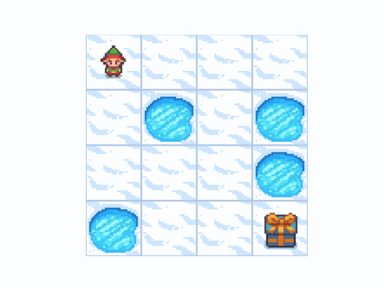
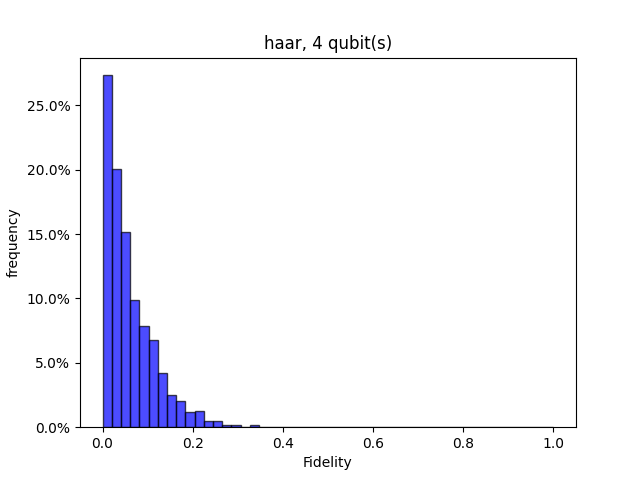
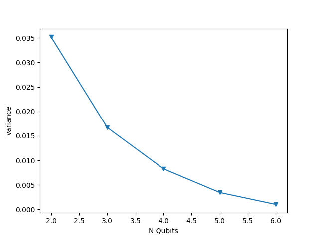
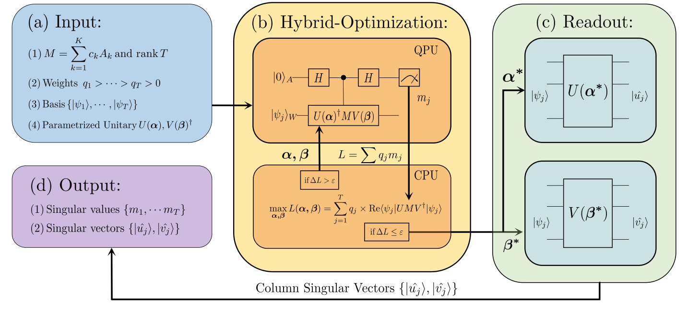
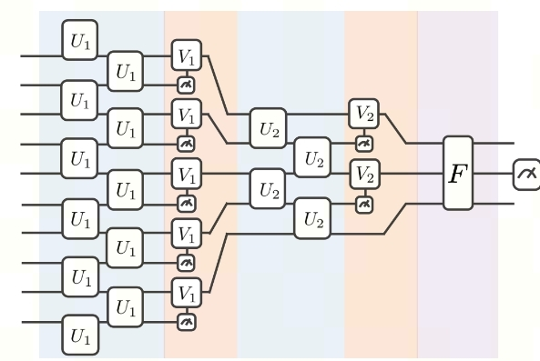
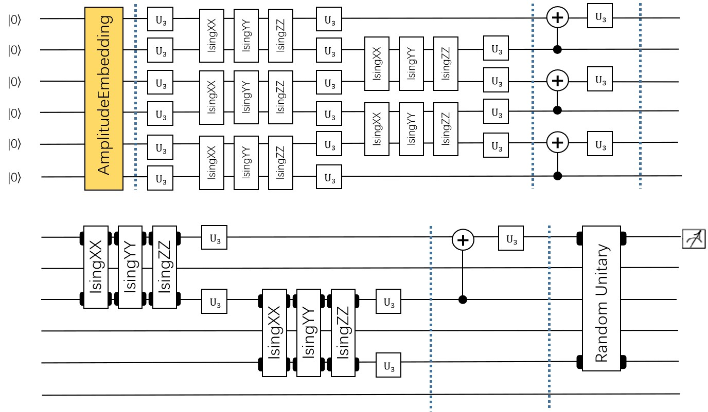
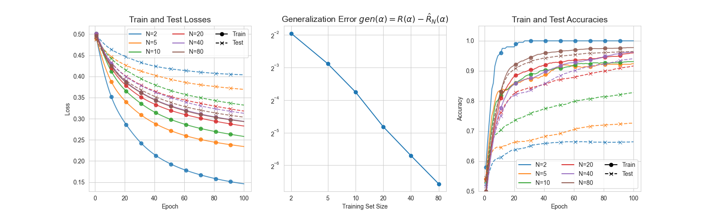

Quantum Machine Learning Demos
#################################

The following are some examples of quantum machine learning algorithms.  

Application of Parameterized Quantum Circuit in Classification Task
*****************************************************************************************************

1. QVC demo
========================================

This example uses VQNet to implement the algorithm in the thesis: `Circuit-centric quantum classifiers <https://arxiv.org/pdf/1804.00633.pdf>`_  .
This example is used to determine whether a binary number is odd or even. By encoding the binary number onto the qubit and optimizing the variable parameters in the circuit, 
the z-direction observation of the circuit can indicate whether the input is odd or even.

Quantum circuit
-------------------------------
The variable component sub-circuit usually defines a sub-circuit, which is a basic circuit architecture, and complex variational circuits can be constructed by repeating layers.
Our circuit layer consists of multiple rotating quantum logic gates and ``CNOT`` quantum logic gates that entangle each qubit with its neighboring qubits.
We also need a circuit to encode classical data into a quantum state, so that the output of the circuit measurement is related to the input.
In this example, we encode the binary input onto the qubits in the corresponding order. For example, the input data 1101 is encoded into 4 qubits.

.. math::

    x = 1101 \rightarrow|\psi\rangle=|1101\rangle

.. figure:: ./images/qvc_circuit.png
   :width: 600 px
   :align: center

|

.. code-block::

    import pyqpanda as pq

        def qvc_circuits(input,weights,qlist,clist,machine):

            def get_cnot(nqubits):
                cir = pq.QCircuit()
                for i in range(len(nqubits)-1):
                    cir.insert(pq.CNOT(nqubits[i],nqubits[i+1]))
                cir.insert(pq.CNOT(nqubits[len(nqubits)-1],nqubits[0]))
                return cir

            def build_circult(weights, xx, nqubits):

                def Rot(weights_j, qubits):
                    circult = pq.QCircuit()
                    circult.insert(pq.RZ(qubits, weights_j[0]))
                    circult.insert(pq.RY(qubits, weights_j[1]))
                    circult.insert(pq.RZ(qubits, weights_j[2]))
                    return circult
                def basisstate():
                    circult = pq.QCircuit()
                    for i in range(len(nqubits)):
                        if xx[i] == 1:
                            circult.insert(pq.X(nqubits[i]))
                    return circult

                circult = pq.QCircuit()
                circult.insert(basisstate())

                for i in range(weights.shape[0]):

                    weights_i = weights[i,:,:]
                    for j in range(len(nqubits)):
                        weights_j = weights_i[j]
                        circult.insert(Rot(weights_j,nqubits[j]))
                    cnots = get_cnot(nqubits)
                    circult.insert(cnots)

                circult.insert(pq.Z(nqubits[0]))

                prog = pq.QProg()
                prog.insert(circult)
                return prog

            weights = weights.reshape([2,4,3])
            prog = build_circult(weights,input,qlist)
            prob = machine.prob_run_dict(prog, qlist[0], -1)
            prob = list(prob.values())

            return prob

Model building
-----------------------
We have defined variable quantum circuits ``qvc_circuits`` . 
We hope to use it in our VQNet's automatic differentiation framework, 
to take advantage of VQNet's optimization fucntions for model training. 
We define a Model class, which inherits from the abstract class ``Module``.
The model uses the :ref:`QuantumLayer` class, which is a quantum computing layer that can be automatically differentiated. 
``qvc_circuits`` is the quantum circuit we want to run,
24 is the number of all quantum circuit parameters that need to be trained, 
"cpu" means that pyQPanda's full amplitude simulator is used here, 
and 4 means that 4 qubits need to be applied for.
In the ``forward()`` function, the user defines the logic of the model to run forward.

.. code-block::

    from pyvqnet.nn.module import Module
    from pyvqnet.optim.sgd import SGD
    from pyvqnet.nn.loss import CategoricalCrossEntropy
    from pyvqnet.tensor.tensor import QTensor
    from pyvqnet.data import data_generator as dataloader
    import pyqpanda as pq
    from pyvqnet.qnn.quantumlayer import QuantumLayer
    from pyqpanda import *
    class Model(Module):
        def __init__(self):
            super(Model, self).__init__()
            self.qvc = QuantumLayer(qvc_circuits,24,"cpu",4)

        def forward(self, x):
            return self.qvc(x)

Model training and testing
------------------------------------
We use pre-generated random binary numbers and their odd and even labels.
The data as follows.

.. code-block::

    import numpy as np
    import os
    qvc_train_data = [0,1,0,0,1,
    0, 1, 0, 1, 0,
    0, 1, 1, 0, 0,
    0, 1, 1, 1, 1,
    1, 0, 0, 0, 1,
    1, 0, 0, 1, 0,
    1, 0, 1, 0, 0,
    1, 0, 1, 1, 1,
    1, 1, 0, 0, 0,
    1, 1, 0, 1, 1,
    1, 1, 1, 0, 1,
    1, 1, 1, 1, 0]
    qvc_test_data= [0, 0, 0, 0, 0,
    0, 0, 0, 1, 1,
    0, 0, 1, 0, 1,
    0, 0, 1, 1, 0]

    def get_data(dataset_str):
        if dataset_str == "train":
            datasets = np.array(qvc_train_data)

        else:
            datasets = np.array(qvc_test_data)

        datasets = datasets.reshape([-1,5])
        data = datasets[:,:-1]
        label = datasets[:,-1].astype(int)
        label = np.eye(2)[label].reshape(-1,2)
        return data, label

Model forwarding, loss function calculation,
reverse calculation, optimizer calculation can perform like the general 
neural network training mode,until the number of iterations reaches the preset value.
The training data used is generated above, and the test data is qvc_test_data and train data is qvc_train_data.

.. code-block::

    def get_accuary(result,label):
        result,label = np.array(result.data), np.array(label.data)
        score = np.sum(np.argmax(result,axis=1)==np.argmax(label,1))
        return score

    model = Model()

    optimizer = SGD(model.parameters(),lr =0.1)

    batch_size = 3

    epoch = 20

    loss = CategoricalCrossEntropy()

    model.train()
    datas,labels = get_data("train")

    for i in range(epoch):
        count=0
        sum_loss = 0
        accuary = 0
        t = 0
        for data,label in dataloader(datas,labels,batch_size,False):
            optimizer.zero_grad()
            data,label = QTensor(data), QTensor(label)

            result = model(data)

            loss_b = loss(label,result)
            loss_b.backward()
            optimizer._step()
            sum_loss += loss_b.item()
            count+=batch_size
            accuary += get_accuary(result,label)
            t = t + 1

        print(f"epoch:{i}, #### loss:{sum_loss/count} #####accuray:{accuary/count}")

    model.eval()
    count = 0
    test_data,test_label = get_data("test")
    test_batch_size = 1
    accuary = 0
    sum_loss = 0
    for testd,testl in dataloader(test_data,test_label,test_batch_size):
        testd = QTensor(testd)
        test_result = model(testd)
        test_loss = loss(testl,test_result)
        sum_loss += test_loss
        count+=test_batch_size
        accuary += get_accuary(test_result,testl)
    print(f"test:--------------->loss:{sum_loss/count} #####accuray:{accuary/count}")

.. code-block::

    epoch:0, #### loss:0.20194714764753977 #####accuray:0.6666666666666666
    epoch:1, #### loss:0.19724808633327484 #####accuray:0.8333333333333334
    epoch:2, #### loss:0.19266503552595773 #####accuray:1.0
    epoch:3, #### loss:0.18812804917494455 #####accuray:1.0
    epoch:4, #### loss:0.1835678368806839 #####accuray:1.0
    epoch:5, #### loss:0.1789149840672811 #####accuray:1.0
    epoch:6, #### loss:0.17410411685705185 #####accuray:1.0
    epoch:7, #### loss:0.16908332953850427 #####accuray:1.0
    epoch:8, #### loss:0.16382796317338943 #####accuray:1.0
    epoch:9, #### loss:0.15835540741682053 #####accuray:1.0
    epoch:10, #### loss:0.15273457020521164 #####accuray:1.0
    epoch:11, #### loss:0.14708336691061655 #####accuray:1.0
    epoch:12, #### loss:0.14155150949954987 #####accuray:1.0
    epoch:13, #### loss:0.1362930883963903 #####accuray:1.0
    epoch:14, #### loss:0.1314386005202929 #####accuray:1.0
    epoch:15, #### loss:0.12707658857107162 #####accuray:1.0
    epoch:16, #### loss:0.123248390853405 #####accuray:1.0
    epoch:17, #### loss:0.11995399743318558 #####accuray:1.0
    epoch:18, #### loss:0.1171633576353391 #####accuray:1.0
    epoch:19, #### loss:0.11482855677604675 #####accuray:1.0
    [0.3412148654]
    test:--------------->loss:QTensor(0.3412148654, requires_grad=True) #####accuray:1.0

The following picture illustrates the curve of model's accuracy:

.. figure:: ./images/qvc_accuracy.png
   :width: 600 px
   :align: center

|

2. data re-uploading algorithm
=======================================
In a neural network, each neuron receives information from all neurons in the upper layer (Figure a). 
In contrast, the single-bit quantum classifier accepts the previous information processing unit and input (Figure b).
For traditional quantum circuits, when the data is uploaded, the result can be obtained directly through several unitary 
transformations :math:`U(\theta_1,\theta_2,\theta_3)`.However, in the Quantum Data Re upLoading (QDRL) task, the data needs to be re-uploaded before every unitary transformation.

                                                                .. centered:: Comparison of QDRL and classic neural network schematics

.. figure:: ./images/qdrl.png
   :width: 600 px
   :align: center

|

.. code-block::

    import sys
    sys.path.insert(0, "../")
    import numpy as np
    from pyvqnet.nn.linear import Linear
    from pyvqnet.qnn.qdrl.vqnet_model import vmodel
    from pyvqnet.optim import sgd
    from pyvqnet.nn.loss import CategoricalCrossEntropy
    from pyvqnet.tensor.tensor import QTensor
    from pyvqnet.nn.module import Module
    import matplotlib.pyplot as plt
    import matplotlib
    from pyvqnet.data import data_generator as get_minibatch_data
    try:
        matplotlib.use("TkAgg")
    except:  #pylint:disable=bare-except
        print("Can not use matplot TkAgg")
        pass

    np.random.seed(42)

    num_layers = 3
    params = np.random.uniform(size=(num_layers, 3))

    class Model(Module):
        def __init__(self):

            super(Model, self).__init__()
            self.pqc = vmodel(params.shape)
            self.fc2 = Linear(2, 2)

        def forward(self, x):
            x = self.pqc(x)
            return x

    def circle(samples: int, reps=np.sqrt(1 / 2)):
        data_x, data_y = [], []
        for _ in range(samples):
            x = np.random.rand(2)
            y = [0, 1]
            if np.linalg.norm(x) < reps:
                y = [1, 0]
            data_x.append(x)
            data_y.append(y)
        return np.array(data_x), np.array(data_y)

    def plot_data(x, y, fig=None, ax=None):

        if fig is None:
            fig, ax = plt.subplots(1, 1, figsize=(5, 5))
        reds = y == 0
        blues = y == 1
        ax.scatter(x[reds, 0], x[reds, 1], c="red", s=20, edgecolor="k")
        ax.scatter(x[blues, 0], x[blues, 1], c="blue", s=20, edgecolor="k")
        ax.set_xlabel("$x_1$")
        ax.set_ylabel("$x_2$")

    def get_score(pred, label):
        pred, label = np.array(pred.data), np.array(label.data)
        score = np.sum(np.argmax(pred, axis=1) == np.argmax(label, 1))
        return score

    model = Model()
    optimizer = sgd.SGD(model.parameters(), lr=1)

    def train():
        """
        Main function for train qdrl model
        """
        batch_size = 5
        model.train()
        x_train, y_train = circle(500)
        x_train = np.hstack((x_train, np.ones((x_train.shape[0], 1))))  # 500*3

        epoch = 10
        print("start training...........")
        for i in range(epoch):
            accuracy = 0
            count = 0
            loss = 0
            for data, label in get_minibatch_data(x_train, y_train, batch_size):
                optimizer.zero_grad()

                data, label = QTensor(data), QTensor(label)

                output = model(data)

                loss_fun = CategoricalCrossEntropy()
                losss = loss_fun(label, output)

                losss.backward()

                optimizer._step()
                accuracy += get_score(output, label)

                loss += losss.item()

                count += batch_size

            print(f"epoch:{i}, train_accuracy_for_each_batch:{accuracy/count}")
            print(f"epoch:{i}, train_loss_for_each_batch:{loss/count}")

    def test():
        batch_size = 5
        model.eval()
        print("start eval...................")
        x_test, y_test = circle(500)
        test_accuracy = 0
        count = 0
        x_test = np.hstack((x_test, np.ones((x_test.shape[0], 1))))

        for test_data, test_label in get_minibatch_data(x_test, y_test,
                                                        batch_size):

            test_data, test_label = QTensor(test_data), QTensor(test_label)
            output = model(test_data)
            test_accuracy += get_score(output, test_label)
            count += batch_size
        print(f"test_accuracy:{test_accuracy/count}")

    if __name__ == "__main__":
        train()
        test()

The following picture illustrates the curve of model's accuracy：

.. figure:: ./images/qdrl_accuracy.png
   :width: 600 px
   :align: center

|

3. VSQL: Variational Shadow Quantum Learning for Classification Model
================================================================================================================================================================
Using variable quantum circuits to construct a two-class classification model, 
comparing the classification accuracy with a neural network with similar parameter accuracy, 
the accuracy of the two is similar. The quantity of parameters of quantum circuits is much smaller than that of classical neural networks.
The algorithm is based on the paper: `Variational Shadow Quantum Learning for Classification Model <https://arxiv.org/abs/2012.08288>`_ to 
reproduce.

Following figure shows the architecture of VSQL algorithm:

.. figure:: ./images/vsql_model.PNG
   :width: 600 px
   :align: center

|

Following figures show the local quantum circuits structure on each qubits:

.. figure:: ./images/vsql_0.png
.. figure:: ./images/vsql_1.png
.. figure:: ./images/vsql_2.png
.. figure:: ./images/vsql_3.png
.. figure:: ./images/vsql_4.png
.. figure:: ./images/vsql_5.png
.. figure:: ./images/vsql_6.png
.. figure:: ./images/vsql_7.png
.. figure:: ./images/vsql_8.png

.. code-block::

    import sys
    sys.path.insert(0, "../")
    import os
    import os.path
    import struct
    import gzip
    from pyvqnet.nn.module import Module
    from pyvqnet.nn.loss import CategoricalCrossEntropy
    from pyvqnet.optim.adam import Adam
    from pyvqnet.data.data import data_generator
    from pyvqnet.tensor import tensor
    from pyvqnet.qnn.measure import expval
    from pyvqnet.qnn.quantumlayer import QuantumLayer
    from pyvqnet.qnn.template import AmplitudeEmbeddingCircuit
    from pyvqnet.nn.linear import Linear
    import numpy as np
    import pyqpanda as pq
    import matplotlib.pyplot as plt
    import matplotlib
    try:
        matplotlib.use("TkAgg")
    except:  #pylint:disable=bare-except
        print("Can not use matplot TkAgg")
        pass

    try:
        import urllib.request
    except ImportError:
        raise ImportError("You should use Python 3.x")

    url_base = "http://yann.lecun.com/exdb/mnist/"
    key_file = {
        "train_img": "train-images-idx3-ubyte.gz",
        "train_label": "train-labels-idx1-ubyte.gz",
        "test_img": "t10k-images-idx3-ubyte.gz",
        "test_label": "t10k-labels-idx1-ubyte.gz"
    }

    def _download(dataset_dir, file_name):
        """
        Download function for mnist dataset file
        """
        file_path = dataset_dir + "/" + file_name

        if os.path.exists(file_path):
            with gzip.GzipFile(file_path) as file:
                file_path_ungz = file_path[:-3].replace("\\", "/")
                if not os.path.exists(file_path_ungz):
                    open(file_path_ungz, "wb").write(file.read())
            return

        print("Downloading " + file_name + " ... ")
        urllib.request.urlretrieve(url_base + file_name, file_path)
        if os.path.exists(file_path):
            with gzip.GzipFile(file_path) as file:
                file_path_ungz = file_path[:-3].replace("\\", "/")
                file_path_ungz = file_path_ungz.replace("-idx", ".idx")
                if not os.path.exists(file_path_ungz):
                    open(file_path_ungz, "wb").write(file.read())
        print("Done")

    def download_mnist(dataset_dir):
        for v in key_file.values():
            _download(dataset_dir, v)

    if not os.path.exists("./result"):
        os.makedirs("./result")
    else:
        pass

    def circuits_of_vsql(x, weights, qlist, clist, machine):  #pylint:disable=unused-argument
        """
        VSQL model of quantum circuits
        """
        weights = weights.reshape([depth + 1, 3, n_qsc])

        def subcir(weights, qlist, depth, n_qsc, n_start):  #pylint:disable=redefined-outer-name
            cir = pq.QCircuit()

            for i in range(n_qsc):
                cir.insert(pq.RX(qlist[n_start + i], weights[0][0][i]))
                cir.insert(pq.RY(qlist[n_start + i], weights[0][1][i]))
                cir.insert(pq.RX(qlist[n_start + i], weights[0][2][i]))
            for repeat in range(1, depth + 1):
                for i in range(n_qsc - 1):
                    cir.insert(pq.CNOT(qlist[n_start + i], qlist[n_start + i + 1]))
                cir.insert(pq.CNOT(qlist[n_start + n_qsc - 1], qlist[n_start]))
                for i in range(n_qsc):
                    cir.insert(pq.RY(qlist[n_start + i], weights[repeat][1][i]))

            return cir

        def get_pauli_str(n_start, n_qsc):  #pylint:disable=redefined-outer-name
            pauli_str = ",".join("X" + str(i)
                                for i in range(n_start, n_start + n_qsc))
            return {pauli_str: 1.0}

        f_i = []
        origin_in = AmplitudeEmbeddingCircuit(x, qlist)
        for st in range(n - n_qsc + 1):
            psd = get_pauli_str(st, n_qsc)
            cir = pq.QCircuit()
            cir.insert(origin_in)
            cir.insert(subcir(weights, qlist, depth, n_qsc, st))
            prog = pq.QProg()
            prog.insert(cir)

            f_ij = expval(machine, prog, psd, qlist)
            f_i.append(f_ij)
        f_i = np.array(f_i)
        return f_i

    #GLOBAL VAR
    n = 10
    n_qsc = 2
    depth = 1

    class QModel(Module):
        """
        Model of VSQL
        """
        def __init__(self):
            super().__init__()
            self.vq = QuantumLayer(circuits_of_vsql, (depth + 1) * 3 * n_qsc,
                                "cpu", 10)
            self.fc = Linear(n - n_qsc + 1, 2)

        def forward(self, x):
            x = self.vq(x)
            x = self.fc(x)

            return x

    class Model(Module):
        def __init__(self):
            super().__init__()
            self.fc1 = Linear(input_channels=28 * 28, output_channels=2)

        def forward(self, x):

            x = tensor.flatten(x, 1)
            x = self.fc1(x)
            return x

    def load_mnist(dataset="training_data", digits=np.arange(2), path="./"):
        """
        load mnist data
        """
        from array import array as pyarray
        download_mnist(path)
        if dataset == "training_data":
            fname_image = os.path.join(path, "train-images.idx3-ubyte").replace(
                "\\", "/")
            fname_label = os.path.join(path, "train-labels.idx1-ubyte").replace(
                "\\", "/")
        elif dataset == "testing_data":
            fname_image = os.path.join(path, "t10k-images.idx3-ubyte").replace(
                "\\", "/")
            fname_label = os.path.join(path, "t10k-labels.idx1-ubyte").replace(
                "\\", "/")
        else:
            raise ValueError("dataset must be 'training_data' or 'testing_data'")

        flbl = open(fname_label, "rb")
        _, size = struct.unpack(">II", flbl.read(8))

        lbl = pyarray("b", flbl.read())
        flbl.close()

        fimg = open(fname_image, "rb")
        _, size, rows, cols = struct.unpack(">IIII", fimg.read(16))
        img = pyarray("B", fimg.read())
        fimg.close()

        ind = [k for k in range(size) if lbl[k] in digits]
        num = len(ind)
        images = np.zeros((num, rows, cols), dtype=np.float32)

        labels = np.zeros((num, 1), dtype=int)
        for i in range(len(ind)):
            images[i] = np.array(img[ind[i] * rows * cols:(ind[i] + 1) * rows *
                                    cols]).reshape((rows, cols))
            labels[i] = lbl[ind[i]]

        return images, labels

    def run_vsql():
        """
        VQSL MODEL
        """
        digits = [0, 1]
        x_train, y_train = load_mnist("training_data", digits)
        x_train = x_train / 255
        y_train = y_train.reshape(-1, 1)
        y_train = np.eye(len(digits))[y_train].reshape(-1, len(digits)).astype(
            np.int64)
        x_test, y_test = load_mnist("testing_data", digits)
        x_test = x_test / 255
        y_test = y_test.reshape(-1, 1)
        y_test = np.eye(len(digits))[y_test].reshape(-1,
                                                    len(digits)).astype(np.int64)

        x_train_list = []
        x_test_list = []
        for i in range(x_train.shape[0]):
            x_train_list.append(
                np.pad(x_train[i, :, :].flatten(), (0, 240),
                    constant_values=(0, 0)))
        x_train = np.array(x_train_list)

        for i in range(x_test.shape[0]):
            x_test_list.append(
                np.pad(x_test[i, :, :].flatten(), (0, 240),
                    constant_values=(0, 0)))

        x_test = np.array(x_test_list)

        x_train = x_train[:500]
        y_train = y_train[:500]

        x_test = x_test[:100]
        y_test = y_test[:100]
        print("model start")
        model = QModel()

        optimizer = Adam(model.parameters(), lr=0.1)

        model.train()
        result_file = open("./result/vqslrlt.txt", "w")
        for epoch in range(1, 3):

            model.train()
            full_loss = 0
            n_loss = 0
            n_eval = 0
            batch_size = 1
            correct = 0
            for x, y in data_generator(x_train,
                                    y_train,
                                    batch_size=batch_size,
                                    shuffle=True):
                optimizer.zero_grad()
                try:
                    x = x.reshape(batch_size, 1024)
                except:  #pylint:disable=bare-except
                    x = x.reshape(-1, 1024)

                output = model(x)
                cceloss = CategoricalCrossEntropy()
                loss = cceloss(y, output)
                loss.backward()
                optimizer._step()

                full_loss += loss.item()
                n_loss += batch_size
                np_output = np.array(output.data, copy=False)
                mask = np_output.argmax(1) == y.argmax(1)
                correct += sum(mask)
                print(f" n_loss {n_loss} Train Accuracy: {correct/n_loss} ")
            print(f"Train Accuracy: {correct/n_loss} ")
            print(f"Epoch: {epoch}, Loss: {full_loss / n_loss}")
            result_file.write(f"{epoch}\t{full_loss / n_loss}\t{correct/n_loss}\t")

            # Evaluation
            model.eval()
            print("eval")
            correct = 0
            full_loss = 0
            n_loss = 0
            n_eval = 0
            batch_size = 1
            for x, y in data_generator(x_test,
                                    y_test,
                                    batch_size=batch_size,
                                    shuffle=True):
                x = x.reshape(1, 1024)
                output = model(x)

                cceloss = CategoricalCrossEntropy()
                loss = cceloss(y, output)
                full_loss += loss.item()

                np_output = np.array(output.data, copy=False)
                mask = np_output.argmax(1) == y.argmax(1)
                correct += sum(mask)
                n_eval += 1
                n_loss += 1

            print(f"Eval Accuracy: {correct/n_eval}")
            result_file.write(f"{full_loss / n_loss}\t{correct/n_eval}\n")

        result_file.close()
        del model
        print("\ndone vqsl\n")

    if __name__ == "__main__":

        run_vsql()

The following shows the curve of model's accuacy and loss：

.. figure:: ./images/vsql_cacc.PNG
   :width: 600 px
   :align: center

.. figure:: ./images/vsql_closs.PNG
   :width: 600 px
   :align: center

.. figure:: ./images/vsql_qacc.PNG
   :width: 600 px
   :align: center

.. figure:: ./images/vsql_qloss.PNG
   :width: 600 px
   :align: center

|

4.Quanvolution for image classification
=======================================================================================================================

In this example, we implement a Quantum Convolutional Neural Network, a type originally introduced in the paper `Quanvolutional Neural Networks: Powering Image Recognition with Quantum Circuits <https://arxiv.org/abs/1904.04767>`_ method.

Similar to classic convolution, Quanvolution has the following steps:
A small region of the input image, in our case a 2×2 square of classical data, is embedded into the quantum circuit.
In this example, this is achieved by applying parameterized rotating logic gates to qubits initialized in the ground state. The convolutional kernel here generates variational circuits from stochastic circuits proposed in ref.
Finally, the quantum system is measured to obtain a list of classical expected values.
Similar to a classic convolutional layer, each expected value is mapped to a different channel of a single output pixel.
Repeating the same process over different regions, the complete input image can be scanned, producing an output object that will be constructed as a multi-channel image.
In order to perform classification tasks, this example uses the classic fully connected layer ``Linear`` to perform classification tasks after Quanvolution obtains the measurement values.
The main difference from classical convolution is that Quanvolution can generate highly complex kernels whose computation is at least in principle classically intractable.

|

Mnist dataset definition

.. code-block::

    import os
    import os.path
    import struct
    import gzip
    import sys
    sys.path.insert(0, "../")
    from pyvqnet.nn.module import Module
    from pyvqnet.nn.loss import NLL_Loss
    from pyvqnet.optim.adam import Adam
    from pyvqnet.data.data import data_generator
    from pyvqnet.tensor import tensor
    from pyvqnet.qnn.measure import expval
    from pyvqnet.nn.linear import Linear
    import numpy as np
    from pyvqnet.qnn.qcnn import Quanvolution
    import matplotlib.pyplot as plt
    import matplotlib
    try:
        matplotlib.use("TkAgg")
    except:  #pylint:disable=bare-except
        print("Can not use matplot TkAgg")
        pass

    try:
        import urllib.request
    except ImportError:
        raise ImportError("You should use Python 3.x")

    url_base = "http://yann.lecun.com/exdb/mnist/"
    key_file = {
        "train_img": "train-images-idx3-ubyte.gz",
        "train_label": "train-labels-idx1-ubyte.gz",
        "test_img": "t10k-images-idx3-ubyte.gz",
        "test_label": "t10k-labels-idx1-ubyte.gz"
    }

    def _download(dataset_dir, file_name):
        """
        Download function for mnist dataset file
        """
        file_path = dataset_dir + "/" + file_name

        if os.path.exists(file_path):
            with gzip.GzipFile(file_path) as file:
                file_path_ungz = file_path[:-3].replace("\\", "/")
                if not os.path.exists(file_path_ungz):
                    open(file_path_ungz, "wb").write(file.read())
            return

        print("Downloading " + file_name + " ... ")
        urllib.request.urlretrieve(url_base + file_name, file_path)
        if os.path.exists(file_path):
            with gzip.GzipFile(file_path) as file:
                file_path_ungz = file_path[:-3].replace("\\", "/")
                file_path_ungz = file_path_ungz.replace("-idx", ".idx")
                if not os.path.exists(file_path_ungz):
                    open(file_path_ungz, "wb").write(file.read())
        print("Done")

    def download_mnist(dataset_dir):
        for v in key_file.values():
            _download(dataset_dir, v)

    if not os.path.exists("./result"):
        os.makedirs("./result")
    else:
        pass

    def load_mnist(dataset="training_data", digits=np.arange(10), path="./"):
        """
        load mnist data
        """
        from array import array as pyarray
        download_mnist(path)
        if dataset == "training_data":
            fname_image = os.path.join(path, "train-images.idx3-ubyte").replace(
                "\\", "/")
            fname_label = os.path.join(path, "train-labels.idx1-ubyte").replace(
                "\\", "/")
        elif dataset == "testing_data":
            fname_image = os.path.join(path, "t10k-images.idx3-ubyte").replace(
                "\\", "/")
            fname_label = os.path.join(path, "t10k-labels.idx1-ubyte").replace(
                "\\", "/")
        else:
            raise ValueError("dataset must be 'training_data' or 'testing_data'")

        flbl = open(fname_label, "rb")
        _, size = struct.unpack(">II", flbl.read(8))

        lbl = pyarray("b", flbl.read())
        flbl.close()

        fimg = open(fname_image, "rb")
        _, size, rows, cols = struct.unpack(">IIII", fimg.read(16))
        img = pyarray("B", fimg.read())
        fimg.close()

        ind = [k for k in range(size) if lbl[k] in digits]
        num = len(ind)
        images = np.zeros((num, rows, cols))

        labels = np.zeros((num, 1), dtype=int)
        for i in range(len(ind)):
            images[i] = np.array(img[ind[i] * rows * cols:(ind[i] + 1) * rows *
                                    cols]).reshape((rows, cols))
            labels[i] = lbl[ind[i]]

        return images, labels

Module definition and process function's definition

.. code-block::

    class QModel(Module):

        def __init__(self):
            super().__init__()
            self.vq = Quanvolution([4, 2], (2, 2))
            self.fc = Linear(4 * 14 * 14, 10)

        def forward(self, x):
            x = self.vq(x)
            x = tensor.flatten(x, 1)
            x = self.fc(x)
            x = tensor.log_softmax(x)
            return x

    def run_quanvolution():

        digit = 10
        x_train, y_train = load_mnist("training_data", digits=np.arange(digit))
        x_train = x_train / 255

        y_train = y_train.flatten()

        x_test, y_test = load_mnist("testing_data", digits=np.arange(digit))

        x_test = x_test / 255
        y_test = y_test.flatten()

        x_train = x_train[:500]
        y_train = y_train[:500]

        x_test = x_test[:100]
        y_test = y_test[:100]

        print("model start")
        model = QModel()

        optimizer = Adam(model.parameters(), lr=5e-3)

        model.train()
        result_file = open("quanvolution.txt", "w")

        cceloss = NLL_Loss()
        N_EPOCH = 15

        for epoch in range(1, N_EPOCH):

            model.train()
            full_loss = 0
            n_loss = 0
            n_eval = 0
            batch_size = 10
            correct = 0
            for x, y in data_generator(x_train,
                                    y_train,
                                    batch_size=batch_size,
                                    shuffle=True):
                optimizer.zero_grad()
                try:
                    x = x.reshape(batch_size, 1, 28, 28)
                except:  #pylint:disable=bare-except
                    x = x.reshape(-1, 1, 28, 28)

                output = model(x)

                loss = cceloss(y, output)
                print(f"loss {loss}")
                loss.backward()
                optimizer._step()

                full_loss += loss.item()
                n_loss += batch_size
                np_output = np.array(output.data, copy=False)
                mask = np_output.argmax(1) == y

                correct += sum(mask)
                print(f"correct {correct}")
            print(f"Train Accuracy: {correct/n_loss}%")
            print(f"Epoch: {epoch}, Loss: {full_loss / n_loss}")
            result_file.write(f"{epoch}\t{full_loss / n_loss}\t{correct/n_loss}\t")

            # Evaluation
            model.eval()
            print("eval")
            correct = 0
            full_loss = 0
            n_loss = 0
            n_eval = 0
            batch_size = 1
            for x, y in data_generator(x_test,
                                    y_test,
                                    batch_size=batch_size,
                                    shuffle=True):
                x = x.reshape(-1, 1, 28, 28)
                output = model(x)

                loss = cceloss(y, output)
                full_loss += loss.item()

                np_output = np.array(output.data, copy=False)
                mask = np_output.argmax(1) == y
                correct += sum(mask)
                n_eval += 1
                n_loss += 1

            print(f"Eval Accuracy: {correct/n_eval}")
            result_file.write(f"{full_loss / n_loss}\t{correct/n_eval}\n")

        result_file.close()
        del model
        print("\ndone\n")

    if __name__ == "__main__":

        run_quanvolution()

Training set, verification set loss, training set, verification set classification accuracy with Epoch transformation.

.. code-block::

    # epoch train_loss      train_accuracy eval_loss    eval_accuracy
    # 1	0.2488900272846222	0.232	1.7297331787645818	0.39
    # 2	0.12281704187393189	0.646	1.201728610806167	0.61
    # 3	0.08001763761043548	0.772	0.8947569639235735	0.73
    # 4	0.06211201059818268	0.83	0.777864265316166	0.74
    # 5	0.052190632969141004	0.858	0.7291000287979841	0.76
    # 6	0.04542196464538574	0.87	0.6764470228599384	0.8
    # 7	0.04029472427070141	0.896	0.6153804161818698	0.79
    # 8	0.03600500610470772	0.902	0.5644993982824963	0.81
    # 9	0.03230033944547176	0.916	0.528938240573043	0.81
    # 10	0.02912954458594322	0.93	0.5058713140769396	0.83
    # 11	0.026443827204406262	0.936	0.49064547760412097	0.83
    # 12	0.024144304402172564	0.942	0.4800815625616815	0.82
    # 13	0.022141477409750223	0.952	0.4724775951183983	0.83
    # 14	0.020372112181037665	0.956	0.46692863543197743	0.83

Quantum AutoEncoder Demo
*******************************

1.Quantum AutoEncoder
=======================================

The classic autoencoder is a neural network that can learn high-efficiency low-dimensional representations of data in a high-dimensional space. 
The task of the autoencoder is to map x to a low-dimensional point y given an input x, so that x can be recovered from y.
The structure of the underlying autoencoder network can be selected to represent the data in a smaller dimension, thereby effectively compressing the input. 
Inspired by this idea, the model of quantum autoencoder is used to perform similar tasks on quantum data.
Quantum autoencoders are trained to compress specific data sets of quantum states, and classical compression algorithms cannot be used. 
The parameters of the quantum autoencoder are trained using classical optimization algorithms.
We show an example of a simple programmable circuit, which can be trained as an efficient autoencoder. 
We apply our model in the context of quantum simulation to compress the Hubbard model and the ground state of the Hamiltonian.
This algorithm is based on `Quantum autoencoders for efficient compression of quantum data <https://arxiv.org/pdf/1612.02806.pdf>`_ .

QAE quantum circuits:

.. figure:: ./images/QAE_Quantum_Cir.png
   :width: 600 px
   :align: center

|

.. code-block::

    import os
    import sys
    sys.path.insert(0,'../')
    import numpy as np
    from pyvqnet.nn.module import Module
    from pyvqnet.nn.loss import  fidelityLoss
    from pyvqnet.optim.adam import Adam
    from pyvqnet.data.data import data_generator
    from pyvqnet.qnn.qae.qae import QAElayer
    import matplotlib.pyplot as plt
    import matplotlib
    try:
        matplotlib.use('TkAgg')
    except:
        pass
    try:
        import urllib.request
    except ImportError:
        raise ImportError('You should use Python 3.x')
    import os.path
    import gzip

    url_base = 'http://yann.lecun.com/exdb/mnist/'
    key_file = {
        'train_img':'train-images-idx3-ubyte.gz',
        'train_label':'train-labels-idx1-ubyte.gz',
        'test_img':'t10k-images-idx3-ubyte.gz',
        'test_label':'t10k-labels-idx1-ubyte.gz'
    }

    def _download(dataset_dir,file_name):
        file_path = dataset_dir + "/" + file_name

        if os.path.exists(file_path):
            with gzip.GzipFile(file_path) as f:
                file_path_ungz = file_path[:-3].replace('\\', '/')
                if not os.path.exists(file_path_ungz):
                    open(file_path_ungz,"wb").write(f.read())
            return

        print("Downloading " + file_name + " ... ")
        urllib.request.urlretrieve(url_base + file_name, file_path)
        if os.path.exists(file_path):
                with gzip.GzipFile(file_path) as f:
                    file_path_ungz = file_path[:-3].replace('\\', '/')
                    file_path_ungz = file_path_ungz.replace('-idx', '.idx')
                    if not os.path.exists(file_path_ungz):
                        open(file_path_ungz,"wb").write(f.read())
        print("Done")

    def download_mnist(dataset_dir):
        for v in key_file.values():
            _download(dataset_dir,v)

    class Model(Module):

        def __init__(self, trash_num: int = 2, total_num: int = 7):
            super().__init__()
            self.pqc = QAElayer(trash_num, total_num)

        def forward(self, x):

            x = self.pqc(x)
            return x

    def load_mnist(dataset="training_data", digits=np.arange(2), path="./"):         
        import os, struct
        from array import array as pyarray
        download_mnist(path)
        if dataset == "training_data":
            fname_image = os.path.join(path, 'train-images.idx3-ubyte').replace('\\', '/')
            fname_label = os.path.join(path, 'train-labels.idx1-ubyte').replace('\\', '/')
        elif dataset == "testing_data":
            fname_image = os.path.join(path, 't10k-images.idx3-ubyte').replace('\\', '/')
            fname_label = os.path.join(path, 't10k-labels.idx1-ubyte').replace('\\', '/')
        else:
            raise ValueError("dataset must be 'training_data' or 'testing_data'")

        flbl = open(fname_label, 'rb')
        magic_nr, size = struct.unpack(">II", flbl.read(8))

        lbl = pyarray("b", flbl.read())
        flbl.close()

        fimg = open(fname_image, 'rb')
        magic_nr, size, rows, cols = struct.unpack(">IIII", fimg.read(16))
        img = pyarray("B", fimg.read())
        fimg.close()

        ind = [k for k in range(size) if lbl[k] in digits]
        N = len(ind)
        images = np.zeros((N, rows, cols))
        labels = np.zeros((N, 1), dtype=int)
        for i in range(len(ind)):
            images[i] = np.array(img[ind[i] * rows * cols: (ind[i] + 1) * rows * cols]).reshape((rows, cols))
            labels[i] = lbl[ind[i]]

        return images, labels

    def run2():
        ##load dataset

        x_train, y_train = load_mnist("training_data")                       
        x_train = x_train / 255                                             

        x_test, y_test = load_mnist("testing_data")

        x_test = x_test / 255

        x_train = x_train.reshape([-1, 1, 28, 28])
        x_test = x_test.reshape([-1, 1, 28, 28])
        x_train = x_train[:100, :, :, :]
        x_train = np.resize(x_train, [x_train.shape[0], 1, 2, 2])

        x_test = x_test[:10, :, :, :]
        x_test = np.resize(x_test, [x_test.shape[0], 1, 2, 2])
        encode_qubits = 4
        latent_qubits = 2
        trash_qubits = encode_qubits - latent_qubits
        total_qubits = 1 + trash_qubits + encode_qubits
        print("model start")
        model = Model(trash_qubits, total_qubits)

        optimizer = Adam(model.parameters(), lr=0.005)
        model.train()
        F1 = open("rlt.txt", "w")
        loss_list = []
        loss_list_test = []
        fidelity_train = []
        fidelity_val = []

        for epoch in range(1, 10):
            running_fidelity_train = 0
            running_fidelity_val = 0
            print(f"epoch {epoch}")
            model.train()
            full_loss = 0
            n_loss = 0
            n_eval = 0
            batch_size = 1
            correct = 0
            iter = 0
            if epoch %5 ==1:
                optimizer.lr  = optimizer.lr *0.5
            for x, y in data_generator(x_train, y_train, batch_size=batch_size, shuffle=True): #shuffle batch rather than data

                x = x.reshape((-1, encode_qubits))
                x = np.concatenate((np.zeros([batch_size, 1 + trash_qubits]), x), 1)
                optimizer.zero_grad()
                output = model(x)
                iter += 1
                np_out = np.array(output.data)
                floss = fidelityLoss()
                loss = floss(output)
                loss_data = np.array(loss.data)
                loss.backward()

                running_fidelity_train += np_out[0]
                optimizer._step()
                full_loss += loss_data[0]
                n_loss += batch_size
                np_output = np.array(output.data, copy=False)
                mask = np_output.argmax(1) == y.argmax(1)

                correct += sum(mask)

            loss_output = full_loss / n_loss
            print(f"Epoch: {epoch}, Loss: {loss_output}")
            loss_list.append(loss_output)

            # Evaluation
            model.eval()
            correct = 0
            full_loss = 0
            n_loss = 0
            n_eval = 0
            batch_size = 1
            for x, y in data_generator(x_test, y_test, batch_size=batch_size, shuffle=True):
                x = x.reshape((-1, encode_qubits))
                x = np.concatenate((np.zeros([batch_size, 1 + trash_qubits]),x),1)
                output = model(x)

                floss = fidelityLoss()
                loss = floss(output)
                loss_data = np.array(loss.data)
                full_loss += loss_data[0]
                running_fidelity_val += np.array(output.data)[0]

                n_eval += 1
                n_loss += 1

            loss_output = full_loss / n_loss
            print(f"Epoch: {epoch}, Loss: {loss_output}")
            loss_list_test.append(loss_output)

            fidelity_train.append(running_fidelity_train / 64)
            fidelity_val.append(running_fidelity_val / 64)

        figure_path = os.path.join(os.getcwd(), 'QAE-rate1.png')
        plt.plot(loss_list, color="blue", label="train")
        plt.plot(loss_list_test, color="red", label="validation")
        plt.title('QAE')
        plt.xlabel("Epochs")
        plt.ylabel("Loss")
        plt.legend(loc="upper right")
        plt.savefig(figure_path)
        plt.show()

        F1.write(f"done\n")
        F1.close()
        del model

    if __name__ == '__main__':
        run2()

The QAE error value obtained by running the above code, the loss is 1/fidelity, tending to 1 means the fidelity is close to 1.

.. figure:: ./images/qae_train_loss.png
   :width: 600 px
   :align: center

|

Quantum Circuits Structure Learning Demo
********************************************

1.Quantum circuits structure learning
===============================================================================

In the quantum circuit structure, the most frequently used quantum gates with parameters are `RZ` ,  `RY` , and  `RX`  gates, but which gate to use under what circumstances is a question worth studying. One method is random selection, but in this case It is very likely that the best results will not be achieved.
The core goal of Quantum circuit structure learning task is to find the optimal combination of quantum gates with parameters.
The approach here is that this set of optimal quantum logic gates should make the loss function to be the minimum.

.. code-block::

    """
    Quantum Circuits Strcture Learning Demo

    """
    import sys
    sys.path.insert(0,"../")

    import copy
    import pyqpanda as pq
    from pyvqnet.tensor.tensor import QTensor
    from pyvqnet.qnn.measure import expval
    import numpy as np
    import matplotlib.pyplot as plt
    import matplotlib
    try:
        matplotlib.use("TkAgg")
    except:  #pylint:disable=bare-except
        print("Can not use matplot TkAgg")
        pass

    machine = pq.CPUQVM()
    machine.init_qvm()
    nqbits = machine.qAlloc_many(2)

    def gen(param, generators, qbits, circuit):
        if generators == "X":
            circuit.insert(pq.RX(qbits, param))
        elif generators == "Y":
            circuit.insert(pq.RY(qbits, param))
        else:
            circuit.insert(pq.RZ(qbits, param))

    def circuits(params, generators, circuit):
        gen(params[0], generators[0], nqbits[0], circuit)
        gen(params[1], generators[1], nqbits[1], circuit)
        circuit.insert(pq.CNOT(nqbits[0], nqbits[1]))
        prog = pq.QProg()
        prog.insert(circuit)
        return prog

    def ansatz1(params: QTensor, generators):
        circuit = pq.QCircuit()
        params = params.to_numpy()
        prog = circuits(params, generators, circuit)
        return expval(machine, prog, {"Z0": 1},
                    nqbits), expval(machine, prog, {"Y1": 1}, nqbits)

    def ansatz2(params: QTensor, generators):
        circuit = pq.QCircuit()
        params = params.to_numpy()
        prog = circuits(params, generators, circuit)
        return expval(machine, prog, {"X0": 1}, nqbits)

    def loss(params, generators):
        z, y = ansatz1(params, generators)
        x = ansatz2(params, generators)
        return 0.5 * y + 0.8 * z - 0.2 * x

    def rotosolve(d, params, generators, cost, M_0):#pylint:disable=invalid-name
        """
        rotosolve algorithm implementation
        """
        params[d] = np.pi / 2.0
        m0_plus = cost(QTensor(params), generators)
        params[d] = -np.pi / 2.0
        m0_minus = cost(QTensor(params), generators)
        a = np.arctan2(2.0 * M_0 - m0_plus - m0_minus,
                    m0_plus - m0_minus)  # returns value in (-pi,pi]
        params[d] = -np.pi / 2.0 - a
        if params[d] <= -np.pi:
            params[d] += 2 * np.pi
        return cost(QTensor(params), generators)

    def optimal_theta_and_gen_helper(index, params, generators):
        """
        find optimal varaibles
        """
        params[index] = 0.
        m0 = loss(QTensor(params), generators)  #init value
        for kind in ["X", "Y", "Z"]:
            generators[index] = kind
            params_cost = rotosolve(index, params, generators, loss, m0)
            if kind == "X" or params_cost <= params_opt_cost:
                params_opt_d = params[index]
                params_opt_cost = params_cost
                generators_opt_d = kind
        return params_opt_d, generators_opt_d

    def rotoselect_cycle(params: np, generators):
        for index in range(params.shape[0]):
            params[index], generators[index] = optimal_theta_and_gen_helper(
                index, params, generators)
        return params, generators

    params = QTensor(np.array([0.3, 0.25]))
    params = params.to_numpy()
    generator = ["X", "Y"]
    generators = copy.deepcopy(generator)
    epoch = 20
    state_save = []
    for i in range(epoch):
        state_save.append(loss(QTensor(params), generators))
        params, generators = rotoselect_cycle(params, generators)

    print("Optimal generators are: {}".format(generators))
    print("Optimal params are: {}".format(params))
    steps = np.arange(0, epoch)

    plt.plot(steps, state_save, "o-")
    plt.title("rotoselect")
    plt.xlabel("cycles")
    plt.ylabel("cost")
    plt.yticks(np.arange(-1.25, 0.80, 0.25))
    plt.tight_layout()
    plt.show()

The quantum circuit structure obtained by running the above code contains :math:`RX`, one :math:`RY`

.. figure:: ./images/final_quantum_circuit.png
   :width: 600 px
   :align: center

|

And with the parameters in the quantum gate :math:`\theta_1`, :math:`\theta_2` change,Loss function has different values.

.. figure:: ./images/loss3d.png
   :width: 600 px
   :align: center

|

Hybird Quantum Classic Nerual Network Demo
********************************************

1.Hybrid Quantum Classic Neural Network Model
==============================================================================

Machine learning (ML) has become a successful interdisciplinary field that aims to extract generalizable information from data mathematically. 
Quantum machine learning seeks to use the principles of quantum mechanics to enhance machine learning, and vice versa.
Whether your goal is to enhance classical ML algorithms by outsourcing difficult calculations to quantum computers, 
or use classical ML architectures to optimize quantum algorithms-both fall into the category of quantum machine learning (QML).
In this chapter, we will explore how to partially quantify classical neural networks to create hybrid quantum classical neural networks. 
Quantum circuits are composed of quantum logic gates, and the quantum calculations implemented by 
these logic gates are proved to be differentiable by the paper `Quantum Circuit Learning <https://arxiv.org/abs/1803.00745>`_. 
Therefore, researchers try to put quantum circuits and classical neural network modules together for training on hybrid quantum classical machine learning tasks.
We will write a simple example to implement a neural network model training task using VQNet. 
The purpose of this example is to demonstrate the simplicity of VQNet and encourage ML practitioners to explore the possibilities of quantum computing.

Data Preparation
-----------------------

We will use `MNIST datasets <http://yann.lecun.com/exdb/mnist/>`_, the most basic neural network handwritten digit database as the classification data.
We first load MNIST and filter data samples containing 0 and 1.
These samples are divided into training data training_data and testing data testing_data, each of which has a dimension of 1*784.

.. code-block::

    import time
    import os
    import struct
    import gzip
    from pyvqnet.nn.module import Module
    from pyvqnet.nn.linear import Linear
    from pyvqnet.nn.conv import Conv2D

    from pyvqnet.nn import activation as F
    from pyvqnet.nn.pooling import MaxPool2D
    from pyvqnet.nn.loss import CategoricalCrossEntropy
    from pyvqnet.optim.adam import Adam
    from pyvqnet.data.data import data_generator
    from pyvqnet.tensor import tensor
    from pyvqnet.tensor import QTensor
    import pyqpanda as pq

    import numpy as np
    import matplotlib.pyplot as plt
    import matplotlib
    try:
        matplotlib.use("TkAgg")
    except:  #pylint:disable=bare-except
        print("Can not use matplot TkAgg")
        pass

    try:
        import urllib.request
    except ImportError:
        raise ImportError("You should use Python 3.x")

    url_base = 'http://yann.lecun.com/exdb/mnist/'
    key_file = {
        'train_img':'train-images-idx3-ubyte.gz',
        'train_label':'train-labels-idx1-ubyte.gz',
        'test_img':'t10k-images-idx3-ubyte.gz',
        'test_label':'t10k-labels-idx1-ubyte.gz'
    }

    def _download(dataset_dir,file_name):
        file_path = dataset_dir + "/" + file_name

        if os.path.exists(file_path):
            with gzip.GzipFile(file_path) as f:
                file_path_ungz = file_path[:-3].replace('\\', '/')
                if not os.path.exists(file_path_ungz):
                    open(file_path_ungz,"wb").write(f.read())
            return

        print("Downloading " + file_name + " ... ")
        urllib.request.urlretrieve(url_base + file_name, file_path)
        if os.path.exists(file_path):
                with gzip.GzipFile(file_path) as f:
                    file_path_ungz = file_path[:-3].replace('\\', '/')
                    file_path_ungz = file_path_ungz.replace('-idx', '.idx')
                    if not os.path.exists(file_path_ungz):
                        open(file_path_ungz,"wb").write(f.read())
        print("Done")

    def download_mnist(dataset_dir):
        for v in key_file.values():
            _download(dataset_dir,v)

    def load_mnist(dataset="training_data", digits=np.arange(2), path="./"):         
        import os, struct
        from array import array as pyarray
        download_mnist(path)
        if dataset == "training_data":
            fname_image = os.path.join(path, 'train-images.idx3-ubyte').replace('\\', '/')
            fname_label = os.path.join(path, 'train-labels.idx1-ubyte').replace('\\', '/')
        elif dataset == "testing_data":
            fname_image = os.path.join(path, 't10k-images.idx3-ubyte').replace('\\', '/')
            fname_label = os.path.join(path, 't10k-labels.idx1-ubyte').replace('\\', '/')
        else:
            raise ValueError("dataset must be 'training_data' or 'testing_data'")

        flbl = open(fname_label, 'rb')
        magic_nr, size = struct.unpack(">II", flbl.read(8))
        lbl = pyarray("b", flbl.read())
        flbl.close()

        fimg = open(fname_image, 'rb')
        magic_nr, size, rows, cols = struct.unpack(">IIII", fimg.read(16))
        img = pyarray("B", fimg.read())
        fimg.close()

        ind = [k for k in range(size) if lbl[k] in digits]
        N = len(ind)
        images = np.zeros((N, rows, cols))
        labels = np.zeros((N, 1), dtype=int)
        for i in range(len(ind)):
            images[i] = np.array(img[ind[i] * rows * cols: (ind[i] + 1) * rows * cols]).reshape((rows, cols))
            labels[i] = lbl[ind[i]]

        return images, labels

    def data_select(train_num, test_num):
        x_train, y_train = load_mnist("training_data")
        x_test, y_test = load_mnist("testing_data")
        # Train Leaving only labels 0 and 1
        idx_train = np.append(np.where(y_train == 0)[0][:train_num],
                        np.where(y_train == 1)[0][:train_num])
        x_train = x_train[idx_train]
        y_train = y_train[idx_train]
        x_train = x_train / 255
        y_train = np.eye(2)[y_train].reshape(-1, 2)
        # Test Leaving only labels 0 and 1
        idx_test = np.append(np.where(y_test == 0)[0][:test_num],
                        np.where(y_test == 1)[0][:test_num])
        x_test = x_test[idx_test]
        y_test = y_test[idx_test]
        x_test = x_test / 255
        y_test = np.eye(2)[y_test].reshape(-1, 2)
        return x_train, y_train, x_test, y_test

    n_samples_show = 6

    x_train, y_train, x_test, y_test = data_select(100, 50)
    fig, axes = plt.subplots(nrows=1, ncols=n_samples_show, figsize=(10, 3))

    for img ,targets in zip(x_test,y_test):
        if n_samples_show <= 3:
            break

        if targets[0] == 1:
            axes[n_samples_show - 1].set_title("Labeled: 0")
            axes[n_samples_show - 1].imshow(img.squeeze(), cmap='gray')
            axes[n_samples_show - 1].set_xticks([])
            axes[n_samples_show - 1].set_yticks([])
            n_samples_show -= 1

    for img ,targets in zip(x_test,y_test):
        if n_samples_show <= 0:
            break

        if targets[0] == 0:
            axes[n_samples_show - 1].set_title("Labeled: 1")
            axes[n_samples_show - 1].imshow(img.squeeze(), cmap='gray')
            axes[n_samples_show - 1].set_xticks([])
            axes[n_samples_show - 1].set_yticks([])
            n_samples_show -= 1

    plt.show()

.. figure:: ./images/mnsit_data_examples.png
   :width: 600 px
   :align: center

|

Construct Quantum Circuits
---------------------------------

In this example, we use the `pyQPanda <https://pyqpanda-tutorial-en.readthedocs.io/en/latest/chapter2/index.html#quantum-circuit>`__ , A simple quantum circuit of 1 qubit is defined. The circuit takes the output of the classical neural network layer as input,encodes quantum data through ``H`` , ``RY``  quantum logic gates, and calculates the expected value of Hamiltonian in the z direction as output.

.. code-block::

    from pyqpanda import *
    import pyqpanda as pq
    import numpy as np
    def circuit(weights):
        num_qubits = 1
        #Use pyQPanda to create a simulator 
        machine = pq.CPUQVM()
        machine.init_qvm()
        #Use pyQPanda to alloc qubits
        qubits = machine.qAlloc_many(num_qubits)
        #Use pyQPanda to alloc classic bits
        cbits = machine.cAlloc_many(num_qubits)
        #Construct circuits
        circuit = pq.QCircuit()
        circuit.insert(pq.H(qubits[0]))
        circuit.insert(pq.RY(qubits[0], weights[0]))
        #Construct quantum program
        prog = pq.QProg()
        prog.insert(circuit)
        #Defines measurement
        prog << measure_all(qubits, cbits)

        #run quantum with quantum measurements
        result = machine.run_with_configuration(prog, cbits, 100)
        
        counts = np.array(list(result.values()))
        states = np.array(list(result.keys())).astype(float)
        probabilities = counts / 100
        expectation = np.sum(states * probabilities)
        return expectation

.. figure:: ./images/hqcnn_quantum_cir.png
   :width: 600 px
   :align: center

|

Create Hybird Model
--------------------------

Since quantum circuits can perform automatic differentiation calculations together with classical neural networks,
Therefore, we can use VQNet's convolutional layer ``Conv2D`` , pooling layer ``MaxPool2D`` , fully connected layer ``Linear`` and
the quantum circuit to build model just now.
The definition of the `Net` and `Hybrid` classes inherit from the VQNet automatic differentiation module ``Module`` 
and the definition of the forward calculation is defined in forward function ``forward()``,
An automatic differentiation Model of convolution, quantum encoding, and measurement of the MNIST data is constructed to obtain the final features required for the classification task.

.. code-block::

    #Quantum computing layer front pass and the definition of gradient calculation function, which need to be inherited from the abstract class Module
    class Hybrid(Module):
        """ Hybrid quantum - Quantum layer definition """
        def __init__(self, shift):
            super(Hybrid, self).__init__()
            self.shift = shift
        def forward(self, input): 
            self.input = input
            expectation_z = circuit(np.array(input.data))
            result = [[expectation_z]]
            requires_grad = input.requires_grad and not QTensor.NO_GRAD
            def _backward(g, input):
                """ Backward pass computation """
                input_list = np.array(input.data)
                shift_right = input_list + np.ones(input_list.shape) * self.shift
                shift_left = input_list - np.ones(input_list.shape) * self.shift

                gradients = []
                for i in range(len(input_list)):
                    expectation_right = circuit(shift_right[i])
                    expectation_left = circuit(shift_left[i])

                    gradient = expectation_right - expectation_left
                    gradients.append(gradient)
                gradients = np.array([gradients]).T
                return gradients * np.array(g)

            nodes = []
            if input.requires_grad:
                nodes.append(QTensor.GraphNode(tensor=input, df=lambda g: _backward(g, input)))
            return QTensor(data=result, requires_grad=requires_grad, nodes=nodes)

    #Model definition
    class Net(Module):
        def __init__(self):
            super(Net, self).__init__()
            self.conv1 = Conv2D(input_channels=1, output_channels=6, kernel_size=(5, 5), stride=(1, 1), padding="valid")
            self.maxpool1 = MaxPool2D([2, 2], [2, 2], padding="valid")
            self.conv2 = Conv2D(input_channels=6, output_channels=16, kernel_size=(5, 5), stride=(1, 1), padding="valid")
            self.maxpool2 = MaxPool2D([2, 2], [2, 2], padding="valid")
            self.fc1 = Linear(input_channels=256, output_channels=64)
            self.fc2 = Linear(input_channels=64, output_channels=1)
            self.hybrid = Hybrid(np.pi / 2)
            self.fc3 = Linear(input_channels=1, output_channels=2)

        def forward(self, x):
            x = F.ReLu()(self.conv1(x))  # 1 6 24 24
            x = self.maxpool1(x)
            x = F.ReLu()(self.conv2(x))  # 1 16 8 8
            x = self.maxpool2(x)
            x = tensor.flatten(x, 1)   # 1 256
            x = F.ReLu()(self.fc1(x))  # 1 64
            x = self.fc2(x)    # 1 1
            x = self.hybrid(x)
            x = self.fc3(x)
            return x

.. figure:: ./images/hqcnnmodel.PNG
   :width: 600 px
   :align: center

|

Training and testing
-----------------------

For the hybrid neural network model as shown in the figure below, we calculate the loss function by feeding data into the model iteratively, 
and VQNet will  calculate the gradient of each parameter in the backward calculation automatically, 
and use the optimizer to optimize the parameters until the number of iterations meets the preset value.

.. figure:: ./images/hqcnnarch.PNG
   :width: 600 px
   :align: center

|

.. code-block::

    x_train, y_train, x_test, y_test = data_select(1000, 100)

    #Create a model
    model = Net() 
    #Use adam optimizer
    optimizer = Adam(model.parameters(), lr=0.005)
    #Use cross entropy loss
    loss_func = CategoricalCrossEntropy()

    #train epoches   
    epochs = 10
    train_loss_list = []
    val_loss_list = []
    train_acc_list =[]
    val_acc_list = []

    for epoch in range(1, epochs):
        total_loss = []
        model.train()
        batch_size = 1
        correct = 0
        n_train = 0
        for x, y in data_generator(x_train, y_train, batch_size=1, shuffle=True):

            x = x.reshape(-1, 1, 28, 28)

            optimizer.zero_grad()
            output = model(x)       
            loss = loss_func(y, output)  
            loss_np = np.array(loss.data)
            
            np_output = np.array(output.data, copy=False)
            mask = (np_output.argmax(1) == y.argmax(1))
            correct += np.sum(np.array(mask))
            n_train += batch_size

            loss.backward()
            optimizer._step()

            total_loss.append(loss_np)

        train_loss_list.append(np.sum(total_loss) / len(total_loss))
        train_acc_list.append(np.sum(correct) / n_train)
        print("{:.0f} loss is : {:.10f}".format(epoch, train_loss_list[-1]))

        model.eval()
        correct = 0
        n_eval = 0

        for x, y in data_generator(x_test, y_test, batch_size=1, shuffle=True):
            x = x.reshape(-1, 1, 28, 28)
            output = model(x)
            loss = loss_func(y, output)
            loss_np = np.array(loss.data)
            np_output = np.array(output.data, copy=False)
            mask = (np_output.argmax(1) == y.argmax(1))
            correct += np.sum(np.array(mask))
            n_eval += 1
            
            total_loss.append(loss_np)
        print(f"Eval Accuracy: {correct / n_eval}")
        val_loss_list.append(np.sum(total_loss) / len(total_loss))
        val_acc_list.append(np.sum(correct) / n_eval)

Visualization
---------------------

The visualization curve of data loss function and accuracy on train and test data.

.. code-block::

    import os
    plt.figure()
    xrange = range(1,len(train_loss_list)+1)
    figure_path = os.path.join(os.getcwd(), 'HQCNN LOSS.png')
    plt.plot(xrange,train_loss_list, color="blue", label="train")
    plt.plot(xrange,val_loss_list, color="red", label="validation")
    plt.title('HQCNN')
    plt.xlabel("Epochs")
    plt.ylabel("Loss")
    plt.xticks(np.arange(1, epochs +1,step = 2))
    plt.legend(loc="upper right")
    plt.savefig(figure_path)
    plt.show()

    plt.figure()
    figure_path = os.path.join(os.getcwd(), 'HQCNN Accuracy.png')
    plt.plot(xrange,train_acc_list, color="blue", label="train")
    plt.plot(xrange,val_acc_list, color="red", label="validation")
    plt.title('HQCNN')
    plt.xlabel("Epochs")
    plt.ylabel("Accuracy")
    plt.xticks(np.arange(1, epochs +1,step = 2))
    plt.legend(loc="lower right")
    plt.savefig(figure_path)
    plt.show()

.. figure:: ./images/HQCNNLOSS.png
   :width: 600 px
   :align: center

.. figure:: ./images/HQCNNAccuracy.png
   :width: 600 px
   :align: center

|

.. code-block::

    n_samples_show = 6
    count = 0
    fig, axes = plt.subplots(nrows=1, ncols=n_samples_show, figsize=(10, 3))
    model.eval()
    for x, y in data_generator(x_test, y_test, batch_size=1, shuffle=True):
        if count == n_samples_show:
            break
        x = x.reshape(-1, 1, 28, 28)
        output = model(x)
        pred = QTensor.argmax(output, [1],False)
        axes[count].imshow(x[0].squeeze(), cmap='gray')
        axes[count].set_xticks([])
        axes[count].set_yticks([])
        axes[count].set_title('Predicted {}'.format(np.array(pred.data)))
        count += 1
    plt.show()

.. figure:: ./images/eval_test.png
   :width: 600 px
   :align: center

|

2.Hybrid quantum classical transfer learning model
=======================================================================================================================
We apply a machine learning method called transfer learning to image classifier based on hybrid classical quantum
network. We will write a simple example of integrating PyQPanda with VQNet.Transfer learning is based on general intuition,
that is, if the pre-trained network is good at solving a given problem, it can also be used to solve a different
but related problem with only some additional training.

Quantum partial circuit diagram are illustrated below:

.. figure:: ./images/QTransferLearning_cir.png
   :width: 600 px
   :align: center

|

.. code-block::

    """
    Quantum Classic Nerual Network Transfer Learning demo

    """

    import os
    import sys
    sys.path.insert(0,'../')
    import numpy as np
    import matplotlib.pyplot as plt

    from pyvqnet.nn.module import Module
    from pyvqnet.nn.linear import Linear
    from pyvqnet.nn.conv import Conv2D
    from pyvqnet.utils.storage import load_parameters, save_parameters

    from pyvqnet.nn import activation as F
    from pyvqnet.nn.pooling import MaxPool2D

    from pyvqnet.nn.batch_norm import BatchNorm2d
    from pyvqnet.nn.loss import SoftmaxCrossEntropy

    from pyvqnet.optim.sgd import SGD
    from pyvqnet.optim.adam import Adam
    from pyvqnet.data.data import data_generator
    from pyvqnet.tensor import tensor
    from pyvqnet.tensor.tensor import QTensor
    import pyqpanda as pq
    from pyqpanda import *
    import matplotlib
    from pyvqnet.nn.module import *
    from pyvqnet.utils.initializer import *
    from pyvqnet.qnn.quantumlayer import QuantumLayer

    try:
        matplotlib.use('TkAgg')
    except:
        pass

    try:
        import urllib.request
    except ImportError:
        raise ImportError('You should use Python 3.x')
    import os.path
    import gzip

    url_base = 'http://yann.lecun.com/exdb/mnist/'
    key_file = {
        'train_img':'train-images-idx3-ubyte.gz',
        'train_label':'train-labels-idx1-ubyte.gz',
        'test_img':'t10k-images-idx3-ubyte.gz',
        'test_label':'t10k-labels-idx1-ubyte.gz'
    }

    def _download(dataset_dir,file_name):
        file_path = dataset_dir + "/" + file_name

        if os.path.exists(file_path):
            with gzip.GzipFile(file_path) as f:
                file_path_ungz = file_path[:-3].replace('\\', '/')
                if not os.path.exists(file_path_ungz):
                    open(file_path_ungz,"wb").write(f.read())
            return

        print("Downloading " + file_name + " ... ")
        urllib.request.urlretrieve(url_base + file_name, file_path)
        if os.path.exists(file_path):
                with gzip.GzipFile(file_path) as f:
                    file_path_ungz = file_path[:-3].replace('\\', '/')
                    file_path_ungz = file_path_ungz.replace('-idx', '.idx')
                    if not os.path.exists(file_path_ungz):
                        open(file_path_ungz,"wb").write(f.read())
        print("Done")

    def download_mnist(dataset_dir):
        for v in key_file.values():
            _download(dataset_dir,v)

    if not os.path.exists("./result"):
        os.makedirs("./result")
    else:
        pass
    # classical CNN
    class CNN(Module):
        def __init__(self):
            super(CNN, self).__init__()

            self.conv1 = Conv2D(input_channels=1, output_channels=16, kernel_size=(3, 3), stride=(1, 1), padding="valid")
            self.BatchNorm2d1 = BatchNorm2d(16)
            self.Relu1 = F.ReLu()

            self.conv2 = Conv2D(input_channels=16, output_channels=32, kernel_size=(3, 3), stride=(1, 1), padding="valid")
            self.BatchNorm2d2 = BatchNorm2d(32)
            self.Relu2 = F.ReLu()
            self.maxpool2 = MaxPool2D([2, 2], [2, 2], padding="valid")

            self.conv3 = Conv2D(input_channels=32, output_channels=64, kernel_size=(3, 3), stride=(1, 1), padding="valid")
            self.BatchNorm2d3 = BatchNorm2d(64)
            self.Relu3 = F.ReLu()

            self.conv4 = Conv2D(input_channels=64, output_channels=128, kernel_size=(3, 3), stride=(1, 1), padding="valid")
            self.BatchNorm2d4 = BatchNorm2d(128)
            self.Relu4 = F.ReLu()
            self.maxpool4 = MaxPool2D([2, 2], [2, 2], padding="valid")

            self.fc1 = Linear(input_channels=128 * 4 * 4, output_channels=1024)
            self.fc2 = Linear(input_channels=1024, output_channels=128)
            self.fc3 = Linear(input_channels=128, output_channels=10)

        def forward(self, x):

            x = self.Relu1(self.conv1(x))
            x = self.maxpool2(self.Relu2(self.conv2(x)))
            x = self.Relu3(self.conv3(x))
            x = self.maxpool4(self.Relu4(self.conv4(x)))
            x = tensor.flatten(x, 1)
            x = F.ReLu()(self.fc1(x))  # 1 64
            x = F.ReLu()(self.fc2(x))  # 1 64
            x = self.fc3(x)  # 1 1
            return x

    def load_mnist(dataset="training_data", digits=np.arange(2), path="./"):         
        import os, struct
        from array import array as pyarray
        download_mnist(path)
        if dataset == "training_data":
            fname_image = os.path.join(path, 'train-images.idx3-ubyte').replace('\\', '/')
            fname_label = os.path.join(path, 'train-labels.idx1-ubyte').replace('\\', '/')
        elif dataset == "testing_data":
            fname_image = os.path.join(path, 't10k-images.idx3-ubyte').replace('\\', '/')
            fname_label = os.path.join(path, 't10k-labels.idx1-ubyte').replace('\\', '/')
        else:
            raise ValueError("dataset must be 'training_data' or 'testing_data'")

        flbl = open(fname_label, 'rb')
        magic_nr, size = struct.unpack(">II", flbl.read(8))
        lbl = pyarray("b", flbl.read())
        flbl.close()

        fimg = open(fname_image, 'rb')
        magic_nr, size, rows, cols = struct.unpack(">IIII", fimg.read(16))
        img = pyarray("B", fimg.read())
        fimg.close()

        ind = [k for k in range(size) if lbl[k] in digits]
        N = len(ind)
        images = np.zeros((N, rows, cols))
        labels = np.zeros((N, 1), dtype=int)
        for i in range(len(ind)):
            images[i] = np.array(img[ind[i] * rows * cols: (ind[i] + 1) * rows * cols]).reshape((rows, cols))
            labels[i] = lbl[ind[i]]

        return images, labels

    """
    to get cnn model parameters for transfer learning
    """

    train_size = 10000
    eval_size = 1000
    EPOCHES = 100
    def classcal_cnn_model_making():
        # load train data
        x_train, y_train = load_mnist("training_data", digits=np.arange(10))
        x_test, y_test = load_mnist("testing_data", digits=np.arange(10))

        x_train = x_train[:train_size]
        y_train = y_train[:train_size]
        x_test = x_test[:eval_size]
        y_test = y_test[:eval_size]

        x_train = x_train / 255
        x_test = x_test / 255
        y_train = np.eye(10)[y_train].reshape(-1, 10)
        y_test = np.eye(10)[y_test].reshape(-1, 10)

        model = CNN()

        optimizer = SGD(model.parameters(), lr=0.005)
        loss_func = SoftmaxCrossEntropy()

        epochs = EPOCHES
        loss_list = []
        model.train()

        SAVE_FLAG = True
        temp_loss = 0
        for epoch in range(1, epochs):
            total_loss = []
            for x, y in data_generator(x_train, y_train, batch_size=4, shuffle=True):

                x = x.reshape(-1, 1, 28, 28)
                optimizer.zero_grad()
                # Forward pass
                output = model(x)

                # Calculating loss
                loss = loss_func(y, output)  # target output
                loss_np = np.array(loss.data)
                # Backward pass
                loss.backward()
                # Optimize the weights
                optimizer._step()

                total_loss.append(loss_np)

            loss_list.append(np.sum(total_loss) / len(total_loss))
            print("{:.0f} loss is : {:.10f}".format(epoch, loss_list[-1]))

            if SAVE_FLAG:
                temp_loss = loss_list[-1]
                save_parameters(model.state_dict(), "./result/QCNN_TL_1.model")
                SAVE_FLAG = False
            else:
                if temp_loss > loss_list[-1]:
                    temp_loss = loss_list[-1]
                    save_parameters(model.state_dict(), "./result/QCNN_TL_1.model")

        model.eval()
        correct = 0
        n_eval = 0

        for x, y in data_generator(x_test, y_test, batch_size=4, shuffle=True):
            x = x.reshape(-1, 1, 28, 28)
            output = model(x)
            loss = loss_func(y, output)
            np_output = np.array(output.data, copy=False)
            mask = (np_output.argmax(1) == y.argmax(1))
            correct += np.sum(np.array(mask))
            n_eval += 1
        print(f"Eval Accuracy: {correct / n_eval}")

        n_samples_show = 6
        count = 0
        fig, axes = plt.subplots(nrows=1, ncols=n_samples_show, figsize=(10, 3))
        model.eval()
        for x, y in data_generator(x_test, y_test, batch_size=1, shuffle=True):
            if count == n_samples_show:
                break
            x = x.reshape(-1, 1, 28, 28)
            output = model(x)
            pred = QTensor.argmax(output, [1],False)
            axes[count].imshow(x[0].squeeze(), cmap='gray')
            axes[count].set_xticks([])
            axes[count].set_yticks([])
            axes[count].set_title('Predicted {}'.format(np.array(pred.data)))
            count += 1
        plt.show()

    def classical_cnn_TransferLearning_predict():
        x_test, y_test = load_mnist("testing_data", digits=np.arange(10))

        x_test = x_test[:eval_size]
        y_test = y_test[:eval_size]
        x_test = x_test / 255
        y_test = np.eye(10)[y_test].reshape(-1, 10)
        model = CNN()

        model_parameter = load_parameters("./result/QCNN_TL_1.model")
        model.load_state_dict(model_parameter)
        model.eval()
        correct = 0
        n_eval = 0

        for x, y in data_generator(x_test, y_test, batch_size=1, shuffle=True):
            x = x.reshape(-1, 1, 28, 28)
            output = model(x)

            np_output = np.array(output.data, copy=False)
            mask = (np_output.argmax(1) == y.argmax(1))
            correct += np.sum(np.array(mask))
            n_eval += 1

        print(f"Eval Accuracy: {correct / n_eval}")

        n_samples_show = 6
        count = 0
        fig, axes = plt.subplots(nrows=1, ncols=n_samples_show, figsize=(10, 3))
        model.eval()
        for x, y in data_generator(x_test, y_test, batch_size=1, shuffle=True):
            if count == n_samples_show:
                break
            x = x.reshape(-1, 1, 28, 28)
            output = model(x)
            pred = QTensor.argmax(output, [1],False)
            axes[count].imshow(x[0].squeeze(), cmap='gray')
            axes[count].set_xticks([])
            axes[count].set_yticks([])
            axes[count].set_title('Predicted {}'.format(np.array(pred.data)))
            count += 1
        plt.show()

    def quantum_cnn_TransferLearning():

        n_qubits = 4  # Number of qubits
        q_depth = 6  # Depth of the quantum circuit (number of variational layers)

        def Q_H_layer(qubits, nqubits):
            """Layer of single-qubit Hadamard gates.
            """
            circuit = pq.QCircuit()
            for idx in range(nqubits):
                circuit.insert(pq.H(qubits[idx]))
            return circuit

        def Q_RY_layer(qubits, w):
            """Layer of parametrized qubit rotations around the y axis.
            """
            circuit = pq.QCircuit()
            for idx, element in enumerate(w):
                circuit.insert(pq.RY(qubits[idx], element))
            return circuit

        def Q_entangling_layer(qubits, nqubits):
            """Layer of CNOTs followed by another shifted layer of CNOT.
            """
            # In other words it should apply something like :
            # CNOT  CNOT  CNOT  CNOT...  CNOT
            #   CNOT  CNOT  CNOT...  CNOT
            circuit = pq.QCircuit()
            for i in range(0, nqubits - 1, 2):  # Loop over even indices: i=0,2,...N-2
                circuit.insert(pq.CNOT(qubits[i], qubits[i + 1]))
            for i in range(1, nqubits - 1, 2):  # Loop over odd indices:  i=1,3,...N-3
                circuit.insert(pq.CNOT(qubits[i], qubits[i + 1]))
            return circuit

        def Q_quantum_net(q_input_features, q_weights_flat, qubits, cubits, machine):
            """
            The variational quantum circuit.
            """
            machine = pq.CPUQVM()
            machine.init_qvm()
            qubits = machine.qAlloc_many(n_qubits)
            circuit = pq.QCircuit()

            # Reshape weights
            q_weights = q_weights_flat.reshape([q_depth, n_qubits])

            # Start from state |+> , unbiased w.r.t. |0> and |1>
            circuit.insert(Q_H_layer(qubits, n_qubits))

            # Embed features in the quantum node
            circuit.insert(Q_RY_layer(qubits, q_input_features))

            # Sequence of trainable variational layers
            for k in range(q_depth):
                circuit.insert(Q_entangling_layer(qubits, n_qubits))
                circuit.insert(Q_RY_layer(qubits, q_weights[k]))

            # Expectation values in the Z basis
            prog = pq.QProg()
            prog.insert(circuit)

            exp_vals = []
            for position in range(n_qubits):
                pauli_str = "Z" + str(position)
                pauli_map = pq.PauliOperator(pauli_str, 1)
                hamiltion = pauli_map.toHamiltonian(True)
                exp = machine.get_expectation(prog, hamiltion, qubits)
                exp_vals.append(exp)

            return exp_vals

        class Q_DressedQuantumNet(Module):

            def __init__(self):
                """
                Definition of the *dressed* layout.
                """

                super().__init__()
                self.pre_net = Linear(128, n_qubits)
                self.post_net = Linear(n_qubits, 10)
                self.temp_Q = QuantumLayer(Q_quantum_net, q_depth * n_qubits, "cpu", n_qubits, n_qubits)

            def forward(self, input_features):
                """
                Defining how tensors are supposed to move through the *dressed* quantum
                net.
                """

                # obtain the input features for the quantum circuit
                # by reducing the feature dimension from 512 to 4
                pre_out = self.pre_net(input_features)
                q_in = tensor.tanh(pre_out) * np.pi / 2.0
                q_out_elem = self.temp_Q(q_in)

                result = q_out_elem
                # return the two-dimensional prediction from the postprocessing layer
                return self.post_net(result)

        x_train, y_train = load_mnist("training_data", digits=np.arange(10))
        x_test, y_test = load_mnist("testing_data", digits=np.arange(10))
        x_train = x_train[:train_size]
        y_train = y_train[:train_size]
        x_test = x_test[:eval_size]
        y_test = y_test[:eval_size]

        x_train = x_train / 255
        x_test = x_test / 255
        y_train = np.eye(10)[y_train].reshape(-1, 10)
        y_test = np.eye(10)[y_test].reshape(-1, 10)

        model = CNN()
        model_param = load_parameters("./result/QCNN_TL_1.model")
        model.load_state_dict(model_param)

        loss_func = SoftmaxCrossEntropy()

        epochs = EPOCHES
        loss_list = []
        eval_losses = []

        model_hybrid = model
        print(model_hybrid)

        for param in model_hybrid.parameters():
            param.requires_grad = False
        model_hybrid.fc3 = Q_DressedQuantumNet()
        optimizer_hybrid = Adam(model_hybrid.fc3.parameters(), lr=0.001)
        model_hybrid.train()

        SAVE_FLAG = True
        temp_loss = 0
        for epoch in range(1, epochs):
            total_loss = []
            for x, y in data_generator(x_train, y_train, batch_size=4, shuffle=True):
                x = x.reshape(-1, 1, 28, 28)
                optimizer_hybrid.zero_grad()
                # Forward pass
                output = model_hybrid(x)

                loss = loss_func(y, output)  # target output
                loss_np = np.array(loss.data)
                # Backward pass
                loss.backward()
                # Optimize the weights
                optimizer_hybrid._step()
                total_loss.append(loss_np)

            loss_list.append(np.sum(total_loss) / len(total_loss))
            print("{:.0f} loss is : {:.10f}".format(epoch, loss_list[-1]))
            if SAVE_FLAG:
                temp_loss = loss_list[-1]
                save_parameters(model_hybrid.fc3.state_dict(), "./result/QCNN_TL_FC3.model")
                save_parameters(model_hybrid.state_dict(), "./result/QCNN_TL_ALL.model")
                SAVE_FLAG = False
            else:
                if temp_loss > loss_list[-1]:
                    temp_loss = loss_list[-1]
                    save_parameters(model_hybrid.fc3.state_dict(), "./result/QCNN_TL_FC3.model")
                    save_parameters(model_hybrid.state_dict(), "./result/QCNN_TL_ALL.model")

            correct = 0
            n_eval = 0
            loss_temp =[]
            for x1, y1 in data_generator(x_test, y_test, batch_size=4, shuffle=True):
                x1 = x1.reshape(-1, 1, 28, 28)
                output = model_hybrid(x1)
                loss = loss_func(y1, output)
                np_loss = np.array(loss.data)
                np_output = np.array(output.data, copy=False)
                mask = (np_output.argmax(1) == y1.argmax(1))
                correct += np.sum(np.array(mask))
                n_eval += 1
                loss_temp.append(np_loss)
            eval_losses.append(np.sum(loss_temp) / n_eval)
            print("{:.0f} eval loss is : {:.10f}".format(epoch, eval_losses[-1]))

        plt.title('model loss')
        plt.plot(loss_list, color='green', label='train_losses')
        plt.plot(eval_losses, color='red', label='eval_losses')
        plt.ylabel('loss')
        plt.legend(["train_losses", "eval_losses"])
        plt.savefig("qcnn_transfer_learning_classical")
        plt.show()
        plt.close()

        n_samples_show = 6
        count = 0
        fig, axes = plt.subplots(nrows=1, ncols=n_samples_show, figsize=(10, 3))
        model_hybrid.eval()
        for x, y in data_generator(x_test, y_test, batch_size=1, shuffle=True):
            if count == n_samples_show:
                break
            x = x.reshape(-1, 1, 28, 28)
            output = model_hybrid(x)
            pred = QTensor.argmax(output, [1],False)
            axes[count].imshow(x[0].squeeze(), cmap='gray')
            axes[count].set_xticks([])
            axes[count].set_yticks([])
            axes[count].set_title('Predicted {}'.format(np.array(pred.data)))
            count += 1
        plt.show()

    def quantum_cnn_TransferLearning_predict():

        n_qubits = 4  # Number of qubits
        q_depth = 6  # Depth of the quantum circuit (number of variational layers)

        def Q_H_layer(qubits, nqubits):
            """Layer of single-qubit Hadamard gates.
            """
            circuit = pq.QCircuit()
            for idx in range(nqubits):
                circuit.insert(pq.H(qubits[idx]))
            return circuit

        def Q_RY_layer(qubits, w):
            """Layer of parametrized qubit rotations around the y axis.
            """
            circuit = pq.QCircuit()
            for idx, element in enumerate(w):
                circuit.insert(pq.RY(qubits[idx], element))
            return circuit

        def Q_entangling_layer(qubits, nqubits):
            """Layer of CNOTs followed by another shifted layer of CNOT.
            """
            # In other words it should apply something like :
            # CNOT  CNOT  CNOT  CNOT...  CNOT
            #   CNOT  CNOT  CNOT...  CNOT
            circuit = pq.QCircuit()
            for i in range(0, nqubits - 1, 2):  # Loop over even indices: i=0,2,...N-2
                circuit.insert(pq.CNOT(qubits[i], qubits[i + 1]))
            for i in range(1, nqubits - 1, 2):  # Loop over odd indices:  i=1,3,...N-3
                circuit.insert(pq.CNOT(qubits[i], qubits[i + 1]))
            return circuit

        def Q_quantum_net(q_input_features, q_weights_flat, qubits, cubits, machine):
            """
            The variational quantum circuit.
            """
            machine = pq.CPUQVM()
            machine.init_qvm()
            qubits = machine.qAlloc_many(n_qubits)
            circuit = pq.QCircuit()

            # Reshape weights
            q_weights = q_weights_flat.reshape([q_depth, n_qubits])

            # Start from state |+> , unbiased w.r.t. |0> and |1>
            circuit.insert(Q_H_layer(qubits, n_qubits))

            # Embed features in the quantum node
            circuit.insert(Q_RY_layer(qubits, q_input_features))

            # Sequence of trainable variational layers
            for k in range(q_depth):
                circuit.insert(Q_entangling_layer(qubits, n_qubits))
                circuit.insert(Q_RY_layer(qubits, q_weights[k]))

            # Expectation values in the Z basis
            prog = pq.QProg()
            prog.insert(circuit)
            exp_vals = []
            for position in range(n_qubits):
                pauli_str = "Z" + str(position)
                pauli_map = pq.PauliOperator(pauli_str, 1)
                hamiltion = pauli_map.toHamiltonian(True)
                exp = machine.get_expectation(prog, hamiltion, qubits)
                exp_vals.append(exp)

            return exp_vals

        class Q_DressedQuantumNet(Module):

            def __init__(self):
                """
                Definition of the *dressed* layout.
                """

                super().__init__()
                self.pre_net = Linear(128, n_qubits)
                self.post_net = Linear(n_qubits, 10)
                self.temp_Q = QuantumLayer(Q_quantum_net, q_depth * n_qubits, "cpu", n_qubits, n_qubits)

            def forward(self, input_features):
                """
                Defining how tensors are supposed to move through the *dressed* quantum
                net.
                """

                # obtain the input features for the quantum circuit
                # by reducing the feature dimension from 512 to 4
                pre_out = self.pre_net(input_features)
                q_in = tensor.tanh(pre_out) * np.pi / 2.0
                q_out_elem = self.temp_Q(q_in)

                result = q_out_elem
                # return the two-dimensional prediction from the postprocessing layer
                return self.post_net(result)

        x_train, y_train = load_mnist("training_data", digits=np.arange(10))
        x_test, y_test = load_mnist("testing_data", digits=np.arange(10))
        x_train = x_train[:2000]
        y_train = y_train[:2000]
        x_test = x_test[:500]
        y_test = y_test[:500]

        x_train = x_train / 255
        x_test = x_test / 255
        y_train = np.eye(10)[y_train].reshape(-1, 10)
        y_test = np.eye(10)[y_test].reshape(-1, 10)

        model = CNN()
        model_hybrid = model
        model_hybrid.fc3 = Q_DressedQuantumNet()
        for param in model_hybrid.parameters():
            param.requires_grad = False
        model_param_quantum = load_parameters("./result/QCNN_TL_ALL.model")

        model_hybrid.load_state_dict(model_param_quantum)
        model_hybrid.eval()

        loss_func = SoftmaxCrossEntropy()
        eval_losses = []

        correct = 0
        n_eval = 0
        loss_temp =[]
        eval_batch_size = 4
        for x1, y1 in data_generator(x_test, y_test, batch_size=eval_batch_size, shuffle=True):
            x1 = x1.reshape(-1, 1, 28, 28)
            output = model_hybrid(x1)
            loss = loss_func(y1, output)
            np_loss = np.array(loss.data)
            np_output = np.array(output.data, copy=False)
            mask = (np_output.argmax(1) == y1.argmax(1))
            correct += np.sum(np.array(mask))

            n_eval += 1
            loss_temp.append(np_loss)

        eval_losses.append(np.sum(loss_temp) / n_eval)
        print(f"Eval Accuracy: {correct / (eval_batch_size*n_eval)}")

        n_samples_show = 6
        count = 0
        fig, axes = plt.subplots(nrows=1, ncols=n_samples_show, figsize=(10, 3))
        model_hybrid.eval()
        for x, y in data_generator(x_test, y_test, batch_size=1, shuffle=True):
            if count == n_samples_show:
                break
            x = x.reshape(-1, 1, 28, 28)
            output = model_hybrid(x)
            pred = QTensor.argmax(output, [1],False)
            axes[count].imshow(x[0].squeeze(), cmap='gray')
            axes[count].set_xticks([])
            axes[count].set_yticks([])
            axes[count].set_title('Predicted {}'.format(np.array(pred.data)))
            count += 1
        plt.show()

    if __name__ == "__main__":
        # save classic model parameters
        if not os.path.exists('./result/QCNN_TL_1.model'):
            classcal_cnn_model_making()
            classical_cnn_TransferLearning_predict()
        #train quantum circuits.
        print("use exist cnn model param to train quantum parameters.")
        quantum_cnn_TransferLearning()
        #eval quantum circuits.
        quantum_cnn_TransferLearning_predict()

Loss on training set

.. figure:: ./images/qcnn_transfer_learning_classical.png
   :width: 600 px
   :align: center

|

Run classification on test set

.. figure:: ./images/qcnn_transfer_learning_predict.png
   :width: 600 px
   :align: center

|

3. Hybrid quantum classical Unet network model
==============================================================================

Image segmentation Image segmentation is a classical problem in the research of computer vision and has become a hot
spot in the field of image understanding. Image segmentation an important part of image understanding, and one of the most difficult problems in image processing.
The so-called image segmentation refers to the segmentation based on gray, color and spatial texture The image
is divided into several disjoint regions by features such as theory and geometry, so that these features show
consistency or similarity in the same region and obvious differences between different regions. In short,
it is to give a picture and classify each pixel on the picture. Separate the pixel regions belonging
to different objects. `Unet <https://arxiv.org/abs/1505.04597>`_ is a classical image segmentation algorithm.

Here, we explore how to partially quantify the classical neural network to create a hybrid quantum classical
`QUnet`  neural network. We will write a simple example of integrating `pyQPanda <https://pyqpanda-tutorial-en.readthedocs.io/en/latest/>`__ with `VQNet` .
Qunet is mainly used to solve the technology of image segmentation.

Data preparation
-------------------------

We will use the data of `VOC2012 <http://host.robots.ox.ac.uk/pascal/VOC/voc2012/#devkit>`_  official library as image segmentation data. These samples are divided
into training data training_data and test data testing_data.

.. figure:: ./images/Unet_data_imshow.png
   :width: 600 px
   :align: center

|

Constructing quantum circuits
-------------------------------------------
In this example, we define a quantum circuit using pyqpanda of the source quantum. The input 3-channel color
image data is compressed into a single channel gray image and stored, and then the feature of the data is
extracted and dimensionality reduced by quantum convolution operation.

.. figure:: ./images/qunet_cir.png
   :width: 600 px
   :align: center

|

Import necessary libraries and functions

.. code-block::

    import os
    import numpy as np
    from pyvqnet.nn.module import Module
    from pyvqnet.nn.conv import Conv2D, ConvT2D
    from pyvqnet.nn import activation as F
    from pyvqnet.nn.batch_norm import BatchNorm2d
    from pyvqnet.nn.loss import BinaryCrossEntropy
    from pyvqnet.optim.adam import Adam
    from pyvqnet.dtype import *
    from pyvqnet.tensor import tensor,kfloat32
    from pyvqnet.tensor.tensor import QTensor
    import pyqpanda as pq
    from pyqpanda import *
    from pyvqnet.utils.storage import load_parameters, save_parameters

    import matplotlib
    try:
        matplotlib.use('TkAgg')
    except:
        pass
    import matplotlib.pyplot as plt

    import cv2

Preprocessing data

.. code-block::

    # Preprocessing data
    class PreprocessingData:
        def __init__(self, path):
            self.path = path
            self.x_data = []
            self.y_label = []

        def processing(self):
            list_path = os.listdir((self.path+"/images"))
            for i in range(len(list_path)):

                temp_data = cv2.imread(self.path+"/images" + '/' + list_path[i], cv2.IMREAD_COLOR)
                temp_data = cv2.resize(temp_data, (128, 128))
                grayimg = cv2.cvtColor(temp_data, cv2.COLOR_BGR2GRAY)
                temp_data = grayimg.reshape(temp_data.shape[0], temp_data.shape[0], 1).astype(np.float32)
                self.x_data.append(temp_data)

                label_data = cv2.imread(self.path+"/labels" + '/' +list_path[i].split(".")[0] + ".png", cv2.IMREAD_COLOR)
                label_data = cv2.resize(label_data, (128, 128))

                label_data = cv2.cvtColor(label_data, cv2.COLOR_BGR2GRAY)
                label_data = label_data.reshape(label_data.shape[0], label_data.shape[0], 1).astype(np.int64)
                self.y_label.append(label_data)

            return self.x_data, self.y_label

        def read(self):
            self.x_data, self.y_label = self.processing()
            x_data = np.array(self.x_data)
            y_label = np.array(self.y_label)

            return x_data, y_label

    # Quantum coding circuit
    class QCNN_:
        def __init__(self, image):
            self.image = image

        def encode_cir(self, qlist, pixels):
            cir = pq.QCircuit()
            for i, pix in enumerate(pixels):
                theta = np.arctan(pix)
                phi = np.arctan(pix**2)
                cir.insert(pq.RY(qlist[i], theta))
                cir.insert(pq.RZ(qlist[i], phi))
            return cir

        def entangle_cir(self, qlist):
            k_size = len(qlist)
            cir = pq.QCircuit()
            for i in range(k_size):
                ctr = i
                ctred = i+1
                if ctred == k_size:
                    ctred = 0
                cir.insert(pq.CNOT(qlist[ctr], qlist[ctred]))
            return cir

        def qcnn_circuit(self, pixels):
            k_size = len(pixels)
            machine = pq.MPSQVM()
            machine.init_qvm()
            qlist = machine.qAlloc_many(k_size)
            cir = pq.QProg()

            cir.insert(self.encode_cir(qlist, np.array(pixels) * np.pi / 2))
            cir.insert(self.entangle_cir(qlist))

            result0 = machine.prob_run_list(cir, [qlist[0]], -1)
            result1 = machine.prob_run_list(cir, [qlist[1]], -1)
            result2 = machine.prob_run_list(cir, [qlist[2]], -1)
            result3 = machine.prob_run_list(cir, [qlist[3]], -1)

            result = [result0[-1]+result1[-1]+result2[-1]+result3[-1]]
            machine.finalize()
            return result

    def quanconv_(image):
        """Convolves the input image with many applications of the same quantum circuit."""
        out = np.zeros((64, 64, 1))
        
        for j in range(0, 128, 2):
            for k in range(0, 128, 2):
                # Process a squared 2x2 region of the image with a quantum circuit
                q_results = QCNN_(image).qcnn_circuit(
                    [
                        image[j, k, 0],
                        image[j, k + 1, 0],
                        image[j + 1, k, 0],
                        image[j + 1, k + 1, 0]
                    ]
                )
                
                for c in range(1):
                    out[j // 2, k // 2, c] = q_results[c]
        return out

    def quantum_data_preprocessing(images):
        quantum_images = []
        for _, img in enumerate(images):
            quantum_images.append(quanconv_(img))
        quantum_images = np.asarray(quantum_images)
        return quantum_images

Constructing hybrid classical quantum neural network
----------------------------------------------------------

According to the Unet network framework, we use the `VQNet` framework to build the classic network part.
The down-sampling neural network layer is used to reduce the dimension and extract features;
The up-sampling neural network layer is used to restore the dimension; The up and down sampling layers
are connected through concatenate for feature fusion.

.. figure:: ./images/Unet.png
   :width: 600 px
   :align: center

|

.. code-block::

    # Definition of down sampling neural network layer
    class DownsampleLayer(Module):
        def __init__(self, in_ch, out_ch):
            super(DownsampleLayer, self).__init__()
            self.conv1 = Conv2D(input_channels=in_ch, output_channels=out_ch, kernel_size=(3, 3), stride=(1, 1),
                                padding="same")
            self.BatchNorm2d1 = BatchNorm2d(out_ch)
            self.Relu1 = F.ReLu()
            self.conv2 = Conv2D(input_channels=out_ch, output_channels=out_ch, kernel_size=(3, 3), stride=(1, 1),
                                padding="same")
            self.BatchNorm2d2 = BatchNorm2d(out_ch)
            self.Relu2 = F.ReLu()
            self.conv3 = Conv2D(input_channels=out_ch, output_channels=out_ch, kernel_size=(3, 3), stride=(2, 2),
                                padding="(1,1))
            self.BatchNorm2d3 = BatchNorm2d(out_ch)
            self.Relu3 = F.ReLu()

        def forward(self, x):
            """
            :param x:
            :return: out(Output to deep)，out_2(enter to next level)，
            """
            x1 = self.conv1(x)
            x2 = self.BatchNorm2d1(x1)
            x3 = self.Relu1(x2)
            x4 = self.conv2(x3)
            x5 = self.BatchNorm2d2(x4)
            out = self.Relu2(x5)
            x6 = self.conv3(out)
            x7 = self.BatchNorm2d3(x6)
            out_2 = self.Relu3(x7)
            return out, out_2

    # Definition of up sampling neural network layer
    class UpSampleLayer(Module):
        def __init__(self, in_ch, out_ch):
            super(UpSampleLayer, self).__init__()

            self.conv1 = Conv2D(input_channels=in_ch, output_channels=out_ch * 2, kernel_size=(3, 3), stride=(1, 1),
                                padding="same")
            self.BatchNorm2d1 = BatchNorm2d(out_ch * 2)
            self.Relu1 = F.ReLu()
            self.conv2 = Conv2D(input_channels=out_ch * 2, output_channels=out_ch * 2, kernel_size=(3, 3), stride=(1, 1),
                                padding="same")
            self.BatchNorm2d2 = BatchNorm2d(out_ch * 2)
            self.Relu2 = F.ReLu()

            self.conv3 = ConvT2D(input_channels=out_ch * 2, output_channels=out_ch, kernel_size=(3, 3), stride=(2, 2),
                                 padding=(1,1))
            self.BatchNorm2d3 = BatchNorm2d(out_ch)
            self.Relu3 = F.ReLu()

        def forward(self, x):
            '''
            :param x: input conv layer
            :param out: connect with UpsampleLayer
            :return:
            '''
            x = self.conv1(x)
            x = self.BatchNorm2d1(x)
            x = self.Relu1(x)
            x = self.conv2(x)
            x = self.BatchNorm2d2(x)
            x = self.Relu2(x)
            x = self.conv3(x)
            x = self.BatchNorm2d3(x)
            x_out = self.Relu3(x)
            return x_out

    # Unet overall network architecture
    class UNet(Module):
        def __init__(self):
            super(UNet, self).__init__()
            out_channels = [2 ** (i + 4) for i in range(5)]

            # DownSampleLayer
            self.d1 = DownsampleLayer(1, out_channels[0])  # 3-64
            self.d2 = DownsampleLayer(out_channels[0], out_channels[1])  # 64-128
            self.d3 = DownsampleLayer(out_channels[1], out_channels[2])  # 128-256
            self.d4 = DownsampleLayer(out_channels[2], out_channels[3])  # 256-512
            # UpSampleLayer
            self.u1 = UpSampleLayer(out_channels[3], out_channels[3])  # 512-1024-512
            self.u2 = UpSampleLayer(out_channels[4], out_channels[2])  # 1024-512-256
            self.u3 = UpSampleLayer(out_channels[3], out_channels[1])  # 512-256-128
            self.u4 = UpSampleLayer(out_channels[2], out_channels[0])  # 256-128-64
            # output
            self.conv1 = Conv2D(input_channels=out_channels[1], output_channels=out_channels[0], kernel_size=(3, 3),
                                stride=(1, 1), padding="same")
            self.BatchNorm2d1 = BatchNorm2d(out_channels[0])
            self.Relu1 = F.ReLu()
            self.conv2 = Conv2D(input_channels=out_channels[0], output_channels=out_channels[0], kernel_size=(3, 3),
                                stride=(1, 1), padding="same")
            self.BatchNorm2d2 = BatchNorm2d(out_channels[0])
            self.Relu2 = F.ReLu()
            self.conv3 = Conv2D(input_channels=out_channels[0], output_channels=1, kernel_size=(3, 3),
                                stride=(1, 1), padding="same")
            self.Sigmoid = F.Sigmoid()

        def forward(self, x):
            out_1, out1 = self.d1(x)
            out_2, out2 = self.d2(out1)
            out_3, out3 = self.d3(out2)
            out_4, out4 = self.d4(out3)

            out5 = self.u1(out4)
            out5_pad_out4 = tensor.pad2d(out5, (1, 0, 1, 0), 0)
            cat_out5 = tensor.concatenate([out5_pad_out4, out_4], axis=1)

            out6 = self.u2(cat_out5)
            out6_pad_out_3 = tensor.pad2d(out6, (1, 0, 1, 0), 0)
            cat_out6 = tensor.concatenate([out6_pad_out_3, out_3], axis=1)

            out7 = self.u3(cat_out6)
            out7_pad_out_2 = tensor.pad2d(out7, (1, 0, 1, 0), 0)
            cat_out7 = tensor.concatenate([out7_pad_out_2, out_2], axis=1)

            out8 = self.u4(cat_out7)
            out8_pad_out_1 = tensor.pad2d(out8, (1, 0, 1, 0), 0)
            cat_out8 = tensor.concatenate([out8_pad_out_1, out_1], axis=1)
            out = self.conv1(cat_out8)
            out = self.BatchNorm2d1(out)
            out = self.Relu1(out)
            out = self.conv2(out)
            out = self.BatchNorm2d2(out)
            out = self.Relu2(out)
            out = self.conv3(out)
            out = self.Sigmoid(out)
            return out

Training and model saving
-------------------------------

Similar to the training of classical neural network model,
we also need to instantiate the model, define the loss function and optimizer, and define the whole training and
testing process. For the hybrid neural network model as shown in the figure below, we calculate the loss value in
forward function the gradient of each parameter in
reverse calculation automatically, and use the optimizer to optimize the parameters until the number of
iterations meets the preset value.If ``PREPROCESS`` is False，the code will skip the quantum data preprocessing.

.. code-block::

    PREPROCESS = True

    class MyDataset():
        def __init__(self, x_data, x_label):
            self.x_set = x_data
            self.label = x_label

        def __getitem__(self, item):
            img, target = self.x_set[item], self.label[item]
            img_np = np.uint8(img).transpose(2, 0, 1)
            target_np = np.uint8(target).transpose(2, 0, 1)

            img = img_np
            target = target_np
            return img, target

        def __len__(self):
            return len(self.x_set)

    if not os.path.exists("./result"):
        os.makedirs("./result")
    else:
        pass
    if not os.path.exists("./Intermediate_results"):
        os.makedirs("./Intermediate_results")
    else:
        pass

    # prepare train/test data and label
    path0 = 'training_data'
    path1 = 'testing_data'
    train_images, train_labels = PreprocessingData(path0).read()
    test_images, test_labels = PreprocessingData(path1).read()

    print('train: ', train_images.shape, '\ntest: ', test_images.shape)
    print('train: ', train_labels.shape, '\ntest: ', test_labels.shape)
    train_images = train_images / 255
    test_images = test_images / 255

    # use quantum encoder to preprocess data

    if PREPROCESS == True:
        print("Quantum pre-processing of train images:")
        q_train_images = quantum_data_preprocessing(train_images)
        q_test_images = quantum_data_preprocessing(test_images)
        q_train_label = quantum_data_preprocessing(train_labels)
        q_test_label = quantum_data_preprocessing(test_labels)

        # Save pre-processed images
        print('Quantum Data Saving...')
        np.save("./result/q_train.npy", q_train_images)
        np.save("./result/q_test.npy", q_test_images)
        np.save("./result/q_train_label.npy", q_train_label)
        np.save("./result/q_test_label.npy", q_test_label)
        print('Quantum Data Saving Over!')

    # loading quantum data
    SAVE_PATH = "./result/"
    train_x = np.load(SAVE_PATH + "q_train.npy")
    train_labels = np.load(SAVE_PATH + "q_train_label.npy")
    test_x = np.load(SAVE_PATH + "q_test.npy")
    test_labels = np.load(SAVE_PATH + "q_test_label.npy")

    train_x = train_x.astype(np.uint8)
    test_x = test_x.astype(np.uint8)
    train_labels = train_labels.astype(np.uint8)
    test_labels = test_labels.astype(np.uint8)
    train_y = train_labels
    test_y = test_labels

    trainset = MyDataset(train_x, train_y)

    x_train = []
    y_label = []
    model = UNet()
    optimizer = Adam(model.parameters(), lr=0.01)
    loss_func = BinaryCrossEntropy()
    epochs = 200

    loss_list = []
    SAVE_FLAG = True
    temp_loss = 0
    file = open("./result/result.txt", 'w').close()
    for epoch in range(1, epochs):
        total_loss = []
        model.train()
        for i, (x, y) in enumerate(trainset):
            x_img = QTensor(x, dtype=kfloat32)
            x_img_Qtensor = tensor.unsqueeze(x_img, 0)
            y_img = QTensor(y, dtype=kfloat32)
            y_img_Qtensor = tensor.unsqueeze(y_img, 0)
            optimizer.zero_grad()
            img_out = model(x_img_Qtensor)

            print(f"=========={epoch}==================")
            loss = loss_func(y_img_Qtensor, img_out)  # target output
            if i == 1:
                plt.figure()
                plt.subplot(1, 2, 1)
                plt.title("predict")
                img_out_tensor = tensor.squeeze(img_out, 0)

                if matplotlib.__version__ >= '3.4.2':
                    plt.imshow(np.array(img_out_tensor.data).transpose([1, 2, 0]))
                else:
                    plt.imshow(np.array(img_out_tensor.data).transpose([1, 2, 0]).squeeze(2))
                plt.subplot(1, 2, 2)
                plt.title("label")
                y_img_tensor = tensor.squeeze(y_img_Qtensor, 0)
                if matplotlib.__version__ >= '3.4.2':
                    plt.imshow(np.array(y_img_tensor.data).transpose([1, 2, 0]))
                else:
                    plt.imshow(np.array(y_img_tensor.data).transpose([1, 2, 0]).squeeze(2))

                plt.savefig("./Intermediate_results/" + str(epoch) + "_" + str(i) + ".jpg")

            loss_data = np.array(loss.data)
            print("{} - {} loss_data: {}".format(epoch, i, loss_data))
            loss.backward()
            optimizer._step()
            total_loss.append(loss_data)

        loss_list.append(np.sum(total_loss) / len(total_loss))
        out_read = open("./result/result.txt", 'a')
        out_read.write(str(loss_list[-1]))
        out_read.write(str("\n"))
        out_read.close()
        print("{:.0f} loss is : {:.10f}".format(epoch, loss_list[-1]))
        if SAVE_FLAG:
            temp_loss = loss_list[-1]
            save_parameters(model.state_dict(), "./result/Q-Unet_End.model")
            SAVE_FLAG = False
        else:
            if temp_loss > loss_list[-1]:
                temp_loss = loss_list[-1]
                save_parameters(model.state_dict(), "./result/Q-Unet_End.model")

Data visualization
-----------------------

The loss function curve of training data is displayed and saved, and the test data results are saved.

.. code-block::

    out_read = open("./result/result.txt", 'r')
    plt.figure()
    lines_read = out_read.readlines()
    data_read = []
    for line in lines_read:
        float_line = float(line)
        data_read.append(float_line)
    out_read.close()
    plt.plot(data_read)
    plt.title('Unet Training')
    plt.xlabel('Training Iterations')
    plt.ylabel('Loss')
    plt.savefig("./result/traing_loss.jpg")

    modela = load_parameters("./result/Q-Unet_End.model")
    print("----------------PREDICT-------------")
    model.load_state_dict(modela)
    model.eval()

    for i, (x1, y1) in enumerate(testset):
        x_img = QTensor(x1, dtype=kfloat32)
        x_img_Qtensor = tensor.unsqueeze(x_img, 0)
        y_img = QTensor(y1, dtype=kfloat32)
        y_img_Qtensor = tensor.unsqueeze(y_img, 0)
        img_out = model(x_img_Qtensor)
        loss = loss_func(y_img_Qtensor, img_out)
        loss_data = np.array(loss.data)
        print("{} loss_eval: {}".format(i, loss_data))
        plt.figure()
        plt.subplot(1, 2, 1)
        plt.title("predict")
        img_out_tensor = tensor.squeeze(img_out, 0)
        if matplotlib.__version__ >= '3.4.2':
            plt.imshow(np.array(img_out_tensor.data).transpose([1, 2, 0]))
        else:
            plt.imshow(np.array(img_out_tensor.data).transpose([1, 2, 0]).squeeze(2))
        plt.subplot(1, 2, 2)
        plt.title("label")
        y_img_tensor = tensor.squeeze(y_img_Qtensor, 0)
        if matplotlib.__version__ >= '3.4.2':
            plt.imshow(np.array(y_img_tensor.data).transpose([1, 2, 0]))
        else:
            plt.imshow(np.array(y_img_tensor.data).transpose([1, 2, 0]).squeeze(2))
        plt.savefig("./result/" + str(i) + "_1" + ".jpg")
    print("end!")

Loss on training set

.. figure:: ./images/qunet_train_loss.png
   :width: 600 px
   :align: center

|

Run classification on test set

.. figure:: ./images/qunet_eval_1.jpg
   :width: 600 px
   :align: center

.. figure:: ./images/qunet_eval_2.jpg
   :width: 600 px
   :align: center

.. figure:: ./images/qunet_eval_3.jpg
   :width: 600 px
   :align: center

|

4.Hybrid quantum-classical QCNN network model
===============================================================================

We introduce and analyze a novel quantum machine learning model powered by convolutional neural networks.
`Quantum Convolutional Neural Networks <https://arxiv.org/pdf/1810.03787.pdf>`_ is an algorithm for solving classical image classification.
We will write a simple example of integrating `pyQPanda <https://pyqpanda-toturial.readthedocs.io/zh/latest/>`_ with `VQNet`.

Building Hybrid Classical-Quantum Neural Networks
-----------------------------------------------------------

.. code-block::

    import random
    import numpy as np
    import pyqpanda as pq
    from qiskit.utils import algorithm_globals
    from pyvqnet.qnn.measure import expval
    from scipy.optimize import minimize
    from abc import abstractmethod
    from sklearn.model_selection import train_test_split
    from sklearn.base import ClassifierMixin
    import matplotlib.pyplot as plt
    import matplotlib
    try:
        matplotlib.use("TkAgg")
    except:  #pylint:disable=bare-except
        print("Can not use matplot TkAgg")

    def network(input_data, weights):
        datasets = np.array(input_data)
        number_of_qubits = 8
        circuit_data = []
        for x in datasets:
            machine = pq.CPUQVM()
            machine.init_qvm()
            qlist = machine.qAlloc_many(number_of_qubits)
            clist = machine.cAlloc_many(number_of_qubits)

            circuit = pq.QCircuit()
            circuit.insert(build_VQNet_cir(qlist, number_of_qubits, x, weights))

            prog = pq.QProg()
            prog.insert(circuit)

            pauli_dict = {'Z7': 1}
            exp2 = expval(machine, prog, pauli_dict, qlist)
            circuit_data.append([exp2])

        output = np.array(circuit_data).reshape([-1, 1])

        return output

    class ObjectiveFunction:
        # pylint: disable=invalid-name
        def __init__(
            self, X: np.ndarray, y: np.ndarray, neural_network
        ) -> None:
            """
            Args:
                X: The input data.
                y: The target values.
                neural_network: An instance of an quantum neural network to be used by this
                    objective function.
            """
            super().__init__()
            self._X = X
            self._num_samples = X.shape[0]
            self._y = y
            self._neural_network = neural_network
            self._last_forward_weights = None
            self._last_forward = None
            self._loss_result = []

        @abstractmethod
        def objective(self, weights: np.ndarray) -> float:
            """Computes the value of this objective function given weights.

            Args:
                weights: an array of weights to be used in the objective function.

            Returns:
                Value of the function.
            """
            raise NotImplementedError

        @abstractmethod
        def gradient(self, weights: np.ndarray) -> np.ndarray:
            """Computes gradients of this objective function given weights.

            Args:
                weights: an array of weights to be used in the objective function.

            Returns:
                Gradients of the function.
            """
            raise NotImplementedError

        def _neural_network_forward(self, weights: np.ndarray):
            """
            Computes and caches the results of the forward pass. Cached values may be re-used in
            gradient computation.

            Args:
                weights: an array of weights to be used in the forward pass.

            Returns:
                The result of the neural network.
            """
            # if we get the same weights, we don't compute the forward pass again.
            if self._last_forward_weights is None or (
                not np.all(np.isclose(weights, self._last_forward_weights))
            ):
                # compute forward and cache the results for re-use in backward
                self._last_forward = self._neural_network(self._X, weights)
                # a copy avoids keeping a reference to the same array, so we are sure we have
                # different arrays on the next iteration.
                self._last_forward_weights = np.copy(weights)
            return self._last_forward

        def _neural_network_backward(self, weights: np.ndarray):

            datasetsy = np.array(self._y)
            datasetsy = datasetsy.reshape([-1, 1])

            weights1 = weights + np.pi / 2
            weights2 = weights - np.pi / 2
            exp1 = self._neural_network_forward(weights1)
            exp2 = self._neural_network_forward(weights2)

            circuit_grad = (exp1 - exp2) / 2
            output = self._neural_network_forward(weights)
            result = 2 * (output - datasetsy)
            grad = result[:, 0] @ circuit_grad
            grad = grad.reshape(1, -1) / self._X.shape[0]
            return grad

    class BinaryObjectiveFunction(ObjectiveFunction):
        """An objective function for binary representation of the output,
        e.g. classes of ``-1`` and ``+1``."""

        def objective(self, weights: np.ndarray) -> float:
            # predict is of shape (N, 1), where N is a number of samples
            output = self._neural_network_forward(weights)
            datasetsy = np.array(self._y).reshape([-1, 1])
            if len(output.shape) <= 1:
                loss_data = (output - datasetsy) ** 2
            else:
                loss_data = np.linalg.norm(output - datasetsy, axis=tuple(range(1, len(output.shape)))) ** 2

            result = float(np.sum(loss_data) / self._X.shape[0])
            self._loss_result.append(result)
            return np.average(np.array(result))

        def gradient(self, weights: np.ndarray) -> np.ndarray:
            # weight grad is of shape (N, 1, num_weights)
            weight_grad = self._neural_network_backward(weights)
            return weight_grad

        def loss_value(self):
            # get loss curve data
            return self._loss_result

    class VQNet_QCNN(ClassifierMixin):
        def __init__(self, forward_func=None, init_weight=None, optimizer=None):
            """
            forward_func: An instance of an quantum neural network.
            init_weight: Initial weight for the optimizer to start from.
            optimizer: An instance of an optimizer to be used in training. When `None` defaults to L-BFGS-B.
            """
            self.init_weight = init_weight
            self._fit_result = None
            self._forward_func = forward_func
            self._optimizer = optimizer
            self._loss_result = []

        def fit(self, X: np.ndarray, y: np.ndarray): # pylint: disable=invalid-name
            """
            Function operation to solve the optimal solution.
            """
            function = BinaryObjectiveFunction(X, y, self._forward_func)
            self._fit_result = minimize(fun=function.objective, x0=self.init_weight,
                                        method=self._optimizer, jac=function.gradient)
            self._loss_result.append(function.loss_value())
            return self._fit_result.x

        def predict(self, X:np.ndarray):
            """
            Predict
            """
            if self._fit_result is None:
                raise Exception("Model needs to be fit to some training data first!")

            return np.sign(self._forward_func(X, self._fit_result.x))

        # pylint: disable=invalid-name
        def score(
            self, X: np.ndarray, y: np.ndarray, sample_weight=None
        ) -> float:
            """
            Calculate the score.
            """
            result_score = ClassifierMixin.score(self, X, y, sample_weight)
            return result_score

        def get_loss_value(self):
            """
            Get loss curve data.
            """
            result = self._loss_result
            return result

    def ZFeatureMap_VQNet(qlist, n_qbits, weights):
        r"""The first order Pauli Z-evolution circuit.
        On 3 qubits and with 2 repetitions the circuit is represented by:

        .. parsed-literal::
            ┌───┐┌──────────────┐┌───┐┌──────────────┐
            ┤ H ├┤ U1(2.0*x[0]) ├┤ H ├┤ U1(2.0*x[0]) ├
            ├───┤├──────────────┤├───┤├──────────────┤
            ┤ H ├┤ U1(2.0*x[1]) ├┤ H ├┤ U1(2.0*x[1]) ├
            ├───┤├──────────────┤├───┤├──────────────┤
            ┤ H ├┤ U1(2.0*x[2]) ├┤ H ├┤ U1(2.0*x[2]) ├
            └───┘└──────────────┘└───┘└──────────────┘

        """
        circuit = pq.QCircuit()
        for i in range(n_qbits):
            circuit.insert(pq.H(qlist[i]))
            circuit.insert(pq.U1(qlist[i], 2.0*weights[i]))
            circuit.insert(pq.H(qlist[i]))
            circuit.insert(pq.U1(qlist[i], 2.0*weights[i]))
        return circuit

    def conv_circuit_VQNet(qlist, n_qbits, weights):
        """
        Quantum Convolutional
        """
        circuit = pq.QCircuit()
        circuit.insert(pq.RZ(qlist[1], -np.pi))
        circuit.insert(pq.CNOT(qlist[1], qlist[0]))
        circuit.insert(pq.RZ(qlist[0], weights[0]))
        circuit.insert(pq.RY(qlist[1], weights[1]))
        circuit.insert(pq.CNOT(qlist[0], qlist[1]))
        circuit.insert(pq.RY(qlist[1], weights[2]))
        circuit.insert(pq.CNOT(qlist[1], qlist[0]))
        circuit.insert(pq.RZ(qlist[0], np.pi))
        return circuit

    def conv_layer_VQNet(qlist, n_qbits, weights):
        """
         Define the Convolutional Layers of our QCNN
        """
        qubits = list(range(n_qbits))
        param_index = 0
        cir = pq.QCircuit()

        for q1, q2 in zip(qubits[0::2], qubits[1::2]):
            qlist_q = [qlist[q1], qlist[q2]]
            cir.insert(conv_circuit_VQNet(qlist_q, n_qbits, weights[param_index:(param_index + 3)]))
            cir.insert(pq.BARRIER(qlist))
            param_index += 3

        for q1, q2 in zip(qubits[1::2], qubits[2::2] + [0]):
            qlist_q = [qlist[q1], qlist[q2]]
            cir.insert(conv_circuit_VQNet(qlist_q, n_qbits, weights[param_index:(param_index + 3)]))
            cir.insert(pq.BARRIER(qlist))
            param_index += 3

        return cir

    def pool_circuit_VQNet(qlist, n_qbits, weights):
        """
        Quantum Pool
        """
        cir = pq.QCircuit()
        cir.insert(pq.RZ(qlist[1], -np.pi))
        cir.insert(pq.CNOT(qlist[1], qlist[0]))
        cir.insert(pq.RZ(qlist[0], weights[0]))
        cir.insert(pq.RY(qlist[1], weights[1]))
        cir.insert(pq.CNOT(qlist[0], qlist[1]))
        cir.insert(pq.RY(qlist[1], weights[2]))

        return cir

    def pool_layer_VQNet(sources, sinks, qlist, n_qbits, weights):
        """
        Create a QCNN Pooling Layer
        """
        num_qubits = len(sources) + len(sinks)
        if num_qubits != n_qbits:
            raise ValueError("the number of qubits is error!")
        param_index = 0
        cir = pq.QCircuit()
        for source, sink in zip(sources, sinks):
            qlist_q = [qlist[source], qlist[sink]]
            cir.insert(pool_circuit_VQNet(qlist_q, n_qbits, weights[param_index:(param_index + 3)]))
            cir.insert(pq.BARRIER(qlist))
            param_index += 3

        return cir

    def build_VQNet_cir(qubits, n_qbits, input_data, weights):
        """
        Create a VQNet Quantum Convolutional Neural Network.
        """
        circuit = pq.QCircuit()
        circuit.insert(ZFeatureMap_VQNet(qubits, n_qbits, input_data))
        circuit.insert(conv_layer_VQNet(qubits, n_qbits, weights))
        sources = [0, 1, 2, 3]
        sinks = [4, 5, 6, 7]
        circuit.insert(pool_layer_VQNet(sources, sinks, qubits, n_qbits, weights))

        qubits_select_4_8 = qubits[4:8]
        n_qbits_len_4_8 = len(qubits_select_4_8)
        circuit.insert(conv_layer_VQNet(qubits_select_4_8, n_qbits_len_4_8, weights))
        sources = [0, 1]
        sinks = [2, 3]
        circuit.insert(pool_layer_VQNet(sources, sinks, qubits_select_4_8, n_qbits_len_4_8, weights))

        qubits_select_6_8 = qubits[6:8]
        n_qbits_len_6_8 = len(qubits_select_6_8)
        circuit.insert(conv_layer_VQNet(qubits_select_6_8, n_qbits_len_6_8, weights))
        sources = [0]
        sinks = [1]
        circuit.insert(pool_layer_VQNet(sources, sinks, qubits_select_6_8, n_qbits_len_6_8, weights))

        return circuit

    def generate_dataset(num_images):
        images = []
        labels = []
        hor_array = np.zeros((6, 8))
        ver_array = np.zeros((4, 8))

        j = 0
        for i in range(0, 7):
            if i != 3:
                hor_array[j][i] = np.pi / 2
                hor_array[j][i + 1] = np.pi / 2
                j += 1

        j = 0
        for i in range(0, 4):
            ver_array[j][i] = np.pi / 2
            ver_array[j][i + 4] = np.pi / 2
            j += 1

        for n in range(num_images):
            rng = algorithm_globals.random.integers(0, 2)
            if rng == 0:
                labels.append(-1)
                random_image = algorithm_globals.random.integers(0, 6)
                images.append(np.array(hor_array[random_image]))
            elif rng == 1:
                labels.append(1)
                random_image = algorithm_globals.random.integers(0, 4)
                images.append(np.array(ver_array[random_image]))

            # Create noise
            for i in range(8):
                if images[-1][i] == 0:
                    images[-1][i] = algorithm_globals.random.uniform(0, np.pi / 4)
        return images, labels

    def vqnet_qcnn_test():
        algorithm_globals.random_seed = 12345
        random.seed(24)

        images, labels = generate_dataset(50)

        train_images, test_images, train_labels, test_labels = train_test_split(
            images, labels, test_size=0.3
        )

        fig, ax = plt.subplots(2, 2, figsize=(10, 6), subplot_kw={"xticks": [], "yticks": []})
        for i in range(4):
            ax[i // 2, i % 2].imshow(
                train_images[i].reshape(2, 4),  # Change back to 2 by 4
                aspect="equal",
            )
        plt.subplots_adjust(wspace=0.1, hspace=0.025)
        # plt.show()

        _initial_point = algorithm_globals.random.random(63)
        qcnn_compute = VQNet_QCNN(forward_func=network, init_weight=_initial_point, optimizer="COBYLA")
        x = np.asarray(train_images)
        y = np.asarray(train_labels)
        result = qcnn_compute.fit(x, y)
        print(len(result))

        # score classifier
        print(f"Accuracy from the train data : {np.round(100 * qcnn_compute.score(x, y), 2)}%")

        # show the loss
        plt.figure()
        loss_value = qcnn_compute.get_loss_value()[0]
        loss_len = len(loss_value)
        x = np.arange(1, loss_len+1)
        plt.plot(x, loss_value, "b")
        plt.show()

    if __name__ == "__main__":
        vqnet_qcnn_test()

data result
---------------------

The loss function curve of the training data is displayed and saved, and the results of the test data are saved.
Loss situation on the training set.

.. image:: ./images/qcnn_vqnet.png
   :width: 600 px
   :align: center

|

Visualize the operation

.. image:: ./images/qcnn_vqnet_result.png
   :width: 600 px
   :align: center

|

5.Hybrid quantum-classical QMLP network model
===============================================================================

We introduce and analyze a proposed quantum multilayer perceptron (QMLP) architecture featuring fault-tolerant input embeddings, rich nonlinearities, and enhanced variational circuit simulations with parameterized two-qubit entanglement gates.
`QMLP: An Error-Tolerant Nonlinear Quantum MLP Architecture using Parameterized Two-Qubit Gates <https://arxiv.org/pdf/2206.01345.pdf>`_ .
We will write a simple example of integrating `pyQPanda <https://pyqpanda-toturial.readthedocs.io/zh/latest/>`_ with `VQNet`.

Building Hybrid Classical-Quantum Neural Networks
----------------------------------------------------------

.. code-block::

    import os
    import gzip
    import struct
    import numpy as np
    import pyqpanda as pq
    from pyvqnet.nn.module import Module
    from pyvqnet.nn.loss import MeanSquaredError, CrossEntropyLoss
    from pyvqnet.optim.adam import Adam
    from pyvqnet.tensor.tensor import QTensor
    from pyvqnet.qnn.measure import expval
    from pyvqnet.qnn.quantumlayer import QuantumLayer, QuantumLayerMultiProcess
    from pyvqnet.nn.pooling import AvgPool2D
    from pyvqnet.nn.linear import Linear
    from pyvqnet.data.data import data_generator
    from pyvqnet.tensor import tensor
    import matplotlib
    from matplotlib import pyplot as plt
    try:
        matplotlib.use("TkAgg")
    except:  # pylint:disable=bare-except
        print("Can not use matplot TkAgg")

    try:
        import urllib.request
    except ImportError:
        raise ImportError("You should use Python 3.x")

    url_base = "http://yann.lecun.com/exdb/mnist/"
    key_file = {
        "train_img": "train-images-idx3-ubyte.gz",
        "train_label": "train-labels-idx1-ubyte.gz",
        "test_img": "t10k-images-idx3-ubyte.gz",
        "test_label": "t10k-labels-idx1-ubyte.gz"
    }

    def _download(dataset_dir, file_name):
        """
        Download mnist data if needed.
        """
        file_path = dataset_dir + "/" + file_name

        if os.path.exists(file_path):
            with gzip.GzipFile(file_path) as file:
                file_path_ungz = file_path[:-3].replace("\\", "/")
                if not os.path.exists(file_path_ungz):
                    open(file_path_ungz, "wb").write(file.read())
            return

        print("Downloading " + file_name + " ... ")
        urllib.request.urlretrieve(url_base + file_name, file_path)
        if os.path.exists(file_path):
            with gzip.GzipFile(file_path) as file:
                file_path_ungz = file_path[:-3].replace("\\", "/")
                file_path_ungz = file_path_ungz.replace("-idx", ".idx")
                if not os.path.exists(file_path_ungz):
                    open(file_path_ungz, "wb").write(file.read())
        print("Done")

    def download_mnist(dataset_dir):
        for v in key_file.values():
            _download(dataset_dir, v)

    def load_mnist(dataset="training_data", digits=np.arange(2), path="./"):
        """
        load mnist data
        """
        from array import array as pyarray
        download_mnist(path)
        if dataset == "training_data":
            fname_image = os.path.join(path, "train-images.idx3-ubyte").replace(
                "\\", "/")
            fname_label = os.path.join(path, "train-labels.idx1-ubyte").replace(
                "\\", "/")
        elif dataset == "testing_data":
            fname_image = os.path.join(path, "t10k-images.idx3-ubyte").replace(
                "\\", "/")
            fname_label = os.path.join(path, "t10k-labels.idx1-ubyte").replace(
                "\\", "/")
        else:
            raise ValueError("dataset must be 'training_data' or 'testing_data'")

        flbl = open(fname_label, "rb")
        _, size = struct.unpack(">II", flbl.read(8))
        lbl = pyarray("b", flbl.read())
        flbl.close()

        fimg = open(fname_image, "rb")
        _, size, rows, cols = struct.unpack(">IIII", fimg.read(16))
        img = pyarray("B", fimg.read())
        fimg.close()

        ind = [k for k in range(size) if lbl[k] in digits]
        num = len(ind)
        images = np.zeros((num, rows, cols))
        labels = np.zeros((num, 1), dtype=int)
        for i in range(len(ind)):
            images[i] = np.array(img[ind[i] * rows * cols:(ind[i] + 1) * rows *
                                     cols]).reshape((rows, cols))
            labels[i] = lbl[ind[i]]

        return images, labels

    def data_select(train_num, test_num):
        """
        Select data from mnist dataset.
        """
        x_train, y_train = load_mnist("training_data")  #pylint:disable=redefined-outer-name
        x_test, y_test = load_mnist("testing_data")  #pylint:disable=redefined-outer-name
        idx_train = np.append(
            np.where(y_train == 0)[0][:train_num],
            np.where(y_train == 1)[0][:train_num])

        x_train = x_train[idx_train]
        y_train = y_train[idx_train]

        x_train = x_train / 255
        y_train = np.eye(2)[y_train].reshape(-1, 2)

        # Test Leaving only labels 0 and 1
        idx_test = np.append(
            np.where(y_test == 0)[0][:test_num],
            np.where(y_test == 1)[0][:test_num])

        x_test = x_test[idx_test]
        y_test = y_test[idx_test]
        x_test = x_test / 255
        y_test = np.eye(2)[y_test].reshape(-1, 2)

        return x_train, y_train, x_test, y_test

    def RotCircuit(para, qlist):

        if isinstance(para, QTensor):
            para = QTensor._to_numpy(para)
        if para.ndim > 1:
            raise ValueError(" dim of paramters in Rot should be 1")
        if para.shape[0] != 3:
            raise ValueError(" numbers of paramters in Rot should be 3")

        cir = pq.QCircuit()
        cir.insert(pq.RZ(qlist, para[2]))
        cir.insert(pq.RY(qlist, para[1]))
        cir.insert(pq.RZ(qlist, para[0]))

        return cir

    def build_RotCircuit(qubits, weights):
        cir = pq.QCircuit()
        cir.insert(RotCircuit(weights[0:3], qubits[0]))
        cir.insert(RotCircuit(weights[3:6], qubits[1]))
        cir.insert(RotCircuit(weights[6:9], qubits[2]))
        cir.insert(RotCircuit(weights[9:12], qubits[3]))
        cir.insert(RotCircuit(weights[12:15], qubits[4]))
        cir.insert(RotCircuit(weights[15:18], qubits[5]))
        cir.insert(RotCircuit(weights[18:21], qubits[6]))
        cir.insert(RotCircuit(weights[21:24], qubits[7]))
        cir.insert(RotCircuit(weights[24:27], qubits[8]))
        cir.insert(RotCircuit(weights[27:30], qubits[9]))
        cir.insert(RotCircuit(weights[30:33], qubits[10]))
        cir.insert(RotCircuit(weights[33:36], qubits[11]))
        cir.insert(RotCircuit(weights[36:39], qubits[12]))
        cir.insert(RotCircuit(weights[39:42], qubits[13]))
        cir.insert(RotCircuit(weights[42:45], qubits[14]))
        cir.insert(RotCircuit(weights[45:48], qubits[15]))

        return cir

    def CRXCircuit(para, control_qlists, rot_qlists):
        cir = pq.QCircuit()
        cir.insert(pq.RX(rot_qlists, para))
        cir.set_control(control_qlists)
        return cir

    def build_CRotCircuit(qubits, weights):
        cir = pq.QCircuit()
        cir.insert(CRXCircuit(weights[0], qubits[0], qubits[1]))
        cir.insert(CRXCircuit(weights[1], qubits[1], qubits[2]))
        cir.insert(CRXCircuit(weights[2], qubits[2], qubits[3]))
        cir.insert(CRXCircuit(weights[3], qubits[3], qubits[4]))
        cir.insert(CRXCircuit(weights[4], qubits[4], qubits[5]))
        cir.insert(CRXCircuit(weights[5], qubits[5], qubits[6]))
        cir.insert(CRXCircuit(weights[6], qubits[6], qubits[7]))
        cir.insert(CRXCircuit(weights[7], qubits[7], qubits[8]))
        cir.insert(CRXCircuit(weights[8], qubits[8], qubits[9]))
        cir.insert(CRXCircuit(weights[9], qubits[9], qubits[10]))
        cir.insert(CRXCircuit(weights[10], qubits[10], qubits[11]))
        cir.insert(CRXCircuit(weights[11], qubits[11], qubits[12]))
        cir.insert(CRXCircuit(weights[12], qubits[12], qubits[13]))
        cir.insert(CRXCircuit(weights[13], qubits[13], qubits[14]))
        cir.insert(CRXCircuit(weights[14], qubits[14], qubits[15]))
        cir.insert(CRXCircuit(weights[15], qubits[15], qubits[0]))

        return cir

    def build_qmlp_circuit(x, weights, qubits, clist, machine):
        cir = pq.QCircuit()
        num_qubits = len(qubits)
        for i in range(num_qubits):
            cir.insert(pq.RX(qubits[i], x[i]))

        cir.insert(build_RotCircuit(qubits, weights[0:48]))
        cir.insert(build_CRotCircuit(qubits, weights[48:64]))

        for i in range(num_qubits):
            cir.insert(pq.RX(qubits[i], x[i]))

        cir.insert(build_RotCircuit(qubits, weights[64:112]))
        cir.insert(build_CRotCircuit(qubits, weights[112:128]))

        prog = pq.QProg()
        prog.insert(cir)
        # print(prog)
        # exit()

        exp_vals = []
        for position in range(num_qubits):
            pauli_str = {"Z" + str(position): 1.0}
            exp2 = expval(machine, prog, pauli_str, qubits)
            exp_vals.append(exp2)

        return exp_vals

    def build_multiprocess_qmlp_circuit(x, weights, num_qubits, num_clist):
        machine = pq.CPUQVM()
        machine.init_qvm()
        qubits = machine.qAlloc_many(num_qubits)
        cir = pq.QCircuit()
        for i in range(num_qubits):
            cir.insert(pq.RX(qubits[i], x[i]))

        cir.insert(build_RotCircuit(qubits, weights[0:48]))
        cir.insert(build_CRotCircuit(qubits, weights[48:64]))

        for i in range(num_qubits):
            cir.insert(pq.RX(qubits[i], x[i]))

        cir.insert(build_RotCircuit(qubits, weights[64:112]))
        cir.insert(build_CRotCircuit(qubits, weights[112:128]))

        prog = pq.QProg()
        prog.insert(cir)
        # print(prog)
        # exit()

        exp_vals = []
        for position in range(num_qubits):
            pauli_str = {"Z" + str(position): 1.0}
            exp2 = expval(machine, prog, pauli_str, qubits)
            exp_vals.append(exp2)

        return exp_vals

    class QMLPModel(Module):
        def __init__(self):
            super(QMLPModel, self).__init__()
            self.ave_pool2d = AvgPool2D([7, 7], [7, 7], "valid")
            self.quantum_circuit = QuantumLayerMultiProcess(build_multiprocess_qmlp_circuit, 128, 
                                                            16, 1, diff_method="finite_diff")
            self.linear = Linear(16, 10)

        def forward(self, x):
            bsz = x.shape[0]
            x = self.ave_pool2d(x)
            input_data = x.reshape([bsz, 16])
            quanutum_result = self.quantum_circuit(input_data)
            result = self.linear(quanutum_result)
            return result

    def vqnet_test_QMLPModel():
        # train num=1000, test_num=100
        # x_train, y_train, x_test, y_test = data_select(1000, 100)

        train_size = 1000
        eval_size = 100
        x_train, y_train = load_mnist("training_data", digits=np.arange(10))
        x_test, y_test = load_mnist("testing_data", digits=np.arange(10))

        x_train = x_train[:train_size]
        y_train = y_train[:train_size]
        x_test = x_test[:eval_size]
        y_test = y_test[:eval_size]

        x_train = x_train / 255
        x_test = x_test / 255
        y_train = np.eye(10)[y_train].reshape(-1, 10)
        y_test = np.eye(10)[y_test].reshape(-1, 10)

        model = QMLPModel()
        optimizer = Adam(model.parameters(), lr=0.005)
        loss_func = CrossEntropyLoss()
        loss_list = []
        epochs = 30
        for epoch in range(1, epochs):
            total_loss = []

            correct = 0
            n_train = 0
            for x, y in data_generator(x_train,
                                       y_train,
                                       batch_size=16,
                                       shuffle=True):

                x = x.reshape(-1, 1, 28, 28)
                optimizer.zero_grad()
                # Forward pass
                output = model(x)
                # Calculating loss
                loss = loss_func(y, output)
                loss_np = np.array(loss.data)
                print("loss: ", loss_np)
                np_output = np.array(output.data, copy=False)

                temp_out = np_output.argmax(axis=1)
                temp_output = np.zeros((temp_out.size, 10))
                temp_output[np.arange(temp_out.size), temp_out] = 1
                temp_maks = (temp_output == y)

                correct += np.sum(np.array(temp_maks))
                n_train += 160

                # Backward pass
                loss.backward()
                # Optimize the weights
                optimizer._step()
                total_loss.append(loss_np)
            print("##########################")
            print(f"Train Accuracy: {correct / n_train}")
            loss_list.append(np.sum(total_loss) / len(total_loss))
            # train_acc_list.append(correct / n_train)
            print("epoch: ", epoch)
            # print(100. * (epoch + 1) / epochs)
            print("{:.0f} loss is : {:.10f}".format(epoch, loss_list[-1]))

    if __name__ == "__main__":

        vqnet_test_QMLPModel()

data result
--------------------

The loss function curve of the training data is displayed and saved, and the results of the test data are saved.
Loss situation on the training set.

.. image:: ./images/QMLP.png
   :width: 600 px
   :align: center

|

6.Hybrid quantum-classical QDRL network model
===============================================================================

We introduce and analyze a proposed quantum reinforcement learning network (QDRL), whose features reshape classical deep reinforcement learning algorithms such as experience replay and target networks into representations of variational quantum circuits.
Furthermore, we use a quantum information encoding scheme to reduce the number of model parameters compared to classical neural networks. `QDRL: Variational Quantum Circuits for Deep Reinforcement Learning <https://arxiv.org/pdf/1907.00397.pdf>`_.
We will write a simple example of integrating `pyQPanda <https://pyqpanda-toturial.readthedocs.io/zh/latest/>`_ with `VQNet`.

Building Hybrid Classical-Quantum Neural Networks
----------------------------------------------------------

Requires ``gym`` == 0.23.0 , ``pygame`` == 2.1.2 .

.. code-block::

    import numpy as np
    import random
    import gym
    import time
    from matplotlib import animation
    import pyqpanda as pq
    from pyvqnet.nn.module import Module
    from pyvqnet.nn.loss import MeanSquaredError
    from pyvqnet.optim.adam import Adam
    from pyvqnet.tensor.tensor import QTensor,kfloat32
    from pyvqnet.qnn.quantumlayer import QuantumLayerMultiProcess
    from pyvqnet.tensor import tensor
    from pyvqnet.qnn.measure import expval
    from pyvqnet._core import Tensor as CoreTensor
    import matplotlib
    from matplotlib import pyplot as plt
    try:
        matplotlib.use("TkAgg")
    except:  # pylint:disable=bare-except
        print("Can not use matplot TkAgg")
    def display_frames_as_gif(frames, c_index):
        patch = plt.imshow(frames[0])
        plt.axis('off')
        def animate(i):
            patch.set_data(frames[i])
        anim = animation.FuncAnimation(plt.gcf(), animate, frames=len(frames), interval=5)
        name_result = "./result_"+str(c_index)+".gif"
        anim.save(name_result, writer='pillow', fps=10)
    CIRCUIT_SIZE = 4
    MAX_ITERATIONS = 50
    MAX_STEPS = 250
    BATCHSIZE = 5
    TARGET_MAX = 20
    GAMMA = 0.99
    STATE_T = 0
    ACTION = 1
    REWARD = 2
    STATE_NT = 3
    DONE = 4
    def RotCircuit(para, qlist):
        r"""
        Arbitrary single qubit rotation.Number of qlist should be 1,and number of parameters should
        be 3
        .. math::
            R(\phi,\theta,\omega) = RZ(\omega)RY(\theta)RZ(\phi)= \begin{bmatrix}
            e^{-i(\phi+\omega)/2}\cos(\theta/2) & -e^{i(\phi-\omega)/2}\sin(\theta/2) \\
            e^{-i(\phi-\omega)/2}\sin(\theta/2) & e^{i(\phi+\omega)/2}\cos(\theta/2)
            \end{bmatrix}.
        :param para: numpy array which represents paramters [\phi, \theta, \omega]
        :param qlist: qubits allocated by pyQpanda.qAlloc_many()
        :return: quantum circuits
        Example::
            m_machine = pq.init_quantum_machine(pq.QMachineType.CPU)
            m_clist = m_machine.cAlloc_many(2)
            m_prog = pq.QProg()
            m_qlist = m_machine.qAlloc_many(1)
            param = np.array([3,4,5])
            c = RotCircuit(param,m_qlist)
            print(c)
            pq.destroy_quantum_machine(m_machine)
        """
        if isinstance(para, QTensor):
            para = QTensor._to_numpy(para)
        if para.ndim > 1:
            raise ValueError(" dim of paramters in Rot should be 1")
        if para.shape[0] != 3:
            raise ValueError(" numbers of paramters in Rot should be 3")
        cir = pq.QCircuit()
        cir.insert(pq.RZ(qlist, para[2]))
        cir.insert(pq.RY(qlist, para[1]))
        cir.insert(pq.RZ(qlist, para[0]))
        return cir
    def layer_circuit(qubits, weights):
        cir = pq.QCircuit()
        # Entanglement block
        cir.insert(pq.CNOT(qubits[0], qubits[1]))
        cir.insert(pq.CNOT(qubits[1], qubits[2]))
        cir.insert(pq.CNOT(qubits[2], qubits[3]))
        # u3 gate
        cir.insert(RotCircuit(weights[0], qubits[0]))  # weights shape = [4, 3]
        cir.insert(RotCircuit(weights[1], qubits[1]))
        cir.insert(RotCircuit(weights[2], qubits[2]))
        cir.insert(RotCircuit(weights[3], qubits[3]))
        return cir
    def encoder(encodings):
        encodings = int(encodings[0])
        return [i for i, b in enumerate(f'{encodings:0{CIRCUIT_SIZE}b}') if b == '1']
    def build_qc(x, weights, num_qubits, num_clist):
        machine = pq.CPUQVM()
        machine.init_qvm()
        qubits = machine.qAlloc_many(num_qubits)
        cir = pq.QCircuit()
        if x:
            wires = encoder(x)
            for wire in wires:
                cir.insert(pq.RX(qubits[wire], np.pi))
                cir.insert(pq.RZ(qubits[wire], np.pi))
        # parameter number = 24
        weights = weights.reshape([2, 4, 3])
        # layer wise
        for w in weights:
            cir.insert(layer_circuit(qubits, w))
        prog = pq.QProg()
        prog.insert(cir)
        exp_vals = []
        for position in range(num_qubits):
            pauli_str = {"Z" + str(position): 1.0}
            exp2 = expval(machine, prog, pauli_str, qubits)
            exp_vals.append(exp2)
        return exp_vals
    class DRLModel(Module):
        def __init__(self):
            super(DRLModel, self).__init__()
            self.quantum_circuit = QuantumLayerMultiProcess(build_qc, 24,
                                                            4, 1, diff_method="finite_diff")
        def forward(self, x):
            quanutum_result = self.quantum_circuit(x)
            return quanutum_result
    env = gym.make("FrozenLake-v1", is_slippery = False, map_name = '4x4')
    state = env.reset()
    n_layers = 2
    n_qubits = 4
    targ_counter = 0
    sampled_vs = []
    memory = {}
    param = QTensor(0.01 * np.random.randn(n_layers, n_qubits, 3))
    bias = QTensor([[0.0, 0.0, 0.0, 0.0]])
    param_targ = param.copy().reshape([1, -1]).pdata[0]
    bias_targ = bias.copy()
    loss_func = MeanSquaredError()
    model = DRLModel()
    opt = Adam(model.parameters(), lr=5)
    for i in range(MAX_ITERATIONS):
        start = time.time()
        state_t = env.reset()
        a_init = env.action_space.sample()
        total_reward = 0
        done = False
        frames = []
        for t in range(MAX_STEPS):
            frames.append(env.render(mode='rgb_array'))
            time.sleep(0.1)
            input_x = QTensor([[state_t]],dtype=kfloat32)
            acts = model(input_x) + bias

            act_t = tensor.QTensor.argmax(acts)

            act_t_np = int(act_t.pdata[0])
            print(f'Episode: {i}, Steps: {t}, act: {act_t_np}')
            state_nt, reward, done, info = env.step(action=act_t_np)
            targ_counter += 1
            input_state_nt = QTensor([[state_nt]],dtype=kfloat32)
            act_nt = QTensor.argmax(model(input_state_nt)+bias)
            act_nt_np = int(act_nt.pdata[0])
            memory[i, t] = (state_t, act_t, reward, state_nt, done)
            if len(memory) >= BATCHSIZE:
                # print('Optimizing...')
                sampled_vs = [memory[k] for k in random.sample(list(memory), BATCHSIZE)]
                target_temp = []
                for s in sampled_vs:
                    if s[DONE]:
                        target_temp.append(QTensor(s[REWARD]).reshape([1, -1]))
                    else:
                        input_s = QTensor([[s[STATE_NT]]],dtype=kfloat32)
                        out_temp = s[REWARD] + GAMMA * tensor.max(model(input_s) + bias_targ)
                        out_temp = out_temp.reshape([1, -1])
                        target_temp.append(out_temp)
                target_out = []
                for b in sampled_vs:
                    input_b = QTensor([[b[STATE_T]]], requires_grad=True,dtype=kfloat32)
                    out_result = model(input_b) + bias
                    index = int(b[ACTION].pdata[0])
                    out_result_temp = out_result[0][index].reshape([1, -1])
                    target_out.append(out_result_temp)
                opt.zero_grad()
                target_label = tensor.concatenate(target_temp, 1)
                output = tensor.concatenate(target_out, 1)
                loss = loss_func(target_label, output)
                loss.backward()
                opt.step()
            # update parameters in target circuit
            if targ_counter == TARGET_MAX:
                param_targ = param.copy().reshape([1, -1]).pdata[0]
                bias_targ = bias.copy()
                targ_counter = 0
            state_t, act_t_np = state_nt, act_nt_np
            if done:
                print("reward", reward)
                if reward == 1.0:
                    frames.append(env.render(mode='rgb_array'))
                    display_frames_as_gif(frames, i)
                    exit()
                break
        end = time.time()

data result
------------------------

The training results are shown in the figure below. It can be seen that the final position is reached after certain steps.

|

Unsupervised learning
****************************

1 Quantum Kmeans
=======================================

1.1 Introduction
-----------------------

Clustering algorithm is a typical unsupervised learning algorithm, which is mainly used to automatically classify similar samples into one class. In the clustering algorithm, samples are divided into different categories according to the similarity between samples. For different similarity calculation methods, different clustering results will be obtained. The common similarity calculation method is Euclidean distance method. What we want to show is the quantum k-means algorithm. K-means algorithm is a distance based clustering algorithm. It takes distance as the evaluation index of similarity, that is, the closer the distance between two objects, the greater the similarity. The algorithm considers that clusters are composed of objects close to each other, so compact and independent clusters are the ultimate goal.

Quantum kmeans quantum machine learning model can also be developed in VQNet. An example of the quantum kmeans clustering task is given below. Through the quantum circuit, we can construct a measurement that is positively correlated with the Euclidean distance of the variables of classical machine learning, so as to achieve the goal of finding the nearest neighbor.

1.2 Introduction to algorithm principle
------------------------------------------------

The implementation of quantum k-means algorithm mainly uses swap test to compare the distance between input data points. Randomly select k points from N data points as centroids, measure the distance from each point to each centroid, assign it to the nearest centroid class, recalculate the centroid of each class, and iterate 2 to 3 steps until the new centroid is equal to or less than the specified threshold. In our example, we select 100 data points and 2 centroids, and use cswap circuit to calculate the distance.
Finally, we obtained two data point clusters. :math:`|0\rangle` is an auxiliary bit, through the H logic gate, the qubit will become :math:`\frac{1}{\sqrt{2}}(|0\rangle + |1\rangle)`. Under the control of  :math:`|1\rangle` qubit,
The quantum circuit will flip :math:`|x\rangle` and :math:`|y\rangle​` . Finally get the result:

.. math::

    |0_{anc}\rangle |x\rangle |y\rangle \rightarrow \frac{1}{2}|0_{anc}\rangle(|xy\rangle + |yx\rangle) + \frac{1}{2}|1_{anc}\rangle(|xy\rangle - |yx\rangle)

If we measure the auxiliary qubit separately, the probability of the final state of the ground state :math:`|1\rangle` is:

.. math::

    P(|1_{anc}\rangle) = \frac{1}{2} - \frac{1}{2}|\langle x | y \rangle|^2

The Euclidean distance between two quantum states is as follows:

.. math::

    Euclidean \ distance = \sqrt{(2 - 2|\langle x | y \rangle|)}

Visible measurement qubit :math:`|1\rangle` ​ is positively correlated with Euclidean distance. The quantum circuit of this algorithm is as follows：

.. figure:: ./images/Kmeans.jpg
   :width: 600 px
   :align: center

|

1.3 VQNet  implementation
---------------------------------

1.3.1 Environmental preparation
^^^^^^^^^^^^^^^^^^^^^^^^^^^^^^^^^^^^^^^^^^^^

The environment adopts Python 3 8. It is recommended to use CONDA for environment configuration. It comes with numpy, SciPy, Matplotlib, sklearn and other toolkits for easy use. If the python environment is adopted, relevant packages need to be installed, and the following environment pyvqnet needs to be prepared

1.3.2 Data preparation
^^^^^^^^^^^^^^^^^^^^^^^^^^^^^^^^^^^^^^^^^^^^

The data is randomly generated by make_blobs under SciPy, and the function is defined to generate Gaussian distribution data.

.. code-block::

    import sys
    sys.path.insert(0, "../")
    import math
    import numpy as np
    from pyvqnet.tensor.tensor import QTensor, zeros
    import pyvqnet.tensor.tensor as tensor
    import pyqpanda as pq
    from sklearn.datasets import make_blobs
    import matplotlib.pyplot as plt
    import matplotlib
    try:
        matplotlib.use("TkAgg")
    except:  #pylint:disable=bare-except
        print("Can not use matplot TkAgg")
        pass

    def get_data(n, k, std):
        data = make_blobs(n_samples=n,
                        n_features=2,
                        centers=k,
                        cluster_std=std,
                        random_state=100)
        points = data[0]
        centers = data[1]
        return points, centers

1.3.3 Quantum circuit
^^^^^^^^^^^^^^^^^^^^^^^^^^^^^^^^^^^^^^^^^^^^

Constructing quantum circuits using VQNet

.. code-block::

    # The input quantum gate rotation angle is calculated according to the input coordinate point d (x, y)
    def get_theta(d):
        x = d[0]
        y = d[1]
        theta = 2 * math.acos((x.item() + y.item()) / 2.0)
        return theta

    # The quantum circuit is constructed according to the input quantum data points
    def qkmeans_circuits(x, y):

        theta_1 = get_theta(x)
        theta_2 = get_theta(y)

        num_qubits = 3
        machine = pq.CPUQVM()
        machine.init_qvm()
        qubits = machine.qAlloc_many(num_qubits)
        cbits = machine.cAlloc_many(num_qubits)
        circuit = pq.QCircuit()

        circuit.insert(pq.H(qubits[0]))
        circuit.insert(pq.H(qubits[1]))
        circuit.insert(pq.H(qubits[2]))

        circuit.insert(pq.U3(qubits[1], theta_1, np.pi, np.pi))
        circuit.insert(pq.U3(qubits[2], theta_2, np.pi, np.pi))

        circuit.insert(pq.SWAP(qubits[1], qubits[2]).control([qubits[0]]))

        circuit.insert(pq.H(qubits[0]))

        prog = pq.QProg()
        prog.insert(circuit)
        prog << pq.Measure(qubits[0], cbits[0])
        prog.insert(pq.Reset(qubits[0]))
        prog.insert(pq.Reset(qubits[1]))
        prog.insert(pq.Reset(qubits[2]))

        result = machine.run_with_configuration(prog, cbits, 1024)

        data = result

        if len(data) == 1:
            return 0.0
        else:
            return data['001'] / 1024.0

1.3.4 Data visualization
^^^^^^^^^^^^^^^^^^^^^^^^^^^^^^^^^^^^^^^^^^^^

Visual calculation of relevant clustering data

.. code-block::

    # Visualization of scatter points and cluster centers
    def draw_plot(points, centers, label=True):
        points = np.array(points)
        centers = np.array(centers)
        if label==False:
            plt.scatter(points[:,0], points[:,1])
        else:
            plt.scatter(points[:,0], points[:,1], c=centers, cmap='viridis')
        plt.xlim(0, 1)
        plt.ylim(0, 1)
        plt.show()

1.3.5 Cluster calculation
^^^^^^^^^^^^^^^^^^^^^^^^^^^^^^^^^^^^^^^^^^^^

Calculate the cluster center of relevant cluster data

.. code-block::

    # Randomly generate cluster center points
    def initialize_centers(points,k):
        return points[np.random.randint(points.shape[0],size=k),:]

    def find_nearest_neighbour(points, centroids):
        n = points.shape[0]
        k = centroids.shape[0]

        centers = zeros([n], dtype=points.dtype)

        for i in range(n):
            min_dis = 10000
            ind = 0
            for j in range(k):

                temp_dis = qkmeans_circuits(points[i, :], centroids[j, :])

                if temp_dis < min_dis:
                    min_dis = temp_dis
                    ind = j
            centers[i] = ind

        return centers

    def find_centroids(points, centers):

        k = int(tensor.max(centers).item()) + 1
        centroids = tensor.zeros([k, 2], dtype=points.dtype)
        for i in range(k):

            cur_i = centers == i

            x = points[:,0]
            x = x[cur_i]
            y = points[:,1]
            y = y[cur_i]
            centroids[i, 0] = tensor.mean(x)
            centroids[i, 1] = tensor.mean(y)

        return centroids

    def preprocess(points):
        n = len(points)
        x = 30.0 * np.sqrt(2)
        for i in range(n):
            points[i, :] += 15
            points[i, :] /= x

        return points

    def qkmean_run():
        n = 100  # number of data points
        k = 3  # Number of centers
        std = 2  # std of datapoints

        points, o_centers = get_data(n, k, std)  # dataset

        points = preprocess(points)  # Normalize dataset

        centroids = initialize_centers(points, k)  # Intialize centroids

        epoch = 9
        points = QTensor(points)
        centroids = QTensor(centroids)
        plt.figure()
        draw_plot(points.data, o_centers,label=False)

        for i in range(epoch):
                centers = find_nearest_neighbour(points, centroids)  # find nearest centers
                centroids = find_centroids(points, centers)  # find centroids

        plt.figure()
        draw_plot(points.data, centers.data)

    # Run program entry
    if __name__ == "__main__":
        qkmean_run()

1.3.6 Data distribution before clustering
^^^^^^^^^^^^^^^^^^^^^^^^^^^^^^^^^^^^^^^^^^^^

.. figure:: ./images/ep_1.png
   :width: 600 px
   :align: center

|

1.3.7 Data distribution after clustering
^^^^^^^^^^^^^^^^^^^^^^^^^^^^^^^^^^^^^^^^^^^^

.. figure:: ./images/ep_9.png
   :width: 600 px
   :align: center

|

Quantum Machine Learning Research
*********************************************

Quantum models as Fourier series
================================================================================

Quantum computers can be used for supervised learning by treating parametrised quantum circuits as models that map data
inputs to predictions. While a lot of work has been done to investigate practical implications of this approach, many important
theoretical properties of these models remain unknown. Here we investigate how the strategy with which data is encoded into
the model influences the expressive power of parametrised quantum circuits as function approximators.

The paper  `The effect of data encoding on the expressive power of variational quantum machine learning models <https://arxiv.org/pdf/2008.08605.pdf>`_ links common quantum machine learning models designed for near-term quantum computers to Fourier series

1.1Fitting Fourier series with serial Pauli-rotation encoding
----------------------------------------------------------------

First we show how quantum models that use Pauli rotations as data-encoding gates can only fit Fourier series up to a certain degree.  For simplicity we will only look at single-qubit circuits:

.. image:: ./images/single_qubit_model.png
   :width: 600 px
   :align: center

|

Make input data, define parallel quantum models, and do not perform model training results.

.. code-block::

    """
    Quantum Fourier Series
    """
    import numpy as np
    import pyqpanda as pq
    from pyvqnet.qnn.measure import expval
    import matplotlib.pyplot as plt
    import matplotlib
    try:
        matplotlib.use("TkAgg")
    except:  # pylint:disable=bare-except
        print("Can not use matplot TkAgg")
        pass

    np.random.seed(42)

    degree = 1  # degree of the target function
    scaling = 1  # scaling of the data
    coeffs = [0.15 + 0.15j]*degree  # coefficients of non-zero frequencies
    coeff0 = 0.1  # coefficient of zero frequency

    def target_function(x):
        """Generate a truncated Fourier series, where the data gets re-scaled."""
        res = coeff0
        for idx, coeff in enumerate(coeffs):
            exponent = np.complex128(scaling * (idx+1) * x * 1j)
            conj_coeff = np.conjugate(coeff)
            res += coeff * np.exp(exponent) + conj_coeff * np.exp(-exponent)
        return np.real(res)

    x = np.linspace(-6, 6, 70)
    target_y = np.array([target_function(x_) for x_ in x])

    plt.plot(x, target_y, c='black')
    plt.scatter(x, target_y, facecolor='white', edgecolor='black')
    plt.ylim(-1, 1)
    plt.show()

    def S(scaling, x, qubits):
        cir = pq.QCircuit()
        cir.insert(pq.RX(qubits[0], scaling * x))
        return cir

    def W(theta, qubits):
        cir = pq.QCircuit()
        cir.insert(pq.RZ(qubits[0], theta[0]))
        cir.insert(pq.RY(qubits[0], theta[1]))
        cir.insert(pq.RZ(qubits[0], theta[2]))
        return cir

    def serial_quantum_model(weights, x, num_qubits, scaling):
        cir = pq.QCircuit()
        machine = pq.CPUQVM()  # outside
        machine.init_qvm()  # outside
        qubits = machine.qAlloc_many(num_qubits)

        for theta in weights[:-1]:
            cir.insert(W(theta, qubits))
            cir.insert(S(scaling, x, qubits))

        # (L+1)'th unitary
        cir.insert(W(weights[-1], qubits))
        prog = pq.QProg()
        prog.insert(cir)

        exp_vals = []
        for position in range(num_qubits):
            pauli_str = {"Z" + str(position): 1.0}
            exp2 = expval(machine, prog, pauli_str, qubits)
            exp_vals.append(exp2)

        return exp_vals

    r = 1
    weights = 2 * np.pi * np.random.random(size=(r+1, 3))  # some random initial weights

    x = np.linspace(-6, 6, 70)
    random_quantum_model_y = [serial_quantum_model(weights, x_, 1, 1) for x_ in x]

    plt.plot(x, target_y, c='black', label="true")
    plt.scatter(x, target_y, facecolor='white', edgecolor='black')
    plt.plot(x, random_quantum_model_y, c='blue', label="predict")
    plt.ylim(-1, 1)
    plt.legend(loc="upper right")
    plt.show()

The result of running the quantum circuit without training is:

.. image:: ./images/single_qubit_model_result_no_train.png
   :width: 600 px
   :align: center

|

Make the input data, define the serial quantum model, and build the training model in combination with the QuantumLayer of the VQNet framework.

.. code-block::

    """
    Quantum Fourier Series Serial
    """
    import numpy as np
    from pyvqnet.nn.module import Module
    from pyvqnet.nn.loss import MeanSquaredError
    from pyvqnet.optim.adam import Adam
    from pyvqnet.tensor.tensor import QTensor
    import pyqpanda as pq
    from pyvqnet.qnn.measure import expval
    from pyvqnet.qnn.quantumlayer import QuantumLayer
    import matplotlib.pyplot as plt
    import matplotlib
    try:
        matplotlib.use("TkAgg")
    except:  # pylint:disable=bare-except
        print("Can not use matplot TkAgg")
        pass

    np.random.seed(42)

    degree = 1  # degree of the target function
    scaling = 1  # scaling of the data
    coeffs = [0.15 + 0.15j]*degree  # coefficients of non-zero frequencies
    coeff0 = 0.1  # coefficient of zero frequency

    def target_function(x):
        """Generate a truncated Fourier series, where the data gets re-scaled."""
        res = coeff0
        for idx, coeff in enumerate(coeffs):
            exponent = np.complex128(scaling * (idx+1) * x * 1j)
            conj_coeff = np.conjugate(coeff)
            res += coeff * np.exp(exponent) + conj_coeff * np.exp(-exponent)
        return np.real(res)

    x = np.linspace(-6, 6, 70)
    target_y = np.array([target_function(xx) for xx in x])

    plt.plot(x, target_y, c='black')
    plt.scatter(x, target_y, facecolor='white', edgecolor='black')
    plt.ylim(-1, 1)
    plt.show()

    def S(x, qubits):
        cir = pq.QCircuit()
        cir.insert(pq.RX(qubits[0], x))
        return cir

    def W(theta, qubits):
        cir = pq.QCircuit()
        cir.insert(pq.RZ(qubits[0], theta[0]))
        cir.insert(pq.RY(qubits[0], theta[1]))
        cir.insert(pq.RZ(qubits[0], theta[2]))
        return cir

    r = 1
    weights = 2 * np.pi * np.random.random(size=(r+1, 3))  # some random initial weights

    x = np.linspace(-6, 6, 70)

    def q_circuits_loop(x, weights, qubits, clist, machine):

        result = []
        for xx in x:
            cir = pq.QCircuit()
            weights = weights.reshape([2, 3])

            for theta in weights[:-1]:
                cir.insert(W(theta, qubits))
                cir.insert(S(xx, qubits))

            cir.insert(W(weights[-1], qubits))
            prog = pq.QProg()
            prog.insert(cir)

            exp_vals = []
            for position in range(1):
                pauli_str = {"Z" + str(position): 1.0}
                exp2 = expval(machine, prog, pauli_str, qubits)
                exp_vals.append(exp2)
                result.append(exp2)
        return result

    class Model(Module):
        def __init__(self):
            super(Model, self).__init__()
            self.q_fourier_series = QuantumLayer(q_circuits_loop, 6, "CPU", 1)

        def forward(self, x):
            return self.q_fourier_series(x)

    def run():
        model = Model()

        optimizer = Adam(model.parameters(), lr=0.5)
        batch_size = 2
        epoch = 5
        loss = MeanSquaredError()
        print("start training..............")
        model.train()
        max_steps = 50
        for i in range(epoch):
            sum_loss = 0
            count = 0
            for step in range(max_steps):
                optimizer.zero_grad()
                # Select batch of data
                batch_index = np.random.randint(0, len(x), (batch_size,))
                x_batch = x[batch_index]
                y_batch = target_y[batch_index]
                data, label = QTensor([x_batch]), QTensor([y_batch])
                result = model(data)
                loss_b = loss(label, result)
                loss_b.backward()
                optimizer._step()
                sum_loss += loss_b.item()
                count += batch_size
            print(f"epoch:{i}, #### loss:{sum_loss/count} ")

            model.eval()
            predictions = []
            for xx in x:
                data = QTensor([[xx]])
                result = model(data)
                predictions.append(result.pdata[0])

            plt.plot(x, target_y, c='black', label="true")
            plt.scatter(x, target_y, facecolor='white', edgecolor='black')
            plt.plot(x, predictions, c='blue', label="predict")
            plt.ylim(-1, 1)
            plt.legend(loc="upper right")
            plt.show()

    if __name__ == "__main__":
        run()

The quantum model is:

.. image:: ./images/single_qubit_model_circuit.png
   :width: 600 px
   :align: center

|

The network training results are:

.. image:: ./images/single_qubit_model_result.png
   :width: 600 px
   :align: center

|

The network training loss is:

.. code-block::

    start training..............
    epoch:0, #### loss:0.04852807720773853
    epoch:1, #### loss:0.012945819365559146
    epoch:2, #### loss:0.0009359727291666786
    epoch:3, #### loss:0.00015995280153333625
    epoch:4, #### loss:3.988249877352246e-05

1.2Fitting Fourier series with parallel Pauli-rotation encoding
-------------------------------------------------------------------

As shown in the paper, we expect similar results to the serial model: a Fourier series of order r can only be fitted if the encoded gate has at least r repetitions in the quantum model. Quantum circuit:

.. image:: ./images/parallel_model.png
   :width: 600 px
   :align: center

|

Make input data, define parallel quantum models, and do not perform model training results.

.. code-block::

    """
    Quantum Fourier Series
    """
    import numpy as np
    import pyqpanda as pq
    from pyvqnet.qnn.measure import expval
    import matplotlib.pyplot as plt
    import matplotlib
    try:
        matplotlib.use("TkAgg")
    except:  # pylint:disable=bare-except
        print("Can not use matplot TkAgg")
        pass

    np.random.seed(42)

    degree = 1  # degree of the target function
    scaling = 1  # scaling of the data
    coeffs = [0.15 + 0.15j] * degree  # coefficients of non-zero frequencies
    coeff0 = 0.1  # coefficient of zero frequency

    def target_function(x):
        """Generate a truncated Fourier series, where the data gets re-scaled."""
        res = coeff0
        for idx, coeff in enumerate(coeffs):
            exponent = np.complex128(scaling * (idx + 1) * x * 1j)
            conj_coeff = np.conjugate(coeff)
            res += coeff * np.exp(exponent) + conj_coeff * np.exp(-exponent)
        return np.real(res)

    x = np.linspace(-6, 6, 70)
    target_y = np.array([target_function(xx) for xx in x])

    def S1(x, qubits):
        cir = pq.QCircuit()
        for q in qubits:
            cir.insert(pq.RX(q, x))
        return cir

    def W1(theta, qubits):
        cir = pq.QCircuit()
        for i in range(len(qubits)):
            cir.insert(pq.RZ(qubits[i], theta[0][i][0]))
            cir.insert(pq.RY(qubits[i], theta[0][i][1]))
            cir.insert(pq.RZ(qubits[i], theta[0][i][2]))

        for i in range(len(qubits) - 1):
            cir.insert(pq.CNOT(qubits[i], qubits[i + 1]))
        cir.insert(pq.CNOT(qubits[len(qubits) - 1], qubits[0]))

        for i in range(len(qubits)):
            cir.insert(pq.RZ(qubits[i], theta[1][i][0]))
            cir.insert(pq.RY(qubits[i], theta[1][i][1]))
            cir.insert(pq.RZ(qubits[i], theta[1][i][2]))

        cir.insert(pq.CNOT(qubits[0], qubits[len(qubits) - 1]))
        for i in range(len(qubits) - 1):
            cir.insert(pq.CNOT(qubits[i + 1], qubits[i]))

        for i in range(len(qubits)):
            cir.insert(pq.RZ(qubits[i], theta[2][i][0]))
            cir.insert(pq.RY(qubits[i], theta[2][i][1]))
            cir.insert(pq.RZ(qubits[i], theta[2][i][2]))

        for i in range(len(qubits) - 1):
            cir.insert(pq.CNOT(qubits[i], qubits[i + 1]))
        cir.insert(pq.CNOT(qubits[len(qubits) - 1], qubits[0]))

        return cir

    def parallel_quantum_model(weights, x, num_qubits):
        cir = pq.QCircuit()
        machine = pq.CPUQVM()  # outside
        machine.init_qvm()  # outside
        qubits = machine.qAlloc_many(num_qubits)

        cir.insert(W1(weights[0], qubits))
        cir.insert(S1(x, qubits))

        cir.insert(W1(weights[1], qubits))
        prog = pq.QProg()
        prog.insert(cir)

        exp_vals = []
        for position in range(1):
            pauli_str = {"Z" + str(position): 1.0}
            exp2 = expval(machine, prog, pauli_str, qubits)
            exp_vals.append(exp2)

        return exp_vals

    r = 3

    trainable_block_layers = 3
    weights = 2 * np.pi * np.random.random(size=(2, trainable_block_layers, r, 3))
    # print(weights)
    x = np.linspace(-6, 6, 70)
    random_quantum_model_y = [parallel_quantum_model(weights, xx, r) for xx in x]

    plt.plot(x, target_y, c='black', label="true")
    plt.scatter(x, target_y, facecolor='white', edgecolor='black')
    plt.plot(x, random_quantum_model_y, c='blue', label="predict")
    plt.ylim(-1, 1)
    plt.legend(loc="upper right")
    plt.show()

The result of running the quantum circuit without training is:

.. image:: ./images/parallel_model_result_no_train.png
   :width: 600 px
   :align: center

|

Make the input data, define the parallel quantum model, and build the training model in combination with the QuantumLayer layer of the VQNet framework.

.. code-block::

    """
    Quantum Fourier Series
    """
    import numpy as np

    from pyvqnet.nn.module import Module
    from pyvqnet.nn.loss import MeanSquaredError
    from pyvqnet.optim.adam import Adam
    from pyvqnet.tensor.tensor import QTensor
    import pyqpanda as pq
    from pyvqnet.qnn.measure import expval
    from pyvqnet.qnn.quantumlayer import QuantumLayer, QuantumLayerMultiProcess
    import matplotlib.pyplot as plt
    import matplotlib
    try:
        matplotlib.use("TkAgg")
    except:  # pylint:disable=bare-except
        print("Can not use matplot TkAgg")
        pass

    np.random.seed(42)

    degree = 1  # degree of the target function
    scaling = 1  # scaling of the data
    coeffs = [0.15 + 0.15j] * degree  # coefficients of non-zero frequencies
    coeff0 = 0.1  # coefficient of zero frequency

    def target_function(x):
        """Generate a truncated Fourier series, where the data gets re-scaled."""
        res = coeff0
        for idx, coeff in enumerate(coeffs):
            exponent = np.complex128(scaling * (idx + 1) * x * 1j)
            conj_coeff = np.conjugate(coeff)
            res += coeff * np.exp(exponent) + conj_coeff * np.exp(-exponent)
        return np.real(res)

    x = np.linspace(-6, 6, 70)
    target_y = np.array([target_function(xx) for xx in x])

    plt.plot(x, target_y, c='black')
    plt.scatter(x, target_y, facecolor='white', edgecolor='black')
    plt.ylim(-1, 1)
    plt.show()

    def S1(x, qubits):
        cir = pq.QCircuit()
        for q in qubits:
            cir.insert(pq.RX(q, x))
        return cir

    def W1(theta, qubits):
        cir = pq.QCircuit()
        for i in range(len(qubits)):
            cir.insert(pq.RZ(qubits[i], theta[0][i][0]))
            cir.insert(pq.RY(qubits[i], theta[0][i][1]))
            cir.insert(pq.RZ(qubits[i], theta[0][i][2]))

        for i in range(len(qubits) - 1):
            cir.insert(pq.CNOT(qubits[i], qubits[i + 1]))
        cir.insert(pq.CNOT(qubits[len(qubits) - 1], qubits[0]))

        for i in range(len(qubits)):
            cir.insert(pq.RZ(qubits[i], theta[1][i][0]))
            cir.insert(pq.RY(qubits[i], theta[1][i][1]))
            cir.insert(pq.RZ(qubits[i], theta[1][i][2]))

        cir.insert(pq.CNOT(qubits[0], qubits[len(qubits) - 1]))
        for i in range(len(qubits) - 1):
            cir.insert(pq.CNOT(qubits[i + 1], qubits[i]))

        for i in range(len(qubits)):
            cir.insert(pq.RZ(qubits[i], theta[2][i][0]))
            cir.insert(pq.RY(qubits[i], theta[2][i][1]))
            cir.insert(pq.RZ(qubits[i], theta[2][i][2]))

        for i in range(len(qubits) - 1):
            cir.insert(pq.CNOT(qubits[i], qubits[i + 1]))
        cir.insert(pq.CNOT(qubits[len(qubits) - 1], qubits[0]))

        return cir

    def q_circuits_loop(x, weights, qubits, clist, machine):

        result = []
        for xx in x:
            cir = pq.QCircuit()
            weights = weights.reshape([2, 3, 3, 3])

            cir.insert(W1(weights[0], qubits))
            cir.insert(S1(xx, qubits))

            cir.insert(W1(weights[1], qubits))
            prog = pq.QProg()
            prog.insert(cir)

            exp_vals = []
            for position in range(1):
                pauli_str = {"Z" + str(position): 1.0}
                exp2 = expval(machine, prog, pauli_str, qubits)
                exp_vals.append(exp2)
                result.append(exp2)
        return result

    class Model(Module):
        def __init__(self):
            super(Model, self).__init__()

            self.q_fourier_series = QuantumLayer(q_circuits_loop, 2 * 3 * 3 * 3, "CPU", 3)

        def forward(self, x):
            return self.q_fourier_series(x)

    def run():
        model = Model()

        optimizer = Adam(model.parameters(), lr=0.01)
        batch_size = 2
        epoch = 5
        loss = MeanSquaredError()
        print("start training..............")
        model.train()
        max_steps = 50
        for i in range(epoch):
            sum_loss = 0
            count = 0
            for step in range(max_steps):
                optimizer.zero_grad()
                # Select batch of data
                batch_index = np.random.randint(0, len(x), (batch_size,))
                x_batch = x[batch_index]
                y_batch = target_y[batch_index]
                data, label = QTensor([x_batch]), QTensor([y_batch])
                result = model(data)
                loss_b = loss(label, result)
                loss_b.backward()
                optimizer._step()
                sum_loss += loss_b.item()
                count += batch_size

            loss_cout = sum_loss / count
            print(f"epoch:{i}, #### loss:{loss_cout} ")

            if loss_cout < 0.002:
                model.eval()
                predictions = []
                for xx in x:
                    data = QTensor([[xx]])
                    result = model(data)
                    predictions.append(result.pdata[0])

                plt.plot(x, target_y, c='black', label="true")
                plt.scatter(x, target_y, facecolor='white', edgecolor='black')
                plt.plot(x, predictions, c='blue', label="predict")
                plt.ylim(-1, 1)
                plt.legend(loc="upper right")
                plt.show()

    if __name__ == "__main__":
        run()

The quantum model is:

.. image:: ./images/parallel_model_circuit.png
   :width: 600 px
   :align: center

|

The network training results are:

.. image:: ./images/parallel_model_result.png
   :width: 600 px
   :align: center

|

The network training loss is:

.. code-block::

    start training..............
    epoch:0, #### loss:0.0037272341538482578
    epoch:1, #### loss:5.271130586635309e-05
    epoch:2, #### loss:4.714951917250687e-07
    epoch:3, #### loss:1.0968826371082763e-08
    epoch:4, #### loss:2.1258629738507562e-10

Expressive power of quantum circuits
===============================================================================

In the paper `Expressibility and entangling capability of parameterized quantum circuits for hybrid quantum-classical algorithms <https://arxiv.org/abs/1905.10876>`_,
The authors propose a method for expressiveness quantification based on the fidelity probability distribution between neural network output states.
For any quantum neural network :math:`U(\vec{\theta})` , sample the neural network parameters twice (set to :math:`\vec{\phi}` and :math:`\vec{\psi }` ),
Then the fidelity between the output states of two quantum circuits :math:`F=|\langle0|U(\vec{\phi})^\dagger U(\vec{\psi})|0\rangle|^ 2` obeys a probability distribution:

.. math::

    F\sim{P}(f)

The literature points out that when the quantum neural network :math:`U` can be uniformly distributed on all unitary matrices (at this time, it is called :math:`U` obeys Haar distribution), the probability distribution of fidelity :math:`P_\text{Haar }(f)` satisfies:

.. math::

    P_\text{Haar}(f)=(2^{n}-1)(1-f)^{2^n-2}

K-L divergence (also known as relative entropy) in statistical mathematics measures the difference between two probability distributions. The K-L divergence between two discrete probability distributions :math:`P,Q` is defined as:

.. math::

    D_{KL}(P||Q)=\sum_jP(j)\ln\frac{P(j)}{Q(j)}

If the fidelity distribution of the quantum neural network output is recorded as :math:`P_\text{QNN}(f)`, then the expressive ability of the quantum neural network is defined as :math:`P_\text{QNN}(f) ` and :math:`P_\text{Haar}(f)` K-L divergence between:

.. math::

    \text{Expr}_\text{QNN}=D_{KL}(P_\text{QNN}(f)||P_\text{Haar}(f))

Therefore, when :math:`P_\text{QNN}(f)` is closer to :math:`P_\text{Haar}(f)`, :math:`\text{Expr}` will be smaller (more tends to 0),
The expressive ability of the quantum neural network is also stronger; conversely, the larger the :math:`\text{Expr}` is, the weaker the expressive ability of the quantum neural network is.
We can directly compute single-bit quantum neural networks expressiveness according to this definition :math:`R_Y(\theta)` , :math:`R_Y(\theta_1)R_Z(\theta_2)` and
:math:`R_Y(\theta_1)R_Z(\theta_2)R_Y(\theta_3)`:

The following uses VQNet to demonstrate the quantum circuit expression capabilities of `HardwareEfficientAnsatz <https://arxiv.org/abs/1704.05018>`_ at different depths (1, 2, 3).

.. code-block::

    import numpy as np
    import matplotlib.pyplot as plt
    from matplotlib.ticker import FuncFormatter
    from scipy import integrate
    from scipy.linalg import sqrtm
    from scipy.stats import entropy
    import pyqpanda as pq
    import numpy as np
    from pyvqnet.qnn.ansatz import HardwareEfficientAnsatz
    from pyvqnet.tensor import tensor
    from pyvqnet.qnn.quantum_expressibility.quantum_express import fidelity_of_cir, fidelity_harr_sample
    num_qubit = 1  # the number of qubit
    num_sample = 2000  # the number of sample
    outputs_y = list()  # save QNN outputs
    # plot histgram
    def plot_hist(data, num_bin, title_str):
        def to_percent(y, position):
            return str(np.around(y * 100, decimals=2)) + '%'
        plt.hist(data,
                weights=[1. / len(data)] * len(data),
                bins=np.linspace(0, 1, num=num_bin),
                facecolor="blue",
                edgecolor="black",
                alpha=0.7)
        plt.xlabel("Fidelity")
        plt.ylabel("frequency")
        plt.title(title_str)
        formatter = FuncFormatter(to_percent)
        plt.gca().yaxis.set_major_formatter(formatter)
        plt.show()
    def cir(num_qubits, depth):
        machine = pq.CPUQVM()
        machine.init_qvm()
        qlist = machine.qAlloc_many(num_qubits)
        az = HardwareEfficientAnsatz(num_qubits, ["rx", "RY", "rz"],
                                    qlist,
                                    entangle_gate="cnot",
                                    entangle_rules="linear",
                                    depth=depth)
        w = tensor.QTensor(
            np.random.uniform(size=[az.get_para_num()], low=0, high=2 * np.pi))
        cir1 = az.create_ansatz(w)
        return cir1, machine, qlist

|

.. code-block::

    # Set circuit width and maximum depth
    num_qubit = 4
    max_depth = 3
    # Calculate the fidelity distribution corresponding to Haar sampling

    flist, p_haar, theory_haar = fidelity_harr_sample(num_qubit, num_sample)
    title_str = "haar, %d qubit(s)" % num_qubit
    plot_hist(flist, 50, title_str)
    Expr_cel = list()
    # Calculate the expressive power of neural networks with different depths
    for DEPTH in range(1, max_depth + 1):
        print("Sampling circuit at depth %d..." % DEPTH)
        f_list, p_cel = fidelity_of_cir(HardwareEfficientAnsatz, num_qubit, DEPTH,
                                        num_sample)
        title_str = f"HardwareEfficientAnsatz, {num_qubit} qubit(s) {DEPTH} layer(s)"
        plot_hist(f_list, 50, title_str)
        expr = entropy(p_cel, theory_haar)
        Expr_cel.append(expr)
    # Compare the expressive power of neural networks of different depths
    print(
        f"The expressive power of neural networks with depths 1, 2, and 3 are { np.around(Expr_cel, decimals=4)}, the smaller the better.", )
    plt.plot(range(1, max_depth + 1), Expr_cel, marker='>')
    plt.xlabel("depth")
    plt.yscale('log')
    plt.ylabel("Expr.")
    plt.xticks(range(1, max_depth + 1))
    plt.title("Expressibility vs Circuit Depth")
    plt.show()

|

|

|

|

Quantum Perceptron
=======================================

Artificial neural networks are the heart of machine learning algorithms and artificial intelligence protocols. Historically, the simplest implementation of an artificial neuron traces back to the classical Rosenblatt's `perceptron`, but its long term practical applications may be hindered by the fast scaling up of computational complexity, especially relevant for the training of multilayered perceptron networks.
Here we refer to the paper `An Artificial Neuron Implemented on an Actual Quantum Processor <https://arxiv.org/abs/1811.02266>`__ introduce a quantum information-based algorithm implementing the quantum computer version of a perceptron, which shows exponential advantage in encoding resources over alternative realizations.

For this quantum perceptron, the data processed is a string of 0 1 binary bits. The goal is to identify patterns that are shaped like a w cross as shown in the figure below.

.. image:: ./images/QP-data.png
   :width: 600 px
   :align: center

|

It is encoded using a binary bit string, where black is 0 and white is 1, so that w is encoded as (1, 1, 1, 1, 1, 1, 0, 1, 1, 0, 0, 0, 1, 1, 0, 1). A total of 16-bit strings can be encoded into the sign of the amplitude of the 4-bit quantum state. The sign is 0 for negative numbers, and 1 for positive numbers. Through the above encoding method, our algorithm input is converted into a 16-bit binary string. Such non-repetitive binary strings can respectively correspond to specific input :math:`U_i` .

The circuit structure of the quantum perceptron proposed in this paper is as follows:

.. image:: ./images/QP-cir.png
   :width: 600 px
   :align: center

|

The coding circuit :math:`U_i` is constructed on bits 0~3, including multiple controlled :math:`CZ` , :math:`CNOT` gates, and :math:`H` gates; the weight conversion circuit :math:`U_w` is constructed immediately after :math:`U_i` , which is also composed of controlled gates and :math:`H` gates. :math:`U_i` can be used to perform unitary matrix transformations to encode data into quantum states:

.. math::
    U_i|0\rangle^{\otimes N}=\left|\psi_i\right\rangle

Use the unitary matrix transformation :math:`U_w` to compute the inner product between the input and the weights:

.. math::
    U_w\left|\psi_i\right\rangle=\sum_{j=0}^{m-1} c_j|j\rangle \equiv\left|\phi_{i, w}\right\rangle

The normalized activation probability values for :math:`U_i` and :math:`U_w` can be obtained by using a multi-controlled NOT gate with target bits on auxiliary bits, and using some subsequent :math:`H` gates, :math:`X` gates, and :math:`CX` gates as activation functions:

.. math::
    \left|\phi_{i, w}\right\rangle|0\rangle_a \rightarrow \sum_{j=0}^{m-2} c_j|j\rangle|0\rangle_a+c_{m-1}|m-1\rangle|1\rangle_a

When the binary string of the input i is exactly the same as w, the normalized probability value should be the largest.

VQNet provides the ``QuantumNeuron`` module to implement this algorithm. First initialize a quantum perceptron ``QuantumNeuron``.

.. code-block::

    perceptron = QuantumNeuron()

Use the ``gen_4bitstring_data`` interface to generate various data in the paper and its category labels.

.. code-block::

    training_label, test_label = perceptron.gen_4bitstring_data()

Using the ``train`` interface to traverse all the data, you can get the last trained quantum perceptron circuit :math:`U_w`.

.. code-block::

    trained_para = perceptron.train(training_label, test_label)

.. image:: ./images/QP-pic.png
   :width: 600 px
   :align: center

|

On the test data, the accuracy results on the test data can be obtained

.. image:: ./images/QP-acc.png
   :width: 600 px
   :align: center

|

Quantum Nature Gradient
===============================================================================
Quantum machine learning models generally use the gradient descent method to optimize parameters in variable quantum logic circuits. The formula of the classic gradient descent method is as follows:

.. math:: \theta_{t+1} = \theta_t -\eta \nabla \mathcal{L}(\theta),

Essentially, at each iteration, we will calculate the direction of the steepest gradient drop in the parameter space as the direction of parameter change.
In any direction in space, the speed of descent in the local range is not as fast as that of the negative gradient direction.
In different spaces, the derivation of the direction of steepest descent is dependent on the norm of parameter differentiation - the distance metric. The distance metric plays a central role here,
Different metrics result in different directions of steepest descent. For the Euclidean space where the parameters in the classical optimization problem are located, the direction of the steepest descent is the direction of the negative gradient.
Even so, at each step of parameter optimization, as the loss function changes with parameters, its parameter space is transformed. Make it possible to find another better distance norm.

`Quantum natural gradient method <https://arxiv.org/abs/1909.02108>`_ draws on concepts from `classical natural gradient method Amari <https://www.mitpressjournals.org/doi/abs/10.1162/089976698300017746>`__ ,
We instead view the optimization problem as a probability distribution of possible output values for a given input (i.e., maximum likelihood estimation), a better approach is in the distribution
Gradient descent is performed in the space, which is dimensionless and invariant with respect to the parameterization. Therefore, regardless of the parameterization, each optimization step will always choose the optimal step size for each parameter.
In quantum machine learning tasks, the quantum state space has a unique invariant metric tensor called the Fubini-Study metric tensor :math:`g_{ij}`.
This tensor converts the steepest descent in the quantum circuit parameter space to the steepest descent in the distribution space.
The formula for the quantum natural gradient is as follows:

.. math:: \theta_{t+1} = \theta_t - \eta g^{+}(\theta_t)\nabla \mathcal{L}(\theta),

where :math:`g^{+}` is the pseudo-inverse.

The following is an example of quantum natural gradient optimization of a quantum variational circuit parameter based on VQNet. It can be seen that the use of quantum natural gradient (Quantum Nature Gradient) makes some loss functions decline faster.

Our goal is to minimize the expectation of the following quantum variational circuit. It can be seen that there are two layers of 3 quantum parametric logic gates in total. The first layer is composed of RZ and RY logic gates on bits 0 and 1, 
and the second layer is composed of RX logic gate on 2 bits constitutes.

.. image:: ./images/qng_all_cir.png
   :width: 600 px
   :align: center

|

.. code-block::

    import pyqpanda as pq
    import numpy as np
    from pyvqnet.tensor import QTensor
    from pyvqnet.qnn.measure import expval, ProbsMeasure
    from pyvqnet.qnn import insert_pauli_for_mt, get_metric_tensor, QNG,QuantumLayer
    import matplotlib.pyplot as plt
    from pyvqnet.optim import SGD
    from pyvqnet import _core
    ###################################################
    # Quantum Nature Gradients Examples
    ###################################################
    class pyqpanda_config_wrapper:
        """
        A wrapper for pyqpanda config,including QVM machine, allocated qubits, classic bits.
        """
        def __init__(self, qubits_num) -> None:
            self._machine = pq.CPUQVM()
            self._machine.init_qvm()
            self._qubits = self._machine.qAlloc_many(qubits_num)
            self._cubits = self._machine.cAlloc_many(qubits_num)
            self._qcir = pq.QCircuit()
        def __del__(self):
            self._machine.finalize()
    # use quantum nature gradient optimzer to optimize circuit quantum_net
    steps = 200
    def quantum_net(
            q_input_features,
            params,
            qubits,
            cubits,
            machine):
        qcir = pq.QCircuit()
        qcir.insert(pq.RY(qubits[0], np.pi / 4))
        qcir.insert(pq.RY(qubits[1], np.pi / 3))
        qcir.insert(pq.RY(qubits[2], np.pi / 7))
        qcir.insert(pq.RZ(qubits[0], params[0]))
        qcir.insert(pq.RY(qubits[1], params[1]))
        qcir.insert(pq.CNOT(qubits[0], qubits[1]))
        qcir.insert(pq.CNOT(qubits[1], qubits[2]))
        qcir.insert(pq.RX(qubits[2], params[2]))
        qcir.insert(pq.CNOT(qubits[0], qubits[1]))
        qcir.insert(pq.CNOT(qubits[1], qubits[2]))
        m_prog = pq.QProg()
        m_prog.insert(qcir)
        return expval(machine, m_prog, {'Y0': 1}, qubits)

To use the quantum natural gradient algorithm, we first need to compute the metric tensor.
According to the definition of the algorithm, we manually defined the following two sub-circuits to calculate the Fubini-Study tensor of the two-layer circuit with parameters.
The first parameter layer calculates the sub-circuit of the metric tensor as follows:

.. image:: ./images/qng_subcir1.png
   :width: 600 px
   :align: center

|

.. code-block::

    def layer0_subcircuit(config: pyqpanda_config_wrapper, params):
        qcir = pq.QCircuit()
        qcir.insert(pq.RY(config._qubits[0], np.pi / 4))
        qcir.insert(pq.RY(config._qubits[1], np.pi / 3))
        return qcir
    def get_p01_diagonal_(config, params, target_gate_type, target_gate_bits,
                            wires):
        qcir = layer0_subcircuit(config, params)
        qcir2 = insert_pauli_for_mt(config._qubits, target_gate_type,
                                    target_gate_bits)
        qcir3 = pq.QCircuit()
        qcir3.insert(qcir)
        qcir3.insert(qcir2)
        m_prog = pq.QProg()
        m_prog.insert(qcir3)
        return ProbsMeasure(wires, m_prog, config._machine, config._qubits)

The sub-circuit for computing the metric tensor in the second parameter layer is as follows:

.. image:: ./images/qng_subcir2.png
   :width: 600 px
   :align: center

|

.. code-block::

    def layer1_subcircuit(config: pyqpanda_config_wrapper, params):
        qcir = pq.QCircuit()
        qcir.insert(pq.RY(config._qubits[0], np.pi / 4))
        qcir.insert(pq.RY(config._qubits[1], np.pi / 3))
        qcir.insert(pq.RY(config._qubits[2], np.pi / 7))
        qcir.insert(pq.RZ(config._qubits[0], params[0]))
        qcir.insert(pq.RY(config._qubits[1], params[1]))
        qcir.insert(pq.CNOT(config._qubits[0], config._qubits[1]))
        qcir.insert(pq.CNOT(config._qubits[1], config._qubits[2]))
        return qcir
    def get_p1_diagonal_(config, params, target_gate_type, target_gate_bits,
                            wires):
        qcir = layer1_subcircuit(config, params)
        qcir2 = insert_pauli_for_mt(config._qubits, target_gate_type,
                                    target_gate_bits)
        qcir3 = pq.QCircuit()
        qcir3.insert(qcir)
        qcir3.insert(qcir2)
        m_prog = pq.QProg()
        m_prog.insert(qcir3)
        
        return ProbsMeasure(wires, m_prog, config._machine, config._qubits)

Use the quantum natural gradient class defined by the `QNG` class, where [['RZ', 'RY'], ['RX']] are 3 gate types with parameter logic gates,
[[0, 1], [2]] is the active bit, qcir is the circuit function list of the calculation tensor, and [0,1,2] is the qubit index of the entire circuit.

.. code-block::

    config = pyqpanda_config_wrapper(3)
    qcir = []
    qcir.append(get_p01_diagonal_)
    qcir.append(get_p1_diagonal_)
    # define QNG optimzer
    opt = QNG(config, quantum_net, 0.02, [['RZ', 'RY'], ['RX']], [[0, 1], [2]],
                qcir, [0, 1, 2])

For iterative optimization, use the `opt` function for single-step optimization, where the first input parameter is the input data,
There is no input in the line here, so it is None, and the second input parameter is the parameter to be optimized theta.

.. code-block::

    qng_cost = []
    theta2 = QTensor([0.432, 0.543, 0.233])
    # iteration
    for _ in range(steps):
        theta2 = opt.step(None, theta2)
        qng_cost.append(
            quantum_net(None, theta2, config._qubits, config._cubits,
                        config._machine))

Using the SGD classic gradient descent method as a baseline to compare the changes in the loss value of the two under the same number of iterations,
it can be seen that the loss function declines faster using the quantum natural gradient.

.. code-block::

    # use gradient descent as the baseline
    sgd_cost = []
    qlayer = QuantumLayer(quantum_net, 3, 'cpu', 3)
    temp = _core.Tensor([0.432, 0.543, 0.233])
    _core.vqnet.copyTensor(temp, qlayer.m_para.data)
    opti = SGD(qlayer.parameters())
    for i in range(steps):
        opti.zero_grad()
        loss = qlayer(QTensor([[1.0]]))
        print(f'step {i}')
        print(f'q param before {qlayer.m_para}')
        loss.backward()
        sgd_cost.append(loss.item())
        opti._step()
        print(f'q param after{qlayer.m_para}')
        
    plt.style.use("seaborn")
    plt.plot(qng_cost, "b", label="Quantum natural gradient descent")
    plt.plot(sgd_cost, "g", label="Vanilla gradient descent")
    plt.ylabel("Cost function value")
    plt.xlabel("Optimization steps")
    plt.legend()
    plt.show()

.. image:: ./images/qng_vs_sgd.png
   :width: 600 px
   :align: center

|

Stochastic parameter shift algorithm
===============================================================================

In the quantum variational circuit, it is a common method to use the parameter shift method `parameter-shift` to calculate the gradient of the quantum parameter.
The parameter shift method is not universally applicable to all quantum parametric logic gates.
In cases where it does not hold (or is not known to hold), we either have to factorize the gates into compatible gates, or use an alternative estimator of the gradient, such as a finite difference approximation.
However, both alternatives may have drawbacks due to increased circuit complexity or potential errors in gradient values.
Banchi and Crooks 1 discovered a `Stochastic Parameter-Shift Rule <https://arxiv.org/abs/2005.10299>`_ that can be applied to any unitary matrix quantum logic gate.

The following shows an example of applying VQNet to calculate the gradient using the random parameter offset method for a quantum variational circuit. An example line definition is as follows:

.. code-block::

    import pyqpanda as pq
    import numpy as np
    from pyvqnet.qnn.measure import expval
    from scipy.linalg import expm
    import matplotlib
    try:
        matplotlib.use('TkAgg')
    except:
        pass
    import matplotlib.pyplot as plt
    machine = pq.init_quantum_machine(pq.QMachineType.CPU)
    q = machine.qAlloc_many(2)
    c = machine.cAlloc_many(2)
    # some basic Pauli matrices
    I = np.eye(2)
    X = np.array([[0, 1], [1, 0]])
    Y = np.array([[0, -1j], [1j, 0]])
    Z = np.array([[1, 0], [0, -1]])
    def Generator(theta1, theta2, theta3):
        G = theta1.item() * np.kron(X, I) - \
            theta2 * np.kron(Z, X) + \
            theta3 * np.kron(I, X)
        return G
    def pq_demo_circuit(gate_pars):
        G = Generator(*gate_pars)
        G = expm(-1j * G)
        x = G.flatten().tolist()
        cir = pq.matrix_decompose(q, x)
        m_prog = pq.QProg()
        m_prog.insert(cir)
        pauli_dict = {'Z0': 1}
        exp2 = expval(machine, m_prog, pauli_dict, q)
        return exp2

The stochastic parameter shift method first randomly samples a variable
 s from the uniform distribution of [0,1], 
 and then performs the following unitary matrix transformation on the lines:

      a) :math:`e^{i(1-s)(\hat{H} + \theta\hat{V})}`
      b) :math:`e^{+i\tfrac{\pi}{4}\hat{V}}`
      c) :math:`e^{is(\hat{H} + \theta\hat{V})}`

where :math:`\hat{V}` is a tensor product of Pauli operators, and :math:`\hat{H}` is a linear combination of any Pauli operator tensor product.
We define the expected value of the observabley obtained at this time as :math:`\langle r_+ \rangle`.

.. code-block::

    def pq_SPSRgates(gate_pars, s, sign):
        G = Generator(*gate_pars)
        # step a)
        G1 = expm(1j * (1 - s) * G)
        x = G1.flatten().tolist()
        cir = pq.matrix_decompose(q, x)
        m_prog = pq.QProg()
        m_prog.insert(cir)
        # step b)
        G2 = expm(1j * sign * np.pi / 4 * X)
        x = G2.flatten().tolist()
        cir = pq.matrix_decompose(q[0], x)
        m_prog.insert(cir)
        # step c)
        G3 = expm(1j * s * G)
        x = G3.flatten().tolist()
        cir = pq.matrix_decompose(q, x)
        m_prog.insert(cir)
        pauli_dict = {'Z0': 1}
        exp2 = expval(machine, m_prog, pauli_dict, q)
        return exp2

Change :math:`\tfrac{\pi}{4}` in the previous step to :math:`-\tfrac{\pi}{4}`,
Repeat operations a, b, c to obtain observable

The gradient formula calculated by the stochastic parameter shift algorithm is as follows:

 .. math::
     \mathbb{E}_{s\in\mathcal{U}[0,1]}[\langle r_+ \rangle - \langle r_-\rangle]

In the following figure, the gradient of the parameter :math:`\theta_1` is showed, using the stochastic parameter shift method.
It can be seen that the observable is expected to 
conform to the functional form of :math:`\cos(2\theta_1)`; 
and the gradient is calculated using the random parameter shift method,

Meets :math:`-2\sin(2\theta_1)` , which is exactly the differential of :math:`\cos(2\theta_1)`.

.. code-block::

    theta2, theta3 = -0.15, 1.6
    angles = np.linspace(0, 2 * np.pi, 50)
    pos_vals = np.array([[
        pq_SPSRgates([theta1, theta2, theta3], s=s, sign=+1)
        for s in np.random.uniform(size=10)
    ] for theta1 in angles])
    neg_vals = np.array([[
        pq_SPSRgates([theta1, theta2, theta3], s=s, sign=-1)
        for s in np.random.uniform(size=10)
    ] for theta1 in angles])
    # Plot the results
    evals = [pq_demo_circuit([theta1, theta2, theta3]) for theta1 in angles]
    spsr_vals = (pos_vals - neg_vals).mean(axis=1)
    plt.plot(angles, evals, 'b', label="Expectation Value")
    plt.plot(angles, spsr_vals, 'r', label="Stochastic parameter-shift rule")
    plt.xlabel("theta1")
    plt.legend()
    plt.title("VQNet")
    plt.show()

.. image:: ./images/stochastic_parameter-shift.png
   :width: 600 px
   :align: center

|

Doubly Stochastic Gradient Descent
===============================================================================

In variational quantum algorithms, parameterized quantum circuits are optimized by 
classical gradient descent to minimize the expected function value.
Although the expected value can be calculated analytically in classical simulator,
on quantum hardware the program is limited to sampling from the expected value;
as the number of samples and the number of shots increase, 
the expected value obtained in this way will converge to the theoretical expected value,
but may always be accurate value.
Sweke et al. found a double stochastic gradient descent method in `the paper <https://arxiv.org/abs/1910.01155>`_.
In this paper, they show that quantum gradient descent, which uses a finite number of measurement 
samples (or shots) to estimate gradients, is a form of stochastic gradient descent.
Furthermore, if the optimization involves a linear combination of 
expected values (such as VQE), sampling from the terms in that 
linear combination can further reduce the required time complexity.

VQNet implements an example of this algorithm: solving the ground state energy of the target Hamiltonian using VQE. Note that here we set the number of shots for quantum circuit observations to only 1.

.. math::

    H = \begin{bmatrix}
          8 & 4 & 0 & -6\\
          4 & 0 & 4 & 0\\
          0 & 4 & 8 & 0\\
          -6 & 0 & 0 & 0
        \end{bmatrix}.

.. code-block::

    import numpy as np
    import pyqpanda as pq
    from pyvqnet.qnn.template import StronglyEntanglingTemplate
    from pyvqnet.qnn.measure import Hermitian_expval
    from pyvqnet.qnn import QuantumLayerV2
    from pyvqnet.optim import SGD
    import pyvqnet._core as _core
    from pyvqnet.tensor import QTensor
    from matplotlib import pyplot as plt
    num_layers = 2
    num_wires = 2
    eta = 0.01
    steps = 200
    n = 1
    param_shape = [2, 2, 3]
    shots = 1
    H = np.array([[8, 4, 0, -6], [4, 0, 4, 0], [0, 4, 8, 0], [-6, 0, 0, 0]])
    init_params = np.random.uniform(low=0,
                                    high=2 * np.pi,
                                    size=param_shape)
    # some basic Pauli matrices
    I = np.eye(2)
    X = np.array([[0, 1], [1, 0]])
    Y = np.array([[0, -1j], [1j, 0]])
    Z = np.array([[1, 0], [0, -1]])

    def pq_circuit(params):
        params = params.reshape(param_shape)
        num_qubits = 2
        machine = pq.CPUQVM()
        machine.init_qvm()
        qubits = machine.qAlloc_many(num_qubits)
        circuit = StronglyEntanglingTemplate(params, num_qubits=num_qubits)
        qcir = circuit.create_circuit(qubits)
        prog = pq.QProg()
        prog.insert(qcir)
        machine.directly_run(prog)
        result = machine.get_qstate()
        return result

The Hamiltonian in this example is a Hermitian matrix,
 which we can always represent as a sum of Pauli matrices.

.. math::

    H = \sum_{i,j=0,1,2,3} a_{i,j} (\sigma_i\otimes \sigma_j)

and 

.. math::

    a_{i,j} = \frac{1}{4}\text{tr}[(\sigma_i\otimes \sigma_j )H], ~~ \sigma = \{I, X, Y, Z\}.

Substituting into the above formula, we can see that

.. math::

    H = 4  + 2I\otimes X + 4I \otimes Z - X\otimes X + 5 Y\otimes Y + 2Z\otimes X.

To perform "doubly stochastic" gradient descent, we simply apply the stochastic gradient descent method, but additionally uniformly sample a subset of the Hamiltonian expectation at each optimization step.
The vqe_func_analytic() function uses parameter shift to calculate theoretical gradients, 
and vqe_func_shots() uses random sampled values and randomly sampled Hamiltonian 
expectation subsets for "doubly stochastic" gradient calculations.

.. code-block::

    terms = np.array([
        2 * np.kron(I, X),
        4 * np.kron(I, Z),
        -np.kron(X, X),
        5 * np.kron(Y, Y),
        2 * np.kron(Z, X),
    ])
    def vqe_func_analytic(input, init_params):
        qstate = pq_circuit(init_params)
        expval = Hermitian_expval(H, qstate, [0, 1], 2)
        return  expval
    def vqe_func_shots(input, init_params):
        qstate = pq_circuit(init_params)
        idx = np.random.choice(np.arange(5), size=n, replace=False)
        A = np.sum(terms[idx], axis=0)
        expval = Hermitian_expval(A, qstate, [0, 1], 2, shots)
        return 4 + (5 / 1) * expval

Use VQNet for parameter optimization, and compare the curve of the loss function.
Since the double stochastic gradient descent method only calculates the partial Pauli 
operator sum of H each time,
Therefore, the average value can be used to represent the expected result of the final 
observation. Here, the moving average moving_average() is used for calculation.

.. code-block::

    ##############################################################################
    # Optimizing the circuit using gradient descent via the parameter-shift rule:
    qlayer_ana = QuantumLayerV2(vqe_func_analytic, 2*2*3 )
    qlayer_shots = QuantumLayerV2(vqe_func_shots, 2*2*3 )
    cost_sgd = []
    cost_dsgd = []
    temp = _core.Tensor(init_params)
    _core.vqnet.copyTensor(temp, qlayer_ana.m_para.data)
    opti_ana = SGD(qlayer_ana.parameters())

    _core.vqnet.copyTensor(temp, qlayer_shots.m_para.data)
    opti_shots = SGD(qlayer_shots.parameters())
    
    for i in range(steps):
        opti_ana.zero_grad()
        loss = qlayer_ana(QTensor([[1.0]]))
        loss.backward()
        cost_sgd.append(loss.item())
        opti_ana._step()
    for i in range(steps+50):
        opti_shots.zero_grad()
        loss = qlayer_shots(QTensor([[1.0]]))
        loss.backward()
        cost_dsgd.append(loss.item())
        opti_shots._step()
    def moving_average(data, n=3):
        ret = np.cumsum(data, dtype=np.float64)
        ret[n:] = ret[n:] - ret[:-n]
        return ret[n - 1:] / n
    ta = moving_average(np.array(cost_dsgd), n=50)
    ta = ta[:-26]
    average = np.vstack([np.arange(25, 200),ta ])
    final_param = qlayer_shots.parameters()[0].to_numpy()
    print("Doubly stochastic gradient descent min energy = ", vqe_func_analytic(QTensor([1]),final_param))
    final_param  = qlayer_ana.parameters()[0].to_numpy()
    print("stochastic gradient descent min energy = ", vqe_func_analytic(QTensor([1]),final_param))
    plt.plot(cost_sgd, label="Vanilla gradient descent")
    plt.plot(cost_dsgd, ".", label="Doubly QSGD")
    plt.plot(average[0], average[1], "--", label="Doubly QSGD (moving average)")
    plt.ylabel("Cost function value")
    plt.xlabel("Optimization steps")
    plt.xlim(-2, 200)
    plt.legend()
    plt.show()
    #Doubly stochastic gradient descent min energy =  -4.337801834749975
    #stochastic gradient descent min energy =  -4.531484333030544
.. image:: ./images/dsgd.png
   :width: 600 px
   :align: center

Barren plateaus
===============================================================================

In the training of classical neural networks, gradient-based optimization methods not only encounter the problem of local minima,
It also encounters geometric structures such as saddle points where the gradient is close to zero.
Correspondingly, the **barren plateau effect** (plataus) also exists in the quantum neural network.
This peculiar phenomenon was first discovered by McClean et al. in 2018 `Barren plateaus in quantum neural network training landscapes <https://arxiv.org/abs/1803.11173>`_.
Simply put, the optimization landscape becomes very flat when you choose a random circuit structure that satisfies a certain level of complexity,
This makes it difficult for gradient descent based optimization methods to find the global minimum
. For most variational quantum algorithms (VQE, etc.), this phenomenon means that when the number of qubits increases,
Circuits with random structures may not work well.
This will turn the optimization surface corresponding to the well-designed loss function into a huge platform,
Make the training of quantum neural networks more difficult.
The initial value randomly found by the model is difficult to escape from this platform, and the convergence speed of gradient descent will be very slow.

This case mainly uses VQNet to display the barren plateau phenomenon, and uses the gradient analysis function to analyze the parameter gradient in the user-defined quantum neural network.

The following code builds the following random circuit according to the similar method mentioned in the original paper:

First act on all qubits with a rotation about the Y-axis of the Bloch sphere :math:`\pi/4`.

The rest of the structures add up to form a module (Block), each module is divided into two layers:

- The first layer builds a random revolving door, where :math:`R \in \{R_x, R_y, R_z\}`.
- The second layer consists of CZ gates acting on every two adjacent qubits.

The circuit code is shown in the rand_circuit_pq function.

After we have determined the structure of the circuit, we also need to define a loss function (loss function) to determine the optimization surface.
As mentioned in the original paper, we use the loss function commonly used in the VQE algorithm:

.. math::

    \mathcal{L}(\boldsymbol{\theta})= \langle0| U^{\dagger}(\boldsymbol{\theta})H U(\boldsymbol{\theta}) |0\rangle

The unitary matrix :math:`U(\boldsymbol{\theta})` is the quantum neural network with random structure we built in the previous part.
Hamiltonian :math:`H = |00\cdots 0\rangle\langle00\cdots 0|`.
In this case, the above VQE algorithm is constructed on different qubit numbers, and 200 sets of random network structures and different random initial parameters are generated.
The gradient of the parameters in the line with parameters is calculated according to the paramter-shift algorithm.
Then count the average and variance of the 200 gradients of the variational parameters obtained.

The following example analyzes the last of the variable quantum parameters, and readers can also modify it to other reasonable values.
Through the operation, it is not difficult for readers to find that as the number of qubits increases, the variance of the gradient of the quantum parameters becomes smaller and smaller, and the mean value is closer to 0.

.. code-block::

        """
        barren plateau
        """
        import pyqpanda as pq
        import numpy as np
        import matplotlib.pyplot as plt

        from pyvqnet.qnn import Hermitian_expval, grad

        param_idx = -1
        gate_set = [pq.RX, pq.RY, pq.RZ]

        def rand_circuit_pq(params, num_qubits):
            cir = pq.QCircuit()
            machine = pq.CPUQVM()
            machine.init_qvm()
            qlist = machine.qAlloc_many(num_qubits)

            for i in range(num_qubits):
                cir << pq.RY(
                    qlist[i],
                    np.pi / 4,
                )

            random_gate_sequence = {
                i: np.random.choice(gate_set)
                for i in range(num_qubits)
            }
            for i in range(num_qubits):
                cir << random_gate_sequence[i](qlist[i], params[i])

            for i in range(num_qubits - 1):
                cir << pq.CZ(qlist[i], qlist[i + 1])

            prog = pq.QProg()
            prog.insert(cir)
            machine.directly_run(prog)
            result = machine.get_qstate()

            H = np.zeros((2**num_qubits, 2**num_qubits))
            H[0, 0] = 1
            expval = Hermitian_expval(H, result, [i for i in range(num_qubits)],
                                    num_qubits)

            return expval

        qubits = [2, 3, 4, 5, 6]
        variances = []
        num_samples = 200
        means = []
        for num_qubits in qubits:
            grad_vals = []
            for i in range(num_samples):
                params = np.random.uniform(0, np.pi, size=num_qubits)
                g = grad(rand_circuit_pq, params, num_qubits)

                grad_vals.append(g[-1])
            variances.append(np.var(grad_vals))
            means.append(np.mean(grad_vals))
        variances = np.array(variances)
        means = np.array(means)
        qubits = np.array(qubits)

        plt.figure()

        plt.plot(qubits, variances, "v-")

        plt.xlabel(r"N Qubits")
        plt.ylabel(r"variance")
        plt.show()

        plt.figure()
        # Plot the straight line fit to the semilog
        plt.plot(qubits, means, "v-")

        plt.xlabel(r"N Qubits")
        plt.ylabel(r"means")

        plt.show()

The figure below shows how the mean value of the parameter gradient varies with the number of qubits. As the number of qubits increases, the parameter gradient approaches 0.

|

The figure below shows how the variance of the parameter gradient varies with the number of qubits, and the parameter gradient hardly changes as the number of qubits increases.
It can be foreseen that the quantum circuit built by any parametric logic gate will be difficult to update in the case of arbitrary parameter initialization when the qubits are improved.

|

Gradient based pruning
===============================================================================

The following example implements the algorithm in the paper `Towards Efficient On-Chip Training of Quantum Neural Networks <https://openreview.net/forum?id=vKefw-zKOft>`_.
By carefully studying the process of parameters in the quantum variational circuit, the researchers observed that small gradients often have large relative changes or even wrong directions under quantum noise.
Also, not all gradient computations are necessary for the training process, especially for small magnitude gradients.
Inspired by this, the researchers propose a probabilistic gradient pruning method to predict and only compute gradients with high reliability.
The approach reduces noise effects and also saves the number of circuits needed to run on a real quantum machine.

In the gradient based pruning algorithm, for the optimization process of parameters, two stages of accumulation window and pruning window are divided, and all training periods are divided into a repeated accumulation window and then a pruning window. There are three important hyperparameters in the probabilistic gradient pruning method:

     * Cumulative window width :math:`\omega_a` , 
     * trim ratio :math:`r` ,
     * Trim window width :math:`\omega_p` .

In the accumulation window, THe researchers collect the gradient information in each training step. At each step of pruning the window,
based on the information gathered from the accumulation window and the pruning ratio, the algorithm
Probabilistically skips some gradient computations.

|

The pruning ratio :math:`r` , the cumulative window width :math:`\omega_a` and the pruning window width :math:`\omega_p` respectively determine the reliability of the gradient trend evaluation.
Thus, the percentage time saved by our probabilistic gradient pruning method is :math:`r\tfrac{\omega_p}{\omega_a +\omega_p}\times 100\%`.
The following is the application of the QVC classification example using the gradient pruning algorithm.

.. code-block::

    import random
    import numpy as np
    import pyqpanda as pq

    from pyvqnet.data import data_generator as dataloader
    from pyvqnet.nn.module import Module
    from pyvqnet.optim import sgd
    from pyvqnet.qnn.quantumlayer import QuantumLayer
    from pyvqnet.nn.loss import CategoricalCrossEntropy
    from pyvqnet.tensor.tensor import QTensor
    from pyvqnet.qnn import Gradient_Prune_Instance
    random.seed(1234)

    qvc_train_data = [
        0, 1, 0, 0, 1, 0, 1, 0, 1, 0, 0, 1, 1, 0, 0, 0, 1, 1, 1, 1, 1, 0, 0, 0, 1,
        1, 0, 0, 1, 0, 1, 0, 1, 0, 0, 1, 0, 1, 1, 1, 1, 1, 0, 0, 0, 1, 1, 0, 1, 1,
        1, 1, 1, 0, 1, 1, 1, 1, 1, 0
    ]
    qvc_test_data = [0, 0, 0, 0, 0, 0, 0, 0, 1, 1, 0, 0, 1, 0, 1, 0, 0, 1, 1, 0]

    def qvc_circuits(x, weights, qlist, clist, machine):#pylint:disable=unused-argument
        """
        Quantum circuits run function
        """
        def get_cnot(nqubits):
            cir = pq.QCircuit()
            for i in range(len(nqubits) - 1):
                cir.insert(pq.CNOT(nqubits[i], nqubits[i + 1]))
            cir.insert(pq.CNOT(nqubits[len(nqubits) - 1], nqubits[0]))
            return cir

        def build_circult(weights, xx, nqubits):
            def Rot(weights_j, qubits):#pylint:disable=invalid-name
                circult = pq.QCircuit()
                circult.insert(pq.RZ(qubits, weights_j[0]))
                circult.insert(pq.RY(qubits, weights_j[1]))
                circult.insert(pq.RZ(qubits, weights_j[2]))
                return circult

            def basisstate():
                circult = pq.QCircuit()
                for i in range(len(nqubits)):
                    if xx[i] == 1:
                        circult.insert(pq.X(nqubits[i]))
                return circult

            circult = pq.QCircuit()
            circult.insert(basisstate())

            for i in range(weights.shape[0]):

                weights_i = weights[i, :, :]
                for j in range(len(nqubits)):
                    weights_j = weights_i[j]
                    circult.insert(Rot(weights_j, nqubits[j]))
                cnots = get_cnot(nqubits)
                circult.insert(cnots)

            circult.insert(pq.Z(nqubits[0]))

            prog = pq.QProg()

            prog.insert(circult)
            return prog

        weights = weights.reshape([2, 4, 3])
        prog = build_circult(weights, x, qlist)
        prob = machine.prob_run_dict(prog, qlist[0], -1)
        prob = list(prob.values())

        return prob

    def qvc_circuits2(x, weights, qlist, clist, machine):#pylint:disable=unused-argument
        """
        Quantum circuits run function
        """
        prog = pq.QProg()
        circult = pq.QCircuit()
        circult.insert(pq.RZ(qlist[0], x[0]))
        circult.insert(pq.RZ(qlist[1], x[1]))
        circult.insert(pq.CNOT(qlist[0], qlist[1]))
        circult.insert(pq.CNOT(qlist[1], qlist[2]))
        circult.insert(pq.CNOT(qlist[2], qlist[3]))
        circult.insert(pq.RY(qlist[0], weights[0]))
        circult.insert(pq.RY(qlist[1], weights[1]))
        circult.insert(pq.RY(qlist[2], weights[2]))

        circult.insert(pq.CNOT(qlist[0], qlist[1]))
        circult.insert(pq.CNOT(qlist[1], qlist[2]))
        circult.insert(pq.CNOT(qlist[2], qlist[3]))
        prog.insert(circult)
        prob = machine.prob_run_dict(prog, qlist[0], -1)
        prob = list(prob.values())

        return prob

    class Model(Module):
        def __init__(self):
            super(Model, self).__init__()
            self.qvc = QuantumLayer(qvc_circuits, 24, "cpu", 4)
            #self.qvc2 = QuantumLayer(qvc_circuits2, 3, "cpu", 4)

        def forward(self, x):
            y = self.qvc(x)
            #y = self.qvc2(y)
            return y

    def get_data(dataset_str):
        """
        Tranform data to valid form
        """
        if dataset_str == "train":
            datasets = np.array(qvc_train_data)

        else:
            datasets = np.array(qvc_test_data)

        datasets = datasets.reshape([-1, 5])
        data = datasets[:, :-1]
        label = datasets[:, -1].astype(int)
        label = np.eye(2)[label].reshape(-1, 2)
        return data, label

    def get_accuary(result, label):
        result, label = np.array(result.data), np.array(label.data)
        score = np.sum(np.argmax(result, axis=1) == np.argmax(label, 1))
        return score

We use the ``Gradient_Prune_Instance`` class, and enter `24` as the number of parameters `param_num`.
The cropping ratio `prune_ratio` is 0.5,
the cumulative window size `accumulation_window_size` is 4,
and the pruning window `pruning_window_size` is 2.
When backpropagating part of the code each run, before the optimizer ``step``,
Run the ``step`` function of ``Gradient_Prune_Instance``.

.. code-block::

    def run():
        """
        Main run function
        """
        model = Model()

        optimizer = sgd.SGD(model.parameters(), lr=0.5)
        batch_size = 3
        epoch = 10
        loss = CategoricalCrossEntropy()
        print("start training..............")
        model.train()

        datas, labels = get_data("train")
        print(datas)
        print(labels)
        print(datas.shape)

        GBP_HELPER = Gradient_Prune_Instance(param_num = 24,prune_ratio=0.5,accumulation_window_size=4,pruning_window_size=2)
        for i in range(epoch):
            count = 0
            sum_loss = 0
            accuary = 0
            t = 0
            for data, label in dataloader(datas, labels, batch_size, False):
                optimizer.zero_grad()
                data, label = QTensor(data), QTensor(label)

                result = model(data)

                loss_b = loss(label, result)

                loss_b.backward()
                
                GBP_HELPER.step(model.parameters())
                optimizer._step()
                sum_loss += loss_b.item()
                count += batch_size
                accuary += get_accuary(result, label)
                t = t + 1

            print(
                f"epoch:{i}, #### loss:{sum_loss/count} #####accuray:{accuary/count}"
            )
        print("start testing..............")
        model.eval()
        count = 0

        test_data, test_label = get_data("test")
        test_batch_size = 1
        accuary = 0
        sum_loss = 0
        for testd, testl in dataloader(test_data, test_label, test_batch_size):
            testd = QTensor(testd)
            test_result = model(testd)
            test_loss = loss(testl, test_result)
            sum_loss += test_loss
            count += test_batch_size
            accuary += get_accuary(test_result, testl)
        print(
            f"test:--------------->loss:{sum_loss/count} #####accuray:{accuary/count}"
        )

    if __name__ == "__main__":

        run()

    # epoch:0, #### loss:0.2255942871173223 #####accuray:0.5833333333333334
    # epoch:1, #### loss:0.1989427705605825 #####accuray:1.0
    # epoch:2, #### loss:0.16489211718241373 #####accuray:1.0
    # epoch:3, #### loss:0.13245886812607446 #####accuray:1.0
    # epoch:4, #### loss:0.11463981121778488 #####accuray:1.0
    # epoch:5, #### loss:0.1078591321905454 #####accuray:1.0
    # epoch:6, #### loss:0.10561319688955943 #####accuray:1.0
    # epoch:7, #### loss:0.10483601937691371 #####accuray:1.0
    # epoch:8, #### loss:0.10457512239615123 #####accuray:1.0
    # epoch:9, #### loss:0.10448987782001495 #####accuray:1.0
    # start testing..............
    # test:--------------->loss:[0.3134713] #####accuray:1.0

Quantum Singular Value Decomposition
===============================================================================

The following example implements the algorithm in the paper  `Variational Quantum Singular Value Decomposition <https://arxiv.org/abs/2006.02336>`_. 

Singular Value Decomposition(abbreviation ``SVD``) is an important matrix decomposition in linear algebra. As a generalization of eigendecomposition on matrices of any dimension, 
it is widely used in the field of machine learning and is often used in matrix compression, recommendation systems, and natural language processing.

Variational Quantum Singular Value Decomposition(abbreviation ``QSVD``) convert SVD into an optimization problem and solve it through variational quantum circuits.

In the paper, the matrix singular value decomposition is decomposed into four steps to solve:

    1. Input matrix with decomposition :math:`\mathbf{M}`, the order you want to compress to :math:`\mathbf{T}`, weights :math:`\mathbf{W}`, the unitary matrix of parameters :math:`\mathbf{U}(\theta)` and :math:`\mathbf{V}(\phi)`
    2. Build a quantum neural network to estimate singular values :math:`m_j = Re\langle\psi_j\mid U(\theta)^\dagger M V(\phi) \mid\psi_j\rangle`, and maximize the sum of weighted singular values :math:`L(\theta, \phi) = \sum_{j=1}^{T} q_j \cdot \operatorname{Re}\langle\psi_j \mid U(\theta)^\dagger MV(\phi) \mid \psi_j\rangle`, weighting is to arrange the calculated singular values from large to small.
    3. Read out the parameter value when maximizing and calculate :math:`\mathbf{U}(\alpha^{*})` and :math:`\mathbf{V}(\beta^{*})`
    4. Output result: Singular Value :math:`m_1, \dots, m_r`, and singular matrix :math:`\mathbf{U}(\alpha^{*})` and :math:`\mathbf{V}(\beta^{*})`

|

The pseudo code is as follows:

.. image:: ./images/qsvd_algorithm.png
   :width: 700 px
   :align: center

|

The quantum circuit design is as follows:

.. code-block::

    q0: ──RY(v_theta0)────RZ(v_theta3)────●─────────X────RY(v_theta6)─────RZ(v_theta9)────●─────────X────RY(v_theta12)────RZ(v_theta15)────●─────────X────RY(v_theta18)────RZ(v_theta21)────●─────────X────RY(v_theta24)────RZ(v_theta27)────●─────────X────RY(v_theta30)────RZ(v_theta33)────●─────────X────RY(v_theta36)────RZ(v_theta39)────●─────────X────RY(v_theta42)────RZ(v_theta45)────●─────────X────RY(v_theta48)────RZ(v_theta51)────●─────────X────RY(v_theta54)────RZ(v_theta57)────●─────────X────RY(v_theta60)────RZ(v_theta63)────●─────────X────RY(v_theta66)────RZ(v_theta69)────●─────────X────RY(v_theta72)────RZ(v_theta75)────●─────────X────RY(v_theta78)────RZ(v_theta81)────●─────────X────RY(v_theta84)────RZ(v_theta87)────●─────────X────RY(v_theta90)────RZ(v_theta93)────●─────────X────RY(v_theta96)────RZ(v_theta99)─────●─────────X────RY(v_theta102)────RZ(v_theta105)────●─────────X────RY(v_theta108)────RZ(v_theta111)────●─────────X────RY(v_theta114)────RZ(v_theta117)────●─────────X──
                                          │         │                                     │         │                                      │         │                                      │         │                                      │         │                                      │         │                                      │         │                                      │         │                                      │         │                                      │         │                                      │         │                                      │         │                                      │         │                                      │         │                                      │         │                                      │         │                                       │         │                                        │         │                                        │         │                                        │         │
    q1: ──RY(v_theta1)────RZ(v_theta4)────X────●────┼────RY(v_theta7)────RZ(v_theta10)────X────●────┼────RY(v_theta13)────RZ(v_theta16)────X────●────┼────RY(v_theta19)────RZ(v_theta22)────X────●────┼────RY(v_theta25)────RZ(v_theta28)────X────●────┼────RY(v_theta31)────RZ(v_theta34)────X────●────┼────RY(v_theta37)────RZ(v_theta40)────X────●────┼────RY(v_theta43)────RZ(v_theta46)────X────●────┼────RY(v_theta49)────RZ(v_theta52)────X────●────┼────RY(v_theta55)────RZ(v_theta58)────X────●────┼────RY(v_theta61)────RZ(v_theta64)────X────●────┼────RY(v_theta67)────RZ(v_theta70)────X────●────┼────RY(v_theta73)────RZ(v_theta76)────X────●────┼────RY(v_theta79)────RZ(v_theta82)────X────●────┼────RY(v_theta85)────RZ(v_theta88)────X────●────┼────RY(v_theta91)────RZ(v_theta94)────X────●────┼────RY(v_theta97)────RZ(v_theta100)────X────●────┼────RY(v_theta103)────RZ(v_theta106)────X────●────┼────RY(v_theta109)────RZ(v_theta112)────X────●────┼────RY(v_theta115)────RZ(v_theta118)────X────●────┼──
                                               │    │                                          │    │                                           │    │                                           │    │                                           │    │                                           │    │                                           │    │                                           │    │                                           │    │                                           │    │                                           │    │                                           │    │                                           │    │                                           │    │                                           │    │                                           │    │                                            │    │                                             │    │                                             │    │                                             │    │
    q2: ──RY(v_theta2)────RZ(v_theta5)─────────X────●────RY(v_theta8)────RZ(v_theta11)─────────X────●────RY(v_theta14)────RZ(v_theta17)─────────X────●────RY(v_theta20)────RZ(v_theta23)─────────X────●────RY(v_theta26)────RZ(v_theta29)─────────X────●────RY(v_theta32)────RZ(v_theta35)─────────X────●────RY(v_theta38)────RZ(v_theta41)─────────X────●────RY(v_theta44)────RZ(v_theta47)─────────X────●────RY(v_theta50)────RZ(v_theta53)─────────X────●────RY(v_theta56)────RZ(v_theta59)─────────X────●────RY(v_theta62)────RZ(v_theta65)─────────X────●────RY(v_theta68)────RZ(v_theta71)─────────X────●────RY(v_theta74)────RZ(v_theta77)─────────X────●────RY(v_theta80)────RZ(v_theta83)─────────X────●────RY(v_theta86)────RZ(v_theta89)─────────X────●────RY(v_theta92)────RZ(v_theta95)─────────X────●────RY(v_theta98)────RZ(v_theta101)─────────X────●────RY(v_theta104)────RZ(v_theta107)─────────X────●────RY(v_theta110)────RZ(v_theta113)─────────X────●────RY(v_theta116)────RZ(v_theta119)─────────X────●──

The following is the specific QSVD implementation code:

.. code-block::

    import os
    os.environ['OMP_NUM_THREADS'] = '1'

    import numpy as np
    import tqdm

    from pyvqnet.nn import Module
    from pyvqnet.tensor.tensor import QTensor
    from pyvqnet.tensor import tensor
    from pyvqnet.optim import Adam
    from pyvqnet.qnn.measure import expval
    from pyvqnet.nn.parameter import Parameter
    from pyvqnet.dtype import *
    from pyqpanda import *
    import pyvqnet
    from pyvqnet.qnn.vqc import ry, QMachine, cnot, rz

    n_qubits = 3  # qbits number
    cir_depth = 20  # circuit depth
    N = 2**n_qubits
    rank = 8  # learning rank
    step = 7
    ITR = 200  # iterations
    LR = 0.02  # learning rate

    if step == 0:
        weight = QTensor(np.ones(rank))
    else:
        weight = QTensor(np.arange(rank * step, 0, -step),requires_grad=True,dtype=kfloat32).reshape((-1,1))

    # Define random seed
    np.random.seed(42)

    def mat_generator():
        '''
        Generate a random complex matrix
        '''
        matrix = np.random.randint(
            10, size=(N, N)) + 1j * np.random.randint(10, size=(N, N))
        return matrix

    # Generate matrix M which will be decomposed
    M = mat_generator()

    # m_copy is generated to error analysis
    m_copy = np.copy(M)

    # Print M
    print('Random matrix M is: ')
    print(M)

    # Get SVD results
    U, D, v_dagger = np.linalg.svd(M, full_matrices=True)
    # Random matrix M is: 
    # [[6.+1.j 3.+9.j 7.+3.j 4.+7.j 6.+6.j 9.+8.j 2.+7.j 6.+4.j]
    #  [7.+1.j 4.+4.j 3.+7.j 7.+9.j 7.+8.j 2.+8.j 5.+0.j 4.+8.j]
    #  [1.+6.j 7.+8.j 5.+7.j 1.+0.j 4.+7.j 0.+7.j 9.+2.j 5.+0.j]
    #  [8.+7.j 0.+2.j 9.+2.j 2.+0.j 6.+4.j 3.+9.j 8.+6.j 2.+9.j]
    #  [4.+8.j 2.+6.j 6.+8.j 4.+7.j 8.+1.j 6.+0.j 1.+6.j 3.+6.j]
    #  [8.+7.j 1.+4.j 9.+2.j 8.+7.j 9.+5.j 4.+2.j 1.+0.j 3.+2.j]
    #  [6.+4.j 7.+2.j 2.+0.j 0.+4.j 3.+9.j 1.+6.j 7.+6.j 3.+8.j]
    #  [1.+9.j 5.+9.j 5.+2.j 9.+6.j 3.+0.j 5.+3.j 1.+3.j 9.+4.j]]

    print(D)
    # [54.8348498 19.1814107 14.9886625 11.6141956 10.1592704  7.6022325
    #  5.8104054  3.30116  ]

    def vqc_circuit(matrix, para):
        qm = QMachine(3)

        qm.set_states(matrix)

        num = 0
        for _ in range(20):
            for i in range(3):
                ry(q_machine=qm, params=para[num], wires=i, num_wires=3)
                num += 1 

            for i in range(3):
                rz(q_machine=qm, params=para[num], wires=i, num_wires=3)
                num += 1

            for i in range(2):
                cnot(q_machine=qm, wires=[i, i+1], num_wires=3)

            cnot(q_machine=qm, wires=[2, 0], num_wires=3)

        return qm.states

    i_matrix = np.identity(N)

    class VQC_svd(Module):
        def __init__(self):
            super(VQC_svd, self).__init__()

            self.params_u = list()
            self.params_v = list()

            self.params_u_single = Parameter((120, ), dtype=kfloat32)
            self.params_v_single = Parameter((120, ), dtype=kfloat32)

        def forward(self):
            qm_u_list = list()
            qm_v_list = list()

            for i in range(8):

                qm = vqc_circuit(QTensor(i_matrix[i], dtype=kcomplex64).reshape((1,2,2,2)), self.params_u_single)
                qm_u_list.append(qm)    

            for i in range(8):
                qm = vqc_circuit(QTensor(i_matrix[i], dtype=kcomplex64).reshape((1,2,2,2)), self.params_v_single)
                qm_v_list.append(qm)    

            result = []

            for i in range(8):
                states_u = qm_u_list[i].reshape((1,-1))
                states_u = tensor.conj(states_u)

                states_v = qm_v_list[i].reshape((-1,1))

                pred = tensor.matmul(states_u, QTensor(M,dtype=kcomplex64))
                pred = tensor.matmul(pred, states_v)

                result.append(tensor.real(pred))

            return qm_u_list, qm_v_list, result

        def __call__(self):
            return self.forward()

    def loss_(x, w):
        loss = tensor.mul(x, w)
        return loss

    def run():

        model = VQC_svd()
        opt = Adam(model.parameters(), lr = 0.02)
        for itr in tqdm.tqdm(range(ITR)):

            opt.zero_grad()
            model.train()
            qm_u_list, qm_v_list, result = model()
            loss = 0
            for i in range(8):
                loss -= loss_(result[i], weight[i])
            if(itr % 20 == 0):
                print(loss)
                print(result)
            loss.backward()
            opt.step()

        pyvqnet.utils.storage.save_parameters(model.state_dict(),f"vqc_svd_{ITR}.model")

    def eval():
        model = VQC_svd()
        model_para = pyvqnet.utils.storage.load_parameters(f"vqc_svd_{ITR}.model")
        model.load_state_dict(model_para)
        qm_u_list, qm_v_list, result = model()
        # U is qm_u_list
        # V is qm_v_list
        print(result)

    if __name__=="__main__":
        run()
    
loss and singular value results:

.. code-block::

    [[-145.04752]]  ## 20/200 [00:56<09:30,  3.17s/it]
    [[[-5.9279256]], [[0.7229557]], [[12.809682]], [[-3.2357244]], [[-5.232873]], [[4.5523396]], [[0.9724817]], [[7.733829]]]
     [[-4836.0083]] ## 40/200 [02:08<10:11,  3.82s/it]
    [[[30.293152]], [[21.15204]], [[26.832254]], [[11.953516]], [[9.615778]], [[9.914136]], [[5.34158]], [[0.7990487]]]
     [[-5371.0034]] ## 60/200 [03:31<10:04,  4.32s/it]
    [[[52.829674]], [[16.831125]], [[15.112174]], [[12.098673]], [[9.9859915]], [[8.895033]], [[5.1445904]], [[-1.2537733]]]
     [[-5484.087]]  ## 80/200 [05:03<09:23,  4.69s/it]
    [[[54.775055]], [[16.41207]], [[15.00042]], [[13.043125]], [[9.884815]], [[8.17144]], [[5.8188157]], [[-0.5532891]]]
     [[-5516.793]]  ## 100/200 [06:41<08:23,  5.04s/it]
    [[[54.797073]], [[17.457108]], [[14.50795]], [[13.288734]], [[9.7749815]], [[7.900285]], [[5.7255745]], [[-0.2063196]]]
     [[-5531.2007]] ## 120/200 [08:24<07:08,  5.35s/it]
    [[[54.816666]], [[18.107487]], [[14.094158]], [[13.305479]], [[9.837374]], [[7.7387457]], [[5.6890383]], [[-0.1503702]]]
     [[-5539.823]]  ## 140/200 [10:11<05:20,  5.34s/it]
    [[[54.822754]], [[18.518795]], [[13.9633045]], [[13.136647]], [[9.929082]], [[7.647796]], [[5.6548705]], [[-0.2427776]]]
     [[-5545.748]]  ## 160/200 [12:00<03:37,  5.43s/it]
    [[[54.825073]], [[18.766531]], [[14.041204]], [[12.855356]], [[10.009973]], [[7.5971537]], [[5.6524153]], [[-0.3767563]]]
     [[-5550.124]]  ## 180/200 [13:50<01:49,  5.45s/it]
    [[[54.82772]], [[18.913624]], [[14.219269]], [[12.547045]], [[10.063704]], [[7.569273]], [[5.6508512]], [[-0.4574079]]]
     [[-5553.423]]  ## 200/200 [15:40<00:00,  4.70s/it]
    [[[54.829308]], [[19.001402]], [[14.423045]], [[12.262444]], [[10.100731]], [[7.5507345]], [[5.6469355]], [[-0.4976197]]]

Quantum convolutional neural network model based on small samples
=========================================================================

The following example implements the quantum convolutional neural for small samples in the paper `Generalization in quantum machine learning from few training data <https://www.nature.com/articles/s41467-022-32550-3>`_ network model. For exploring generalization capabilities in quantum machine learning models.

To build the convolutional and pooling layers in a quantum circuit, we will follow the QCNN structure proposed in the paper. The former layer will extract local correlations, while the latter allows reducing the dimensionality of the feature vectors. In quantum circuits, a convolutional layer consists of a kernel scanned along the entire image, a unit of two qubits related to adjacent qubits.
As for the pooling layer, we will use conditional single-qubit units that depend on neighboring qubit measurements. Finally, we use a dense layer to entangle all qubits of the final state using an all-to-all single gate, as shown below:

|

Referring to the design method of this quantum convolution layer, we constructed the quantum circuit based on three quantum logic gates IsingXX, IsingYY, and IsingZZ, as shown in the following figure:

|

The input data is a handwritten digit data set with dimensions of 8*8. It passes through the data encoding layer and the first layer of convolution, which is composed of IsingXX, IsingYY, IsingZZ, and U3, and then passes through a pooling layer, at 0, 2, The 5-bit qubit goes through a layer of convolution and a layer of pooling, and finally a layer of Random Unitary, which is composed of 15 random unitary matrices, corresponding to the classic Dense Layer. The measurement result is that the handwritten data is 0 and 1. The prediction probability of , the specific code implementation is as follows: Unitary，其中由15个随机酉矩阵构成，对应经典的Dense Layer，测量结果为对手写数据为0和1的预测概率，具体代码实现如下：

.. code-block::

    import matplotlib as mpl
    import matplotlib.pyplot as plt
    import numpy as np
    import pandas as pd
    from sklearn import datasets
    import seaborn as sns

    from pyqpanda import *
    from pyvqnet.qnn.vqc.qcircuit import isingxx,isingyy,isingzz,u3,cnot,VQC_AmplitudeEmbedding,rxx,ryy,rzz,rzx
    from pyvqnet.qnn.vqc.qmachine import QMachine
    from pyvqnet.qnn.vqc.qmeasure import probs
    from pyvqnet.nn import Module, Parameter
    from pyvqnet.tensor import tensor
    from pyvqnet.tensor import QTensor
    from pyvqnet.dtype import *
    from pyvqnet.optim import Adam

    sns.set()

    seed = 0
    rng = np.random.default_rng(seed=seed)

    def convolutional_layer(qm, weights, wires, skip_first_layer=True):

        n_wires = len(wires)
        assert n_wires >= 3, "this circuit is too small!"
        for p in [0, 1]:
            for indx, w in enumerate(wires):
                if indx % 2 == p and indx < n_wires - 1:
                    if indx % 2 == 0 and not skip_first_layer:

                        u3(q_machine=qm, wires=w, params=weights[:3])
                        u3(q_machine=qm, wires=wires[indx + 1], params=weights[3:6])

                    isingxx(q_machine=qm,  wires=[w, wires[indx + 1]], params=weights[6])
                    isingyy(q_machine=qm,  wires=[w, wires[indx + 1]], params=weights[7])
                    isingzz(q_machine=qm,  wires=[w, wires[indx + 1]], params=weights[8])
                    u3(q_machine=qm, wires=w, params=weights[9:12])
                    u3(q_machine=qm, wires=wires[indx + 1], params=weights[12:])

        return qm

    def pooling_layer(qm, weights, wires):
        """Adds a pooling layer to a circuit."""
        n_wires = len(wires)
        assert len(wires) >= 2, "this circuit is too small!"
        for indx, w in enumerate(wires):
            if indx % 2 == 1 and indx < n_wires:
                cnot(q_machine=qm, wires=[w, wires[indx - 1]])
                u3(q_machine=qm, params=weights, wires=wires[indx - 1])

    def conv_and_pooling(qm, kernel_weights, n_wires, skip_first_layer=True):
        """Apply both the convolutional and pooling layer."""

        convolutional_layer(qm, kernel_weights[:15], n_wires, skip_first_layer=skip_first_layer)
        pooling_layer(qm, kernel_weights[15:], n_wires)
        return qm

    def dense_layer(qm, weights, wires):
        """Apply an arbitrary unitary gate to a specified set of wires."""
        
        rzz(q_machine=qm,params=weights[0], wires=wires)
        rxx(q_machine=qm,params=weights[1], wires=wires)
        ryy(q_machine=qm,params=weights[2], wires=wires)
        rzx(q_machine=qm,params=weights[3], wires=wires)
        rxx(q_machine=qm,params=weights[5], wires=wires)
        rzx(q_machine=qm,params=weights[6], wires=wires)
        rzz(q_machine=qm,params=weights[7], wires=wires)
        ryy(q_machine=qm,params=weights[8], wires=wires)
        rzz(q_machine=qm,params=weights[9], wires=wires)
        rxx(q_machine=qm,params=weights[10], wires=wires)
        rzx(q_machine=qm,params=weights[11], wires=wires)
        rzx(q_machine=qm,params=weights[12], wires=wires)
        rzz(q_machine=qm,params=weights[13], wires=wires)
        ryy(q_machine=qm,params=weights[14], wires=wires)
        return qm

    num_wires = 6

    def conv_net(qm, weights, last_layer_weights, features):

        layers = weights.shape[1]
        wires = list(range(num_wires))

        VQC_AmplitudeEmbedding(input_feature = features, q_machine=qm)

        # adds convolutional and pooling layers
        for j in range(layers):
            conv_and_pooling(qm, weights[:, j], wires, skip_first_layer=(not j == 0))
            wires = wires[::2]

        assert last_layer_weights.size == 4 ** (len(wires)) - 1, (
            "The size of the last layer weights vector is incorrect!"
            f" \n Expected {4 ** (len(wires)) - 1}, Given {last_layer_weights.size}"
        )
        dense_layer(qm, last_layer_weights, wires)

        return probs(q_state=qm.states, num_wires=qm.num_wires, wires=[0])

    def load_digits_data(num_train, num_test, rng):
        """Return training and testing data of digits dataset."""
        digits = datasets.load_digits()
        features, labels = digits.data, digits.target

        # only use first two classes
        features = features[np.where((labels == 0) | (labels == 1))]
        labels = labels[np.where((labels == 0) | (labels == 1))]

        # normalize data
        features = features / np.linalg.norm(features, axis=1).reshape((-1, 1))

        # subsample train and test split
        train_indices = rng.choice(len(labels), num_train, replace=False)
        test_indices = rng.choice(
            np.setdiff1d(range(len(labels)), train_indices), num_test, replace=False
        )

        x_train, y_train = features[train_indices], labels[train_indices]
        x_test, y_test = features[test_indices], labels[test_indices]

        return x_train, y_train,x_test, y_test

    class Qcnn_ising(Module):

        def __init__(self):
            super(Qcnn_ising, self).__init__()
            self.conv = conv_net
            self.qm = QMachine(num_wires)
            self.weights = Parameter((18, 2), dtype=7)
            self.weights_last = Parameter((4 ** 2 -1,1), dtype=7)

        def forward(self, input):

            return self.conv(self.qm, self.weights, self.weights_last, input)

    from tqdm import tqdm  

    def train_qcnn(n_train, n_test, n_epochs):
        """
        Args:
            n_train  (int): number of training examples
            n_test   (int): number of test examples
            n_epochs (int): number of training epochs
            desc  (string): displayed string during optimization

        Returns:
            dict: n_train,
            steps,
            train_cost_epochs,
            train_acc_epochs,
            test_cost_epochs,
            test_acc_epochs

        """
        # load data
        x_train, y_train, x_test, y_test = load_digits_data(n_train, n_test, rng)

        # init weights and optimizer
        model = Qcnn_ising()

        opti = Adam(model.parameters(), lr=0.01)

        # data containers
        train_cost_epochs, test_cost_epochs, train_acc_epochs, test_acc_epochs = [], [], [], []

        for step in range(n_epochs):
            model.train()
            opti.zero_grad()

            result = model(QTensor(x_train))

            train_cost = 1.0 - tensor.sums(result[tensor.arange(0, len(y_train)), y_train]) / len(y_train)
            # print(f"step {step}, train_cost {train_cost}")

            train_cost.backward()
            opti.step()

            train_cost_epochs.append(train_cost.to_numpy()[0])
            # compute accuracy on training data

            # print(tensor.sums(result[tensor.arange(0, len(y_train)), y_train] > 0.5))
            train_acc = tensor.sums(result[tensor.arange(0, len(y_train)), y_train] > 0.5) / result.shape[0]
            # print(train_acc)
            # print(f"step {step}, train_acc {train_acc}")
            train_acc_epochs.append(train_acc.to_numpy()[0])

            # compute accuracy and cost on testing data
            test_out = model(QTensor(x_test))
            test_acc = tensor.sums(test_out[tensor.arange(0, len(y_test)), y_test] > 0.5) / test_out.shape[0]
            test_acc_epochs.append(test_acc.to_numpy()[0])
            test_cost = 1.0 - tensor.sums(test_out[tensor.arange(0, len(y_test)), y_test]) / len(y_test)
            test_cost_epochs.append(test_cost.to_numpy()[0])

            # print(f"step {step}, test_cost {test_cost}")
            # print(f"step {step}, test_acc {test_acc}")

        return dict(
            n_train=[n_train] * n_epochs,
            step=np.arange(1, n_epochs + 1, dtype=int),
            train_cost=train_cost_epochs,
            train_acc=train_acc_epochs,
            test_cost=test_cost_epochs,
            test_acc=test_acc_epochs,
        )

    n_reps = 100
    n_test = 100
    n_epochs = 100

    def run_iterations(n_train):
        results_df = pd.DataFrame(
            columns=["train_acc", "train_cost", "test_acc", "test_cost", "step", "n_train"]
        )

        for _ in tqdm(range(n_reps)):
            results = train_qcnn(n_train=n_train, n_test=n_test, n_epochs=n_epochs)
            # np.save('test_qcnn.npy', results)
            results_df = pd.concat(
                [results_df, pd.DataFrame.from_dict(results)], axis=0, ignore_index=True
            )

        return results_df

    # run training for multiple sizes
    train_sizes = [2, 5, 10, 20, 40, 80]
    results_df = run_iterations(n_train=2)

    for n_train in train_sizes[1:]:
        results_df = pd.concat([results_df, run_iterations(n_train=n_train)])

    save = 0
    draw = 0 

    if save:
        results_df.to_csv('test_qcnn.csv', index=False)
    import pickle

    if draw:
        # aggregate dataframe
        results_df = pd.read_csv('test_qcnn.csv')
        df_agg = results_df.groupby(["n_train", "step"]).agg(["mean", "std"])
        df_agg = df_agg.reset_index()

        sns.set_style('whitegrid')
        colors = sns.color_palette()
        fig, axes = plt.subplots(ncols=3, figsize=(16.5, 5))

        generalization_errors = []

        # plot losses and accuracies
        for i, n_train in enumerate(train_sizes):
            df = df_agg[df_agg.n_train == n_train]

            dfs = [df.train_cost["mean"], df.test_cost["mean"], df.train_acc["mean"], df.test_acc["mean"]]
            lines = ["o-", "x--", "o-", "x--"]
            labels = [fr"$N={n_train}$", None, fr"$N={n_train}$", None]
            axs = [0, 0, 2, 2]

            for k in range(4):
                ax = axes[axs[k]]
                ax.plot(df.step, dfs[k], lines[k], label=labels[k], markevery=10, color=colors[i], alpha=0.8)

            # plot final loss difference
            dif = df[df.step == 100].test_cost["mean"] - df[df.step == 100].train_cost["mean"]
            generalization_errors.append(dif)

        # format loss plot
        ax = axes[0]
        ax.set_title('Train and Test Losses', fontsize=14)
        ax.set_xlabel('Epoch')
        ax.set_ylabel('Loss')

        # format generalization error plot
        ax = axes[1]
        ax.plot(train_sizes, generalization_errors, "o-", label=r"$gen(\alpha)$")
        ax.set_xscale('log')
        ax.set_xticks(train_sizes)
        ax.set_xticklabels(train_sizes)
        ax.set_title(r'Generalization Error $gen(\alpha) = R(\alpha) - \hat{R}_N(\alpha)$', fontsize=14)
        ax.set_xlabel('Training Set Size')

        # format loss plot
        ax = axes[2]
        ax.set_title('Train and Test Accuracies', fontsize=14)
        ax.set_xlabel('Epoch')
        ax.set_ylabel('Accuracy')
        ax.set_ylim(0.5, 1.05)

        legend_elements = [
                              mpl.lines.Line2D([0], [0], label=f'N={n}', color=colors[i]) for i, n in enumerate(train_sizes)
                          ] + [
                              mpl.lines.Line2D([0], [0], marker='o', ls='-', label='Train', color='Black'),
                              mpl.lines.Line2D([0], [0], marker='x', ls='--', label='Test', color='Black')
                          ]

        axes[0].legend(handles=legend_elements, ncol=3)
        axes[2].legend(handles=legend_elements, ncol=3)

        axes[1].set_yscale('log', base=2)
        plt.show()

The experimental results after running are shown in the figure below:

|

Quantum kernel function model for handwritten digit recognition
=======================================================================

The following example implements quantum kernel function in the paper `Quantum Advantage Seeker with Kernels (QuASK): a software framework to speed up the research in quantum machine learning <https://link.springer.com/article/10.1007/s42484-023-00107-2>`_  to evaluate the performance of quantum kernels based on a handwritten digit data set.

This experiment implemented the design of two circuits in the quantum core matrix and quantum core mapping based on crz and ZZFeatureMap logic gates.
The input data of the algorithm is a handwritten digital data set with dimensions of 8*8. Through PCA dimensionality reduction, the input data is reduced to the corresponding bit dimensions such as 2, 4, and 8. After that, the data is standardized and the training data is obtained. The set and test data are used for training. This implementation can be divided into two, namely quantum kernel matrix and kernel mapping.
The quantum kernel matrix uses quantum circuits to calculate the similarity of each pair of data, and then forms a matrix and outputs it;
Quantum kernel mapping calculates the mapping of two sets of data separately and then calculates the similarity matrix of the two sets of data.

The specific code implementation is as follows:

.. code-block::

    import numpy as np
    from sklearn.svm import SVC
    from sklearn import datasets
    from sklearn.decomposition import PCA
    from sklearn.preprocessing import StandardScaler, MinMaxScaler
    from sklearn.model_selection import train_test_split
    from sklearn.metrics import accuracy_score
    from scipy.linalg import sqrtm
    import matplotlib.pyplot as plt
    from scipy.linalg import expm
    import numpy.linalg as la

    import sys
    sys.path.insert(0, "../")
    import pyvqnet
    from pyvqnet import _core
    from pyvqnet.dtype import *

    from pyvqnet.tensor.tensor import QTensor
    from pyvqnet.qnn.vqc.qcircuit import PauliZ, VQC_ZZFeatureMap,PauliX,PauliY,hadamard,crz,rz
    from pyvqnet.qnn.vqc import QMachine
    from pyvqnet.qnn.vqc.qmeasure import expval
    from pyvqnet import tensor
    import functools as ft

    np.random.seed(42)
    # data load
    digits = datasets.load_digits(n_class=2)
    # create lists to save the results
    gaussian_accuracy = []
    quantum_accuracy = []
    projected_accuracy = []
    quantum_gaussian = []
    projected_gaussian = []

    # reduce dimensionality

    def custom_data_map_func(x):
        """
        custom data map function
        """
        coeff = x[0] if x.shape[0] == 1 else ft.reduce(lambda m, n: m * n, x)
        return coeff

    def vqnet_quantum_kernel(X_1, X_2=None):
        """
        Create a Quantum Kernel given the template written in Pennylane framework

        Args:
            feature_map: Pennylane template for the quantum feature map
            X_1: First dataset 
            X_2: Second dataset

        Returns:
            Gram matrix
        """
        if X_2 is None:
            X_2 = X_1  # Training Gram matrix
        assert (
            X_1.shape[1] == X_2.shape[1]
        ), "The training and testing data must have the same dimensionality"
        N = X_1.shape[1]

        # create device using JAX

        # create projector (measures probability of having all "00...0")
        projector = np.zeros((2**N, 2**N))
        projector[0, 0] = 1
        projector = QTensor(projector,dtype=kcomplex128)
        # define the circuit for the quantum kernel ("overlap test" circuit)

        def kernel(x1, x2):
            qm = QMachine(N, dtype=kcomplex128)

            for i in range(N):
                hadamard(q_machine=qm, wires=i)
                rz(q_machine=qm,params=QTensor(2 * x1[i],dtype=kcomplex128), wires=i)
            for i in range(N):
                for j in range(i + 1, N):
                    crz(q_machine=qm,params=QTensor(2 * (np.pi - x1[i]) * (np.pi - x1[j]),dtype=kcomplex128), wires=[i, j])

            for i in range(N):
                for j in range(i + 1, N):
                    crz(q_machine=qm,params=QTensor(2 * (np.pi - x2[i]) * (np.pi - x2[j]),dtype=kcomplex128), wires=[i, j],use_dagger=True)        
            for i in range(N):
                rz(q_machine=qm,params=QTensor(2 * x2[i],dtype=kcomplex128), wires=i,use_dagger=True)
                hadamard(q_machine=qm, wires=i,use_dagger=True)

            states_1 = qm.states.reshape((1,-1))
            states_1 = tensor.conj(states_1)

            states_2 = qm.states.reshape((-1,1))

            result = tensor.matmul(tensor.conj(states_1), projector)
            result = tensor.matmul(result, states_2)
            return result.to_numpy()[0][0].real

        gram = np.zeros(shape=(X_1.shape[0], X_2.shape[0]))
        for i in range(len(X_1)):
            for j in range(len(X_2)):
                gram[i][j] = kernel(X_1[i], X_2[j])

        return gram

    def vqnet_projected_quantum_kernel(X_1, X_2=None, params=QTensor([1.0])):
        """
        Create a Quantum Kernel given the template written in Pennylane framework.

        Args:
            feature_map: Pennylane template for the quantum feature map
            X_1: First dataset
            X_2: Second dataset
            params: List of one single parameter representing the constant in the exponentiation

        Returns:
            Gram matrix
        """
        if X_2 is None:
            X_2 = X_1  # Training Gram matrix
        assert (
            X_1.shape[1] == X_2.shape[1]
        ), "The training and testing data must have the same dimensionality"

        def projected_xyz_embedding(X):
            """
            Create a Quantum Kernel given the template written in Pennylane framework

            Args:
                embedding: Pennylane template for the quantum feature map
                X: feature data (matrix)

            Returns:
                projected quantum feature map X
            """
            N = X.shape[1]

            def proj_feature_map(x):
                qm = QMachine(N, dtype=kcomplex128)
                VQC_ZZFeatureMap(x, qm, data_map_func=custom_data_map_func, entanglement="linear")

                return (
                    [expval(qm, i, PauliX(init_params=QTensor(1.0))).to_numpy() for i in range(N)]
                    + [expval(qm, i, PauliY(init_params=QTensor(1.0))).to_numpy() for i in range(N)]
                    + [expval(qm, i, PauliZ(init_params=QTensor(1.0))).to_numpy() for i in range(N)]
                )

            # build the gram matrix
            X_proj = [proj_feature_map(x) for x in X]

            return X_proj
        X_1_proj = projected_xyz_embedding(QTensor(X_1))
        X_2_proj = projected_xyz_embedding(QTensor(X_2))

        # print(X_1_proj)
        # print(X_2_proj)
        # build the gram matrix

        gamma = params[0]
        gram = tensor.zeros(shape=[X_1.shape[0], X_2.shape[0]],dtype=7)

        for i in range(len(X_1_proj)):
            for j in range(len(X_2_proj)):
                result = [a - b for a,b in zip(X_1_proj[i], X_2_proj[j])]
                result = [a**2 for a in result]
                value = tensor.exp(-gamma * sum(result))
                gram[i,j] = value
        return gram

    def calculate_generalization_accuracy(
        training_gram, training_labels, testing_gram, testing_labels
    ):
        """
        Calculate accuracy wrt a precomputed kernel, a training and testing set

        Args:
            training_gram: Gram matrix of the training set, must have shape (N,N)
            training_labels: Labels of the training set, must have shape (N,)
            testing_gram: Gram matrix of the testing set, must have shape (M,N)
            testing_labels: Labels of the training set, must have shape (M,)

        Returns:
            generalization accuracy (float)
        """
        svm = SVC(kernel="precomputed")
        svm.fit(training_gram, training_labels)

        y_predict = svm.predict(testing_gram)
        correct = np.sum(testing_labels == y_predict)
        accuracy = correct / len(testing_labels)
        return accuracy

    import time 
    qubits = [2, 4, 8]

    for n in qubits:
        n_qubits = n
        x_tr, x_te , y_tr , y_te = train_test_split(digits.data, digits.target, test_size=0.3, random_state=22)

        pca = PCA(n_components=n_qubits).fit(x_tr)
        x_tr_reduced = pca.transform(x_tr)
        x_te_reduced = pca.transform(x_te)

        # normalize and scale

        std = StandardScaler().fit(x_tr_reduced)
        x_tr_norm = std.transform(x_tr_reduced)
        x_te_norm = std.transform(x_te_reduced)

        samples = np.append(x_tr_norm, x_te_norm, axis=0)
        minmax = MinMaxScaler((-1,1)).fit(samples)
        x_tr_norm = minmax.transform(x_tr_norm)
        x_te_norm = minmax.transform(x_te_norm)

        # select only 100 training and 20 test data

        tr_size = 100
        x_tr = x_tr_norm[:tr_size]
        y_tr = y_tr[:tr_size]

        te_size = 100
        x_te = x_te_norm[:te_size]
        y_te = y_te[:te_size]
        
        quantum_kernel_tr = vqnet_quantum_kernel(X_1=x_tr)
        

        projected_kernel_tr = vqnet_projected_quantum_kernel(X_1=x_tr)
        
        quantum_kernel_te = vqnet_quantum_kernel(X_1=x_te, X_2=x_tr)
        

        projected_kernel_te = vqnet_projected_quantum_kernel(X_1=x_te, X_2=x_tr)
        
        quantum_accuracy.append(calculate_generalization_accuracy(quantum_kernel_tr, y_tr, quantum_kernel_te, y_te))
        print(f"qubits {n}, quantum_accuracy {quantum_accuracy[-1]}")
        projected_accuracy.append(calculate_generalization_accuracy(projected_kernel_tr.to_numpy(), y_tr, projected_kernel_te.to_numpy(), y_te))
        print(f"qubits {n}, projected_accuracy {projected_accuracy[-1]}")

    # train_size 100 test_size 20
    #
    # qubits 2, quantum_accuracy 1.0
    # qubits 2, projected_accuracy 1.0
    # qubits 4, quantum_accuracy 1.0
    # qubits 4, projected_accuracy 1.0
    # qubits 8, quantum_accuracy 0.45
    # qubits 8, projected_accuracy 1.0

    # train_size 100 test_size 100
    #
    # qubits 2, quantum_accuracy 1.0
    # qubits 2, projected_accuracy 0.99
    # qubits 4, quantum_accuracy 0.99
    # qubits 4, projected_accuracy 0.98
    # qubits 8, quantum_accuracy 0.51
    # qubits 8, projected_accuracy 0.99

Model training using quantum computing layer in VQNet
*******************************************************************

The following are some examples of using VQNet inrerface for quantum machine learning ``QuantumLayer`` ，``NoiseQuantumLayer`` ，``VQCLayer``.

Model training using quantumlayer in VQNet
===============================================================================

.. code-block::

    import sys,os
    from pyvqnet.nn.module import Module
    from pyvqnet.optim import sgd
    import numpy as np

    from pyvqnet.data import data_generator as dataloader
    from pyvqnet.nn.linear import Linear
    from pyvqnet.nn.loss import CategoricalCrossEntropy

    from pyvqnet.tensor.tensor import QTensor
    import random
    import pyqpanda as pq
    from pyvqnet.qnn.quantumlayer import QuantumLayer
    from pyqpanda import *
    random.seed(1234)

    qvc_train_data = [0,1,0,0,1,
    0, 1, 0, 1, 0,
    0, 1, 1, 0, 0,
    0, 1, 1, 1, 1,
    1, 0, 0, 0, 1,
    1, 0, 0, 1, 0,
    1, 0, 1, 0, 0,
    1, 0, 1, 1, 1,
    1, 1, 0, 0, 0,
    1, 1, 0, 1, 1,
    1, 1, 1, 0, 1,
    1, 1, 1, 1, 0]
    qvc_test_data= [0, 0, 0, 0, 0,
    0, 0, 0, 1, 1,
    0, 0, 1, 0, 1,
    0, 0, 1, 1, 0]

    def qvc_circuits(input,weights,qlist,clist,machine):

        def get_cnot(nqubits):
            cir = pq.QCircuit()
            for i in range(len(nqubits)-1):
                cir.insert(pq.CNOT(nqubits[i],nqubits[i+1]))
            cir.insert(pq.CNOT(nqubits[len(nqubits)-1],nqubits[0]))
            return cir

        def build_circult(weights, xx, nqubits):

            def Rot(weights_j, qubits):
                circult = pq.QCircuit()
                circult.insert(pq.RZ(qubits, weights_j[0]))
                circult.insert(pq.RY(qubits, weights_j[1]))
                circult.insert(pq.RZ(qubits, weights_j[2]))
                return circult
            def basisstate():
                circult = pq.QCircuit()
                for i in range(len(nqubits)):
                    if xx[i]==1:
                        circult.insert(pq.X(nqubits[i]))
                return circult

            circult = pq.QCircuit()
            circult.insert(basisstate())

            for i in range(weights.shape[0]):

                weights_i = weights[i,:,:]
                for j in range(len(nqubits)):
                    weights_j = weights_i[j]
                    circult.insert(Rot(weights_j,nqubits[j]))
                cnots = get_cnot(nqubits)
                circult.insert(cnots)

            circult.insert(pq.Z(nqubits[0]))

            prog = pq.QProg()

            prog.insert(circult)
            return prog

        weights = weights.reshape([2,4,3])
        prog = build_circult(weights,input,qlist)
        prob = machine.prob_run_dict(prog, qlist[0], -1)
        prob = list(prob.values())

        return prob

    class Model(Module):
        def __init__(self):
            super(Model, self).__init__()
            self.qvc = QuantumLayer(qvc_circuits,24,"cpu",4)

        def forward(self, x):
            return self.qvc(x)

    def get_data(dataset_str):
        if dataset_str == "train":
            datasets = np.array(qvc_train_data)

        else:
            datasets = np.array(qvc_test_data)

        datasets = datasets.reshape([-1,5])
        data = datasets[:,:-1]
        label = datasets[:,-1].astype(int)
        label = np.eye(2)[label].reshape(-1,2)
        return data, label

    def get_accuary(result,label):
        result,label = np.array(result.data), np.array(label.data)
        score = np.sum(np.argmax(result,axis=1)==np.argmax(label,1))
        return score

    def Run():

        model = Model()

        optimizer = sgd.SGD(model.parameters(),lr =0.5)
        batch_size = 3
        epoch = 10
        loss = CategoricalCrossEntropy()
        print("start training..............")
        model.train()

        datas,labels = get_data("train")
        print(datas)
        print(labels)
        print(datas.shape)
        for i in range(epoch):
            count=0
            sum_loss = 0
            accuary = 0
            t = 0
            for data,label in dataloader(datas,labels,batch_size,False):
                optimizer.zero_grad()
                data,label = QTensor(data), QTensor(label)

                result = model(data)

                loss_b = loss(label,result)
                loss_b.backward()
                optimizer._step()
                sum_loss += loss_b.item()
                count+=batch_size
                accuary += get_accuary(result,label)
                t = t + 1

            print(f"epoch:{i}, #### loss:{sum_loss/count} #####accuray:{accuary/count}")
        print("start testing..............")
        model.eval()
        count = 0
        test_data, test_label = get_data("test")
        test_batch_size = 1
        accuary = 0
        sum_loss = 0
        for testd,testl in dataloader(test_data,test_label,test_batch_size):
            testd = QTensor(testd)
            test_result = model(testd)
            test_loss = loss(testl,test_result)
            sum_loss += test_loss
            count+=test_batch_size
            accuary += get_accuary(test_result,testl)
        print(f"test:--------------->loss:{sum_loss/count} #####accuray:{accuary/count}")

    if __name__=="__main__":

        Run()

Loss and accuracy results of the run:

.. code-block::
	
	start training..............
	epoch:0, #### loss:[0.20585182] #####accuray:0.6
	epoch:1, #### loss:[0.17479989] #####accuray:1.0
	epoch:2, #### loss:[0.12679021] #####accuray:1.0
	epoch:3, #### loss:[0.11088503] #####accuray:1.0
	epoch:4, #### loss:[0.10598478] #####accuray:1.0
	epoch:5, #### loss:[0.10482856] #####accuray:1.0
	epoch:6, #### loss:[0.10453037] #####accuray:1.0
	epoch:7, #### loss:[0.10445572] #####accuray:1.0
	epoch:8, #### loss:[0.10442699] #####accuray:1.0
	epoch:9, #### loss:[0.10442187] #####accuray:1.0
	epoch:10, #### loss:[0.10442089] #####accuray:1.0
	epoch:11, #### loss:[0.10442062] #####accuray:1.0
	epoch:12, #### loss:[0.10442055] #####accuray:1.0
	epoch:13, #### loss:[0.10442055] #####accuray:1.0
	epoch:14, #### loss:[0.10442055] #####accuray:1.0
	epoch:15, #### loss:[0.10442055] #####accuray:1.0
	epoch:16, #### loss:[0.10442055] #####accuray:1.0

	start testing..............
	[0.3132616580]
	test:--------------->loss:QTensor(0.3132616580, requires_grad=True) #####accuray:1.0

Model training using NoiseQuantumLayer in VQNet
==============================================================================

Using ``NoiseQuantumLayer`` to build and train noisy quantum circuits using QPanda's noise virtual machine.

An example of a complete noisy quantum machine learning model is as follows:

.. code-block::

    import os
    import numpy as np

    from pyvqnet.nn.module import Module
    from pyvqnet.nn.linear import Linear
    from pyvqnet.nn.conv import Conv2D

    from pyvqnet.nn import activation as F
    from pyvqnet.nn.pooling import MaxPool2D
    from pyvqnet.nn.loss import CategoricalCrossEntropy
    from pyvqnet.optim.adam import Adam
    from pyvqnet.data.data import data_generator
    from pyvqnet.tensor import tensor

    import pyqpanda as pq
    from pyqpanda import *
    from pyvqnet.qnn.quantumlayer import NoiseQuantumLayer
    import matplotlib
    try:
        matplotlib.use('TkAgg')
    except:
        pass
    import time
    try:
        matplotlib.use('TkAgg')
    except:
        pass

    try:
        import urllib.request
    except ImportError:
        raise ImportError('You should use Python 3.x')
    import os.path
    import gzip

    url_base = 'http://yann.lecun.com/exdb/mnist/'
    key_file = {
        'train_img':'train-images-idx3-ubyte.gz',
        'train_label':'train-labels-idx1-ubyte.gz',
        'test_img':'t10k-images-idx3-ubyte.gz',
        'test_label':'t10k-labels-idx1-ubyte.gz'
    }

    def _download(dataset_dir,file_name):
        file_path = dataset_dir + "/" + file_name

        if os.path.exists(file_path):
            with gzip.GzipFile(file_path) as f:
                file_path_ungz = file_path[:-3].replace('\\', '/')
                if not os.path.exists(file_path_ungz):
                    open(file_path_ungz,"wb").write(f.read())
            return

        print("Downloading " + file_name + " ... ")
        urllib.request.urlretrieve(url_base + file_name, file_path)
        if os.path.exists(file_path):
                with gzip.GzipFile(file_path) as f:
                    file_path_ungz = file_path[:-3].replace('\\', '/')
                    file_path_ungz = file_path_ungz.replace('-idx', '.idx')
                    if not os.path.exists(file_path_ungz):
                        open(file_path_ungz,"wb").write(f.read())
        print("Done")

    def download_mnist(dataset_dir):
        for v in key_file.values():
            _download(dataset_dir,v)

    #use qpanda to create quantum circuits
    def circuit(weights,param,qubits,cbits,machine):

        circuit = pq.QCircuit()
        circuit.insert(pq.H(qubits[0]))
        circuit.insert(pq.RY(qubits[0], weights[0]))
        prog = pq.QProg()
        prog.insert(circuit)
        prog << measure_all(qubits, cbits)
        result = machine.run_with_configuration(prog, cbits, 100)
        counts = np.array(list(result.values()))
        states = np.array(list(result.keys())).astype(float)
        # Compute probabilities for each state
        probabilities = counts / 100
        # Get state expectation
        expectation = np.sum(states * probabilities)
        return expectation

    class Net(Module):
        def __init__(self):
            super(Net, self).__init__()
            self.conv1 = Conv2D(input_channels=1, output_channels=6, kernel_size=(5, 5), stride=(1, 1), padding="valid")
            self.maxpool1 = MaxPool2D([2, 2], [2, 2], padding="valid")
            self.conv2 = Conv2D(input_channels=6, output_channels=16, kernel_size=(5, 5), stride=(1, 1), padding="valid")
            self.maxpool2 = MaxPool2D([2, 2], [2, 2], padding="valid")
            self.fc1 = Linear(input_channels=256, output_channels=64)
            self.fc2 = Linear(input_channels=64, output_channels=1)

            self.hybrid = NoiseQuantumLayer(circuit,1,"noise",1)
            self.fc3 = Linear(input_channels=1, output_channels=2)

        def forward(self, x):
            x = F.ReLu()(self.conv1(x))
            x = self.maxpool1(x)
            x = F.ReLu()(self.conv2(x))
            x = self.maxpool2(x)
            x = tensor.flatten(x, 1)
            x = F.ReLu()(self.fc1(x))
            x = self.fc2(x)
            x = self.hybrid(x)
            x = self.fc3(x)

            return x

The model is a hybrid quantum circuit and classical network model, in which the quantum circuit 
part uses ``NoiseQuantumLayer`` to simulate the quantum circuit plus noise model. This model 
is used to classify 0 and 1 handwritten digits in MNIST database.

.. code-block::

	def load_mnist(dataset="training_data", digits=np.arange(2), path="..//..//data//MNIST_data"):         # load data
		import os, struct
		from array import array as pyarray
		if dataset == "training_data":
			fname_image = os.path.join(path, 'train-images.idx3-ubyte').replace('\\', '/')
			fname_label = os.path.join(path, 'train-labels.idx1-ubyte').replace('\\', '/')
		elif dataset == "testing_data":
			fname_image = os.path.join(path, 't10k-images.idx3-ubyte').replace('\\', '/')
			fname_label = os.path.join(path, 't10k-labels.idx1-ubyte').replace('\\', '/')
		else:
			raise ValueError("dataset must be 'training_data' or 'testing_data'")

		flbl = open(fname_label, 'rb')
		magic_nr, size = struct.unpack(">II", flbl.read(8))
		lbl = pyarray("b", flbl.read())
		flbl.close()

		fimg = open(fname_image, 'rb')
		magic_nr, size, rows, cols = struct.unpack(">IIII", fimg.read(16))
		img = pyarray("B", fimg.read())
		fimg.close()

		ind = [k for k in range(size) if lbl[k] in digits]
		N = len(ind)
		images = np.zeros((N, rows, cols))
		labels = np.zeros((N, 1), dtype=int)
		for i in range(len(ind)):
			images[i] = np.array(img[ind[i] * rows * cols: (ind[i] + 1) * rows * cols]).reshape((rows, cols))
			labels[i] = lbl[ind[i]]

		return images, labels

	def data_select(train_num, test_num):
		x_train, y_train = load_mnist("training_data")  # load train data
		x_test, y_test = load_mnist("testing_data")
		idx_train = np.append(np.where(y_train == 0)[0][:train_num],
						np.where(y_train == 1)[0][:train_num])

		x_train = x_train[idx_train]
		y_train = y_train[idx_train]
		
		x_train = x_train / 255
		y_train = np.eye(2)[y_train].reshape(-1, 2)

		# Test Leaving only labels 0 and 1
		idx_test = np.append(np.where(y_test == 0)[0][:test_num],
						np.where(y_test == 1)[0][:test_num])

		x_test = x_test[idx_test]
		y_test = y_test[idx_test]
		x_test = x_test / 255
		y_test = np.eye(2)[y_test].reshape(-1, 2)
		
		return x_train, y_train, x_test, y_test

	if __name__=="__main__":
		x_train, y_train, x_test, y_test = data_select(100, 50)
		# train sample:200
		model = Net()
		optimizer = Adam(model.parameters(), lr=0.005)
		loss_func = CategoricalCrossEntropy()

		epochs = 10
		loss_list = []
		eval_loss_list = []
		model.train()

		eval_time = []
		F1 = open("hqcnn_noise_train_rlt.txt","w")
		F2 = open("hqcnn_noise_eval_rlt.txt","w")
		for epoch in range(1, epochs):
			total_loss = []
			iter  = 0
			correct = 0
			n_train = 0
			for x, y in data_generator(x_train, y_train, batch_size=1, shuffle=True):
				iter +=1
				
				start_time = time.time()
				x = x.reshape(-1, 1, 28, 28)

				optimizer.zero_grad()
				# Forward pass
				output = model(x)
	  
				# Calculating loss
				loss = loss_func(y, output)  # target output
				loss_np = np.array(loss.data)
				np_output = np.array(output.data, copy=False)
				mask = (np_output.argmax(1) == y.argmax(1))
				correct += np.sum(np.array(mask))
				n_train += 1
				
				# Backward pass
				loss.backward()
				# Optimize the weights
				optimizer._step()
				total_loss.append(loss_np)

			loss_list.append(np.sum(total_loss) / len(total_loss))
			print(100. * (epoch + 1) / epochs)
			print("{:.0f} loss is : {:.10f}".format(epoch, loss_list[-1]))
			F1.writelines(f"{epoch},{loss_list[-1]},{correct/n_train}\n")

			model.eval()
			correct = 0
			total_loss1 = []
			n_eval = 0
			eval_time1 = []
			start_init1 = time.time()
			
			for x, y in data_generator(x_test, y_test, batch_size=1, shuffle=True):
				start_time1 = time.time()
				x = x.reshape(-1, 1, 28, 28)
				output = model(x)
				loss = loss_func(y, output)

				np_output = np.array(output.data, copy=False)
				mask = (np_output.argmax(1) == y.argmax(1))
				correct += np.sum(np.array(mask))
				n_eval += 1
				
				end_time1 = time.time()
				eval_time1.append(end_time1 - start_time1)
				loss_np = np.array(loss.data)
				total_loss1.append(loss_np)
			print(f"Eval Accuracy: {correct / n_eval}")

			end_init1 = time.time()
			print("predict run all epochs time {}".format(end_init1 - start_init1))
			print("predict mean time:{}".format(np.mean(eval_time1)))
			F2.writelines(f"{epoch},{np.sum(total_loss1) / len(total_loss1)},{correct/n_eval}\n")
		F1.close()
		F2.close()
		
Comparing the classification results of machine learning models of noisy quantum circuits and ideal quantum circuits, 
the loss change log and acc change log are as follows:

.. code-block::

    Train Accuracy: 0.715
    epoch:  1
    1 loss is : 0.6519572449
    Eval Accuracy: 0.99
    ##########################
    Train Accuracy: 1.0
    epoch:  2
    2 loss is : 0.4458528900
    Eval Accuracy: 1.0
    ##########################
    Train Accuracy: 1.0     
    epoch:  3
    3 loss is : 0.3142367172
    Eval Accuracy: 1.0
    ##########################
    Train Accuracy: 1.0     
    epoch:  4
    4 loss is : 0.2259583092
    Eval Accuracy: 1.0
    ##########################
    Train Accuracy: 1.0     
    epoch:  5
    5 loss is : 0.1661866951
    Eval Accuracy: 1.0
    ##########################
    Train Accuracy: 1.0     
    epoch:  6
    6 loss is : 0.1306252861
    Eval Accuracy: 1.0
    ##########################
    Train Accuracy: 1.0
    epoch:  7
    7 loss is : 0.0996847820
    Eval Accuracy: 1.0
    ##########################
    Train Accuracy: 1.0
    epoch:  8
    8 loss is : 0.0801456261
    Eval Accuracy: 1.0
    ##########################
    Train Accuracy: 1.0
    epoch:  9
    9 loss is : 0.0649107647
    Eval Accuracy: 1.0

|

Model training using VQCLayer in VQNet
===============================================================================

In the Origin Quantum's qpanda provides `VariationalQuantumCircuit <https://qpanda-tutorial.readthedocs.io/zh/latest/VQC.html#id1>`_ .
In the circuit, only the doors with variable parameters and constant structure can be composed of ``VariationalQuantumGate``.
VQNet provides the a class ``VQC_wrapper`` , you can use ordinary logic gates in the
function ``build_common_circuits`` refers to the local lines with uncertain line structure in the construction model,

Use vqg in ``build_vqc_circuits`` construct local circuits with unchanged structure and variable parameters.
Use the ``run`` function to define the line operation mode and measurement.

.. code-block::

    """
    using pyqpanda VQC api to build model and train VQNet model demo.

    """
    import sys,os
    import time
    from pyvqnet.data import data_generator as dataloader
    from pyvqnet.nn.module import Module
    from pyvqnet.optim import sgd
    import numpy as np
    import os
    from pyvqnet.nn.loss import CategoricalCrossEntropy

    from pyvqnet.tensor.tensor import QTensor
    import random

    from pyvqnet.qnn.quantumlayer import VQCLayer,VQC_wrapper,_array2var
    from pyqpanda import *
    import pyqpanda as pq

    random.seed(1234)
    qvc_train_data = [
        0, 1, 0, 0, 1, 0, 1, 0, 1, 0, 0, 1, 1, 0, 0, 0, 1, 1, 1, 1, 1, 0, 0, 0, 1,
        1, 0, 0, 1, 0, 1, 0, 1, 0, 0, 1, 0, 1, 1, 1, 1, 1, 0, 0, 0, 1, 1, 0, 1, 1,
        1, 1, 1, 0, 1, 1, 1, 1, 1, 0
    ]
    qvc_test_data = [0, 0, 0, 0, 0, 0, 0, 0, 1, 1, 0, 0, 1, 0, 1, 0, 0, 1, 1, 0]

    class QVC_demo(VQC_wrapper):

        def __init__(self):
            super(QVC_demo, self).__init__()

        def build_common_circuits(self,input,qlists,):
            qc = pq.QCircuit()
            for i in range(len(qlists)):
                if input[i]==1:
                    qc.insert(pq.X(qlists[i]))
            return qc

        def build_vqc_circuits(self,input,weights,machine,qlists,clists):

            def get_cnot(qubits):
                vqc = VariationalQuantumCircuit()
                for i in range(len(qubits)-1):
                    vqc.insert(pq.VariationalQuantumGate_CNOT(qubits[i],qubits[i+1]))
                vqc.insert(pq.VariationalQuantumGate_CNOT(qubits[len(qubits)-1],qubits[0]))
                return vqc

            def build_circult(weights, xx, qubits,vqc):

                def Rot(weights_j, qubits):
                    vqc = VariationalQuantumCircuit()
                    vqc.insert(pq.VariationalQuantumGate_RZ(qubits, weights_j[0]))
                    vqc.insert(pq.VariationalQuantumGate_RY(qubits, weights_j[1]))
                    vqc.insert(pq.VariationalQuantumGate_RZ(qubits, weights_j[2]))
                    return vqc

                for i in range(2):
                    weights_i = weights[i,:,:]
                    for j in range(len(qubits)):
                        weights_j = weights_i[j]
                        vqc.insert(Rot(weights_j,qubits[j]))
                    cnots = get_cnot(qubits)
                    vqc.insert(cnots)
                vqc.insert(pq.VariationalQuantumGate_Z(qubits[0]))  # pauli z(0)
                return vqc

            weights = weights.reshape([2,4,3])
            vqc = VariationalQuantumCircuit()
            return build_circult(weights, input,qlists,vqc)

        def run(self,vqc,input,machine,qlists,clists):
            """
            a function to get hamilton observable or measurment
            """
            prog = QProg()
            vqc_all = VariationalQuantumCircuit()
            # add encode circuits
            vqc_all.insert(self.build_common_circuits(input,qlists))
            vqc_all.insert(vqc)
            qcir = vqc_all.feed()
            prog.insert(qcir)
            prob = machine.prob_run_dict(prog, qlists[0], -1)
            prob = list(prob.values())

            return prob

    class Model(Module):
        def __init__(self,qvc_vqc):
            super(Model, self).__init__()
            self.qvc = VQCLayer(qvc_vqc,24,"cpu",4)

        def forward(self, x):
            return self.qvc(x)

    def get_data(dataset_str):
        """
        Tranform data to valid form
        """
        if dataset_str == "train":
            datasets = np.array(qvc_train_data)

        else:
            datasets = np.array(qvc_test_data)

        datasets = datasets.reshape([-1, 5])
        data = datasets[:, :-1]
        label = datasets[:, -1].astype(int)
        label = np.eye(2)[label].reshape(-1, 2)
        return data, label

    def get_accuary(result,label):
        result,label = np.array(result.data), np.array(label.data)
        score = np.sum(np.argmax(result,axis=1)==np.argmax(label,1))
        return score

    def Run():
        ### create class for VQC
        qvc_vqc = QVC_demo()
        model = Model(qvc_vqc)

        optimizer = sgd.SGD(model.parameters(),lr =0.5)
        batch_size = 3
        epoch = 20
        loss = CategoricalCrossEntropy()
        print("start training..............")
        model.train()
        PATH = os.path.abspath('train')
        datas,labels = get_data(PATH)
        for i in range(epoch):
            count=0
            sum_loss = 0
            accuary = 0

            for data,label in dataloader(datas,labels,batch_size,False):
                optimizer.zero_grad()
                data,label = QTensor(data), QTensor(label)
                result = model(data)
                loss_b = loss(label,result)
                loss_b.backward()
                optimizer._step()
                sum_loss += loss_b.item()
                count+=batch_size
                accuary += get_accuary(result,label)

            print(f"epoch:{i}, #### loss:{sum_loss/count} #####accuray:{accuary/count}")
        print("start testing..............")
        model.eval()
        count = 0
        test_data, test_label = get_data("test")
        test_batch_size = 1
        accuary = 0
        sum_loss = 0
        for testd,testl in dataloader(test_data,test_label,test_batch_size):
            testd = QTensor(testd)
            test_result = model(testd)
            test_loss = loss(testl,test_result)
            sum_loss += test_loss
            count+=test_batch_size
            accuary += get_accuary(test_result,testl)
        print(f"test:--------------->loss:{sum_loss/count} #####accuray:{accuary/count}")

    if __name__=="__main__":

        Run()

Loss and accuracy results of the run:

.. code-block::

    start training..............
    epoch:0, #### loss:0.22664549748102825 #####accuray:0.5333333333333333
    epoch:1, #### loss:0.20315084457397461 #####accuray:0.6666666666666666
    epoch:2, #### loss:0.1644243836402893 #####accuray:1.0
    epoch:3, #### loss:0.12654326359430948 #####accuray:1.0
    epoch:4, #### loss:0.11026077469189961 #####accuray:1.0
    epoch:5, #### loss:0.10584278305371603 #####accuray:1.0
    epoch:6, #### loss:0.10476383566856384 #####accuray:1.0
    epoch:7, #### loss:0.10450373888015747 #####accuray:1.0
    epoch:8, #### loss:0.10444082617759705 #####accuray:1.0
    epoch:9, #### loss:0.10442551374435424 #####accuray:1.0
    epoch:10, #### loss:0.10442176461219788 #####accuray:1.0
    epoch:11, #### loss:0.10442084868748983 #####accuray:1.0
    epoch:12, #### loss:0.10442061225573222 #####accuray:1.0
    epoch:13, #### loss:0.10442055265108745 #####accuray:1.0
    epoch:14, #### loss:0.10442055265108745 #####accuray:1.0
    epoch:15, #### loss:0.10442055265108745 #####accuray:1.0
    epoch:16, #### loss:0.10442055265108745 #####accuray:1.0
    epoch:17, #### loss:0.10442055265108745 #####accuray:1.0
    epoch:18, #### loss:0.10442055265108745 #####accuray:1.0
    epoch:19, #### loss:0.10442055265108745 #####accuray:1.0
    start testing..............
    [0.3132616580]
    test:--------------->loss:QTensor(0.3132616580, requires_grad=True) #####accuray:1.0

