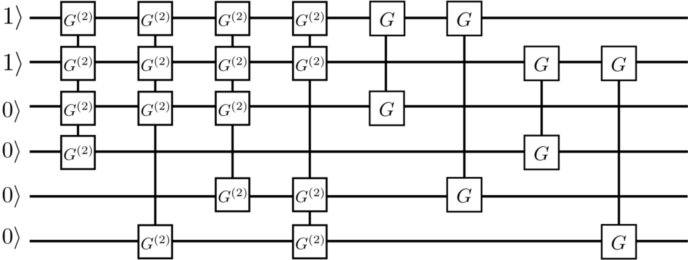

Quantum Machine Learning Module
#################################

Quantum Computing Layer
***********************************

.. _QuantumLayer:

QuantumLayer
=================================

QuantumLayer is a package class of autograd module that supports ariational quantum circuits. You can define a function as an argument, such as ``qprog_with_measure``, This function needs to contain the quantum circuit defined by pyQPanda: It generally contains coding-circuit, evolution-circuit and measurement-operation.
This QuantumLayer class can be embedded into the hybrid quantum classical machine learning model and minimize the objective function or loss function of the hybrid quantum classical model through the classical gradient descent method.
You can specify the gradient calculation method of quantum circuit parameters in ``QuantumLayer`` by change the parameter ``diff_method``. ``QuantumLayer`` currently supports two methods, one is ``finite_diff`` and the other is ``parameter-shift`` methods.

The ``finite_diff`` method is one of the most traditional and common numerical methods for estimating function gradient.The main idea is to replace partial derivatives with differences:

.. math::

    f^{\prime}(x)=\lim _{h \rightarrow 0} \frac{f(x+h)-f(x)}{h}

For the ``parameter-shift`` method we use the objective function, such as:

.. math:: O(\theta)=\left\langle 0\left|U^{\dagger}(\theta) H U(\theta)\right| 0\right\rangle

It is theoretically possible to calculate the gradient of parameters about Hamiltonian in a quantum circuit by the more precise method: ``parameter-shift``.

.. math::

    \nabla O(\theta)=
    \frac{1}{2}\left[O\left(\theta+\frac{\pi}{2}\right)-O\left(\theta-\frac{\pi}{2}\right)\right]

.. py:class:: pyvqnet.qnn.quantumlayer.QuantumLayer(qprog_with_measure,para_num,machine_type_or_cloud_token,num_of_qubits:int,num_of_cbits:int = 1,diff_method:str = "parameter_shift",delta:float = 0.01, dtype=None, name='')

    Abstract calculation module for variational quantum circuits. It simulates a parameterized quantum circuit and gets the measurement result.
    QuantumLayer inherits from Module ,so that it can calculate gradients of circuits parameters,and train variational quantum circuits model or embed variational quantum circuits into hybird quantum and classic model.
    
    This class dos not need you to initialize virtual machine in the ``qprog_with_measure`` function.

    :param qprog_with_measure: callable quantum circuits functions ,cosntructed by qpanda
    :param para_num: `int` - Number of parameter
    :param machine_type_or_cloud_token: qpanda machine type or pyQPANDA QCLOUD token : https://pyqpanda-toturial.readthedocs.io/zh/latest/Realchip.html
    :param num_of_qubits: num of qubits
    :param num_of_cbits: num of classic bits
    :param diff_method: 'parameter_shift' or 'finite_diff'
    :param delta:  delta for diff
    :param dtype: The data type of the parameter, defaults: None, use the default data type kfloat32, which represents a 32-bit floating point number.
    :param name: name of the output layer

    :return: a module can calculate quantum circuits .

    .. note::
        qprog_with_measure is quantum circuits function defined in pyQPanda :https://pyqpanda-toturial.readthedocs.io/zh/latest/QCircuit.html.

        This function should contain following parameters,otherwise it can not run properly in QuantumLayer.

        qprog_with_measure (input,param,qubits,cbits,m_machine)

            `input`: array_like input 1-dim classic data

            `param`: array_like input 1-dim quantum circuit's parameters

            `qubits`: qubits allocated by QuantumLayer

            `cbits`: cbits allocated by QuantumLayer.if your circuits does not use cbits,you should also reserve this parameter.

            `m_machine`: simulator created by QuantumLayer

        Use the ``m_para`` attribute of QuantumLayer to get the training parameters of the variable quantum circuit. The parameter is a ``QTensor`` class, which can be converted into a numpy array using the ``to_numpy()`` interface.
    
    Example::

        import pyqpanda as pq
        from pyvqnet.qnn.measure import ProbsMeasure
        from pyvqnet.qnn.quantumlayer import QuantumLayer
        import numpy as np
        from pyvqnet.tensor import QTensor
        def pqctest (input,param,qubits,cbits,m_machine):
            circuit = pq.QCircuit()
            circuit.insert(pq.H(qubits[0]))
            circuit.insert(pq.H(qubits[1]))
            circuit.insert(pq.H(qubits[2]))
            circuit.insert(pq.H(qubits[3]))

            circuit.insert(pq.RZ(qubits[0],input[0]))
            circuit.insert(pq.RZ(qubits[1],input[1]))
            circuit.insert(pq.RZ(qubits[2],input[2]))
            circuit.insert(pq.RZ(qubits[3],input[3]))

            circuit.insert(pq.CNOT(qubits[0],qubits[1]))
            circuit.insert(pq.RZ(qubits[1],param[0]))
            circuit.insert(pq.CNOT(qubits[0],qubits[1]))

            circuit.insert(pq.CNOT(qubits[1],qubits[2]))
            circuit.insert(pq.RZ(qubits[2],param[1]))
            circuit.insert(pq.CNOT(qubits[1],qubits[2]))

            circuit.insert(pq.CNOT(qubits[2],qubits[3]))
            circuit.insert(pq.RZ(qubits[3],param[2]))
            circuit.insert(pq.CNOT(qubits[2],qubits[3]))
            #print(circuit)

            prog = pq.QProg()
            prog.insert(circuit)
            # pauli_dict  = {'Z0 X1':10,'Y2':-0.543}
            rlt_prob = ProbsMeasure([0,2],prog,m_machine,qubits)
            return rlt_prob

        pqc = QuantumLayer(pqctest,3,"cpu",4,1)
        #classic data as input
        input = QTensor([[1,2,3,4],[40,22,2,3],[33,3,25,2.0]] )
        #forward circuits
        rlt = pqc(input)
        grad =  QTensor(np.ones(rlt.data.shape)*1000)
        #backward circuits
        rlt.backward(grad)
        print(rlt)
        # [
        # [0.2500000, 0.2500000, 0.2500000, 0.2500000],
        # [0.2500000, 0.2500000, 0.2500000, 0.2500000],
        # [0.2500000, 0.2500000, 0.2500000, 0.2500000]
        # ]

QuantumLayerV2
=================================

If you are more familiar with pyQPanda syntax, please using QuantumLayerV2 class, you can define the quantum circuits function by using ``qubits``, ``cbits`` and ``machine``, then take it as a argument ``qprog_with_measure`` of QuantumLayerV2.

.. py:class:: pyvqnet.qnn.quantumlayer.QuantumLayerV2(qprog_with_measure, para_num, diff_method: str = 'parameter_shift', delta: float = 0.01, dtype=None, name='')

    Abstract calculation module for variational quantum circuits. It simulates a parameterized quantum circuit and gets the measurement result.
    QuantumLayer inherits from Module ,so that it can calculate gradients of circuits parameters,and train variational quantum circuits model or embed variational quantum circuits into hybird quantum and classic model.
    
    To use this module, you need to create your quantum virtual machine and allocate qubits and cbits.

    :param qprog_with_measure: callable quantum circuits functions ,cosntructed by qpanda
    :param para_num: `int` - Number of parameter
    :param diff_method: 'parameter_shift' or 'finite_diff'
    :param delta:  delta for diff
    :param dtype: The data type of the parameter, defaults: None, use the default data type kfloat32, which represents a 32-bit floating point number.
    :param name: name of the output layer
    :return: a module can calculate quantum circuits .

    .. note::
        qprog_with_measure is quantum circuits function defined in pyQPanda :https://pyqpanda-toturial.readthedocs.io/zh/latest/QCircuit.html.

        This function should contains following parameters,otherwise it can not run properly in QuantumLayerV2.

        Compare to QuantumLayer.you should allocate qubits and simulator: https://pyqpanda-toturial.readthedocs.io/zh/latest/QuantumMachine.html,

        you may also need to allocate cbits if qprog_with_measure needs quantum measure: https://pyqpanda-toturial.readthedocs.io/zh/latest/Measure.html

        qprog_with_measure (input,param)

        `input`: array_like input 1-dim classic data

        `param`: array_like input 1-dim quantum circuit's parameters

    Example::

        import pyqpanda as pq
        from pyvqnet.qnn.measure import ProbsMeasure
        from pyvqnet.qnn.quantumlayer import QuantumLayerV2
        import numpy as np
        from pyvqnet.tensor import QTensor
        def pqctest (input,param):
            num_of_qubits = 4

            m_machine = pq.CPUQVM()# outside
            m_machine.init_qvm()# outside
            qubits = m_machine.qAlloc_many(num_of_qubits)

            circuit = pq.QCircuit()
            circuit.insert(pq.H(qubits[0]))
            circuit.insert(pq.H(qubits[1]))
            circuit.insert(pq.H(qubits[2]))
            circuit.insert(pq.H(qubits[3]))

            circuit.insert(pq.RZ(qubits[0],input[0]))
            circuit.insert(pq.RZ(qubits[1],input[1]))
            circuit.insert(pq.RZ(qubits[2],input[2]))
            circuit.insert(pq.RZ(qubits[3],input[3]))

            circuit.insert(pq.CNOT(qubits[0],qubits[1]))
            circuit.insert(pq.RZ(qubits[1],param[0]))
            circuit.insert(pq.CNOT(qubits[0],qubits[1]))

            circuit.insert(pq.CNOT(qubits[1],qubits[2]))
            circuit.insert(pq.RZ(qubits[2],param[1]))
            circuit.insert(pq.CNOT(qubits[1],qubits[2]))

            circuit.insert(pq.CNOT(qubits[2],qubits[3]))
            circuit.insert(pq.RZ(qubits[3],param[2]))
            circuit.insert(pq.CNOT(qubits[2],qubits[3]))
            #print(circuit)

            prog = pq.QProg()
            prog.insert(circuit)
            rlt_prob = ProbsMeasure([0,2],prog,m_machine,qubits)
            return rlt_prob

        pqc = QuantumLayerV2(pqctest,3)

        #classic data as input
        input = QTensor([[1,2,3,4],[4,2,2,3],[3,3,2,2.0]] )

        #forward circuits
        rlt = pqc(input)

        grad =  QTensor(np.ones(rlt.data.shape)*1000)
        #backward circuits
        rlt.backward(grad)
        print(rlt)

        # [
        # [0.2500000, 0.2500000, 0.2500000, 0.2500000],
        # [0.2500000, 0.2500000, 0.2500000, 0.2500000],
        # [0.2500000, 0.2500000, 0.2500000, 0.2500000]
        # ]

QuantumBatchAsyncQcloudLayer
=================================

When you install the latest version of pyqpanda, you can use this interface to define a variational circuit and submit it to originqc for running on the real chip.

.. py:class:: pyvqnet.qnn.quantumlayer.QuantumBatchAsyncQcloudLayer(origin_qprog_func, qcloud_token, para_num, num_qubits, num_cubits, pauli_str_dict=None, shots = 1000, initializer=None, dtype=None, name="", diff_method="parameter_shift ", submit_kwargs={}, query_kwargs={})
    
    Abstract computing module for originqc real chips using pyqpanda QCLOUD starting with version 3.8.2.2. It submits parameterized quantum circuits to real chips and obtains measurement results.

    .. note::

        qcloud_token is the API token you applied for at https://qcloud.originqc.com.cn/.
        origin_qprog_func needs to return data of type pypqanda.QProg. If pauli_str_dict is not set, you need to ensure that measure has been inserted into the QProg.
        The form of origin_qprog_func must be as follows:

        origin_qprog_func(input,param,qubits,cbits,machine)

            `input`: Input 1~2-dimensional classic data. In the case of two-dimensional data, the first dimension is the batch size.

            `param`: Enter the parameters to be trained for the one-dimensional variational quantum circuit.

            `machine`: The simulator QCloud created by QuantumBatchAsyncQcloudLayer does not require users to define it in additional functions.

            `qubits`: Qubits created by the simulator QCloud created by QuantumBatchAsyncQcloudLayer, the number is `num_qubits`, the type is pyQpanda.Qubits, no need for the user to define it in the function.

            `cbits`: Classic bits allocated by QuantumBatchAsyncQcloudLayer, the number is `num_cubits`, the type is pyQpanda.ClassicalCondition, no need for the user to define it in the function. .

    :param origin_qprog_func: The variational quantum circuit function built by QPanda must return QProg.
    :param qcloud_token: `str` - The type of quantum machine or cloud token used for execution.
    :param para_num: `int` - Number of parameters, the parameter is a QTensor of size [para_num].
    :param num_qubits: `int` - Number of qubits in the quantum circuit.
    :param num_cubits: `int` - The number of classical bits used for measurement in quantum circuits.
    :param pauli_str_dict: `dict|list` - A dictionary or list of dictionaries representing Pauli operators in quantum circuits. The default is "none", and the measurement operation is performed. If a dictionary of Pauli operators is entered, a single expectation or multiple expectations will be calculated.
    :param shot: `int` - Number of measurements. The default value is 1000.
    :param initializer: Initializer for parameter values. The default is "None", using 0~2*pi normal distribution.
    :param dtype: The data type of the parameter. The default value is None, which uses the default data type pyvqnet.kfloat32.
    :param name: The name of the module. Defaults to empty string.
    :param diff_method: Differential method for gradient calculation. The default is "parameter_shift", other differential methods are not currently supported.
    :param submit_kwargs: Additional keyword parameters for submitting quantum circuits, default: {"chip_id":pyqpanda.real_chip_type.origin_72,"is_amend":True,"is_mapping":True,"is_optimization":True,"compile_level":3, "default_task_group_size":200, "test_qcloud_fake":False}, when test_qcloud_fake is set to True, the local CPUQVM is simulated.
    :param query_kwargs: Additional keyword parameters for querying quantum results, default: {"timeout":2,"print_query_info":True,"sub_circuits_split_size":1}.
    
    :return: A module that can calculate quantum circuits.

    Example::

        import numpy as np
        import pyqpanda as pq
        import pyvqnet
        from pyvqnet.qnn import QuantumLayer,QuantumBatchAsyncQcloudLayer
        from pyvqnet.qnn import expval_qcloud

        #set_test_qcloud_fake(False) #uncomments this code to use realchip

        def qfun(input,param, m_machine, m_qlist,cubits):
            measure_qubits = [0,2]
            m_prog = pq.QProg()
            cir = pq.QCircuit()
            cir.insert(pq.RZ(m_qlist[0],input[0]))
            cir.insert(pq.CNOT(m_qlist[0],m_qlist[1]))
            cir.insert(pq.RY(m_qlist[1],param[0]))
            cir.insert(pq.CNOT(m_qlist[0],m_qlist[2]))
            cir.insert(pq.RZ(m_qlist[1],input[1]))
            cir.insert(pq.RY(m_qlist[2],param[1]))
            cir.insert(pq.H(m_qlist[2]))
            m_prog.insert(cir)

            for idx, ele in enumerate(measure_qubits):
                m_prog << pq.Measure(m_qlist[ele], cubits[idx])  # pylint: disable=expression-not-assigned
            return m_prog

        l = QuantumBatchAsyncQcloudLayer(qfun,
                        "3047DE8A59764BEDAC9C3282093B16AF1",
                        2,
                        6,
                        6,
                        pauli_str_dict=None,
                        shots = 1000,
                        initializer=None,
                        dtype=None,
                        name="",
                        diff_method="parameter_shift",
                        submit_kwargs={},
                        query_kwargs={})
        x = pyvqnet.tensor.QTensor([[0.56,1.2],[0.56,1.2],[0.56,1.2],[0.56,1.2],[0.56,1.2]],requires_grad= True)
        y = l(x)
        print(y)
        y.backward()
        print(l.m_para.grad)
        print(x.grad)

        def qfun2(input,param, m_machine, m_qlist,cubits):
            measure_qubits = [0,2]
            m_prog = pq.QProg()
            cir = pq.QCircuit()
            cir.insert(pq.RZ(m_qlist[0],input[0]))
            cir.insert(pq.CNOT(m_qlist[0],m_qlist[1]))
            cir.insert(pq.RY(m_qlist[1],param[0]))
            cir.insert(pq.CNOT(m_qlist[0],m_qlist[2]))
            cir.insert(pq.RZ(m_qlist[1],input[1]))
            cir.insert(pq.RY(m_qlist[2],param[1]))
            cir.insert(pq.H(m_qlist[2]))
            m_prog.insert(cir)

            return m_prog
        l = QuantumBatchAsyncQcloudLayer(qfun2,
                    "3047DE8A59764BEDAC9C3282093B16AF",
                    2,
                    6,
                    6,
                    pauli_str_dict={'Z0 X1':10,'':-0.5,'Y2':-0.543},
                    shots = 1000,
                    initializer=None,
                    dtype=None,
                    name="",
                    diff_method="parameter_shift",
                    submit_kwargs={},
                    query_kwargs={})
        x = pyvqnet.tensor.QTensor([[0.56,1.2],[0.56,1.2],[0.56,1.2],[0.56,1.2]],requires_grad= True)
        y = l(x)
        print(y)
        y.backward()
        print(l.m_para.grad)
        print(x.grad)

QuantumBatchAsyncQcloudLayerES
=================================

当When you install the latest version of pyqpanda, you can use this interface to define a variational circuit and submit it to originqc for running on the real chip.

.. py:class:: pyvqnet.qnn.quantumlayer.QuantumBatchAsyncQcloudLayerES(origin_qprog_func, qcloud_token, para_num, num_qubits, num_cubits, pauli_str_dict=None, shots = 1000, initializer=None, dtype=None, name="", diff_method="ES", submit_kwargs={}, query_kwargs={}, sigma=np.pi/24)
    
    Abstract computing module for originqc real chips using pyqpanda QCLOUD starting with version 3.8.2.2. It submits parameterized quantum circuits to real chips and obtains measurement results.

    .. note::

        qcloud_token is the API token you applied for at https://qcloud.originqc.com.cn/.
        origin_qprog_func needs to return data of type pypqanda.QProg. If pauli_str_dict is not set, you need to ensure that measure has been inserted into the QProg.
        The form of origin_qprog_func must be as follows:

        origin_qprog_func(input,param,qubits,cbits,machine)

            `input`: Input 1~2-dimensional classic data. In the case of two-dimensional data, the first dimension is the batch size.

            `param`: Enter the parameters to be trained for the one-dimensional variational quantum circuit.

            `machine`: The simulator QCloud created by QuantumBatchAsyncQcloudLayerES does not require users to define it in additional functions.

            `qubits`: Qubits created by the simulator QCloud created by QuantumBatchAsyncQcloudLayerES, the number is `num_qubits`, the type is pyQpanda.Qubits, no need for the user to define it in the function.

            `cbits`: Classic bits allocated by QuantumBatchAsyncQcloudLayerES, the number is `num_cubits`, the type is pyQpanda.ClassicalCondition, no need for the user to define it in the function. .

    :param origin_qprog_func: The variational quantum circuit function built by QPanda must return QProg.
    :param qcloud_token: `str` - The type of quantum machine or cloud token used for execution.
    :param para_num: `int` - Number of parameters, the parameter is a QTensor of size [para_num].
    :param num_qubits: `int` - Number of qubits in the quantum circuit.
    :param num_cubits: `int` - The number of classical bits used for measurement in quantum circuits.
    :param pauli_str_dict: `dict|list` - A dictionary or list of dictionaries representing Pauli operators in quantum circuits. The default is "none", and the measurement operation is performed. If a dictionary of Pauli operators is entered, a single expectation or multiple expectations will be calculated.
    :param shot: `int` - Number of measurements. The default value is 1000.
    :param initializer: Initializer for parameter values. The default is "None", using 0~2*pi normal distribution.
    :param dtype: The data type of the parameter. The default value is None, which uses the default data type pyvqnet.kfloat32.
    :param name: The name of the module. Defaults to empty string.
    :param diff_method: Differential method for gradient calculation. The default is "ES",  originate in paper "Learning to learn with an evolutionary strategy Learning to learn with an evolutionary strategy", other differential methods are not currently supported.
    :param submit_kwargs: Additional keyword parameters for submitting quantum circuits, default: {"chip_id":pyqpanda.real_chip_type.origin_72,"is_amend":True,"is_mapping":True,"is_optimization":True,"compile_level":3, "default_task_group_size":200, "test_qcloud_fake":False}, when test_qcloud_fake is set to True, the local CPUQVM is simulated.
    :param query_kwargs: Additional keyword parameters for querying quantum results, default: {"timeout":2,"print_query_info":True,"sub_circuits_split_size":1}.
    :param sigma: Sampling variance of the multivariate non-trivial distribution, generally take pi/6, pi/12, pi/24, default is pi/24.
    :return: A module that can calculate quantum circuits.

    Example::

        import numpy as np
        import pyqpanda as pq
        import pyvqnet
        from pyvqnet.qnn import QuantumLayer,QuantumBatchAsyncQcloudLayerES
        from pyvqnet.qnn import expval_qcloud

        def qfun(input,param, m_machine, m_qlist,cubits):
            measure_qubits = [0,2]
            m_prog = pq.QProg()
            cir = pq.QCircuit()
            cir.insert(pq.RZ(m_qlist[0],input[0]))
            cir.insert(pq.CNOT(m_qlist[0],m_qlist[1]))
            cir.insert(pq.RY(m_qlist[1],param[0]))
            cir.insert(pq.CNOT(m_qlist[0],m_qlist[2]))
            cir.insert(pq.RZ(m_qlist[1],input[1]))
            cir.insert(pq.RY(m_qlist[2],param[1]))
            cir.insert(pq.H(m_qlist[2]))
            m_prog.insert(cir)

            for idx, ele in enumerate(measure_qubits):
                m_prog << pq.Measure(m_qlist[ele], cubits[idx])  # pylint: disable=expression-not-assigned
            return m_prog

        l = QuantumBatchAsyncQcloudLayerES(qfun,
                        "3047DE8A59764BEDAC9C3282093B16AF1",
                        2,
                        6,
                        6,
                        pauli_str_dict=None,
                        shots = 1000,
                        initializer=None,
                        dtype=None,
                        name="",
                        diff_method="ES",
                        submit_kwargs={},
                        query_kwargs={},
                        sigma=np.pi/24)
        x = pyvqnet.tensor.QTensor([[0.56,1.2],[0.56,1.2],[0.56,1.2],[0.56,1.2],[0.56,1.2]],requires_grad= True)
        y = l(x)
        print(f"y {y}")
        y.backward()
        print(f"l.m_para.grad {l.m_para.grad}")
        print(f"x.grad {x.grad}")

        def qfun2(input,param, m_machine, m_qlist,cubits):
            measure_qubits = [0,2]
            m_prog = pq.QProg()
            cir = pq.QCircuit()
            cir.insert(pq.RZ(m_qlist[0],input[0]))
            cir.insert(pq.CNOT(m_qlist[0],m_qlist[1]))
            cir.insert(pq.RY(m_qlist[1],param[0]))
            cir.insert(pq.CNOT(m_qlist[0],m_qlist[2]))
            cir.insert(pq.RZ(m_qlist[1],input[1]))
            cir.insert(pq.RY(m_qlist[2],param[1]))
            cir.insert(pq.H(m_qlist[2]))
            m_prog.insert(cir)

            return m_prog
        l = QuantumBatchAsyncQcloudLayerES(qfun2,
                    "3047DE8A59764BEDAC9C3282093B16AF",
                    2,
                    6,
                    6,
                    pauli_str_dict={'Z0 X1':10,'':-0.5,'Y2':-0.543},
                    shots = 1000,
                    initializer=None,
                    dtype=None,
                    name="",
                    diff_method="ES",
                    submit_kwargs={},
                    query_kwargs={})
        x = pyvqnet.tensor.QTensor([[0.56,1.2],[0.56,1.2],[0.56,1.2],[0.56,1.2]],requires_grad= True)
        y = l(x)
        print(f"y {y}")
        y.backward()
        print(f"l.m_para.grad {l.m_para.grad}")
        print(f"x.grad {x.grad}")

QuantumLayerMultiProcess
=================================

If you are more familiar with pyQPanda syntax, please using QuantumLayerMultiProcess class, you can define the quantum circuits function by using ``qubits``, ``cbits`` and ``machine``, then take it as a argument ``qprog_with_measure`` of QuantumLayerMultiProcess.

.. py:class:: pyvqnet.qnn.quantumlayer.QuantumLayerMultiProcess(qprog_with_measure, para_num, machine_type_or_cloud_token, num_of_qubits: int, num_of_cbits: int = 1, diff_method: str = 'parameter_shift', delta: float = 0.01,dtype=None, name='')

    Abstract calculation module for variational quantum circuits. This class uses multiprocess to accelerate quantum circuit simulation.
    
    It simulates a parameterized quantum circuit and gets the measurement result.
    QuantumLayer inherits from Module ,so that it can calculate gradients of circuits parameters,and train variational quantum circuits model or embed variational quantum circuits into hybird quantum and classic model.

    To use this module, you need to create your quantum virtual machine and allocate qubits and cbits.

    :param qprog_with_measure: callable quantum circuits functions ,cosntructed by qpanda.
    :param para_num: `int` - Number of parameter
    :param num_of_qubits: num of qubits.
    :param num_of_cbits: num of classic bits.
    :param diff_method: 'parameter_shift' or 'finite_diff'.
    :param delta:  delta for diff.
    :param dtype: The data type of the parameter, defaults: None, use the default data type kfloat32, which represents a 32-bit floating point number.
    :param name: name of the output layer

    :return: a module can calculate quantum circuits .

    .. note::
        qprog_with_measure is quantum circuits function defined in pyQPanda : https://github.com/OriginQ/QPanda-2.

        This function should contains following parameters,otherwise it can not run properly in QuantumLayerMultiProcess.

        Compare to QuantumLayer.you should allocate qubits and simulator,

        you may also need to allocate cbits if qprog_with_measure needs quantum Measure.

        qprog_with_measure (input,param)

        `input`: array_like input 1-dim classic data

        `param`: array_like input 1-dim quantum circuit's parameters

    Example::

        import pyqpanda as pq
        from pyvqnet.qnn.measure import ProbsMeasure
        from pyvqnet.qnn.quantumlayer import QuantumLayerMultiProcess
        import numpy as np
        from pyvqnet.tensor import QTensor

        def pqctest (input,param,nqubits,ncubits):
            machine = pq.CPUQVM()
            machine.init_qvm()
            qubits = machine.qAlloc_many(nqubits)
            circuit = pq.QCircuit()
            circuit.insert(pq.H(qubits[0]))
            circuit.insert(pq.H(qubits[1]))
            circuit.insert(pq.H(qubits[2]))
            circuit.insert(pq.H(qubits[3]))

            circuit.insert(pq.RZ(qubits[0],input[0]))
            circuit.insert(pq.RZ(qubits[1],input[1]))
            circuit.insert(pq.RZ(qubits[2],input[2]))
            circuit.insert(pq.RZ(qubits[3],input[3]))

            circuit.insert(pq.CNOT(qubits[0],qubits[1]))
            circuit.insert(pq.RZ(qubits[1],param[0]))
            circuit.insert(pq.CNOT(qubits[0],qubits[1]))

            circuit.insert(pq.CNOT(qubits[1],qubits[2]))
            circuit.insert(pq.RZ(qubits[2],param[1]))
            circuit.insert(pq.CNOT(qubits[1],qubits[2]))

            circuit.insert(pq.CNOT(qubits[2],qubits[3]))
            circuit.insert(pq.RZ(qubits[3],param[2]))
            circuit.insert(pq.CNOT(qubits[2],qubits[3]))

            prog = pq.QProg()
            prog.insert(circuit)

            rlt_prob = ProbsMeasure([0,2],prog,machine,qubits)
            return rlt_prob

        pqc = QuantumLayerMultiProcess(pqctest,3,4,1)
        #classic data as input
        input = QTensor([[1.0,2,3,4],[4,2,2,3],[3,3,2,2]] )
        #forward circuits
        rlt = pqc(input)
        grad = QTensor(np.ones(rlt.data.shape)*1000)
        #backward circuits
        rlt.backward(grad)
        print(rlt)

        # [
        # [0.2500000, 0.2500000, 0.2500000, 0.2500000],
        # [0.2500000, 0.2500000, 0.2500000, 0.2500000],
        # [0.2500000, 0.2500000, 0.2500000, 0.2500000]
        # ]

NoiseQuantumLayer
=================================

In the real quantum computer, due to the physical characteristics of the quantum bit, there is always inevitable calculation error. In order to better simulate this error in quantum virtual machine, VQNet also supports quantum virtual machine with noise. The simulation of quantum virtual machine with noise is closer to the real quantum computer. We can customize the supported logic gate type and the noise model supported by the logic gate.
The existing supported quantum noise model is defined in QPanda `NoiseQVM <https://pyqpanda-toturial.readthedocs.io/zh/latest/NoiseQVM.html>`_ .

We can use ``NoiseQuantumLayer`` to define an automatic microclassification of quantum circuits. ``NoiseQuantumLayer`` supports QPanda quantum virtual machine with noise. You can define a function as an argument ``qprog_with_measure``. This function needs to contain the quantum circuit defined by pyQPanda, as also you need to pass in a argument ``noise_set_config``, by using the pyQPanda interface to set up the noise model.

.. py:class:: pyvqnet.qnn.quantumlayer.NoiseQuantumLayer(qprog_with_measure, para_num, machine_type, num_of_qubits: int, num_of_cbits: int = 1, diff_method: str = 'parameter_shift', delta: float = 0.01, noise_set_config=None, dtype=None, name='')

    Abstract calculation module for variational quantum circuits. It simulates a parameterized quantum circuit and gets the measurement result.
    QuantumLayer inherits from Module ,so that it can calculate gradients of circuits parameters,and train variational quantum circuits model or embed variational quantum circuits into hybird quantum and classic model.
    
    This module should be initialized with noise model by ``noise_set_config``.

    :param qprog_with_measure: callable quantum circuits functions ,cosntructed by qpanda
    :param para_num: `int` - Number of para_num
    :param machine_type: qpanda machine type
    :param num_of_qubits: num of qubits
    :param num_of_cbits: num of cbits
    :param diff_method: 'parameter_shift' or 'finite_diff'
    :param delta:  delta for diff
    :param noise_set_config: noise set function
    :param dtype: The data type of the parameter, defaults: None, use the default data type kfloat32, which represents a 32-bit floating point number.
    :param name: name of the output layer
    
    :return: a module can calculate quantum circuits with noise model.

    .. note::
        qprog_with_measure is quantum circuits function defined in pyQPanda :https://pyqpanda-toturial.readthedocs.io/zh/latest/QCircuit.html.

        This function should contains following parameters,otherwise it can not run properly in NoiseQuantumLayer.

        qprog_with_measure (input,param,qubits,cbits,m_machine)

        `input`: array_like input 1-dim classic data

        `param`: array_like input 1-dim quantum circuit's parameters

        `qubits`: qubits allocated by NoiseQuantumLayer

        `cbits`: cbits allocated by NoiseQuantumLayer.if your circuits does not use cbits,you should also reserve this parameter.

        `m_machine`: simulator created by NoiseQuantumLayer

    Example::

        import pyqpanda as pq
        from pyvqnet.qnn.measure import ProbsMeasure
        from pyvqnet.qnn.quantumlayer import NoiseQuantumLayer
        import numpy as np
        from pyqpanda import *
        from pyvqnet.tensor import QTensor

        def circuit(weights, param, qubits, cbits, machine):

            circuit = pq.QCircuit()

            circuit.insert(pq.H(qubits[0]))
            circuit.insert(pq.RY(qubits[0], weights[0]))
            circuit.insert(pq.RY(qubits[0], param[0]))
            prog = pq.QProg()
            prog.insert(circuit)
            prog << measure_all(qubits, cbits)

            result = machine.run_with_configuration(prog, cbits, 100)

            counts = np.array(list(result.values()))
            states = np.array(list(result.keys())).astype(float)
            # Compute probabilities for each state
            probabilities = counts / 100
            # Get state expectation
            expectation = np.sum(states * probabilities)
            return expectation

        def default_noise_config(qvm, q):

            p = 0.01
            qvm.set_noise_model(NoiseModel.BITFLIP_KRAUS_OPERATOR,
                                GateType.PAULI_X_GATE, p)
            qvm.set_noise_model(NoiseModel.BITFLIP_KRAUS_OPERATOR,
                                GateType.PAULI_Y_GATE, p)
            qvm.set_noise_model(NoiseModel.BITFLIP_KRAUS_OPERATOR,
                                GateType.PAULI_Z_GATE, p)
            qvm.set_noise_model(NoiseModel.BITFLIP_KRAUS_OPERATOR, GateType.RX_GATE, p)
            qvm.set_noise_model(NoiseModel.BITFLIP_KRAUS_OPERATOR, GateType.RY_GATE, p)
            qvm.set_noise_model(NoiseModel.BITFLIP_KRAUS_OPERATOR, GateType.RZ_GATE, p)
            qvm.set_noise_model(NoiseModel.BITFLIP_KRAUS_OPERATOR, GateType.RY_GATE, p)
            qvm.set_noise_model(NoiseModel.BITFLIP_KRAUS_OPERATOR,
                                GateType.HADAMARD_GATE, p)
            qves = []
            for i in range(len(q) - 1):
                qves.append([q[i], q[i + 1]])  #
            qves.append([q[len(q) - 1], q[0]])
            qvm.set_noise_model(NoiseModel.DAMPING_KRAUS_OPERATOR, GateType.CNOT_GATE,
                                p, qves)

            return qvm

        qvc = NoiseQuantumLayer(circuit,
                                24,
                                "noise",
                                1,
                                1,
                                diff_method="parameter_shift",
                                delta=0.01,
                                noise_set_config=default_noise_config)
        input = QTensor([[0., 1., 1., 1.], [0., 0., 1., 1.], [1., 0., 1., 1.]])
        rlt = qvc(input)
        grad = QTensor(np.ones(rlt.data.shape) * 1000)

        rlt.backward(grad)
        print(qvc.m_para.grad)

        #[1195., 105., 70., 0.,
        # 45., -45., 50., 15.,
        # -80., 50., 10., -30.,
        # 10., 60., 75., -110.,
        # 55., 45., 25., 5.,
        # 5., 50., -25., -15.]

Here is an example of ``noise_set_config``, here we add the noise model BITFLIP_KRAUS_OPERATOR where the noise argument p=0.01 to the quantum gate ``RX`` , ``RY`` , ``RZ`` , ``X`` , ``Y`` , ``Z`` , ``H``, etc.

.. code-block::

	def noise_set_config(qvm,q):

		p = 0.01
		qvm.set_noise_model(NoiseModel.BITFLIP_KRAUS_OPERATOR, GateType.PAULI_X_GATE, p)
		qvm.set_noise_model(NoiseModel.BITFLIP_KRAUS_OPERATOR, GateType.PAULI_Y_GATE, p)
		qvm.set_noise_model(NoiseModel.BITFLIP_KRAUS_OPERATOR, GateType.PAULI_Z_GATE, p)
		qvm.set_noise_model(NoiseModel.BITFLIP_KRAUS_OPERATOR, GateType.RX_GATE, p)
		qvm.set_noise_model(NoiseModel.BITFLIP_KRAUS_OPERATOR, GateType.RY_GATE, p)
		qvm.set_noise_model(NoiseModel.BITFLIP_KRAUS_OPERATOR, GateType.RZ_GATE, p)
		qvm.set_noise_model(NoiseModel.BITFLIP_KRAUS_OPERATOR, GateType.RY_GATE, p)
		qvm.set_noise_model(NoiseModel.BITFLIP_KRAUS_OPERATOR, GateType.HADAMARD_GATE, p)
		qves =[]
		for i in range(len(q)-1):
			qves.append([q[i],q[i+1]])#
		qves.append([q[len(q)-1],q[0]])
		qvm.set_noise_model(NoiseModel.DAMPING_KRAUS_OPERATOR, GateType.CNOT_GATE, p, qves)

		return qvm
		
VQCLayer
================================

Based on the variable quantum circuit(VariationalQuantumCircuit) of pyQPanda, VQNet provides an abstract quantum computing layer called ``VQCLayer``.

You just only needs to define a class that inherits from ``VQC_wrapper``, and construct quantum gates of circuits and measurement functions based on pyQPanda ``VariationalQuantumCircuit`` in it.

In ``VQC_wrapper``, you can use the common logic gate function ``build_common_circuits`` to build a sub-circuits of the model with variable circuit's structure, use the VQG in ``build_vqc_circuits`` to build sub-circuits with constant structure and variable parameters,
use the ``run`` function to define the circuit operations and measurement.

.. py:class:: pyvqnet.qnn.quantumlayer.VQC_wrapper

    ``VQC_wrapper`` is a abstract class help to run VariationalQuantumCircuit on VQNet.

    ``build_common_circuits`` function contains circuits may be varaible according to the input.

    ``build_vqc_circuits`` function contains VQC circuits with trainable weights.

    ``run`` function contains run function for VQC.

    Example::

        import pyqpanda as pq
        from pyqpanda import *
        from pyvqnet.qnn.quantumlayer import VQCLayer,VQC_wrapper

        class QVC_demo(VQC_wrapper):

            def __init__(self):
                super(QVC_demo, self).__init__()

            def build_common_circuits(self,input,qlists,):
                qc = pq.QCircuit()
                for i in range(len(qlists)):
                    if input[i]==1:
                        qc.insert(pq.X(qlists[i]))
                return qc

            def build_vqc_circuits(self,input,weights,machine,qlists,clists):

                def get_cnot(qubits):
                    vqc = VariationalQuantumCircuit()
                    for i in range(len(qubits)-1):
                        vqc.insert(pq.VariationalQuantumGate_CNOT(qubits[i],qubits[i+1]))
                    vqc.insert(pq.VariationalQuantumGate_CNOT(qubits[len(qubits)-1],qubits[0]))
                    return vqc

                def build_circult(weights, xx, qubits,vqc):

                    def Rot(weights_j, qubits):
                        vqc = VariationalQuantumCircuit()

                        vqc.insert(pq.VariationalQuantumGate_RZ(qubits, weights_j[0]))
                        vqc.insert(pq.VariationalQuantumGate_RY(qubits, weights_j[1]))
                        vqc.insert(pq.VariationalQuantumGate_RZ(qubits, weights_j[2]))
                        return vqc

                    #2,4,3
                    for i in range(2):

                        weights_i = weights[i,:,:]
                        for j in range(len(qubits)):
                            weights_j = weights_i[j]
                            vqc.insert(Rot(weights_j,qubits[j]))
                        cnots = get_cnot(qubits)
                        vqc.insert(cnots)

                    vqc.insert(pq.VariationalQuantumGate_Z(qubits[0]))#pauli z(0)

                    return vqc

                weights = weights.reshape([2,4,3])
                vqc = VariationalQuantumCircuit()
                return build_circult(weights, input,qlists,vqc)

Send the instantiated object ``VQC_wrapper`` as a parameter to ``VQCLayer``

.. py:class:: pyvqnet.qnn.quantumlayer.VQCLayer(vqc_wrapper, para_num, machine_type_or_cloud_token, num_of_qubits: int, num_of_cbits: int = 1, diff_method: str = 'parameter_shift', delta: float = 0.01, dtype=None, name='')

    Abstract Calculation module for Variational Quantum Circuits in pyQPanda.Please reference to :https://pyqpanda-toturial.readthedocs.io/zh/latest/VQG.html.

    :param vqc_wrapper: VQC_wrapper class
    :param para_num: `int` - Number of parameter
    :param machine_type: qpanda machine type
    :param num_of_qubits: num of qubits
    :param num_of_cbits: num of cbits
    :param diff_method: 'parameter_shift' or 'finite_diff'
    :param delta:  delta for gradient calculation.
    :param dtype: The data type of the parameter, defaults: None, use the default data type kfloat32, which represents a 32-bit floating point number.
    :param name: name of the output layer

    :return: a module can calculate VQC quantum circuits

    Example::

        import pyqpanda as pq
        from pyqpanda import *
        from pyvqnet.qnn.quantumlayer import VQCLayer,VQC_wrapper

        class QVC_demo(VQC_wrapper):

            def __init__(self):
                super(QVC_demo, self).__init__()

            def build_common_circuits(self,input,qlists,):
                qc = pq.QCircuit()
                for i in range(len(qlists)):
                    if input[i]==1:
                        qc.insert(pq.X(qlists[i]))
                return qc

            def build_vqc_circuits(self,input,weights,machine,qlists,clists):

                def get_cnot(qubits):
                    vqc = VariationalQuantumCircuit()
                    for i in range(len(qubits)-1):
                        vqc.insert(pq.VariationalQuantumGate_CNOT(qubits[i],qubits[i+1]))
                    vqc.insert(pq.VariationalQuantumGate_CNOT(qubits[len(qubits)-1],qubits[0]))
                    return vqc

                def build_circult(weights, xx, qubits,vqc):

                    def Rot(weights_j, qubits):
                        vqc = VariationalQuantumCircuit()

                        vqc.insert(pq.VariationalQuantumGate_RZ(qubits, weights_j[0]))
                        vqc.insert(pq.VariationalQuantumGate_RY(qubits, weights_j[1]))
                        vqc.insert(pq.VariationalQuantumGate_RZ(qubits, weights_j[2]))
                        return vqc

                    #2,4,3
                    for i in range(2):

                        weights_i = weights[i,:,:]
                        for j in range(len(qubits)):
                            weights_j = weights_i[j]
                            vqc.insert(Rot(weights_j,qubits[j]))
                        cnots = get_cnot(qubits)
                        vqc.insert(cnots)

                    vqc.insert(pq.VariationalQuantumGate_Z(qubits[0]))#pauli z(0)

                    return vqc

                weights = weights.reshape([2,4,3])
                vqc = VariationalQuantumCircuit()
                return build_circult(weights, input,qlists,vqc)

            def run(self,vqc,input,machine,qlists,clists):

                prog = QProg()
                vqc_all = VariationalQuantumCircuit()
                # add encode circuits
                vqc_all.insert(self.build_common_circuits(input,qlists))
                vqc_all.insert(vqc)
                qcir = vqc_all.feed()
                prog.insert(qcir)
                #print(pq.convert_qprog_to_originir(prog, machine))
                prob = machine.prob_run_dict(prog, qlists[0], -1)
                prob = list(prob.values())

                return prob

        qvc_vqc = QVC_demo()
        VQCLayer(qvc_vqc,24,"cpu",4)

Qconv
================================

Qconv is a quantum convolution algorithm interface.
Quantum convolution operation adopts quantum circuit to carry out convolution operation on classical data, which does not need to calculate multiplication and addition operation, but only needs to encode data into quantum state, and then obtain the final convolution result through derivation operation and measurement of quantum circuit.
Applies for the same number of quantum bits according to the number of input data in the range of the convolution kernel, and then construct a quantum circuit for calculation.

.. image:: ./images/qcnn.png

First we need encoding by inserting :math:`RY` and :math:`RZ` gates on each qubit, then, we constructed the parameter circuit through :math:`U3` gate and :math:`Z` gate .
The sample is as follows:

.. image:: ./images/qcnn_cir.png

.. py:class:: pyvqnet.qnn.qcnn.qconv.QConv(input_channels,output_channels,quantum_number,stride=(1, 1),padding=(0, 0),kernel_initializer=normal,machine:str = "cpu", dtype=None, name='')

    Quantum Convolution module. Replace Conv2D kernal with quantum circuits.Inputs to the conv module are of shape (batch_size, input_channels, height, width) reference `Samuel et al. (2020) <https://arxiv.org/abs/2012.12177>`_.

    :param input_channels: `int` - Number of input channels
    :param output_channels: `int` - Number of kernels
    :param quantum_number: `int` - Size of a single kernel.
    :param stride: `tuple` - Stride, defaults to (1, 1)
    :param padding: `tuple` - Padding, defaults to (0, 0)
    :param kernel_initializer: `callable` - Defaults to normal
    :param machine: `str` - cpu simulation.
    :param dtype: The data type of the parameter, defaults: None, use the default data type kfloat32, which represents a 32-bit floating point number.
    :param name: name of the output layer

    :return: a quantum cnn class

    Example::

        from pyvqnet.tensor import tensor
        from pyvqnet.qnn.qcnn.qconv import QConv
        x = tensor.ones([1,3,4,4])
        layer = QConv(input_channels=3, output_channels=2, quantum_number=4, stride=(2, 2))
        y = layer(x)
        print(y)

        # [
        # [[[-0.0889078, -0.0889078],
        #  [-0.0889078, -0.0889078]],
        # [[0.7992646, 0.7992646],
        #  [0.7992646, 0.7992646]]]
        # ]

QLinear
================

QLinear implements a quantum full connection algorithm. Firstly, the data is encoded into the quantum state, 
and then the final fully connected result is obtained through the derivation operation and measurement of the quantum circuit.

.. image:: ./images/qlinear_cir.png

.. py:class:: pyvqnet.qnn.qlinear.QLinear(input_channels, output_channels, machine: str = 'cpu')

    Quantum Linear module. Inputs to the linear module are of shape (input_channels, output_channels).This layer takes no variational quantum parameters.

    :param input_channels: `int` - Number of input channels
    :param output_channels: `int` - Number of output channels
    :param machine: `str` - cpu simulation
    :return: a quantum linear layer

    Exmaple::

        from pyvqnet.tensor import QTensor
        from pyvqnet.qnn.qlinear import QLinear
        params = [[0.37454012, 0.95071431, 0.73199394, 0.59865848, 0.15601864, 0.15599452],
        [1.37454012, 0.95071431, 0.73199394, 0.59865848, 0.15601864, 0.15599452],
        [1.37454012, 1.95071431, 0.73199394, 0.59865848, 0.15601864, 0.15599452],
        [1.37454012, 1.95071431, 1.73199394, 1.59865848, 0.15601864, 0.15599452]]
        m = QLinear(6, 2)
        input = QTensor(params, requires_grad=True)
        output = m(input)
        output.backward()
        print(output)

        # [
        #[0.0568473， 0.1264389]，
        #[0.1524036， 0.1264389]，
        #[0.1524036， 0.1442845]，
        #[0.1524036， 0.1442845]
        # ]

|

grad
================
.. py:function:: pyvqnet.qnn.quantumlayer.grad(quantum_prog_func,params *args)

    The grad function provides an interface to compute the gradient of a user-designed subcircuit with parametric parameters.
    Users can use pyqpanda to design the line running function ``quantum_prog_func`` according to the following example, and send it as a parameter to the grad function.
    The second parameter of the grad function is the coordinates at which you want to calculate the gradient of the quantum logic gate parameters.
    The return value has shape [num of parameters,num of output].

    :param quantum_prog_func: The quantum circuit operation function designed by pyqpanda.
    :param params: The coordinates of the parameters whose gradient is to be obtained.
    :param \*args: additional arguments to the quantum_prog_func function. 
    :return:
            gradient of parameters

    Examples::

        from pyvqnet.qnn import grad, ProbsMeasure
        import pyqpanda as pq

        def pqctest(param):
            machine = pq.CPUQVM()
            machine.init_qvm()
            qubits = machine.qAlloc_many(2)
            circuit = pq.QCircuit()

            circuit.insert(pq.RX(qubits[0], param[0]))

            circuit.insert(pq.RY(qubits[1], param[1]))
            circuit.insert(pq.CNOT(qubits[0], qubits[1]))

            circuit.insert(pq.RX(qubits[1], param[2]))

            prog = pq.QProg()
            prog.insert(circuit)

            EXP = ProbsMeasure([1],prog,machine,qubits)
            return EXP

        g = grad(pqctest, [0.1,0.2, 0.3])
        print(g)
        # [[-0.04673668  0.04673668]
        # [-0.09442394  0.09442394]
        # [-0.14409127  0.14409127]]

Quantum Gates
***********************************

The way to deal with qubits is called quantum gates. Using quantum gates, we consciously evolve quantum states. Quantum gates are the basis of quantum algorithms.

Basic quantum gates
=================================

In VQNet, we use each logic gate of `pyQPanda <https://pyqpanda-tutorial-en.readthedocs.io/en/latest/>`__ developed by the original quantum to build quantum circuit and conduct quantum simulation.
The gates currently supported by pyQPanda can be defined in pyQPanda's `quantum gate <https://pyqpanda-tutorial-en.readthedocs.io/en/latest/chapter2/index.html#quantum-logic-gate>`_ section.
In addition, VQNet also encapsulates some quantum gate combinations commonly used in quantum machine learning.

BasicEmbeddingCircuit
=================================

.. py:function:: pyvqnet.qnn.template.BasicEmbeddingCircuit(input_feat, qlist)

    Encodes n binary features into a basis state of n qubits.

    For example, for ``features=([0, 1, 1])``, the quantum system will be
    prepared in state :math:`|011 \rangle`.

    :param input_feat: binary input of shape ``(n)``
    :param qlist: qlist that the template acts on
    :return: quantum circuits

    Example::

        import numpy as np
        import pyqpanda as pq
        from pyvqnet.qnn.template import BasicEmbeddingCircuit
        input_feat = np.array([1,1,0]).reshape([3])
        m_machine = pq.init_quantum_machine(pq.QMachineType.CPU)

        qlist = m_machine.qAlloc_many(3)
        circuit = BasicEmbeddingCircuit(input_feat,qlist)
        print(circuit)

        #           ┌─┐
        # q_0:  |0>─┤X├
        #           ├─┤
        # q_1:  |0>─┤X├
        #           └─┘

AngleEmbeddingCircuit
=================================

.. py:function:: pyvqnet.qnn.template.AngleEmbeddingCircuit(input_feat, qubits, rotation: str = 'X')

    Encodes :math:`N` features into the rotation angles of :math:`n` qubits, where :math:`N \leq n`.

    The rotations can be chosen as either : 'X' , 'Y' , 'Z', as defined by the ``rotation`` parameter:

    * ``rotation='X'`` uses the features as angles of RX rotations

    * ``rotation='Y'`` uses the features as angles of RY rotations

    * ``rotation='Z'`` uses the features as angles of RZ rotations

    The length of ``features`` has to be smaller or equal to the number of qubits. If there are fewer entries in
    ``features`` than qlists, the circuit does not Applies the remaining rotation gates.

    :param input_feat: numpy array which represents paramters
    :param qubits: qubits allocated by pyQPanda
    :param rotation: use what rotation ,default 'X'
    :return: quantum circuits

    Example::

        import numpy as np
        import pyqpanda as pq
        from pyvqnet.qnn.template import AngleEmbeddingCircuit
        m_machine = pq.init_quantum_machine(pq.QMachineType.CPU)
        m_qlist = m_machine.qAlloc_many(2)
        m_clist = m_machine.cAlloc_many(2)
        m_prog = pq.QProg()

        input_feat = np.array([2.2, 1])
        C = AngleEmbeddingCircuit(input_feat,m_qlist,'X')
        print(C)
        C = AngleEmbeddingCircuit(input_feat,m_qlist,'Y')
        print(C)
        C = AngleEmbeddingCircuit(input_feat,m_qlist,'Z')
        print(C)
        pq.destroy_quantum_machine(m_machine)

        #           ┌────────────┐
        # q_0:  |0>─┤RX(2.200000)├
        #           ├────────────┤
        # q_1:  |0>─┤RX(1.000000)├
        #           └────────────┘

        #           ┌────────────┐
        # q_0:  |0>─┤RY(2.200000)├
        #           ├────────────┤
        # q_1:  |0>─┤RY(1.000000)├
        #           └────────────┘

        #           ┌────────────┐
        # q_0:  |0>─┤RZ(2.200000)├
        #           ├────────────┤
        # q_1:  |0>─┤RZ(1.000000)├
        #           └────────────┘

AmplitudeEmbeddingCircuit
=================================

.. py:function:: pyvqnet.qnn.template.AmplitudeEmbeddingCircuit(input_feat, qubits)

    Encodes :math:`2^n` features into the amplitude vector of :math:`n` qubits.
    To represent a valid quantum state vector, the L2-norm of ``features`` must be one.

    :param input_feat: numpy array which represents paramters
    :param qubits: qubits allocated by pyQPanda
    :return: quantum circuits

    Example::

        import numpy as np
        import pyqpanda as pq
        from pyvqnet.qnn.template import AmplitudeEmbeddingCircuit
        input_feat = np.array([2.2, 1, 4.5, 3.7])
        m_machine = pq.init_quantum_machine(pq.QMachineType.CPU)
        m_qlist = m_machine.qAlloc_many(2)
        m_clist = m_machine.cAlloc_many(2)
        m_prog = pq.QProg()
        cir = AmplitudeEmbeddingCircuit(input_feat,m_qlist)
        print(cir)
        pq.destroy_quantum_machine(m_machine)

        #                              ┌────────────┐     ┌────────────┐
        # q_0:  |0>─────────────── ─── ┤RY(0.853255)├ ─── ┤RY(1.376290)├
        #           ┌────────────┐ ┌─┐ └──────┬─────┘ ┌─┐ └──────┬─────┘
        # q_1:  |0>─┤RY(2.355174)├ ┤X├ ───────■────── ┤X├ ───────■──────
        #           └────────────┘ └─┘                └─┘

IQPEmbeddingCircuits
=================================

.. py:function:: pyvqnet.qnn.template.IQPEmbeddingCircuits(input_feat, qubits,trep:int = 1)

    Encodes :math:`n` features into :math:`n` qubits using diagonal gates of an IQP circuit.

    The embedding was proposed by `Havlicek et al. (2018) <https://arxiv.org/pdf/1804.11326.pdf>`_.

    The basic IQP circuit can be repeated by specifying ``n_repeats``.

    :param input_feat: numpy array which represents paramters
    :param qubits: qubits allocated by pyQPanda
    :param rep: repeat circuits block
    :return: quantum circuits

    Example::

        import numpy as np
        import pyqpanda as pq
        from pyvqnet.qnn.template import IQPEmbeddingCircuits
        m_machine = pq.init_quantum_machine(pq.QMachineType.CPU)
        input_feat = np.arange(1,100)
        qlist = m_machine.qAlloc_many(3)
        circuit = IQPEmbeddingCircuits(input_feat,qlist,rep = 1)
        print(circuit)

        #           ┌─┐ ┌────────────┐
        # q_0:  |0>─┤H├ ┤RZ(1.000000)├ ───■── ────────────── ───■── ───■── ────────────── ───■── ────── ────────────── ──────
        #           ├─┤ ├────────────┤ ┌──┴─┐ ┌────────────┐ ┌──┴─┐    │                     │
        # q_1:  |0>─┤H├ ┤RZ(2.000000)├ ┤CNOT├ ┤RZ(2.000000)├ ┤CNOT├ ───┼── ────────────── ───┼── ───■── ────────────── ───■──
        #           ├─┤ ├────────────┤ └────┘ └────────────┘ └────┘ ┌──┴─┐ ┌────────────┐ ┌──┴─┐ ┌──┴─┐ ┌────────────┐ ┌──┴─┐
        # q_2:  |0>─┤H├ ┤RZ(3.000000)├ ────── ────────────── ────── ┤CNOT├ ┤RZ(3.000000)├ ┤CNOT├ ┤CNOT├ ┤RZ(3.000000)├ ┤CNOT├
        #           └─┘ └────────────┘                              └────┘ └────────────┘ └────┘ └────┘ └────────────┘ └────┘

RotCircuit
=================================

.. py:function:: pyvqnet.qnn.template.RotCircuit(para, qubits)

    Arbitrary single qubit rotation.Number of qlist should be 1,and number of parameters should
    be 3

    .. math::

        R(\phi,\theta,\omega) = RZ(\omega)RY(\theta)RZ(\phi)= \begin{bmatrix}
        e^{-i(\phi+\omega)/2}\cos(\theta/2) & -e^{i(\phi-\omega)/2}\sin(\theta/2) \\
        e^{-i(\phi-\omega)/2}\sin(\theta/2) & e^{i(\phi+\omega)/2}\cos(\theta/2)
        \end{bmatrix}.

    :param para: numpy array which represents paramters [\phi, \theta, \omega]
    :param qubits: qubits allocated by pyQPanda,only accepted single qubits.
    :return: quantum circuits

    Example::

        import pyqpanda as pq
        import numpy as np
        from pyvqnet.tensor import QTensor
        from pyvqnet.qnn.template import RotCircuit
        m_machine = pq.init_quantum_machine(pq.QMachineType.CPU)
        m_clist = m_machine.cAlloc_many(2)
        m_prog = pq.QProg()
        m_qlist = m_machine.qAlloc_many(1)
        param = np.array([3,4,5])
        c = pyvqnet.qnn.template.RotCircuit(param,m_qlist)
        print(c)
        pq.destroy_quantum_machine(m_machine)

        #           ┌────────────┐ ┌────────────┐ ┌────────────┐
        # q_0:  |0>─┤RZ(5.000000)├ ┤RY(4.000000)├ ┤RZ(3.000000)├
        #           └────────────┘ └────────────┘ └────────────┘

CRotCircuit
=================================

.. py:function:: pyvqnet.qnn.template.CRotCircuit(para, control_qubits, rot_qubits)

    The controlled-Rot operator

    .. math:: CR(\phi, \theta, \omega) = \begin{bmatrix}
            1 & 0 & 0 & 0 \\
            0 & 1 & 0 & 0\\
            0 & 0 & e^{-i(\phi+\omega)/2}\cos(\theta/2) & -e^{i(\phi-\omega)/2}\sin(\theta/2)\\
            0 & 0 & e^{-i(\phi-\omega)/2}\sin(\theta/2) & e^{i(\phi+\omega)/2}\cos(\theta/2)
        \end{bmatrix}.

    :param para: numpy array which represents paramters [\phi, \theta, \omega]
    :param control_qubits: control qubit allocated by pyQPanda
    :param rot_qubits: Rot qubit allocated by pyQPanda
    :return: quantum circuits

    Example::

        import numpy as np
        import pyqpanda as pq
        from pyvqnet.tensor import QTensor
        from pyvqnet.qnn.template import CRotCircuit
        m_machine = pq.init_quantum_machine(pq.QMachineType.CPU)
        m_clist = m_machine.cAlloc_many(2)
        m_prog = pq.QProg()
        m_qlist = m_machine.qAlloc_many(1)
        param = np.array([3,4,5])
        control_qlist = m_machine.qAlloc_many(1)
        c = CRotCircuit(QTensor(param),control_qlist,m_qlist)
        print(c)
        pq.destroy_quantum_machine(m_machine)

        #           ┌────────────┐ ┌────────────┐ ┌────────────┐
        # q_0:  |0>─┤RZ(5.000000)├ ┤RY(4.000000)├ ┤RZ(3.000000)├
        #           └──────┬─────┘ └──────┬─────┘ └──────┬─────┘
        # q_1:  |0>────────■────── ───────■────── ───────■──────

CSWAPcircuit
=================================

.. py:function:: pyvqnet.qnn.template.CSWAPcircuit(qubits)

    The controlled-swap circuit

    .. math:: CSWAP = \begin{bmatrix}
            1 & 0 & 0 & 0 & 0 & 0 & 0 & 0 \\
            0 & 1 & 0 & 0 & 0 & 0 & 0 & 0 \\
            0 & 0 & 1 & 0 & 0 & 0 & 0 & 0 \\
            0 & 0 & 0 & 1 & 0 & 0 & 0 & 0 \\
            0 & 0 & 0 & 0 & 1 & 0 & 0 & 0 \\
            0 & 0 & 0 & 0 & 0 & 0 & 1 & 0 \\
            0 & 0 & 0 & 0 & 0 & 1 & 0 & 0 \\
            0 & 0 & 0 & 0 & 0 & 0 & 0 & 1
        \end{bmatrix}.

    .. note:: The first qubits provided corresponds to the **control qubit**.

    :param qubits: list of qubits allocated by pyQPanda the first qubits is control qubit. length of qlists have to be 3.
    :return: quantum circuits

    Example::

        from pyvqnet.qnn.template import CSWAPcircuit
        import pyqpanda as pq
        m_machine = pq.init_quantum_machine(pq.QMachineType.CPU)

        m_qlist = m_machine.qAlloc_many(3)

        c = CSWAPcircuit([m_qlist[1],m_qlist[2],m_qlist[0]])
        print(c)
        pq.destroy_quantum_machine(m_machine)

        # q_0:  |0>─X─
        #           │
        # q_1:  |0>─■─
        #           │
        # q_2:  |0>─X─

Controlled_Hadamard
================================

.. py:function:: pyvqnet.qnn.template.Controlled_Hadamard(qubits)

    Controlled Hadamard logic gates.

    .. math:: CH = \begin{bmatrix}
            1 & 0 & 0 & 0 \\
            0 & 1 & 0 & 0 \\
            0 & 0 & \frac{1}{\sqrt{2}} & \frac{1}{\sqrt{2}} \\
            0 & 0 & \frac{1}{\sqrt{2}} & -\frac{1}{\sqrt{2}}
        \end{bmatrix}.

    :param qubits: Qubits requested using pyqpanda.

    Examples::

        import pyqpanda as pq

        machine = pq.CPUQVM()
        machine.init_qvm()
        qubits = machine.qAlloc_many(2)
        from pyvqnet.qnn import Controlled_Hadamard

        cir = Controlled_Hadamard(qubits)
        print(cir)
        # q_0:  |0>──────────────── ──■─ ──────────────
        #           ┌─────────────┐ ┌─┴┐ ┌────────────┐
        # q_1:  |0>─┤RY(-0.785398)├ ┤CZ├ ┤RY(0.785398)├
        #           └─────────────┘ └──┘ └────────────┘

CCZ
===============

.. py:function:: pyvqnet.qnn.template.CCZ(qubits)

    Controlled-controlled-Z (controlled-controlled-Z) logic gate.

    .. math::
        CCZ =
        \begin{pmatrix}
        1 & 0 & 0 & 0 & 0 & 0 & 0 & 0\\
        0 & 1 & 0 & 0 & 0 & 0 & 0 & 0\\
        0 & 0 & 1 & 0 & 0 & 0 & 0 & 0\\
        0 & 0 & 0 & 1 & 0 & 0 & 0 & 0\\
        0 & 0 & 0 & 0 & 1 & 0 & 0 & 0\\
        0 & 0 & 0 & 0 & 0 & 1 & 0 & 0\\
        0 & 0 & 0 & 0 & 0 & 0 & 1 & 0\\
        0 & 0 & 0 & 0 & 0 & 0 & 0 & -1
        \end{pmatrix}
    
    :param qubits: Qubits requested using pyqpanda.

    :return:
            pyqpanda QCircuit 

    Example::

        import pyqpanda as pq

        machine = pq.CPUQVM()
        machine.init_qvm()
        qubits = machine.qAlloc_many(3)
        from pyvqnet.qnn import CCZ

        cir = CCZ(qubits)
        print(cir)
        # q_0:  |0>─────── ─────── ───■── ─── ────── ─────── ───■── ───■── ┤T├──── ───■──
        #                             │              ┌─┐        │   ┌──┴─┐ ├─┴───┐ ┌──┴─┐
        # q_1:  |0>────■── ─────── ───┼── ─── ───■── ┤T├──── ───┼── ┤CNOT├ ┤T.dag├ ┤CNOT├
        #           ┌──┴─┐ ┌─────┐ ┌──┴─┐ ┌─┐ ┌──┴─┐ ├─┴───┐ ┌──┴─┐ ├─┬──┘ ├─┬───┘ ├─┬──┘
        # q_2:  |0>─┤CNOT├ ┤T.dag├ ┤CNOT├ ┤T├ ┤CNOT├ ┤T.dag├ ┤CNOT├ ┤T├─── ┤H├──── ┤H├───
        #           └────┘ └─────┘ └────┘ └─┘ └────┘ └─────┘ └────┘ └─┘    └─┘     └─┘

BlockEncode
================================

.. py:function:: pyvqnet.qnn.template.BlockEncode(A,qlists)

    Construct a single pyqpanda circuit :math:`U(A)` such that an arbitrary matrix :math:`A` is encoded in the top left block.

    :param A: The input matrix encoded in the circuit.
    :param qlists: List of qubits to encode.
    :return: A pyqpanda QCircuit.

    Example::

        from pyvqnet.tensor import QTensor
        import pyvqnet
        import pyqpanda as pq
        from pyvqnet.qnn import BlockEncode
        A = QTensor([[0.1, 0.2], [0.3, 0.4]], dtype=pyvqnet.kfloat32)
        machine = pq.CPUQVM()
        machine.init_qvm()
        qlist = machine.qAlloc_many(2)
        cbits = machine.cAlloc_many(2)

        cir = BlockEncode(A, qlist)

        prog = pq.QProg()
        prog.insert(cir)
        result = machine.directly_run(prog)
        print(cir)

        #           ┌───────────┐
        # q_0:  |0>─┤0          ├
        #           │  Unitary  │
        # q_1:  |0>─┤1          ├
        #           └───────────┘

Random_Init_Quantum_State
================================

.. py:function:: pyvqnet.qnn.template.Random_Init_Quantum_State(qlists)

    Use amplitude encoding to generate arbitrary quantum initial states and encode them onto the wire. Note that the depth of the line can vary greatly due to amplitude encoding.

    :param qlists: Qubits requested by pyqpanda.

    :return: pyqpanda QCircuit.

    Example::

        import pyqpanda as pq
        from pyvqnet.qnn.template import Random_Init_Quantum_State
        cir = pq. QCircuit()

        m_machine = pq.init_quantum_machine(pq.QMachineType.CPU)

        m_qlist = m_machine.qAlloc_many(3)
        c = Random_Init_Quantum_State(m_qlist)
        print(c)

        import pyqpanda as pq
        from pyvqnet.qnn.template import Random_Init_Quantum_State
        cir = pq.QCircuit()

        m_machine = pq.init_quantum_machine(pq.QMachineType.CPU)

        m_qlist = m_machine.qAlloc_many(3)
        c = Random_Init_Quantum_State(m_qlist)
        print(c)

        # q_0:  |0>─────────────── ─── ────────────── ─── ┤RY(0.583047)├ ─── ┤RY(0.176308)├ ─── ────────────── >
        #                              ┌────────────┐ ┌─┐ └──────┬─────┘ ┌─┐ └──────┬─────┘     ┌────────────┐ >
        # q_1:  |0>─────────────── ─── ┤RY(1.062034)├ ┤X├ ───────■────── ┤X├ ───────■────── ─── ┤RY(1.724022)├ >
        #           ┌────────────┐ ┌─┐ └──────┬─────┘ └┬┘        │       └┬┘        │       ┌─┐ └──────┬─────┘ >
        # q_2:  |0>─┤RY(1.951150)├ ┤X├ ───────■────── ─■─ ───────■────── ─■─ ───────■────── ┤X├ ───────■────── >
        #           └────────────┘ └─┘                                                      └─┘                >

        #              ┌────────────┐     ┌────────────┐
        # q_0:  |0>─── ┤RY(1.251911)├ ─── ┤RY(1.389063)├
        #          ┌─┐ └──────┬─────┘ ┌─┐ └──────┬─────┘
        # q_1:  |0>┤X├ ───────■────── ┤X├ ───────■──────
        #          └┬┘        │       └┬┘        │
        # q_2:  |0>─■─ ───────■────── ─■─ ───────■──────

FermionicSingleExcitation
================================

.. py:function:: pyvqnet.qnn.template.FermionicSingleExcitation(weight, wires, qubits)
    
    A coupled cluster single-excitation operator for exponentiating the tensor product of a Pauli matrix. The matrix form is given by:

    .. math::
        \hat{U}_{pr}(\theta) = \mathrm{exp} \{ \theta_{pr} (\hat{c}_p^\dagger \hat{c}_r
        -\mathrm{H.c.}) \}

    :param weight: Variable parameter on qubit p.
    :param wires: Indicates a subset of qubit indices in the interval [r, p]. Minimum length must be 2. The first index value is interpreted as r and the last index value as p.
                 The intermediate index is acted on by the CNOT gate to calculate the parity of the qubit set.
    :param qubits: Qubits applied by pyqpanda.

    Examples::

        from pyvqnet.qnn import FermionicSingleExcitation, expval

        weight = 0.5
        import pyqpanda as pq
        machine = pq.CPUQVM()
        machine.init_qvm()
        qlists = machine.qAlloc_many(3)

        cir = FermionicSingleExcitation(weight, [1, 0, 2], qlists)

        prog = pq.QProg()
        prog.insert(cir)
        pauli_dict = {'Z0': 1}
        exp2 = expval(machine, prog, pauli_dict, qlists)
        print(f"vqnet {exp2}")
        #vqnet 1000000013

FermionicDoubleExcitation
================================

.. py:function:: pyvqnet.qnn.template.FermionicDoubleExcitation(weight,  wires1, wires2, qubits)
    
    The coupled clustering dual excitation operator that exponentiates the tensor product of the Pauli matrix, the matrix form is given by:

    .. math::
        \hat{U}_{pqrs}(\theta) = \mathrm{exp} \{ \theta (\hat{c}_p^\dagger \hat{c}_q^\dagger
        \hat{c}_r \hat{c}_s - \mathrm{H.c.}) \}

    where :math:`\hat{c}` and :math:`\hat{c}^\dagger` are the fermion annihilation and
    Create operators and indices :math:`r, s` and :math:`p, q` in the occupied and
    are empty molecular orbitals, respectively. Use the `Jordan-Wigner transformation <https://arxiv.org/abs/1208.5986>`_
    The fermion operator defined above can be written as
    According to the Pauli matrix (for more details, see `arXiv:1805.04340 <https://arxiv.org/abs/1805.04340>`_)

    .. math::

        \hat{U}_{pqrs}(\theta) = \mathrm{exp} \Big\{
        \frac{i\theta}{8} \bigotimes_{b=s+1}^{r-1} \hat{Z}_b \bigotimes_{a=q+1}^{p-1}
        \hat{Z}_a (\hat{X}_s \hat{X}_r \hat{Y}_q \hat{X}_p +
        \hat{Y}_s \hat{X}_r \hat{Y}_q \hat{Y}_p +\\ \hat{X}_s \hat{Y}_r \hat{Y}_q \hat{Y}_p +
        \hat{X}_s \hat{X}_r \hat{X}_q \hat{Y}_p - \mathrm{H.c.}  ) \Big\}
    
    :param weight: variable parameter
    :param wires1: The index list of the represented qubits occupies a subset of qubits in the interval [s, r]. The first index is interpreted as s, the last as r. CNOT gates operate on intermediate indices to compute the parity of a set of qubits.
    :param wires2: The index list of the represented qubits occupies a subset of qubits in the interval [q, p]. The first index is interpreted as q, the last as p. CNOT gates operate on intermediate indices to compute the parity of a set of qubits.
    :param qubits: Qubits applied by pyqpanda.
    :return:
        pyqpanda QCircuit

    Examples::

        import pyqpanda as pq
        from pyvqnet.qnn import FermionicDoubleExcitation, expval
        machine = pq.CPUQVM()
        machine.init_qvm()
        qlists = machine.qAlloc_many(5)
        weight = 1.5
        cir = FermionicDoubleExcitation(weight,
                                        wires1=[0, 1],
                                        wires2=[2, 3, 4],
                                        qubits=qlists)

        prog = pq.QProg()
        prog.insert(cir)
        pauli_dict = {'Z0': 1}
        exp2 = expval(machine, prog, pauli_dict, qlists)
        print(f"vqnet {exp2}")
        #vqnet 1000000058

UCCSD
===============

.. py:function:: pyvqnet.qnn.template.UCCSD(weights, wires, s_wires, d_wires, init_state, qubits)

    Realize the unitary coupled cluster single-excitation and double-excitation design (UCCSD). UCCSD is the proposed VQE design, commonly used to run quantum chemistry simulations.

    Within the first-order Trotter approximation, the UCCSD unitary function is given by:

    .. math::
        \hat{U}(\vec{\theta}) =
        \prod_{p > r} \mathrm{exp} \Big\{\theta_{pr}
        (\hat{c}_p^\dagger \hat{c}_r-\mathrm{H.c.}) \Big\}
        \prod_{p > q > r > s} \mathrm{exp} \Big\{\theta_{pqrs}
        (\hat{c}_p^\dagger \hat{c}_q^\dagger \hat{c}_r \hat{c}_s-\mathrm{H.c.}) \Big\}

    where :math:`\hat{c}` and :math:`\hat{c}^\dagger` are the fermion annihilation and
    Create operators and indices :math:`r, s` and :math:`p, q` in the occupied and
    are empty molecular orbitals, respectively. (For more details see `arXiv:1805.04340 <https://arxiv.org/abs/1805.04340>`_):

    :param weights: ``(len(s_wires)+ len(d_wires))`` tensor containing the size of the parameters
         :math:`\theta_{pr}` and :math:`\theta_{pqrs}` input Z rotation
         ``FermionicSingleExcitation`` and ``FermionicDoubleExcitation``.
    :param wires: qubit index for template action
    :param s_wires: sequence of lists containing qubit indices ``[r,...,p]``
         produced by a single excitation
         :math:`\vert r, p \rangle = \hat{c}_p^\dagger \hat{c}_r \vert \mathrm{HF} \rangle`,
         where :math:`\vert \mathrm{HF} \rangle` denotes the Hartee-Fock reference state.
    :param d_wires: list sequence, each list contains two lists
         specify indices ``[s, ...,r]`` and ``[q,...,p]``
         Define double excitation :math:`\vert s, r, q, p \rangle = \hat{c}_p^\dagger \hat{c}_q^\dagger \hat{c}_r\hat{c}_s \ vert \mathrm{HF} \rangle`.
    :param init_state: length ``len(wires)`` occupation-number vector representation
         high frequency state. ``init_state`` is the qubit initialization state.
    :param qubits: Qubits allocated by pyqpanda.

    Examples::

        import pyqpanda as pq
        from pyvqnet.tensor import tensor
        from pyvqnet.qnn import UCCSD, expval
        machine = pq.CPUQVM()
        machine.init_qvm()
        qlists = machine.qAlloc_many(6)
        weight = tensor.zeros([8])
        cir = UCCSD(weight,wires = [0,1,2,3,4,5,6],
                                        s_wires=[[0, 1, 2], [0, 1, 2, 3, 4], [1, 2, 3], [1, 2, 3, 4, 5]],
                                        d_wires=[[[0, 1], [2, 3]], [[0, 1], [2, 3, 4, 5]], [[0, 1], [3, 4]], [[0, 1], [4, 5]]],
                                        init_state=[1, 1, 0, 0, 0, 0],
                                        qubits=qlists)

        prog = pq.QProg()
        prog.insert(cir)
        pauli_dict = {'Z0': 1}
        exp2 = expval(machine, prog, pauli_dict, qlists)
        print(f"vqnet {exp2}")
        #vqnet -1000000004

QuantumPoolingCircuit
=================================

.. py:function:: pyvqnet.qnn.template.QuantumPoolingCircuit(sources_wires, sinks_wires, params,qubits)
    
    A quantum circuit that downsamples data.
    To reduce the number of qubits in our circuit, we first create pairs of qubits in our system.
    After initially pairing all qubits, we apply our generalized 2-qubit unitary to each pair.
    After applying the two-qubit unitary, we ignore one qubit in each pair of qubits for the rest of the neural network.

    :param sources_wires: Source qubit indices that will be ignored.
    :param sinks_wires: Destination qubit indices that will be kept.
    :param params: Input parameters.
    :param qubits: list of qubits allocated by pyqpanda.

    :return:
        pyqpanda QCircuit

    Examples:: 

        from pyvqnet.qnn import QuantumPoolingCircuit
        import pyqpanda as pq
        from pyvqnet import tensor
        machine = pq.CPUQVM()
        machine.init_qvm()
        qlists = machine.qAlloc_many(4)
        p = tensor.full([6], 0.35)
        cir = QuantumPoolingCircuit([0, 1], [2, 3], p, qlists)
        print(cir)

        #                           ┌────┐ ┌────────────┐                           !
        # >
        # q_0:  |0>──────────────── ┤CNOT├ ┤RZ(0.350000)├ ───■── ────────────── ────! ─────────────── ────── ────────────── 
        # >
        #                           └──┬─┘ └────────────┘    │                      !                 ┌────┐ ┌────────────┐ 
        # >
        # q_1:  |0>──────────────── ───┼── ────────────── ───┼── ────────────── ────! ─────────────── ┤CNOT├ ┤RZ(0.350000)├ 
        # >
        #           ┌─────────────┐    │   ┌────────────┐ ┌──┴─┐ ┌────────────┐     !                 └──┬─┘ └────────────┘ 
        # >
        # q_2:  |0>─┤RZ(-1.570796)├ ───■── ┤RY(0.350000)├ ┤CNOT├ ┤RY(0.350000)├ ────! ─────────────── ───┼── ────────────── 
        # >
        #           └─────────────┘        └────────────┘ └────┘ └────────────┘     ! ┌─────────────┐    │   ┌────────────┐ 
        # >
        # q_3:  |0>──────────────── ────── ────────────── ────── ────────────── ────! ┤RZ(-1.570796)├ ───■── ┤RY(0.350000)├ 
        # >
        #                                                                           ! └─────────────┘        └────────────┘ 
        # >
        #                                    !
        # q_0:  |0>────── ────────────── ────!
        #                                    !
        # q_1:  |0>───■── ────────────── ────!
        #             │                      !
        # q_2:  |0>───┼── ────────────── ────!
        #          ┌──┴─┐ ┌────────────┐     !
        # q_3:  |0>┤CNOT├ ┤RY(0.350000)├ ────!

Commonly used quantum circuits
***********************************
VQNet provides some quantum circuits commonly used in quantum machine learning research.

HardwareEfficientAnsatz
=================================

.. py:class:: pyvqnet.qnn.ansatz.HardwareEfficientAnsatz(n_qubits,single_rot_gate_list,qubits,entangle_gate="CNOT",entangle_rules='linear',depth=1)

    The implementation of Hardware Efficient Ansatz introduced in the paper: `Hardware-efficient Variational Quantum Eigensolver for Small Molecules <https://arxiv.org/pdf/1704.05018.pdf>`__.

    :param n_qubits: Number of qubits.
    :param single_rot_gate_list: A single qubit rotation gate list is constructed by one or several rotation gate that act on every qubit.Currently support Rx, Ry, Rz.
    :param qubits: Qubits allocated by pyqpanda api.
    :param entangle_gate: The non parameterized entanglement gate.CNOT,CZ is supported.default:CNOT.
    :param entangle_rules: How entanglement gate is used in the circuit. ``linear`` means the entanglement gate will be act on every neighboring qubits. ``all`` means the entanglment gate will be act on any two qbuits. Default: ``linear``.
    :param depth: The depth of ansatz, default:1.

    Example::

        import pyqpanda as pq
        from pyvqnet.tensor import QTensor,tensor
        from pyvqnet.qnn import HardwareEfficientAnsatz
        machine = pq.CPUQVM()
        machine.init_qvm()
        qlist = machine.qAlloc_many(4)
        c = HardwareEfficientAnsatz(4, ["rx", "RY", "rz"],
                                    qlist,
                                    entangle_gate="cnot",
                                    entangle_rules="linear",
                                    depth=1)
        w = tensor.ones([c.get_para_num()])

        cir = c.create_ansatz(w)
        print(cir)
        #           ┌────────────┐ ┌────────────┐ ┌────────────┐        ┌────────────┐ ┌────────────┐ ┌────────────┐
        # q_0:  |0>─┤RX(1.000000)├ ┤RY(1.000000)├ ┤RZ(1.000000)├ ───■── ┤RX(1.000000)├ ┤RY(1.000000)├ ┤RZ(1.000000)├ ────────────── ──────────────
        #           ├────────────┤ ├────────────┤ ├────────────┤ ┌──┴─┐ └────────────┘ ├────────────┤ ├────────────┤ ┌────────────┐
        # q_1:  |0>─┤RX(1.000000)├ ┤RY(1.000000)├ ┤RZ(1.000000)├ ┤CNOT├ ───■────────── ┤RX(1.000000)├ ┤RY(1.000000)├ ┤RZ(1.000000)├ ──────────────
        #           ├────────────┤ ├────────────┤ ├────────────┤ └────┘ ┌──┴─┐         └────────────┘ ├────────────┤ ├────────────┤ ┌────────────┐
        # q_2:  |0>─┤RX(1.000000)├ ┤RY(1.000000)├ ┤RZ(1.000000)├ ────── ┤CNOT├──────── ───■────────── ┤RX(1.000000)├ ┤RY(1.000000)├ ┤RZ(1.000000)├
        #           ├────────────┤ ├────────────┤ ├────────────┤        └────┘         ┌──┴─┐         ├────────────┤ ├────────────┤ ├────────────┤
        # q_3:  |0>─┤RX(1.000000)├ ┤RY(1.000000)├ ┤RZ(1.000000)├ ────── ────────────── ┤CNOT├──────── ┤RX(1.000000)├ ┤RY(1.000000)├ ┤RZ(1.000000)├
        #           └────────────┘ └────────────┘ └────────────┘                       └────┘         └────────────┘ └────────────┘ └────────────┘

BasicEntanglerTemplate
=================================

.. py:class:: pyvqnet.qnn.template.BasicEntanglerTemplate(weights=None, num_qubits=1, rotation=pyqpanda.RX)

    Layers consisting of one-parameter single-qubit rotations on each qubit, followed by a closed chain or *ring* of CNOT gates.

    The ring of CNOT gates connects every qubit with its neighbour, with the last qubit being considered as a neighbour to the first qubit.

    The number of layers :math:`L` is determined by the first dimension of the argument ``weights``.

    :param weights: Weight tensor of shape ``(L, len(qubits))`` . Each weight is used as a parameter for the rotation, default: None, use random tensor with shape ``(1,1)`` .
    :param num_qubits: number of qubits, default: 1.
    :param rotation: one-parameter single-qubit gate to use, default: `pyqpanda.RX`

    Example::

        import pyqpanda as pq
        import numpy as np
        from pyvqnet.qnn.template import BasicEntanglerTemplate
        np.random.seed(42)
        num_qubits = 5
        shape = [1, num_qubits]
        weights = np.random.random(size=shape)

        machine = pq.CPUQVM()
        machine.init_qvm()
        qubits = machine.qAlloc_many(num_qubits)

        circuit = BasicEntanglerTemplate(weights=weights, num_qubits=num_qubits, rotation=pq.RZ)
        result = circuit.create_circuit(qubits)
        circuit.print_circuit(qubits)

        prob = machine.prob_run_dict(result, qubits[0], -1)
        prob = list(prob.values())
        print(prob)
        #           ┌────────────┐                             ┌────┐
        # q_0:  |0>─┤RZ(0.374540)├ ───■── ────── ────── ────── ┤CNOT├
        #           ├────────────┤ ┌──┴─┐                      └──┬─┘
        # q_1:  |0>─┤RZ(0.950714)├ ┤CNOT├ ───■── ────── ────── ───┼──
        #           ├────────────┤ └────┘ ┌──┴─┐                  │
        # q_2:  |0>─┤RZ(0.731994)├ ────── ┤CNOT├ ───■── ────── ───┼──
        #           ├────────────┤        └────┘ ┌──┴─┐           │
        # q_3:  |0>─┤RZ(0.598658)├ ────── ────── ┤CNOT├ ───■── ───┼──
        #           ├────────────┤               └────┘ ┌──┴─┐    │
        # q_4:  |0>─┤RZ(0.156019)├ ────── ────── ────── ┤CNOT├ ───■──
        #           └────────────┘                      └────┘

        # [1.0, 0.0]

StronglyEntanglingTemplate
=================================

.. py:class:: pyvqnet.qnn.template.StronglyEntanglingTemplate(weights=None, num_qubits=1, ranges=None)

    Layers consisting of single qubit rotations and entanglers, inspired by the `circuit-centric classifier design <https://arxiv.org/abs/1804.00633>`__ .

    The argument ``weights`` contains the weights for each layer. The number of layers :math:`L` is therefore derived
    from the first dimension of ``weights``.

    The 2-qubit CNOT gate, act on the :math:`M` number of qubits, :math:`i = 1,...,M`. The second qubit of each gate is given by
    :math:`(i+r)\mod M`, where :math:`r` is a  hyperparameter called the *range*, and :math:`0 < r < M`.

    :param weights: weight tensor of shape ``(L, M, 3)`` , default: None, use random tensor with shape ``(1,1,3)`` .
    :param num_qubits: number of qubits, default: 1.
    :param ranges: sequence determining the range hyperparameter for each subsequent layer; default: None,
                                using :math:`r=l \mod M` for the :math:`l` th layer and :math:`M` qubits.

    Example::

        import pyqpanda as pq
        import numpy as np
        from pyvqnet.qnn.template import StronglyEntanglingTemplate
        np.random.seed(42)
        num_qubits = 3
        shape = [2, num_qubits, 3]
        weights = np.random.random(size=shape)

        machine = pq.CPUQVM()  # outside
        machine.init_qvm()  # outside
        qubits = machine.qAlloc_many(num_qubits)

        circuit = StronglyEntanglingTemplate(weights, num_qubits=num_qubits)
        result = circuit.create_circuit(qubits)
        circuit.print_circuit(qubits)

        prob = machine.prob_run_dict(result, qubits[0], -1)
        prob = list(prob.values())
        print(prob)
        #           ┌────────────┐ ┌────────────┐ ┌────────────┐               ┌────┐             ┌────────────┐ >
        # q_0:  |0>─┤RZ(0.374540)├ ┤RY(0.950714)├ ┤RZ(0.731994)├ ───■── ────── ┤CNOT├──────────── ┤RZ(0.708073)├ >
        #           ├────────────┤ ├────────────┤ ├────────────┤ ┌──┴─┐        └──┬┬┴───────────┐ ├────────────┤ >
        # q_1:  |0>─┤RZ(0.598658)├ ┤RY(0.156019)├ ┤RZ(0.155995)├ ┤CNOT├ ───■── ───┼┤RZ(0.832443)├ ┤RY(0.212339)├ >
        #           ├────────────┤ ├────────────┤ ├────────────┤ └────┘ ┌──┴─┐    │└────────────┘ ├────────────┤ >
        # q_2:  |0>─┤RZ(0.058084)├ ┤RY(0.866176)├ ┤RZ(0.601115)├ ────── ┤CNOT├ ───■────────────── ┤RZ(0.183405)├ >
        #           └────────────┘ └────────────┘ └────────────┘        └────┘                    └────────────┘ >
        #
        #          ┌────────────┐ ┌────────────┐        ┌────┐
        # q_0:  |0>┤RY(0.020584)├ ┤RZ(0.969910)├ ───■── ┤CNOT├ ──────
        #          ├────────────┤ └────────────┘    │   └──┬─┘ ┌────┐
        # q_1:  |0>┤RZ(0.181825)├ ────────────── ───┼── ───■── ┤CNOT├
        #          ├────────────┤ ┌────────────┐ ┌──┴─┐        └──┬─┘
        # q_2:  |0>┤RY(0.304242)├ ┤RZ(0.524756)├ ┤CNOT├ ────── ───■──
        #          └────────────┘ └────────────┘ └────┘
        #[0.6881335561525671, 0.31186644384743273]

ComplexEntangelingTemplate
================================

.. py:class:: pyvqnet.qnn.ComplexEntangelingTemplate(weights,num_qubits,depth)

    A strongly entangled layer consisting of U3 gates and CNOT gates.
    This circuit template is from the following paper: https://arxiv.org/abs/1804.00633.

    :param weights: parameter, shape of [depth,num_qubits,3]
    :param num_qubits: Number of qubits.
    :param depth: The depth of the subcircuit.

    Example::

        from pyvqnet.qnn import ComplexEntangelingTemplate
        import pyqpanda as pq
        from pyvqnet. tensor import *
        depth=3
        num_qubits = 8
        shape = [depth, num_qubits, 3]
        weights = tensor.randn(shape)

        machine = pq.CPUQVM()
        machine.init_qvm()
        qubits = machine.qAlloc_many(num_qubits)

        circuit = ComplexEntangelingTemplate(weights, num_qubits=num_qubits,depth=depth)
        result = circuit. create_circuit(qubits)
        circuit. print_circuit(qubits)

        # q_0:  |0>─┤U3(1.115555,-0.025096,1.326895)├── ───■── ────── ───────────────────────────────── ────────────────────────────────── >
        #           ├───────────────────────────────┴─┐ ┌──┴─┐        ┌───────────────────────────────┐                                    >
        # q_1:  |0>─┤U3(-0.884622,-0.239700,-0.701955)├ ┤CNOT├ ───■── ┤U3(0.811768,0.537290,-0.433107)├ ────────────────────────────────── >
        #           ├────────────────────────────────┬┘ └────┘ ┌──┴─┐ └───────────────────────────────┘ ┌────────────────────────────────┐ >
        # q_2:  |0>─┤U3(-0.387148,-0.322480,0.238582)├─ ────── ┤CNOT├ ───■───────────────────────────── ┤U3(-0.188015,-1.828407,0.070222)├ >
        #           ├────────────────────────────────┤         └────┘ ┌──┴─┐                            └────────────────────────────────┘ >
        # q_3:  |0>─┤U3(-0.679633,1.638090,-1.341497)├─ ────── ────── ┤CNOT├─────────────────────────── ───■────────────────────────────── >
        #           ├──────────────────────────────┬─┘                └────┘                            ┌──┴─┐                             >
        # q_4:  |0>─┤U3(2.073888,1.251795,0.238305)├─── ────── ────── ───────────────────────────────── ┤CNOT├──────────────────────────── >
        #           ├──────────────────────────────┤                                                    └────┘                             >
        # q_5:  |0>─┤U3(0.247473,2.772012,1.864166)├─── ────── ────── ───────────────────────────────── ────────────────────────────────── >
        #           ├──────────────────────────────┴─┐                                                                                     >
        # q_6:  |0>─┤U3(-1.421337,-0.866551,0.739282)├─ ────── ────── ───────────────────────────────── ────────────────────────────────── >
        #           ├────────────────────────────────┤                                                                                     >
        # q_7:  |0>─┤U3(-3.707045,0.690364,-0.979904)├─ ────── ────── ───────────────────────────────── ────────────────────────────────── >
        #           └────────────────────────────────┘                                                                                     >

        #                                                                                                                 >
        # q_0:  |0>────────────────────────────────── ────────────────────────────────── ──────────────────────────────── >
        #                                                                                                                 >
        # q_1:  |0>────────────────────────────────── ────────────────────────────────── ──────────────────────────────── >
        #                                                                                                                 >
        # q_2:  |0>────────────────────────────────── ────────────────────────────────── ──────────────────────────────── >
        #          ┌────────────────────────────────┐                                                                     >
        # q_3:  |0>┤U3(0.516395,-0.823623,-0.804430)├ ────────────────────────────────── ──────────────────────────────── >
        #          └────────────────────────────────┘ ┌────────────────────────────────┐                                  >
        # q_4:  |0>───■────────────────────────────── ┤U3(-1.420068,1.063462,-0.107385)├ ──────────────────────────────── >
        #          ┌──┴─┐                             └────────────────────────────────┘ ┌──────────────────────────────┐ >
        # q_5:  |0>┤CNOT├──────────────────────────── ───■────────────────────────────── ┤U3(0.377809,0.204278,0.386830)├ >
        #          └────┘                             ┌──┴─┐                             └──────────────────────────────┘ >
        # q_6:  |0>────────────────────────────────── ┤CNOT├──────────────────────────── ───■──────────────────────────── >
        #                                             └────┘                             ┌──┴─┐                           >
        # q_7:  |0>────────────────────────────────── ────────────────────────────────── ┤CNOT├────────────────────────── >
        #                                                                                └────┘                           >

        #          ┌────┐                                 ┌────────────────────────────────┐                                                  >
        # q_0:  |0>┤CNOT├──────────────────────────────── ┤U3(-0.460444,-1.150054,0.318044)├ ───■── ────── ────────────────────────────────── >
        #          └──┬─┘                                 └────────────────────────────────┘ ┌──┴─┐        ┌────────────────────────────────┐ >
        # q_1:  |0>───┼────────────────────────────────── ────────────────────────────────── ┤CNOT├ ───■── ┤U3(-1.255487,0.589956,-0.378491)├ >
        #             │                                                                      └────┘ ┌──┴─┐ └────────────────────────────────┘ >
        # q_2:  |0>───┼────────────────────────────────── ────────────────────────────────── ────── ┤CNOT├ ───■────────────────────────────── >
        #             │                                                                             └────┘ ┌──┴─┐                             >
        # q_3:  |0>───┼────────────────────────────────── ────────────────────────────────── ────── ────── ┤CNOT├──────────────────────────── >
        #             │                                                                                    └────┘                             >
        # q_4:  |0>───┼────────────────────────────────── ────────────────────────────────── ────── ────── ────────────────────────────────── >
        #             │                                                                                                                       >
        # q_5:  |0>───┼────────────────────────────────── ────────────────────────────────── ────── ────── ────────────────────────────────── >
        #             │┌────────────────────────────────┐                                                                                     >
        # q_6:  |0>───┼┤U3(-0.760777,-0.867848,0.016680)├ ────────────────────────────────── ────── ────── ────────────────────────────────── >
        #             │└────────────────────────────────┘ ┌────────────────────────────────┐                                                  >
        # q_7:  |0>───■────────────────────────────────── ┤U3(-1.462434,-0.173843,1.211081)├ ────── ────── ────────────────────────────────── >
        #                                                 └────────────────────────────────┘                                                  >

        #                                                                                                               >
        # q_0:  |0>───────────────────────────────── ───────────────────────────────── ──────────────────────────────── >
        #                                                                                                               >
        # q_1:  |0>───────────────────────────────── ───────────────────────────────── ──────────────────────────────── >
        #          ┌───────────────────────────────┐                                                                    >
        # q_2:  |0>┤U3(0.558638,0.218889,-0.241834)├ ───────────────────────────────── ──────────────────────────────── >
        #          └───────────────────────────────┘ ┌───────────────────────────────┐                                  >
        # q_3:  |0>───■───────────────────────────── ┤U3(0.740361,-0.336978,0.171089)├ ──────────────────────────────── >
        #          ┌──┴─┐                            └───────────────────────────────┘ ┌──────────────────────────────┐ >
        # q_4:  |0>┤CNOT├─────────────────────────── ───■───────────────────────────── ┤U3(0.585393,0.204842,0.682543)├ >
        #          └────┘                            ┌──┴─┐                            └──────────────────────────────┘ >
        # q_5:  |0>───────────────────────────────── ┤CNOT├─────────────────────────── ───■──────────────────────────── >
        #                                            └────┘                            ┌──┴─┐                           >
        # q_6:  |0>───────────────────────────────── ───────────────────────────────── ┤CNOT├────────────────────────── >
        #                                                                              └────┘                           >
        # q_7:  |0>───────────────────────────────── ───────────────────────────────── ──────────────────────────────── >
        #                                                                                                               >

        #                                              ┌────┐                               ┌───────────────────────────────┐ >
        # q_0:  |0>─────────────────────────────────── ┤CNOT├────────────────────────────── ┤U3(0.657827,1.434924,-0.328996)├ >
        #                                              └──┬─┘                               └───────────────────────────────┘ >
        # q_1:  |0>─────────────────────────────────── ───┼──────────────────────────────── ───────────────────────────────── >
        #                                                 │                                                                   >
        # q_2:  |0>─────────────────────────────────── ───┼──────────────────────────────── ───────────────────────────────── >
        #                                                 │                                                                   >
        # q_3:  |0>─────────────────────────────────── ───┼──────────────────────────────── ───────────────────────────────── >
        #                                                 │                                                                   >
        # q_4:  |0>─────────────────────────────────── ───┼──────────────────────────────── ───────────────────────────────── >
        #          ┌─────────────────────────────────┐    │                                                                   >
        # q_5:  |0>┤U3(-2.134247,-0.783461,-0.200094)├ ───┼──────────────────────────────── ───────────────────────────────── >
        #          └─────────────────────────────────┘    │┌──────────────────────────────┐                                   >
        # q_6:  |0>───■─────────────────────────────── ───┼┤U3(1.816030,0.572931,1.683584)├ ───────────────────────────────── >
        #          ┌──┴─┐                                 │└──────────────────────────────┘ ┌───────────────────────────────┐ >
        # q_7:  |0>┤CNOT├───────────────────────────── ───■──────────────────────────────── ┤U3(0.661537,0.214565,-0.325014)├ >
        #          └────┘                                                                   └───────────────────────────────┘ >

        #                                                           ┌────┐
        # q_0:  |0>───■── ────── ────── ────── ────── ────── ────── ┤CNOT├
        #          ┌──┴─┐                                           └──┬─┘
        # q_1:  |0>┤CNOT├ ───■── ────── ────── ────── ────── ────── ───┼──
        #          └────┘ ┌──┴─┐                                       │
        # q_2:  |0>────── ┤CNOT├ ───■── ────── ────── ────── ────── ───┼──
        #                 └────┘ ┌──┴─┐                                │
        # q_3:  |0>────── ────── ┤CNOT├ ───■── ────── ────── ────── ───┼──
        #                        └────┘ ┌──┴─┐                         │
        # q_4:  |0>────── ────── ────── ┤CNOT├ ───■── ────── ────── ───┼──
        #                               └────┘ ┌──┴─┐                  │
        # q_5:  |0>────── ────── ────── ────── ┤CNOT├ ───■── ────── ───┼──
        #                                      └────┘ ┌──┴─┐           │
        # q_6:  |0>────── ────── ────── ────── ────── ┤CNOT├ ───■── ───┼──
        #                                             └────┘ ┌──┴─┐    │
        # q_7:  |0>────── ────── ────── ────── ────── ────── ┤CNOT├ ───■──

Quantum_Embedding
=================================

.. py:class:: pyvqnet.qnn.Quantum_Embedding(qubits, machine, num_repetitions_input, depth_input, num_unitary_layers, num_repetitions)

    Use RZ,RY,RZ to create variational quantum circuits that encode classical data into quantum states.
    See `Quantum embeddings for machine learning <https://arxiv.org/abs/2001.03622>`_.
    After the class is initialized, its member function ``compute_circuit`` is a running function, which can be input as a parameter.
    The ``QuantumLayerV2`` class can utilize ``compute_circuit`` to build a layer of quantum machine learning model.

    :param qubits: Qubits requested by pyqpanda.
    :param machine: Quantum virtual machine applied by pyqpanda.
    :param num_repetitions_input: Number of repetitions to encode input in the submodule.
    :param depth_input: The feature dimension of the input data.
    :param num_unitary_layers: Number of repetitions of the variational quantum gates in each submodule.
    :param num_repetitions: Number of repetitions for the submodule.

    Example::

        from pyvqnet.qnn import QuantumLayerV2,Quantum_Embedding
        from pyvqnet.tensor import tensor
        import pyqpanda as pq
        depth_input = 2
        num_repetitions = 2
        num_repetitions_input = 2
        num_unitary_layers = 2

        loacl_machine = pq.CPUQVM()
        loacl_machine.init_qvm()
        nq = depth_input * num_repetitions_input
        qubits = loacl_machine.qAlloc_many(nq)
        cubits = loacl_machine.cAlloc_many(nq)

        data_in = tensor.ones([12, depth_input])

        qe = Quantum_Embedding(qubits, loacl_machine, num_repetitions_input,
                            depth_input, num_unitary_layers, num_repetitions)
        qlayer = QuantumLayerV2(qe.compute_circuit,
                                qe.param_num)

        data_in.requires_grad = True
        y = qlayer.forward(data_in)
        print(y)
        # [
        # [0.2302894],
        #  [0.2302894],
        #  [0.2302894],
        #  [0.2302894],
        #  [0.2302894],
        #  [0.2302894],
        #  [0.2302894],
        #  [0.2302894],
        #  [0.2302894],
        #  [0.2302894],
        #  [0.2302894],
        #  [0.2302894]
        # ]

Measure the quantum circuit
***********************************

expval_qcloud
=================================

.. py:function:: pyvqnet.qnn.measure.expval_qcloud(machine, prog, pauli_str_dict, qlists,clists,shots=1000,qtype = pq.real_chip_type.origin_72)

    Expectation value of the supplied Hamiltonian observables of QCloud.

    if the observables are :math:`0.7Z\otimes X\otimes I+0.2I\otimes Z\otimes I`,
    then ``Hamiltonian`` ``dict`` would be ``{{'Z0, X1':0.7} ,{'Z1':0.2}}`` .

    :param machine: machine created by qpanda
    :param prog: quantum program created by qpanda
    :param pauli_str_dict: Hamiltonian observables
    :param qlists: qubit allocated by pyQPanda
    :param clists: cbit allocated by pyQPanda
    :param shots: measure times, default:1000.
    :param qtype: Set the type of qmachine measurement, the default is "" indicating non-qcloud. Set `pq.real_chip_type.origin_72` for real chips.
    :return: expectation

    Example::

        from pyqpanda import *
        input = [0.56, 0.1]

        m_machine = QCloud()

        m_machine.init_qvm("xxxxxxxxxxxxxxxxxxxxxxxxxxxxxxxxxxxxx")

        m_prog = pq.QProg()
        m_qlist = m_machine.qAlloc_many(4)
        m_clist = m_machine.cAlloc_many(4)
        cir = pq.QCircuit()
        cir.insert(pq.RZ(m_qlist[0],input[0]))
        cir.insert(pq.CNOT(m_qlist[0],m_qlist[1]))
        cir.insert(pq.CNOT(m_qlist[0],m_qlist[3]))
        cir.insert(pq.RY(m_qlist[1],input[1]))
        cir.insert(pq.CNOT(m_qlist[0],m_qlist[2]))
        m_prog.insert(cir)
        pauli_dict  = {'Z0 X1':10,'Y2':-0.543}

        from pyvqnet.qnn import expval_qcloud
        exp2 = expval_qcloud(m_machine,m_prog,pauli_dict,m_qlist,m_clist,shots=100)
        print(exp2)

expval
=================================

.. py:function:: pyvqnet.qnn.measure.expval(machine, prog, pauli_str_dict, qubits)

    Expectation value of the supplied Hamiltonian observables

    if the observables are :math:`0.7Z\otimes X\otimes I+0.2I\otimes Z\otimes I`,
    then ``Hamiltonian`` ``dict`` would be ``{{'Z0, X1':0.7} ,{'Z1':0.2}}`` .

    expval api only supports on QPanda CPUQVM now.Please checks  https://pyqpanda-toturial.readthedocs.io/zh/latest/index.html for alternative api.

    :param machine: machine created by qpanda
    :param prog: quantum program created by qpanda
    :param pauli_str_dict: Hamiltonian observables
    :param qubits: qubit allocated by pyQPanda
    :return: expectation

    Example::

        import pyqpanda as pq
        from pyvqnet.qnn.measure import expval
        input = [0.56, 0.1]
        m_machine = pq.init_quantum_machine(pq.QMachineType.CPU)
        m_prog = pq.QProg()
        m_qlist = m_machine.qAlloc_many(3)
        cir = pq.QCircuit()
        cir.insert(pq.RZ(m_qlist[0],input[0]))
        cir.insert(pq.CNOT(m_qlist[0],m_qlist[1]))
        cir.insert(pq.RY(m_qlist[1],input[1]))
        cir.insert(pq.CNOT(m_qlist[0],m_qlist[2]))
        m_prog.insert(cir)
        pauli_dict  = {'Z0 X1':10,'Y2':-0.543}
        exp2 = expval(m_machine,m_prog,pauli_dict,m_qlist)
        print(exp2)
        pq.destroy_quantum_machine(m_machine)
        #0.9983341664682731

QuantumMeasure
=================================

.. py:function:: pyvqnet.qnn.measure.QuantumMeasure(measure_qubits:list,prog,machine,qubits,shots:int = 1000, qtype="")

    Calculates circuits quantum measurement. Return the normalized result of the measurements obtained by the Monte Carlo method.
    
    Please checks  https://pyqpanda-toturial.readthedocs.io/zh/latest/Measure.html?highlight=measure_all for alternative api.
    
    QuantumMeasure api only supports on QPanda ``CPUQVM`` or ``QCloud`` now.

    :param measure_qubits: list contains measure qubits index.
    :param prog: quantum program from qpanda
    :param machine: quantum virtual machine allocated by pyQPanda
    :param qubits: qubit allocated by pyQPanda
    :param shots: measure time,default 1000
    :param qtype: Set the type of qmachine measurement, the default is "" indicating non-qcloud. Set `pq.real_chip_type.origin_72` for real chips.
    :return: returns the normalized result of the measurements obtained by the Monte Carlo method.

    Example::

        from pyvqnet.qnn.measure import QuantumMeasure
        import pyqpanda as pq
        input = [0.56,0.1]
        measure_qubits = [0,2]
        m_machine = pq.init_quantum_machine(pq.QMachineType.CPU)
        m_prog = pq.QProg()
        m_qlist = m_machine.qAlloc_many(3)

        cir = pq.QCircuit()
        cir.insert(pq.RZ(m_qlist[0],input[0]))
        cir.insert(pq.CNOT(m_qlist[0],m_qlist[1]))
        cir.insert(pq.RY(m_qlist[1],input[1]))
        cir.insert(pq.CNOT(m_qlist[0],m_qlist[2]))
        cir.insert(pq.H(m_qlist[0]))
        cir.insert(pq.H(m_qlist[1]))
        cir.insert(pq.H(m_qlist[2]))

        m_prog.insert(cir)
        rlt_quant = QuantumMeasure(measure_qubits,m_prog,m_machine,m_qlist)
        print(rlt_quant)
        #[0.25, 0.264, 0.257, 0.229]

ProbsMeasure
=================================

.. py:function:: pyvqnet.qnn.measure.ProbsMeasure(measure_qubits: list, prog, machine, qubits)

	Calculates circuits probabilities measurement.
    
    Please checks https://pyqpanda-toturial.readthedocs.io/zh/latest/PMeasure.html for alternative api.

    ProbsMeasure api only supports on QPanda ``CPUQVM`` or ``QCloud`` now.

    :param measure_qubits: list contains measure qubits index.
    :param prog: quantum program from qpanda
    :param qubits: qubit allocated by pyQPanda
    :return: prob of measure qubits in lexicographic order.

    Example::

        from pyvqnet.qnn.measure import ProbsMeasure
        import pyqpanda as pq

        input = [0.56,0.1]
        measure_qubits = [0,2]
        m_machine = pq.init_quantum_machine(pq.QMachineType.CPU)
        m_prog = pq.QProg()
        m_qlist = m_machine.qAlloc_many(3)

        cir = pq.QCircuit()
        cir.insert(pq.RZ(m_qlist[0],input[0]))
        cir.insert(pq.CNOT(m_qlist[0],m_qlist[1]))
        cir.insert(pq.RY(m_qlist[1],input[1]))
        cir.insert(pq.CNOT(m_qlist[0],m_qlist[2]))
        cir.insert(pq.H(m_qlist[0]))
        cir.insert(pq.H(m_qlist[1]))
        cir.insert(pq.H(m_qlist[2]))

        m_prog.insert(cir)

        rlt_prob = ProbsMeasure([0,2],m_prog,m_machine,m_qlist)
        print(rlt_prob)
        #[0.2499999999999947, 0.2499999999999947, 0.2499999999999947, 0.2499999999999947]

DensityMatrixFromQstate
================================
.. py:function:: pyvqnet.qnn.measure.DensityMatrixFromQstate(state, indices)

    Calculate the density matrix of quantum state vector in the computational basis.

    :param state: one-dimensional list state vector. The size of this list should be ``(2**N,)`` for some integer value ``N``. qstate should start from 000 -> 111.
    :param indices: list of qubit indices in the considered subsystem.
    :return: A density matrix of size "(2**len(indices), 2**len(indices))".

    Example::

        from pyvqnet.qnn.measure import DensityMatrixFromQstate
        qstate = [(0.9306699299765968+0j), (0.18865613455240968+0j), (0.1886561345524097+0j), (0.03824249173404786+0j), -0.048171819846746615j, -0.00976491131165138j, -0.23763904794287155j, -0.048171819846746615j]
        print(DensityMatrixFromQstate(qstate,[0,1]))
        # [[0.86846704+0.j 0.1870241 +0.j 0.17604699+0.j 0.03791166+0.j]
        #  [0.1870241 +0.j 0.09206345+0.j 0.03791166+0.j 0.01866219+0.j]
        #  [0.17604699+0.j 0.03791166+0.j 0.03568649+0.j 0.00768507+0.j]
        #  [0.03791166+0.j 0.01866219+0.j 0.00768507+0.j 0.00378301+0.j]]

VN_Entropy
===============
.. py:function:: pyvqnet.qnn.measure.VN_Entropy(state, indices, base=None)

    Computes Von Neumann entropy from a state vector on a given list of qubits.

    .. math::
        S( \rho ) = -\text{Tr}( \rho \log ( \rho ))

    :param state: one-dimensional list state vector. The size of this list should be ``(2**N,)`` for some integer value ``N``.
                    qstate should start from 000 ->111.
    :param indices: list of qubit indices in the considered subsystem.
    :param base: the base of the logarithm. If None, the natural logarithm is used. Default: None.

    :return: floating point value for the von Neumann entropy.

    Example::

        from pyvqnet.qnn.measure import VN_Entropy
        qstate = [(0.9022961387408862 + 0j), -0.06676534788028633j,
                (0.18290448232350312 + 0j), -0.3293638014158896j,
                (0.03707657410649268 + 0j), -0.06676534788028635j,
                (0.18290448232350312 + 0j), -0.013534006039561714j]
        print(VN_Entropy(qstate, [0, 1]))
        #0.14592917648464448

Mutal_Info
===============
.. py:function:: pyvqnet.qnn.measure.Mutal_Info(state, indices0, indices1, base=None)

    Calculates the mutual information of the state vectors on the given two lists of sub-qubits.

    .. math::
        I(A, B) = S(\rho^A) + S(\rho^B) - S(\rho^{AB})

    where :math:`S` is the von Neumann entropy.

    Mutual information is a measure of the correlation between two subsystems. More specifically, it quantifies the amount of information one system gains by measuring another.

    Each state can be given as a state vector in the computation base.

    :param state: one-dimensional list state vector. The size of this list should be ``(2**N,)`` for some integer value ``N``.qstate should start from 000 ->111
    :param indices0: list of qubit indices in the first subsystem.
    :param indices1: a list of qubit indices in the second subsystem.
    :param base: the base of the logarithm. If None, the natural logarithm is used. Default: None.

    :return: Mutual information between subsystems

    Example::

        from pyvqnet.qnn.measure import Mutal_Info
        qstate = [(0.9022961387408862 + 0j), -0.06676534788028633j,
                (0.18290448232350312 + 0j), -0.3293638014158896j,
                (0.03707657410649268 + 0j), -0.06676534788028635j,
                (0.18290448232350312 + 0j), -0.013534006039561714j]
        print(Mutal_Info(qstate, [0], [2], 2))
        #0.13763425302805887

MeasurePauliSum
================================
.. py:function:: pyvqnet.qnn.measure.MeasurePauliSum(machine, prog, obs_list, qlists)

    Expectation value of the supplied Hamiltonian observables.

    :param machine: machine created by qpanda.
    :param prog: quantum program created by qpanda.
    :param pauli_str_dict: Hamiltonian observables.
    :param qlists: qubit allocated by pyQpanda.qAlloc_many().

    :return: expectation

    Example::

        from pyvqnet.qnn.measure import MeasurePauliSum
        import pyqpanda as pq
        x = [0.56, 0.1]
        obs_list = [{'wires': [0, 2, 3], 'observables': ['X', 'Y', 'Z'], 'coefficient': [1, 0.5, 0.4]},
                    {'wires': [0, 1, 2], 'observables': ['X', 'Y', 'Z'], 'coefficient': [1, 0.5, 0.4]}]

        m_machine = pq.CPUQVM()
        m_machine.init_qvm()

        m_prog = pq.QProg()
        m_qlist = m_machine.qAlloc_many(4)

        cir = pq.QCircuit()
        cir.insert(pq.RZ(m_qlist[0], x[0]))
        cir.insert(pq.RZ(m_qlist[1], x[0]))
        cir.insert(pq.CNOT(m_qlist[0], m_qlist[1]))
        cir.insert(pq.RY(m_qlist[2], x[1]))
        cir.insert(pq.CNOT(m_qlist[0], m_qlist[2]))
        cir.insert(pq.RZ(m_qlist[3], x[1]))

        m_prog.insert(cir)
        result = MeasurePauliSum(m_machine, m_prog, obs_list, m_qlist)
        print(result)
        m_machine.finalize()
        # [0.40000000000000013, 0.3980016661112104]

VarMeasure
================================
.. py:function:: pyvqnet.qnn.measure.VarMeasure(machine, prog, actual_qlist)

    Variance of the supplied observable.

    :param machine: machine created by qpanda.
    :param prog: quantum program created by qpanda.
    :param actual_qlist: qubit allocated by pyQpanda.qAlloc_many().

    :return: var

    Example::

        import pyqpanda as pq
        from pyvqnet.qnn.measure import VarMeasure
        cir = pq.QCircuit()
        machine = pq.CPUQVM()  # outside
        machine.init_qvm()  # outside
        qubits = machine.qAlloc_many(2)

        cir.insert(pq.RX(qubits[0], 0.5))
        cir.insert(pq.H(qubits[1]))
        cir.insert(pq.CNOT(qubits[0], qubits[1]))

        prog1 = pq.QProg()
        prog1.insert(cir)
        var_result = VarMeasure(machine, prog1, qubits[0])
        print(var_result)
        # 0.2298488470659339

Purity
================================

.. py:function:: pyvqnet.qnn.measure.Purity(state, qubits_idx)

    Calculate the purity on a particular qubit from the state vector.

    .. math::
        \gamma = \text{Tr}(\rho^2)

    where :math:`\rho` is a density matrix. The purity of a normalized
    quantum state satisfies :math:`\frac{1}{d} \leq \gamma \leq 1` ,
    where :math:`d` is the dimension of the Hilbert space.
    The purity of the pure state is 1.

    :param state: Quantum state obtained from pyqpanda get_qstate()
    :param qubits_idx: index of qubits whose purity is to be calculated

    :return:
        purity

    Examples::

        from pyvqnet.qnn import Purity
        qstate = [(0.9306699299765968 + 0j), (0.18865613455240968 + 0j),
                (0.1886561345524097 + 0j), (0.03824249173404786 + 0j),
                -0.048171819846746615j, -0.00976491131165138j, -0.23763904794287155j,
                -0.048171819846746615j]
        pp = Purity(qstate, [1])
        print(pp)
        #0.902503479761881

Quantum Machine Learning Algorithm Interface
*****************************************************

Quantum Generative Adversarial Networks for learning and loading random distributions
==================================================================================================

Quantum Generative Adversarial Networks(`QGAN <https://www.nature.com/articles/s41534-019-0223-2>`_ )algorithm uses pure quantum variational circuits to prepare the generated quantum states with specific random distribution, which can reduce the logic gates required to generate specific quantum states and reduce the complexity of quantum circuits.It uses the classical GAN model structure, which has two sub-models: Generator and Discriminator. The Generator generates a specific distribution for the quantum circuit.And the Discriminator discriminates the generated data samples generated by the Generator and the real randomly distributed training data samples.
Here is an example of VQNet implementing QGAN learning and loading random distributions based on the paper `Quantum Generative Adversarial Networks for learning and loading random distributions <https://www.nature.com/articles/s41534-019-0223-2>`_ of Christa Zoufal.

.. image:: ./images/qgan-arch.PNG
   :width: 600 px
   :align: center

|

In order to realize the construction of ``QGANAPI`` class of quantum generative adversarial network by VQNet, the quantum generator is used to prepare the initial state of the real distributed data. The number of quantum bits is 3, and the repetition times of the internal parametric circuit module of the quantum generator is 1. Meanwhile, KL is used as the metric for the QGAN loading random distribution.

.. code-block::

    import pickle
    import os
    import pyqpanda as pq
    from pyvqnet.qnn.qgan.qgan_utils import QGANAPI
    import numpy as np

    num_of_qubits = 3  # paper config
    rep = 1
    number_of_data = 10000
    # Load data samples from different distributions
    mu = 1
    sigma = 1
    real_data = np.random.lognormal(mean=mu, sigma=sigma, size=number_of_data)

    # intial
    save_dir = None
    qgan_model = QGANAPI(
        real_data,
        # numpy generated data distribution, 1 - dim.
        num_of_qubits,
        batch_size=2000,
        num_epochs=2000,
        q_g_cir=None,
        bounds = [0.0,2**num_of_qubits -1],
        reps=rep,
        metric="kl",
        tol_rel_ent=0.01,
        if_save_param_dir=save_dir
    )

The following is the ``train`` module of QGAN.

.. code-block::

    # train
    qgan_model.train()  # train qgan

The ``eval`` module of QGAN is designed to draw the loss function curve and probability distribution diagram between the random distribution prepared by QGAN and the real distribution.

.. code-block::

    # show probability distribution function of generated distribution and real distribution
    qgan_model.eval(real_data)  #draw pdf

The ``get_trained_quantum_parameters`` module of QGAN is used to get training parameters and output them as a numpy array. If ``save_DIR`` is not empty, the training parameters are saved to a file.The ``Load_param_and_eval`` module of QGAN loads training parameters, and the ``get_circuits_with_trained_param`` module obtains pyQPanda circuit generated by quantum generator after training.

.. code-block::

    # get trained quantum parameters
    param = qgan_model.get_trained_quantum_parameters()
    print(f" trained param {param}")

    #load saved parameters files
    if save_dir is not None:
        path = os.path.join(
            save_dir, qgan_model._start_time + "trained_qgan_param.pickle")
        with open(path, "rb") as file:
            t3 = pickle.load(file)
        param = t3["quantum_parameters"]
        print(f" trained param {param}")

    #show probability distribution function of generated distribution and real distribution
    qgan_model.load_param_and_eval(param)

    #calculate metric
    print(qgan_model.eval_metric(param, "kl"))

    #get generator quantum circuit
    m_machine = pq.CPUQVM()
    m_machine.init_qvm()
    qubits = m_machine.qAlloc_many(num_of_qubits)
    qpanda_cir = qgan_model.get_circuits_with_trained_param(qubits)
    print(qpanda_cir)

In general, QGAN learning and loading random distribution requires multiple training models with different random seeds to obtain the expected results. For example, the following is the graph of the probability distribution function between the lognormal distribution implemented by QGAN and the real lognormal distribution, and the loss function curve between QGAN's generator and discriminator.

.. image:: ./images/qgan-loss.png
   :width: 600 px
   :align: center

|

.. image:: ./images/qgan-pdf.png
   :width: 600 px
   :align: center

|

quantum kernal SVM
=================================

In machine learning tasks, data often cannot be separated by a hyperplane in the original space. A common technique for finding such hyperplanes is to apply a nonlinear transformation function to the data.
This function is called a feature map, through which we can calculate how close the data points are in this new feature space for the classification task of machine learning.

This example refers to the thesis: `Supervised learning with quantum enhanced feature spaces <https://arxiv.org/pdf/1804.11326.pdf>`_ .
The first method constructs variational circuits for data classification tasks.

``gen_vqc_qsvm_data`` is the data needed to generate this example. ``vqc_qsvm`` is a variable sub-circuit class used to classify the input data.
The ``vqc_qsvm.plot()`` function visualizes the distribution of the data.

.. image:: ./images/VQC-SVM.png
   :width: 600 px
   :align: center

|

    .. code-block::

        """
        VQC QSVM
        """
        from pyvqnet.qnn.svm import vqc_qsvm, gen_vqc_qsvm_data
        import matplotlib.pyplot as plt
        import numpy as np

        batch_size = 40
        maxiter = 40
        training_size = 20
        test_size = 10
        gap = 0.3
        #sub-circuits repeat times
        rep = 3

        #defines QSVM class
        VQC_QSVM = vqc_qsvm(batch_size, maxiter, rep)
        #randomly generates data from thesis.
        train_features, test_features, train_labels, test_labels, samples = \
            gen_vqc_qsvm_data(training_size=training_size, test_size=test_size, gap=gap)
        VQC_QSVM.plot(train_features, test_features, train_labels, test_labels, samples)
        #train
        VQC_QSVM.train(train_features, train_labels)
        #test
        rlt, acc_1 = VQC_QSVM.predict(test_features, test_labels)
        print(f"testing_accuracy {acc_1}")

In addition to the above-mentioned direct use of variational quantum circuits to map classical data features to quantum feature spaces, in the paper `Supervised learning with quantum enhanced feature spaces <https://arxiv.org/pdf/1804.11326.pdf>`_,
the method of directly estimating kernel functions using quantum circuits and classifying them using classical support vector machines is also introduced.
Analogy to various kernel functions in classical SVM :math:`K(i,j)` , use quantum kernel function to define the inner product of classical data in quantum feature space :math:`\phi(\mathbf{x}_i)` :

.. math::
    |\langle \phi(\mathbf{x}_j) | \phi(\mathbf{x}_i) \rangle |^2 =  |\langle 0 | U^\dagger(\mathbf{x}_j) U(\mathbf{x}_i) | 0 \rangle |^2

Using VQNet and pyQPanda, we define a ``QuantumKernel_VQNet`` to generate a quantum kernel function and use ``sklearn`` for classification:

.. image:: ./images/qsvm-kernel.png
   :width: 600 px
   :align: center

|

.. code-block::

    import numpy as np
    import pyqpanda as pq
    from sklearn.svm import SVC
    from pyqpanda import *
    from pyqpanda.Visualization.circuit_draw import *
    from pyvqnet.qnn.svm import QuantumKernel_VQNet, gen_vqc_qsvm_data
    import matplotlib
    try:
        matplotlib.use('TkAgg')
    except:
        pass
    import matplotlib.pyplot as plt

    train_features, test_features,train_labels, test_labels, samples = gen_vqc_qsvm_data(20,5,0.3)
    quantum_kernel = QuantumKernel_VQNet(n_qbits=2)
    quantum_svc = SVC(kernel=quantum_kernel.evaluate)
    quantum_svc.fit(train_features, train_labels)
    score = quantum_svc.score(test_features, test_labels)
    print(f"quantum kernel classification test score: {score}")

Simultaneous Perturbation Stochastic Approximation optimizers
=================================================================

.. py:function:: pyvqnet.qnn.SPSA(maxiter: int = 1000, save_steps: int = 1, last_avg: int = 1, c0: float = _C0, c1: float = 0.2, c2: float = 0.602, c3: float = 0.101, c4: float = 0, init_para=None, model=None, calibrate_flag=False)
    

    Simultaneous Perturbation Stochastic Approximation (SPSA) optimizer.

    SPSA provides a stochastic method for approximating the gradient of a multivariate differentiable cost function.
    To achieve this, the cost function is evaluated twice using a perturbed parameter vector: each component of the original parameter vector is simultaneously shifted by a randomly generated value.
    Further information is available on the `SPSA website <http://www.jhuapl.edu/SPSA>`__.

    :param maxiter: The maximum number of iterations to perform. Default value: 1000.
    :param save_steps: Save the intermediate information of each save_steps step. Default value: 1.
    :param last_avg: Averaging parameter for last_avg iterations.
        If last_avg = 1, only the last iteration is considered. Default value: 1.
    :param c0: initial a. Step size for updating parameters. Default value: 0.2*pi
    :param c1: initial c. The step size used to approximate the gradient. Default: 0.1.
    :param c2: alpha from the paper, used to adjust a(c0) at each iteration. Default value: 0.602.
    :param c3: gamma in the paper, used to adjust c(c1) at each iteration. Default value: 0.101.
    :param c4: Also used to control the parameters of a. Default value: 0.
    :param init_para: Initialization parameters. Default: None.
    :param model: Parametric model: model. Default: None.
    :param calibrate_flag: whether to calibrate hpyer parameters a and c, default value: False.

    :return: an SPSA optimizer instance

    .. warning::

        SPSA only supports 1-dim paramters.

    Example::

        import numpy as np
        import pyqpanda as pq

        import sys
        sys.path.insert(0, "../")
        import pyvqnet

        from pyvqnet.nn.module import Module
        from pyvqnet.qnn import SPSA
        from pyvqnet.tensor.tensor import QTensor
        from pyvqnet.qnn import AngleEmbeddingCircuit, expval, QuantumLayerV2, expval
        from pyvqnet.qnn.template import BasicEntanglerTemplate

        class Model_spsa(Module):
            def __init__(self):
                super(Model_spsa, self).__init__()
                self.qvc = QuantumLayerV2(layer_fn_spsa_pq, 3)

            def forward(self, x):
                y = self.qvc(x)
                return y

        def layer_fn_spsa_pq(input, weights):
            num_of_qubits = 1

            machine = pq.CPUQVM()
            machine.init_qvm()
            qubits = machine.qAlloc_many(num_of_qubits)
            c1 = AngleEmbeddingCircuit(input, qubits)
            weights =weights.reshape([4,1])
            bc_class = BasicEntanglerTemplate(weights, 1)
            c2 = bc_class.create_circuit(qubits)
            m_prog = pq.QProg()
            m_prog.insert(c1)
            m_prog.insert(c2)
            pauli_dict = {'Z0': 1}
            exp2 = expval(machine, m_prog, pauli_dict, qubits)

            return exp2

        model = Model_spsa()

        optimizer = SPSA(maxiter=20,
            init_para=model.parameters(),
            model=model,
        )

.. py:function:: pyvqnet.qnn.SPSA._step(input_data)

    use SPSA to optimize input data.

    :param input_data: input data
    :return:

        train_para: final parameter

        theta_best: The average parameters of after last `last_avg`.

    Example::

        import numpy as np
        import pyqpanda as pq

        import sys
        sys.path.insert(0, "../")
        import pyvqnet

        from pyvqnet.nn.module import Module
        from pyvqnet.qnn import SPSA
        from pyvqnet.tensor.tensor import QTensor
        from pyvqnet.qnn import AngleEmbeddingCircuit, expval, QuantumLayerV2, expval
        from pyvqnet.qnn.template import BasicEntanglerTemplate

        class Model_spsa(Module):
            def __init__(self):
                super(Model_spsa, self).__init__()
                self.qvc = QuantumLayerV2(layer_fn_spsa_pq, 3)

            def forward(self, x):
                y = self.qvc(x)
                return y

        def layer_fn_spsa_pq(input, weights):
            num_of_qubits = 1

            machine = pq.CPUQVM()
            machine.init_qvm()
            qubits = machine.qAlloc_many(num_of_qubits)
            c1 = AngleEmbeddingCircuit(input, qubits)
            weights =weights.reshape([4,1])
            bc_class = BasicEntanglerTemplate(weights, 1)
            c2 = bc_class.create_circuit(qubits)
            m_prog = pq.QProg()
            m_prog.insert(c1)
            m_prog.insert(c2)
            pauli_dict = {'Z0': 1}
            exp2 = expval(machine, m_prog, pauli_dict, qubits)

            return exp2

        model = Model_spsa()

        optimizer = SPSA(maxiter=20,
            init_para=model.parameters(),
            model=model,
        )

        data = QTensor(np.array([[0.27507603]]))
        p = model.parameters()
        p[0].data = pyvqnet._core.Tensor( np.array([3.97507603, 3.12950603, 1.00854038,
                        1.25907603]))

        optimizer._step(input_data=data)

        y = model(data)
        print(y)

Automatic differential simulation of variational quantum circuits
******************************************************************************

    VQNet is based on the construction of automatic differential operators and some commonly used quantum logic gates, quantum circuits and measurement methods. Automatic differentiation can be used to calculate gradients instead of the quantum circuit parameter-shift method.
    We can use VQC operators to form complex neural networks like other `Modules`. The virtual machine `QMachine` needs to be defined in `Module`, and the `states` in the machine need to be reset_states based on the input batchsize. Please see the following example for details:

    Example::

            from pyvqnet.nn import Module,Linear,ModuleList
            from pyvqnet.qnn.vqc.qcircuit import VQC_HardwareEfficientAnsatz,RZZ,RZ
            from pyvqnet.qnn.vqc import Probability,QMachine
            from pyvqnet import tensor

            class QM(Module):
                def __init__(self, name=""):
                    super().__init__(name)
                    self.linearx = Linear(4,2)
                    self.ansatz = VQC_HardwareEfficientAnsatz(4, ["rx", "RY", "rz"],
                                                entangle_gate="cnot",
                                                entangle_rules="linear",
                                                depth=2)
                    #VQC based RZ on 0 bits
                    self.encode1 = RZ(wires=0)
                    #VQC based RZ on 1 bit
                    self.encode2 = RZ(wires=1)
                    #VQC-based probability measurement on 0, 2 bits
                    self.measure = Probability(wires=[0,2])
                    #Quantum device QMachine, uses 4 bits.
                    self.device = QMachine(4)
                def forward(self, x, *args, **kwargs):
                    #States must be reset to the same batchsize as the input.
                    self.device.reset_states(x.shape[0])
                    y = self.linearx(x)
                    #Encode the input to the RZ gate. Note that the input must be of shape [batchsize,1]
                    self.encode1(params = y[:, [0]],q_machine = self.device,)
                    #Encode the input to the RZ gate. Note that the input must be of shape [batchsize,1]
                    self.encode2(params = y[:, [1]],q_machine = self.device,)
                    self.ansatz(q_machine =self.device)
                    return self.measure(q_machine =self.device)

            bz=3
            inputx = tensor.arange(1.0,bz*4+1).reshape([bz,4])
            inputx.requires_grad= True
            #Define like other Modules
            qlayer = QM()
            #Prequel
            y = qlayer(inputx)
            #reversepass
            y.backward()
            print(y)

Simulator,Quantum Gates and Measure
=======================================

QMachine
-------------------------------

.. py:class:: pyvqnet.qnn.vqc.QMachine(num_wires, dtype=pyvqnet.kcomplex64)

    A simulator class for variable quantum computing, including statevectors whose states attribute is a quantum circuit.

    :param num_wires: number of qubits。
    :param dtype: the data type of the calculated data, the default is pyvqnet.kcomplex64, and the corresponding parameter precision is pyvqnet.kfloat32

    :return: Output QMachine。

    Example::
        
        from pyvqnet.qnn.vqc import QMachine
        qm  = QMachine(4)

        print(qm.states)

        # [[[[[1.+0.j 0.+0.j]
        #     [0.+0.j 0.+0.j]]

        #    [[0.+0.j 0.+0.j]
        #     [0.+0.j 0.+0.j]]]

        #   [[[0.+0.j 0.+0.j]
        #     [0.+0.j 0.+0.j]]

        #    [[0.+0.j 0.+0.j]
        #     [0.+0.j 0.+0.j]]]]]

i
-------------------------------

.. py:function:: pyvqnet.qnn.vqc.i(q_machine, wires, params=None,  use_dagger=False)

    Acting quantum logic gates on state vectors in q_machine I。

    :param q_machine: quantum virtual machine device.
    :param wires: qubit idx.
    :param params: parameter matrix, defaults to None.
    :param use_dagger: whether to conjugate transpose, the default is False.
    :return: Output QTensor。

    Example::
        
        from pyvqnet.qnn.vqc import i,QMachine
        qm  = QMachine(4)
        i(q_machine=qm, wires=1)
        print(qm.states)
        # [[[[[1.+0.j 0.+0.j]
        #     [0.+0.j 0.+0.j]]

        #    [[0.+0.j 0.+0.j]
        #     [0.+0.j 0.+0.j]]]

        #   [[[0.+0.j 0.+0.j]
        #     [0.+0.j 0.+0.j]]

        #    [[0.+0.j 0.+0.j]
        #     [0.+0.j 0.+0.j]]]]]

I
---------------------------------------------------------------

.. py:class:: pyvqnet.qnn.vqc.I(has_params: bool = False,trainable: bool = False,init_params=None,wires=None,dtype=pyvqnet.kcomplex64,use_dagger=False)
    
     Define an I logic gate class.

    :param has_params: Whether there are parameters, such as RX, RY and other gates need to be set to True, those without parameters need to be set to False, the default is False.
    :param trainable: Whether it contains parameters to be trained. If the layer uses external input data to construct a logic gate matrix, set it to False. If it contains parameters to be trained, it is True. The default is False.
    :param init_params: Initialization parameters, used to encode classic data QTensor, default is None.
    :param wires: Bit index of wire action, default is None.
    :param dtype: The data precision of the internal matrix of the logic gate can be set to pyvqnet.kcomplex64, or pyvqnet.kcomplex128, corresponding to float input or double input parameters respectively.
    :param use_dagger: Whether to use the transposed conjugate version of this gate, the default is False.
    :return: A Module that can be used to train the model.

    Example::
    
        from pyvqnet.qnn.vqc import I,QMachine
        device = QMachine(4)
        layer = I(wires=0)
        batchsize=1
        device.reset_states(1)
        layer(q_machine = device)
        print(device.states)

hadamard
---------------------------------------------------------------

.. py:function:: pyvqnet.qnn.vqc.hadamard(q_machine, wires, params=None,  use_dagger=False)
    
    Acting quantum logic gates on state vectors in q_machine hadamard.

    :param q_machine: quantum virtual machine device.
    :param wires: qubit idx.
    :param params: parameter matrix, defaults to None.
    :param use_dagger: whether to conjugate transpose, the default is False.
    :return: Output QTensor。

    Example::
        
        from pyvqnet.qnn.vqc import hadamard,QMachine
        qm  = QMachine(4)
        hadamard(q_machine=qm, wires=1)
        print(qm.states)
        # [[[[[0.7071068+0.j 0.       +0.j]
        #     [0.       +0.j 0.       +0.j]]
        # 
        #    [[0.7071068+0.j 0.       +0.j]
        #     [0.       +0.j 0.       +0.j]]]
        # 
        # 
        #   [[[0.       +0.j 0.       +0.j]
        #     [0.       +0.j 0.       +0.j]]
        # 
        #    [[0.       +0.j 0.       +0.j]
        #     [0.       +0.j 0.       +0.j]]]]]

Hadamard
---------------------------------------------------------------

.. py:class:: pyvqnet.qnn.vqc.Hadamard(has_params: bool = False,trainable: bool = False,init_params=None,wires=None,dtype=pyvqnet.kcomplex64,use_dagger=False)
    
    Define a Hadamard logic gate class.

    :param has_params: Whether there are parameters, such as RX, RY and other gates need to be set to True, those without parameters need to be set to False, the default is False.
    :param trainable: Whether it contains parameters to be trained. If the layer uses external input data to construct a logic gate matrix, set it to False. If it contains parameters to be trained, it is True. The default is False.
    :param init_params: Initialization parameters, used to encode classic data QTensor, default is None.
    :param wires: Bit index of wire action, default is None.
    :param dtype: The data precision of the internal matrix of the logic gate can be set to pyvqnet.kcomplex64, or pyvqnet.kcomplex128, corresponding to float input or double input parameters respectively.
    :param use_dagger: Whether to use the transposed conjugate version of this gate, the default is False.
    :return: A Module that can be used to train the model.

    Example::
    
        from pyvqnet.qnn.vqc import Hadamard,QMachine
        device = QMachine(4)
        layer = Hadamard(wires=0)
        batchsize=1
        device.reset_states(1)
        layer(q_machine = device)
        print(device.states)

t
----------------

.. py:function:: pyvqnet.qnn.vqc.t(q_machine, wires, params=None,  use_dagger=False)
    
    Acting quantum logic gates on state vectors in q_machine t.

    :param q_machine: quantum virtual machine device.
    :param wires: qubit idx.
    :param params: parameter matrix, defaults to None.
    :param use_dagger: whether to conjugate transpose, the default is False.
    :return: Output QTensor。

    Example::
        
        from pyvqnet.qnn.vqc import t,QMachine
        qm  = QMachine(4)
        t(q_machine=qm, wires=1)
        print(qm.states)
        # [[[[[1.+0.j 0.+0.j]
        #     [0.+0.j 0.+0.j]]
        # 
        #    [[0.+0.j 0.+0.j]
        #     [0.+0.j 0.+0.j]]]
        # 
        # 
        #   [[[0.+0.j 0.+0.j]
        #     [0.+0.j 0.+0.j]]
        # 
        #    [[0.+0.j 0.+0.j]
        #     [0.+0.j 0.+0.j]]]]]

T
---------------------------------------------------------------

.. py:class:: pyvqnet.qnn.vqc.T(has_params: bool = False,trainable: bool = False,init_params=None,wires=None,dtype=pyvqnet.kcomplex64,use_dagger=False)
    
    Define a T logic gate class.

    :param has_params: Whether there are parameters, such as RX, RY and other gates need to be set to True, those without parameters need to be set to False, the default is False.
    :param trainable: Whether it contains parameters to be trained. If the layer uses external input data to construct a logic gate matrix, set it to False. If it contains parameters to be trained, it is True. The default is False.
    :param init_params: Initialization parameters, used to encode classic data QTensor, default is None.
    :param wires: Bit index of wire action, default is None.
    :param dtype: The data precision of the internal matrix of the logic gate can be set to pyvqnet.kcomplex64, or pyvqnet.kcomplex128, corresponding to float input or double input parameters respectively.
    :param use_dagger: Whether to use the transposed conjugate version of this gate, the default is False.
    :return: A Module that can be used to train the model.

    Example::
    
        from pyvqnet.qnn.vqc import T,QMachine
        device = QMachine(4)
        layer = T(wires=0)
        batchsize=1
        device.reset_states(1)
        layer(q_machine = device)
        print(device.states)

s
------

.. py:function:: pyvqnet.qnn.vqc.s(q_machine, wires, params=None,  use_dagger=False)
    
    Acting quantum logic gates on state vectors in q_machine s.

    :param q_machine: quantum virtual machine device.
    :param wires: qubit idx.
    :param params: parameter matrix, defaults to None.
    :param use_dagger: whether to conjugate transpose, the default is False.
    :return: Output QTensor。

    Example::
        
        from pyvqnet.qnn.vqc import s,QMachine
        qm  = QMachine(4)
        s(q_machine=qm, wires=1)
        print(qm.states)
        # [[[[[1.+0.j 0.+0.j]       
        #     [0.+0.j 0.+0.j]]
        # 
        #    [[0.+0.j 0.+0.j]
        #     [0.+0.j 0.+0.j]]]
        # 
        # 
        #   [[[0.+0.j 0.+0.j]
        #     [0.+0.j 0.+0.j]]
        # 
        #    [[0.+0.j 0.+0.j]
        #     [0.+0.j 0.+0.j]]]]]

S
--------------------------------------------------------------

.. py:class:: pyvqnet.qnn.vqc.S(has_params: bool = False,trainable: bool = False,init_params=None,wires=None,dtype=pyvqnet.kcomplex64,use_dagger=False)
    
    Define an S logic gate class.

    :param has_params: Whether there are parameters, such as RX, RY and other gates need to be set to True, those without parameters need to be set to False, the default is False.
    :param trainable: Whether it contains parameters to be trained. If the layer uses external input data to construct a logic gate matrix, set it to False. If it contains parameters to be trained, it is True. The default is False.
    :param init_params: Initialization parameters, used to encode classic data QTensor, default is None.
    :param wires: Bit index of wire action, default is None.
    :param dtype: The data precision of the internal matrix of the logic gate can be set to pyvqnet.kcomplex64, or pyvqnet.kcomplex128, corresponding to float input or double input parameters respectively.
    :param use_dagger: Whether to use the transposed conjugate version of this gate, the default is False.
    :return: A Module that can be used to train the model.

    Example::
    
        from pyvqnet.qnn.vqc import S,QMachine
        device = QMachine(4)
        layer = S(wires=0)
        batchsize=1
        device.reset_states(1)
        layer(q_machine = device)
        print(device.states)

paulix
---------------

.. py:function:: pyvqnet.qnn.vqc.paulix(q_machine, wires, params=None,  use_dagger=False)
    
    Acting quantum logic gates on state vectors in q_machine paulix.

    :param q_machine: quantum virtual machine device.
    :param wires: qubit idx.
    :param params: parameter matrix, defaults to None.
    :param use_dagger: whether to conjugate transpose, the default is False.
    :return: Output QTensor。

    Example::
        
        from pyvqnet.qnn.vqc import paulix,QMachine
        qm  = QMachine(4)
        paulix(q_machine=qm, wires=1)
        print(qm.states)
        # [[[[[0.+0.j 0.+0.j]
        #     [0.+0.j 0.+0.j]]
        # 
        #    [[1.+0.j 0.+0.j]
        #     [0.+0.j 0.+0.j]]]
        # 
        # 
        #   [[[0.+0.j 0.+0.j]
        #     [0.+0.j 0.+0.j]]
        # 
        #    [[0.+0.j 0.+0.j]
        #     [0.+0.j 0.+0.j]]]]]

PauliX
---------------------------------------------------------------

.. py:class:: pyvqnet.qnn.vqc.PauliX(has_params: bool = False,trainable: bool = False,init_params=None,wires=None,dtype=pyvqnet.kcomplex64,use_dagger=False)
    
    Define a PauliX logic gate class.

    :param has_params: Whether there are parameters, such as RX, RY and other gates need to be set to True, those without parameters need to be set to False, the default is False.
    :param trainable: Whether it contains parameters to be trained. If the layer uses external input data to construct a logic gate matrix, set it to False. If it contains parameters to be trained, it is True. The default is False.
    :param init_params: Initialization parameters, used to encode classic data QTensor, default is None.
    :param wires: Bit index of wire action, default is None.
    :param dtype: The data precision of the internal matrix of the logic gate can be set to pyvqnet.kcomplex64, or pyvqnet.kcomplex128, corresponding to float input or double input parameters respectively.
    :param use_dagger: Whether to use the transposed conjugate version of this gate, the default is False.
    :return: A Module that can be used to train the model.

    Example::
    
        from pyvqnet.qnn.vqc import PauliX,QMachine
        device = QMachine(4)
        layer = PauliX(wires=0)
        batchsize=1
        device.reset_states(1)
        layer(q_machine = device)
        print(device.states)

pauliy
----------------

.. py:function:: pyvqnet.qnn.vqc.pauliy(q_machine, wires, params=None,  use_dagger=False)
    
    Acting quantum logic gates on state vectors in q_machine pauliy.

    :param q_machine: quantum virtual machine device.
    :param wires: qubit idx.
    :param params: parameter matrix, defaults to None.
    :param use_dagger: whether to conjugate transpose, the default is False.
    :return: Output QTensor。

    Example::
        
        from pyvqnet.qnn.vqc import pauliy,QMachine
        qm  = QMachine(4)
        pauliy(q_machine=qm, wires=1)
        print(qm.states)
        # [[[[[0.+0.j 0.+0.j]
        #     [0.+0.j 0.+0.j]]
        # 
        #    [[0.+1.j 0.+0.j]
        #     [0.+0.j 0.+0.j]]]
        # 
        # 
        #   [[[0.+0.j 0.+0.j]
        #     [0.+0.j 0.+0.j]]
        # 
        #    [[0.+0.j 0.+0.j]
        #     [0.+0.j 0.+0.j]]]]]

PauliY
---------------------------------------------------------------

.. py:class:: pyvqnet.qnn.vqc.PauliY(has_params: bool = False,trainable: bool = False,init_params=None,wires=None,dtype=pyvqnet.kcomplex64,use_dagger=False)
    
    Define a PauliY logic gate class.

    :param has_params: Whether there are parameters, such as RX, RY and other gates need to be set to True, those without parameters need to be set to False, the default is False.
    :param trainable: Whether it contains parameters to be trained. If the layer uses external input data to construct a logic gate matrix, set it to False. If it contains parameters to be trained, it is True. The default is False.
    :param init_params: Initialization parameters, used to encode classic data QTensor, default is None.
    :param wires: Bit index of wire action, default is None.
    :param dtype: The data precision of the internal matrix of the logic gate can be set to pyvqnet.kcomplex64, or pyvqnet.kcomplex128, corresponding to float input or double input parameters respectively.
    :param use_dagger: Whether to use the transposed conjugate version of this gate, the default is False.
    :return: A Module that can be used to train the model.

    Example::
    
        from pyvqnet.qnn.vqc import PauliY,QMachine
        device = QMachine(4)
        layer = PauliY(wires=0)
        batchsize=1
        device.reset_states(1)
        layer(q_machine = device)
        print(device.states)

pauliz
-----------------

.. py:function:: pyvqnet.qnn.vqc.pauliz(q_machine, wires, params=None,  use_dagger=False)
    
    Acting quantum logic gates on state vectors in q_machine pauliz.

    :param q_machine: quantum virtual machine device.
    :param wires: qubit idx.
    :param params: parameter matrix, defaults to None.
    :param use_dagger: whether to conjugate transpose, the default is False.
    :return: Output QTensor。

    Example::
        
        from pyvqnet.qnn.vqc import pauliz,QMachine
        qm  = QMachine(4)
        pauliz(q_machine=qm, wires=1)
        print(qm.states)
        # [[[[[1.+0.j 0.+0.j]
        #     [0.+0.j 0.+0.j]]
        # 
        #    [[0.+0.j 0.+0.j]
        #     [0.+0.j 0.+0.j]]]
        # 
        # 
        #   [[[0.+0.j 0.+0.j]
        #     [0.+0.j 0.+0.j]]
        # 
        #    [[0.+0.j 0.+0.j]
        #     [0.+0.j 0.+0.j]]]]]

PauliZ
---------------------------------------------------------------

.. py:class:: pyvqnet.qnn.vqc.PauliZ(has_params: bool = False,trainable: bool = False,init_params=None,wires=None,dtype=pyvqnet.kcomplex64,use_dagger=False)
    
    Define a PauliZ logic gate class.

    :param has_params: Whether there are parameters, such as RX, RY and other gates need to be set to True, those without parameters need to be set to False, the default is False.
    :param trainable: Whether it contains parameters to be trained. If the layer uses external input data to construct a logic gate matrix, set it to False. If it contains parameters to be trained, it is True. The default is False.
    :param init_params: Initialization parameters, used to encode classic data QTensor, default is None.
    :param wires: Bit index of wire action, default is None.
    :param dtype: The data precision of the internal matrix of the logic gate can be set to pyvqnet.kcomplex64, or pyvqnet.kcomplex128, corresponding to float input or double input parameters respectively.
    :param use_dagger: Whether to use the transposed conjugate version of this gate, the default is False.
    :return: A Module that can be used to train the model.

    Example::
    
        from pyvqnet.qnn.vqc import PauliZ,QMachine
        device = QMachine(4)
        layer = PauliZ(wires=0)
        batchsize=1
        device.reset_states(1)
        layer(q_machine = device)
        print(device.states)

x1
--------

.. py:function:: pyvqnet.qnn.vqc.x1(q_machine, wires, params=None,  use_dagger=False)
    
    Acting quantum logic gates on state vectors in q_machine x1.

    :param q_machine: quantum virtual machine device.
    :param wires: qubit idx.
    :param params: parameter matrix, defaults to None.
    :param use_dagger: whether to conjugate transpose, the default is False.
    :return: Output QTensor。

    Example::
        
        from pyvqnet.qnn.vqc import x1,QMachine
        qm  = QMachine(4)
        x1(q_machine=qm, wires=1)
        print(qm.states)
        # [[[[[0.7071068+0.j        0.       +0.j       ]
        #     [0.       +0.j        0.       +0.j       ]]
        # 
        #    [[0.       -0.7071068j 0.       +0.j       ]
        #     [0.       +0.j        0.       +0.j       ]]]
        # 
        # 
        #   [[[0.       +0.j        0.       +0.j       ]
        #     [0.       +0.j        0.       +0.j       ]]
        # 
        #    [[0.       +0.j        0.       +0.j       ]
        #     [0.       +0.j        0.       +0.j       ]]]]]

X1
---------------------------------------------------------------

.. py:class:: pyvqnet.qnn.vqc.X1(has_params: bool = False,trainable: bool = False,init_params=None,wires=None,dtype=pyvqnet.kcomplex64,use_dagger=False)
    
    Define an X1 logic gate class.

    :param has_params: Whether there are parameters, such as RX, RY and other gates need to be set to True, those without parameters need to be set to False, the default is False.
    :param trainable: Whether it contains parameters to be trained. If the layer uses external input data to construct a logic gate matrix, set it to False. If it contains parameters to be trained, it is True. The default is False.
    :param init_params: Initialization parameters, used to encode classic data QTensor, default is None.
    :param wires: Bit index of wire action, default is None.
    :param dtype: The data precision of the internal matrix of the logic gate can be set to pyvqnet.kcomplex64, or pyvqnet.kcomplex128, corresponding to float input or double input parameters respectively.
    :param use_dagger: Whether to use the transposed conjugate version of this gate, the default is False.
    :return: A Module that can be used to train the model.

    Example::
    
        from pyvqnet.qnn.vqc import X1,QMachine
        device = QMachine(4)
        layer = X1(wires=0)
        batchsize=1
        device.reset_states(1)
        layer(q_machine = device)
        print(device.states)

y1
-----------------

.. py:function:: pyvqnet.qnn.vqc.y1(q_machine, wires, params=None,  use_dagger=False)
    
    Acting quantum logic gates on state vectors in q_machine y1.

    :param q_machine: quantum virtual machine device.
    :param wires: qubit idx.
    :param params: parameter matrix, defaults to None.
    :param use_dagger: whether to conjugate transpose, the default is False.
    :return: Output QTensor。

    Example::
        
        from pyvqnet.qnn.vqc import y1,QMachine
        qm  = QMachine(4)
        y1(q_machine=qm, wires=1)
        print(qm.states)
        # [[[[[0.7071068+0.j 0.       +0.j]
        #     [0.       +0.j 0.       +0.j]]
        # 
        #    [[0.7071068+0.j 0.       +0.j]
        #     [0.       +0.j 0.       +0.j]]]
        # 
        # 
        #   [[[0.       +0.j 0.       +0.j]
        #     [0.       +0.j 0.       +0.j]]
        # 
        #    [[0.       +0.j 0.       +0.j]
        #     [0.       +0.j 0.       +0.j]]]]]

Y1
---------------------------------------------------------------

.. py:class:: pyvqnet.qnn.vqc.Y1(has_params: bool = False,trainable: bool = False,init_params=None,wires=None,dtype=pyvqnet.kcomplex64,use_dagger=False)
    
    Define an Y1 logic gate class.

    :param has_params: Whether there are parameters, such as RX, RY and other gates need to be set to True, those without parameters need to be set to False, the default is False.
    :param trainable: Whether it contains parameters to be trained. If the layer uses external input data to construct a logic gate matrix, set it to False. If it contains parameters to be trained, it is True. The default is False.
    :param init_params: Initialization parameters, used to encode classic data QTensor, default is None.
    :param wires: Bit index of wire action, default is None.
    :param dtype: The data precision of the internal matrix of the logic gate can be set to pyvqnet.kcomplex64, or pyvqnet.kcomplex128, corresponding to float input or double input parameters respectively.
    :param use_dagger: Whether to use the transposed conjugate version of this gate, the default is False.
    :return: A Module that can be used to train the model.

    Example::
    
        from pyvqnet.qnn.vqc import Y1,QMachine
        device = QMachine(4)
        layer = Y1(wires=0)
        batchsize=1
        device.reset_states(1)
        layer(q_machine = device)
        print(device.states)

z1
---------------------------

.. py:function:: pyvqnet.qnn.vqc.z1(q_machine, wires, params=None,  use_dagger=False)
    
    Acting quantum logic gates on state vectors in q_machine z1.

    :param q_machine: quantum virtual machine device.
    :param wires: qubit idx.
    :param params: parameter matrix, defaults to None.
    :param use_dagger: whether to conjugate transpose, the default is False.
    :return: Output QTensor。

    Example::
        
        from pyvqnet.qnn.vqc import z1,QMachine
        qm  = QMachine(4)
        z1(q_machine=qm, wires=1)
        print(qm.states)
        # [[[[[0.7071068-0.7071068j 0.       +0.j       ]
        #     [0.       +0.j        0.       +0.j       ]]
        # 
        #    [[0.       +0.j        0.       +0.j       ]
        #     [0.       +0.j        0.       +0.j       ]]]
        # 
        # 
        #   [[[0.       +0.j        0.       +0.j       ]
        #     [0.       +0.j        0.       +0.j       ]]
        # 
        #    [[0.       +0.j        0.       +0.j       ]
        #     [0.       +0.j        0.       +0.j       ]]]]]

Z1
---------------------------------------------------------------

.. py:class:: pyvqnet.qnn.vqc.Z1(has_params: bool = False,trainable: bool = False,init_params=None,wires=None,dtype=pyvqnet.kcomplex64,use_dagger=False)
    
    Define an Z1 logic gate class.

    :param has_params: Whether there are parameters, such as RX, RY and other gates need to be set to True, those without parameters need to be set to False, the default is False.
    :param trainable: Whether it contains parameters to be trained. If the layer uses external input data to construct a logic gate matrix, set it to False. If it contains parameters to be trained, it is True. The default is False.
    :param init_params: Initialization parameters, used to encode classic data QTensor, default is None.
    :param wires: Bit index of wire action, default is None.
    :param dtype: The data precision of the internal matrix of the logic gate can be set to pyvqnet.kcomplex64, or pyvqnet.kcomplex128, corresponding to float input or double input parameters respectively.
    :param use_dagger: Whether to use the transposed conjugate version of this gate, the default is False.
    :return: A Module that can be used to train the model.

    Example::
    
        from pyvqnet.qnn.vqc import Z1,QMachine
        device = QMachine(4)
        layer = Z1(wires=0)
        batchsize=1
        device.reset_states(1)
        layer(q_machine = device)
        print(device.states)

rx
----

.. py:function:: pyvqnet.qnn.vqc.rx(q_machine, wires, params=None,  use_dagger=False)
    
    Acting quantum logic gates on state vectors in q_machine rx.

    :param q_machine: quantum virtual machine device.
    :param wires: qubit idx.
    :param params: parameter matrix, defaults to None.
    :param use_dagger: whether to conjugate transpose, the default is False.
    :return: Output QTensor。

    Example::
        
        from pyvqnet.qnn.vqc import rx,QMachine
        from pyvqnet.tensor import QTensor
        qm  = QMachine(4)
        rx(q_machine=qm, wires=1,params=QTensor([0.5]))
        print(qm.states)
        # [[[[[0.9689124+0.j       0.       +0.j      ]
        #     [0.       +0.j       0.       +0.j      ]]
        # 
        #    [[0.       -0.247404j 0.       +0.j      ]
        #     [0.       +0.j       0.       +0.j      ]]]
        # 
        # 
        #   [[[0.       +0.j       0.       +0.j      ]
        #     [0.       +0.j       0.       +0.j      ]]
        # 
        #    [[0.       +0.j       0.       +0.j      ]
        #     [0.       +0.j       0.       +0.j      ]]]]]

RX
---------------------------------------------------------------

.. py:class:: pyvqnet.qnn.vqc.RX(has_params: bool = False,trainable: bool = False,init_params=None,wires=None,dtype=pyvqnet.kcomplex64,use_dagger=False)
    
    Define an RX logic gate class.

    :param has_params: Whether there are parameters, such as RX, RY and other gates need to be set to True, those without parameters need to be set to False, the default is False.
    :param trainable: Whether it contains parameters to be trained. If the layer uses external input data to construct a logic gate matrix, set it to False. If it contains parameters to be trained, it is True. The default is False.
    :param init_params: Initialization parameters, used to encode classic data QTensor, default is None.
    :param wires: Bit index of wire action, default is None.
    :param dtype: The data precision of the internal matrix of the logic gate can be set to pyvqnet.kcomplex64, or pyvqnet.kcomplex128, corresponding to float input or double input parameters respectively.
    :param use_dagger: Whether to use the transposed conjugate version of this gate, the default is False.
    :return: A Module that can be used to train the model.

    Example::

        from pyvqnet.qnn.vqc import RX,QMachine
        device = QMachine(4)
        layer = RX(has_params= True, trainable= True, wires=0)
        batchsize = 2
        device.reset_states(batchsize)
        layer(q_machine = device)
        print(device.states)

ry
------------

.. py:function:: pyvqnet.qnn.vqc.ry(q_machine, wires, params=None,  use_dagger=False)
    
    Acting quantum logic gates on state vectors in q_machine ry.

    :param q_machine: quantum virtual machine device.
    :param wires: qubit idx.
    :param params: parameter matrix, defaults to None.
    :param use_dagger: whether to conjugate transpose, the default is False.
    :return: Output QTensor。

    Example::
        
        from pyvqnet.qnn.vqc import ry,QMachine
        from pyvqnet.tensor import QTensor
        qm  = QMachine(4)
        ry(q_machine=qm, wires=1,params=QTensor([0.5]))
        print(qm.states)
        # [[[[[0.9689124+0.j 0.       +0.j]
        #     [0.       +0.j 0.       +0.j]]
        # 
        #    [[0.247404 +0.j 0.       +0.j]
        #     [0.       +0.j 0.       +0.j]]]
        # 
        # 
        #   [[[0.       +0.j 0.       +0.j]
        #     [0.       +0.j 0.       +0.j]]
        # 
        #    [[0.       +0.j 0.       +0.j]
        #     [0.       +0.j 0.       +0.j]]]]]

RY
---------------------------------------------------------------

.. py:class:: pyvqnet.qnn.vqc.RY(has_params: bool = False,trainable: bool = False,init_params=None,wires=None,dtype=pyvqnet.kcomplex64,use_dagger=False)
    
    Define an RY logic gate class.

    :param has_params: Whether there are parameters, such as RX, RY and other gates need to be set to True, those without parameters need to be set to False, the default is False.
    :param trainable: Whether it contains parameters to be trained. If the layer uses external input data to construct a logic gate matrix, set it to False. If it contains parameters to be trained, it is True. The default is False.
    :param init_params: Initialization parameters, used to encode classic data QTensor, default is None.
    :param wires: Bit index of wire action, default is None.
    :param dtype: The data precision of the internal matrix of the logic gate can be set to pyvqnet.kcomplex64, or pyvqnet.kcomplex128, corresponding to float input or double input parameters respectively.
    :param use_dagger: Whether to use the transposed conjugate version of this gate, the default is False.
    :return: A Module that can be used to train the model.

    Example::

        from pyvqnet.qnn.vqc import RY,QMachine
        device = QMachine(4)
        layer = RY(has_params= True, trainable= True, wires=0)
        batchsize = 2
        device.reset_states(batchsize)
        layer(q_machine = device)
        print(device.states)

rz
-----

.. py:function:: pyvqnet.qnn.vqc.rz(q_machine, wires, params=None,  use_dagger=False)
    
    Acting quantum logic gates on state vectors in q_machine rz.

    :param q_machine: quantum virtual machine device.
    :param wires: qubit idx.
    :param params: parameter matrix, defaults to None.
    :param use_dagger: whether to conjugate transpose, the default is False.
    :return: Output QTensor。

    Example::
        
        from pyvqnet.qnn.vqc import rz,QMachine
        from pyvqnet.tensor import QTensor
        qm  = QMachine(4)
        rz(q_machine=qm, wires=1,params=QTensor([0.5]))
        print(qm.states)
        # [[[[[0.9689124-0.247404j 0.       +0.j      ]
        #     [0.       +0.j       0.       +0.j      ]]
        # 
        #    [[0.       +0.j       0.       +0.j      ]
        #     [0.       +0.j       0.       +0.j      ]]]
        # 
        # 
        #   [[[0.       +0.j       0.       +0.j      ]
        #     [0.       +0.j       0.       +0.j      ]]
        # 
        #    [[0.       +0.j       0.       +0.j      ]
        #     [0.       +0.j       0.       +0.j      ]]]]]

RZ
---------------------------------------------------------------

.. py:class:: pyvqnet.qnn.vqc.RZ(has_params: bool = False,trainable: bool = False,init_params=None,wires=None,dtype=pyvqnet.kcomplex64,use_dagger=False)
    
    Define an RZ logic gate class.

    :param has_params: Whether there are parameters, such as RX, RY and other gates need to be set to True, those without parameters need to be set to False, the default is False.
    :param trainable: Whether it contains parameters to be trained. If the layer uses external input data to construct a logic gate matrix, set it to False. If it contains parameters to be trained, it is True. The default is False.
    :param init_params: Initialization parameters, used to encode classic data QTensor, default is None.
    :param wires: Bit index of wire action, default is None.
    :param dtype: The data precision of the internal matrix of the logic gate can be set to pyvqnet.kcomplex64, or pyvqnet.kcomplex128, corresponding to float input or double input parameters respectively.
    :param use_dagger: Whether to use the transposed conjugate version of this gate, the default is False.
    :return: A Module that can be used to train the model.

    Example::

        from pyvqnet.qnn.vqc import RZ,QMachine
        device = QMachine(4)
        layer = RZ(has_params= True, trainable= True, wires=0)
        batchsize = 2
        device.reset_states(batchsize)
        layer(q_machine = device)
        print(device.states)

crx
-------------

.. py:function:: pyvqnet.qnn.vqc.crx(q_machine, wires, params=None,  use_dagger=False)
    
    Acting quantum logic gates on state vectors in q_machine crx.

    :param q_machine: quantum virtual machine device.
    :param wires: qubit idx.
    :param params: parameter matrix, defaults to None.
    :param use_dagger: whether to conjugate transpose, the default is False.
    :return: Output QTensor。

    Example::

        from pyvqnet.qnn.vqc import QMachine
        import pyvqnet.qnn.vqc as vqc
        from pyvqnet.tensor import QTensor
        qm = QMachine(4)
        vqc.crx(q_machine=qm,wires=[0,2], params=QTensor([0.5]))
        print(qm.states)

        # [[[[[1.+0.j 0.+0.j]
        #     [0.+0.j 0.+0.j]]
        # 
        #    [[0.+0.j 0.+0.j]
        #     [0.+0.j 0.+0.j]]]
        # 
        # 
        #   [[[0.+0.j 0.+0.j]
        #     [0.+0.j 0.+0.j]]
        # 
        #    [[0.+0.j 0.+0.j]
        #     [0.+0.j 0.+0.j]]]]]

CRX
---------------------------------------------------------------

.. py:class:: pyvqnet.qnn.vqc.CRX(has_params: bool = False,trainable: bool = False,init_params=None,wires=None,dtype=pyvqnet.kcomplex64,use_dagger=False)
    
     Define a CRX logic gate class.

    :param has_params: Whether there are parameters, such as RX, RY and other gates need to be set to True, those without parameters need to be set to False, the default is False.
    :param trainable: Whether it contains parameters to be trained. If the layer uses external input data to construct a logic gate matrix, set it to False. If it contains parameters to be trained, it is True. The default is False.
    :param init_params: Initialization parameters, used to encode classic data QTensor, default is None.
    :param wires: Bit index of wire action, default is None.
    :param dtype: The data precision of the internal matrix of the logic gate can be set to pyvqnet.kcomplex64, or pyvqnet.kcomplex128, corresponding to float input or double input parameters respectively.
    :param use_dagger: Whether to use the transposed conjugate version of this gate, the default is False.
    :return: A Module that can be used to train the model.

    Example::

        from pyvqnet.qnn.vqc import CRX,QMachine
        device = QMachine(4)
        layer = CRX(has_params= True, trainable= True, wires=[0,2])
        batchsize = 2
        device.reset_states(batchsize)
        layer(q_machine = device)
        print(device.states)

cry
-----------------

.. py:function:: pyvqnet.qnn.vqc.cry(q_machine, wires, params=None,  use_dagger=False)
    
    Acting quantum logic gates on state vectors in q_machine cry.

    :param q_machine: quantum virtual machine device.
    :param wires: qubit idx.
    :param params: parameter matrix, defaults to None.
    :param use_dagger: whether to conjugate transpose, the default is False.
    :return: Output QTensor。

    Example::

        from pyvqnet.qnn.vqc import QMachine
        import pyvqnet.qnn.vqc as vqc
        from pyvqnet.tensor import QTensor
        qm = QMachine(4)
        vqc.cry(q_machine=qm,wires=[0,2], params=QTensor([0.5]))
        print(qm.states)

        # [[[[[1.+0.j 0.+0.j]
        #     [0.+0.j 0.+0.j]]
        # 
        #    [[0.+0.j 0.+0.j]
        #     [0.+0.j 0.+0.j]]]
        # 
        # 
        #   [[[0.+0.j 0.+0.j]
        #     [0.+0.j 0.+0.j]]
        # 
        #    [[0.+0.j 0.+0.j]
        #     [0.+0.j 0.+0.j]]]]]

CRY
---------------------------------------------------------------

.. py:class:: pyvqnet.qnn.vqc.CRY(has_params: bool = False,trainable: bool = False,init_params=None,wires=None,dtype=pyvqnet.kcomplex64,use_dagger=False)
    
     Define a CRY logic gate class.

    :param has_params: Whether there are parameters, such as RX, RY and other gates need to be set to True, those without parameters need to be set to False, the default is False.
    :param trainable: Whether it contains parameters to be trained. If the layer uses external input data to construct a logic gate matrix, set it to False. If it contains parameters to be trained, it is True. The default is False.
    :param init_params: Initialization parameters, used to encode classic data QTensor, default is None.
    :param wires: Bit index of wire action, default is None.
    :param dtype: The data precision of the internal matrix of the logic gate can be set to pyvqnet.kcomplex64, or pyvqnet.kcomplex128, corresponding to float input or double input parameters respectively.
    :param use_dagger: Whether to use the transposed conjugate version of this gate, the default is False.
    :return: A Module that can be used to train the model.

    Example::

        from pyvqnet.qnn.vqc import CRY,QMachine
        device = QMachine(4)
        layer = CRY(has_params= True, trainable= True, wires=[0,2])
        batchsize = 2
        device.reset_states(batchsize)
        layer(q_machine = device)
        print(device.states)

crz
------------

.. py:function:: pyvqnet.qnn.vqc.crz(q_machine, wires, params=None,  use_dagger=False)
    
    Acting quantum logic gates on state vectors in q_machine crz.

    :param q_machine: quantum virtual machine device.
    :param wires: qubit idx.
    :param params: parameter matrix, defaults to None.
    :param use_dagger: whether to conjugate transpose, the default is False.
    :return: Output QTensor。

    Example::

        from pyvqnet.qnn.vqc import QMachine
        import pyvqnet.qnn.vqc as vqc
        from pyvqnet.tensor import QTensor
        qm = QMachine(4)
        vqc.crz(q_machine=qm,wires=[0,2], params=QTensor([0.5]))
        print(qm.states)
        
        # [[[[[1.+0.j 0.+0.j]
        #     [0.+0.j 0.+0.j]]
        # 
        #    [[0.+0.j 0.+0.j]
        #     [0.+0.j 0.+0.j]]]
        # 
        # 
        #   [[[0.+0.j 0.+0.j]
        #     [0.+0.j 0.+0.j]]
        # 
        #    [[0.+0.j 0.+0.j]
        #     [0.+0.j 0.+0.j]]]]]

CRZ
---------------------------------------------------------------

.. py:class:: pyvqnet.qnn.vqc.CRZ(has_params: bool = False,trainable: bool = False,init_params=None,wires=None,dtype=pyvqnet.kcomplex64,use_dagger=False)
    
     Define a CRZ logic gate class.

    :param has_params: Whether there are parameters, such as RX, RY and other gates need to be set to True, those without parameters need to be set to False, the default is False.
    :param trainable: Whether it contains parameters to be trained. If the layer uses external input data to construct a logic gate matrix, set it to False. If it contains parameters to be trained, it is True. The default is False.
    :param init_params: Initialization parameters, used to encode classic data QTensor, default is None.
    :param wires: Bit index of wire action, default is None.
    :param dtype: The data precision of the internal matrix of the logic gate can be set to pyvqnet.kcomplex64, or pyvqnet.kcomplex128, corresponding to float input or double input parameters respectively.
    :param use_dagger: Whether to use the transposed conjugate version of this gate, the default is False.
    :return: A Module that can be used to train the model.

    Example::

        from pyvqnet.qnn.vqc import CRZ,QMachine
        device = QMachine(4)
        layer = CRZ(has_params= True, trainable= True, wires=[0,2])
        batchsize = 2
        device.reset_states(batchsize)
        layer(q_machine = device)
        print(device.states)

p
-------------

.. py:function:: pyvqnet.qnn.vqc.p(q_machine, wires, params=None,  use_dagger=False)
    
    Acting quantum logic gates on state vectors in q_machine p.

    :param q_machine: quantum virtual machine device.
    :param wires: qubit idx.
    :param params: parameter matrix, defaults to None.
    :param use_dagger: whether to conjugate transpose, the default is False.
    :return: Output QTensor。

    Example::
        
        from pyvqnet.qnn.vqc import p,QMachine
        from pyvqnet.tensor import QTensor
        qm  = QMachine(4)
        p(q_machine=qm, wires=[1,0],params=QTensor([24.0]))
        print(qm.states)
        # [[[[[1.+0.j 0.+0.j]
        #     [0.+0.j 0.+0.j]]
        # 
        #    [[0.+0.j 0.+0.j]
        #     [0.+0.j 0.+0.j]]]
        # 
        # 
        #   [[[0.+0.j 0.+0.j]
        #     [0.+0.j 0.+0.j]]
        # 
        #    [[0.+0.j 0.+0.j]
        #     [0.+0.j 0.+0.j]]]]]

u1
-------------------------------

.. py:function:: pyvqnet.qnn.vqc.u1(q_machine, wires, params=None,  use_dagger=False)
    
    Acting quantum logic gates on state vectors in q_machine u1.

    :param q_machine: quantum virtual machine device.
    :param wires: qubit idx.
    :param params: parameter matrix, defaults to None.
    :param use_dagger: whether to conjugate transpose, the default is False.
    :return: Output QTensor。

    Example::
        
        from pyvqnet.qnn.vqc import u1,QMachine
        from pyvqnet.tensor import QTensor
        qm  = QMachine(4)
        u1(q_machine=qm, wires=1,params=QTensor([24.0]))
        print(qm.states)
        # [[[[1.+0.j 0.+0.j]
        #     [0.+0.j 0.+0.j]]
        # 
        #    [[0.+0.j 0.+0.j]
        #     [0.+0.j 0.+0.j]]]
        # 
        # 
        #   [[[0.+0.j 0.+0.j]
        #     [0.+0.j 0.+0.j]]
        # 
        #    [[0.+0.j 0.+0.j]
        #     [0.+0.j 0.+0.j]]]]]

U1
--------------------------------------

.. py:class:: pyvqnet.qnn.vqc.U1(has_params: bool = False,trainable: bool = False,init_params=None,wires=None,dtype=pyvqnet.kcomplex64,use_dagger=False)
    
    Define a U1 logic gate class.

    :param has_params: Whether there are parameters, such as RX, RY and other gates need to be set to True, those without parameters need to be set to False, the default is False.
    :param trainable: Whether it contains parameters to be trained. If the layer uses external input data to construct a logic gate matrix, set it to False. If it contains parameters to be trained, it is True. The default is False.
    :param init_params: Initialization parameters, used to encode classic data QTensor, default is None.
    :param wires: Bit index of wire action, default is None.
    :param dtype: The data precision of the internal matrix of the logic gate can be set to pyvqnet.kcomplex64, or pyvqnet.kcomplex128, corresponding to float input or double input parameters respectively.
    :param use_dagger: Whether to use the transposed conjugate version of this gate, the default is False.
    :return: A Module that can be used to train the model.

    Example::

        from pyvqnet.qnn.vqc import U1,QMachine
        device = QMachine(4)
        layer = U1(has_params= True, trainable= True, wires=0)
        batchsize = 2
        device.reset_states(batchsize)
        layer(q_machine = device)
        print(device.states)

u2
------------------

.. py:function:: pyvqnet.qnn.vqc.u2(q_machine, wires, params=None,  use_dagger=False)
    
    Acting quantum logic gates on state vectors in q_machine u2.

    :param q_machine: quantum virtual machine device.
    :param wires: qubit idx.
    :param params: parameter matrix, defaults to None.
    :param use_dagger: whether to conjugate transpose, the default is False.
    :return: Output QTensor。

    Example::
        
        from pyvqnet.qnn.vqc import u2,QMachine
        from pyvqnet.tensor import QTensor
        qm  = QMachine(4)
        u2(q_machine=qm, wires=1,params=QTensor([[24.0,-3]]))
        print(qm.states)
        # [[[[[0.7071068+0.j        0.       +0.j       ]
        #     [0.       +0.j        0.       +0.j       ]]
        # 
        #    [[0.2999398-0.6403406j 0.       +0.j       ]
        #     [0.       +0.j        0.       +0.j       ]]]
        # 
        # 
        #   [[[0.       +0.j        0.       +0.j       ]
        #     [0.       +0.j        0.       +0.j       ]]
        # 
        #    [[0.       +0.j        0.       +0.j       ]
        #     [0.       +0.j        0.       +0.j       ]]]]]

U2
-----------------------------------------------

.. py:class:: pyvqnet.qnn.vqc.U2(has_params: bool = False,trainable: bool = False,init_params=None,wires=None,dtype=pyvqnet.kcomplex64,use_dagger=False)
    
     Define a U2 logic gate class.

    :param has_params: Whether there are parameters, such as RX, RY and other gates need to be set to True, those without parameters need to be set to False, the default is False.
    :param trainable: Whether it contains parameters to be trained. If the layer uses external input data to construct a logic gate matrix, set it to False. If it contains parameters to be trained, it is True. The default is False.
    :param init_params: Initialization parameters, used to encode classic data QTensor, default is None.
    :param wires: Bit index of wire action, default is None.
    :param dtype: The data precision of the internal matrix of the logic gate can be set to pyvqnet.kcomplex64, or pyvqnet.kcomplex128, corresponding to float input or double input parameters respectively.
    :param use_dagger: Whether to use the transposed conjugate version of this gate, the default is False.
    :return: A Module that can be used to train the model.

    Example::

        from pyvqnet.qnn.vqc import U2,QMachine
        device = QMachine(4)
        layer = U2(has_params= True, trainable= True, wires=0)
        batchsize = 2
        device.reset_states(batchsize)
        layer(q_machine = device)
        print(device.states)

u3
------

.. py:function:: pyvqnet.qnn.vqc.u3(q_machine, wires, params=None,  use_dagger=False)
    
    Acting quantum logic gates on state vectors in q_machine u3.

    :param q_machine: quantum virtual machine device.
    :param wires: qubit idx.
    :param params: parameter matrix, defaults to None.
    :param use_dagger: whether to conjugate transpose, the default is False.
    :return: Output QTensor。

    Example::
        
        from pyvqnet.qnn.vqc import u3,QMachine
        from pyvqnet.tensor import QTensor
        qm  = QMachine(4)
        u3(q_machine=qm, wires=1,params=QTensor([[24.0,-3,1]]))
        print(qm.states)
        # [[[[[0.843854 +0.j        0.       +0.j       ]
        #     [0.       +0.j        0.       +0.j       ]]
        # 
        #    [[0.5312032+0.0757212j 0.       +0.j       ]
        #     [0.       +0.j        0.       +0.j       ]]]
        # 
        # 
        #   [[[0.       +0.j        0.       +0.j       ]
        #     [0.       +0.j        0.       +0.j       ]]
        # 
        #    [[0.       +0.j        0.       +0.j       ]
        #     [0.       +0.j        0.       +0.j       ]]]]]

U3
-----------------------------------------

.. py:class:: pyvqnet.qnn.vqc.U3(has_params: bool = False,trainable: bool = False,init_params=None,wires=None,dtype=pyvqnet.kcomplex64,use_dagger=False)
    
    Define a U3 logic gate class.

    :param has_params: Whether there are parameters, such as RX, RY and other gates need to be set to True, those without parameters need to be set to False, the default is False.
    :param trainable: Whether it contains parameters to be trained. If the layer uses external input data to construct a logic gate matrix, set it to False. If it contains parameters to be trained, it is True. The default is False.
    :param init_params: Initialization parameters, used to encode classic data QTensor, default is None.
    :param wires: Bit index of wire action, default is None.
    :param dtype: The data precision of the internal matrix of the logic gate can be set to pyvqnet.kcomplex64, or pyvqnet.kcomplex128, corresponding to float input or double input parameters respectively.
    :param use_dagger: Whether to use the transposed conjugate version of this gate, the default is False.
    :return: A Module that can be used to train the model.

    Example::

        from pyvqnet.qnn.vqc import U3,QMachine
        device = QMachine(4)
        layer = U3(has_params= True, trainable= True, wires=0)
        batchsize = 2
        device.reset_states(batchsize)
        layer(q_machine = device)
        print(device.states)

cy
---------------------------------------------------------------

.. py:function:: pyvqnet.qnn.vqc.cy(q_machine, wires, params=None, use_dagger=False)

    Apply quantum logic gate cy to the state vector in q_machine.

    :param q_machine: Quantum virtual machine device.
    :param wires: Qubit index.
    :param params: Parameter matrix, default is None.
    :param use_dagger: Whether to use conjugate transpose, the default is False.

    Example::

        from pyvqnet.qnn.vqc import cy,QMachine
        qm = QMachine(4)
        cy(q_machine=qm,wires=(1,0))
        print(qm.states)
        # [[[[[1.+0.j,0.+0.j],
        #     [0.+0.j,0.+0.j]],

        #    [[0.+0.j,0.+0.j],
        #     [0.+0.j,0.+0.j]]],

        #   [[[0.+0.j,0.+0.j],
        #     [0.+0.j,0.+0.j]],

        #    [[0.+0.j,0.+0.j],
        #     [0.+0.j,0.+0.j]]]]]

CY
---------------------------------------------------------------

.. py:class:: pyvqnet.qnn.vqc.CY(has_params: bool = False,trainable: bool = False,init_params=None,wires=None,dtype=pyvqnet.kcomplex64,use_dagger=False)

    Define a CY logic category.

    :param has_params: Whether there are parameters, such as RX, RY and other gates need to be set to True, those without parameters need to be set to False, the default is False.
    :param trainable: Whether it comes with parameters to be trained. If this layer uses external input data to construct a logic gate matrix, set it to False. If the parameters to be trained need to be initialized from this layer, it will be True. The default is False.
    :param init_params: Initialization parameters, used to encode classic data QTensor, default is None.
    :param wires: Bit index of wire action, default is None.
    :param dtype: The data precision of the internal matrix of the logic gate can be set to pyvqnet.kcomplex64, or pyvqnet.kcomplex128, corresponding to float input or double input parameters respectively.
    :param use_dagger: Whether to use the transposed conjugate version of this gate, the default is False.
    :return: A Module that can be used to train the model.

    Example::

            from pyvqnet.qnn.vqc import CY,QMachine
            device = QMachine(4)
            layer = CY(wires=[0,1])
            batchsize = 2
            device.reset_states(batchsize)
            layer(q_machine = device)
            print(device.states)

cnot
-------------------

.. py:function:: pyvqnet.qnn.vqc.cnot(q_machine, wires, params=None,  use_dagger=False)
    
    Acting quantum logic gates on state vectors in q_machine cnot.

    :param q_machine: quantum virtual machine device.
    :param wires: qubit idx.
    :param params: parameter matrix, defaults to None.
    :param use_dagger: whether to conjugate transpose, the default is False.
    :return: Output QTensor。

    Example::
        
        from pyvqnet.qnn.vqc import cnot,QMachine
        qm  = QMachine(4)
        cnot(q_machine=qm,wires=[1,0])
        print(qm.states)
        # [[[[[1.+0.j 0.+0.j]
        #     [0.+0.j 0.+0.j]]
        # 
        #    [[0.+0.j 0.+0.j]
        #     [0.+0.j 0.+0.j]]]
        # 
        # 
        #   [[[0.+0.j 0.+0.j]
        #     [0.+0.j 0.+0.j]]
        # 
        #    [[0.+0.j 0.+0.j]
        #     [0.+0.j 0.+0.j]]]]]

CNOT
-------------------------------------------

.. py:class:: pyvqnet.qnn.vqc.CNOT(has_params: bool = False,trainable: bool = False,init_params=None,wires=None,dtype=pyvqnet.kcomplex64,use_dagger=False)
    
     Define a CNOT logic gate class.

     :param has_params: Whether there are parameters, such as RX, RY and other gates need to be set to True, those without parameters need to be set to False, the default is False.
     :param trainable: Whether it contains parameters to be trained. If the layer uses external input data to construct a logic gate matrix, set it to False. If it contains parameters to be trained, it is True. The default is False.
     :param init_params: Initialization parameters, used to encode classic data QTensor, default is None.
     :param wires: Bit index of wire action, default is None.
     :param dtype: The data precision of the internal matrix of the logic gate can be set to pyvqnet.kcomplex64 or pyvqnet.kcomplex128, corresponding to float input or double input parameter respectively.
     :param use_dagger: Whether to use the transposed conjugate version of this gate, the default is False.
     :return: A Module that can be used to train the model.

     Example::

         from pyvqnet.qnn.vqc import CNOT,QMachine
         device = QMachine(4)
         layer = CNOT(wires=[0,1])
         batchsize = 2
         device.reset_states(batchsize)
         layer(q_machine = device)
         print(device.states)

cr
-------------------

.. py:function:: pyvqnet.qnn.vqc.cr(q_machine, wires, params=None,  use_dagger=False)
    
    Acting quantum logic gates on state vectors in q_machine cr.

    :param q_machine: quantum virtual machine device.
    :param wires: qubit idx.
    :param params: parameter matrix, defaults to None.
    :param use_dagger: whether to conjugate transpose, the default is False.
    :return: Output QTensor。

    Example::
        
        from pyvqnet.qnn.vqc import cr,QMachine
        from pyvqnet.tensor import QTensor
        qm  = QMachine(4)
        cr(q_machine=qm,wires=[1,0],params=QTensor([0.5]))
        print(qm.states)
        # [[[[[1.+0.j 0.+0.j]
        #     [0.+0.j 0.+0.j]]
        # 
        #    [[0.+0.j 0.+0.j]
        #     [0.+0.j 0.+0.j]]]
        # 
        # 
        #   [[[0.+0.j 0.+0.j]
        #     [0.+0.j 0.+0.j]]
        # 
        #    [[0.+0.j 0.+0.j]
        #     [0.+0.j 0.+0.j]]]]]

CR
---------------------------------------------------------------

.. py:class:: pyvqnet.qnn.vqc.CR(has_params: bool = False,trainable: bool = False,init_params=None,wires=None,dtype=pyvqnet.kcomplex64,use_dagger=False)
    
    Define a CR logic gate.

    :param has_params: Whether there are parameters, such as RX, RY and other gates need to be set to True, those without parameters need to be set to False, the default is False.
    :param trainable: Whether it contains parameters to be trained. If the layer uses external input data to construct a logic gate matrix, set it to False. If it contains parameters to be trained, it is True. The default is False.
    :param init_params: Initialization parameters, used to encode classic data QTensor, default is None.
    :param wires: Bit index of wire action, default is None.
    :param dtype: The data precision of the internal matrix of the logic gate can be set to pyvqnet.kcomplex64 or pyvqnet.kcomplex128, corresponding to float input or double input parameter respectively.
    :param use_dagger: Whether to use the transposed conjugate version of this gate, the default is False.
    :return: A Module that can be used to train the model.

    Example::

        from pyvqnet.qnn.vqc import CR,QMachine
        device = QMachine(4)
        layer = CR(has_params= True, trainable= True, wires=[0,2])
        batchsize = 2
        device.reset_states(batchsize)
        layer(q_machine = device)
        print(device.states)

iswap
---------------

.. py:function:: pyvqnet.qnn.vqc.iswap(q_machine, wires, params=None,  use_dagger=False)
    
    Acting quantum logic gates on state vectors in q_machine iswap.

    :param q_machine: quantum virtual machine device.
    :param wires: qubit idx.
    :param params: parameter matrix, defaults to None.
    :param use_dagger: whether to conjugate transpose, the default is False.
    :return: Output QTensor。

    Example::
        
        from pyvqnet.qnn.vqc import iswap,QMachine
        from pyvqnet.tensor import QTensor
        qm  = QMachine(4)
        iswap(q_machine=qm,wires=[1,0],params=QTensor([0.5]))
        print(qm.states)
        # [[[[[1.+0.j 0.+0.j]
        #     [0.+0.j 0.+0.j]]
        # 
        #    [[0.+0.j 0.+0.j]
        #     [0.+0.j 0.+0.j]]]
        # 
        # 
        #   [[[0.+0.j 0.+0.j]
        #     [0.+0.j 0.+0.j]]
        # 
        #    [[0.+0.j 0.+0.j]
        #     [0.+0.j 0.+0.j]]]]]

swap
-------------------

.. py:function:: pyvqnet.qnn.vqc.swap(q_machine, wires, params=None,  use_dagger=False)
    
    Acting quantum logic gates on state vectors in q_machine swap.

    :param q_machine: quantum virtual machine device.
    :param wires: qubit idx.
    :param params: parameter matrix, defaults to None.
    :param use_dagger: whether to conjugate transpose, the default is False.
    :return: Output QTensor。

    Example::
        
        from pyvqnet.qnn.vqc import swap,QMachine
        qm  = QMachine(4)
        swap(q_machine=qm,wires=[1,0])
        print(qm.states)
        # [[[[[1.+0.j 0.+0.j]
        #     [0.+0.j 0.+0.j]]
        # 
        #    [[0.+0.j 0.+0.j]
        #     [0.+0.j 0.+0.j]]]
        # 
        # 
        #   [[[0.+0.j 0.+0.j]
        #     [0.+0.j 0.+0.j]]
        # 
        #    [[0.+0.j 0.+0.j]
        #     [0.+0.j 0.+0.j]]]]]

SWAP
----------------------------------------

.. py:class:: pyvqnet.qnn.vqc.SWAP(has_params: bool = False,trainable: bool = False,init_params=None,wires=None,dtype=pyvqnet.kcomplex64,use_dagger=False)
    
    Define a SWAP logic gate class.

    :param has_params: Whether there are parameters, such as RX, RY and other gates need to be set to True, those without parameters need to be set to False, the default is False.
    :param trainable: Whether it contains parameters to be trained. If the layer uses external input data to construct a logic gate matrix, set it to False. If it contains parameters to be trained, it is True. The default is False.
    :param init_params: Initialization parameters, used to encode classic data QTensor, default is None.
    :param wires: Bit index of wire action, default is None.
    :param dtype: The data precision of the internal matrix of the logic gate can be set to pyvqnet.kcomplex64, or pyvqnet.kcomplex128, corresponding to float input or double input parameters respectively.
    :param use_dagger: Whether to use the transposed conjugate version of this gate, the default is False.
    :return: A Module that can be used to train the model.

    Example::

        from pyvqnet.qnn.vqc import SWAP,QMachine
        device = QMachine(4)
        layer = SWAP(wires=[0,1])
        batchsize = 2
        device.reset_states(batchsize)
        layer(q_machine = device)
        print(device.states)

cswap
---------------------------------------------------------------

.. py:function:: pyvqnet.qnn.vqc.cswap(q_machine, wires, params=None, use_dagger=False)

    Apply the quantum logic gate cswap to the state vector in q_machine.

    :param q_machine: Quantum virtual machine device.
    :param wires: Qubit index.
    :param params: Parameter matrix, default is None.
    :param use_dagger: Whether to use conjugate transpose, the default is False.
    :return: Output QTensor.

    Example::

        from pyvqnet.qnn.vqc import cswap,QMachine
        qm = QMachine(4)
        cswap(q_machine=qm,wires=[1,0,3],)
        print(qm.states)
        # [[[[[1.+0.j,0.+0.j],
        # [0.+0.j,0.+0.j]],

        # [[0.+0.j,0.+0.j],
        # [0.+0.j,0.+0.j]]],

        # [[[0.+0.j,0.+0.j],
        # [0.+0.j,0.+0.j]],

        # [[0.+0.j,0.+0.j],
        # [0.+0.j,0.+0.j]]]]]

CSWAP
-------------------------------------------------- -------------

.. py:class:: pyvqnet.qnn.vqc.CSWAP(has_params: bool = False, trainable: bool = False, init_params=None, wires=None, dtype=pyvqnet.kcomplex64, use_dagger=False)
    
    Define a SWAP logic gate class.

    .. math:: CSWAP = \begin{bmatrix}
            1 & 0 & 0 & 0 & 0 & 0 & 0 & 0 \\
            0 & 1 & 0 & 0 & 0 & 0 & 0 & 0 \\
            0 & 0 & 1 & 0 & 0 & 0 & 0 & 0 \\
            0 & 0 & 0 & 1 & 0 & 0 & 0 & 0 \\
            0 & 0 & 0 & 0 & 1 & 0 & 0 & 0 \\
            0 & 0 & 0 & 0 & 0 & 0 & 1 & 0 \\
            0 & 0 & 0 & 0 & 0 & 1 & 0 & 0 \\
            0 & 0 & 0 & 0 & 0 & 0 & 0 & 1
        \end{bmatrix}.

    :param has_params: Whether there are parameters, such as RX, RY and other gates need to be set to True, those without parameters need to be set to False, the default is False.
    :param trainable: Whether it comes with parameters to be trained. If this layer uses external input data to construct a logic gate matrix, set it to False. If the parameters to be trained need to be initialized from this layer, it will be True. The default is False.
    :param init_params: Initialization parameters, used to encode classic data QTensor, default is None.
    :param wires: Bit index of wire action, default is None.
    :param dtype: The data precision of the internal matrix of the logic gate can be set to pyvqnet.kcomplex64, or pyvqnet.kcomplex128, corresponding to float input or double input parameters respectively.
    :param use_dagger: Whether to use the transposed conjugate version of this gate, the default is False.
    :return: A Module that can be used to train the model.

    Example::

        from pyvqnet.qnn.vqc import CSWAP,QMachine
        device = QMachine(4)
        layer = CSWAP(wires=[0,1,2])
        batchsize = 2
        device.reset_states(batchsize)
        layer(q_machine = device)
        print(device.states)

        # [[[[[1.+0.j,0.+0.j],
        #     [0.+0.j,0.+0.j]],

        #    [[0.+0.j,0.+0.j],
        #     [0.+0.j,0.+0.j]]],

        #   [[[0.+0.j,0.+0.j],
        #     [0.+0.j,0.+0.j]],

        #    [[0.+0.j,0.+0.j],
        #     [0.+0.j,0.+0.j]]]],

        #  [[[[1.+0.j,0.+0.j],
        #     [0.+0.j,0.+0.j]],

        #    [[0.+0.j,0.+0.j],
        #     [0.+0.j,0.+0.j]]],

        #   [[[0.+0.j,0.+0.j],
        #     [0.+0.j,0.+0.j]],

        #    [[0.+0.j,0.+0.j],
        #     [0.+0.j,0.+0.j]]]]]

cz
-----------

.. py:function:: pyvqnet.qnn.vqc.cz(q_machine, wires, params=None,  use_dagger=False)
    
    Acting quantum logic gates on state vectors in q_machine cz.

    :param q_machine: quantum virtual machine device.
    :param wires: qubit idx.
    :param params: parameter matrix, defaults to None.
    :param use_dagger: whether to conjugate transpose, the default is False.
    :return: Output QTensor。

    Example::
        
        from pyvqnet.qnn.vqc import cz,QMachine
        qm  = QMachine(4)
        cz(q_machine=qm,wires=[1,0])
        print(qm.states)
        # [[[[[1.+0.j 0.+0.j]
        #     [0.+0.j 0.+0.j]]
        # 
        #    [[0.+0.j 0.+0.j]
        #     [0.+0.j 0.+0.j]]]
        # 
        # 
        #   [[[0.+0.j 0.+0.j]
        #     [0.+0.j 0.+0.j]]
        # 
        #    [[0.+0.j 0.+0.j]
        #     [0.+0.j 0.+0.j]]]]]

CZ
--------------------------------------------

.. py:class:: pyvqnet.qnn.vqc.CZ(has_params: bool = False,trainable: bool = False,init_params=None,wires=None,dtype=pyvqnet.kcomplex64,use_dagger=False)
    
    Define a CZ logic gate class.

    :param has_params: Whether there are parameters, such as RX, RY and other gates need to be set to True, those without parameters need to be set to False, the default is False.
    :param trainable: Whether it contains parameters to be trained. If the layer uses external input data to construct a logic gate matrix, set it to False. If it contains parameters to be trained, it is True. The default is False.
    :param init_params: Initialization parameters, used to encode classic data QTensor, default is None.
    :param wires: Bit index of wire action, default is None.
    :param dtype: The data precision of the internal matrix of the logic gate can be set to pyvqnet.kcomplex64 or pyvqnet.kcomplex128, corresponding to float input or double input parameter respectively.
    :param use_dagger: Whether to use the transposed conjugate version of this gate, the default is False.
    :return: A Module that can be used to train the model.

    Example::

        from pyvqnet.qnn.vqc import CZ,QMachine
        device = QMachine(4)
        layer = CZ(wires=[0,1])
        batchsize = 2
        device.reset_states(batchsize)
        layer(q_machine = device)
        print(device.states)
        
rxx
----------------

.. py:function:: pyvqnet.qnn.vqc.rxx(q_machine, wires, params=None,  use_dagger=False)
    
    Acting quantum logic gates on state vectors in q_machine rxx.

    :param q_machine: quantum virtual machine device.
    :param wires: qubit idx.
    :param params: parameter matrix, defaults to None.
    :param use_dagger: whether to conjugate transpose, the default is False.
    :return: Output QTensor。

    Example::
        
        from pyvqnet.qnn.vqc import rxx,QMachine
        from pyvqnet.tensor import QTensor
        qm  = QMachine(4)
        rxx(q_machine=qm,wires=[1,0],params=QTensor([0.2]))
        print(qm.states)
        # [[[[[0.9950042+0.j        0.       +0.j       ]
        #     [0.       +0.j        0.       +0.j       ]]
        # 
        #    [[0.       +0.j        0.       +0.j       ]
        #     [0.       +0.j        0.       +0.j       ]]]
        # 
        # 
        #   [[[0.       +0.j        0.       +0.j       ]
        #     [0.       +0.j        0.       +0.j       ]]
        # 
        #    [[0.       -0.0998334j 0.       +0.j       ]
        #     [0.       +0.j        0.       +0.j       ]]]]]

RXX
------------------------------------------

.. py:class:: pyvqnet.qnn.vqc.RXX(has_params: bool = False,trainable: bool = False,init_params=None,wires=None,dtype=pyvqnet.kcomplex64,use_dagger=False)
    
    Define an RXX logic gate class.

    :param has_params: Whether there are parameters, such as RX, RY and other gates need to be set to True, those without parameters need to be set to False, the default is False.
    :param trainable: Whether it contains parameters to be trained. If the layer uses external input data to construct a logic gate matrix, set it to False. If it contains parameters to be trained, it is True. The default is False.
    :param init_params: Initialization parameters, used to encode classic data QTensor, default is None.
    :param wires: Bit index of wire action, default is None.
    :param dtype: The data precision of the internal matrix of the logic gate can be set to pyvqnet.kcomplex64 or pyvqnet.kcomplex128, corresponding to float input or double input parameter respectively.
    :param use_dagger: Whether to use the transposed conjugate version of this gate, the default is False.
    :return: A Module that can be used to train the model.

    Example::

        from pyvqnet.qnn.vqc import RXX,QMachine
        device = QMachine(4)
        layer = RXX(has_params= True, trainable= True, wires=[0,2])
        batchsize = 2
        device.reset_states(batchsize)
        layer(q_machine = device)
        print(device.states)

ryy
---------------

.. py:function:: pyvqnet.qnn.vqc.ryy(q_machine, wires, params=None,  use_dagger=False)
    
    Acting quantum logic gates on state vectors in q_machine ryy.

    :param q_machine: quantum virtual machine device.
    :param wires: qubit idx.
    :param params: parameter matrix, defaults to None.
    :param use_dagger: whether to conjugate transpose, the default is False.
    :return: Output QTensor。

    Example::
        
        from pyvqnet.qnn.vqc import ryy,QMachine
        from pyvqnet.tensor import QTensor
        qm  = QMachine(4)
        ryy(q_machine=qm,wires=[1,0],params=QTensor([0.2]))
        print(qm.states)
        # [[[[[0.9950042+0.j        0.       +0.j       ]
        #     [0.       +0.j        0.       +0.j       ]]
        # 
        #    [[0.       +0.j        0.       +0.j       ]
        #     [0.       +0.j        0.       +0.j       ]]]
        # 
        # 
        #   [[[0.       +0.j        0.       +0.j       ]
        #     [0.       +0.j        0.       +0.j       ]]
        # 
        #    [[0.       +0.0998334j 0.       +0.j       ]
        #     [0.       +0.j        0.       +0.j       ]]]]]

RYY
------------------------------------------

.. py:class:: pyvqnet.qnn.vqc.RYY(has_params: bool = False,trainable: bool = False,init_params=None,wires=None,dtype=pyvqnet.kcomplex64,use_dagger=False)
    
    Define an RYY logic gate class.

    :param has_params: Whether there are parameters, such as RX, RY and other gates need to be set to True, those without parameters need to be set to False, the default is False.
    :param trainable: Whether it contains parameters to be trained. If the layer uses external input data to construct a logic gate matrix, set it to False. If it contains parameters to be trained, it is True. The default is False.
    :param init_params: Initialization parameters, used to encode classic data QTensor, default is None.
    :param wires: Bit index of wire action, default is None.
    :param dtype: The data precision of the internal matrix of the logic gate can be set to pyvqnet.kcomplex64 or pyvqnet.kcomplex128, corresponding to float input or double input parameter respectively.
    :param use_dagger: Whether to use the transposed conjugate version of this gate, the default is False.
    :return: A Module that can be used to train the model.

    Example::

        from pyvqnet.qnn.vqc import RYY,QMachine
        device = QMachine(4)
        layer = RYY(has_params= True, trainable= True, wires=[0,2])
        batchsize = 2
        device.reset_states(batchsize)
        layer(q_machine = device)
        print(device.states)

rzz
---------------

.. py:function:: pyvqnet.qnn.vqc.rzz(q_machine, wires, params=None,  use_dagger=False)
    
    Acting quantum logic gates on state vectors in q_machine rzz.

    :param q_machine: quantum virtual machine device.
    :param wires: qubit idx.
    :param params: parameter matrix, defaults to None.
    :param use_dagger: whether to conjugate transpose, the default is False.
    :return: Output QTensor。

    Example::
        
        from pyvqnet.qnn.vqc import rzz,QMachine
        from pyvqnet.tensor import QTensor
        qm  = QMachine(4)
        rzz(q_machine=qm,wires=[1,0],params=QTensor([0.2]))
        print(qm.states)
        # [[[[[0.9950042-0.0998334j 0.       +0.j       ]
        #     [0.       +0.j        0.       +0.j       ]]
        # 
        #    [[0.       +0.j        0.       +0.j       ]
        #     [0.       +0.j        0.       +0.j       ]]]
        # 
        # 
        #   [[[0.       +0.j        0.       +0.j       ]
        #     [0.       +0.j        0.       +0.j       ]]
        # 
        #    [[0.       +0.j        0.       +0.j       ]
        #     [0.       +0.j        0.       +0.j       ]]]]]

RZZ
------------------------------------------

.. py:class:: pyvqnet.qnn.vqc.RZZ(has_params: bool = False,trainable: bool = False,init_params=None,wires=None,dtype=pyvqnet.kcomplex64,use_dagger=False)
    
    Define an RZZ logic gate class.

    :param has_params: Whether there are parameters, such as RX, RY and other gates need to be set to True, those without parameters need to be set to False, the default is False.
    :param trainable: Whether it contains parameters to be trained. If the layer uses external input data to construct a logic gate matrix, set it to False. If it contains parameters to be trained, it is True. The default is False.
    :param init_params: Initialization parameters, used to encode classic data QTensor, default is None.
    :param wires: Bit index of wire action, default is None.
    :param dtype: The data precision of the internal matrix of the logic gate can be set to pyvqnet.kcomplex64 or pyvqnet.kcomplex128, corresponding to float input or double input parameter respectively.
    :param use_dagger: Whether to use the transposed conjugate version of this gate, the default is False.
    :return: A Module that can be used to train the model.

    Example::

        from pyvqnet.qnn.vqc import RZZ,QMachine
        device = QMachine(4)
        layer = RZZ(has_params= True, trainable= True, wires=[0,2])
        batchsize = 2
        device.reset_states(batchsize)
        layer(q_machine = device)
        print(device.states)

rzx
-------------

.. py:function:: pyvqnet.qnn.vqc.rzx(q_machine, wires, params=None,  use_dagger=False)
    
    Acting quantum logic gates on state vectors in q_machine rzx.

    :param q_machine: quantum virtual machine device.
    :param wires: qubit idx.
    :param params: parameter matrix, defaults to None.
    :param use_dagger: whether to conjugate transpose, the default is False.
    :return: Output QTensor。

    Example::
        
        from pyvqnet.qnn.vqc import rzx,QMachine
        from pyvqnet.tensor import QTensor
        qm  = QMachine(4)
        rzx(q_machine=qm,wires=[1,0],params=QTensor([0.2]))
        print(qm.states)
        # [[[[[0.9950042+0.j        0.       +0.j       ]
        #     [0.       +0.j        0.       +0.j       ]]
        # 
        #    [[0.       +0.j        0.       +0.j       ]
        #     [0.       +0.j        0.       +0.j       ]]]
        # 
        # 
        #   [[[0.       -0.0998334j 0.       +0.j       ]
        #     [0.       +0.j        0.       +0.j       ]]
        # 
        #    [[0.       +0.j        0.       +0.j       ]
        #     [0.       +0.j        0.       +0.j       ]]]]]

RZX
------------------------------------------

.. py:class:: pyvqnet.qnn.vqc.RZX(has_params: bool = False,trainable: bool = False,init_params=None,wires=None,dtype=pyvqnet.kcomplex64,use_dagger=False)
    
    Define an RZX logic gate class.

    :param has_params: Whether there are parameters, such as RX, RY and other gates need to be set to True, those without parameters need to be set to False, the default is False.
    :param trainable: Whether it contains parameters to be trained. If the layer uses external input data to construct a logic gate matrix, set it to False. If it contains parameters to be trained, it is True. The default is False.
    :param init_params: Initialization parameters, used to encode classic data QTensor, default is None.
    :param wires: Bit index of wire action, default is None.
    :param dtype: The data precision of the internal matrix of the logic gate can be set to pyvqnet.kcomplex64 or pyvqnet.kcomplex128, corresponding to float input or double input parameter respectively.
    :param use_dagger: Whether to use the transposed conjugate version of this gate, the default is False.
    :return: A Module that can be used to train the model.

    Example::

        from pyvqnet.qnn.vqc import RZX,QMachine
        device = QMachine(4)
        layer = RZX(has_params= True, trainable= True, wires=[0,2])
        batchsize = 2
        device.reset_states(batchsize)
        layer(q_machine = device)
        print(device.states)

toffoli
--------------------------

.. py:function:: pyvqnet.qnn.vqc.toffoli(q_machine, wires, params=None,  use_dagger=False)
    
    Acting quantum logic gates on state vectors in q_machine toffoli.

    :param q_machine: quantum virtual machine device.
    :param wires: qubit idx.
    :param params: parameter matrix, defaults to None.
    :param use_dagger: whether to conjugate transpose, the default is False.
    :return: Output QTensor.

    Example::
        
        from pyvqnet.qnn.vqc import toffoli,QMachine
        qm  = QMachine(4)
        toffoli(q_machine=qm,wires=[0,1,2])
        print(qm.states)
        # [[[[[1.+0.j 0.+0.j]
        #     [0.+0.j 0.+0.j]]
        # 
        #    [[0.+0.j 0.+0.j]
        #     [0.+0.j 0.+0.j]]]
        # 
        # 
        #   [[[0.+0.j 0.+0.j]
        #     [0.+0.j 0.+0.j]]
        # 
        #    [[0.+0.j 0.+0.j]
        #     [0.+0.j 0.+0.j]]]]]

Toffoli
-----------------------------------

.. py:class:: pyvqnet.qnn.vqc.Toffoli(has_params: bool = False,trainable: bool = False,init_params=None,wires=None,dtype=pyvqnet.kcomplex64,use_dagger=False)
    
     Define a Toffoli logic gate class.

     :param has_params: Whether there are parameters, such as RX, RY and other gates need to be set to True, those without parameters need to be set to False, the default is False.
     :param trainable: Whether it contains parameters to be trained. If the layer uses external input data to construct a logic gate matrix, set it to False. If it contains parameters to be trained, it is True. The default is False.
     :param init_params: Initialization parameters, used to encode classic data QTensor, default is None.
     :param wires: Bit index of wire action, default is None.
     :param dtype: The data precision of the internal matrix of the logic gate can be set to pyvqnet.kcomplex64 or pyvqnet.kcomplex128, corresponding to float input or double input parameter respectively.
     :param use_dagger: Whether to use the transposed conjugate version of this gate, the default is False.
     :return: A Module that can be used to train the model.

     Example::

         from pyvqnet.qnn.vqc import Toffoli,QMachine
         device = QMachine(4)
         layer = Toffoli( wires=[0,2,1])
         batchsize = 2
         device.reset_states(batchsize)
         layer(q_machine = device)
         print(device.states)

isingxx
----------------------

.. py:function:: pyvqnet.qnn.vqc.isingxx(q_machine, wires, params=None,  use_dagger=False)
    
    Acting quantum logic gates on state vectors in q_machine isingxx.

    :param q_machine: quantum virtual machine device.
    :param wires: qubit idx.
    :param params: parameter matrix, defaults to None.
    :param use_dagger: whether to conjugate transpose, the default is False.
    :return: Output QTensor.

    Example::
    
        from pyvqnet.qnn.vqc import QMachine
        import pyvqnet.qnn.vqc as vqc
        from pyvqnet.tensor import QTensor
        qm = QMachine(4)
        vqc.isingxx(q_machine=qm,wires=[0,1], params = QTensor([0.5]))
        print(qm.states)

        # [[[[[0.9689124+0.j       0.       +0.j      ]
        #     [0.       +0.j       0.       +0.j      ]]
        # 
        #    [[0.       +0.j       0.       +0.j      ]
        #     [0.       +0.j       0.       +0.j      ]]]
        # 
        # 
        #   [[[0.       +0.j       0.       +0.j      ]
        #     [0.       +0.j       0.       +0.j      ]]
        # 
        #    [[0.       -0.247404j 0.       +0.j      ]
        #     [0.       +0.j       0.       +0.j      ]]]]]

IsingXX
---------------------------------------

.. py:class:: pyvqnet.qnn.vqc.IsingXX(has_params: bool = False,trainable: bool = False,init_params=None,wires=None,dtype=pyvqnet.kcomplex64,use_dagger=False)
    
     Define an IsingXX logic gate class.

     :param has_params: Whether there are parameters, such as RX, RY and other gates need to be set to True, those without parameters need to be set to False, the default is False.
     :param trainable: Whether it contains parameters to be trained. If the layer uses external input data to construct a logic gate matrix, set it to False. If it contains parameters to be trained, it is True. The default is False.
     :param init_params: Initialization parameters, used to encode classic data QTensor, default is None.
     :param wires: Bit index of wire action, default is None.
     :param dtype: The data precision of the internal matrix of the logic gate can be set to pyvqnet.kcomplex64 or pyvqnet.kcomplex128, corresponding to float input or double input parameter respectively.
     :param use_dagger: Whether to use the transposed conjugate version of this gate, the default is False.
     :return: A Module that can be used to train the model.

     Example::

         from pyvqnet.qnn.vqc import IsingXX,QMachine
         device = QMachine(4)
         layer = IsingXX(has_params= True, trainable= True, wires=[0,2])
         batchsize = 2
         device.reset_states(batchsize)
         layer(q_machine = device)
         print(device.states)

isingyy
-------------------

.. py:function:: pyvqnet.qnn.vqc.isingyy(q_machine, wires, params=None,  use_dagger=False)
    
    Acting quantum logic gates on state vectors in q_machine isingyy.

    :param q_machine: quantum virtual machine device.
    :param wires: qubit idx.
    :param params: parameter matrix, defaults to None.
    :param use_dagger: whether to conjugate transpose, the default is False.
    :return: Output QTensor.

    Example::
    
        from pyvqnet.qnn.vqc import QMachine
        import pyvqnet.qnn.vqc as vqc
        from pyvqnet.tensor import QTensor
        qm = QMachine(4)
        vqc.isingyy(q_machine=qm,wires=[0,1], params = QTensor([0.5]))
        print(qm.states)

        # [[[[[0.9689124+0.j       0.       +0.j      ]
        #     [0.       +0.j       0.       +0.j      ]]
        # 
        #    [[0.       +0.j       0.       +0.j      ]
        #     [0.       +0.j       0.       +0.j      ]]]
        # 
        # 
        #   [[[0.       +0.j       0.       +0.j      ]
        #     [0.       +0.j       0.       +0.j      ]]
        # 
        #    [[0.       +0.247404j 0.       +0.j      ]
        #     [0.       +0.j       0.       +0.j      ]]]]]

IsingYY
---------------------------------------

.. py:class:: pyvqnet.qnn.vqc.IsingYY(has_params: bool = False,trainable: bool = False,init_params=None,wires=None,dtype=pyvqnet.kcomplex64,use_dagger=False)
    
     Define an IsingYY logic gate class.

     :param has_params: Whether there are parameters, such as RX, RY and other gates need to be set to True, those without parameters need to be set to False, the default is False.
     :param trainable: Whether it contains parameters to be trained. If the layer uses external input data to construct a logic gate matrix, set it to False. If it contains parameters to be trained, it is True. The default is False.
     :param init_params: Initialization parameters, used to encode classic data QTensor, default is None.
     :param wires: Bit index of wire action, default is None.
     :param dtype: The data precision of the internal matrix of the logic gate can be set to pyvqnet.kcomplex64 or pyvqnet.kcomplex128, corresponding to float input or double input parameter respectively.
     :param use_dagger: Whether to use the transposed conjugate version of this gate, the default is False.
     :return: A Module that can be used to train the model.

     Example::

         from pyvqnet.qnn.vqc import IsingYY,QMachine
         device = QMachine(4)
         layer = IsingYY(has_params= True, trainable= True, wires=[0,2])
         batchsize = 2
         device.reset_states(batchsize)
         layer(q_machine = device)
         print(device.states)

isingzz
---------------------

.. py:function:: pyvqnet.qnn.vqc.isingzz(q_machine, wires, params=None,  use_dagger=False)
    
    Acting quantum logic gates on state vectors in q_machine isingzz.

    :param q_machine: quantum virtual machine device.
    :param wires: qubit idx.
    :param params: parameter matrix, defaults to None.
    :param use_dagger: whether to conjugate transpose, the default is False.
    :return: Output QTensor.

    Example::
    
        from pyvqnet.qnn.vqc import QMachine
        import pyvqnet.qnn.vqc as vqc
        from pyvqnet.tensor import QTensor
        qm = QMachine(4)
        vqc.isingzz(q_machine=qm,wires=[0,1], params = QTensor([0.5]))
        print(qm.states)

        # [[[[[0.9689124-0.247404j 0.       +0.j      ]
        #     [0.       +0.j       0.       +0.j      ]]
        # 
        #    [[0.       +0.j       0.       +0.j      ]
        #     [0.       +0.j       0.       +0.j      ]]]
        # 
        # 
        #   [[[0.       +0.j       0.       +0.j      ]
        #     [0.       +0.j       0.       +0.j      ]]
        # 
        #    [[0.       +0.j       0.       +0.j      ]
        #     [0.       +0.j       0.       +0.j      ]]]]]

IsingZZ
---------------------------------------

.. py:class:: pyvqnet.qnn.vqc.IsingZZ(has_params: bool = False,trainable: bool = False,init_params=None,wires=None,dtype=pyvqnet.kcomplex64,use_dagger=False)
    
     Define an IsingZZ logic gate class.

     :param has_params: Whether there are parameters, such as RX, RY and other gates need to be set to True, those without parameters need to be set to False, the default is False.
     :param trainable: Whether it contains parameters to be trained. If the layer uses external input data to construct a logic gate matrix, set it to False. If it contains parameters to be trained, it is True. The default is False.
     :param init_params: Initialization parameters, used to encode classic data QTensor, default is None.
     :param wires: Bit index of wire action, default is None.
     :param dtype: The data precision of the internal matrix of the logic gate can be set to pyvqnet.kcomplex64 or pyvqnet.kcomplex128, corresponding to float input or double input parameter respectively.
     :param use_dagger: Whether to use the transposed conjugate version of this gate, the default is False.
     :return: A Module that can be used to train the model.

     Example::

         from pyvqnet.qnn.vqc import IsingZZ,QMachine
         device = QMachine(4)
         layer = IsingZZ(has_params= True, trainable= True, wires=[0,2])
         batchsize = 2
         device.reset_states(batchsize)
         layer(q_machine = device)
         print(device.states)

isingxy
---------------------

.. py:function:: pyvqnet.qnn.vqc.isingxy(q_machine, wires, params=None,  use_dagger=False)
    
    Acting quantum logic gates on state vectors in q_machine isingxy.

    :param q_machine: quantum virtual machine device.
    :param wires: qubit idx.
    :param params: parameter matrix, defaults to None.
    :param use_dagger: whether to conjugate transpose, the default is False.
    :return: Output QTensor.

    Example::
    
        from pyvqnet.qnn.vqc import QMachine
        import pyvqnet.qnn.vqc as vqc
        from pyvqnet.tensor import QTensor
        qm = QMachine(4)
        vqc.isingxy(q_machine=qm,wires=[0,1], params = QTensor([0.5]))
        print(qm.states)

        # [[[[[1.+0.j 0.+0.j]
        #     [0.+0.j 0.+0.j]]
        # 
        #    [[0.+0.j 0.+0.j]
        #     [0.+0.j 0.+0.j]]]
        # 
        # 
        #   [[[0.+0.j 0.+0.j]
        #     [0.+0.j 0.+0.j]]
        # 
        #    [[0.+0.j 0.+0.j]
        #     [0.+0.j 0.+0.j]]]]]

IsingXY
---------------------------------------

.. py:class:: pyvqnet.qnn.vqc.IsingXY(has_params: bool = False,trainable: bool = False,init_params=None,wires=None,dtype=pyvqnet.kcomplex64,use_dagger=False)
    
     Define an IsingXY logic gate class.

     :param has_params: Whether there are parameters, such as RX, RY and other gates need to be set to True, those without parameters need to be set to False, the default is False.
     :param trainable: Whether it contains parameters to be trained. If the layer uses external input data to construct a logic gate matrix, set it to False. If it contains parameters to be trained, it is True. The default is False.
     :param init_params: Initialization parameters, used to encode classic data QTensor, default is None.
     :param wires: Bit index of wire action, default is None.
     :param dtype: The data precision of the internal matrix of the logic gate can be set to pyvqnet.kcomplex64 or pyvqnet.kcomplex128, corresponding to float input or double input parameter respectively.
     :param use_dagger: Whether to use the transposed conjugate version of this gate, the default is False.
     :return: A Module that can be used to train the model.

     Example::

         from pyvqnet.qnn.vqc import IsingXY,QMachine
         device = QMachine(4)
         layer = IsingXY(has_params= True, trainable= True, wires=[0,2])
         batchsize = 2
         device.reset_states(batchsize)
         layer(q_machine = device)
         print(device.states)

phaseshift
---------------

.. py:function:: pyvqnet.qnn.vqc.phaseshift(q_machine, wires, params=None,  use_dagger=False)
    
    Acting quantum logic gates on state vectors in q_machine phaseshift.

    :param q_machine: quantum virtual machine device.
    :param wires: qubit idx.
    :param params: parameter matrix, defaults to None.
    :param use_dagger: whether to conjugate transpose, the default is False.
    :return: Output QTensor.

    Example::
    
        from pyvqnet.qnn.vqc import QMachine
        import pyvqnet.qnn.vqc as vqc
        from pyvqnet.tensor import QTensor
        qm = QMachine(4)
        vqc.phaseshift(q_machine=qm,wires=[0], params = QTensor([0.5]))
        print(qm.states)

        # [[[[[1.+0.j 0.+0.j]
        #     [0.+0.j 0.+0.j]]
        # 
        #    [[0.+0.j 0.+0.j]
        #     [0.+0.j 0.+0.j]]]
        # 
        # 
        #   [[[0.+0.j 0.+0.j]
        #     [0.+0.j 0.+0.j]]
        # 
        #    [[0.+0.j 0.+0.j]
        #     [0.+0.j 0.+0.j]]]]]

PhaseShift
-----------------------------------------------

.. py:class:: pyvqnet.qnn.vqc.PhaseShift(has_params: bool = False,trainable: bool = False,init_params=None,wires=None,dtype=pyvqnet.kcomplex64,use_dagger=False)
    
    Define a PhaseShift logic gate class.

    :param has_params: Whether there are parameters, such as RX, RY and other gates need to be set to True, those without parameters need to be set to False, the default is False.
    :param trainable: Whether it contains parameters to be trained. If the layer uses external input data to construct a logic gate matrix, set it to False. If it contains parameters to be trained, it is True. The default is False.
    :param init_params: Initialization parameters, used to encode classic data QTensor, default is None.
    :param wires: Bit index of wire action, default is None.
    :param dtype: The data precision of the internal matrix of the logic gate can be set to pyvqnet.kcomplex64 or pyvqnet.kcomplex128, corresponding to float input or double input parameter respectively.
    :param use_dagger: Whether to use the transposed conjugate version of this gate, the default is False.
    :return: A Module that can be used to train the model.

    Example::

        from pyvqnet.qnn.vqc import PhaseShift,QMachine
        device = QMachine(4)
        layer = PhaseShift(has_params= True, trainable= True, wires=1)
        batchsize = 2
        device.reset_states(batchsize)
        layer(q_machine = device)
        print(device.states)

multirz
--------------------

.. py:function:: pyvqnet.qnn.vqc.multirz(q_machine, wires, params=None,  use_dagger=False)
    
    Acting quantum logic gates on state vectors in q_machine multirz.

    :param q_machine: quantum virtual machine device.
    :param wires: qubit idx.
    :param params: parameter matrix, defaults to None.
    :param use_dagger: whether to conjugate transpose, the default is False.
    :return: Output QTensor.

    Example::
    
        from pyvqnet.qnn.vqc import QMachine
        import pyvqnet.qnn.vqc as vqc
        from pyvqnet.tensor import QTensor
        qm = QMachine(4)
        vqc.multirz(q_machine=qm,wires=[0, 1], params = QTensor([0.5]))
        print(qm.states)

        # [[[[[0.9689124-0.247404j 0.       +0.j      ]
        #     [0.       +0.j       0.       +0.j      ]]
        # 
        #    [[0.       +0.j       0.       +0.j      ]
        #     [0.       +0.j       0.       +0.j      ]]]
        # 
        # 
        #   [[[0.       +0.j       0.       +0.j      ]
        #     [0.       +0.j       0.       +0.j      ]]
        # 
        #    [[0.       +0.j       0.       +0.j      ]
        #     [0.       +0.j       0.       +0.j      ]]]]]

MultiRZ
-------------------------------------------------

.. py:class:: pyvqnet.qnn.vqc.MultiRZ(has_params: bool = False,trainable: bool = False,init_params=None,wires=None,dtype=pyvqnet.kcomplex64,use_dagger=False)
    
    Define a MultiRZ logic gate class.

    :param has_params: Whether there are parameters, such as RX, RY and other gates need to be set to True, those without parameters need to be set to False, the default is False.
    :param trainable: Whether it contains parameters to be trained. If the layer uses external input data to construct a logic gate matrix, set it to False. If it contains parameters to be trained, it is True. The default is False.
    :param init_params: Initialization parameters, used to encode classic data QTensor, default is None.
    :param wires: Bit index of wire action, default is None.
    :param dtype: The data precision of the internal matrix of the logic gate can be set to pyvqnet.kcomplex64 or pyvqnet.kcomplex128, corresponding to float input or double input parameter respectively.
    :param use_dagger: Whether to use the transposed conjugate version of this gate, the default is False.
    :return: A Module that can be used to train the model.

    Example::

        from pyvqnet.qnn.vqc import MultiRZ,QMachine
        device = QMachine(4)
        layer = MultiRZ(has_params= True, trainable= True, wires=[0,2])
        batchsize = 2
        device.reset_states(batchsize)
        layer(q_machine = device)
        print(device.states)

sdg
--------------

.. py:function:: pyvqnet.qnn.vqc.sdg(q_machine, wires, params=None,  use_dagger=False)
    
    Acting quantum logic gates on state vectors in q_machine sdg.

    :param q_machine: quantum virtual machine device.
    :param wires: qubit idx.
    :param params: parameter matrix, defaults to None.
    :param use_dagger: whether to conjugate transpose, the default is False.
    :return: Output QTensor。

    Example::
    
        from pyvqnet.qnn.vqc import QMachine
        import pyvqnet.qnn.vqc as vqc
        from pyvqnet.tensor import QTensor
        qm = QMachine(4)
        vqc.sdg(q_machine=qm,wires=[0])
        print(qm.states)

        # [[[[[1.+0.j 0.+0.j]
        #     [0.+0.j 0.+0.j]]
        # 
        #    [[0.+0.j 0.+0.j]
        #     [0.+0.j 0.+0.j]]]
        # 
        # 
        #   [[[0.+0.j 0.+0.j]
        #     [0.+0.j 0.+0.j]]
        # 
        #    [[0.+0.j 0.+0.j]
        #     [0.+0.j 0.+0.j]]]]]

SDG
----------------------------------------

.. py:class:: pyvqnet.qnn.vqc.SDG(has_params: bool = False,trainable: bool = False,init_params=None,wires=None,dtype=pyvqnet.kcomplex64,use_dagger=False)
    
    Define an SDG logic category.

    :param has_params: Whether there are parameters, such as RX, RY and other gates need to be set to True, those without parameters need to be set to False, the default is False.
    :param trainable: Whether it contains parameters to be trained. If the layer uses external input data to construct a logic gate matrix, set it to False. If it contains parameters to be trained, it is True. The default is False.
    :param init_params: Initialization parameters, used to encode classic data QTensor, default is None.
    :param wires: Bit index of wire action, default is None.
    :param dtype: The data precision of the internal matrix of the logic gate can be set to pyvqnet.kcomplex64 or pyvqnet.kcomplex128, corresponding to float input or double input parameter respectively.
    :param use_dagger: Whether to use the transposed conjugate version of this gate, the default is False.
    :return: A Module that can be used to train the model.

    Example::
    
        from pyvqnet.qnn.vqc import SDG,QMachine
        device = QMachine(4)
        layer = SDG(wires=0)
        batchsize=1
        device.reset_states(1)
        layer(q_machine = device)
        print(device.states)

tdg
------------------

.. py:function:: pyvqnet.qnn.vqc.tdg(q_machine, wires, params=None,  use_dagger=False)
    
    Acting quantum logic gates on state vectors in q_machine tdg.

    :param q_machine: quantum virtual machine device.
    :param wires: qubit idx.
    :param params: parameter matrix, defaults to None.
    :param use_dagger: whether to conjugate transpose, the default is False.
    :return: Output QTensor。

    Example::
    
        from pyvqnet.qnn.vqc import QMachine
        import pyvqnet.qnn.vqc as vqc
        from pyvqnet.tensor import QTensor
        qm = QMachine(4)
        vqc.tdg(q_machine=qm,wires=[0])
        print(qm.states)

        # [[[[[1.+0.j 0.+0.j]
        #     [0.+0.j 0.+0.j]]
        # 
        #    [[0.+0.j 0.+0.j]
        #     [0.+0.j 0.+0.j]]]
        # 
        # 
        #   [[[0.+0.j 0.+0.j]
        #     [0.+0.j 0.+0.j]]
        # 
        #    [[0.+0.j 0.+0.j]
        #     [0.+0.j 0.+0.j]]]]]

TDG
---------------------------------

.. py:class:: pyvqnet.qnn.vqc.TDG(has_params: bool = False,trainable: bool = False,init_params=None,wires=None,dtype=pyvqnet.kcomplex64,use_dagger=False)
    
    Define a TDG logic gate class.

    :param has_params: Whether there are parameters, such as RX, RY and other gates need to be set to True, those without parameters need to be set to False, the default is False.
    :param trainable: Whether it contains parameters to be trained. If the layer uses external input data to construct a logic gate matrix, set it to False. If it contains parameters to be trained, it is True. The default is False.
    :param init_params: Initialization parameters, used to encode classic data QTensor, default is None.
    :param wires: Bit index of wire action, default is None.
    :param dtype: The data precision of the internal matrix of the logic gate can be set to pyvqnet.kcomplex64 or pyvqnet.kcomplex128, corresponding to float input or double input parameter respectively.
    :param use_dagger: Whether to use the transposed conjugate version of this gate, the default is False.
    :return: A Module that can be used to train the model.

    Example::
    
        from pyvqnet.qnn.vqc import TDG,QMachine
        device = QMachine(4)
        layer = TDG(wires=0)
        batchsize=1
        device.reset_states(1)
        layer(q_machine = device)
        print(device.states)

controlledphaseshift
-----------------------------

.. py:function:: pyvqnet.qnn.vqc.controlledphaseshift(q_machine, wires, params=None,  use_dagger=False)
    
    Acting quantum logic gates on state vectors in q_machine controlledphaseshift.

    :param q_machine: quantum virtual machine device.
    :param wires: qubit idx.
    :param params: parameter matrix, defaults to None.
    :param use_dagger: whether to conjugate transpose, the default is False.
    :return: Output QTensor。

    Example::
    
        from pyvqnet.qnn.vqc import QMachine
        import pyvqnet.qnn.vqc as vqc
        from pyvqnet.tensor import QTensor
        qm = QMachine(4)
        for i in range(4):
            vqc.hadamard(q_machine=qm, wires=i)
        vqc.controlledphaseshift(q_machine=qm,params=QTensor([0.5]),wires=[0,1])
        print(qm.states)

        # [[[[[0.25     +0.j        0.25     +0.j       ]
        #     [0.25     +0.j        0.25     +0.j       ]]
        # 
        #    [[0.25     +0.j        0.25     +0.j       ]
        #     [0.25     +0.j        0.25     +0.j       ]]]
        # 
        # 
        #   [[[0.25     +0.j        0.25     +0.j       ]
        #     [0.25     +0.j        0.25     +0.j       ]]
        # 
        #    [[0.2193956+0.1198564j 0.2193956+0.1198564j]
        #     [0.2193956+0.1198564j 0.2193956+0.1198564j]]]]]

ControlledPhaseShift
----------------------------------------

.. py:class:: pyvqnet.qnn.vqc.ControlledPhaseShift(has_params: bool = False,trainable: bool = False,init_params=None,wires=None,dtype=pyvqnet.kcomplex64,use_dagger=False)
    
    Define a ControlledPhaseShift logic gate class.

    :param has_params: Whether there are parameters, such as RX, RY and other gates need to be set to True, those without parameters need to be set to False, the default is False.
    :param trainable: Whether it contains parameters to be trained. If the layer uses external input data to construct a logic gate matrix, set it to False. If it contains parameters to be trained, it is True. The default is False.
    :param init_params: Initialization parameters, used to encode classic data QTensor, default is None.
    :param wires: Bit index of wire action, default is None.
    :param dtype: The data precision of the internal matrix of the logic gate can be set to pyvqnet.kcomplex64 or pyvqnet.kcomplex128, corresponding to float input or double input parameter respectively.
    :param use_dagger: Whether to use the transposed conjugate version of this gate, the default is False.
    :return: A Module that can be used to train the model.

    Example::

        from pyvqnet.qnn.vqc import ControlledPhaseShift,QMachine
        device = QMachine(4)
        layer = ControlledPhaseShift(has_params= True, trainable= True, wires=[0,2])
        batchsize = 2
        device.reset_states(batchsize)
        layer(q_machine = device)
        print(device.states)

multicnot
---------------------------------

.. py:function:: pyvqnet.qnn.vqc.multicnot(q_machine, wires, params=None,  use_dagger=False)
    
    Acting quantum logic gates on state vectors in q_machine multicnot.

    :param q_machine: quantum virtual machine device.
    :param wires: qubit idx.
    :param params: parameter matrix, defaults to None.
    :param use_dagger: whether to conjugate transpose, the default is False.
    :return: Output QTensor。

    Example::
    
        from pyvqnet.qnn.vqc import QMachine
        import pyvqnet.qnn.vqc as vqc
        from pyvqnet.tensor import QTensor
        qm = QMachine(4)
        vqc.multicnot(q_machine=qm, wires=[0, 1])
        print(qm.states)

        # [[[[[1.+0.j 0.+0.j]
        #     [0.+0.j 0.+0.j]]
        # 
        #    [[0.+0.j 0.+0.j]
        #     [0.+0.j 0.+0.j]]]
        # 
        # 
        #   [[[0.+0.j 0.+0.j]
        #     [0.+0.j 0.+0.j]]
        # 
        #    [[0.+0.j 0.+0.j]
        #     [0.+0.j 0.+0.j]]]]]

MultiCnot
-------------------------------------------

.. py:class:: pyvqnet.qnn.vqc.MultiCnot(has_params: bool = False,trainable: bool = False,init_params=None,wires=None,dtype=pyvqnet.kcomplex64,use_dagger=False)
    
     Define a MultiCnot logic gate class.

     :param has_params: Whether there are parameters, such as RX, RY and other gates need to be set to True, those without parameters need to be set to False, the default is False.
     :param trainable: Whether it contains parameters to be trained. If the layer uses external input data to construct a logic gate matrix, set it to False. If it contains parameters to be trained, it is True. The default is False.
     :param init_params: Initialization parameters, used to encode classic data QTensor, default is None.
     :param wires: Bit index of wire action, default is None.
     :param dtype: The data precision of the internal matrix of the logic gate can be set to pyvqnet.kcomplex64 or pyvqnet.kcomplex128, corresponding to float input or double input parameter respectively.
     :param use_dagger: Whether to use the transposed conjugate version of this gate, the default is False.
     :return: A Module that can be used to train the model.

     Example::

         from pyvqnet.qnn.vqc import MultiCnot,QMachine
         device = QMachine(4)
         layer = MultiCnot(wires=[0,2])
         batchsize = 2
         device.reset_states(batchsize)
         layer(q_machine = device)
         print(device.states)

multixcnot
----------------

.. py:function:: pyvqnet.qnn.vqc.multixcnot(q_machine, wires, params=None,  use_dagger=False)
    
    Acting quantum logic gates on state vectors in q_machine multixcnot.

    :param q_machine: quantum virtual machine device.
    :param wires: qubit idx.
    :param params: parameter matrix, defaults to None.
    :param use_dagger: whether to conjugate transpose, the default is False.
    :return: Output QTensor。

    Example::
    
        from pyvqnet.qnn.vqc import QMachine
        import pyvqnet.qnn.vqc as vqc
        from pyvqnet.tensor import QTensor
        qm = QMachine(4)
        vqc.multixcnot(q_machine=qm, wires=[0, 1])
        print(qm.states)

        # [[[[[0.+0.j 0.+0.j]
        #     [0.+0.j 0.+0.j]]
        # 
        #    [[1.+0.j 0.+0.j]
        #     [0.+0.j 0.+0.j]]]
        # 
        # 
        #   [[[0.+0.j 0.+0.j]
        #     [0.+0.j 0.+0.j]]
        # 
        #    [[0.+0.j 0.+0.j]
        #     [0.+0.j 0.+0.j]]]]]

MultiXcnot
---------------------------------------

.. py:class:: pyvqnet.qnn.vqc.MultiXcnot(has_params: bool = False,trainable: bool = False,init_params=None,wires=None,dtype=pyvqnet.kcomplex64,use_dagger=False)
    
    Define a MultiXcnot logic gate class.

    :param has_params: Whether there are parameters, such as RX, RY and other gates need to be set to True, those without parameters need to be set to False, the default is False.
    :param trainable: Whether it contains parameters to be trained. If the layer uses external input data to construct a logic gate matrix, set it to False. If it contains parameters to be trained, it is True. The default is False.
    :param init_params: Initialization parameters, used to encode classic data QTensor, default is None.
    :param wires: Bit index of wire action, default is None.
    :param dtype: The data precision of the internal matrix of the logic gate can be set to pyvqnet.kcomplex64 or pyvqnet.kcomplex128, corresponding to float input or double input parameter respectively.
    :param use_dagger: Whether to use the transposed conjugate version of this gate, the default is False.
    :return: A Module that can be used to train the model.

    Example::

        from pyvqnet.qnn.vqc import MultiXcnot,QMachine
        device = QMachine(4)
        layer = MultiXcnot(wires=[0,2])
        batchsize = 2
        device.reset_states(batchsize)
        layer(q_machine = device)
        print(device.states)

single_excitation
-----------------------------

.. py:function:: pyvqnet.qnn.vqc.single_excitation(q_machine, wires, params=None,  use_dagger=False)
    
    Acting quantum logic gates on state vectors in q_machine single_excitation.

    :param q_machine: quantum virtual machine device.
    :param wires: qubit idx.
    :param params: parameter matrix, defaults to None.
    :param use_dagger: whether to conjugate transpose, the default is False.
    :return: Output QTensor。

    Example::
    
        from pyvqnet.qnn.vqc import QMachine
        import pyvqnet.qnn.vqc as vqc
        from pyvqnet.tensor import QTensor
        qm = QMachine(4)
        vqc.single_excitation(q_machine=qm, wires=[0, 1],num_wires=4, params=QTensor([0.5]))
        print(qm.states)

        # [[[[[1.+0.j 0.+0.j]
        #     [0.+0.j 0.+0.j]]
        # 
        #    [[0.+0.j 0.+0.j]
        #     [0.+0.j 0.+0.j]]]
        # 
        # 
        #   [[[0.+0.j 0.+0.j]
        #     [0.+0.j 0.+0.j]]
        # 
        #    [[0.+0.j 0.+0.j]
        #     [0.+0.j 0.+0.j]]]]]

double_excitation
--------------------------

.. py:function:: pyvqnet.qnn.vqc.double_excitation(q_machine, wires, params=None,  use_dagger=False)
    
    Acting quantum logic gates on state vectors in q_machine double_excitation.

    :param q_machine: quantum virtual machine device.
    :param wires: qubit idx.
    :param params: parameter matrix, defaults to None.
    :param use_dagger: whether to conjugate transpose, the default is False.
    :return: Output QTensor。

    Example::
    
        from pyvqnet.qnn.vqc import QMachine
        import pyvqnet.qnn.vqc as vqc
        from pyvqnet.tensor import QTensor
        qm = QMachine(4)
        for i in range(4):
            vqc.hadamard(q_machine=qm, wires=i)
        vqc.isingzz(q_machine=qm, params=QTensor([0.55]), wires=[1,0])
        vqc.double_excitation(q_machine=qm, params=QTensor([0.55]), wires=[0,1,2,3])
        print(qm.states)

        # [[[[[0.2406063-0.0678867j 0.2406063-0.0678867j]
        #     [0.2406063-0.0678867j 0.1662296-0.0469015j]]
        # 
        #    [[0.2406063+0.0678867j 0.2406063+0.0678867j]
        #     [0.2406063+0.0678867j 0.2406063+0.0678867j]]]
        # 
        # 
        #   [[[0.2406063+0.0678867j 0.2406063+0.0678867j]
        #     [0.2406063+0.0678867j 0.2406063+0.0678867j]]
        # 
        #    [[0.2969014-0.0837703j 0.2406063-0.0678867j]
        #     [0.2406063-0.0678867j 0.2406063-0.0678867j]]]]]  

VQC_BasisEmbedding
--------------------------

.. py:function:: pyvqnet.qnn.vqc.VQC_BasisEmbedding(basis_state,q_machine)

    Encode n binary features into the ground state of n qubits.

    For example, for ``basis_state=([0, 1, 1])``, the ground state of the quantum system is :math:`|011 \rangle`.

    :param basis_state: binary input of size ``(n)``.
    :param q_machine: quantum virtual machine device。
    :return: output QTensor。

    Example::
        
        from pyvqnet.qnn.vqc import VQC_BasisEmbedding,QMachine
        qm  = QMachine(3)
        VQC_BasisEmbedding(basis_state=[1,1,0],q_machine=qm)
        print(qm.states)
        # [[[[0.+0.j 0.+0.j]
        #    [0.+0.j 0.+0.j]]
        # 
        #   [[0.+0.j 0.+0.j]
        #    [1.+0.j 0.+0.j]]]]

VQC_AngleEmbedding
--------------------------

.. py:function:: pyvqnet.qnn.vqc.VQC_AngleEmbedding(input_feat, wires, q_machine: QMachine, rotation: str = "X")

    Encodes the :math:`N` feature into the rotation angle of the :math:`n` qubit, where :math:`N \leq n`.

    Rotation can be selected as: 'X' , 'Y' , 'Z', such as the parameter definition of ``rotation`` is:

    * ``rotation='X'`` Use feature as angle for RX rotation.

    * ``rotation='Y'`` Use feature as angle for RY rotation.

    * ``rotation='Z'`` Use feature as angle for RZ rotation.

     ``wires`` denote the idx of rotation gates on the qubits.

    :param input_feat: array representing the parameters.
    :param wires: qubit idx.
    :param q_machine: Quantum virtual machine device.
    :param rotation: Rotation gate，default is "X".
    :return: Output QTensor。

    Example::

        from pyvqnet.qnn.vqc import VQC_AngleEmbedding, QMachine
        from pyvqnet.tensor import QTensor
        qm  = QMachine(2)
        VQC_AngleEmbedding(QTensor([2.2, 1]), [0, 1], q_machine=qm, rotation='X')
        print(qm.states)
        # [[[ 0.398068 +0.j         0.       -0.2174655j]
        #   [ 0.       -0.7821081j -0.4272676+0.j       ]]]

        VQC_AngleEmbedding(QTensor([2.2, 1]), [0, 1], q_machine=qm, rotation='Y')

        print(qm.states)
        # [[[-0.0240995+0.6589843j  0.4207355+0.2476033j]
        #   [ 0.4042482-0.2184162j  0.       -0.3401631j]]]

        VQC_AngleEmbedding(QTensor([2.2, 1]), [0, 1], q_machine=qm, rotation='Z')

        print(qm.states)

        # [[[0.659407 +0.0048471j 0.4870554-0.0332093j]
        #   [0.4569675+0.047989j  0.340018 +0.0099326j]]]

VQC_AmplitudeEmbedding
--------------------------

.. py:function:: pyvqnet.qnn.vqc.VQC_AmplitudeEmbeddingCircuit(input_feature, q_machine)

    Encode a :math:`2^n` feature into an amplitude vector of :math:`n` qubits.

    :param input_feature: A numpy array representing the parameters.
    :param q_machine: Quantum virtual machine device.
    :return: Output QTensor。

    Example::

        from pyvqnet.qnn.vqc import VQC_AmplitudeEmbedding, QMachine
        from pyvqnet.tensor import QTensor
        qm  = QMachine(3)
        VQC_AmplitudeEmbedding(QTensor([3.2,-2,-2,0.3,12,0.1,2,-1]), q_machine=qm)
        print(qm.states)

        # [[[[ 0.2473717+0.j -0.1546073+0.j]
        #    [-0.1546073+0.j  0.0231911+0.j]]
        # 
        #   [[ 0.9276441+0.j  0.0077304+0.j]
        #    [ 0.1546073+0.j -0.0773037+0.j]]]]

VQC_IQPEmbedding
--------------------------

.. py:function:: pyvqnet.qnn.vqc.VQC_IQPEmbedding(input_feat, q_machine: QMachine, rep: int = 1)

    Diagonal gates using IQP lines encode :math:`n` features into :math:`n` qubits.

    The encoding was proposed by `Havlicek et al. (2018) <https://arxiv.org/pdf/1804.11326.pdf>`_.

    By specifying ``rep``, basic IQP lines can be repeated.

    :param input_feat: A numpy array representing the parameters.
    :param q_machine: Quantum virtual machine device.
    :param rep: The number of times to repeat the quantum circuit block, the default number is 1.
    :return: Output QTensor。

    Example::

        from pyvqnet.qnn.vqc import VQC_IQPEmbedding, QMachine
        from pyvqnet.tensor import QTensor
        qm  = QMachine(3)
        VQC_IQPEmbedding(QTensor([3.2,-2,-2]), q_machine=qm)
        print(qm.states)        
        
        # [[[[ 0.0309356-0.3521973j  0.3256442+0.1376801j]
        #    [ 0.3256442+0.1376801j  0.2983474+0.1897071j]]
        # 
        #   [[ 0.0309356+0.3521973j -0.3170519-0.1564546j]
        #    [-0.3170519-0.1564546j -0.2310978-0.2675701j]]]]

VQC_RotCircuit
--------------------------

.. py:function:: pyvqnet.qnn.vqc.VQC_RotCircuit(q_machine, wire, params)

    Arbitrary single-qubit rotations.

    .. math::

        R(\phi,\theta,\omega) = RZ(\omega)RY(\theta)RZ(\phi)= \begin{bmatrix}
        e^{-i(\phi+\omega)/2}\cos(\theta/2) & -e^{i(\phi-\omega)/2}\sin(\theta/2) \\
        e^{-i(\phi-\omega)/2}\sin(\theta/2) & e^{i(\phi+\omega)/2}\cos(\theta/2)
        \end{bmatrix}.

    :param q_machine: Quantum virtual machine device.
    :param wire: Qubit idx。
    :param params: Parameters :math:`[\phi, \theta, \omega]`.
    :return: Output QTensor.

    Example::

        from pyvqnet.qnn.vqc import VQC_RotCircuit, QMachine
        from pyvqnet.tensor import QTensor
        qm  = QMachine(3)
        VQC_RotCircuit(q_machine=qm, wire=[1],params=QTensor([2.0,1.5,2.1]))
        print(qm.states)

        # [[[[-0.3373617-0.6492732j  0.       +0.j       ]
        #    [ 0.6807868-0.0340677j  0.       +0.j       ]]
        # 
        #   [[ 0.       +0.j         0.       +0.j       ]
        #    [ 0.       +0.j         0.       +0.j       ]]]]

VQC_CRotCircuit
--------------------------

.. py:function:: pyvqnet.qnn.vqc.VQC_CRotCircuit(para,control_qubits,rot_wire,q_machine)

	Controlled Rot circuit.

    .. math:: CR(\phi, \theta, \omega) = \begin{bmatrix}
            1 & 0 & 0 & 0 \\
            0 & 1 & 0 & 0\\
            0 & 0 & e^{-i(\phi+\omega)/2}\cos(\theta/2) & -e^{i(\phi-\omega)/2}\sin(\theta/2)\\
            0 & 0 & e^{-i(\phi-\omega)/2}\sin(\theta/2) & e^{i(\phi+\omega)/2}\cos(\theta/2)
        \end{bmatrix}.
    
    :param para: numpy array representing the parameters.
    :param control_qubits: Idx of control bits.
    :param rot_wire: Idx of rot bits.
    :param q_machine: Quantum virtual machine device.
    :return: Output QTensor.

    Example::

        from pyvqnet.tensor import QTensor
        from pyvqnet.qnn.vqc.qcircuit import VQC_CRotCircuit
        from pyvqnet.qnn.vqc import QMachine, MeasureAll
        p = QTensor([2, 3, 4.0])
        qm = QMachine(2)
        VQC_CRotCircuit(p, 0, 1, qm)
        m = MeasureAll(obs={"Z0": 1})
        exp = m(q_machine=qm)
        print(exp)

        # [[0.9999999]]

VQC_Controlled_Hadamard
--------------------------

.. py:function:: pyvqnet.qnn.vqc.VQC_Controlled_Hadamard(wires, q_machine)

    Controlled Hadamard logic.

    .. math:: CH = \begin{bmatrix}
            1 & 0 & 0 & 0 \\
            0 & 1 & 0 & 0 \\
            0 & 0 & \frac{1}{\sqrt{2}} & \frac{1}{\sqrt{2}} \\
            0 & 0 & \frac{1}{\sqrt{2}} & -\frac{1}{\sqrt{2}}
        \end{bmatrix}.

    :param wires: Qubit idx, the first is the control bit, and the list length is 2.
    :param q_machine: Quantum virtual machine device.

    Examples::

        from pyvqnet.tensor import QTensor
        from pyvqnet.qnn.vqc.qcircuit import VQC_Controlled_Hadamard
        from pyvqnet.qnn.vqc import QMachine, MeasureAll
        p = QTensor([0.2, 3, 4.0])

        qm = QMachine(3)

        VQC_Controlled_Hadamard([1, 0], qm)
        m = MeasureAll(obs={"Z0": 1})
        exp = m(q_machine=qm)
        print(exp)

        # [[1.]]

VQC_CCZ
--------------------------

.. py:function:: pyvqnet.qnn.vqc.VQC_CCZ(wires, q_machine)

    Controlled-controlled-Z logic。

    .. math::

        CCZ =
        \begin{pmatrix}
        1 & 0 & 0 & 0 & 0 & 0 & 0 & 0\\
        0 & 1 & 0 & 0 & 0 & 0 & 0 & 0\\
        0 & 0 & 1 & 0 & 0 & 0 & 0 & 0\\
        0 & 0 & 0 & 1 & 0 & 0 & 0 & 0\\
        0 & 0 & 0 & 0 & 1 & 0 & 0 & 0\\
        0 & 0 & 0 & 0 & 0 & 1 & 0 & 0\\
        0 & 0 & 0 & 0 & 0 & 0 & 1 & 0\\
        0 & 0 & 0 & 0 & 0 & 0 & 0 & -1
        \end{pmatrix}
    
    :param wires: List of qubit subscripts, the first bit is the control bit. The list length is 3.
    :param q_machine: Quantum virtual machine device.

    :return:
            pyqpanda QCircuit 

    Example::

        from pyvqnet.tensor import QTensor
        from pyvqnet.qnn.vqc.qcircuit import VQC_CCZ
        from pyvqnet.qnn.vqc import QMachine, MeasureAll
        p = QTensor([0.2, 3, 4.0])

        qm = QMachine(3)

        VQC_CCZ([1, 0, 2], qm)
        m = MeasureAll(obs={"Z0": 1})
        exp = m(q_machine=qm)
        print(exp)

        # [[0.9999999]]

VQC_FermionicSingleExcitation
-----------------------------------------

.. py:function:: pyvqnet.qnn.vqc.VQC_FermionicSingleExcitation(weight, wires, q_machine)

    A coupled cluster single-excitation operator for exponentiating the tensor product of a Pauli matrix. The matrix form is given by:

    .. math::

        \hat{U}_{pr}(\theta) = \mathrm{exp} \{ \theta_{pr} (\hat{c}_p^\dagger \hat{c}_r
        -\mathrm{H.c.}) \},

    :param weight:  The parameter on qubit p has only one element.
    :param wires: Denotes a subset of qubit indices in the interval [r, p]. Minimum length must be 2. The first index value is interpreted as r and the last index value as p.
                 The intermediate index is acted on by the CNOT gate to calculate the parity of the qubit set.
    :param q_machine: Quantum virtual machine device.

    :return:
            pyqpanda QCircuit

    Examples::

        from pyvqnet.tensor import QTensor
        from pyvqnet.qnn.vqc.qcircuit import VQC_FermionicSingleExcitation
        from pyvqnet.qnn.vqc import QMachine, MeasureAll
        qm = QMachine(3)
        p0 = QTensor([0.5])

        VQC_FermionicSingleExcitation(p0, [1, 0, 2], qm)
        m = MeasureAll(obs={"Z0": 1})
        exp = m(q_machine=qm)
        print(exp)

        # [[0.9999998]]

VQC_FermionicDoubleExcitation
-----------------------------------------

.. py:function:: pyvqnet.qnn.vqc.VQC_FermionicDoubleExcitation(weight, wires1, wires2, q_machine)

    The coupled clustering dual excitation operator that exponentiates the tensor product of the Pauli matrix, the matrix form is given by:

    .. math::

        \hat{U}_{pqrs}(\theta) = \mathrm{exp} \{ \theta (\hat{c}_p^\dagger \hat{c}_q^\dagger
        \hat{c}_r \hat{c}_s - \mathrm{H.c.}) \},

    where :math:`\hat{c}` and :math:`\hat{c}^\dagger` are the fermion annihilation and Create operators and indices :math:`r, s` and :math:`p, q` in the occupied and
    are empty molecular orbitals, respectively. Use the `Jordan-Wigner transformation <https://arxiv.org/abs/1208.5986>`_ The fermion operator defined above can be written as
    According to the Pauli matrix (for more details, see `arXiv:1805.04340 <https://arxiv.org/abs/1805.04340>`_)

    .. math::

        \hat{U}_{pqrs}(\theta) = \mathrm{exp} \Big\{
        \frac{i\theta}{8} \bigotimes_{b=s+1}^{r-1} \hat{Z}_b \bigotimes_{a=q+1}^{p-1}
        \hat{Z}_a (\hat{X}_s \hat{X}_r \hat{Y}_q \hat{X}_p +
        \hat{Y}_s \hat{X}_r \hat{Y}_q \hat{Y}_p +\\ \hat{X}_s \hat{Y}_r \hat{Y}_q \hat{Y}_p +
        \hat{X}_s \hat{X}_r \hat{X}_q \hat{Y}_p - \mathrm{H.c.}  ) \Big\}

    :param weight: Variable parameter.
    :param wires1: The index list of qubits representing the subset of qubits occupied in the interval [s, r]. The first index is interpreted as s, the last as r.
     CNOT gates operate on intermediate indices to compute the parity of a set of qubits.
    :param wires2: The index list of qubits representing the subset of qubits occupied in the interval [q, p]. The first index is interpreted as q, the last as p. 
     CNOT gates operate on intermediate indices to compute the parity of a set of qubits.
    :param q_machine: Quantum virtual machine device.

    :return:
        pyqpanda QCircuit

    Examples::

        from pyvqnet.tensor import QTensor
        from pyvqnet.qnn.vqc.qcircuit import VQC_FermionicDoubleExcitation
        from pyvqnet.qnn.vqc import QMachine, MeasureAll
        qm = QMachine(5)
        p0 = QTensor([0.5])

        VQC_FermionicDoubleExcitation(p0, [0, 1], [2, 3], qm)
        m = MeasureAll(obs={"Z0": 1})
        exp = m(q_machine=qm)
        print(exp)
        
        # [[0.9999998]]

VQC_UCCSD
-----------------------------------------

.. py:function:: pyvqnet.qnn.vqc.VQC_UCCSD(weights, wires, s_wires, d_wires, init_state, q_machine)

    Realize the unitary coupled cluster single-excitation and double-excitation design (UCCSD). UCCSD is the proposed VQE design, commonly used to run quantum chemistry simulations.

    Within the first-order Trotter approximation, the UCCSD unitary function is given by:

    .. math::

        \hat{U}(\vec{\theta}) =
        \prod_{p > r} \mathrm{exp} \Big\{\theta_{pr}
        (\hat{c}_p^\dagger \hat{c}_r-\mathrm{H.c.}) \Big\}
        \prod_{p > q > r > s} \mathrm{exp} \Big\{\theta_{pqrs}
        (\hat{c}_p^\dagger \hat{c}_q^\dagger \hat{c}_r \hat{c}_s-\mathrm{H.c.}) \Big\}

    where :math:`\hat{c}` and :math:`\hat{c}^\dagger` are the fermion annihilation and
    Create operators and indices :math:`r, s` and :math:`p, q` in the occupied and
    are empty molecular orbitals, respectively. (For more details see `arXiv:1805.04340 <https://arxiv.org/abs/1805.04340>`_):

    :param weights: A ``(len(s_wires)+ len(d_wires))`` tensor containing the parameters
         :math:`\theta_{pr}` and :math:`\theta_{pqrs}` input Z rotation
         ``FermionicSingleExcitation`` and ``FermionicDoubleExcitation``.
    :param wires: Qubit indexing of template effects
    :param s_wires: A sequence of lists ``[r,...,p]`` containing qubit indices
         produced by a single excitation
         :math:`\vert r, p \rangle = \hat{c}_p^\dagger \hat{c}_r \vert \mathrm{HF} \rangle`,
         where :math:`\vert \mathrm{HF} \rangle` represents the Hartree-Fock reference state.
    :param d_wires: sequence of lists, each list containing two lists
         specify indices ``[s, ...,r]`` and ``[q,...,p]``
         Define double excitation: math:`\vert s, r, q, p \rangle = \hat{c}_p^\dagger \hat{c}_q^\dagger \hat{c}_r\hat{c}_s \ vert \mathrm{HF} \rangle`.
    :param init_state: length ``len(wires)`` occupation-number vector representation
         high frequency state. ``init_state`` is the qubit initialization state.
    :param q_machine: Quantum virtual machine device.

    Examples::

        from pyvqnet.qnn.vqc import VQC_UCCSD, QMachine, MeasureAll
        from pyvqnet.tensor import QTensor
        p0 = QTensor([2, 0.5, -0.2, 0.3, -2, 1, 3, 0])
        s_wires = [[0, 1, 2], [0, 1, 2, 3, 4], [1, 2, 3], [1, 2, 3, 4, 5]]
        d_wires = [[[0, 1], [2, 3]], [[0, 1], [2, 3, 4, 5]], [[0, 1], [3, 4]],
                [[0, 1], [4, 5]]]
        qm = QMachine(6)

        VQC_UCCSD(p0, range(6), s_wires, d_wires, QTensor([1.0, 1, 0, 0, 0, 0]), qm)
        m = MeasureAll(obs={"Z1": 1})
        exp = m(q_machine=qm)
        print(exp)

        # [[0.963802]]

VQC_ZFeatureMap
-----------------------------------------

.. py:function:: pyvqnet.qnn.vqc.VQC_ZFeatureMap(input_feat, q_machine: QMachine, data_map_func=None, rep: int = 2)

    First-order bubblegum Z-evolution circuit.

    For 3 quantum bits and 2 repetitions, the circuit is represented as:

    .. parsed-literal::

        ┌───┐┌──────────────┐┌───┐┌──────────────┐
        ┤ H ├┤ U1(2.0*x[0]) ├┤ H ├┤ U1(2.0*x[0]) ├
        ├───┤├──────────────┤├───┤├──────────────┤
        ┤ H ├┤ U1(2.0*x[1]) ├┤ H ├┤ U1(2.0*x[1]) ├
        ├───┤├──────────────┤├───┤├──────────────┤
        ┤ H ├┤ U1(2.0*x[2]) ├┤ H ├┤ U1(2.0*x[2]) ├
        └───┘└──────────────┘└───┘└──────────────┘
    
    The Pauli string is fixed to ``Z``. Thus, the first order expansion will be a circuit without entanglement gates.

    :param input_feat: An array representing the input parameters.
    :param q_machine: Quantum machine.
    :param data_map_func: Parameter mapping matrix, design as ``data_map = lambda x: x``.
    :param rep: Number of module repetitions.
    
    Example::

        from pyvqnet.qnn.vqc import VQC_ZFeatureMap, QMachine, hadamard
        from pyvqnet.tensor import QTensor
        qm = QMachine(3)
        for i in range(3):
            hadamard(q_machine=qm, wires=[i])
        VQC_ZFeatureMap(input_feat=QTensor([[0.1,0.2,0.3]]),q_machine = qm)
        print(qm.states)
        
        # [[[[0.3535534+0.j        0.2918002+0.1996312j]
        #    [0.3256442+0.1376801j 0.1910257+0.2975049j]]
        # 
        #   [[0.3465058+0.0702402j 0.246323 +0.2536236j]
        #    [0.2918002+0.1996312j 0.1281128+0.3295255j]]]]

VQC_ZZFeatureMap
-----------------------------------------

.. py:function:: pyvqnet.qnn.vqc.VQC_ZZFeatureMap(input_feat, q_machine: QMachine, data_map_func=None, entanglement: Union[str, List[List[int]],Callable[[int], List[int]]] = "full",rep: int = 2)

    Second-order Pauli-Z evolution circuits.

    For 3 quantum bits, 1 repetition and linear entanglement, the circuit is represented as:

    .. parsed-literal::

        ┌───┐┌─────────────────┐
        ┤ H ├┤ U1(2.0*φ(x[0])) ├──■────────────────────────────■────────────────────────────────────
        ├───┤├─────────────────┤┌─┴─┐┌──────────────────────┐┌─┴─┐
        ┤ H ├┤ U1(2.0*φ(x[1])) ├┤ X ├┤ U1(2.0*φ(x[0],x[1])) ├┤ X ├──■────────────────────────────■──
        ├───┤├─────────────────┤└───┘└──────────────────────┘└───┘┌─┴─┐┌──────────────────────┐┌─┴─┐
        ┤ H ├┤ U1(2.0*φ(x[2])) ├──────────────────────────────────┤ X ├┤ U1(2.0*φ(x[1],x[2])) ├┤ X ├
        └───┘└─────────────────┘                                  └───┘└──────────────────────┘└───┘
    
    where ``φ`` is the classical nonlinear function that defaults to ``φ(x) = x`` if and ``φ(x,y) = (pi - x)(pi - y)``, design as:
    
    .. code-block::
        
        def data_map_func(x):
            coeff = x if x.shape[-1] == 1 else ft.reduce(lambda x, y: (np.pi - x) * (np.pi - y), x)
            return coeff

    :param input_feat: An array representing the input parameters.
    :param q_machine: Quantum machine.
    :param data_map_func: Parameter mapping matrix.
    :param entanglement: specified entanglement structure.
    :param rep: Number of module repetitions.
    
    Example::

        from pyvqnet.qnn.vqc import VQC_ZZFeatureMap, QMachine
        from pyvqnet.tensor import QTensor
        qm = QMachine(3)
        VQC_ZZFeatureMap(q_machine=qm, input_feat=QTensor([[0.1,0.2,0.3]]))
        print(qm.states)

        # [[[[-0.4234843-0.0480578j -0.144067 +0.1220178j]
        #    [-0.0800646+0.0484439j -0.5512857-0.2947832j]]
        # 
        #   [[ 0.0084012-0.0050071j -0.2593993-0.2717131j]
        #    [-0.1961917-0.3470543j  0.2786197+0.0732045j]]]]

VQC_AllSinglesDoubles
-----------------------------------------

.. py:function:: pyvqnet.qnn.vqc.VQC_AllSinglesDoubles(weights, q_machine: QMachine, hf_state, wires, singles=None, doubles=None)

    In this case, we have four single and double excitations to preserve the total spin projection of the Hartree-Fock state. :class:`~.vqc.qCircuit.single_exitation` gate :math:`G` acts on quantum bits ``[0, 2], [0, 4], [1, 3], [1, 5]``, 
    and :class:`~.vqc.qCircuit.double_exitation` gate and :class:`~.vqc.qCircuit.double_exitation` operations :math:`G^{(2)}` applies to quantum bits ``[0, 1, 2, 3] , [0, 1, 2, 5], [0, 1, 2, 4], [0, 1, 4, 5]``.

    The resulting you preserves the number of particles and prepares the n-quantum bit system in a superposition of the initial Hartree-Fock state and the other states encoding the multiple excitation configuration.
      
    :param weights: QTensor of size ``(len(singles) + len(doubles),)`` containing angles that enter vqc.qCircuit.single_excitation and vqc.qCircuit.double_excitation operations sequentially
    :param q_machine: Quantum machine.
    :param hf_state: Represents the length of the Hartree-Fock state ``len(wires)`` Occupancy count vector, ``hf_state`` is used to initialize the wires.
    :param wires: Qubits action on.
    :param singles: Sequence of lists with the two quantum bit indices on which the single_exitation operation acts.
    :param doubles: Sequence of lists with the two quantum bit indices on which the double_exitation operation acts.

    For example, the quantum circuit for the case of two electrons and six quantum bits is shown below:
    

|

    Example::

        from pyvqnet.qnn.vqc import VQC_AllSinglesDoubles, QMachine
        from pyvqnet.tensor import QTensor
        qubits = 4
        qm = QMachine(qubits)

        VQC_AllSinglesDoubles(q_machine=qm, weights=QTensor([0.55, 0.11, 0.53]), 
                              hf_state = QTensor([1,1,0,0]), singles=[[0, 2], [1, 3]], doubles=[[0, 1, 2, 3]], wires=[0,1,2,3])
        print(qm.states)
        
        # [ 0.        +0.j  0.        +0.j  0.        +0.j -0.23728043+0.j
        #   0.        +0.j  0.        +0.j -0.27552837+0.j  0.        +0.j
        #   0.        +0.j -0.12207296+0.j  0.        +0.j  0.        +0.j
        #   0.9235152 +0.j  0.        +0.j  0.        +0.j  0.        +0.j]

VQC_BasisRotation
-----------------------------------------

.. py:function:: pyvqnet.qnn.vqc.VQC_BasisRotation(q_machine: QMachine, wires, unitary_matrix: QTensor, check=False)

    Implement a circuit that provides a whole that can be used to perform precise monolithic base rotations.

    :class:`~.vqc.qCircuit.VQC_BasisRotation` Performs the following you-transform determined by single-particle fermions given in `arXiv:1711.04789 <https://arxiv.org/abs/1711.04789>`_\ :math:`U(u)`
    
    .. math::

        U(u) = \exp{\left( \sum_{pq} \left[\log u \right]_{pq} (a_p^\dagger a_q - a_q^\dagger a_p) \right)}.
    
    :math:`U(u)` by using the scheme given in the paper `Optica, 3, 1460 (2016) <https://opg.optica.org/optica/fulltext.cfm?uri=optica-3-12-1460&id=355743>`_\.
    The decomposition of the input You matrix is efficiently implemented by a series of :class:`~vqc.qCircuit.phaseshift` and :class:`~vqc.qCircuit.single_exitation` gates.
    

    :param q_machine: Quantum machine.
    :param wires: Qubits action on.
    :param unitary_matrix: Specify the matrix of the base transformation.
    :param check: Tests if `unitary_matrix` is a You matrix.

    Example::

        from pyvqnet.qnn.vqc import VQC_BasisRotation, QMachine, hadamard, isingzz
        from pyvqnet.tensor import QTensor
        import numpy as np
        V = np.array([[0.73678+0.27511j, -0.5095 +0.10704j, -0.06847+0.32515j],
                      [0.73678+0.27511j, -0.5095 +0.10704j, -0.06847+0.32515j],
                      [-0.21271+0.34938j, -0.38853+0.36497j,  0.61467-0.41317j]])

        eigen_vals, eigen_vecs = np.linalg.eigh(V)
        umat = eigen_vecs.T
        wires = range(len(umat))
        
        qm = QMachine(len(umat))

        for i in range(len(umat)):
            hadamard(q_machine=qm, wires=i)
        isingzz(q_machine=qm, params=QTensor([0.55]), wires=[0,2])
        VQC_BasisRotation(q_machine=qm, wires=wires,unitary_matrix=QTensor(umat,dtype=qm.state.dtype))
        
        print(qm.states)
        
        # [[[[ 0.3402686-0.0960063j  0.4140436-0.3069579j]
        #    [ 0.1206574+0.1982292j  0.5662895-0.0949503j]]
        # 
        #   [[-0.1715559-0.1614315j  0.1624039-0.0598041j]
        #    [ 0.0608986-0.1078906j -0.305845 +0.1773662j]]]]

VQC_QuantumPoolingCircuit
-----------------------------------------

.. py:function:: pyvqnet.qnn.vqc.VQC_QuantumPoolingCircuit(ignored_wires, sinks_wires, params, q_machine)

    A quantum circuit that downsamples data.

    To reduce the number of qubits in a circuit, pairs of qubits are first created in the system. After initially pairing all qubits, a generalized 2-qubit unitary is applied to each pair of qubits. 
    And after applying the two-qubit unitary, one qubit in each pair of qubits is ignored in the rest of the neural network.
    :param sources_wires: The source qubit index that will be ignored.
    :param sinks_wires: The target qubit index to keep.
    :param params: Input parameters.
    :param q_machine: Quantum virtual machine device.

    :return:
        pyqpanda QCircuit

    Examples:: 

        from pyvqnet.qnn.vqc import VQC_QuantumPoolingCircuit, QMachine, MeasureAll
        import pyqpanda as pq
        from pyvqnet import tensor
        machine = pq.CPUQVM()
        machine.init_qvm()
        qlists = machine.qAlloc_many(4)
        p = tensor.full([6], 0.35)
        qm = QMachine(4)
        VQC_QuantumPoolingCircuit(q_machine=qm,
                                ignored_wires=[0, 1],
                                sinks_wires=[2, 3],
                                params=p)
        m = MeasureAll(obs={"Z1": 1})
        exp = m(q_machine=qm)
        print(exp)

VQC_Purity
----------------------

.. py:class:: pyvqnet.qnn.vqc.VQC_Purity(state, qubits_idx, num_wires)

    Calculate the purity on a particular qubit from the state vector.

    .. math::
        \gamma = \text{Tr}(\rho^2)

    where :math:`\rho` is a density matrix. The purity of a normalized quantum state satisfies :math:`\frac{1}{d} \leq \gamma \leq 1` ,
    where :math:`d` is the dimension of the Hilbert space.
    The purity of the pure state is 1.

    :param state: Quantum state obtained from pyqpanda get_qstate()
    :param qubits_idx: Qubit index for which to calculate purity
    :param num_wires: Qubit idx

    :return:
            purity

    Example::

        from pyvqnet.qnn.vqc import VQC_Purity, rx, ry, cnot, QMachine
        from pyvqnet.tensor import kfloat64, QTensor
        x = QTensor([[0.7, 0.4], [1.7, 2.4]], requires_grad=True)
        qm = QMachine(3)
        qm.reset_states(2)
        rx(q_machine=qm, wires=0, params=x[:, [0]])
        ry(q_machine=qm, wires=1, params=x[:, [1]])
        ry(q_machine=qm, wires=2, params=x[:, [1]])
        cnot(q_machine=qm, wires=[0, 1])
        cnot(q_machine=qm, wires=[2, 1])
        y = VQC_Purity(qm.states, [0, 1], num_wires=3)
        y.backward()
        print(y)

        # [0.9356751 0.875957]

VQC_VarMeasure
-------------------------------------

.. py:class:: pyvqnet.qnn.vqc.VQC_VarMeasure(q_machine, obs)

    The variance of the provided observable.

    :param q_machine: Quantum state obtained from pyqpanda get_qstate()
    :param obs: constructed quantum circuit

    :return: variance value

    Example::

        from pyvqnet.tensor import QTensor
        from pyvqnet.qnn.vqc import VQC_VarMeasure, rx, cnot, hadamard, QMachine,PauliY
        x = QTensor([[0.5]], requires_grad=True)
        qm = QMachine(3)
        rx(q_machine=qm, wires=0, params=x)
        var_result = VQC_VarMeasure(q_machine= qm, obs=PauliY(wires=0))
        var_result.backward()
        print(var_result)

        # [[0.7701511]]

VQC_DensityMatrixFromQstate
-------------------------------------

.. py:class:: pyvqnet.qnn.vqc.VQC_DensityMatrixFromQstate(state, indices)

    Computes the density matrix of quantum states over a specific set of qubits.

    :param state: A 1D list of state vectors. The size of this list should be ``(2**N,)`` For the number of qubits ``N``, qstate should start from 000 -> 111.
    :param indices: A list of qubit indices in the considered subsystem.

    :return: A density matrix of size "(2**len(indices), 2**len(indices))".

    Example::

        from pyvqnet.qnn.vqc import VQC_DensityMatrixFromQstate,rx,ry,cnot,QMachine
        from pyvqnet.tensor import kfloat64, QTensor
        x = QTensor([[0.7,0.4],[1.7,2.4]],requires_grad=True)

        qm = QMachine(3)
        qm.reset_states(2)
        rx(q_machine=qm,wires=0,params=x[:,[0]])
        ry(q_machine=qm,wires=1,params=x[:,[1]])
        ry(q_machine=qm,wires=2,params=x[:,[1]])
        cnot(q_machine=qm,wires=[0,1])
        cnot(q_machine=qm,wires=[2, 1])
        y = VQC_DensityMatrixFromQstate(qm.states,[0,1])
        print(y)

        # [[[0.8155131+0.j        0.1718155+0.j        0.       +0.0627175j
        #   0.       +0.2976855j]
        #  [0.1718155+0.j        0.0669081+0.j        0.       +0.0244234j
        #   0.       +0.0627175j]
        #  [0.       -0.0627175j 0.       -0.0244234j 0.0089152+0.j
        #   0.0228937+0.j       ]
        #  [0.       -0.2976855j 0.       -0.0627175j 0.0228937+0.j
        #   0.1086637+0.j       ]]
        # 
        # [[0.3362115+0.j        0.1471083+0.j        0.       +0.1674582j
        #   0.       +0.3827205j]
        #  [0.1471083+0.j        0.0993662+0.j        0.       +0.1131119j
        #   0.       +0.1674582j]
        #  [0.       -0.1674582j 0.       -0.1131119j 0.1287589+0.j
        #   0.1906232+0.j       ]
        #  [0.       -0.3827205j 0.       -0.1674582j 0.1906232+0.j
        #   0.4356633+0.j       ]]]   

Probability
--------------------

.. py:class:: pyvqnet.qnn.vqc.Probability(wires, name="")

    Calculating the probability measurements of quantum circuits on specific bits

    :param wires: Measure qubit idx.

    :return: Measure result Tensor.

    Example::

        from pyvqnet.qnn.vqc import Probability,rx,ry,cnot,QMachine,rz
        from pyvqnet.tensor import kfloat64, QTensor
        x = QTensor([[0.56, 0.1],[0.56, 0.1]],requires_grad=True)
        qm = QMachine(4)
        qm.reset_states(2)
        rz(q_machine=qm,wires=0,params=x[:,[0]])
        rz(q_machine=qm,wires=1,params=x[:,[0]])
        cnot(q_machine=qm,wires=[0,1])
        ry(q_machine=qm,wires=2,params=x[:,[1]])
        cnot(q_machine=qm,wires=[0,2])
        rz(q_machine=qm,wires=3,params=x[:,[1]])
        ma = Probability(wires=1)
        y =ma(q_machine=qm)

        # [[1.0000002 0.       ]
        #  [1.0000002 0.       ]]        

MeasureAll
--------------------

.. py:class:: pyvqnet.qnn.vqc.MeasureAll(obs,name="")

    Calculate the measurement results of quantum circuits,
    and support input obs as multiple or single Pauli operators or Hamiltonian quantities.
    
    For example:

    {\'wires\': [0,  1], \'observables\': [\'x\', \'i\'],\'coefficient\':[0.23,-3.5]}
    or：
    {\'X0\': 0.23}
    or：
    [{\'wires\': [0, 2, 3],\'observables\': [\'X\', \'Y\', \'Z\'],\'coefficient\': [1, 0.5, 0.4]}, {\'wires\': [0, 1, 2],\'observables\': [\'X\', \'Y\', \'Z\'],\'coefficient\': [1, 0.5, 0.4]}]

    :param obs: observable。

    :return: output Tensor.

    Example::

        from pyvqnet.qnn.vqc import MeasureAll,rx,ry,cnot,QMachine,rz
        from pyvqnet.tensor import kfloat64, QTensor
        x = QTensor([[0.56, 0.1],[0.56, 0.1]],requires_grad=True)
        qm = QMachine(4)
        qm.reset_states(2)
        rz(q_machine=qm,wires=0,params=x[:,[0]])
        rz(q_machine=qm,wires=1,params=x[:,[0]])
        cnot(q_machine=qm,wires=[0,1])
        ry(q_machine=qm,wires=2,params=x[:,[1]])
        cnot(q_machine=qm,wires=[0,2])
        rz(q_machine=qm,wires=3,params=x[:,[1]])
        obs_list = [{
            'wires': [0, 2, 3],
            'observables': ['X', 'Y', 'Z'],
            'coefficient': [1, 0.5, 0.4]
        }, {
            'wires': [0, 1, 2],
            'observables': ['X', 'Y', 'Z'],
            'coefficient': [1, 0.5, 0.4]
        }]
        ma = MeasureAll(obs=obs_list)
        y =ma(q_machine=qm)
        print(y)

        # [[0.4000001 0.3980018]
        #  [0.4000001 0.3980018]]

SparseHamiltonian
---------------------------------------------------------------

.. py:class:: pyvqnet.qnn.vqc.SparseHamiltonian(obs, name="")

    Computes the sparse Hamiltonian of an observation, for example {"observables":H,"wires":[0,2,3]}.

    :param obs: Sparse Hamiltonian, use the `tensor.dense_to_csr()` function to obtain the sparse format of the dense function.
    :param name: The name of the module, default: "".
    :return: Expected result, QTensor.

    Example::

            import pyvqnet
            pyvqnet.utils.set_random_seed(42)
            from pyvqnet import tensor
            from pyvqnet.nn import Module
            from pyvqnet.qnn.vqc import QMachine,CRX,PauliX,paulix,crx,SparseHamiltonian
            H = tensor.QTensor(
            [[ 0.+0.j,  0.+0.j,  0.+0.j,  0.+0.j,  0.+0.j,  0.+0.j,  0.+0.j,  0.+0.j,  0.+0.j,
            0.+0.j,  0.+0.j,  0.+0.j,  0.+0.j,  0.+0.j,  0.+0.j, -1.+0.j,],
            [ 0.+0.j,  0.+0.j,  0.+0.j,  0.+0.j,  0.+0.j,  0.+0.j,  0.+0.j,  0.+0.j,  0.+0.j,
            0.+0.j,  0.+0.j,  0.+0.j,  0.+0.j,  0.+0.j,  1.+0.j,  0.+0.j,],
            [ 0.+0.j,  0.+0.j,  0.+0.j,  0.+0.j,  0.+0.j,  0.+0.j,  0.+0.j,  0.+0.j,  0.+0.j,
            0.+0.j,  0.+0.j,  0.+0.j,  0.+0.j,  1.+0.j,  0.+0.j,  0.+0.j,],
            [ 0.+0.j,  0.+0.j,  0.+0.j,  0.+0.j,  0.+0.j,  0.+0.j,  0.+0.j,  0.+0.j,  0.+0.j,
            0.+0.j,  0.+0.j,  0.+0.j, -1.+0.j,  0.+0.j,  0.+0.j,  0.+0.j,],
            [ 0.+0.j,  0.+0.j,  0.+0.j,  0.+0.j,  0.+0.j,  0.+0.j,  0.+0.j,  0.+0.j,  0.+0.j,
            0.+0.j,  0.+0.j, -1.+0.j,  0.+0.j,  0.+0.j,  0.+0.j,  0.+0.j,],
            [ 0.+0.j,  0.+0.j,  0.+0.j,  0.+0.j,  0.+0.j,  0.+0.j,  0.+0.j,  0.+0.j,  0.+0.j,
            0.+0.j,  1.+0.j,  0.+0.j,  0.+0.j,  0.+0.j,  0.+0.j,  0.+0.j,],
            [ 0.+0.j,  0.+0.j,  0.+0.j,  0.+0.j,  0.+0.j,  0.+0.j,  0.+0.j,  0.+0.j,  0.+0.j,
            1.+0.j,  0.+0.j,  0.+0.j,  0.+0.j,  0.+0.j,  0.+0.j,  0.+0.j,],
            [ 0.+0.j,  0.+0.j,  0.+0.j,  0.+0.j,  0.+0.j,  0.+0.j,  0.+0.j,  0.+0.j, -1.+0.j,
            0.+0.j,  0.+0.j,  0.+0.j,  0.+0.j,  0.+0.j,  0.+0.j,  0.+0.j,],
            [ 0.+0.j,  0.+0.j,  0.+0.j,  0.+0.j,  0.+0.j,  0.+0.j,  0.+0.j, -1.+0.j,  0.+0.j,
            0.+0.j,  0.+0.j,  0.+0.j,  0.+0.j,  0.+0.j,  0.+0.j,  0.+0.j,],
            [ 0.+0.j,  0.+0.j,  0.+0.j,  0.+0.j,  0.+0.j,  0.+0.j,  1.+0.j,  0.+0.j,  0.+0.j,
            0.+0.j,  0.+0.j,  0.+0.j,  0.+0.j,  0.+0.j,  0.+0.j,  0.+0.j,],
            [ 0.+0.j,  0.+0.j,  0.+0.j,  0.+0.j,  0.+0.j,  1.+0.j,  0.+0.j,  0.+0.j,  0.+0.j,
            0.+0.j,  0.+0.j,  0.+0.j,  0.+0.j,  0.+0.j,  0.+0.j,  0.+0.j,],
            [ 0.+0.j,  0.+0.j,  0.+0.j,  0.+0.j, -1.+0.j,  0.+0.j,  0.+0.j,  0.+0.j,  0.+0.j,
            0.+0.j,  0.+0.j,  0.+0.j,  0.+0.j,  0.+0.j,  0.+0.j,  0.+0.j,],
            [ 0.+0.j,  0.+0.j,  0.+0.j, -1.+0.j,  0.+0.j,  0.+0.j,  0.+0.j,  0.+0.j,  0.+0.j,
            0.+0.j,  0.+0.j,  0.+0.j,  0.+0.j,  0.+0.j,  0.+0.j,  0.+0.j,],
            [ 0.+0.j,  0.+0.j,  1.+0.j,  0.+0.j,  0.+0.j,  0.+0.j,  0.+0.j,  0.+0.j,  0.+0.j,
            0.+0.j,  0.+0.j,  0.+0.j,  0.+0.j,  0.+0.j,  0.+0.j,  0.+0.j,],
            [ 0.+0.j,  1.+0.j,  0.+0.j,  0.+0.j,  0.+0.j,  0.+0.j,  0.+0.j,  0.+0.j,  0.+0.j,
            0.+0.j,  0.+0.j,  0.+0.j,  0.+0.j,  0.+0.j,  0.+0.j,  0.+0.j,],
            [-1.+0.j,  0.+0.j,  0.+0.j,  0.+0.j,  0.+0.j,  0.+0.j,  0.+0.j,  0.+0.j,  0.+0.j,
            0.+0.j,  0.+0.j,  0.+0.j,  0.+0.j,  0.+0.j,  0.+0.j,  0.+0.j,]],dtype=pyvqnet.kcomplex64)
            cpu_csr = tensor.dense_to_csr(H)
            class QModel(Module):
                def __init__(self, num_wires, dtype,grad_mode=""):
                    super(QModel, self).__init__()

                    self._num_wires = num_wires
                    self._dtype = dtype
                    self.qm = QMachine(num_wires)
                    self.measure = SparseHamiltonian(obs = {"observables":cpu_csr, "wires":[2, 1, 3, 5]})

                def forward(self, x, *args, **kwargs):
                    self.qm.reset_states(x.shape[0])
                    paulix(q_machine=self.qm, wires= 0)
                    paulix(q_machine=self.qm, wires = 2)
                    crx(q_machine=self.qm,wires=[0, 1],params=tensor.full((x.shape[0],1),0.1,dtype=pyvqnet.kcomplex64))
                    crx(q_machine=self.qm,wires=[2, 3],params=tensor.full((x.shape[0],1),0.2,dtype=pyvqnet.kcomplex64))
                    crx(q_machine=self.qm,wires=[1, 2],params=tensor.full((x.shape[0],1),0.3,dtype=pyvqnet.kcomplex64))
                    crx(q_machine=self.qm,wires=[2, 4],params=tensor.full((x.shape[0],1),0.3,dtype=pyvqnet.kcomplex64))
                    crx(q_machine=self.qm,wires=[5, 3],params=tensor.full((x.shape[0],1),0.3,dtype=pyvqnet.kcomplex64))
                    
                    rlt = self.measure(q_machine=self.qm)
                    return rlt

            model = QModel(6,pyvqnet.kcomplex64)
            y = model(tensor.ones([1,1]))

            print(y)
            #[0.]

HermitianExpval
---------------------------------------------------------------

.. py:class:: pyvqnet.qnn.vqc.HermitianExpval(obs, name="")

    Calculate the expectation of a certain Hermitian quantity of a quantum circuit.

    :param obs: Hermitian quantity.
    :param name: The name of the module, default: "".
    :return: Expected result, QTensor.

    Example::

        from pyvqnet.qnn.vqc import qcircuit
        from pyvqnet.qnn.vqc import QMachine, RX, RY, CNOT, PauliX, qmatrix, PauliZ, VQC_RotCircuit,HermitianExpval
        from pyvqnet.tensor import QTensor, tensor
        import pyvqnet
        from pyvqnet.nn import Parameter
        import numpy as np
        bsz = 3
        H = np.array([[8, 4, 0, -6], [4, 0, 4, 0], [0, 4, 8, 0], [-6, 0, 0, 0]])
        class QModel(pyvqnet.nn.Module):
            def __init__(self, num_wires, dtype):
                super(QModel, self).__init__()
                self.rot_param = Parameter((3, ))
                self.rot_param.copy_value_from(tensor.QTensor([-0.5, 1, 2.3]))
                self._num_wires = num_wires
                self._dtype = dtype
                self.qm = QMachine(num_wires, dtype=dtype)
                self.rx_layer1 = VQC_RotCircuit
                self.ry_layer2 = RY(has_params=True,
                                    trainable=True,
                                    wires=0,
                                    init_params=tensor.QTensor([-0.5]))
                self.xlayer = PauliX(wires=0)
                self.cnot = CNOT(wires=[0, 1])
                self.measure = HermitianExpval(obs = {'wires':(1,0),'observables':tensor.to_tensor(H)})

            def forward(self, x, *args, **kwargs):
                self.qm.reset_states(x.shape[0])

                qcircuit.rx(q_machine=self.qm, wires=0, params=x[:, [1]])
                qcircuit.ry(q_machine=self.qm, wires=1, params=x[:, [0]])
                self.xlayer(q_machine=self.qm)
                self.rx_layer1(params=self.rot_param, wire=1, q_machine=self.qm)
                self.ry_layer2(q_machine=self.qm)
                self.cnot(q_machine=self.qm)
                rlt = self.measure(q_machine = self.qm)

                return rlt

        input_x = tensor.arange(1, bsz * 2 + 1,
                                dtype=pyvqnet.kfloat32).reshape([bsz, 2])
        input_x.requires_grad = True

        qunatum_model = QModel(num_wires=2, dtype=pyvqnet.kcomplex64)

        batch_y = qunatum_model(input_x)
        batch_y.backward()

        print(batch_y)

        # [[5.3798223],
        #  [7.1294155],
        #  [0.7028297]]

Commonly used quantum variation circuit templates
=====================================================

VQC_HardwareEfficientAnsatz
-----------------------------------------

.. py:class:: pyvqnet.qnn.vqc.VQC_HardwareEfficientAnsatz(n_qubits,single_rot_gate_list,entangle_gate="CNOT",entangle_rules='linear',depth=1)

    The implementation of Hardware Efficient Ansatz introduced in the paper:`Hardware-efficient Variational Quantum Eigensolver for Small Molecules <https://arxiv.org/pdf/1704.05018.pdf>`__.

    :param n_qubits: number of qubits.
    :param single_rot_gate_list: A single-qubit turnstile list consists of one or more turnstiles that act on each qubit. Rx, Ry, Rz are currently supported.
    :param entangle_gate: Nonparametric entanglement gates. Support CNOT, CZ. Default: CNOT.
    :param entangle_rules: How to use entanglement gates in circuits. ``linear`` means that the entanglement gate will act on every adjacent qubit. 
        ``all`` means that the entanglement gate will act on any two qbuits. Default: ``linear``.
    :param depth: Ansatz depth, default: 1.

    Example::

        from pyvqnet.nn import Module,Linear,ModuleList
        from pyvqnet.qnn.vqc.qcircuit import VQC_HardwareEfficientAnsatz,RZZ,RZ
        from pyvqnet.qnn.vqc import Probability,QMachine
        from pyvqnet import tensor

        class QM(Module):
            def __init__(self, name=""):
                super().__init__(name)
                self.linearx = Linear(4,2)
                self.ansatz = VQC_HardwareEfficientAnsatz(4, ["rx", "RY", "rz"],
                                            entangle_gate="cnot",
                                            entangle_rules="linear",
                                            depth=2)
                self.encode1 = RZ(wires=0)
                self.encode2 = RZ(wires=1)
                self.measure = Probability(wires=[0,2])
                self.device = QMachine(4)
            def forward(self, x, *args, **kwargs):
                self.device.reset_states(x.shape[0])
                y = self.linearx(x)
                self.encode1(params = y[:, [0]],q_machine = self.device,)
                self.encode2(params = y[:, [1]],q_machine = self.device,)
                self.ansatz(q_machine =self.device)
                return self.measure(q_machine =self.device)

        bz =3
        inputx = tensor.arange(1.0,bz*4+1).reshape([bz,4])
        inputx.requires_grad= True
        qlayer = QM()
        y = qlayer(inputx)
        y.backward()
        print(y)
        # [[0.3075959 0.2315064 0.2491432 0.2117545]
        #  [0.3075958 0.2315062 0.2491433 0.2117546]
        #  [0.3075958 0.2315062 0.2491432 0.2117545]]

VQC_BasicEntanglerTemplate
-------------------------------

.. py:class:: pyvqnet.qnn.vqc.VQC_BasicEntanglerTemplate(num_layer=1, num_qubits=1, rotation="RX", initial=None, dtype=None)

    A layer consisting of a single-parameter single-qubit rotation on each qubit, followed by a closed chain or ring combination of multiple CNOT gates.

    A CNOT gate ring connects each qubit to its neighbors, with the last qubit considered to be a neighbor of the first qubit.

    :param num_layer: The number of qubit circuit layers.
    :param num_qubits: The number of qubits, defaults to 1.
    :param rotation: With single-parameter single-qubit gates, ``RX`` is used as the default.

    Example::

        from pyvqnet.nn import Module, Linear, ModuleList
        from pyvqnet.qnn.vqc.qcircuit import VQC_BasicEntanglerTemplate, RZZ, RZ
        from pyvqnet.qnn.vqc import Probability, QMachine
        from pyvqnet import tensor

        class QM(Module):
            def __init__(self, name=""):
                super().__init__(name)

                self.ansatz = VQC_BasicEntanglerTemplate(2,
                                                    4,
                                                    "rz",
                                                    initial=tensor.ones([1, 1]))

                self.measure = Probability(wires=[0, 2])
                self.device = QMachine(4)

            def forward(self,x, *args, **kwargs):

                self.ansatz(q_machine=self.device)
                return self.measure(q_machine=self.device)

        bz = 1
        inputx = tensor.arange(1.0, bz * 4 + 1).reshape([bz, 4])
        qlayer = QM()
        y = qlayer(inputx)
        y.backward()
        print(y)

        # [[1.0000002 0.        0.        0.       ]]

VQC_StronglyEntanglingTemplate
------------------------------------

.. py:class:: pyvqnet.qnn.vqc.VQC_StronglyEntanglingTemplate(weights=None, num_qubits=1, ranges=None)

    A layer consisting of a single qubit rotation and an entangler, see `circuit-centric classifier design <https://arxiv.org/abs/1804.00633>`__.

    The parameter ``weights`` contains the weights for each layer. Thus it follows that the number of layers :math:`L` is equal to the first dimension of ``weights``.

    It consists of 2-qubit CNOT gates acting on :math: `M` qubits, :math:`i = 1,...,M`. The second qubit label for each gate is given by the formula :math:`(i+r)\mod M`, where :math:`r` is a hyperparameter called ``range``, and :math: `0 < r < M`.

    :param weights: Weight tensor of shape ``(L, M, 3)``, default: None, use a random tensor of shape ``(1,1,3)``.
    :param num_qubits: The number of qubits, default: 1.
    :param ranges: Sequence of hyperparameters that determine the ranges of each subsequent layer; default: None, use :math:`r=l \ mod M` as the value of ranges.

    Example::

        from pyvqnet.nn import Module
        from pyvqnet.qnn.vqc.qcircuit import VQC_StronglyEntanglingTemplate
        from pyvqnet.qnn.vqc import Probability, QMachine
        from pyvqnet import tensor

        class QM(Module):
            def __init__(self, name=""):
                super().__init__(name)

                self.ansatz = VQC_StronglyEntanglingTemplate(2,
                                                    4,
                                                    None,
                                                    initial=tensor.ones([1, 1]))

                self.measure = Probability(wires=[0, 1])
                self.device = QMachine(4)

            def forward(self,x, *args, **kwargs):

                self.ansatz(q_machine=self.device)
                return self.measure(q_machine=self.device)

        bz = 1
        inputx = tensor.arange(1.0, bz * 4 + 1).reshape([bz, 4])
        qlayer = QM()
        y = qlayer(inputx)
        y.backward()
        print(y)

        # [[0.3745951 0.154298  0.059156  0.4119509]]

VQC_QuantumEmbedding
--------------------------

.. py:class:: pyvqnet.qnn.VQC_QuantumEmbedding(qubits, machine, num_repetitions_input, depth_input, num_unitary_layers, num_repetitions)

    Use RZ,RY,RZ to create variational quantum circuits that encode classical data into quantum states.
    Reference `Quantum embeddings for machine learning <https://arxiv.org/abs/2001.03622>`_.
    After the class is initialized, its member function ``compute_circuit`` is a running function, which can be input as a parameter. 
    The ``QuantumLayerV2`` class constitutes a layer of the quantum machine learning model.

    :param qubits: Qubits requested using pyqpanda.
    :param machine: Quantum virtual machine requested by pyqpanda.
    :param num_repetitions_input: Number of repetitions to encode input in submodules.
    :param depth_input: The feature dimension of the input data.
    :param num_unitary_layers: The number of repetitions of the variable quantum gates in each submodule.
    :param num_repetitions: The number of repetitions for the submodule.

    Example::

        from pyvqnet.nn import Module
        from pyvqnet.qnn.vqc.qcircuit import VQC_QuantumEmbedding
        from pyvqnet.qnn.vqc import  QMachine,MeasureAll
        from pyvqnet import tensor
        import pyvqnet
        depth_input = 2
        num_repetitions = 2
        num_repetitions_input = 2
        num_unitary_layers = 2
        nq = depth_input * num_repetitions_input
        bz = 12

        class QM(Module):
            def __init__(self, name=""):
                super().__init__(name)

                self.ansatz = VQC_QuantumEmbedding(num_repetitions_input, depth_input,
                                                num_unitary_layers,
                                                num_repetitions, pyvqnet.kfloat64,
                                                initial=tensor.full([1],12.0))

                self.measure = MeasureAll(obs={f"Z{nq-1}":1})
                self.device = QMachine(nq,dtype=pyvqnet.kcomplex128)

            def forward(self, x, *args, **kwargs):
                self.device.reset_states(x.shape[0])
                self.ansatz(x,q_machine=self.device)
                return self.measure(q_machine=self.device)

        inputx = tensor.arange(1.0, bz * depth_input + 1,
                                dtype=pyvqnet.kfloat64).reshape([bz, depth_input])
        qlayer = QM()
        y = qlayer(inputx)
        y.backward()
        print(y)
        # [[-0.2539548]
        #  [-0.1604787]
        #  [ 0.1492931]
        #  [-0.1711956]
        #  [-0.1577133]
        #  [ 0.1396999]
        #  [ 0.016864 ]
        #  [-0.0893069]
        #  [ 0.1897014]
        #  [ 0.0941301]
        #  [ 0.0550722]
        #  [ 0.2408579]]

Other functions
=====================

QuantumLayerAdjoint
-----------------------------------------
.. py:class:: pyvqnet.qnn.vqc.QuantumLayerAdjoint(general_module: pyvqnet.nn.Module, q_machine: QMachine,name="")

    An automatically differentiated QuantumLayer layer that uses adjoint matrix method for gradient calculation, refer to `Efficient calculation of gradients in classical simulations of variational quantum algorithms <https://arxiv.org/abs/2009.02823>`_.

    :param general_module: A `pyvqnet.nn.Module` instance built using only the `pyvqnet.qnn.vqc` lower quantum circuit interface.
    :param q_machine: comes from the QMachine defined in general_module.
    :param name: The name of this layer, the default is "".

    .. note::

        QMachine for general_module should set grad_method = "adjoint".
        Currently, the following parametric logic gates are supported: `RX`, `RY`, `RZ`, `PhaseShift`, `RXX`, `RYY`, `RZZ`, `RZX`, `U1`, `U2`, `U3` and other variational circuits without parametric logic gates.

    Example::

        from pyvqnet import tensor
        from pyvqnet.qnn.vqc import QuantumLayerAdjoint, QMachine, RX, RY, CNOT, PauliX, qmatrix, PauliZ, T, MeasureAll, RZ, VQC_RotCircuit, VQC_HardwareEfficientAnsatz
        import pyvqnet

        class QModel(pyvqnet.nn.Module):
            def __init__(self, num_wires, dtype, grad_mode=""):
                super(QModel, self).__init__()

                self._num_wires = num_wires
                self._dtype = dtype
                self.qm = QMachine(num_wires, dtype=dtype, grad_mode=grad_mode)
                self.rx_layer = RX(has_params=True, trainable=False, wires=0)
                self.ry_layer = RY(has_params=True, trainable=False, wires=1)
                self.rz_layer = RZ(has_params=True, trainable=False, wires=1)
                self.rz_layer2 = RZ(has_params=True, trainable=True, wires=1)

                self.rot = VQC_HardwareEfficientAnsatz(6, ["rx", "RY", "rz"],
                                                    entangle_gate="cnot",
                                                    entangle_rules="linear",
                                                    depth=5)
                self.tlayer = T(wires=1)
                self.cnot = CNOT(wires=[0, 1])
                self.measure = MeasureAll(obs={
                    'wires': [1],
                    'observables': ['x'],
                    'coefficient': [1]
                })

            def forward(self, x, *args, **kwargs):
                self.qm.reset_states(x.shape[0])

                self.rx_layer(params=x[:, [0]], q_machine=self.qm)
                self.cnot(q_machine=self.qm)
                self.ry_layer(params=x[:, [1]], q_machine=self.qm)
                self.tlayer(q_machine=self.qm)
                self.rz_layer(params=x[:, [2]], q_machine=self.qm)
                self.rz_layer2(q_machine=self.qm)
                self.rot(q_machine=self.qm)
                rlt = self.measure(q_machine=self.qm)

                return rlt

        input_x = tensor.QTensor([[0.1, 0.2, 0.3]])

        input_x = tensor.broadcast_to(input_x, [40, 3])

        input_x.requires_grad = True

        qunatum_model = QModel(num_wires=6,
                            dtype=pyvqnet.kcomplex64,
                            grad_mode="adjoint")

        adjoint_model = QuantumLayerAdjoint(qunatum_model, qunatum_model.qm)

        batch_y = adjoint_model(input_x)
        batch_y.backward()

        # [[-0.0511386 -0.2238654  0.0133047]
        #  [-0.0511386 -0.2238654  0.0133047]
        #  [-0.0511386 -0.2238654  0.0133047]
        #  [-0.0511386 -0.2238654  0.0133047]
        #  [-0.0511386 -0.2238654  0.0133047]
        #  [-0.0511386 -0.2238654  0.0133047]
        #  [-0.0511386 -0.2238654  0.0133047]
        #  [-0.0511386 -0.2238654  0.0133047]
        #  [-0.0511386 -0.2238654  0.0133047]
        #  [-0.0511386 -0.2238654  0.0133047]
        #  [-0.0511386 -0.2238654  0.0133047]
        #  [-0.0511386 -0.2238654  0.0133047]
        #  [-0.0511386 -0.2238654  0.0133047]
        #  [-0.0511386 -0.2238654  0.0133047]
        #  [-0.0511386 -0.2238654  0.0133047]
        #  [-0.0511386 -0.2238654  0.0133047]
        #  [-0.0511386 -0.2238654  0.0133047]
        #  [-0.0511386 -0.2238654  0.0133047]
        #  [-0.0511386 -0.2238654  0.0133047]
        #  [-0.0511386 -0.2238654  0.0133047]
        #  [-0.0511386 -0.2238654  0.0133047]
        #  [-0.0511386 -0.2238654  0.0133047]
        #  [-0.0511386 -0.2238654  0.0133047]
        #  [-0.0511386 -0.2238654  0.0133047]
        #  [-0.0511386 -0.2238654  0.0133047]
        #  [-0.0511386 -0.2238654  0.0133047]
        #  [-0.0511386 -0.2238654  0.0133047]
        #  [-0.0511386 -0.2238654  0.0133047]
        #  [-0.0511386 -0.2238654  0.0133047]
        #  [-0.0511386 -0.2238654  0.0133047]
        #  [-0.0511386 -0.2238654  0.0133047]
        #  [-0.0511386 -0.2238654  0.0133047]
        #  [-0.0511386 -0.2238654  0.0133047]
        #  [-0.0511386 -0.2238654  0.0133047]
        #  [-0.0511386 -0.2238654  0.0133047]
        #  [-0.0511386 -0.2238654  0.0133047]
        #  [-0.0511386 -0.2238654  0.0133047]
        #  [-0.0511386 -0.2238654  0.0133047]
        #  [-0.0511386 -0.2238654  0.0133047]
        #  [-0.0511386 -0.2238654  0.0133047]]

QuantumLayerES
---------------------------------------------------------------

.. py:class:: pyvqnet.qnn.vqc.QuantumLayerES(general_module: nn.Module, q_machine: QMachine, name="", sigma = np.pi / 24)

   Automatically Differentiable QuantumLayer Layer for Gradient Calculation According to Evolutionary Strategies, refer to `Learning to learn with an evolutionary strategy Learning to learn with an evolutionary strategy <https://arxiv.org/abs/2310.17402>`_ .

    :param general_module: An instance of `pyvqnet.nn.QModule` built using only the quantum line interface under `pyvqnet.qnn.vqc`.
    :param q_machine: The QMachine from the general_module definition.
    :param name: The name of the layer, defaults to "".
    :param sigma: The sampling variance of the multivariate sigma distribution.

    .. note::

        The QMachine for general_module should have grad_method = "ES".

        Variable division lines consisting of the following parametric logic gates `RX`, `RY`, `RZ`, `PhaseShift`, `RXX`, `RYY`, `RZZ`, `RZX`, `U1`, `U2`, `U3`, 
        and other non-parametric logic gates are supported at present.

    Example::

        from pyvqnet import tensor
        from pyvqnet.qnn.vqc import QuantumLayerES, QMachine, RX, RY, CNOT, T, MeasureAll, RZ, VQC_HardwareEfficientAnsatz
        import pyvqnet

        class QModel(pyvqnet.nn.Module):
            def __init__(self, num_wires, dtype, grad_mode=""):
                super(QModel, self).__init__()

                self._num_wires = num_wires
                self._dtype = dtype
                self.qm = QMachine(num_wires, dtype=dtype, grad_mode=grad_mode)
                self.rx_layer = RX(has_params=True, trainable=False, wires=0)
                self.ry_layer = RY(has_params=True, trainable=False, wires=1)
                self.rz_layer = RZ(has_params=True, trainable=False, wires=1)
                self.rz_layer2 = RZ(has_params=True, trainable=True, wires=1)

                self.rot = VQC_HardwareEfficientAnsatz(6, ["rx", "RY", "rz"],
                                                    entangle_gate="cnot",
                                                    entangle_rules="linear",
                                                    depth=5)
                self.tlayer = T(wires=1)
                self.cnot = CNOT(wires=[0, 1])
                self.measure = MeasureAll(obs = {
                    'wires': [1],
                    'observables': ['x'],
                    'coefficient': [1]
                })

            def forward(self, x, *args, **kwargs):
                self.qm.reset_states(x.shape[0])

                self.rx_layer(params=x[:, [0]], q_machine=self.qm)
                self.cnot(q_machine=self.qm)
                self.ry_layer(params=x[:, [1]], q_machine=self.qm)
                self.tlayer(q_machine=self.qm)
                self.rz_layer(params=x[:, [2]], q_machine=self.qm)
                self.rz_layer2(q_machine=self.qm)
                self.rot(q_machine=self.qm)
                rlt = self.measure(q_machine=self.qm)

                return rlt

        input_x = tensor.QTensor([[0.1, 0.2, 0.3]])

        input_x = tensor.broadcast_to(input_x, [40, 3])

        input_x.requires_grad = True

        qunatum_model = QModel(num_wires=6,
                            dtype=pyvqnet.kcomplex64,
                            grad_mode="ES")

        ES_model = QuantumLayerES(qunatum_model, qunatum_model.qm)

        batch_y = ES_model(input_x)
        batch_y.backward()

        # [[-0.0511386 -0.2238654  0.0133047]
        #  [-0.0511386 -0.2238654  0.0133047]
        #  [-0.0511386 -0.2238654  0.0133047]
        #  [-0.0511386 -0.2238654  0.0133047]
        #  [-0.0511386 -0.2238654  0.0133047]
        #  [-0.0511386 -0.2238654  0.0133047]
        #  [-0.0511386 -0.2238654  0.0133047]
        #  [-0.0511386 -0.2238654  0.0133047]
        #  [-0.0511386 -0.2238654  0.0133047]
        #  [-0.0511386 -0.2238654  0.0133047]
        #  [-0.0511386 -0.2238654  0.0133047]
        #  [-0.0511386 -0.2238654  0.0133047]
        #  [-0.0511386 -0.2238654  0.0133047]
        #  [-0.0511386 -0.2238654  0.0133047]
        #  [-0.0511386 -0.2238654  0.0133047]
        #  [-0.0511386 -0.2238654  0.0133047]
        #  [-0.0511386 -0.2238654  0.0133047]
        #  [-0.0511386 -0.2238654  0.0133047]
        #  [-0.0511386 -0.2238654  0.0133047]
        #  [-0.0511386 -0.2238654  0.0133047]
        #  [-0.0511386 -0.2238654  0.0133047]
        #  [-0.0511386 -0.2238654  0.0133047]
        #  [-0.0511386 -0.2238654  0.0133047]
        #  [-0.0511386 -0.2238654  0.0133047]
        #  [-0.0511386 -0.2238654  0.0133047]
        #  [-0.0511386 -0.2238654  0.0133047]
        #  [-0.0511386 -0.2238654  0.0133047]
        #  [-0.0511386 -0.2238654  0.0133047]
        #  [-0.0511386 -0.2238654  0.0133047]
        #  [-0.0511386 -0.2238654  0.0133047]
        #  [-0.0511386 -0.2238654  0.0133047]
        #  [-0.0511386 -0.2238654  0.0133047]
        #  [-0.0511386 -0.2238654  0.0133047]
        #  [-0.0511386 -0.2238654  0.0133047]
        #  [-0.0511386 -0.2238654  0.0133047]
        #  [-0.0511386 -0.2238654  0.0133047]
        #  [-0.0511386 -0.2238654  0.0133047]
        #  [-0.0511386 -0.2238654  0.0133047]
        #  [-0.0511386 -0.2238654  0.0133047]
        #  [-0.0511386 -0.2238654  0.0133047]]

vqc_to_originir_list
-------------------------------------

.. py:function:: pyvqnet.qnn.vqc.vqc_to_originir_list(vqc_model: pyvqnet.nn.Module)

    Convert VQNet vqc module to `originIR <https://qpanda-tutorial.readthedocs.io/zh/latest/QProgToOriginIR.html#id2>`_ .

    vqc_model should run the forward function before this function to get the input data.
    If the input data is batch data. For each input it will return multiple IR strings.

    :param vqc_model: VQNet vqc module, which should be run forward first.

    :return: originIR string or originIR string list.

    Example::

        import pyvqnet
        import pyvqnet.tensor as tensor
        from pyvqnet.qnn.vqc import *
        from pyvqnet.nn import Module
        class QModel(Module):
            def __init__(self, num_wires, dtype,grad_mode=""):
                super(QModel, self).__init__()

                self._num_wires = num_wires
                self._dtype = dtype
                self.qm = QMachine(num_wires, dtype=dtype,grad_mode=grad_mode,save_ir=True)
                self.rx_layer = RX(has_params=True, trainable=False, wires=0)
                self.ry_layer = RY(has_params=True, trainable=False, wires=1)
                self.rz_layer = RZ(has_params=True, trainable=False, wires=1)
                self.u1 = U1(has_params=True,trainable=True,wires=[2])
                self.u2 = U2(has_params=True,trainable=True,wires=[3])
                self.u3 = U3(has_params=True,trainable=True,wires=[1])
                self.i = I(wires=[3])
                self.s = S(wires=[3])
                self.x1 = X1(wires=[3])
                self.y1 = Y1(wires=[3])
                self.z1 = Z1(wires=[3])
                self.x = PauliX(wires=[3])
                self.y = PauliY(wires=[3])
                self.z = PauliZ(wires=[3])
                self.swap = SWAP(wires=[2,3])
                self.cz = CZ(wires=[2,3])
                self.cr = CR(has_params=True,trainable=True,wires=[2,3])
                self.rxx = RXX(has_params=True,trainable=True,wires=[2,3])
                self.rzz = RYY(has_params=True,trainable=True,wires=[2,3])
                self.ryy = RZZ(has_params=True,trainable=True,wires=[2,3])
                self.rzx = RZX(has_params=True, trainable=False, wires=[2,3])
                self.toffoli = Toffoli(wires=[2,3,4],use_dagger=True)
                #self.rz_layer2 = RZ(has_params=True, trainable=True, wires=1)
                self.h =Hadamard(wires=[1])
                self.rot = VQC_HardwareEfficientAnsatz(6, ["rx", "RY", "rz"],
                                                    entangle_gate="cnot",
                                                    entangle_rules="linear",
                                                    depth=5)
                
                self.iSWAP = iSWAP(True,True,wires=[0,2])
                self.tlayer = T(wires=1)
                self.cnot = CNOT(wires=[0, 1])
                self.measure = MeasureAll(obs={
                    'wires': [1],
                    'observables': ['x'],
                    'coefficient': [1]
                })

            def forward(self, x, *args, **kwargs):
                self.qm.reset_states(x.shape[0])
                self.i(q_machine=self.qm)
                self.s(q_machine=self.qm)
                self.swap(q_machine=self.qm)
                self.cz(q_machine=self.qm)
                self.x(q_machine=self.qm)
                self.x1(q_machine=self.qm)
                self.y(q_machine=self.qm)
                self.y1(q_machine=self.qm)
                self.z(q_machine=self.qm)
                self.z1(q_machine=self.qm)
                self.ryy(q_machine=self.qm)
                self.rxx(q_machine=self.qm)
                self.rzz(q_machine=self.qm)
                self.rzx(q_machine=self.qm,params = x[:,[1]])
                self.cr(q_machine=self.qm)
                self.u1(q_machine=self.qm)
                self.u2(q_machine=self.qm)
                self.u3(q_machine=self.qm)
                self.rx_layer(params = x[:,[0]], q_machine=self.qm)
                self.cnot(q_machine=self.qm)
                self.h(q_machine=self.qm)
                self.iSWAP(q_machine=self.qm)
                self.ry_layer(params = x[:,[1]], q_machine=self.qm)
                self.tlayer(q_machine=self.qm)
                self.rz_layer(params = x[:,[2]], q_machine=self.qm)
                self.toffoli(q_machine=self.qm)
                rlt = self.measure(q_machine=self.qm)

                return rlt
            

        input_x = tensor.QTensor([[0.1, 0.2, 0.3]])

        input_x = tensor.broadcast_to(input_x,[2,3])

        input_x.requires_grad = True

        qunatum_model = QModel(num_wires=6, dtype=pyvqnet.kcomplex64)

        batch_y = qunatum_model(input_x)
        batch_y.backward()
        ll = vqc_to_originir_list(qunatum_model)
        from pyqpanda import CPUQVM,convert_originir_str_to_qprog,convert_qprog_to_originir
        for l in ll :
            print(l)

            machine = CPUQVM()
            machine.init_qvm()
            prog, qv, cv = convert_originir_str_to_qprog(l, machine)

        # QINIT 6       
        # CREG 6        
        # I q[3]        
        # S q[3]        
        # SWAP q[2],q[3]
        # CZ q[2],q[3]  
        # X q[3]
        # X1 q[3]
        # Y q[3]
        # Y1 q[3]
        # Z q[3]
        # Z1 q[3]
        # ISWAPTHETA q[2],q[3],(0.9916799664497375)
        # ISWAPTHETA q[2],q[3],(5.76633358001709)
        # ISWAPTHETA q[2],q[3],(0.45163241028785706)
        # ISWAPTHETA q[2],q[3],(0.20000000298023224)
        # CR q[2],q[3],(6.129976272583008)
        # U1 q[2],(5.1650896072387695)
        # U2 q[3],(0.672031581401825,4.012712001800537)
        # U3 q[1],(1.2062039375305176,5.261843204498291,3.8955893516540527)
        # RX q[0],(0.10000000149011612)
        # CNOT q[0],q[1]
        # H q[1]
        # ISWAPTHETA q[0],q[2],(3.298604726791382)
        # RY q[1],(0.20000000298023224)
        # T q[1]
        # RZ q[1],(0.30000001192092896)
        # DAGGER
        # TOFFOLI q[2],q[3],q[4]
        # ENDDAGGER

        # {'000000': 0.305050924775766, '000001': 0.0009450719636359255, '000010': 0.12846598944342266, '000011': 0.002890791669957549, '000100': 0.14294840895133598, '000101': 0.0003942920949765717, '000110': 0.05759773036056239, '000111': 0.00011479719450177659, '001000': 0.11075158748630215, '001001': 0.002333114548298535, '001010': 0.04664077736960161, '001011': 0.002162103757935423, '001100': 0.0, '001101': 0.0, '001110': 0.0, '001111': 0.0, '010000': 0.0, '010001': 0.0, '010010': 0.0, '010011': 0.0, '010100': 0.0, '010101': 0.0, '010110': 0.0, '010111': 0.0, '011000': 0.0, '011001': 0.0, '011010': 0.0, '011011': 0.0, '011100': 0.1410248245365744, '011101': 0.0003942920949765718, '011110': 0.05817049655765043, '011111': 0.0001147971945017766, '100000': 0.0, '100001': 0.0, '100010': 0.0, '100011': 0.0, '100100': 0.0, '100101': 0.0, '100110': 0.0, '100111': 0.0, '101000': 0.0, '101001': 0.0, '101010': 0.0, '101011': 0.0, '101100': 0.0, '101101': 0.0, '101110': 0.0, '101111': 0.0, '110000': 0.0, '110001': 0.0, '110010': 0.0, '110011': 0.0, '110100': 0.0, '110101': 0.0, '110110': 0.0, '110111': 0.0, '111000': 0.0, '111001': 0.0, '111010': 0.0, '111011': 0.0, '111100': 0.0, '111101': 0.0, '111110': 0.0, '111111': 0.0}
        # QINIT 6
        # CREG 6
        # I q[3]
        # S q[3]
        # SWAP q[2],q[3]
        # CZ q[2],q[3]
        # X q[3]
        # X1 q[3]
        # Y q[3]
        # Y1 q[3]
        # Z q[3]
        # Z1 q[3]
        # ISWAPTHETA q[2],q[3],(0.9916799664497375)
        # ISWAPTHETA q[2],q[3],(5.76633358001709)
        # ISWAPTHETA q[2],q[3],(0.45163241028785706)
        # ISWAPTHETA q[2],q[3],(0.20000000298023224)
        # CR q[2],q[3],(6.129976272583008)
        # U1 q[2],(5.1650896072387695)
        # U2 q[3],(0.672031581401825,4.012712001800537)
        # U3 q[1],(1.2062039375305176,5.261843204498291,3.8955893516540527)
        # RX q[0],(0.10000000149011612)
        # CNOT q[0],q[1]
        # H q[1]
        # ISWAPTHETA q[0],q[2],(3.298604726791382)
        # RY q[1],(0.20000000298023224)
        # T q[1]
        # RZ q[1],(0.30000001192092896)
        # DAGGER
        # TOFFOLI q[2],q[3],q[4]
        # ENDDAGGER

        # {'000000': 0.305050924775766, '000001': 0.0009450719636359255, '000010': 0.12846598944342266, '000011': 0.002890791669957549, '000100': 0.14294840895133598, '000101': 0.0003942920949765717, '000110': 0.05759773036056239, '000111': 0.00011479719450177659, '001000': 0.11075158748630215, '001001': 0.002333114548298535, '001010': 0.04664077736960161, '001011': 0.002162103757935423, '001100': 0.0, '001101': 0.0, '001110': 0.0, '001111': 0.0, '010000': 0.0, '010001': 0.0, '010010': 0.0, '010011': 0.0, '010100': 0.0, '010101': 0.0, '010110': 0.0, '010111': 0.0, '011000': 0.0, '011001': 0.0, '011010': 0.0, '011011': 0.0, '011100': 0.1410248245365744, '011101': 0.0003942920949765718, '011110': 0.05817049655765043, '011111': 0.0001147971945017766, '100000': 0.0, '100001': 0.0, '100010': 0.0, '100011': 0.0, '100100': 0.0, '100101': 0.0, '100110': 0.0, '100111': 0.0, '101000': 0.0, '101001': 0.0, '101010': 0.0, '101011': 0.0, '101100': 0.0, '101101': 0.0, '101110': 0.0, '101111': 0.0, '110000': 0.0, '110001': 0.0, '110010': 0.0, '110011': 0.0, '110100': 0.0, '110101': 0.0, '110110': 0.0, '110111': 0.0, '111000': 0.0, '111001': 0.0, '111010': 0.0, '111011': 0.0, '111100': 0.0, '111101': 0.0, '111110': 0.0, '111111': 0.0}

originir_to_vqc
------------------------------------------

.. py:function:: pyvqnet.qnn.vqc.originir_to_vqc(originir, tmp="code_tmp.py", verbose=False)

    Parse originIR into vqc model code.
    The code creates a variational quantum circuit `pyvqnet.nn.Module` without `Measure`, and returns the state vector form of the quantum state, such as [b,2,...,2].
    This function will generate a code file defining the corresponding VQNet model in "./origin_ir_gen_code/" + tmp + ".py".

    :param originir: Original IR.
    :param tmp: code file name, default ``code_tmp.py``.
    :param verbose: If display generated code, default = False
    :return:
        Generate runnable code.

    Example::

        from pyvqnet.qnn.vqc import originir_to_vqc
        ss = "QINIT 3\nCREG 3\nH q[1]"
    
        Z = originir_to_vqc(ss,verbose=True)

        exec(Z)
        m =Exported_Model()
        print(m(2))

        # from pyvqnet.nn import Module
        # from pyvqnet.tensor import QTensor
        # from pyvqnet.qnn.vqc import *
        # class Exported_Model(Module):
        # def __init__(self, name=""):
        # super().__init__(name)

        # self.q_machine = QMachine(num_wires=3)
        # self.H_0 = Hadamard(wires=1, use_dagger = False)

        # def forward(self, x, *args, **kwargs):
        # x = self.H_0(q_machine=self.q_machine)
        # return self.q_machine.states

        # [[[[0.7071068+0.j 0. +0.j]
        # [0.7071068+0.j 0. +0.j]]

        # [[0. +0.j 0. +0.j]
        # [0. +0.j 0. +0.j]]]]

model_summary
-----------------------------------------------

.. py:function:: pyvqnet.model_summary(vqc_module)

    Print information about classical layer and quantum gate operators registered in vqc_module.

    :param vqc_module: vqc module
    :return:
        summary string

    Example::

        from pyvqnet.qnn.vqc import QMachine, RX, RY, CNOT, PauliX, qmatrix, PauliZ,MeasureAll
        from pyvqnet.tensor import QTensor, tensor,kcomplex64
        importpyvqnet
        from pyvqnet.nn import LSTM,Linear
        from pyvqnet import model_summary
        class QModel(pyvqnet.nn.Module):
            def __init__(self, num_wires, dtype):
                super(QModel, self).__init__()

                self._num_wires = num_wires
                self._dtype = dtype
                self.qm = QMachine(num_wires, dtype=dtype)
                self.rx_layer1 = RX(has_params=True,
                                    trainable=True,
                                    wires=1,
                                    init_params=tensor.QTensor([0.5]))
                self.ry_layer2 = RY(has_params=True,
                                    trainable=True,
                                    wires=0,
                                    init_params=tensor.QTensor([-0.5]))
                self.xlayer = PauliX(wires=0)
                self.cnot = CNOT(wires=[0, 1])
                self.measure = MeasureAll(obs=PauliZ)
                self.linear = Linear(24,2)
                self.lstm =LSTM(23,5)
            def forward(self, x, *args, **kwargs):
                return super().forward(x, *args, **kwargs)
        Z = QModel(4,kcomplex64)

        print(model_summary(Z))
        # ###################QModel Summary######################

        # classic layers: {'Linear': 1, 'LSTM': 1}
        # total classic parameters: 650

        # =========================================
        # qubits num: 0
        # gates: {'RX': 1, 'RY': 1, 'PauliX': 1, 'CNOT': 1}
        # total quantum gates: 4
        # total quantum parameter gates: 2
        # total quantum parameters: 2
        # #######################################################

QNG
---------------------------------------------------------------

.. py:class:: pyvqnet.qnn.vqc.qng.QNG(qmodel, stepsize=0.01)

    Quantum machine learning models generally use the gradient descent method to optimize parameters in variable quantum logic circuits. The formula of the classic gradient descent method is as follows:

    .. math:: \theta_{t+1} = \theta_t -\eta \nabla \mathcal{L}(\theta),

    Essentially, at each iteration, we will calculate the direction of the steepest gradient drop in the parameter space as the direction of parameter change.
    In any direction in space, the speed of descent in the local range is not as fast as that of the negative gradient direction.
    In different spaces, the derivation of the direction of steepest descent is dependent on the norm of parameter differentiation - the distance metric. The distance metric plays a central role here,
    Different metrics result in different directions of steepest descent. For the Euclidean space where the parameters in the classical optimization problem are located, the direction of the steepest descent is the direction of the negative gradient.
    Even so, at each step of parameter optimization, as the loss function changes with parameters, its parameter space is transformed. Make it possible to find another better distance norm.

    `Quantum natural gradient method <https://arxiv.org/abs/1909.02108>`_ draws on concepts from `classical natural gradient method Amari <https://www.mitpressjournals.org/doi/abs/10.1162/089976698300017746>`__ ,
    We instead view the optimization problem as a probability distribution of possible output values for a given input (i.e., maximum likelihood estimation), a better approach is in the distribution
    Gradient descent is performed in the space, which is dimensionless and invariant with respect to the parameterization. Therefore, regardless of the parameterization, each optimization step will always choose the optimal step size for each parameter.
    In quantum machine learning tasks, the quantum state space has a unique invariant metric tensor called the Fubini-Study metric tensor :math:`g_{ij}`.
    This tensor converts the steepest descent in the quantum circuit parameter space to the steepest descent in the distribution space.
    The formula for the quantum natural gradient is as follows:

    .. math:: \theta_{t+1} = \theta_t - \eta g^{+}(\theta_t)\nabla \mathcal{L}(\theta),

    where :math:`g^{+}` is the pseudo-inverse.

    `wrapper_calculate_qng` is a decorator that needs to be added to the forward function of the model to be calculated for the quantum natural gradient. Only parameters of type `Parameter` registered with the model are optimized.

    :param qmodel: Quantum variational circuit model, you need to use `wrapper_calculate_qng` as the decorator of the forward function.
    :param stepsize: The step size of the gradient descent method, the default is 0.01.

    .. note::

        Only tested on non-batch data.
        Only purely variational quantum circuits are supported.
        step() will update the gradients of the input and parameters.
        step() only updates the numerical values of the model parameters.

    Example::

        from pyvqnet.qnn.vqc import QMachine, RX, RY, RZ, CNOT, rz, PauliX, qmatrix, PauliZ, Probability, rx, ry, MeasureAll, U2
        from pyvqnet.tensor import QTensor, tensor
        import pyvqnet
        import numpy as np
        from pyvqnet.qnn.vqc import wrapper_calculate_qng

        class QModel(pyvqnet.nn.Module):
            def __init__(self, num_wires, dtype):
                super(QModel, self).__init__()

                self._num_wires = num_wires
                self._dtype = dtype
                self.qm = QMachine(num_wires, dtype=dtype)
                self.rz_layer1 = RZ(has_params=True, trainable=False, wires=0)
                self.rz_layer2 = RZ(has_params=True, trainable=False, wires=1)
                self.u2_layer1 = U2(has_params=True, trainable=False, wires=0)
                self.l_train1 = RY(has_params=True, trainable=True, wires=1)
                self.l_train1.params.init_from_tensor(
                    QTensor([333], dtype=pyvqnet.kfloat32))
                self.l_train2 = RX(has_params=True, trainable=True, wires=2)
                self.l_train2.params.init_from_tensor(
                    QTensor([4444], dtype=pyvqnet.kfloat32))
                self.xlayer = PauliX(wires=0)
                self.cnot01 = CNOT(wires=[0, 1])
                self.cnot12 = CNOT(wires=[1, 2])
                self.measure = MeasureAll(obs={'Y0': 1})

            @wrapper_calculate_qng
            def forward(self, x, *args, **kwargs):
                self.qm.reset_states(x.shape[0])

                ry(q_machine=self.qm, wires=0, params=np.pi / 4)
                ry(q_machine=self.qm, wires=1, params=np.pi / 3)
                ry(q_machine=self.qm, wires=2, params=np.pi / 7)
                self.rz_layer1(q_machine=self.qm, params=x[:, [0]])
                self.rz_layer2(q_machine=self.qm, params=x[:, [1]])

                self.u2_layer1(q_machine=self.qm, params=x[:, [3, 4]])  #

                self.cnot01(q_machine=self.qm)
                self.cnot12(q_machine=self.qm)
                ry(q_machine=self.qm, wires=0, params=np.pi / 7)

                self.l_train1(q_machine=self.qm)
                self.l_train2(q_machine=self.qm)
                #rx(q_machine=self.qm, wires=2, params=x[:, [3]])
                rz(q_machine=self.qm, wires=1, params=x[:, [2]])
                ry(q_machine=self.qm, wires=0, params=np.pi / 7)
                rz(q_machine=self.qm, wires=1, params=x[:, [2]])

                self.cnot01(q_machine=self.qm)
                self.cnot12(q_machine=self.qm)
                rlt = self.measure(q_machine=self.qm)
                return rlt

        qmodel = QModel(3, pyvqnet.kcomplex64)

        x = QTensor([[1111.0, 2222, 444, 55, 666]])

        qng = pyvqnet.qnn.vqc.QNG(qmodel,0.01)

        qng.step(x)

        print(qmodel.parameters())
        #[[[333.0084]], [[4443.9985]]]

wrapper_single_qubit_op_fuse
---------------------------------------------------------------

.. py:function:: pyvqnet.qnn.vqc.wrapper_single_qubit_op_fuse(f)

    A decorator for fusing single-bit operations into Rot operations.

    .. note::

        f is the forward function of the module, and the forward function of the model needs to be run once to take effect.
        The model defined here inherits from `pyvqnet.qnn.vqc.QModule`, which is a subclass of `pyvqnet.nn.Module`.

    Example::

        from pyvqnet import tensor
        from pyvqnet.qnn.vqc import QMachine, Operation, apply_unitary_bmm
        from pyvqnet import kcomplex128
        from pyvqnet.tensor import adjoint
        import numpy as np
        from pyvqnet.qnn.vqc import single_qubit_ops_fuse, wrapper_single_qubit_op_fuse, QModule,op_history_summary
        from pyvqnet.qnn.vqc import QMachine, RX, RY, CNOT, PauliX, qmatrix, PauliZ, T, MeasureAll, RZ
        from pyvqnet.tensor import QTensor, tensor
        import pyvqnet
        import numpy as np
        from pyvqnet.utils import set_random_seed

        set_random_seed(42)

        class QModel(QModule):
            def __init__(self, num_wires, dtype):
                super(QModel, self).__init__()

                self._num_wires = num_wires
                self._dtype = dtype
                self.qm = QMachine(num_wires, dtype=dtype)
                self.rx_layer = RX(has_params=True, trainable=False, wires=0, dtype=dtype)
                self.ry_layer = RY(has_params=True, trainable=False, wires=1, dtype=dtype)
                self.rz_layer = RZ(has_params=True, trainable=False, wires=1, dtype=dtype)
                self.rz_layer2 = RZ(has_params=True, trainable=False, wires=1, dtype=dtype)
                self.tlayer = T(wires=1)
                self.cnot = CNOT(wires=[0, 1])
                self.measure = MeasureAll(obs={
                    'wires': [1],
                    'observables': ['x'],
                    'coefficient': [1]
                })

            @wrapper_single_qubit_op_fuse
            def forward(self, x, *args, **kwargs):
                self.qm.reset_states(x.shape[0])

                self.rx_layer(params=x[:, [0]], q_machine=self.qm)
                self.cnot(q_machine=self.qm)
                self.ry_layer(params=x[:, [1]], q_machine=self.qm)
                self.tlayer(q_machine=self.qm)
                self.rz_layer(params=x[:, [2]], q_machine=self.qm)
                self.rz_layer2(params=x[:, [3]], q_machine=self.qm)
                rlt = self.measure(q_machine=self.qm)

                return rlt

        input_x = tensor.QTensor([[0.1, 0.2, 0.3, 0.4], [0.1, 0.2, 0.3, 0.4]],
                                dtype=pyvqnet.kfloat64)

        input_xt = tensor.tile(input_x, (100, 1))
        input_xt.requires_grad = True

        qunatum_model = QModel(num_wires=2, dtype=pyvqnet.kcomplex128)
        batch_y = qunatum_model(input_xt)
        print(op_history_summary(qunatum_model.qm.op_history))

        # ###################Summary#######################
        # qubits num: 2
        # gates: {'rot': 2, 'cnot': 1}
        # total gates: 3
        # total parameter gates: 2
        # total parameters: 6
        # #################################################

wrapper_commute_controlled
---------------------------------------------------------------

.. py:function:: pyvqnet.qnn.vqc.wrapper_commute_controlled(f, direction = "right")

    Decorators for controlled door swapping
    This is a quantum transformation used to move swappable gates in front of the control and target bits of the controlled operation.
    The diagonal gates on either side of the control bit do not affect the result of the controlled gate; therefore, we can push all single-bit gates acting on the first bit together to the right (and fuse them if necessary).
    Similarly, X-gates are interchangeable with the target bits of CNOT and Toffoli (as are PauliY and CRY).
    We can use this transformation to push single-bit gates as deep into controlled operation as possible.

    .. note::

        f is the forward function of the module, and the forward function of the model needs to be run once to take effect.
        The model defined here inherits from `pyvqnet.qnn.vqc.QModule`, which is a subclass of `pyvqnet.nn.Module`.

    :param f: forward function.
    :param direction: The direction to move the single-bit gate, the optional value is "left" or "right", the default is "right".

    Example::

        from pyvqnet import tensor
        from pyvqnet.qnn.vqc import QMachine
        from pyvqnet import kcomplex128
        from pyvqnet.tensor import adjoint
        import numpy as np
        from pyvqnet.qnn.vqc import wrapper_commute_controlled, pauliy, QModule,op_history_summary

        from pyvqnet.qnn.vqc import QMachine, RX, RY, CNOT, S, CRY, PauliZ, PauliX, T, MeasureAll, RZ, CZ, PhaseShift, Toffoli, cnot, cry, toffoli
        from pyvqnet.tensor import QTensor, tensor
        import pyvqnet
        import numpy as np
        from pyvqnet.utils import set_random_seed
        from pyvqnet.qnn import expval, QuantumLayerV2
        import time
        from functools import partial
        set_random_seed(42)

        class QModel(QModule):
            def __init__(self, num_wires, dtype):
                super(QModel, self).__init__()

                self._num_wires = num_wires
                self._dtype = dtype
                self.qm = QMachine(num_wires, dtype=dtype)

                self.cz = CZ(wires=[0, 2])
                self.paulix = PauliX(wires=2)
                self.s = S(wires=0)
                self.ps = PhaseShift(has_params=True, trainable= True, wires=0, dtype=dtype)
                self.t = T(wires=0)
                self.rz = RZ(has_params=True, wires=1, dtype=dtype)
                self.measure = MeasureAll(obs={
                    'wires': [0],
                    'observables': ['z'],
                    'coefficient': [1]
                })

            @partial(wrapper_commute_controlled, direction="left")
            def forward(self, x, *args, **kwargs):
                self.qm.reset_states(x.shape[0])
                self.cz(q_machine=self.qm)
                self.paulix(q_machine=self.qm)
                self.s(q_machine=self.qm)
                cnot(q_machine=self.qm, wires=[0, 1])
                pauliy(q_machine=self.qm, wires=1)
                cry(q_machine=self.qm, params=1 / 2, wires=[0, 1])
                self.ps(q_machine=self.qm)
                toffoli(q_machine=self.qm, wires=[0, 1, 2])
                self.t(q_machine=self.qm)
                self.rz(q_machine=self.qm)
                rlt = self.measure(q_machine=self.qm)

                return rlt

        import pyvqnet
        import pyvqnet.tensor as tensor
        input_x = tensor.QTensor([[0.1, 0.2, 0.3, 0.4], [0.1, 0.2, 0.3, 0.4]],
                                    dtype=pyvqnet.kfloat64)

        input_xt = tensor.tile(input_x, (100, 1))
        input_xt.requires_grad = True

        qunatum_model = QModel(num_wires=3, dtype=pyvqnet.kcomplex128)

        batch_y = qunatum_model(input_xt)
        for d in qunatum_model.qm.op_history:
            name = d["name"]
            wires = d["wires"]
            p = d["params"]
            print(f"name: {name} wires: {wires}, params = {p}")

        # name: s wires: (0,), params = None
        # name: phaseshift wires: (0,), params = [[4.744782]]
        # name: t wires: (0,), params = None
        # name: cz wires: (0, 2), params = None
        # name: paulix wires: (2,), params = None
        # name: cnot wires: (0, 1), params = None
        # name: pauliy wires: (1,), params = None
        # name: cry wires: (0, 1), params = [[0.5]]
        # name: rz wires: (1,), params = [[4.7447823]]
        # name: toffoli wires: (0, 1, 2), params = None
        # name: MeasureAll wires: [0], params = None

wrapper_merge_rotations
---------------------------------------------------------------

.. py:function:: pyvqnet.qnn.vqc.wrapper_merge_rotations(f)

    Merge decorators for turnstiles of the same type, including "rx", "ry", "rz", "phaseshift", "crx", "cry", "crz", "controlledphaseshift", "isingxx",
        "isingyy", "isingzz", "rot".

    .. note::

        f is the forward function of the module, and the forward function of the model needs to be run once to take effect.
        The model defined here inherits from `pyvqnet.qnn.vqc.QModule`, which is a subclass of `pyvqnet.nn.Module`.

    :param f: forward function.

    Example::

        import pyvqnet
        from pyvqnet.tensor import tensor

        from pyvqnet import tensor
        from pyvqnet.qnn.vqc import QMachine,op_history_summary
        from pyvqnet import kcomplex128
        from pyvqnet.tensor import adjoint
        import numpy as np

        from pyvqnet.qnn.vqc import *
        from pyvqnet.qnn.vqc import QModule
        from pyvqnet.tensor import QTensor, tensor
        import pyvqnet
        import numpy as np
        from pyvqnet.utils import set_random_seed

        set_random_seed(42)

        class QModel(QModule):
            def __init__(self, num_wires, dtype):
                super(QModel, self).__init__()

                self._num_wires = num_wires
                self._dtype = dtype
                self.qm = QMachine(num_wires, dtype=dtype)

                self.measure = MeasureAll(obs={
                    'wires': [0],
                    'observables': ['z'],
                    'coefficient': [1]
                })

            @wrapper_merge_rotations
            def forward(self, x, *args, **kwargs):

                self.qm.reset_states(x.shape[0])
                
                rx(q_machine=self.qm, params=x[:, [1]], wires=(0, ))
                rx(q_machine=self.qm, params=x[:, [1]], wires=(0, ))
                rx(q_machine=self.qm, params=x[:, [1]], wires=(0, ))
                rot(q_machine=self.qm, params=x, wires=(1, ), use_dagger=True)
                rot(q_machine=self.qm, params=x, wires=(1, ), use_dagger=True)
                isingxy(q_machine=self.qm, params=x[:, [2]], wires=(0, 1))
                isingxy(q_machine=self.qm, params=x[:, [0]], wires=(0, 1))
                cnot(q_machine=self.qm, wires=[1, 2])
                ry(q_machine=self.qm, params=x[:, [1]], wires=(1, ))
                hadamard(q_machine=self.qm, wires=(2, ))
                crz(q_machine=self.qm, params=x[:, [2]], wires=(2, 0))
                ry(q_machine=self.qm, params=-x[:, [1]], wires=1)
                return self.measure(q_machine=self.qm)

        input_x = tensor.QTensor([[1, 2, 3], [1, 2, 3]], dtype=pyvqnet.kfloat64)

        input_x.requires_grad = True

        qunatum_model = QModel(num_wires=3, dtype=pyvqnet.kcomplex128)
        qunatum_model.use_merge_rotations = True
        batch_y = qunatum_model(input_x)
        print(op_history_summary(qunatum_model.qm.op_history))
        # ###################Summary#######################
        # qubits num: 3
        # gates: {'rx': 1, 'rot': 1, 'isingxy': 2, 'cnot': 1, 'hadamard': 1, 'crz': 1}
        # total gates: 7
        # total parameter gates: 5
        # total parameters: 7
        # #################################################

wrapper_compile
---------------------------------------------------------------

.. py:function:: pyvqnet.qnn.vqc.wrapper_compile(f,compile_rules=[commute_controlled_right, merge_rotations, single_qubit_ops_fuse])

    Use compilation rules to optimize QModule's circuits.

    .. note::

        f is the forward function of the module, and the forward function of the model needs to be run once to take effect.
        The model defined here inherits from `pyvqnet.qnn.vqc.QModule`, which is a subclass of `pyvqnet.nn.Module`.

    :param f: forward function.

    Example::

        from functools import partial

        from pyvqnet.qnn.vqc import op_history_summary
        from pyvqnet.qnn.vqc import QModule
        from pyvqnet import tensor
        from pyvqnet.qnn.vqc import QMachine, wrapper_compile

        from pyvqnet.qnn.vqc import pauliy

        from pyvqnet.qnn.vqc import QMachine, ry,rz, ControlledPhaseShift, \
            rx, S, rot, isingxy,CSWAP, PauliX, T, MeasureAll, RZ, CZ, PhaseShift, u3, cnot, cry, toffoli, cy
        from pyvqnet.tensor import QTensor, tensor
        import pyvqnet

        class QModel_before(QModule):
            def __init__(self, num_wires, dtype):
                super(QModel_before, self).__init__()

                self._num_wires = num_wires
                self._dtype = dtype
                self.qm = QMachine(num_wires, dtype=dtype)
                self.qm.set_save_op_history_flag(True)
                self.cswap = CSWAP(wires=(0, 2, 1))
                self.cz = CZ(wires=[0, 2])

                self.paulix = PauliX(wires=2)

                self.s = S(wires=0)

                self.ps = PhaseShift(has_params=True,
                                        trainable=True,
                                        wires=0,
                                        dtype=dtype)

                self.cps = ControlledPhaseShift(has_params=True,
                                                trainable=True,
                                                wires=(1, 0),
                                                dtype=dtype)
                self.t = T(wires=0)
                self.rz = RZ(has_params=True, wires=1, dtype=dtype)

                self.measure = MeasureAll(obs={
                    'wires': [0],
                    'observables': ['z'],
                    'coefficient': [1]
                })

            def forward(self, x, *args, **kwargs):
                self.qm.reset_states(x.shape[0])
                self.cz(q_machine=self.qm)
                self.paulix(q_machine=self.qm)
                rx(q_machine=self.qm,wires=1,params = x[:,[0]])
                ry(q_machine=self.qm,wires=1,params = x[:,[1]])
                rz(q_machine=self.qm,wires=1,params = x[:,[2]])
                rot(q_machine=self.qm, params=x[:, 0:3], wires=(1, ), use_dagger=True)
                rot(q_machine=self.qm, params=x[:, 1:4], wires=(1, ), use_dagger=True)
                isingxy(q_machine=self.qm, params=x[:, [2]], wires=(0, 1))
                u3(q_machine=self.qm, params=x[:, 0:3], wires=1)
                self.s(q_machine=self.qm)
                self.cswap(q_machine=self.qm)
                cnot(q_machine=self.qm, wires=[0, 1])
                ry(q_machine=self.qm,wires=2,params = x[:,[1]])
                pauliy(q_machine=self.qm, wires=1)
                cry(q_machine=self.qm, params=1 / 2, wires=[0, 1])
                self.ps(q_machine=self.qm)
                self.cps(q_machine=self.qm)
                ry(q_machine=self.qm,wires=2,params = x[:,[1]])
                rz(q_machine=self.qm,wires=2,params = x[:,[2]])
                toffoli(q_machine=self.qm, wires=[0, 1, 2])
                self.t(q_machine=self.qm)

                cy(q_machine=self.qm, wires=(2, 1))
                ry(q_machine=self.qm,wires=1,params = x[:,[1]])
                self.rz(q_machine=self.qm)

                rlt = self.measure(q_machine=self.qm)

                return rlt
        class QModel(QModule):
            def __init__(self, num_wires, dtype):
                super(QModel, self).__init__()

                self._num_wires = num_wires
                self._dtype = dtype
                self.qm = QMachine(num_wires, dtype=dtype)

                self.cswap = CSWAP(wires=(0, 2, 1))
                self.cz = CZ(wires=[0, 2])

                self.paulix = PauliX(wires=2)

                self.s = S(wires=0)

                self.ps = PhaseShift(has_params=True,
                                        trainable=True,
                                        wires=0,
                                        dtype=dtype)

                self.cps = ControlledPhaseShift(has_params=True,
                                                trainable=True,
                                                wires=(1, 0),
                                                dtype=dtype)
                self.t = T(wires=0)
                self.rz = RZ(has_params=True, wires=1, dtype=dtype)

                self.measure = MeasureAll(obs={
                    'wires': [0],
                    'observables': ['z'],
                    'coefficient': [1]
                })

            @partial(wrapper_compile)
            def forward(self, x, *args, **kwargs):
                self.qm.reset_states(x.shape[0])
                self.cz(q_machine=self.qm)
                self.paulix(q_machine=self.qm)
                rx(q_machine=self.qm,wires=1,params = x[:,[0]])
                ry(q_machine=self.qm,wires=1,params = x[:,[1]])
                rz(q_machine=self.qm,wires=1,params = x[:,[2]])
                rot(q_machine=self.qm, params=x[:, 0:3], wires=(1, ), use_dagger=True)
                rot(q_machine=self.qm, params=x[:, 1:4], wires=(1, ), use_dagger=True)
                isingxy(q_machine=self.qm, params=x[:, [2]], wires=(0, 1))
                u3(q_machine=self.qm, params=x[:, 0:3], wires=1)
                self.s(q_machine=self.qm)
                self.cswap(q_machine=self.qm)
                cnot(q_machine=self.qm, wires=[0, 1])
                ry(q_machine=self.qm,wires=2,params = x[:,[1]])
                pauliy(q_machine=self.qm, wires=1)
                cry(q_machine=self.qm, params=1 / 2, wires=[0, 1])
                self.ps(q_machine=self.qm)
                self.cps(q_machine=self.qm)
                ry(q_machine=self.qm,wires=2,params = x[:,[1]])
                rz(q_machine=self.qm,wires=2,params = x[:,[2]])
                toffoli(q_machine=self.qm, wires=[0, 1, 2])
                self.t(q_machine=self.qm)

                cy(q_machine=self.qm, wires=(2, 1))
                ry(q_machine=self.qm,wires=1,params = x[:,[1]])
                self.rz(q_machine=self.qm)

                rlt = self.measure(q_machine=self.qm)

                return rlt

        import pyvqnet
        import pyvqnet.tensor as tensor
        input_x = tensor.QTensor([[0.1, 0.2, 0.3, 0.4], [0.1, 0.2, 0.3, 0.4]],
                                    dtype=pyvqnet.kfloat64)

        input_x.requires_grad = True
        num_wires = 3
        qunatum_model = QModel(num_wires=num_wires, dtype=pyvqnet.kcomplex128)
        qunatum_model_before = QModel_before(num_wires=num_wires, dtype=pyvqnet.kcomplex128)

        batch_y = qunatum_model(input_x)
        batch_y = qunatum_model_before(input_x)

        flatten_oph_names = []

        print("before")

        print(op_history_summary(qunatum_model_before.qm.op_history))
        flatten_oph_names = []
        for d in qunatum_model.compiled_op_historys:
                if "compile" in d.keys():
                    oph = d["op_history"]
                    for i in oph:
                        n = i["name"]
                        w = i["wires"]
                        p = i["params"]
                        flatten_oph_names.append({"name":n,"wires":w, "params": p})
        print("after")
        print(op_history_summary(qunatum_model.qm.op_history))

        # ###################Summary#######################
        # qubits num: 3
        # gates: {'cz': 1, 'paulix': 1, 'rx': 1, 'ry': 4, 'rz': 3, 'rot': 2, 'isingxy': 1, 'u3': 1, 's': 1, 'cswap': 1, 'cnot': 1, 'pauliy': 1, 'cry': 1, 'phaseshift': 1, 'controlledphaseshift': 1, 'toffoli': 1, 't': 1, 'cy': 1}
        # total gates: 24
        # total parameter gates: 15
        # total parameters: 21
        # #################################################
            
        # after

        # ###################Summary#######################
        # qubits num: 3
        # gates: {'cz': 1, 'rot': 7, 'isingxy': 1, 'u3': 1, 'cswap': 1, 'cnot': 1, 'cry': 1, 'controlledphaseshift': 1, 'toffoli': 1, 'cy': 1}
        # total gates: 16
        # total parameter gates: 11
        # total parameters: 27
        # #################################################