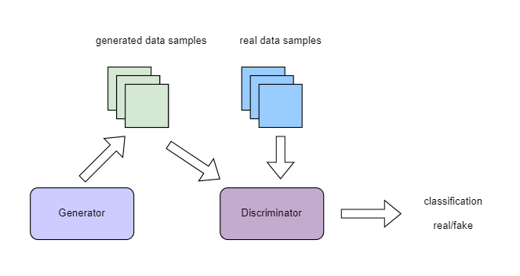
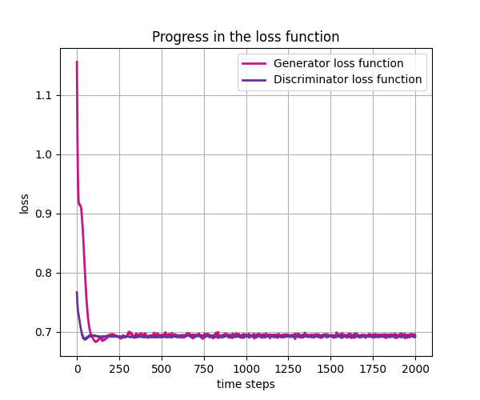
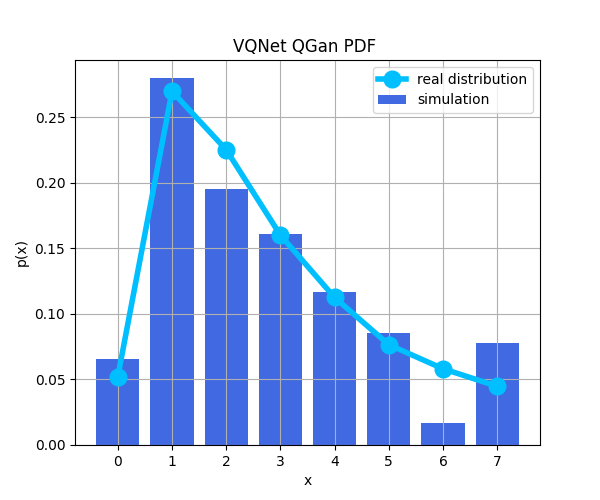
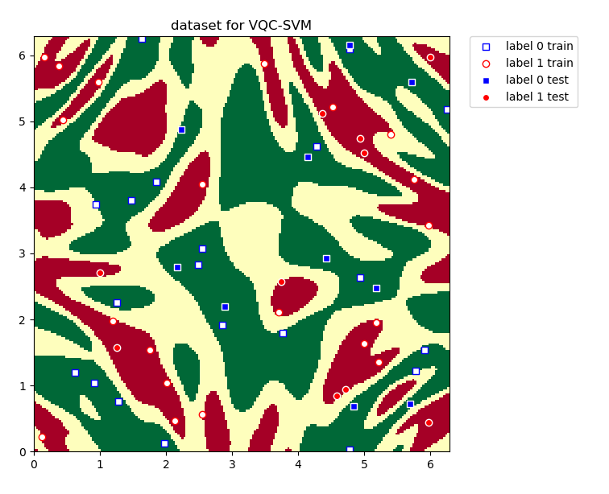
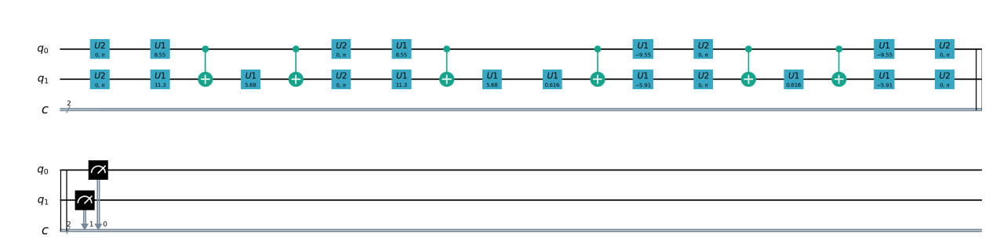

Quantum Machine Learning API using QPanda2
####################################################

.. warning::

    The quantum computing part of the following interface uses pyQPanda2 https://pyqpanda-toturial.readthedocs.io/zh/latest/.

    Due to the compatibility issues between pyQPanda2 and pyqpanda3, you need to install pyqpnda2 yourself, `pip install pyqpanda`

Quantum Computing Layer
***********************************

.. _QuantumLayer:

QuantumLayer
=================================

QuantumLayer is a package class of autograd module that supports ariational quantum circuits. You can define a function as an argument, such as ``qprog_with_measure``, This function needs to contain the quantum circuit defined by pyQPanda: It generally contains coding-circuit, evolution-circuit and measurement-operation.
This QuantumLayer class can be embedded into the hybrid quantum classical machine learning model and minimize the objective function or loss function of the hybrid quantum classical model through the classical gradient descent method.
You can specify the gradient calculation method of quantum circuit parameters in ``QuantumLayer`` by change the parameter ``diff_method``. ``QuantumLayer`` currently supports two methods, one is ``finite_diff`` and the other is ``parameter-shift`` methods.

The ``finite_diff`` method is one of the most traditional and common numerical methods for estimating function gradient.The main idea is to replace partial derivatives with differences:

.. math::

    f^{\prime}(x)=\lim _{h \rightarrow 0} \frac{f(x+h)-f(x)}{h}

For the ``parameter-shift`` method we use the objective function, such as:

.. math:: O(\theta)=\left\langle 0\left|U^{\dagger}(\theta) H U(\theta)\right| 0\right\rangle

It is theoretically possible to calculate the gradient of parameters about Hamiltonian in a quantum circuit by the more precise method: ``parameter-shift``.

.. math::

    \nabla O(\theta)=
    \frac{1}{2}\left[O\left(\theta+\frac{\pi}{2}\right)-O\left(\theta-\frac{\pi}{2}\right)\right]

.. py:class:: pyvqnet.qnn.quantumlayer.QuantumLayer(qprog_with_measure,para_num,machine_type_or_cloud_token,num_of_qubits:int,num_of_cbits:int = 1,diff_method:str = "parameter_shift",delta:float = 0.01, dtype=None, name='')

    Abstract calculation module for variational quantum circuits. It simulates a parameterized quantum circuit and gets the measurement result.
    QuantumLayer inherits from Module ,so that it can calculate gradients of circuits parameters,and train variational quantum circuits model or embed variational quantum circuits into hybird quantum and classic model.
    
    This class dos not need you to initialize virtual machine in the ``qprog_with_measure`` function.

    :param qprog_with_measure: callable quantum circuits functions ,cosntructed by pyQPanda2
    :param para_num: `int` - Number of parameter
    :param machine_type_or_cloud_token: qpanda machine type or pyQPanda2 QCLOUD token : https://pyqpanda-toturial.readthedocs.io/zh/latest/Realchip.html
    :param num_of_qubits: num of qubits
    :param num_of_cbits: num of classic bits
    :param diff_method: 'parameter_shift' or 'finite_diff'
    :param delta:  delta for diff
    :param dtype: The data type of the parameter, defaults: None, use the default data type kfloat32, which represents a 32-bit floating point number.
    :param name: name of the output layer

    :return: a module can calculate quantum circuits .

    .. note::
        qprog_with_measure is quantum circuits function defined in pyQPanda2 :https://pyqpanda-toturial.readthedocs.io/zh/latest/QCircuit.html.

        This function should contain following parameters,otherwise it can not run properly in QuantumLayer.

        qprog_with_measure (input,param,qubits,cbits,m_machine)

            `input`: array_like input 1-dim classic data

            `param`: array_like input 1-dim quantum circuit's parameters

            `qubits`: qubits allocated by QuantumLayer

            `cbits`: cbits allocated by QuantumLayer.if your circuits does not use cbits,you should also reserve this parameter.

            `m_machine`: simulator created by QuantumLayer

        Use the ``m_para`` attribute of QuantumLayer to get the training parameters of the variable quantum circuit. The parameter is a ``QTensor`` class, which can be converted into a numpy array using the ``to_numpy()`` interface.

    .. note::

        The class have alias: `QpandaQCircuitVQCLayer` .

    Example::

        import pyqpanda as pq
        from pyvqnet.qnn.measure import ProbsMeasure
        from pyvqnet.qnn.quantumlayer import QuantumLayer
        import numpy as np
        from pyvqnet.tensor import QTensor
        def pqctest (input,param,qubits,cbits,m_machine):
            circuit = pq.QCircuit()
            circuit.insert(pq.H(qubits[0]))
            circuit.insert(pq.H(qubits[1]))
            circuit.insert(pq.H(qubits[2]))
            circuit.insert(pq.H(qubits[3]))

            circuit.insert(pq.RZ(qubits[0],input[0]))
            circuit.insert(pq.RZ(qubits[1],input[1]))
            circuit.insert(pq.RZ(qubits[2],input[2]))
            circuit.insert(pq.RZ(qubits[3],input[3]))

            circuit.insert(pq.CNOT(qubits[0],qubits[1]))
            circuit.insert(pq.RZ(qubits[1],param[0]))
            circuit.insert(pq.CNOT(qubits[0],qubits[1]))

            circuit.insert(pq.CNOT(qubits[1],qubits[2]))
            circuit.insert(pq.RZ(qubits[2],param[1]))
            circuit.insert(pq.CNOT(qubits[1],qubits[2]))

            circuit.insert(pq.CNOT(qubits[2],qubits[3]))
            circuit.insert(pq.RZ(qubits[3],param[2]))
            circuit.insert(pq.CNOT(qubits[2],qubits[3]))

            prog = pq.QProg()
            prog.insert(circuit)
            # pauli_dict  = {'Z0 X1':10,'Y2':-0.543}
            rlt_prob = ProbsMeasure([0,2],prog,m_machine,qubits)
            return rlt_prob

        pqc = QuantumLayer(pqctest,3,"cpu",4,1)
        #classic data as input
        input = QTensor([[1,2,3,4],[40,22,2,3],[33,3,25,2.0]] )
        #forward circuits
        rlt = pqc(input)
        grad =  QTensor(np.ones(rlt.data.shape)*1000)
        #backward circuits
        rlt.backward(grad)
        print(rlt)
        # [
        # [0.2500000, 0.2500000, 0.2500000, 0.2500000],
        # [0.2500000, 0.2500000, 0.2500000, 0.2500000],
        # [0.2500000, 0.2500000, 0.2500000, 0.2500000]
        # ]

QuantumLayerV2
=================================

If you are more familiar with pyQPanda2 syntax, please using QuantumLayerV2 class, you can define the quantum circuits function by using ``qubits``, ``cbits`` and ``machine``, then take it as a argument ``qprog_with_measure`` of QuantumLayerV2.

.. py:class:: pyvqnet.qnn.quantumlayer.QuantumLayerV2(qprog_with_measure, para_num, diff_method: str = 'parameter_shift', delta: float = 0.01, dtype=None, name='')

    Abstract calculation module for variational quantum circuits. It simulates a parameterized quantum circuit and gets the measurement result.
    QuantumLayer inherits from Module ,so that it can calculate gradients of circuits parameters,and train variational quantum circuits model or embed variational quantum circuits into hybird quantum and classic model.
    
    To use this module, you need to create your quantum virtual machine and allocate qubits and cbits.

    :param qprog_with_measure: callable quantum circuits functions ,cosntructed by pyQPanda2
    :param para_num: `int` - Number of parameter
    :param diff_method: 'parameter_shift' or 'finite_diff'
    :param delta:  delta for diff
    :param dtype: The data type of the parameter, defaults: None, use the default data type kfloat32, which represents a 32-bit floating point number.
    :param name: name of the output layer
    :return: a module can calculate quantum circuits .

    .. note::
        qprog_with_measure is quantum circuits function defined in pyQPanda :https://pyqpanda-toturial.readthedocs.io/zh/latest/QCircuit.html.

        This function should contains following parameters,otherwise it can not run properly in QuantumLayerV2.

        Compare to QuantumLayer.you should allocate qubits and simulator: https://pyqpanda-toturial.readthedocs.io/zh/latest/QuantumMachine.html,

        you may also need to allocate cbits if qprog_with_measure needs quantum measure: https://pyqpanda-toturial.readthedocs.io/zh/latest/Measure.html

        qprog_with_measure (input,param)

        `input`: array_like input 1-dim classic data

        `param`: array_like input 1-dim quantum circuit's parameters

    .. note::

        The class have alias: `QpandaQCircuitVQCLayerLite` .

    Example::

        import pyqpanda as pq
        from pyvqnet.qnn.measure import ProbsMeasure
        from pyvqnet.qnn.quantumlayer import QuantumLayerV2
        import numpy as np
        from pyvqnet.tensor import QTensor
        def pqctest (input,param):
            num_of_qubits = 4

            m_machine = pq.CPUQVM()# outside
            m_machine.init_qvm()# outside
            qubits = m_machine.qAlloc_many(num_of_qubits)

            circuit = pq.QCircuit()
            circuit.insert(pq.H(qubits[0]))
            circuit.insert(pq.H(qubits[1]))
            circuit.insert(pq.H(qubits[2]))
            circuit.insert(pq.H(qubits[3]))

            circuit.insert(pq.RZ(qubits[0],input[0]))
            circuit.insert(pq.RZ(qubits[1],input[1]))
            circuit.insert(pq.RZ(qubits[2],input[2]))
            circuit.insert(pq.RZ(qubits[3],input[3]))

            circuit.insert(pq.CNOT(qubits[0],qubits[1]))
            circuit.insert(pq.RZ(qubits[1],param[0]))
            circuit.insert(pq.CNOT(qubits[0],qubits[1]))

            circuit.insert(pq.CNOT(qubits[1],qubits[2]))
            circuit.insert(pq.RZ(qubits[2],param[1]))
            circuit.insert(pq.CNOT(qubits[1],qubits[2]))

            circuit.insert(pq.CNOT(qubits[2],qubits[3]))
            circuit.insert(pq.RZ(qubits[3],param[2]))
            circuit.insert(pq.CNOT(qubits[2],qubits[3]))

            prog = pq.QProg()
            prog.insert(circuit)
            rlt_prob = ProbsMeasure([0,2],prog,m_machine,qubits)
            return rlt_prob

        pqc = QuantumLayerV2(pqctest,3)

        #classic data as input
        input = QTensor([[1,2,3,4],[4,2,2,3],[3,3,2,2.0]] )

        #forward circuits
        rlt = pqc(input)

        grad =  QTensor(np.ones(rlt.data.shape)*1000)
        #backward circuits
        rlt.backward(grad)
        print(rlt)

        # [
        # [0.2500000, 0.2500000, 0.2500000, 0.2500000],
        # [0.2500000, 0.2500000, 0.2500000, 0.2500000],
        # [0.2500000, 0.2500000, 0.2500000, 0.2500000]
        # ]

 

NoiseQuantumLayer
=================================

In the real quantum computer, due to the physical characteristics of the quantum bit, there is always inevitable calculation error. In order to better simulate this error in quantum virtual machine, VQNet also supports quantum virtual machine with noise. The simulation of quantum virtual machine with noise is closer to the real quantum computer. We can customize the supported logic gate type and the noise model supported by the logic gate.
The existing supported quantum noise model is defined in pyQPanda2 `NoiseQVM <https://pyqpanda-toturial.readthedocs.io/zh/latest/NoiseQVM.html>`_ .

We can use ``NoiseQuantumLayer`` to define an automatic microclassification of quantum circuits. ``NoiseQuantumLayer`` supports pyQPanda2 quantum virtual machine with noise. You can define a function as an argument ``qprog_with_measure``. This function needs to contain the quantum circuit defined by pyQPanda, as also you need to pass in a argument ``noise_set_config``, by using the pyQPanda interface to set up the noise model.

.. py:class:: pyvqnet.qnn.quantumlayer.NoiseQuantumLayer(qprog_with_measure, para_num, machine_type, num_of_qubits: int, num_of_cbits: int = 1, diff_method: str = 'parameter_shift', delta: float = 0.01, noise_set_config=None, dtype=None, name='')

    Abstract calculation module for variational quantum circuits. It simulates a parameterized quantum circuit and gets the measurement result.
    QuantumLayer inherits from Module ,so that it can calculate gradients of circuits parameters,and train variational quantum circuits model or embed variational quantum circuits into hybird quantum and classic model.
    
    This module should be initialized with noise model by ``noise_set_config``.

    :param qprog_with_measure: callable quantum circuits functions ,cosntructed by pyQPanda2
    :param para_num: `int` - Number of para_num
    :param machine_type: pyQPanda2 machine type
    :param num_of_qubits: num of qubits
    :param num_of_cbits: num of cbits
    :param diff_method: 'parameter_shift' or 'finite_diff'
    :param delta:  delta for diff
    :param noise_set_config: noise set function
    :param dtype: The data type of the parameter, defaults: None, use the default data type kfloat32, which represents a 32-bit floating point number.
    :param name: name of the output layer
    
    :return: a module can calculate quantum circuits with noise model.

    .. note::
        qprog_with_measure is quantum circuits function defined in pyQPanda :https://pyqpanda-toturial.readthedocs.io/zh/latest/QCircuit.html.

        This function should contains following parameters,otherwise it can not run properly in NoiseQuantumLayer.

        qprog_with_measure (input,param,qubits,cbits,m_machine)

        `input`: array_like input 1-dim classic data

        `param`: array_like input 1-dim quantum circuit's parameters

        `qubits`: qubits allocated by NoiseQuantumLayer

        `cbits`: cbits allocated by NoiseQuantumLayer.if your circuits does not use cbits,you should also reserve this parameter.

        `m_machine`: simulator created by NoiseQuantumLayer

    Example::

        import pyqpanda as pq
        from pyvqnet.qnn.measure import ProbsMeasure
        from pyvqnet.qnn.quantumlayer import NoiseQuantumLayer
        import numpy as np
        from pyqpanda import *
        from pyvqnet.tensor import QTensor

        def circuit(weights, param, qubits, cbits, machine):

            circuit = pq.QCircuit()

            circuit.insert(pq.H(qubits[0]))
            circuit.insert(pq.RY(qubits[0], weights[0]))
            circuit.insert(pq.RY(qubits[0], param[0]))
            prog = pq.QProg()
            prog.insert(circuit)
            prog << measure_all(qubits, cbits)

            result = machine.run_with_configuration(prog, cbits, 100)

            counts = np.array(list(result.values()))
            states = np.array(list(result.keys())).astype(float)
            # Compute probabilities for each state
            probabilities = counts / 100
            # Get state expectation
            expectation = np.sum(states * probabilities)
            return expectation

        def default_noise_config(qvm, q):

            p = 0.01
            qvm.set_noise_model(NoiseModel.BITFLIP_KRAUS_OPERATOR,
                                GateType.PAULI_X_GATE, p)
            qvm.set_noise_model(NoiseModel.BITFLIP_KRAUS_OPERATOR,
                                GateType.PAULI_Y_GATE, p)
            qvm.set_noise_model(NoiseModel.BITFLIP_KRAUS_OPERATOR,
                                GateType.PAULI_Z_GATE, p)
            qvm.set_noise_model(NoiseModel.BITFLIP_KRAUS_OPERATOR, GateType.RX_GATE, p)
            qvm.set_noise_model(NoiseModel.BITFLIP_KRAUS_OPERATOR, GateType.RY_GATE, p)
            qvm.set_noise_model(NoiseModel.BITFLIP_KRAUS_OPERATOR, GateType.RZ_GATE, p)
            qvm.set_noise_model(NoiseModel.BITFLIP_KRAUS_OPERATOR, GateType.RY_GATE, p)
            qvm.set_noise_model(NoiseModel.BITFLIP_KRAUS_OPERATOR,
                                GateType.HADAMARD_GATE, p)
            qves = []
            for i in range(len(q) - 1):
                qves.append([q[i], q[i + 1]])  #
            qves.append([q[len(q) - 1], q[0]])
            qvm.set_noise_model(NoiseModel.DAMPING_KRAUS_OPERATOR, GateType.CNOT_GATE,
                                p, qves)

            return qvm

        qvc = NoiseQuantumLayer(circuit,
                                24,
                                "noise",
                                1,
                                1,
                                diff_method="parameter_shift",
                                delta=0.01,
                                noise_set_config=default_noise_config)
        input = QTensor([[0., 1., 1., 1.], [0., 0., 1., 1.], [1., 0., 1., 1.]])
        rlt = qvc(input)
        grad = QTensor(np.ones(rlt.data.shape) * 1000)

        rlt.backward(grad)
        print(qvc.m_para.grad)

        #[1195., 105., 70., 0.,
        # 45., -45., 50., 15.,
        # -80., 50., 10., -30.,
        # 10., 60., 75., -110.,
        # 55., 45., 25., 5.,
        # 5., 50., -25., -15.]

Here is an example of ``noise_set_config``, here we add the noise model BITFLIP_KRAUS_OPERATOR where the noise argument p=0.01 to the quantum gate ``RX`` , ``RY`` , ``RZ`` , ``X`` , ``Y`` , ``Z`` , ``H``, etc.

.. code-block::

	def noise_set_config(qvm,q):

		p = 0.01
		qvm.set_noise_model(NoiseModel.BITFLIP_KRAUS_OPERATOR, GateType.PAULI_X_GATE, p)
		qvm.set_noise_model(NoiseModel.BITFLIP_KRAUS_OPERATOR, GateType.PAULI_Y_GATE, p)
		qvm.set_noise_model(NoiseModel.BITFLIP_KRAUS_OPERATOR, GateType.PAULI_Z_GATE, p)
		qvm.set_noise_model(NoiseModel.BITFLIP_KRAUS_OPERATOR, GateType.RX_GATE, p)
		qvm.set_noise_model(NoiseModel.BITFLIP_KRAUS_OPERATOR, GateType.RY_GATE, p)
		qvm.set_noise_model(NoiseModel.BITFLIP_KRAUS_OPERATOR, GateType.RZ_GATE, p)
		qvm.set_noise_model(NoiseModel.BITFLIP_KRAUS_OPERATOR, GateType.RY_GATE, p)
		qvm.set_noise_model(NoiseModel.BITFLIP_KRAUS_OPERATOR, GateType.HADAMARD_GATE, p)
		qves =[]
		for i in range(len(q)-1):
			qves.append([q[i],q[i+1]])#
		qves.append([q[len(q)-1],q[0]])
		qvm.set_noise_model(NoiseModel.DAMPING_KRAUS_OPERATOR, GateType.CNOT_GATE, p, qves)

		return qvm

QiskitLayer
=================================

.. py:class:: pyvqnet.qnn.QiskitLayer(qiskit_circuits,para_num)

    A wrapper layer for implementing forward and backward propagation with Qiskit circuits in VQNet. QISKIT_VQC is a class that defines a Qiskit quantum circuit and its run function.
    The following example demonstrates how it works. This layer only supports circuit inputs and weights as parameters.
    
    :param cirq_vqc: A class that defines the definition, backend, and execution functions of a Qiskit circuit.
    :param para_num: `int` - The number of para_num.
    :return: A class capable of running qiskit quantum circuit models.

    Example::

        """
        

        qiskit                        2.1.1
        qiskit-aer                    0.17.2
        opencv-python
        """
        import sys
        sys.path.insert(0,"../")
        import os
        import os.path
        import urllib
        import gzip
        import numpy as np
        import random
        import sys
        sys.path.insert(0,"../../")
        random.seed(42)
        np.random.seed(42)
        from pyvqnet.nn.module import Module
        from pyvqnet.optim import Adam
        import pyvqnet
        pyvqnet.utils.set_random_seed(42)
        from pyvqnet.nn.loss import MeanSquaredError
        from pyvqnet.qnn.utils import QiskitLayer

        import qiskit
        from qiskit.quantum_info import Statevector
        from qiskit import  QuantumRegister, ClassicalRegister

        from qiskit.quantum_info.operators import  Pauli
        max_parallel_threads = 24
        gpu = False
        method = "statevector"
        backend_options = {
            "method": method,
            "precision": "double",
            "max_parallel_threads": max_parallel_threads,
            "fusion_enable": True,
            "fusion_threshold": 14,
            "fusion_max_qubit": 5,
        }
        from qiskit_aer import StatevectorSimulator
        simulator = StatevectorSimulator()

        simulator.set_options(**backend_options)

        url_base = 'https://ossci-datasets.s3.amazonaws.com/mnist/'
        key_file = {
            'train_img':'train-images-idx3-ubyte.gz',
            'train_label':'train-labels-idx1-ubyte.gz',
            'test_img':'t10k-images-idx3-ubyte.gz',
            'test_label':'t10k-labels-idx1-ubyte.gz'
        }

        def _download(dataset_dir,file_name):
            file_path = dataset_dir + "/" + file_name

            if os.path.exists(file_path):
                with gzip.GzipFile(file_path) as f:
                    file_path_ungz = file_path[:-3].replace('\\', '/')
                    if not os.path.exists(file_path_ungz):
                        open(file_path_ungz,"wb").write(f.read())
                return

            print("Downloading " + file_name + " ... ")
            urllib.request.urlretrieve(url_base + file_name, file_path)
            if os.path.exists(file_path):
                    with gzip.GzipFile(file_path) as f:
                        file_path_ungz = file_path[:-3].replace('\\', '/')
                        file_path_ungz = file_path_ungz.replace('-idx', '.idx')
                        if not os.path.exists(file_path_ungz):
                            open(file_path_ungz,"wb").write(f.read())
            print("Done")

        def download_mnist(dataset_dir):
            for v in key_file.values():
                _download(dataset_dir,v)

        def dataloader(data,label,batch_size, shuffle = True)->np:
            if shuffle:
                for _ in range(len(data)//batch_size):
                    random_index = np.random.randint(0, len(data), (batch_size, 1))
                    yield data[random_index].reshape(batch_size,-1),label[random_index].reshape(batch_size,-1)
            else:
                for i in range(0,len(data)-batch_size+1,batch_size):
                    yield data[i:i+batch_size], label[i:i+batch_size]

        def get_accuracy(result,label):
            result,label = np.array(result.data), np.array(label.data)

            is_correct = (np.abs(result - label) < 0.5)
            is_correct = np.count_nonzero(is_correct)
            acc = is_correct

            return acc

        def load_mnist_4_4(dataset="training_data", digits=np.arange(10),
                        path="."):
            import os, struct
            from array import array as pyarray
            download_mnist(path)
            if dataset == "training_data":
                fname_image = os.path.join(path, 'train-images.idx3-ubyte').replace('\\', '/')
                fname_label = os.path.join(path, 'train-labels.idx1-ubyte').replace('\\', '/')
            elif dataset == "testing_data":
                fname_image = os.path.join(path, 't10k-images.idx3-ubyte').replace('\\', '/')
                fname_label = os.path.join(path, 't10k-labels.idx1-ubyte').replace('\\', '/')
            else:
                raise ValueError("dataset must be 'training_data' or 'testing_data'")

            flbl = open(fname_label, 'rb')
            magic_nr, size = struct.unpack(">II", flbl.read(8))

            lbl = pyarray("b", flbl.read())
            flbl.close()

            fimg = open(fname_image, 'rb')
            magic_nr, size, rows, cols = struct.unpack(">IIII", fimg.read(16))
            img = pyarray("B", fimg.read())
            fimg.close()

            ind = [k for k in range(size) if lbl[k] in digits]
            N = len(ind)
            images = np.zeros((N, rows, cols))
            images_new = []# = np.zeros((N, 4, 4))
            labels = np.zeros((N, 1), dtype=int)
            import cv2
            for i in range(len(ind)):
                tmp1 = np.array(img[ind[i] * rows * cols: (ind[i] + 1) * rows * cols]).reshape((rows, cols))
                tmp1 = tmp1[4:24,4:24]
                tmp = cv2.resize(tmp1,(4,4))

                if np.max(tmp) ==0:
                    continue
                images_new.append(tmp)
                if lbl[ind[i]] ==digits[1]:
                    labels[i] = 1
                else:
                    labels[i] = 0

            return np.array(images_new), labels

        class QISKIT_VQC:

            def __init__(self, n_qubits, backend, shots):
                # --- Circuit definition ---

                qc = ClassicalRegister(1)
                self.qc = qc
                self.n_qubits = n_qubits

                all_qubits = [i for i in range(n_qubits)]
                self.all_qubits= all_qubits

                self.backend = backend
                self.shots = shots

            def run(self,**kwargs):

                x  = kwargs['x']
                weights  = kwargs['w']

                weights = weights.astype(np.float64)
                x = x.astype(np.float64)

                sum_feature = np.power(np.sum([t**2 for t in x]),0.5)
                normalize_feat = x/sum_feature

                self._circuit = qiskit.QuantumCircuit(QuantumRegister(4))

                self.theta = weights.reshape([4,6])
                self._circuit.initialize(normalize_feat, [0,1,2,3])

                for i in range(self.n_qubits):
                    self._circuit.rz(self.theta[i,0], i)
                    self._circuit.ry(self.theta[i,1], i)
                    self._circuit.rz(self.theta[i,2], i)

                for d in range(3, 6):

                    for i in range(self.n_qubits-1):
                        self._circuit.cx(i, i + 1)
                    self._circuit.cx(self.n_qubits-1, 0)

                    for i in range(self.n_qubits):
                        self._circuit.ry(self.theta[i,d], i)

                statevec = Statevector(self._circuit)
                Expectation = np.real(statevec.expectation_value(Pauli('ZIII')))
                return Expectation

        #define qiskit circuits class
        circuit = QISKIT_VQC(4, simulator, 1000)

        class Model_qiskit(Module):
            def __init__(self):
                super(Model_qiskit, self).__init__()
                self.qvc = QiskitLayer(circuit,24)

            def forward(self, x):

                return self.qvc(x)*0.5 + 0.5

        def Run_qiskit():

            x_train, y_train = load_mnist_4_4("training_data",digits=[3,6])

            y_train = y_train.reshape(-1, 1)

            x_test, y_test = load_mnist_4_4("testing_data",digits=[3,6])

            x_train = x_train.astype(np.float32)
            x_test = x_test.astype(np.float32)
            y_train = y_train.astype(np.float32)
            y_test = y_test.astype(np.float32)
            x_train = x_train *np.pi / 255
            x_test = x_test *np.pi / 255
            x_train = x_train[:100]
            y_train = y_train[:100]

            x_test = x_test[:50]
            y_test = y_test[:50]

            model = Model_qiskit()

            optimizer = Adam(model.parameters(),lr =0.01)
            batch_size = 10
            epoch = 2

            loss = MeanSquaredError()
            print("start training..............")
            model.train()

            TL=[]

            TA=[]

            for i in range(epoch):
                count=0
                sum_loss = 0
                accuracy = 0
                t = 0
                model.train()
                for data,label in dataloader(x_train,y_train,batch_size,True):

                    optimizer.zero_grad()

                    result = model(data)

                    loss_b = loss(label,result)

                    loss_b.backward()
                    optimizer._step()
                    sum_loss += loss_b.item()
                    count+=batch_size
                    accuracy += get_accuracy(result,label)
                    t = t + 1

                    print(f"epoch:{i}, iter{t} #### loss:{sum_loss*batch_size/count} #####accuray:{accuracy/count}")
                TL.append(sum_loss*batch_size/count)
                TA.append(accuracy/count)
            print(f"qiskit epoch {epoch}, accuracy {TA[-1]}")

        if __name__=="__main__":

            Run_qiskit()

CirqLayer
=================================

.. py:class:: pyvqnet.qnn.CirqLayer(cirq_vqc,para_num)

    A cirq circuit encapsulation layer for implementing forward and backward propagation in vqnet. CIRQ_VQC is a class that requires users to define a cirq quantum circuit and its `run` function. The following example demonstrates its working principle.
    This layer only supports circuit inputs and weights as parameters.

    :param cirq_vqc: A class defining the definition, backend, and running functions of a Cirq circuit.
    :param para_num: `int` - The number of para_nums.
    :return: A class capable of running the Cirq quantum circuit model.

    .. note::

        The following example code requires `cirq==1.5.0, numpy <2`.

    Example::

        import numpy as np
        import random
        random.seed(42)
        np.random.seed(42)
        from pyvqnet.nn.module import Module
        import pyvqnet
        pyvqnet.utils.set_random_seed(42)
        from pyvqnet.optim import Adam

        from pyvqnet.nn.loss import MeanSquaredError
        from pyvqnet.qnn.utils import CirqLayer

        import cirq
        import sympy
        from pyvqnet.utils.utils import get_circuit_symbols

        def dataloader(data,label,batch_size, shuffle = True)->np:
            if shuffle:
                for _ in range(len(data)//batch_size):
                    random_index = np.random.randint(0, len(data), (batch_size, 1))
                    yield data[random_index].reshape(batch_size,-1),label[random_index].reshape(batch_size,-1)
            else:
                for i in range(0,len(data)-batch_size+1,batch_size):
                    yield data[i:i+batch_size].reshape(batch_size,-1), label[i:i+batch_size].reshape(batch_size,-1)

        def get_accuracy(result,label):
            result,label = np.array(result.data), np.array(label.data)

            is_correct = (np.abs(result - label) < 0.5)
            is_correct = np.count_nonzero(is_correct)
            acc = is_correct

            return acc

        def load_mnist_4_4(dataset="training_data", digits=np.arange(10), 
                        path=".",encoding = "raw" ):
            import os, struct
            from array import array as pyarray
            if dataset == "training_data":
                fname_image = os.path.join(path, 'train-images.idx3-ubyte').replace('\\', '/')
                fname_label = os.path.join(path, 'train-labels.idx1-ubyte').replace('\\', '/')
            elif dataset == "testing_data":
                fname_image = os.path.join(path, 't10k-images.idx3-ubyte').replace('\\', '/')
                fname_label = os.path.join(path, 't10k-labels.idx1-ubyte').replace('\\', '/')
            else:
                raise ValueError("dataset must be 'training_data' or 'testing_data'")

            flbl = open(fname_label, 'rb')
            magic_nr, size = struct.unpack(">II", flbl.read(8))

            lbl = pyarray("b", flbl.read())
            flbl.close()

            fimg = open(fname_image, 'rb')
            magic_nr, size, rows, cols = struct.unpack(">IIII", fimg.read(16))
            img = pyarray("B", fimg.read())
            fimg.close()

            ind = [k for k in range(size) if lbl[k] in digits]
            N = len(ind)

            images_new = []# = np.zeros((N, 4, 4))
            labels = np.zeros((N, 1), dtype=int)
            import cv2
            for i in range(len(ind)):
                tmp1 = np.array(img[ind[i] * rows * cols: (ind[i] + 1) * rows * cols]).reshape((rows, cols))
                tmp1 = tmp1[4:24,4:24]
                tmp = cv2.resize(tmp1,(4,4))

                if np.max(tmp) ==0:
                    continue
                if encoding == "normalized":
                    sum_feature = np.power(np.sum([t**2 for t in tmp.flatten()]),0.5)
                        
                    normalize_feat = tmp/sum_feature
                images_new.append(normalize_feat)
                if lbl[ind[i]] ==digits[1]:
                    labels[i] = 1
                else:
                    labels[i] = 0 

            return np.array(images_new), labels

        class CIRQ_VQC:

            def __init__(self,simulator = cirq.Simulator ()):

                self._circuit = cirq.Circuit()
                n_qubits =4
                ###define qubits
                q0 = cirq.NamedQubit ('q0')
                q1 = cirq.NamedQubit ('q1')
                q2 = cirq.NamedQubit ('q2')
                q3 = cirq.NamedQubit ('q3')
                qubits = [q0,q1,q2,q3]
                self.qubits = [q0,q1,q2,q3]
                ###define varational parameters
                param = sympy.symbols(f'theta(0:24)')
                self.theta = np.asarray(param).reshape((4,6))

                ###define circuits
                circuit = cirq.Circuit()

                for i ,q in enumerate(qubits):
                    circuit.append(cirq.rz(self.theta[i][0])(q))
                    circuit.append(cirq.ry(self.theta[i][1])(q))
                    circuit.append(cirq.rz(self.theta[i][2])(q))
                
                for d in range(3, 6):
                    for i in range(n_qubits-1):
                        circuit.append(cirq.CNOT(qubits[i], qubits[i + 1]))
                    circuit.append(cirq.CNOT(qubits[n_qubits-1], qubits[0]))

                    for i ,q in enumerate(qubits):
                        circuit.append(cirq.ry(self.theta[i][d])(q))

                self._circuit = circuit
                
                ###define backend
                self._backend = simulator

                self._param_symbols_list,self._input_symbols_list = get_circuit_symbols(self._circuit)

            def run(self,resolver,init_state):

                rlt = self._backend.simulate(self._circuit,resolver,initial_state=init_state).final_state_vector
                z0 = cirq.Z(self.qubits[0])

                qubit_map={self.qubits[0]: 0}
                
                expectation = z0.expectation_from_state_vector(rlt, qubit_map).real

                return expectation

        #define cirq circuits class
        circuit = CIRQ_VQC()

        class Model_cirq(Module):
            def __init__(self):
                super(Model_cirq, self).__init__()
                self.qvc = CirqLayer(circuit,24)

            def forward(self, x):

                y = self.qvc(x)*0.5 + 0.5
                return y.astype(x.dtype)

        def run_cirq():

            x_train, y_train = load_mnist_4_4("training_data",digits=[3,6],encoding="normalized")
            y_train = y_train.reshape(-1, 1) 

            x_test, y_test = load_mnist_4_4("testing_data",digits=[3,6],encoding="normalized")

            x_train = x_train.astype(np.float32)
            x_test = x_test.astype(np.float32)
            y_test = y_test.astype(np.float32)
            y_train = y_train.astype(np.float32)
            x_train = x_train[:100] 

            y_train = y_train[:100] 

            x_test = x_test[:50]

            y_test = y_test[:50]  

            model = Model_cirq()

            optimizer = Adam(model.parameters(),lr =0.01)
            batch_size = 10
            epoch = 5

            loss = MeanSquaredError()
            print("start training..............")
            model.train()

            TL=[]
            TA=[]

            for i in range(epoch):
                count=0
                sum_loss = 0
                accuracy = 0
                t = 0
                for data,label in dataloader(x_train,y_train,batch_size,False):

                    optimizer.zero_grad()
                    result = model(data)
                    loss_b = loss(label,result)

                    loss_b.backward()
                    optimizer._step()
                    sum_loss += loss_b.item()
                    count+=batch_size
                    accuracy += get_accuracy(result,label)
                    t = t + 1

                    print(f"epoch:{i},  #### loss:{sum_loss*batch_size/count} #####accuray:{accuracy/count}")
                TL.append(sum_loss*batch_size/count)
                TA.append(accuracy/count)
            print(f"cirq epoch {epoch}, final accuracy {TA[-1]}")

        if __name__=="__main__":
        
            run_cirq()

Quantum Gates
***********************************

The way to deal with qubits is called quantum gates. Using quantum gates, we consciously evolve quantum states. Quantum gates are the basis of quantum algorithms.

Basic quantum gates
=================================

In VQNet, we use each logic gate of `pyQPanda <https://pyqpanda-tutorial-en.readthedocs.io/en/latest/>`__ developed by the original quantum to build quantum circuit and conduct quantum simulation.
The gates currently supported by pyQPanda can be defined in pyQPanda's `quantum gate <https://pyqpanda-tutorial-en.readthedocs.io/en/latest/chapter2/index.html#quantum-logic-gate>`_ section.
In addition, VQNet also encapsulates some quantum gate combinations commonly used in quantum machine learning.

AmplitudeEmbeddingCircuit
=================================

.. py:function:: pyvqnet.qnn.template.AmplitudeEmbeddingCircuit(input_feat, qubits)

    Encodes :math:`2^n` features into the amplitude vector of :math:`n` qubits.
    To represent a valid quantum state vector, the L2-norm of ``features`` must be one.

    :param input_feat: numpy array which represents paramters
    :param qubits: qubits allocated by pyQPanda
    :return: quantum circuits

    Example::

        import numpy as np
        import pyqpanda as pq
        from pyvqnet.qnn.template import AmplitudeEmbeddingCircuit
        input_feat = np.array([2.2, 1, 4.5, 3.7])
        m_machine = pq.init_quantum_machine(pq.QMachineType.CPU)
        m_qlist = m_machine.qAlloc_many(2)
        m_clist = m_machine.cAlloc_many(2)
        m_prog = pq.QProg()
        cir = AmplitudeEmbeddingCircuit(input_feat,m_qlist)
        print(cir)
        pq.destroy_quantum_machine(m_machine)

        #                              ┌────────────┐     ┌────────────┐
        # q_0:  |0>─────────────── ─── ┤RY(0.853255)├ ─── ┤RY(1.376290)├
        #           ┌────────────┐ ┌─┐ └──────┬─────┘ ┌─┐ └──────┬─────┘
        # q_1:  |0>─┤RY(2.355174)├ ┤X├ ───────■────── ┤X├ ───────■──────
        #           └────────────┘ └─┘                └─┘

Quantum Machine Learning APIs using pyQPanda2
***************************************************************************

Quantum Generative Adversarial Networks for learning and loading random distributions
==================================================================================================

Quantum Generative Adversarial Networks(`QGAN <https://www.nature.com/articles/s41534-019-0223-2>`_ )algorithm uses pure quantum variational circuits to prepare the generated quantum states with specific random distribution, which can reduce the logic gates required to generate specific quantum states and reduce the complexity of quantum circuits.It uses the classical GAN model structure, which has two sub-models: Generator and Discriminator. The Generator generates a specific distribution for the quantum circuit.And the Discriminator discriminates the generated data samples generated by the Generator and the real randomly distributed training data samples.
Here is an example of VQNet implementing QGAN learning and loading random distributions based on the paper `Quantum Generative Adversarial Networks for learning and loading random distributions <https://www.nature.com/articles/s41534-019-0223-2>`_ of Christa Zoufal.

|

In order to realize the construction of ``QGANAPI`` class of quantum generative adversarial network by VQNet, the quantum generator is used to prepare the initial state of the real distributed data. The number of quantum bits is 3, and the repetition times of the internal parametric circuit module of the quantum generator is 1. Meanwhile, KL is used as the metric for the QGAN loading random distribution.

.. code-block::

    import pickle
    import os
    import pyqpanda as pq
    from pyvqnet.qnn.qgan.qgan_utils import QGANAPI
    import numpy as np

    num_of_qubits = 3  # paper config
    rep = 1
    number_of_data = 10000
    # Load data samples from different distributions
    mu = 1
    sigma = 1
    real_data = np.random.lognormal(mean=mu, sigma=sigma, size=number_of_data)

    # intial
    save_dir = None
    qgan_model = QGANAPI(
        real_data,
        # numpy generated data distribution, 1 - dim.
        num_of_qubits,
        batch_size=2000,
        num_epochs=2000,
        q_g_cir=None,
        bounds = [0.0,2**num_of_qubits -1],
        reps=rep,
        metric="kl",
        tol_rel_ent=0.01,
        if_save_param_dir=save_dir
    )

The following is the ``train`` module of QGAN.

.. code-block::

    # train
    qgan_model.train()  # train qgan

The ``eval`` module of QGAN is designed to draw the loss function curve and probability distribution diagram between the random distribution prepared by QGAN and the real distribution.

.. code-block::

    # show probability distribution function of generated distribution and real distribution
    qgan_model.eval(real_data)  #draw pdf

The ``get_trained_quantum_parameters`` module of QGAN is used to get training parameters and output them as a numpy array. If ``save_DIR`` is not empty, the training parameters are saved to a file.The ``Load_param_and_eval`` module of QGAN loads training parameters, and the ``get_circuits_with_trained_param`` module obtains pyQPanda circuit generated by quantum generator after training.

.. code-block::

    # get trained quantum parameters
    param = qgan_model.get_trained_quantum_parameters()
    print(f" trained param {param}")

    #load saved parameters files
    if save_dir is not None:
        path = os.path.join(
            save_dir, qgan_model._start_time + "trained_qgan_param.pickle")
        with open(path, "rb") as file:
            t3 = pickle.load(file)
        param = t3["quantum_parameters"]
        print(f" trained param {param}")

    #show probability distribution function of generated distribution and real distribution
    qgan_model.load_param_and_eval(param)

    #calculate metric
    print(qgan_model.eval_metric(param, "kl"))

    #get generator quantum circuit
    m_machine = pq.CPUQVM()
    m_machine.init_qvm()
    qubits = m_machine.qAlloc_many(num_of_qubits)
    qpanda_cir = qgan_model.get_circuits_with_trained_param(qubits)
    print(qpanda_cir)

In general, QGAN learning and loading random distribution requires multiple training models with different random seeds to obtain the expected results. For example, the following is the graph of the probability distribution function between the lognormal distribution implemented by QGAN and the real lognormal distribution, and the loss function curve between QGAN's generator and discriminator.

|

|

quantum kernal SVM
=================================

In machine learning tasks, data often cannot be separated by a hyperplane in the original space. A common technique for finding such hyperplanes is to apply a nonlinear transformation function to the data.
This function is called a feature map, through which we can calculate how close the data points are in this new feature space for the classification task of machine learning.

This example refers to the thesis: `Supervised learning with quantum enhanced feature spaces <https://arxiv.org/pdf/1804.11326.pdf>`_ .
The first method constructs variational circuits for data classification tasks.

``gen_vqc_qsvm_data`` is the data needed to generate this example. ``vqc_qsvm`` is a variable sub-circuit class used to classify the input data.
The ``vqc_qsvm.plot()`` function visualizes the distribution of the data.

|

    .. code-block::

        """
        VQC QSVM
        """
        from pyvqnet.qnn.svm import vqc_qsvm, gen_vqc_qsvm_data
        import matplotlib.pyplot as plt
        import numpy as np

        batch_size = 40
        maxiter = 40
        training_size = 20
        test_size = 10
        gap = 0.3
        #sub-circuits repeat times
        rep = 3

        #defines QSVM class
        VQC_QSVM = vqc_qsvm(batch_size, maxiter, rep)
        #randomly generates data from thesis.
        train_features, test_features, train_labels, test_labels, samples = \
            gen_vqc_qsvm_data(training_size=training_size, test_size=test_size, gap=gap)
        VQC_QSVM.plot(train_features, test_features, train_labels, test_labels, samples)
        #train
        VQC_QSVM.train(train_features, train_labels)
        #test
        rlt, acc_1 = VQC_QSVM.predict(test_features, test_labels)
        print(f"testing_accuracy {acc_1}")

In addition to the above-mentioned direct use of variational quantum circuits to map classical data features to quantum feature spaces, in the paper `Supervised learning with quantum enhanced feature spaces <https://arxiv.org/pdf/1804.11326.pdf>`_,
the method of directly estimating kernel functions using quantum circuits and classifying them using classical support vector machines is also introduced.
Analogy to various kernel functions in classical SVM :math:`K(i,j)` , use quantum kernel function to define the inner product of classical data in quantum feature space :math:`\phi(\mathbf{x}_i)` :

.. math::
    |\langle \phi(\mathbf{x}_j) | \phi(\mathbf{x}_i) \rangle |^2 =  |\langle 0 | U^\dagger(\mathbf{x}_j) U(\mathbf{x}_i) | 0 \rangle |^2

Using VQNet and pyQPanda, we define a ``QuantumKernel_VQNet`` to generate a quantum kernel function and use ``sklearn`` for classification:

|

.. code-block::

    import numpy as np
    import pyqpanda as pq
    from sklearn.svm import SVC
    from pyqpanda import *
    from pyqpanda.Visualization.circuit_draw import *
    from pyvqnet.qnn.svm import QuantumKernel_VQNet, gen_vqc_qsvm_data
    import matplotlib
    try:
        matplotlib.use('TkAgg')
    except:
        pass
    import matplotlib.pyplot as plt

    train_features, test_features,train_labels, test_labels, samples = gen_vqc_qsvm_data(20,5,0.3)
    quantum_kernel = QuantumKernel_VQNet(n_qbits=2)
    quantum_svc = SVC(kernel=quantum_kernel.evaluate)
    quantum_svc.fit(train_features, train_labels)
    score = quantum_svc.score(test_features, test_labels)
    print(f"quantum kernel classification test score: {score}")

Simultaneous Perturbation Stochastic Approximation optimizers
=================================================================

.. py:function:: pyvqnet.qnn.SPSA(maxiter: int = 1000, save_steps: int = 1, last_avg: int = 1, c0: float = _C0, c1: float = 0.2, c2: float = 0.602, c3: float = 0.101, c4: float = 0, init_para=None, model=None, calibrate_flag=False)
    

    Simultaneous Perturbation Stochastic Approximation (SPSA) optimizer.

    SPSA provides a stochastic method for approximating the gradient of a multivariate differentiable cost function.
    To achieve this, the cost function is evaluated twice using a perturbed parameter vector: each component of the original parameter vector is simultaneously shifted by a randomly generated value.
    Further information is available on the `SPSA website <http://www.jhuapl.edu/SPSA>`__.

    :param maxiter: The maximum number of iterations to perform. Default value: 1000.
    :param save_steps: Save the intermediate information of each save_steps step. Default value: 1.
    :param last_avg: Averaging parameter for last_avg iterations.
        If last_avg = 1, only the last iteration is considered. Default value: 1.
    :param c0: initial a. Step size for updating parameters. Default value: 0.2*pi
    :param c1: initial c. The step size used to approximate the gradient. Default: 0.1.
    :param c2: alpha from the paper, used to adjust a(c0) at each iteration. Default value: 0.602.
    :param c3: gamma in the paper, used to adjust c(c1) at each iteration. Default value: 0.101.
    :param c4: Also used to control the parameters of a. Default value: 0.
    :param init_para: Initialization parameters. Default: None.
    :param model: Parametric model: model. Default: None.
    :param calibrate_flag: whether to calibrate hpyer parameters a and c, default value: False.

    :return: an SPSA optimizer instance

    .. warning::

        SPSA only supports 1-dim paramters.

    Example::

        import numpy as np
        import pyqpanda as pq

        import sys
        sys.path.insert(0, "../")
        import pyvqnet

        from pyvqnet.nn.module import Module
        from pyvqnet.qnn import SPSA
        from pyvqnet.tensor.tensor import QTensor
        from pyvqnet.qnn import AngleEmbeddingCircuit, expval, QuantumLayerV2, expval
        from pyvqnet.qnn.template import BasicEntanglerTemplate

        class Model_spsa(Module):
            def __init__(self):
                super(Model_spsa, self).__init__()
                self.qvc = QuantumLayerV2(layer_fn_spsa_pq, 3)

            def forward(self, x):
                y = self.qvc(x)
                return y

        def layer_fn_spsa_pq(input, weights):
            num_of_qubits = 1

            machine = pq.CPUQVM()
            machine.init_qvm()
            qubits = machine.qAlloc_many(num_of_qubits)
            c1 = AngleEmbeddingCircuit(input, qubits)
            weights =weights.reshape([4,1])
            bc_class = BasicEntanglerTemplate(weights, 1)
            c2 = bc_class.create_circuit(qubits)
            m_prog = pq.QProg()
            m_prog.insert(c1)
            m_prog.insert(c2)
            pauli_dict = {'Z0': 1}
            exp2 = expval(machine, m_prog, pauli_dict, qubits)

            return exp2

        model = Model_spsa()

        optimizer = SPSA(maxiter=20,
            init_para=model.parameters(),
            model=model,
        )

.. py:function:: pyvqnet.qnn.SPSA._step(input_data)

    use SPSA to optimize input data.

    :param input_data: input data
    :return:

        train_para: final parameter

        theta_best: The average parameters of after last `last_avg`.

    Example::

        import numpy as np
        import pyqpanda as pq

        import sys
        sys.path.insert(0, "../")
        import pyvqnet

        from pyvqnet.nn.module import Module
        from pyvqnet.qnn import SPSA
        from pyvqnet.tensor.tensor import QTensor
        from pyvqnet.qnn import AngleEmbeddingCircuit, expval, QuantumLayerV2, expval
        from pyvqnet.qnn.template import BasicEntanglerTemplate

        class Model_spsa(Module):
            def __init__(self):
                super(Model_spsa, self).__init__()
                self.qvc = QuantumLayerV2(layer_fn_spsa_pq, 3)

            def forward(self, x):
                y = self.qvc(x)
                return y

        def layer_fn_spsa_pq(input, weights):
            num_of_qubits = 1

            machine = pq.CPUQVM()
            machine.init_qvm()
            qubits = machine.qAlloc_many(num_of_qubits)
            c1 = AngleEmbeddingCircuit(input, qubits)
            weights =weights.reshape([4,1])
            bc_class = BasicEntanglerTemplate(weights, 1)
            c2 = bc_class.create_circuit(qubits)
            m_prog = pq.QProg()
            m_prog.insert(c1)
            m_prog.insert(c2)
            pauli_dict = {'Z0': 1}
            exp2 = expval(machine, m_prog, pauli_dict, qubits)

            return exp2

        model = Model_spsa()

        optimizer = SPSA(maxiter=20,
            init_para=model.parameters(),
            model=model,
        )

        data = QTensor(np.array([[0.27507603]]))
        p = model.parameters()
        p[0].data = pyvqnet._core.Tensor( np.array([3.97507603, 3.12950603, 1.00854038,
                        1.25907603]))

        optimizer._step(input_data=data)

        y = model(data)
        print(y)

Quantum fisher information computation matrix
========================================================

.. py:class:: pyvqnet.qnn.opt.quantum_fisher(py_qpanda_config, params, target_gate_type_lists,target_gate_bits_lists, qcir_lists, wires)
    
    Returns the quantum fisher information matrix for a quantum circuit.

    .. math::

        \mathrm{QFIM}_{i, j}=4 \operatorname{Re}\left[\left\langle\partial_i \psi(\boldsymbol{\theta}) \mid \partial_j \psi(\boldsymbol{\theta})\right\rangle-\left\langle\partial_i \psi(\boldsymbol{\theta}) \mid \psi(\boldsymbol{\theta})\right\rangle\left\langle\psi(\boldsymbol{\theta}) \mid \partial_j \psi(\boldsymbol{\theta})\right\rangle\right]

    The short version is :math::math:`\left|\partial_j \psi(\boldsymbol{\theta})\right\rangle:=\frac{\partial}{\partial \theta_j}|\psi(\boldsymbol{\theta})\rangle`.

    .. note::

        Currently only RX,RY,RZ are supported.

    :param params: Variable parameters in circuits.
    :param target_gate_type_lists: Supports "RX", "RY", "RZ" or lists.
    :param target_gate_bits_lists:  Which quantum bit or bits the parameterised gate acts on .
    :param qcir_lists: The list of quantum circles before the target parameterised gate to compute the metric tensor, see the following example.
    :param wires: Total Quantum Bit Index for Quantum Circuits.

    Example::
    
        import pyqpanda as pq

        from pyvqnet import *
        from pyvqnet.qnn.opt import pyqpanda_config_wrapper, insert_pauli_for_mt, quantum_fisher
        from pyvqnet.qnn import ProbsMeasure
        import numpy as np
        import pennylane as qml
        import pennylane.numpy as pnp

        n_wires = 4
        def layer_subcircuit_new(config: pyqpanda_config_wrapper, params):
            qcir = pq.QCircuit()
            qcir.insert(pq.RX(config._qubits[0], params[0]))
            qcir.insert(pq.RY(config._qubits[1], params[1]))
            
            qcir.insert(pq.CNOT(config._qubits[0], config._qubits[1]))
            
            qcir.insert(pq.RZ(config._qubits[2], params[2]))
            qcir.insert(pq.RZ(config._qubits[3], params[3]))
            return qcir

        def get_p1_diagonal_new(config, params, target_gate_type, target_gate_bits,
                            wires):
            qcir = layer_subcircuit_new(config, params)
            qcir2 = insert_pauli_for_mt(config._qubits, target_gate_type,
                                        target_gate_bits)
            qcir3 = pq.QCircuit()
            qcir3.insert(qcir)
            qcir3.insert(qcir2)
            
            m_prog = pq.QProg()
            m_prog.insert(qcir3)
            return ProbsMeasure(wires, m_prog, config._machine, config._qubits)

        config = pyqpanda_config_wrapper(n_wires)
        qcir = []
        
        qcir.append(get_p1_diagonal_new)

        params2 = QTensor([0.5, 0.5, 0.5, 0.25], requires_grad=True)

        mt = quantum_fisher(config, params2, [['RX', 'RY', 'RZ', 'RZ']],
                                [[0, 1, 2, 3]], qcir, [0, 1, 2, 3])

        # The above example shows that there are no identical gates in the same layer, 
        # but in the same layer you need to modify the logic gates according to the following example.
        
        n_wires = 3
        def layer_subcircuit_01(config: pyqpanda_config_wrapper, params):
            qcir = pq.QCircuit()
            qcir.insert(pq.RX(config._qubits[0], params[0]))
            qcir.insert(pq.RY(config._qubits[1], params[1]))
            qcir.insert(pq.CNOT(config._qubits[0], config._qubits[1]))
            
            return qcir

        def layer_subcircuit_02(config: pyqpanda_config_wrapper, params):
            qcir = pq.QCircuit()
            qcir.insert(pq.RX(config._qubits[0], params[0]))
            qcir.insert(pq.RY(config._qubits[1], params[1]))
            qcir.insert(pq.CNOT(config._qubits[0], config._qubits[1]))
            qcir.insert(pq.RZ(config._qubits[1], params[2]))
            return qcir

        def layer_subcircuit_03(config: pyqpanda_config_wrapper, params):
            qcir = pq.QCircuit()
            qcir.insert(pq.RX(config._qubits[0], params[0]))
            qcir.insert(pq.RY(config._qubits[1], params[1]))
            qcir.insert(pq.CNOT(config._qubits[0], config._qubits[1])) #  01 part
            
            qcir.insert(pq.RZ(config._qubits[1], params[2]))  #  02 part
            
            qcir.insert(pq.RZ(config._qubits[1], params[3]))
            return qcir

        def get_p1_diagonal_01(config, params, target_gate_type, target_gate_bits,
                            wires):
            qcir = layer_subcircuit_01(config, params)
            qcir2 = insert_pauli_for_mt(config._qubits, target_gate_type,
                                        target_gate_bits)
            qcir3 = pq.QCircuit()
            qcir3.insert(qcir)
            qcir3.insert(qcir2)
            
            m_prog = pq.QProg()
            m_prog.insert(qcir3)
            return ProbsMeasure(wires, m_prog, config._machine, config._qubits)
        
        def get_p1_diagonal_02(config, params, target_gate_type, target_gate_bits,
                            wires):
            qcir = layer_subcircuit_02(config, params)
            qcir2 = insert_pauli_for_mt(config._qubits, target_gate_type,
                                        target_gate_bits)
            qcir3 = pq.QCircuit()
            qcir3.insert(qcir)
            qcir3.insert(qcir2)
            
            m_prog = pq.QProg()
            m_prog.insert(qcir3)
            return ProbsMeasure(wires, m_prog, config._machine, config._qubits)
        
        def get_p1_diagonal_03(config, params, target_gate_type, target_gate_bits,
                            wires):
            qcir = layer_subcircuit_03(config, params)
            qcir2 = insert_pauli_for_mt(config._qubits, target_gate_type,
                                        target_gate_bits)
            qcir3 = pq.QCircuit()
            qcir3.insert(qcir)
            qcir3.insert(qcir2)
            
            m_prog = pq.QProg()
            m_prog.insert(qcir3)
            return ProbsMeasure(wires, m_prog, config._machine, config._qubits)
        
        config = pyqpanda_config_wrapper(n_wires)
        qcir = []
        
        qcir.append(get_p1_diagonal_01)
        qcir.append(get_p1_diagonal_02)
        qcir.append(get_p1_diagonal_03)
        
        params2 = QTensor([0.5, 0.5, 0.5, 0.25], requires_grad=True)

        mt = quantum_fisher(config, params2, [['RX', 'RY'], ['RZ'], ['RZ']], # rx,ry counts as layer one, first rz as layer two, second rz as layer three.
                                [[0, 1], [1], [1]], qcir, [0, 1])

