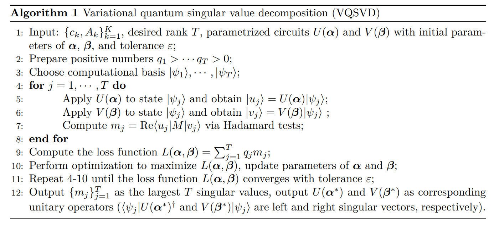
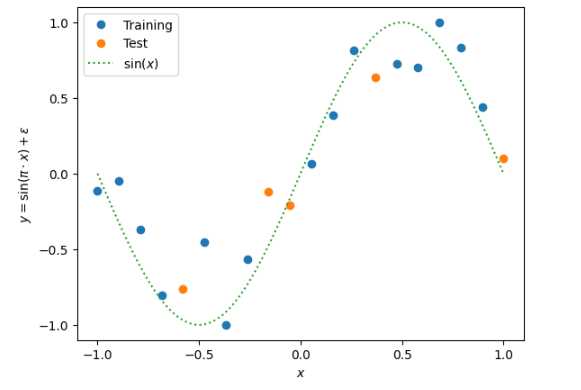

Quantum Machine Learning Demos Using Autograd
########################################################################

The following example uses the variational quantum circuit interface under ``pyvqnet.qnn.vqc`` to implement a quantum machine learning algorithm and example. The variational quantum circuit interface under ``pyvqnet.qnn.vqc`` uses state vectors to represent the evolution of quantum states under quantum logic gates, and calculates the gradient in the variational quantum circuit through automatic differentiation.

Please note the use of ``pyvqnet.qnn.vqc.QMachine`` in the following example. This class stores the data of quantum state vectors. When calculating batch data or after each measurement, ``pyvqnet.qnn.vqc.QMachine.reset_states`` must be performed to reinitialize the state vector data to the batch_size size of the input data.
``pyvqnet.qnn.vqc`` also provides measurement interfaces such as MeasureAll, Probability, and Samples.

In addition, ``pyvqnet.qnn.vqc.QModule`` is a class that the user-defined automatic differential sub-circuit model needs to inherit. Like the classic neural network model, it needs to define `__init__` and `forward` functions.
When the last ``QTensor`` of the model runs `backward`, the parameter gradients of the variational sub-circuit in ``QModule`` can be calculated using automatic differentiation, and can be updated by the optimizer related to the gradient descent method.

Example of fitting a Fourier series on a GPU using quantum variational circuits
====================================================================================
Quantum computers can be used for supervised learning by mapping data inputs to predicted models through parameterized quantum circuits. While much work has been done to study the practical implications of this approach,
many important theoretical properties of these models remain unknown. Here, we study how the strategy of encoding data into the model affects the expressive power of parameterized quantum circuits as function approximators.

This example relates common quantum machine learning models designed for quantum computers to Fourier series, following the paper `The effect of data encoding on the expressive power of variational quantum machine learning models <https://arxiv.org/pdf/2008.08605.pdf>`_.

The quantum model is:

.. image:: ./images/single_qubit_model_circuit.png
    :width: 600 px
    :align: center

|

Import the necessary libraries and define the variational quantum circuit model using ``pyvqnet.qnn.vqc``:

.. code-block::

    import numpy as np
    from pyvqnet.nn import Module,Parameter
    from pyvqnet.nn.loss import MeanSquaredError
    from pyvqnet.optim.adam import Adam
    from pyvqnet.tensor.tensor import QTensor
    from pyvqnet import kfloat32
    from pyvqnet.device import DEV_GPU
    from pyvqnet.qnn.vqc import QMachine,QModule,rx,rz,ry,\
        MeasureAll
    np.random.seed(42)
    degree = 1  # degree of the target function
    scaling = 1  # scaling of the data
    coeffs = [0.15 + 0.15j]*degree  # coefficients of non-zero frequencies
    coeff0 = 0.1  # coefficient of zero frequency
    r = 1
    weights = 2 * np.pi * np.random.random(size=(r+1, 3))  # some random initial weights
    x = np.linspace(-6, 6, 70)
    def target_function(x):
        """Generate a truncated Fourier series, where the data gets re-scaled."""
        res = coeff0
        for idx, coeff in enumerate(coeffs):
            exponent = np.complex128(scaling * (idx+1) * x * 1j)
            conj_coeff = np.conjugate(coeff)
            res += coeff * np.exp(exponent) + conj_coeff * np.exp(-exponent)
        return np.real(res)
    x = np.linspace(-6, 6, 70)
    target_y = np.array([target_function(xx) for xx in x])
    def vqc_s(qm,qubits,x):
        rx(qm,qubits[0],x)
    def vqc_w(qm,qubits,theta):
        rz(qm,qubits[0],theta[0])
        ry(qm,qubits[0],theta[1])
        rz(qm,qubits[0],theta[2])
    class QModel(QModule):
        def __init__(self,num_qubits):
            super().__init__()
            self.num_qubits = num_qubits
            self.qm = QMachine(num_qubits)
            pauli_str_list =[]
            for position in range(num_qubits):
                pauli_str = {"Z" + str(position): 1.0}
                pauli_str_list.append(pauli_str)
            self.ma = MeasureAll(obs=pauli_str_list)
            self.weights = Parameter((2,3))
        def forward(self,x):
            self.qm.reset_states(x.shape[0])
            qubits = range(self.num_qubits)
            vqc_w(self.qm,qubits, self.weights[0])
            vqc_s(self.qm,qubits, x)
                    
            vqc_w(self.qm,qubits, self.weights[1])
            return self.ma(self.qm)
    class Model(Module):
        def __init__(self):
            super(Model, self).__init__()
            self.q_fourier_series = QModel(1)

        def forward(self, x):
            return self.q_fourier_series(x)

Training code, we use GPU for training here, we need to put the model `Model` and input `data`, `label` on GPU using ``toGPU`` or specify `device`.
Other interfaces are no different from the code for training using CPU.

.. code-block::

    def run():
        model = Model()
        model.toGPU(DEV_GPU)
        optimizer = Adam(model.parameters(), lr=0.5)
        batch_size = 2
        epoch = 5
        loss = MeanSquaredError()
        print("start training..............")
        model.train()
        max_steps = 50
        for i in range(epoch):
            sum_loss = 0
            count = 0
            for step in range(max_steps):
                optimizer.zero_grad()
                # Select batch of data
                batch_index = np.random.randint(0, len(x), (batch_size,))
                x_batch = x[batch_index].reshape(batch_size,1)
                y_batch = target_y[batch_index].reshape(batch_size,1)
                #load data into GPU
                data, label = QTensor(x_batch,dtype=kfloat32,device=DEV_GPU), QTensor(y_batch,dtype=kfloat32,device=DEV_GPU)
                result = model(data)
                loss_b = loss(label, result)
                loss_b.backward()
                optimizer._step()
                sum_loss += loss_b.item()
                count += batch_size
            print(f"epoch:{i}, #### loss:{sum_loss/count} ")
            
    if __name__ == "__main__":
        run()
    """
    epoch:0, #### loss:0.03909379681921564 
    epoch:1, #### loss:0.005479114687623223 
    epoch:2, #### loss:0.019679916104651057 
    epoch:3, #### loss:0.00861194647848606 
    epoch:4, #### loss:0.0035393996626953595 
    """

HQCNN example of hybrid quantum classical neural network
===================================================================

The HQCNN example is implemented using ``pyvqnet.qnn.vqc``, and image classification on the Mnist dataset is performed using a hybrid quantum classical network. In the quantum part, a simple quantum circuit with 1 qubit is defined here, which takes the output of the classical neural network layer as input, encodes quantum data through ``H``, ``RY`` logic gates, and calculates the Hamiltonian expectation value in the z direction as output.

.. image:: ./images/hqcnn_quantum_cir.png
    :width: 600 px
    :align: center

|

Since quantum circuits can be used together with classical neural networks for automatic differentiation, we can use VQNet's 2D convolution layer ``Conv2D``, pooling layer ``MaxPool2D``, fully connected layer ``Linear`` and the quantum circuit just built to build a model.

Through the definition of the Net and Hybrid classes inherited from the VQNet automatic differentiation module ``Module`` in the following code, and the definition of data forward calculation in the model forward function ``forward()``, we have built a model that can be automatically differentiated
In this example, the MNIST data is convoluted, dimensionally reduced, quantum encoded, and measured to obtain the final features required for the classification task.

The following is the neural network related code:

.. code-block::

    import sys
    sys.path.insert(0,"../")
    import time
    import os
    import struct
    import gzip
    from pyvqnet.nn.module import Module
    from pyvqnet.nn.linear import Linear
    from pyvqnet.nn.conv import Conv2D
    from pyvqnet.nn import activation as F
    from pyvqnet.nn.pooling import MaxPool2D
    from pyvqnet.nn.loss import CategoricalCrossEntropy
    from pyvqnet.optim.adam import Adam
    from pyvqnet.data.data import data_generator
    from pyvqnet.tensor import tensor
    from pyvqnet.qnn.vqc import QMachine,QModule,hadamard,ry,MeasureAll
    import numpy as np
    import matplotlib.pyplot as plt
    import matplotlib
    try:
        matplotlib.use("TkAgg")
    except:  #pylint:disable=bare-except
        print("Can not use matplot TkAgg")
        pass
    try:
        import urllib.request
    except ImportError:
        raise ImportError("You should use Python 3.x")
    class Hybird(QModule):
        def __init__(self):
            #this super(Hybird, self).__init__() is need
            super(Hybird, self).__init__()
            self.measure = MeasureAll(obs={"Z0":1})
            #use only one qubit to create a qmachine
            self.qm = QMachine(1)
        def forward(self,x):
            #this reset_states must be done to get real batch size.
            self.qm.reset_states(x.shape[0])
            hadamard(self.qm,[0])
            ry(self.qm,[0],x)
            return self.measure(q_machine=self.qm)
    class Net(Module):
        """
        Hybird Quantum Classci Neural Network Module
        """
        def __init__(self):
            super(Net, self).__init__()
            self.conv1 = Conv2D(input_channels=1,
                                output_channels=6,
                                kernel_size=(5, 5),
                                stride=(1, 1),
                                padding="valid")
            self.maxpool1 = MaxPool2D([2, 2], [2, 2], padding="valid")
            self.conv2 = Conv2D(input_channels=6,
                                output_channels=16,
                                kernel_size=(5, 5),
                                stride=(1, 1),
                                padding="valid")
            self.maxpool2 = MaxPool2D([2, 2], [2, 2], padding="valid")
            self.fc1 = Linear(input_channels=256, output_channels=64)
            self.fc2 = Linear(input_channels=64, output_channels=1)
            self.hybird = Hybird()
            self.fc3 = Linear(input_channels=1, output_channels=2)
        def forward(self, x):
            start_time_forward = time.time()
            x = F.ReLu()(self.conv1(x))
            x = self.maxpool1(x)
            x = F.ReLu()(self.conv2(x))
            x = self.maxpool2(x)
            x = tensor.flatten(x, 1)
            x = F.ReLu()(self.fc1(x))
            x = self.fc2(x)
            x = self.hybird(x)
            x = self.fc3(x)
            return x

The following is data loading, training code:

.. code-block::

    url_base = 'https://ossci-datasets.s3.amazonaws.com/mnist/'
    key_file = {
        "train_img": "train-images-idx3-ubyte.gz",
        "train_label": "train-labels-idx1-ubyte.gz",
        "test_img": "t10k-images-idx3-ubyte.gz",
        "test_label": "t10k-labels-idx1-ubyte.gz"
    }
    def _download(dataset_dir, file_name):
        """
        Download mnist data if needed.
        """
        file_path = dataset_dir + "/" + file_name
        if os.path.exists(file_path):
            with gzip.GzipFile(file_path) as file:
                file_path_ungz = file_path[:-3].replace("\\", "/")
                if not os.path.exists(file_path_ungz):
                    open(file_path_ungz, "wb").write(file.read())
            return
        print("Downloading " + file_name + " ... ")
        urllib.request.urlretrieve(url_base + file_name, file_path)
        if os.path.exists(file_path):
            with gzip.GzipFile(file_path) as file:
                file_path_ungz = file_path[:-3].replace("\\", "/")
                file_path_ungz = file_path_ungz.replace("-idx", ".idx")
                if not os.path.exists(file_path_ungz):
                    open(file_path_ungz, "wb").write(file.read())
        print("Done")
    def download_mnist(dataset_dir):
        for v in key_file.values():
            _download(dataset_dir, v)
    def load_mnist(dataset="training_data", digits=np.arange(2), path="./examples"):
        """
        load mnist data
        """
        from array import array as pyarray
        download_mnist(path)
        if dataset == "training_data":
            fname_image = os.path.join(path, "train-images.idx3-ubyte").replace(
                "\\", "/")
            fname_label = os.path.join(path, "train-labels.idx1-ubyte").replace(
                "\\", "/")
        elif dataset == "testing_data":
            fname_image = os.path.join(path, "t10k-images.idx3-ubyte").replace(
                "\\", "/")
            fname_label = os.path.join(path, "t10k-labels.idx1-ubyte").replace(
                "\\", "/")
        else:
            raise ValueError("dataset must be 'training_data' or 'testing_data'")
        flbl = open(fname_label, "rb")
        _, size = struct.unpack(">II", flbl.read(8))
        lbl = pyarray("b", flbl.read())
        flbl.close()
        fimg = open(fname_image, "rb")
        _, size, rows, cols = struct.unpack(">IIII", fimg.read(16))
        img = pyarray("B", fimg.read())
        fimg.close()
        ind = [k for k in range(size) if lbl[k] in digits]
        num = len(ind)
        images = np.zeros((num, rows, cols))
        labels = np.zeros((num, 1), dtype=int)
        for i in range(len(ind)):
            images[i] = np.array(img[ind[i] * rows * cols:(ind[i] + 1) * rows *
                                    cols]).reshape((rows, cols))
            labels[i] = lbl[ind[i]]
        return images, labels
    def data_select(train_num, test_num):
        """
        Select data from mnist dataset.
        """
        x_train, y_train = load_mnist("training_data")
        x_test, y_test = load_mnist("testing_data")
        idx_train = np.append(
            np.where(y_train == 0)[0][:train_num],
            np.where(y_train == 1)[0][:train_num])
        x_train = x_train[idx_train]
        y_train = y_train[idx_train]
        x_train = x_train / 255
        y_train = np.eye(2)[y_train].reshape(-1, 2)
        # Test Leaving only labels 0 and 1
        idx_test = np.append(
            np.where(y_test == 0)[0][:test_num],
            np.where(y_test == 1)[0][:test_num])
        x_test = x_test[idx_test]
        y_test = y_test[idx_test]
        x_test = x_test / 255
        y_test = np.eye(2)[y_test].reshape(-1, 2)
        return x_train, y_train, x_test, y_test
    def run():
        """
        Run mnist train function
        """
        x_train, y_train, x_test, y_test = data_select(100, 50)
        model = Net()
        optimizer = Adam(model.parameters(), lr=0.005)
        loss_func = CategoricalCrossEntropy()
        epochs = 10
        train_loss_list = []
        val_loss_list = []
        train_acc_list = []
        val_acc_list = []
        model.train()
        for epoch in range(1, epochs):
            total_loss = []
            model.train()
            batch_size = 3
            correct = 0
            n_train = 0
            for x, y in data_generator(x_train,
                                    y_train,
                                    batch_size=batch_size,
                                    shuffle=True):
                x = x.reshape(-1, 1, 28, 28)
                optimizer.zero_grad()
                output = model(x)
                loss = loss_func(y, output)
                loss_np = np.array(loss.data)
                np_output = np.array(output.data, copy=False)
                mask = (np_output.argmax(1) == y.argmax(1))
                correct += np.sum(np.array(mask))
                n_train += batch_size
                loss.backward()
                optimizer._step()
                total_loss.append(loss_np)
            train_loss_list.append(np.sum(total_loss) / len(total_loss))
            train_acc_list.append(np.sum(correct) / n_train)
            print("{:.0f} loss is : {:.10f}".format(epoch, train_loss_list[-1]))
            model.eval()
            correct = 0
            n_eval = 0
            for x, y in data_generator(x_test, y_test, batch_size=1, shuffle=True):
                x = x.reshape(-1, 1, 28, 28)
                output = model(x)
                loss = loss_func(y, output)
                loss_np = np.array(loss.data)
                np_output = np.array(output.data, copy=False)
                mask = (np_output.argmax(1) == y.argmax(1))
                correct += np.sum(np.array(mask))
                n_eval += 1
                total_loss.append(loss_np)
            print(f"Eval Accuracy: {correct / n_eval}")
            val_loss_list.append(np.sum(total_loss) / len(total_loss))
            val_acc_list.append(np.sum(correct) / n_eval)
    if __name__ == "__main__":
        run()
    """
    1 loss is : 0.6849292357
    Eval Accuracy: 0.5
    2 loss is : 0.4714432901
    Eval Accuracy: 1.0
    3 loss is : 0.2898814073
    Eval Accuracy: 1.0
    4 loss is : 0.1938255936
    Eval Accuracy: 1.0
    5 loss is : 0.1351640474
    Eval Accuracy: 1.0
    6 loss is : 0.0998594583
    Eval Accuracy: 1.0
    7 loss is : 0.0778947517
    Eval Accuracy: 1.0
    8 loss is : 0.0627411657
    Eval Accuracy: 1.0
    9 loss is : 0.0519049061
    Eval Accuracy: 1.0
    """

Quantum reloading algorithm example
===========================================

The following uses the interface under ``pyvqnet.qnn.vqc`` to build a quantum data re-uploading algorithm example.
In a neural network, each neuron receives information from all neurons in the upper layer (Figure a). In contrast, a single-bit quantum classifier receives the previous information processing unit and input (Figure b).
In layman's terms, for traditional quantum circuits, when data upload is completed, the result can be directly obtained through several unitary transformations :math:`U(\theta_1,\theta_2,\theta_3)`.
However, in the quantum data re-uploading (Quantum Data Re-upLoading, QDRL) task, the data needs to be re-uploaded before the unitary transformation.

.. centered:: QDRL vs. Classical Neural Network Schematic Diagram

.. image:: ./images/qdrl.png
    :width: 600 px
    :align: center

|

Import the library and define the quantum neural network model:

.. code-block::

    import sys
    sys.path.insert(0, "../")
    import numpy as np
    from pyvqnet.nn.linear import Linear
    from pyvqnet.qnn.vqc import QMachine,QModule,rz,ry,Probability
    from pyvqnet.nn import Parameter
    from pyvqnet.optim import sgd
    from pyvqnet.nn.loss import CategoricalCrossEntropy
    from pyvqnet.tensor.tensor import QTensor
    from pyvqnet.nn.module import Module
    import matplotlib.pyplot as plt
    import matplotlib
    from pyvqnet.data import data_generator as get_minibatch_data
    try:
        matplotlib.use("TkAgg")
    except:  #pylint:disable=bare-except
        print("Can not use matplot TkAgg")
        pass
    np.random.seed(42)
    class vmodel(QModule):
        def __init__(self,nq):
    
            super(vmodel,self).__init__()
            self.qm = QMachine(1)
            self.nq = nq
            self.w = Parameter((9,))
            self.ma = Probability(wires=range(nq))
        def forward(self,x):
            self.qm.reset_states(x.shape[0])
            qm = self.qm
            w = self.w
            rz(qm,0, x[:,[0]])
            ry(qm,0, x[:,[1]])
            rz(qm,0, x[:,[2]])
            rz(qm,0, w[0])
            ry(qm,0, w[1])
            rz(qm,0, w[2])
            rz(qm,0, x[:,[0]])
            ry(qm,0, x[:,[1]])
            rz(qm,0, x[:,[2]])
            rz(qm,0, w[3])
            ry(qm,0, w[4])
            rz(qm,0, w[5])
            rz(qm,0, x[:,[0]])
            ry(qm,0, x[:,[1]])
            rz(qm,0, x[:,[2]])
            rz(qm,0, w[6])
            ry(qm,0, w[7])
            rz(qm,0, w[8])
            return self.ma(qm)
    class Model(Module):
        def __init__(self):
            super(Model, self).__init__()
            self.pqc = vmodel(1)
            self.fc2 = Linear(2, 2)
        def forward(self, x):
            x = self.pqc(x)
            return x

The following is data loading, training code:

.. code-block::

    def circle(samples, reps=np.sqrt(1 / 2)):
        data_x, data_y = [], []
        for _ in range(samples):
            x = np.random.rand(2)
            y = [0, 1]
            if np.linalg.norm(x) < reps:
                y = [1, 0]
            data_x.append(x)
            data_y.append(y)
        return np.array(data_x), np.array(data_y)
    def plot_data(x, y, fig=None, ax=None):
        if fig is None:
            fig, ax = plt.subplots(1, 1, figsize=(5, 5))
        reds = y == 0
        blues = y == 1
        ax.scatter(x[reds, 0], x[reds, 1], c="red", s=20, edgecolor="k")
        ax.scatter(x[blues, 0], x[blues, 1], c="blue", s=20, edgecolor="k")
        ax.set_xlabel("$x_1$")
        ax.set_ylabel("$x_2$")
    def get_score(pred, label):
        pred, label = np.array(pred.data), np.array(label.data)
        score = np.sum(np.argmax(pred, axis=1) == np.argmax(label, 1))
        return score
    model = Model()
    optimizer = sgd.SGD(model.parameters(), lr=1)
    def train():
        """
        Main function for train qdrl model
        """
        batch_size = 5
        model.train()
        x_train, y_train = circle(500)
        x_train = np.hstack((x_train, np.ones((x_train.shape[0], 1))))  # 500*3
        epoch = 10
        print("start training...........")
        for i in range(epoch):
            accuracy = 0
            count = 0
            loss = 0
            for data, label in get_minibatch_data(x_train, y_train, batch_size):
                optimizer.zero_grad()
                data, label = QTensor(data), QTensor(label)
                output = model(data)
                loss_fun = CategoricalCrossEntropy()
                losss = loss_fun(label, output)
                losss.backward()
                optimizer._step()
                accuracy += get_score(output, label)
                loss += losss.item()
                count += batch_size
            print(f"epoch:{i}, train_accuracy_for_each_batch:{accuracy/count}")
            print(f"epoch:{i}, train_loss_for_each_batch:{loss/count}")
    def test():
        batch_size = 5
        model.eval()
        print("start eval...................")
        x_test, y_test = circle(500)
        test_accuracy = 0
        count = 0
        x_test = np.hstack((x_test, np.ones((x_test.shape[0], 1))))
        for test_data, test_label in get_minibatch_data(x_test, y_test,
                                                        batch_size):
            test_data, test_label = QTensor(test_data), QTensor(test_label)
            output = model(test_data)
            test_accuracy += get_score(output, test_label)
            count += batch_size
        print(f"test_accuracy:{test_accuracy/count}")
    if __name__ == "__main__":
        train()
        test()
    """
    start training...........
    epoch:0, train_accuracy_for_each_batch:0.828
    epoch:0, train_loss_for_each_batch:0.10570884662866592
    epoch:1, train_accuracy_for_each_batch:0.866
    epoch:1, train_loss_for_each_batch:0.09770179575681687
    epoch:2, train_accuracy_for_each_batch:0.878
    epoch:2, train_loss_for_each_batch:0.09732778465747834
    epoch:3, train_accuracy_for_each_batch:0.86
    epoch:3, train_loss_for_each_batch:0.09763735890388489
    epoch:4, train_accuracy_for_each_batch:0.864
    epoch:4, train_loss_for_each_batch:0.09772944855690002
    epoch:5, train_accuracy_for_each_batch:0.848
    epoch:5, train_loss_for_each_batch:0.098575089097023
    epoch:6, train_accuracy_for_each_batch:0.878
    epoch:6, train_loss_for_each_batch:0.09734477716684341
    epoch:7, train_accuracy_for_each_batch:0.878
    epoch:7, train_loss_for_each_batch:0.09644640237092972
    epoch:8, train_accuracy_for_each_batch:0.864
    epoch:8, train_loss_for_each_batch:0.09722568172216416
    epoch:9, train_accuracy_for_each_batch:0.862
    epoch:9, train_loss_for_each_batch:0.09842782151699066
    start eval...................
    test_accuracy:0.934
    """

Circuit-centric quantum classifiers algorithm example
=============================================================

This example uses ``pyvqnet.qnn.vqc`` to implement the variable quantum circuit in the paper `Circuit-centric quantum classifiers <https://arxiv.org/pdf/1804.00633.pdf>`_ for binary classification tasks.
This example is used to determine whether a binary number is odd or even. By encoding the binary number into the quantum bit, by optimizing the variable parameters in the circuit, the z-direction measurement value of the circuit can indicate whether the input is odd or even.
A variational quantum circuit usually defines a subcircuit, which is a basic circuit architecture that can build complex variational circuits through repeated layers.
Our circuit layer consists of multiple rotational logic gates and ``CNOT`` logic gates that entangle each qubit with its neighboring qubits.
We also need a circuit to encode classical data into quantum states, so that the output measured by the circuit is related to the input.
In this case, we encode the binary input into the corresponding order of qubits. For example, the input data 1101 is encoded into 4 qubits.

.. code-block::

    import sys
    sys.path.insert(0, "../")
    import random
    import numpy as np
    from pyvqnet.optim import sgd
    from pyvqnet.tensor.tensor import QTensor
    from pyvqnet.dtype import kfloat32,kint64
    from pyvqnet.qnn.vqc import QMachine, RX, RY, CNOT, PauliX, qmatrix, PauliZ,qmeasure,qcircuit,VQC_RotCircuit
    from pyvqnet.tensor import QTensor, tensor
    import pyvqnet
    from pyvqnet.nn import Parameter
    random.seed(1234)
    class QModel(pyvqnet.nn.Module):
        def __init__(self, num_wires, dtype):
            super(QModel, self).__init__()
            self._num_wires = num_wires
            self._dtype = dtype
            self.qm = QMachine(num_wires, dtype=dtype)
            self.w = Parameter((2,4,3),initializer=pyvqnet.utils.initializer.quantum_uniform)
            self.cnot = CNOT(wires=[0, 1])
        def forward(self, x, *args, **kwargs):
            self.qm.reset_states(x.shape[0])
            def get_cnot(nqubits,qm):
                for i in range(len(nqubits) - 1):
                    CNOT(wires = [nqubits[i], nqubits[i + 1]])(q_machine = qm)
                CNOT(wires = [nqubits[len(nqubits) - 1], nqubits[0]])(q_machine = qm)
            def build_circult(weights, xx, nqubits,qm):
                def Rot(weights_j, nqubits,qm):#pylint:disable=invalid-name
                    VQC_RotCircuit(qm,nqubits,weights_j)
                def basisstate(qm,xx, nqubits):
                    for i in nqubits:
                        qcircuit.rz(q_machine=qm, wires=i, params=xx[:,[i]])
                        qcircuit.ry(q_machine=qm, wires=i, params=xx[:,[i]])
                        qcircuit.rz(q_machine=qm, wires=i, params=xx[:,[i]])
                basisstate(qm,xx,nqubits)
                for i in range(weights.shape[0]):
                    weights_i = weights[i, :, :]
                    for j in range(len(nqubits)):
                        weights_j = weights_i[j]
                        Rot(weights_j, nqubits[j],qm)
                    get_cnot(nqubits,qm)
            build_circult(self.w, x,range(4),self.qm)
            return qmeasure.MeasureAll(obs={'Z0': 1})(self.qm)
        
Data loading, model training process code:

.. code-block::

    qvc_train_data = [
        0, 1, 0, 0, 1, 0, 1, 0, 1, 0, 0, 1, 1, 0, 0, 0, 1, 1, 1, 1, 1, 0, 0, 0, 1,
        1, 0, 0, 1, 0, 1, 0, 1, 0, 0, 1, 0, 1, 1, 1, 1, 1, 0, 0, 0, 1, 1, 0, 1, 1,
        1, 1, 1, 0, 1, 1, 1, 1, 1, 0
    ]
    qvc_test_data = [0, 0, 0, 0, 0, 0, 0, 0, 1, 1, 0, 0, 1, 0, 1, 0, 0, 1, 1, 0]
    batch_size = 5
    
    def dataloader(data, label, batch_size, shuffle=True) -> np:
        if shuffle:
            for _ in range(len(data) // batch_size):
                random_index = np.random.randint(0, len(data), (batch_size, 1))
                yield data[random_index].reshape(batch_size,
                                                -1), label[random_index].reshape(
                                                    batch_size, -1)
        else:
            for i in range(0, len(data) - batch_size + 1, batch_size):
                yield data[i:i + batch_size], label[i:i + batch_size]
    def get_accuary(result, label):
        result, label = np.array(result.data), np.array(label.data)
        score = np.sum(np.argmax(result, axis=1) == np.argmax(label, 1))
        return score
    def vqc_get_data(dataset_str):
        """
        Tranform data to valid form
        """
        if dataset_str == "train":
            datasets = np.array(qvc_train_data)
        else:
            datasets = np.array(qvc_test_data)
        datasets = datasets.reshape([-1, 5])
        data = datasets[:, :-1]
        label = datasets[:, -1].astype(int)
        label = label.reshape(-1, 1)
        return data, label
    def vqc_square_loss(labels, predictions):
        loss = 0
        
        loss = (labels - predictions) ** 2
        loss = tensor.mean(loss,axis=0)
        return loss
    def run2():
        """
        Main run function
        """
        model = QModel(4,pyvqnet.kcomplex64)
        optimizer = sgd.SGD(model.parameters(), lr=0.5)
        epoch = 25
        #loss = CategoricalCrossEntropy()
        print("start training..............")
        model.train()
        datas, labels = vqc_get_data("train")
        for i in range(epoch):
            sum_loss = 0
            count  =0
            accuary = 0
            for data, label in dataloader(datas, labels, batch_size, False):
                optimizer.zero_grad()
                data, label = QTensor(data,dtype=kfloat32), QTensor(label,dtype=kint64)
                result = model(data)
                loss_b = vqc_square_loss(label, result)
                loss_b.backward()
                optimizer._step()
                sum_loss += loss_b.item()
                count += batch_size
                accuary += get_accuary(result, label)
            print(
                f"epoch:{i}, #### loss:{sum_loss/count} #####accuray:{accuary/count}"
            )
    run2()
    """
    epoch:0, #### loss:0.07805998176336289 #####accuray:1.0
    epoch:1, #### loss:0.07268960326910019 #####accuray:1.0
    epoch:2, #### loss:0.06934810429811478 #####accuray:1.0
    epoch:3, #### loss:0.06652230024337769 #####accuray:1.0
    epoch:4, #### loss:0.06363258957862854 #####accuray:1.0
    epoch:5, #### loss:0.0604777917265892 #####accuray:1.0
    epoch:6, #### loss:0.05711844265460968 #####accuray:1.0
    epoch:7, #### loss:0.053814482688903806 #####accuray:1.0
    epoch:8, #### loss:0.05088095813989639 #####accuray:1.0
    epoch:9, #### loss:0.04851257503032684 #####accuray:1.0
    epoch:10, #### loss:0.04672074168920517 #####accuray:1.0
    epoch:11, #### loss:0.04540069997310638 #####accuray:1.0
    epoch:12, #### loss:0.04442296177148819 #####accuray:1.0
    epoch:13, #### loss:0.04368099868297577 #####accuray:1.0
    epoch:14, #### loss:0.04310029000043869 #####accuray:1.0
    epoch:15, #### loss:0.04263183027505875 #####accuray:1.0
    epoch:16, #### loss:0.04224379360675812 #####accuray:1.0
    epoch:17, #### loss:0.041915199160575865 #####accuray:1.0
    epoch:18, #### loss:0.04163179695606232 #####accuray:1.0
    epoch:19, #### loss:0.041383542120456696 #####accuray:1.0
    epoch:20, #### loss:0.0411631852388382 #####accuray:1.0
    epoch:21, #### loss:0.04096531867980957 #####accuray:1.0
    epoch:22, #### loss:0.04078584611415863 #####accuray:1.0
    epoch:23, #### loss:0.0406215637922287 #####accuray:1.0
    epoch:24, #### loss:0.040470016002655027 #####accuray:1.0
    """

Variational Shadow Quantum Learning for Classification model example
===============================================================================

Use the variable quantum circuit interface of ``pyvqnet.qnn.vqc`` to build a 2-classification model. When comparing the classification accuracy with a neural network with similar parameter accuracy, the two have similar accuracy. However, the number of parameters in the quantum circuit is much smaller than that of the classical neural network.
The algorithm is based on the paper: `Variational Shadow Quantum Learning for Classification Model <https://arxiv.org/abs/2012.08288>`_ Reproduction.

The overall model of VSQL quantum is as follows:

.. image:: ./images/vsql_model.PNG
    :width: 600 px
    :align: center

|

Define the variational quantum circuit model:

.. code-block::

    import sys
    sys.path.insert(0,"../")
    import os
    import os.path
    import struct
    import gzip
    from pyvqnet.nn.module import Module
    from pyvqnet.nn.loss import CategoricalCrossEntropy
    from pyvqnet.optim.adam import Adam
    from pyvqnet.data.data import data_generator
    from pyvqnet.tensor import tensor
    from pyvqnet.qnn.measure import expval
    from pyvqnet.qnn.quantumlayer import QuantumLayer
    from pyvqnet.qnn.template import AmplitudeEmbeddingCircuit
    from pyvqnet.nn.linear import Linear
    import numpy as np
    import matplotlib.pyplot as plt
    import matplotlib
    from pyvqnet.qnn.vqc import rx,ry,cnot,vqc_amplitude_embedding,QMachine,QModule,MeasureAll
    from pyvqnet.nn import Parameter
    try:
        matplotlib.use("TkAgg")
    except:  #pylint:disable=bare-except
        print("Can not use matplot TkAgg")
        pass
    try:
        import urllib.request
    except ImportError:
        raise ImportError("You should use Python 3.x")
    class VQC_VSQL(QModule):
        def __init__(self,nq):
            super(VQC_VSQL,self).__init__()
            self.qm = QMachine(nq)
            self.nq =nq
            self.w = Parameter(( (depth + 1) * 3 * n_qsc,))
            pauli_str_list =[]
        def forward(self,x):
            def get_pauli_str(n_start, n_qsc):#pylint:disable=redefined-outer-name
                D = {}
                D['wires']= [i for i in range(n_start, n_start + n_qsc)]
                D["observables"] = ["X" for i in range(n_start, n_start + n_qsc)]
                D["coefficient"] = [1 for i in range(n_start, n_start + n_qsc)]
                return D
            #this reset states to shape of batchsize
            self.qm.reset_states(x.shape[0])
            weights = self.w.reshape([depth + 1, 3, n_qsc])
            
            def subcir(qm, weights, qlist, depth, n_qsc, n_start):#pylint:disable=redefined-outer-name
                for i in range(n_qsc):
                    rx(qm,qlist[n_start + i], weights[0,0,i])
                    ry(qm,qlist[n_start + i], weights[0,1,i])
                    rx(qm,qlist[n_start + i], weights[0,2,i])
                for repeat in range(1, depth + 1):
                    for i in range(n_qsc - 1):
                        cnot(qm,[qlist[n_start + i], qlist[n_start + i + 1]])
                    not(qm,[qlist[n_start + n_qsc - 1], qlist[n_start]])
                    for i in range(n_qsc):
                        ry(qm,qlist[n_start + i], weights[repeat,1,i])
            qm = self.qm
            vqc_amplitude_embedding(x,q_machine=qm)
            f_i = []
            for st in range(n - n_qsc + 1):
                psd = get_pauli_str(st, n_qsc)
                subcir(qm, weights, range(self.nq), depth, n_qsc, st)
                
                ma =MeasureAll(obs=psd)
                f_ij = ma(qm)
                f_i.append(f_ij)
            return tensor.cat(f_i,1)#->(Batch,n - n_qsc + 1)
    class QModel(Module):
        """
        Model of VSQL
        """
        def __init__(self):
            super().__init__()
            self.vq = VQC_VSQL(n)
            self.fc = Linear(n - n_qsc + 1, 2)
        def forward(self, x):
            x = self.vq(x)
            x = self.fc(x)
            return x

Define the data loading and training process code:

.. code-block::

    url_base = 'https://ossci-datasets.s3.amazonaws.com/mnist/'
    key_file = {
        "train_img": "train-images-idx3-ubyte.gz",
        "train_label": "train-labels-idx1-ubyte.gz",
        "test_img": "t10k-images-idx3-ubyte.gz",
        "test_label": "t10k-labels-idx1-ubyte.gz"
    }
    
    #GLOBAL VAR
    n = 10
    n_qsc = 2
    depth = 1
    def _download(dataset_dir, file_name):
        """
        Download function for mnist dataset file
        """
        file_path = dataset_dir + "/" + file_name
        if os.path.exists(file_path):
            with gzip.GzipFile(file_path) as file:
                file_path_ungz = file_path[:-3].replace("\\", "/")
                if not os.path.exists(file_path_ungz):
                    open(file_path_ungz, "wb").write(file.read())
            return
        print("Downloading " + file_name + " ... ")
        urllib.request.urlretrieve(url_base + file_name, file_path)
        if os.path.exists(file_path):
            with gzip.GzipFile(file_path) as file:
                file_path_ungz = file_path[:-3].replace("\\", "/")
                file_path_ungz = file_path_ungz.replace("-idx", ".idx")
                if not os.path.exists(file_path_ungz):
                    open(file_path_ungz, "wb").write(file.read())
        print("Done")
    def download_mnist(dataset_dir):
        for v in key_file.values():
            _download(dataset_dir, v)
    if not os.path.exists("./result"):
        os.makedirs("./result")
    else:
        pass
    def load_mnist(dataset="training_data",
                digits=np.arange(2),
                path="examples"):
        """
        load mnist data
        """
        from array import array as pyarray
        download_mnist(path)
        if dataset == "training_data":
            fname_image = os.path.join(path, "train-images.idx3-ubyte").replace(
                "\\", "/")
            fname_label = os.path.join(path, "train-labels.idx1-ubyte").replace(
                "\\", "/")
        elif dataset == "testing_data":
            fname_image = os.path.join(path, "t10k-images.idx3-ubyte").replace(
                "\\", "/")
            fname_label = os.path.join(path, "t10k-labels.idx1-ubyte").replace(
                "\\", "/")
        else:
            raise ValueError("dataset must be 'training_data' or 'testing_data'")
        flbl = open(fname_label, "rb")
        _, size = struct.unpack(">II", flbl.read(8))
        lbl = pyarray("b", flbl.read())
        flbl.close()
        fimg = open(fname_image, "rb")
        _, size, rows, cols = struct.unpack(">IIII", fimg.read(16))
        img = pyarray("B", fimg.read())
        fimg.close()
        ind = [k for k in range(size) if lbl[k] in digits]
        num = len(ind)
        images = np.zeros((num, rows, cols),dtype=np.float32)
        labels = np.zeros((num, 1), dtype=int)
        for i in range(len(ind)):
            images[i] = np.array(img[ind[i] * rows * cols:(ind[i] + 1) * rows *
                                    cols]).reshape((rows, cols))
            labels[i] = lbl[ind[i]]
        return images, labels
    def show_image():
        image, _ = load_mnist()
        for img in range(len(image)):
            plt.imshow(image[img])
            plt.show()
    def run_vsql():
        """
        VQSL MODEL
        """
        digits = [0, 1]
        x_train, y_train = load_mnist("training_data", digits)
        x_train = x_train / 255
        y_train = y_train.reshape(-1, 1)
        y_train = np.eye(len(digits))[y_train].reshape(-1, len(digits)).astype(np.int64)
        x_test, y_test = load_mnist("testing_data", digits)
        x_test = x_test / 255
        y_test = y_test.reshape(-1, 1)
        y_test = np.eye(len(digits))[y_test].reshape(-1, len(digits)).astype(np.int64)
        x_train_list = []
        x_test_list = []
        for i in range(x_train.shape[0]):
            x_train_list.append(
                np.pad(x_train[i, :, :].flatten(), (0, 240),
                    constant_values=(0, 0)))
        x_train = np.array(x_train_list)
        for i in range(x_test.shape[0]):
            x_test_list.append(
                np.pad(x_test[i, :, :].flatten(), (0, 240),
                    constant_values=(0, 0)))
        x_test = np.array(x_test_list)
        x_train = x_train[:500]
        y_train = y_train[:500]
        x_test = x_test[:100]
        y_test = y_test[:100]
        print("model start")
        model = QModel()
        optimizer = Adam(model.parameters(), lr=0.1)
        model.train()
        result_file = open("./result/vqslrlt.txt", "w")
        for epoch in range(1, 3):
            model.train()
            full_loss = 0
            n_loss = 0
            n_eval = 0
            batch_size = 5
            correct = 0
            for x, y in data_generator(x_train,
                                    y_train,
                                    batch_size=batch_size,
                                    shuffle=True):
                optimizer.zero_grad()
                try:
                    x = x.reshape(batch_size, 1024)
                except:  #pylint:disable=bare-except
                    x = x.reshape(-1, 1024)
                output = model(x)
                cceloss = CategoricalCrossEntropy()
                loss = cceloss(y, output)
                loss.backward()
                optimizer._step()
                full_loss += loss.item()
                n_loss += batch_size
                np_output = np.array(output.data, copy=False)
                mask = np_output.argmax(1) == y.argmax(1)
                correct += sum(mask)
                print(f" n_loss {n_loss} Train Accuracy: {correct/n_loss} ")
            print(f"Train Accuracy: {correct/n_loss} ")
            print(f"Epoch: {epoch}, Loss: {full_loss / n_loss}")
            result_file.write(f"{epoch}\t{full_loss / n_loss}\t{correct/n_loss}\t")
            # Evaluation
            model.eval()
            print("eval")
            correct = 0
            full_loss = 0
            n_loss = 0
            n_eval = 0
            batch_size = 1
            for x, y in data_generator(x_test,
                                    y_test,
                                    batch_size=batch_size,
                                    shuffle=True):
                x = x.reshape(1, 1024)
                output = model(x)
                cceloss = CategoricalCrossEntropy()
                loss = cceloss(y, output)
                full_loss += loss.item()
                np_output = np.array(output.data, copy=False)
                mask = np_output.argmax(1) == y.argmax(1)
                correct += sum(mask)
                n_eval += 1
                n_loss += 1
            print(f"Eval Accuracy: {correct/n_eval}")
            result_file.write(f"{full_loss / n_loss}\t{correct/n_eval}\n")
        result_file.close()
        del model
        print("\ndone vqsl\n")
    if __name__ == "__main__":
        run_vsql()
    """
    model start
    n_loss 5 Train Accuracy: 0.4 
    n_loss 10 Train Accuracy: 0.4 
    n_loss 15 Train Accuracy: 0.4 
    n_loss 20 Train Accuracy: 0.35 
    n_loss 25 Train Accuracy: 0.44 
    n_loss 30 Train Accuracy: 0.43333333333333335 
    n_loss 35 Train Accuracy: 0.4857142857142857 
    n_loss 40 Train Accuracy: 0.525 
    n_loss 45 Train Accuracy: 0.5777777777777777 
    n_loss 50 Train Accuracy: 0.58 
    n_loss 55 Train Accuracy: 0.5818181818181818 
    n_loss 60 Train Accuracy: 0.5833333333333334 
    n_loss 65 Train Accuracy: 0.5692307692307692 
    n_loss 70 Train Accuracy: 0.5714285714285714 
    n_loss 75 Train Accuracy: 0.5733333333333334 
    n_loss 80 Train Accuracy: 0.6 
    n_loss 85 Train Accuracy: 0.611764705882353 
    n_loss 90 Train Accuracy: 0.6111111111111112 
    n_loss 95 Train Accuracy: 0.631578947368421 
    n_loss 100 Train Accuracy: 0.63 
    n_loss 105 Train Accuracy: 0.638095238095238 
    n_loss 110 Train Accuracy: 0.6545454545454545 
    n_loss 115 Train Accuracy: 0.6434782608695652 
    n_loss 120 Train Accuracy: 0.65 
    n_loss 125 Train Accuracy: 0.664 
    n_loss 130 Train Accuracy: 0.6692307692307692 
    n_loss 135 Train Accuracy: 0.674074074074074 
    n_loss 140 Train Accuracy: 0.6857142857142857 
    n_loss 145 Train Accuracy: 0.6827586206896552 
    n_loss 150 Train Accuracy: 0.6933333333333334 
    n_loss 155 Train Accuracy: 0.6967741935483871 
    n_loss 160 Train Accuracy: 0.7 
    n_loss 165 Train Accuracy: 0.696969696969697 
    n_loss 170 Train Accuracy: 0.7058823529411765 
    n_loss 175 Train Accuracy: 0.7142857142857143 
    n_loss 180 Train Accuracy: 0.7222222222222222 
    n_loss 185 Train Accuracy: 0.7297297297297297 
    n_loss 190 Train Accuracy: 0.7368421052631579 
    n_loss 195 Train Accuracy: 0.7435897435897436 
    n_loss 200 Train Accuracy: 0.74 
    n_loss 205 Train Accuracy: 0.7463414634146341 
    n_loss 210 Train Accuracy: 0.7476190476190476 
    n_loss 215 Train Accuracy: 0.7488372093023256 
    n_loss 220 Train Accuracy: 0.7545454545454545 
    n_loss 225 Train Accuracy: 0.76 
    n_loss 230 Train Accuracy: 0.7565217391304347 
    n_loss 235 Train Accuracy: 0.7617021276595745 
    n_loss 240 Train Accuracy: 0.7666666666666667 
    n_loss 245 Train Accuracy: 0.7714285714285715 
    n_loss 250 Train Accuracy: 0.776 
    n_loss 255 Train Accuracy: 0.7803921568627451 
    n_loss 260 Train Accuracy: 0.7846153846153846 
    n_loss 265 Train Accuracy: 0.7849056603773585 
    n_loss 270 Train Accuracy: 0.7888888888888889 
    n_loss 275 Train Accuracy: 0.7927272727272727 
    n_loss 280 Train Accuracy: 0.7892857142857143 
    n_loss 285 Train Accuracy: 0.7929824561403509 
    n_loss 290 Train Accuracy: 0.7965517241379311 
    n_loss 295 Train Accuracy: 0.8 
    n_loss 300 Train Accuracy: 0.8 
    n_loss 305 Train Accuracy: 0.8032786885245902 
    n_loss 310 Train Accuracy: 0.8064516129032258 
    n_loss 315 Train Accuracy: 0.8095238095238095 
    n_loss 320 Train Accuracy: 0.8125 
    n_loss 325 Train Accuracy: 0.8153846153846154 
    n_loss 330 Train Accuracy: 0.8181818181818182 
    n_loss 335 Train Accuracy: 0.8208955223880597 
    n_loss 340 Train Accuracy: 0.8235294117647058 
    n_loss 345 Train Accuracy: 0.8260869565217391 
    n_loss 350 Train Accuracy: 0.8285714285714286 
    n_loss 355 Train Accuracy: 0.8309859154929577 
    n_loss 360 Train Accuracy: 0.8277777777777777 
    n_loss 365 Train Accuracy: 0.8301369863013699 
    n_loss 370 Train Accuracy: 0.8324324324324325 
    n_loss 375 Train Accuracy: 0.8346666666666667 
    n_loss 380 Train Accuracy: 0.8368421052631579 
    n_loss 385 Train Accuracy: 0.8389610389610389 
    n_loss 390 Train Accuracy: 0.841025641025641 
    n_loss 395 Train Accuracy: 0.8430379746835444 
    n_loss 400 Train Accuracy: 0.845 
    n_loss 405 Train Accuracy: 0.8469135802469135 
    n_loss 410 Train Accuracy: 0.848780487804878 
    n_loss 415 Train Accuracy: 0.8506024096385543 
    n_loss 420 Train Accuracy: 0.8523809523809524 
    n_loss 425 Train Accuracy: 0.8541176470588235 
    n_loss 430 Train Accuracy: 0.8558139534883721 
    n_loss 435 Train Accuracy: 0.8574712643678161 
    n_loss 440 Train Accuracy: 0.8590909090909091 
    n_loss 445 Train Accuracy: 0.8606741573033708 
    n_loss 450 Train Accuracy: 0.8622222222222222 
    n_loss 455 Train Accuracy: 0.8637362637362638 
    n_loss 460 Train Accuracy: 0.8652173913043478 
    n_loss 465 Train Accuracy: 0.864516129032258 
    n_loss 470 Train Accuracy: 0.8659574468085106 
    n_loss 475 Train Accuracy: 0.8673684210526316 
    n_loss 480 Train Accuracy: 0.8666666666666667 
    n_loss 485 Train Accuracy: 0.8680412371134021 
    n_loss 490 Train Accuracy: 0.8673469387755102 
    n_loss 495 Train Accuracy: 0.8686868686868687 
    n_loss 500 Train Accuracy: 0.87 
    Train Accuracy: 0.87 
    Epoch: 1, Loss: 0.0713323565647006
    eval
    Eval Accuracy: 0.95
    n_loss 5 Train Accuracy: 1.0 
    n_loss 10 Train Accuracy: 1.0 
    n_loss 15 Train Accuracy: 1.0 
    n_loss 20 Train Accuracy: 1.0 
    n_loss 25 Train Accuracy: 1.0 
    n_loss 30 Train Accuracy: 0.9333333333333333 
    n_loss 35 Train Accuracy: 0.9428571428571428 
    n_loss 40 Train Accuracy: 0.925 
    n_loss 45 Train Accuracy: 0.9333333333333333 
    n_loss 50 Train Accuracy: 0.92 
    n_loss 55 Train Accuracy: 0.9272727272727272 
    n_loss 60 Train Accuracy: 0.9333333333333333 
    n_loss 65 Train Accuracy: 0.9230769230769231 
    n_loss 70 Train Accuracy: 0.9285714285714286 
    n_loss 75 Train Accuracy: 0.9066666666666666 
    n_loss 80 Train Accuracy: 0.9 
    n_loss 85 Train Accuracy: 0.9058823529411765 
    n_loss 90 Train Accuracy: 0.9111111111111111 
    n_loss 95 Train Accuracy: 0.9157894736842105 
    n_loss 100 Train Accuracy: 0.92 
    n_loss 105 Train Accuracy: 0.9238095238095239 
    n_loss 110 Train Accuracy: 0.9272727272727272 
    n_loss 115 Train Accuracy: 0.9304347826086956 
    n_loss 120 Train Accuracy: 0.9333333333333333 
    n_loss 125 Train Accuracy: 0.936 
    n_loss 130 Train Accuracy: 0.9307692307692308 
    n_loss 135 Train Accuracy: 0.9333333333333333 
    n_loss 140 Train Accuracy: 0.9285714285714286 
    n_loss 145 Train Accuracy: 0.9310344827586207 
    n_loss 150 Train Accuracy: 0.9333333333333333 
    n_loss 155 Train Accuracy: 0.9354838709677419 
    n_loss 160 Train Accuracy: 0.9375 
    n_loss 165 Train Accuracy: 0.9333333333333333 
    n_loss 170 Train Accuracy: 0.9352941176470588 
    n_loss 175 Train Accuracy: 0.9371428571428572 
    n_loss 180 Train Accuracy: 0.9388888888888889 
    n_loss 185 Train Accuracy: 0.9405405405405406 
    n_loss 190 Train Accuracy: 0.9421052631578948 
    n_loss 195 Train Accuracy: 0.9435897435897436 
    n_loss 200 Train Accuracy: 0.935 
    n_loss 205 Train Accuracy: 0.9317073170731708 
    n_loss 210 Train Accuracy: 0.9333333333333333 
    n_loss 215 Train Accuracy: 0.9348837209302325 
    n_loss 220 Train Accuracy: 0.9272727272727272 
    n_loss 225 Train Accuracy: 0.9244444444444444 
    n_loss 230 Train Accuracy: 0.9217391304347826 
    n_loss 235 Train Accuracy: 0.9234042553191489 
    n_loss 240 Train Accuracy: 0.925 
    n_loss 245 Train Accuracy: 0.926530612244898 
    n_loss 250 Train Accuracy: 0.928 
    n_loss 255 Train Accuracy: 0.9294117647058824 
    n_loss 260 Train Accuracy: 0.926923076923077 
    n_loss 265 Train Accuracy: 0.9283018867924528 
    n_loss 270 Train Accuracy: 0.9222222222222223 
    n_loss 275 Train Accuracy: 0.9236363636363636 
    n_loss 280 Train Accuracy: 0.925 
    n_loss 285 Train Accuracy: 0.9263157894736842 
    n_loss 290 Train Accuracy: 0.9206896551724137 
    n_loss 295 Train Accuracy: 0.9220338983050848 
    n_loss 300 Train Accuracy: 0.9233333333333333 
    n_loss 305 Train Accuracy: 0.9245901639344263 
    n_loss 310 Train Accuracy: 0.9258064516129032 
    n_loss 315 Train Accuracy: 0.926984126984127 
    n_loss 320 Train Accuracy: 0.928125 
    n_loss 325 Train Accuracy: 0.9292307692307692 
    n_loss 330 Train Accuracy: 0.9303030303030303 
    n_loss 335 Train Accuracy: 0.9313432835820895 
    n_loss 340 Train Accuracy: 0.9323529411764706 
    n_loss 345 Train Accuracy: 0.9333333333333333 
    n_loss 350 Train Accuracy: 0.9342857142857143 
    n_loss 355 Train Accuracy: 0.9352112676056338 
    n_loss 360 Train Accuracy: 0.9333333333333333 
    n_loss 365 Train Accuracy: 0.9315068493150684 
    n_loss 370 Train Accuracy: 0.9324324324324325 
    n_loss 375 Train Accuracy: 0.9333333333333333 
    n_loss 380 Train Accuracy: 0.9315789473684211 
    n_loss 385 Train Accuracy: 0.9324675324675324 
    n_loss 390 Train Accuracy: 0.9333333333333333 
    n_loss 395 Train Accuracy: 0.9316455696202531 
    n_loss 400 Train Accuracy: 0.9325 
    n_loss 405 Train Accuracy: 0.9333333333333333 
    n_loss 410 Train Accuracy: 0.9317073170731708 
    n_loss 415 Train Accuracy: 0.9325301204819277 
    n_loss 420 Train Accuracy: 0.9333333333333333 
    n_loss 425 Train Accuracy: 0.9341176470588235 
    n_loss 430 Train Accuracy: 0.9348837209302325 
    n_loss 435 Train Accuracy: 0.9356321839080459 
    n_loss 440 Train Accuracy: 0.9363636363636364 
    n_loss 445 Train Accuracy: 0.9348314606741573 
    n_loss 450 Train Accuracy: 0.9355555555555556 
    n_loss 455 Train Accuracy: 0.9362637362637363 
    n_loss 460 Train Accuracy: 0.9369565217391305 
    n_loss 465 Train Accuracy: 0.9376344086021505 
    n_loss 470 Train Accuracy: 0.9382978723404255 
    n_loss 475 Train Accuracy: 0.9368421052631579 
    n_loss 480 Train Accuracy: 0.9375 
    n_loss 485 Train Accuracy: 0.9381443298969072 
    n_loss 490 Train Accuracy: 0.936734693877551 
    n_loss 495 Train Accuracy: 0.9373737373737374 
    n_loss 500 Train Accuracy: 0.938 
    Train Accuracy: 0.938 
    Epoch: 2, Loss: 0.036427834063768386
    eval
    Eval Accuracy: 0.95
    done vqsl
    """

QMLP Model Example
====================

The following code implements a quantum multilayer perceptron (QMLP) architecture featuring error-tolerant input embedding, rich nonlinearities, and enhanced variational circuit simulation with parameterized two-qubit entangled gates. `QMLP: An Error-Tolerant Nonlinear Quantum MLP Architecture using Parameterized Two-Qubit Gates <https://arxiv.org/pdf/2206.01345.pdf>`_ .

First ,we use `pyvqnet.qnn.vqc` api to define a qnn.

.. code-block::

    import os
    import gzip
    import struct
    import numpy as np
    from pyvqnet.nn.module import Module
    from pyvqnet.nn.loss import MeanSquaredError, CrossEntropyLoss
    from pyvqnet.optim.adam import Adam
    from pyvqnet.qnn.measure import expval
    from pyvqnet.nn.pooling import AvgPool2D
    from pyvqnet.nn.linear import Linear
    from pyvqnet.data.data import data_generator
    from pyvqnet.qnn.vqc import QMachine,QModule,rot, crx,rx,MeasureAll
    from pyvqnet.nn import Parameter
    import matplotlib
    from matplotlib import pyplot as plt
    try:
        matplotlib.use("TkAgg")
    except:  # pylint:disable=bare-except
        print("Can not use matplot TkAgg")
    try:
        import urllib.request
    except ImportError:
        raise ImportError("You should use Python 3.x")
    def vqc_rot_cir(qm,weights,qubits):
        for i in range(len(qubits)):
            rot(q_machine=qm,wires=qubits[i], params= weights[3*i:3*i+3])
    def vqc_crot_cir(qm,weights,qubits):
        for i in range(len(qubits)):
            crx(q_machine=qm,wires=[qubits[i],qubits[(i+1)%len(qubits)]], params= weights[i])
    class build_qmlp_vqc(QModule):
        def __init__(self,nq):
            super(build_qmlp_vqc,self).__init__()
            self.qm = QMachine(nq)
            self.nq =nq
            self.w =Parameter((nq*8,))
            pauli_str_list =[]
            for position in range(nq):
                pauli_str = {"Z" + str(position): 1.0}
                pauli_str_list.append(pauli_str)
            self.ma = MeasureAll(obs=pauli_str_list)
        def forward(self,x):
            self.qm.reset_states(x.shape[0])
            num_qubits = self.nq
            for i in range(num_qubits):
                rx(self.qm,i,x[:,[i]])# use[:,i] will get shape of (batch),which is not valid for rx gates.
            vqc_rot_cir(self.qm,self.w[0:num_qubits*3],range(self.nq))
            vqc_crot_cir(self.qm,self.w[num_qubits*3:num_qubits*4],range(self.nq))
            for i in range(num_qubits):
                rx(self.qm,i,x[:,[i]])
            vqc_rot_cir(self.qm,self.w[num_qubits*4:num_qubits*7],range(self.nq))
            vqc_crot_cir(self.qm,self.w[num_qubits*7:num_qubits*8],range(self.nq))
            return self.ma(self.qm)
    class QMLPModel(Module):
        def __init__(self):
            super(QMLPModel, self).__init__()
            self.ave_pool2d = AvgPool2D([7, 7], [7, 7], "valid")
            self.quantum_circuit = build_qmlp_vqc(4)
            self.linear = Linear(4, 10)
        def forward(self, x):
            bsz = x.shape[0]
            x = self.ave_pool2d(x)
            input_data = x.reshape([bsz, 16])
            quanutum_result = self.quantum_circuit(input_data)
            result = self.linear(quanutum_result)
            return result

The following code is the training data loading and training process code:

.. code-block::

    url_base = 'https://ossci-datasets.s3.amazonaws.com/mnist/'
    key_file = {
        "train_img": "train-images-idx3-ubyte.gz",
        "train_label": "train-labels-idx1-ubyte.gz",
        "test_img": "t10k-images-idx3-ubyte.gz",
        "test_label": "t10k-labels-idx1-ubyte.gz"
    }
    def _download(dataset_dir, file_name):
        """
        Download mnist data if needed.
        """
        file_path = dataset_dir + "/" + file_name
        if os.path.exists(file_path):
            with gzip.GzipFile(file_path) as file:
                file_path_ungz = file_path[:-3].replace("\\", "/")
                if not os.path.exists(file_path_ungz):
                    open(file_path_ungz, "wb").write(file.read())
            return
        print("Downloading " + file_name + " ... ")
        urllib.request.urlretrieve(url_base + file_name, file_path)
        if os.path.exists(file_path):
            with gzip.GzipFile(file_path) as file:
                file_path_ungz = file_path[:-3].replace("\\", "/")
                file_path_ungz = file_path_ungz.replace("-idx", ".idx")
                if not os.path.exists(file_path_ungz):
                    open(file_path_ungz, "wb").write(file.read())
        print("Done")
    def download_mnist(dataset_dir):
        for v in key_file.values():
            _download(dataset_dir, v)
    def load_mnist(dataset="training_data", digits=np.arange(2), path="examples"):
        """
        load mnist data
        """
        from array import array as pyarray
        download_mnist(path)
        if dataset == "training_data":
            fname_image = os.path.join(path, "train-images.idx3-ubyte").replace(
                "\\", "/")
            fname_label = os.path.join(path, "train-labels.idx1-ubyte").replace(
                "\\", "/")
        elif dataset == "testing_data":
            fname_image = os.path.join(path, "t10k-images.idx3-ubyte").replace(
                "\\", "/")
            fname_label = os.path.join(path, "t10k-labels.idx1-ubyte").replace(
                "\\", "/")
        else:
            raise ValueError("dataset must be 'training_data' or 'testing_data'")
        flbl = open(fname_label, "rb")
        _, size = struct.unpack(">II", flbl.read(8))
        lbl = pyarray("b", flbl.read())
        flbl.close()
        fimg = open(fname_image, "rb")
        _, size, rows, cols = struct.unpack(">IIII", fimg.read(16))
        img = pyarray("B", fimg.read())
        fimg.close()
        ind = [k for k in range(size) if lbl[k] in digits]
        num = len(ind)
        images = np.zeros((num, rows, cols))
        labels = np.zeros((num, 1), dtype=int)
        for i in range(len(ind)):
            images[i] = np.array(img[ind[i] * rows * cols:(ind[i] + 1) * rows *
                                    cols]).reshape((rows, cols))
            labels[i] = lbl[ind[i]]
        return images, labels
    def data_select(train_num, test_num):
        """
        Select data from mnist dataset.
        """
        x_train, y_train = load_mnist("training_data")  #pylint:disable=redefined-outer-name
        x_test, y_test = load_mnist("testing_data")  #pylint:disable=redefined-outer-name
        idx_train = np.append(
            np.where(y_train == 0)[0][:train_num],
            np.where(y_train == 1)[0][:train_num])
        x_train = x_train[idx_train]
        y_train = y_train[idx_train]
        x_train = x_train / 255
        y_train = np.eye(2)[y_train].reshape(-1, 2)
        # Test Leaving only labels 0 and 1
        idx_test = np.append(
            np.where(y_test == 0)[0][:test_num],
            np.where(y_test == 1)[0][:test_num])
        x_test = x_test[idx_test]
        y_test = y_test[idx_test]
        x_test = x_test / 255
        y_test = np.eye(2)[y_test].reshape(-1, 2)
        return x_train, y_train, x_test, y_test
    def vqnet_test_QMLPModel():
        train_size = 1000
        eval_size = 100
        x_train, y_train = load_mnist("training_data", digits=np.arange(10))
        x_test, y_test = load_mnist("testing_data", digits=np.arange(10))
        x_train = x_train[:train_size]
        y_train = y_train[:train_size]
        x_test = x_test[:eval_size]
        y_test = y_test[:eval_size]
        x_train = x_train / 255
        x_test = x_test / 255
        y_train = np.eye(10)[y_train].reshape(-1, 10)
        y_test = np.eye(10)[y_test].reshape(-1, 10)
        model = QMLPModel()
        optimizer = Adam(model.parameters(), lr=0.005)
        loss_func = CrossEntropyLoss()
        loss_list = []
        epochs = 30
        for epoch in range(1, epochs):
            total_loss = []
            correct = 0
            n_train = 0
            for x, y in data_generator(x_train,
                                    y_train,
                                    batch_size=16,
                                    shuffle=True):
                x = x.reshape(-1, 1, 28, 28)
                optimizer.zero_grad()
                # Forward pass
                output = model(x)
                # Calculating loss
                loss = loss_func(y, output)
                loss_np = np.array(loss.data)
                print("loss: ", loss_np)
                np_output = np.array(output.data, copy=False)
                temp_out = np_output.argmax(axis=1)
                temp_output = np.zeros((temp_out.size, 10))
                temp_output[np.arange(temp_out.size), temp_out] = 1
                temp_maks = (temp_output == y)
                correct += np.sum(np.array(temp_maks))
                n_train += 160
                # Backward pass
                loss.backward()
                # Optimize the weights
                optimizer._step()
                total_loss.append(loss_np)
            print("##########################")
            print(f"Train Accuracy: {correct / n_train}")
            loss_list.append(np.sum(total_loss) / len(total_loss))
            # train_acc_list.append(correct / n_train)
            print("epoch: ", epoch)
            # print(100. * (epoch + 1) / epochs)
            print("{:.0f} loss is : {:.10f}".format(epoch, loss_list[-1]))
    if __name__ == "__main__":
        vqnet_test_QMLPModel()
    """
    ##########################
    Train Accuracy: 0.8111111111111111
    epoch:  1
    1 loss is : 1.5855706836
    ##########################
    Train Accuracy: 0.8128968253968254
    epoch:  2
    2 loss is : 0.5768806215
    ##########################
    Train Accuracy: 0.8128968253968254
    epoch:  3
    3 loss is : 0.3712821839
    ##########################
    Train Accuracy: 0.8128968253968254
    epoch:  4
    4 loss is : 0.3419296628
    ##########################
    Train Accuracy: 0.8128968253968254
    epoch:  5
    5 loss is : 0.3328191666
    ##########################
    Train Accuracy: 0.8128968253968254
    epoch:  6
    6 loss is : 0.3280464354
    ##########################
    Train Accuracy: 0.8128968253968254
    epoch:  7
    7 loss is : 0.3252888937
    ##########################
    Train Accuracy: 0.8128968253968254
    epoch:  8
    8 loss is : 0.3235242934
    ##########################
    Train Accuracy: 0.8128968253968254
    epoch:  9
    9 loss is : 0.3226686205
    ##########################
    Train Accuracy: 0.8128968253968254
    epoch:  10
    10 loss is : 0.3220652020
    """

Example of implementing a reinforcement learning algorithm using a quantum classical hybrid neural network model
==================================================================================================================

Load necessary libraries and define global variables

.. code-block::

    import numpy as np
    import random
    import gym
    import time
    from matplotlib import animation
    from pyvqnet.nn import Module,Parameter
    from pyvqnet.nn.loss import MeanSquaredError
    from pyvqnet.optim.adam import Adam
    from pyvqnet.tensor import tensor,QTensor
    from pyvqnet import kfloat32
    from pyvqnet.qnn.vqc import u3,cnot,rx,ry,rz,\
        QMachine,QModule,MeasureAll
    import matplotlib
    from matplotlib import pyplot as plt
    try:
        matplotlib.use("TkAgg")
    except:  # pylint:disable=bare-except
        print("Can not use matplot TkAgg")
    def display_frames_as_gif(frames, c_index):
        patch = plt.imshow(frames[0])
        plt.axis('off')
        def animate(i):
            patch.set_data(frames[i])
        anim = animation.FuncAnimation(plt.gcf(), animate, frames=len(frames), interval=5)
        name_result = "./result_"+str(c_index)+".gif"
        anim.save(name_result, writer='pillow', fps=10)
    CIRCUIT_SIZE = 4
    MAX_ITERATIONS = 50
    MAX_STEPS = 250
    BATCHSIZE = 5
    TARGET_MAX = 20
    GAMMA = 0.99
    STATE_T = 0
    ACTION = 1
    REWARD = 2
    STATE_NT = 3
    DONE = 4
    n_qubits= 4
    n_layers=2
    env = gym.make("FrozenLake-v1", is_slippery = False, map_name = '4x4')
    state = env.reset()
    targ_counter = 0
    sampled_vs = []
    memory = {}
    param = QTensor(0.01 * np.random.randn(n_layers, n_qubits, 3))
    bias = QTensor([[0.0, 0.0, 0.0, 0.0]])

The following code are quantum neural network definition:

.. code-block::

    def layer_circuit(qm,qubits, weights):
        # Entanglement block
        cnot(qm, [qubits[0], qubits[1]])
        cnot(qm, [qubits[1], qubits[2]])
        cnot(qm, [qubits[2], qubits[3]])
    
        # u3 gate
        for i in range(len(qubits)):
            u3(qm,qubits[i],weights[i])
    def encoder(encodings):
        encodings = int(encodings.to_numpy()[0])
        return [i for i, b in enumerate(f'{encodings:0{CIRCUIT_SIZE}b}') if b == '1']
    class QDRL_MODULE(QModule):
        def __init__(self,num_qubits,n_layers=2):
            super().__init__()
            self.num_qubits = num_qubits
            self.qm = QMachine(num_qubits)
            self.weights = Parameter((n_layers,num_qubits,3))
            pauli_str_list = []
            for position in range(self.num_qubits):
                pauli_str = {"Z" + str(position): 1.0}
                pauli_str_list.append(pauli_str)
            self.ma = MeasureAll(obs=pauli_str_list)
        def forward(self,x):
            qubits = range(self.num_qubits)
            all_ma = []
            # x is batch data
            for i in range(x.shape[0]):
                # each data should have unique initial statesvector
                self.qm.reset_states(1)
                if x[i]:
                    wires = encoder(x[i])
                    for wire in wires:
                        rx(self.qm,qubits[wire], np.pi)
                        rz(self.qm,qubits[wire], np.pi)
                for w in range(self.weights.shape[0]):
                    layer_circuit(self.qm,qubits, self.weights[w])
                all_ma.append(self.ma(self.qm))
            return tensor.cat(all_ma)
    class DRLModel(Module):
        def __init__(self):
            super(DRLModel, self).__init__()
            self.quantum_circuit = QDRL_MODULE(n_qubits,n_layers)
        def forward(self, x):
            quanutum_result = self.quantum_circuit(x)
            return quanutum_result

Training code:

.. code-block::

    param_targ = param.copy().reshape([1, -1]).to_numpy()
    bias_targ = bias.copy()
    loss_func = MeanSquaredError()
    model = DRLModel()
    opt = Adam(model.parameters(), lr=5)
    for i in range(MAX_ITERATIONS):
        start = time.time()
        state_t = env.reset()
        a_init = env.action_space.sample()
        total_reward = 0
        done = False
        frames = []
        for t in range(MAX_STEPS):
            frames.append(env.render(mode='rgb_array'))
            time.sleep(0.1)
            input_x = QTensor([[state_t]],dtype=kfloat32)
            acts = model(input_x) + bias
            # print(f'type of acts: {type(acts)}')
            act_t = tensor.QTensor.argmax(acts)
            # print(f'act_t: {act_t} type of act_t: {type(act_t)}')
            act_t_np = int(act_t.to_numpy())
            print(f'Episode: {i}, Steps: {t}, act: {act_t_np}')
            state_nt, reward, done, info = env.step(action=act_t_np)
            targ_counter += 1
            input_state_nt = QTensor([[state_nt]],dtype=kfloat32)
            act_nt = QTensor.argmax(model(input_state_nt)+bias)
            act_nt_np = int(act_nt.to_numpy())
            memory[i, t] = (state_t, act_t, reward, state_nt, done)
            if len(memory) >= BATCHSIZE:
                # print('Optimizing...')
                sampled_vs = [memory[k] for k in random.sample(list(memory), BATCHSIZE)]
                target_temp = []
                for s in sampled_vs:
                    if s[DONE]:
                        target_temp.append(QTensor(s[REWARD]).reshape([1, -1]))
                    else:
                        input_s = QTensor([[s[STATE_NT]]],dtype=kfloat32)
                        out_temp = s[REWARD] + GAMMA * tensor.max(model(input_s) + bias_targ)
                        out_temp = out_temp.reshape([1, -1])
                        target_temp.append(out_temp)
                target_out = []
                for b in sampled_vs:
                    input_b = QTensor([[b[STATE_T]]], requires_grad=True,dtype=kfloat32)
                    out_result = model(input_b) + bias
                    index = int(b[ACTION].to_numpy())
                    out_result_temp = out_result[0][index].reshape([1, -1])
                    target_out.append(out_result_temp)
                opt.zero_grad()
                target_label = tensor.concatenate(target_temp, 1)
                output = tensor.concatenate(target_out, 1)
                loss = loss_func(target_label, output)
                loss.backward()
                opt.step()
            # update parameters in target circuit
            if targ_counter == TARGET_MAX:
                param_targ = param.copy().reshape([1, -1]).to_numpy()
                bias_targ = bias.copy()
                targ_counter = 0
            state_t, act_t_np = state_nt, act_nt_np
            if done:
                print("reward", reward)
                if reward == 1.0:
                    frames.append(env.render(mode='rgb_array'))
                    display_frames_as_gif(frames, i)
                    exit()
                break
        end = time.time()
    """
    # Episode: 0, Steps: 0, act: 0
    # Episode: 0, Steps: 1, act: 0
    # Episode: 0, Steps: 2, act: 0
    # Episode: 0, Steps: 3, act: 0
    # Episode: 0, Steps: 4, act: 0
    # Episode: 0, Steps: 5, act: 3
    # Episode: 0, Steps: 6, act: 0
    # Episode: 0, Steps: 7, act: 0
    # Episode: 0, Steps: 8, act: 1
    # Episode: 0, Steps: 9, act: 3
    # Episode: 0, Steps: 10, act: 0
    # Episode: 0, Steps: 11, act: 1
    # Episode: 0, Steps: 12, act: 2
    # reward 0.0
    # Episode: 1, Steps: 0, act: 3
    # Episode: 1, Steps: 1, act: 1
    # Episode: 1, Steps: 2, act: 0
    # Episode: 1, Steps: 3, act: 0
    # Episode: 1, Steps: 4, act: 2
    # reward 0.0
    # Episode: 2, Steps: 0, act: 0
    # Episode: 2, Steps: 1, act: 2
    # Episode: 2, Steps: 2, act: 2
    # Episode: 2, Steps: 3, act: 1
    # Episode: 2, Steps: 4, act: 3
    # Episode: 2, Steps: 5, act: 1
    # Episode: 2, Steps: 6, act: 1
    # Episode: 2, Steps: 7, act: 3
    # Episode: 2, Steps: 8, act: 2
    # reward 0.0
    # Episode: 3, Steps: 0, act: 0
    # Episode: 3, Steps: 1, act: 0
    # Episode: 3, Steps: 2, act: 0
    # Episode: 3, Steps: 3, act: 1
    # Episode: 3, Steps: 4, act: 1
    # Episode: 3, Steps: 5, act: 2
    # Episode: 3, Steps: 6, act: 3
    # reward 0.0
    # Episode: 4, Steps: 0, act: 0
    # Episode: 4, Steps: 1, act: 0
    # Episode: 4, Steps: 2, act: 1
    # Episode: 4, Steps: 3, act: 0
    # Episode: 4, Steps: 4, act: 2
    # reward 0.0
    # Episode: 5, Steps: 0, act: 3
    # Episode: 5, Steps: 1, act: 1
    # Episode: 5, Steps: 2, act: 1
    # Episode: 5, Steps: 3, act: 0
    # Episode: 5, Steps: 4, act: 1
    # reward 0.0
    # Episode: 6, Steps: 0, act: 2
    # Episode: 6, Steps: 1, act: 3
    # Episode: 6, Steps: 2, act: 3
    # Episode: 6, Steps: 3, act: 0
    # Episode: 6, Steps: 4, act: 0
    # Episode: 6, Steps: 5, act: 1
    # Episode: 6, Steps: 6, act: 1
    # Episode: 6, Steps: 7, act: 2
    # Episode: 6, Steps: 8, act: 3
    # reward 0.0
    # Episode: 7, Steps: 0, act: 2
    # Episode: 7, Steps: 1, act: 1
    # reward 0.0
    # Episode: 8, Steps: 0, act: 0
    # Episode: 8, Steps: 1, act: 2
    # Episode: 8, Steps: 2, act: 1
    # reward 0.0
    # Episode: 9, Steps: 0, act: 0
    # Episode: 9, Steps: 1, act: 0
    # Episode: 9, Steps: 2, act: 0
    # Episode: 9, Steps: 3, act: 0
    # Episode: 9, Steps: 4, act: 3
    # Episode: 9, Steps: 5, act: 2
    # Episode: 9, Steps: 6, act: 3
    # Episode: 9, Steps: 7, act: 0
    # Episode: 9, Steps: 8, act: 0
    # Episode: 9, Steps: 9, act: 1
    # Episode: 9, Steps: 10, act: 0
    # Episode: 9, Steps: 11, act: 1
    # Episode: 9, Steps: 12, act: 3
    # Episode: 9, Steps: 13, act: 0
    # Episode: 9, Steps: 14, act: 0
    # Episode: 9, Steps: 15, act: 0
    # Episode: 9, Steps: 16, act: 2
    # reward 0.0
    # Episode: 10, Steps: 0, act: 0
    # Episode: 10, Steps: 1, act: 0
    # Episode: 10, Steps: 2, act: 0
    # Episode: 10, Steps: 3, act: 1
    # Episode: 10, Steps: 4, act: 2
    # reward 0.0
    # Episode: 11, Steps: 0, act: 0
    # Episode: 11, Steps: 1, act: 0
    # Episode: 11, Steps: 2, act: 1
    # Episode: 11, Steps: 3, act: 0
    # Episode: 11, Steps: 4, act: 0
    # Episode: 11, Steps: 5, act: 2
    # reward 0.0
    # Episode: 12, Steps: 0, act: 0
    # Episode: 12, Steps: 1, act: 0
    # Episode: 12, Steps: 2, act: 3
    # Episode: 12, Steps: 3, act: 0
    # Episode: 12, Steps: 4, act: 0
    # Episode: 12, Steps: 5, act: 0
    # Episode: 12, Steps: 6, act: 3
    # Episode: 12, Steps: 7, act: 3
    # Episode: 12, Steps: 8, act: 0
    # Episode: 12, Steps: 9, act: 0
    # Episode: 12, Steps: 10, act: 3
    # Episode: 12, Steps: 11, act: 0
    # Episode: 12, Steps: 12, act: 1
    # Episode: 12, Steps: 13, act: 1
    # Episode: 12, Steps: 14, act: 0
    # Episode: 12, Steps: 15, act: 0
    # Episode: 12, Steps: 16, act: 2
    # Episode: 12, Steps: 17, act: 1
    # Episode: 12, Steps: 18, act: 1
    # Episode: 12, Steps: 19, act: 3
    # Episode: 12, Steps: 20, act: 0
    # Episode: 12, Steps: 21, act: 0
    # Episode: 12, Steps: 22, act: 2
    # Episode: 12, Steps: 23, act: 3
    # reward 0.0
    # Episode: 13, Steps: 0, act: 3
    # Episode: 13, Steps: 1, act: 0
    # Episode: 13, Steps: 2, act: 0
    # Episode: 13, Steps: 3, act: 1
    # Episode: 13, Steps: 4, act: 3
    # Episode: 13, Steps: 5, act: 0
    # Episode: 13, Steps: 6, act: 2
    # Episode: 13, Steps: 7, act: 3
    # Episode: 13, Steps: 8, act: 0
    # Episode: 13, Steps: 9, act: 1
    # Episode: 13, Steps: 10, act: 3
    # Episode: 13, Steps: 11, act: 1
    # Episode: 13, Steps: 12, act: 1
    # Episode: 13, Steps: 13, act: 2
    # Episode: 13, Steps: 14, act: 0
    # Episode: 13, Steps: 15, act: 2
    # Episode: 13, Steps: 16, act: 0
    # Episode: 13, Steps: 17, act: 0
    # Episode: 13, Steps: 18, act: 1
    # reward 0.0
    # Episode: 14, Steps: 0, act: 1
    # Episode: 14, Steps: 1, act: 2
    # reward 0.0
    # Episode: 15, Steps: 0, act: 3
    # Episode: 15, Steps: 1, act: 2
    # Episode: 15, Steps: 2, act: 1
    # reward 0.0
    # Episode: 16, Steps: 0, act: 1
    # Episode: 16, Steps: 1, act: 1
    # Episode: 16, Steps: 2, act: 1
    # reward 0.0
    # Episode: 17, Steps: 0, act: 2
    # Episode: 17, Steps: 1, act: 2
    # Episode: 17, Steps: 2, act: 3
    # Episode: 17, Steps: 3, act: 1
    # Episode: 17, Steps: 4, act: 0
    # reward 0.0
    # Episode: 18, Steps: 0, act: 3
    # Episode: 18, Steps: 1, act: 2
    # Episode: 18, Steps: 2, act: 3
    # Episode: 18, Steps: 3, act: 1
    # reward 0.0
    # Episode: 19, Steps: 0, act: 0
    # Episode: 19, Steps: 1, act: 3
    # Episode: 19, Steps: 2, act: 2
    # Episode: 19, Steps: 3, act: 1
    # reward 0.0
    # Episode: 20, Steps: 0, act: 3
    # Episode: 20, Steps: 1, act: 0
    # Episode: 20, Steps: 2, act: 1
    # Episode: 20, Steps: 3, act: 2
    # reward 0.0
    # Episode: 21, Steps: 0, act: 0
    # Episode: 21, Steps: 1, act: 0
    # Episode: 21, Steps: 2, act: 0
    # Episode: 21, Steps: 3, act: 3
    # Episode: 21, Steps: 4, act: 0
    # Episode: 21, Steps: 5, act: 0
    # Episode: 21, Steps: 6, act: 0
    # Episode: 21, Steps: 7, act: 1
    # Episode: 21, Steps: 8, act: 0
    # Episode: 21, Steps: 9, act: 0
    # Episode: 21, Steps: 10, act: 1
    # Episode: 21, Steps: 11, act: 3
    # Episode: 21, Steps: 12, act: 3
    # Episode: 21, Steps: 13, act: 1
    # Episode: 21, Steps: 14, act: 1
    # Episode: 21, Steps: 15, act: 0
    # Episode: 21, Steps: 16, act: 3
    # Episode: 21, Steps: 17, act: 1
    # Episode: 21, Steps: 18, act: 3
    # Episode: 21, Steps: 19, act: 0
    # Episode: 21, Steps: 20, act: 3
    # Episode: 21, Steps: 21, act: 2
    # Episode: 21, Steps: 22, act: 3
    # Episode: 21, Steps: 23, act: 0
    # Episode: 21, Steps: 24, act: 3
    # Episode: 21, Steps: 25, act: 3
    # Episode: 21, Steps: 26, act: 0
    # Episode: 21, Steps: 27, act: 0
    # Episode: 21, Steps: 28, act: 3
    # Episode: 21, Steps: 29, act: 0
    # Episode: 21, Steps: 30, act: 0
    # Episode: 21, Steps: 31, act: 3
    # Episode: 21, Steps: 32, act: 1
    # Episode: 21, Steps: 33, act: 0
    # Episode: 21, Steps: 34, act: 2
    # reward 0.0
    # Episode: 22, Steps: 0, act: 3
    # Episode: 22, Steps: 1, act: 0
    # Episode: 22, Steps: 2, act: 3
    # Episode: 22, Steps: 3, act: 3
    # Episode: 22, Steps: 4, act: 3
    # Episode: 22, Steps: 5, act: 1
    # Episode: 22, Steps: 6, act: 2
    # reward 0.0
    # Episode: 23, Steps: 0, act: 0
    # Episode: 23, Steps: 1, act: 0
    # Episode: 23, Steps: 2, act: 0
    # Episode: 23, Steps: 3, act: 2
    # Episode: 23, Steps: 4, act: 3
    # Episode: 23, Steps: 5, act: 2
    # Episode: 23, Steps: 6, act: 0
    # Episode: 23, Steps: 7, act: 0
    # Episode: 23, Steps: 8, act: 0
    # Episode: 23, Steps: 9, act: 1
    # Episode: 23, Steps: 10, act: 3
    # Episode: 23, Steps: 11, act: 0
    # Episode: 23, Steps: 12, act: 2
    # Episode: 23, Steps: 13, act: 1
    # reward 0.0
    # Episode: 24, Steps: 0, act: 0
    # Episode: 24, Steps: 1, act: 3
    # Episode: 24, Steps: 2, act: 1
    # Episode: 24, Steps: 3, act: 1
    # Episode: 24, Steps: 4, act: 0
    # Episode: 24, Steps: 5, act: 2
    # Episode: 24, Steps: 6, act: 2
    # Episode: 24, Steps: 7, act: 1
    # Episode: 24, Steps: 8, act: 1
    # Episode: 24, Steps: 9, act: 1
    # Episode: 24, Steps: 10, act: 2
    # reward 1.0
    """

Example of quantum classical transfer learning
=====================================================

A machine learning method called transfer learning can be applied to image classifiers based on hybrid classical quantum networks. Based on VQNet's ``pyvqnet.qnn.vqc`` interface, we implement the following code example.
Transfer learning is a well-established artificial neural network training technique based on the general intuition that if a pre-trained network is good at solving a given problem, then, with just some additional training, it can also be used to solve a different but related problem.
Below, we first use a classical neural network CNN to train a classification model, then freeze some layer parameters, and add a variational quantum circuit to form a quantum classical hybrid neural network for transfer learning model training.

.. code-block::

    import os
    import os.path
    import gzip
    import struct
    import numpy as np
    import sys
    sys.path.insert(0,"../")
    from pyvqnet.nn.module import Module
    from pyvqnet.nn.linear import Linear
    from pyvqnet.nn.conv import Conv2D
    from pyvqnet.utils.storage import load_parameters, save_parameters
    from pyvqnet.nn import activation as F
    from pyvqnet.nn.pooling import MaxPool2D
    from pyvqnet.nn.loss import SoftmaxCrossEntropy
    from pyvqnet.optim.sgd import SGD
    from pyvqnet.optim.adam import Adam
    from pyvqnet.data.data import data_generator
    from pyvqnet.tensor import tensor
    from pyvqnet.tensor.tensor import QTensor
    from pyvqnet.qnn.vqc import hadamard,QMachine,QModule,ry,cnot,MeasureAll
    from pyvqnet.nn import Parameter
    import matplotlib.pyplot as plt
    import matplotlib
    try:
        matplotlib.use("TkAgg")
    except:  #pylint:disable=bare-except
        print("Can not use matplot TkAgg")
        pass
    try:
        import urllib.request
    except ImportError:
        raise ImportError("You should use Python 3.x")
    train_size = 50
    eval_size = 2
    EPOCHES = 3
    n_qubits = 4  # Number of qubits
    q_depth = 6  # Depth of the quantum circuit (number of variational layers)
    def q_h_vqc(qm, qubits):
        nq = len(qubits)
        for idx in range(nq):
            hadamard(qm,qubits[idx])# to get shape of (batch,1) for ry
    def q_ry_embed_vqc(qm,param,qubits):
        nq = len(qubits)
        for idx in range(nq):
            ry(qm,idx,param[:,[idx]])
    def q_ry_param_vqc(qm,param,qubits):
        nq = len(qubits)
        for idx in range(nq):
            ry(qm,idx,param[idx])
    def q_entangling_vqc(qm,qubits):
        nqubits = len(qubits)
        for i in range(0, nqubits - 1,2):  # Loop over even indices: i=0,2,...N-2
            cnot(qm,[qubits[i], qubits[i + 1]])
        for i in range(1, nqubits - 1,
                        2):  # Loop over odd indices:  i=1,3,...N-3
            cnot(qm,[qubits[i], qubits[i + 1]])
    def vqc_quantum_net(qm,q_input_features, q_weights_flat, qubits):
        q_weights = q_weights_flat.reshape([q_depth, n_qubits])
        q_h_vqc(qm,qubits)
        q_ry_embed_vqc(qm,q_input_features,qubits)
        for k in range(q_depth):
            q_entangling_vqc(qm,qubits)
            q_ry_param_vqc(qm, q_weights[k],qubits)
    class QNet(QModule):
        def __init__(self,nq):
            super(QNet,self).__init__()
            self.qm = QMachine(nq)
            self.nq =nq
            self.w = Parameter((q_depth * n_qubits,))
            pauli_str_list =[]
            for position in range(nq):
                pauli_str = {"Z" + str(position): 1.0}
                pauli_str_list.append(pauli_str)
            self.ma = MeasureAll(obs=pauli_str_list)
        def forward(self,x):
            self.qm.reset_states(x.shape[0])#you have to expand states to input batchsize!
            vqc_quantum_net(self.qm, x, self.w, range(self.nq))
            return self.ma(self.qm)

The following is the code for loading data:

.. code-block::

    url_base = 'https://ossci-datasets.s3.amazonaws.com/mnist/'
    key_file = {
        "train_img": "train-images-idx3-ubyte.gz",
        "train_label": "train-labels-idx1-ubyte.gz",
        "test_img": "t10k-images-idx3-ubyte.gz",
        "test_label": "t10k-labels-idx1-ubyte.gz"
    }
    def _download(dataset_dir, file_name):
        """
        Download dataset
        """
        file_path = dataset_dir + "/" + file_name
        if os.path.exists(file_path):
            with gzip.GzipFile(file_path) as file:
                file_path_ungz = file_path[:-3].replace("\\", "/")
                if not os.path.exists(file_path_ungz):
                    open(file_path_ungz, "wb").write(file.read())
            return
        print("Downloading " + file_name + " ... ")
        urllib.request.urlretrieve(url_base + file_name, file_path)
        if os.path.exists(file_path):
            with gzip.GzipFile(file_path) as file:
                file_path_ungz = file_path[:-3].replace("\\", "/")
                file_path_ungz = file_path_ungz.replace("-idx", ".idx")
                if not os.path.exists(file_path_ungz):
                    open(file_path_ungz, "wb").write(file.read())
        print("Done")
    def download_mnist(dataset_dir):
        for v in key_file.values():
            _download(dataset_dir, v)
    if not os.path.exists("./result"):
        os.makedirs("./result")
    else:
        pass
    def load_mnist(dataset="training_data",
                digits=np.arange(2),
                path="examples"):
        """
        Load mnist data
        """
        from array import array as pyarray
        download_mnist(path)
        if dataset == "training_data":
            fname_image = os.path.join(path, "train-images.idx3-ubyte").replace(
                "\\", "/")
            fname_label = os.path.join(path, "train-labels.idx1-ubyte").replace(
                "\\", "/")
        elif dataset == "testing_data":
            fname_image = os.path.join(path, "t10k-images.idx3-ubyte").replace(
                "\\", "/")
            fname_label = os.path.join(path, "t10k-labels.idx1-ubyte").replace(
                "\\", "/")
        else:
            raise ValueError("dataset must be 'training_data' or 'testing_data'")
        flbl = open(fname_label, "rb")
        _, size = struct.unpack(">II", flbl.read(8))
        lbl = pyarray("b", flbl.read())
        flbl.close()
        fimg = open(fname_image, "rb")
        _, size, rows, cols = struct.unpack(">IIII", fimg.read(16))
        img = pyarray("B", fimg.read())
        fimg.close()
        ind = [k for k in range(size) if lbl[k] in digits]
        num = len(ind)
        images = np.zeros((num, rows, cols))
        labels = np.zeros((num, 1), dtype=int)
        for i in range(len(ind)):
            images[i] = np.array(img[ind[i] * rows * cols:(ind[i] + 1) * rows *
                                    cols]).reshape((rows, cols))
            labels[i] = lbl[ind[i]]
        return images, labels

Classic neural network training, using ``SGD`` to train all neural network parameters for 30 batches:

.. code-block::

    class CNN(Module):
        """
        Classical CNN
        """
        def __init__(self):
            super(CNN, self).__init__()
            self.conv1 = Conv2D(input_channels=1,
                                output_channels=16,
                                kernel_size=(3, 3),
                                stride=(1, 1),
                                padding="valid")
            self.relu1 = F.ReLu()
            self.conv2 = Conv2D(input_channels=16,
                                output_channels=32,
                                kernel_size=(3, 3),
                                stride=(1, 1),
                                padding="valid")
            self.relu2 = F.ReLu()
            self.maxpool2 = MaxPool2D([2, 2], [2, 2], padding="valid")
            self.conv3 = Conv2D(input_channels=32,
                                output_channels=64,
                                kernel_size=(3, 3),
                                stride=(1, 1),
                                padding="valid")
            self.relu3 = F.ReLu()
            self.conv4 = Conv2D(input_channels=64,
                                output_channels=128,
                                kernel_size=(3, 3),
                                stride=(1, 1),
                                padding="valid")
            self.relu4 = F.ReLu()
            self.maxpool4 = MaxPool2D([2, 2], [2, 2], padding="valid")
            self.fc1 = Linear(input_channels=128 * 4 * 4, output_channels=1024)
            self.fc2 = Linear(input_channels=1024, output_channels=128)
            self.fc3 = Linear(input_channels=128, output_channels=10)
        def forward(self, x):
            x = self.relu1(self.conv1(x))
            x = self.maxpool2(self.relu2(self.conv2(x)))
            x = self.relu3(self.conv3(x))
            x = self.maxpool4(self.relu4(self.conv4(x)))
            x = tensor.flatten(x, 1)
            x = F.ReLu()(self.fc1(x))
            x = F.ReLu()(self.fc2(x))
            x = self.fc3(x)
            return x
    def classcal_cnn_model_training():
        """
        load train data
        """
        x_train, y_train = load_mnist("training_data", digits=np.arange(10))
        x_test, y_test = load_mnist("testing_data", digits=np.arange(10))
        x_train = x_train[:train_size]
        y_train = y_train[:train_size]
        x_test = x_test[:eval_size]
        y_test = y_test[:eval_size]
        x_train = x_train / 255
        x_test = x_test / 255
        y_train = np.eye(10)[y_train].reshape(-1, 10)
        y_test = np.eye(10)[y_test].reshape(-1, 10)
        model = CNN()
        optimizer = SGD(model.parameters(), lr=0.01)
        loss_func = SoftmaxCrossEntropy()
        epochs = EPOCHES
        loss_list = []
        model.train()
        save_flag = True
        temp_loss = 0
        for epoch in range(1, epochs):
            total_loss = []
            for x, y in data_generator(x_train,
                                    y_train,
                                    batch_size=4,
                                    shuffle=True):
                x = x.reshape(-1, 1, 28, 28)
                optimizer.zero_grad()
                # Forward pass
                output = model(x)
                # Calculating loss
                loss = loss_func(y, output)  # target output
                loss_np = np.array(loss.data)
                # Backward pass
                loss.backward()
                # Optimize the weights
                optimizer._step()
                total_loss.append(loss_np)
            loss_list.append(np.sum(total_loss) / len(total_loss))
            print("{:.0f} loss is : {:.10f}".format(epoch, loss_list[-1]))
            if save_flag:
                temp_loss = loss_list[-1]
                save_parameters(model.state_dict(), "./result/QCNN_TL_1.model")
                save_flag = False
            else:
                if temp_loss > loss_list[-1]:
                    temp_loss = loss_list[-1]
                    save_parameters(model.state_dict(), "./result/QCNN_TL_1.model")
        model.eval()
        correct = 0
        n_eval = 0
        for x, y in data_generator(x_test, y_test, batch_size=4, shuffle=True):
            x = x.reshape(-1, 1, 28, 28)
            output = model(x)
            loss = loss_func(y, output)
            np_output = np.array(output.data, copy=False)
            mask = (np_output.argmax(1) == y.argmax(1))
            correct += np.sum(np.array(mask))
            n_eval += 1
        print(f"Eval Accuracy: {correct / n_eval}")

Quantum transfer learning model training, replace the model's `fc3` with the quantum neural network module, and use ``Adam`` to fine-tune with a learning rate of 0.005:

.. code-block::

    def quantum_cnn_transferlearning():
        class Q_DressedQuantumNet(Module):#pylint:disable=invalid-name
            def __init__(self):
                """
                Definition of the *dressed* layout.
                """
                super().__init__()
                self.pre_net = Linear(128, n_qubits)
                self.post_net = Linear(n_qubits, 10)
                self.qlayer = QNet(n_qubits)
            def forward(self, input_features):
                # obtain the input features for the quantum circuit
                # by reducing the feature dimension from 512 to 4
                pre_out = self.pre_net(input_features)
                q_in = tensor.tanh(pre_out) * np.pi / 2.0
                q_out_elem = self.qlayer(q_in)
                result = q_out_elem
                # return the two-dimensional prediction from the postprocessing layer
                return self.post_net(result)
        x_train, y_train = load_mnist("training_data",
                                    digits=np.arange(10))
        x_test, y_test = load_mnist("testing_data", digits=np.arange(10))
        x_train = x_train[:train_size]
        y_train = y_train[:train_size]
        x_test = x_test[:eval_size]
        y_test = y_test[:eval_size]
        x_train = x_train / 255
        x_test = x_test / 255
        y_train = np.eye(10)[y_train].reshape(-1, 10)
        y_test = np.eye(10)[y_test].reshape(-1, 10)
        model = CNN()
        model_param = load_parameters("./result/QCNN_TL_1.model")
        model.load_state_dict(model_param)
        loss_func = SoftmaxCrossEntropy()
        epochs = EPOCHES
        loss_list = []
        eval_losses = []
        model_hybrid = model
        for param in model_hybrid.parameters():
            param.requires_grad = False
        model_hybrid.fc3 = Q_DressedQuantumNet()
        optimizer_hybrid = Adam(model_hybrid.fc3.parameters(), lr=0.001)
        model_hybrid.train()
        save_flag = True
        temp_loss = 0
        for epoch in range(1, epochs):
            total_loss = []
            for x, y in data_generator(x_train,
                                    y_train,
                                    batch_size=4,
                                    shuffle=True):
                x = x.reshape(-1, 1, 28, 28)
                optimizer_hybrid.zero_grad()
                # Forward pass
                output = model_hybrid(x)
                loss = loss_func(y, output)  # target output
                loss_np = np.array(loss.data)
                # Backward pass
                loss.backward()
                # Optimize the weights
                optimizer_hybrid._step()
                total_loss.append(loss_np)
            loss_list.append(np.sum(total_loss) / len(total_loss))
            print("{:.0f} loss is : {:.10f}".format(epoch, loss_list[-1]))
            if save_flag:
                temp_loss = loss_list[-1]
                save_parameters(model_hybrid.fc3.state_dict(),
                                "./result/QCNN_TL_FC3.model")
                save_parameters(model_hybrid.state_dict(),
                                "./result/QCNN_TL_ALL.model")
                save_flag = False
            else:
                if temp_loss > loss_list[-1]:
                    temp_loss = loss_list[-1]
                    save_parameters(model_hybrid.fc3.state_dict(),
                                    "./result/QCNN_TL_FC3.model")
                    save_parameters(model_hybrid.state_dict(),
                                    "./result/QCNN_TL_ALL.model")
            correct = 0
            n_eval = 0
            loss_temp = []
            for x1, y1 in data_generator(x_test,
                                        y_test,
                                        batch_size=4,
                                        shuffle=True):
                x1 = x1.reshape(-1, 1, 28, 28)
                output = model_hybrid(x1)
                loss = loss_func(y1, output)
                np_loss = np.array(loss.data)
                np_output = np.array(output.data, copy=False)
                mask = (np_output.argmax(1) == y1.argmax(1))
                correct += np.sum(np.array(mask))
                n_eval += 1
                loss_temp.append(np_loss)
            eval_losses.append(np.sum(loss_temp) / n_eval)
            print("{:.0f} eval loss is : {:.10f}".format(epoch, eval_losses[-1]))
    if __name__ == "__main__":
        if not os.path.exists("./result/QCNN_TL_1.model"):
            classcal_cnn_model_training()
        #train quantum circuits.
        quantum_cnn_transferlearning()
    """
    CNN 1 loss is : 2.3365595341
    CNN 2 loss is : 2.3346040249
    CNN 3 loss is : 2.3327281475
    CNN 4 loss is : 2.3309340477
    CNN 5 loss is : 2.3292131424
    CNN 6 loss is : 2.3275604248
    CNN 7 loss is : 2.3259737492
    CNN 8 loss is : 2.3244516850
    CNN 9 loss is : 2.3229918480
    CNN Eval Accuracy: 0.56
    QCNN 1 loss is : 2.3138980865
    QCNN 1 eval loss is : 2.3130946350
    QCNN 2 loss is : 2.3082799911
    QCNN 2 eval loss is : 2.3063821411
    QCNN 3 loss is : 2.3051402569
    QCNN 3 eval loss is : 2.3004246521
    QCNN 4 loss is : 2.3029096127
    QCNN 4 eval loss is : 2.2958245850
    QCNN 5 loss is : 2.3011913300
    QCNN 5 eval loss is : 2.2928590393
    QCNN 6 loss is : 2.2995581627
    QCNN 6 eval loss is : 2.2891053772
    QCNN 7 loss is : 2.2987136841
    QCNN 7 eval loss is : 2.2853169250
    QCNN 8 loss is : 2.2977037430
    QCNN 8 eval loss is : 2.2839303589
    QCNN 9 loss is : 2.2968051434
    QCNN 9 eval loss is : 2.2818415833
    """

Quantum convolutional neural network model based on small samples
=========================================================================

The following example implements the quantum convolutional neural for small samples in the paper `Generalization in quantum machine learning from few training data <https://www.nature.com/articles/s41467-022-32550-3>`_ network model. For exploring generalization capabilities in quantum machine learning models.

To build the convolutional and pooling layers in a quantum circuit, we will follow the QCNN structure proposed in the paper. The former layer will extract local correlations, while the latter allows reducing the dimensionality of the feature vectors. In quantum circuits, a convolutional layer consists of a kernel scanned along the entire image, a unit of two qubits related to adjacent qubits.
As for the pooling layer, we will use conditional single-qubit units that depend on neighboring qubit measurements. Finally, we use a dense layer to entangle all qubits of the final state using an all-to-all single gate, as shown below:

.. image:: ./images/qcnn_structrue.png
   :width: 500 px
   :align: center

|

Referring to the design method of this quantum convolution layer, we constructed the quantum circuit based on three quantum logic gates IsingXX, IsingYY, and IsingZZ, as shown in the following figure:

.. image:: ./images/Qcnn_circuit.png
   :width: 600 px
   :align: center

|

The input data is a handwritten digit data set with dimensions of 8*8. It passes through the data encoding layer and the first layer of convolution, which is composed of IsingXX, IsingYY, IsingZZ, and U3, and then passes through a pooling layer, at 0, 2, The 5-bit qubit goes through a layer of convolution and a layer of pooling, and finally a layer of Random Unitary, which is composed of 15 random unitary matrices, corresponding to the classic Dense Layer. The measurement result is that the handwritten data is 0 and 1. The prediction probability of , the specific code implementation is as follows: Unitary, 
which consists of 15 random You matrices corresponding to the classical Dense Layer, and the measurements are the predicted probabilities of handwritten data as 0 and 1. The specific code implementation is as follows:

.. code-block::

    import matplotlib as mpl
    import matplotlib.pyplot as plt
    import numpy as np
    import pandas as pd
    from sklearn import datasets
    import seaborn as sns

    from pyqpanda import *
    from pyvqnet.qnn.vqc.qcircuit import isingxx,isingyy,isingzz,u3,cnot,VQC_AmplitudeEmbedding,rxx,ryy,rzz,rzx
    from pyvqnet.qnn.vqc.qmachine import QMachine
    from pyvqnet.qnn.vqc.utils import probs
    from pyvqnet.nn import Module, Parameter
    from pyvqnet.tensor import tensor
    from pyvqnet.tensor import QTensor
    from pyvqnet.dtype import *
    from pyvqnet.optim import Adam

    sns.set()

    seed = 0
    rng = np.random.default_rng(seed=seed)
    n_reps = 10
    n_test = 10
    n_epochs = 10

    def convolutional_layer(qm, weights, wires, skip_first_layer=True):

        n_wires = len(wires)
        assert n_wires >= 3, "this circuit is too small!"
        for p in [0, 1]:
            for indx, w in enumerate(wires):
                if indx % 2 == p and indx < n_wires - 1:
                    if indx % 2 == 0 and not skip_first_layer:

                        u3(q_machine=qm, wires=w, params=weights[:3])
                        u3(q_machine=qm, wires=wires[indx + 1], params=weights[3:6])

                    isingxx(q_machine=qm,  wires=[w, wires[indx + 1]], params=weights[6])
                    isingyy(q_machine=qm,  wires=[w, wires[indx + 1]], params=weights[7])
                    isingzz(q_machine=qm,  wires=[w, wires[indx + 1]], params=weights[8])
                    u3(q_machine=qm, wires=w, params=weights[9:12])
                    u3(q_machine=qm, wires=wires[indx + 1], params=weights[12:])

        return qm

    def pooling_layer(qm, weights, wires):
        """Adds a pooling layer to a circuit."""
        n_wires = len(wires)
        assert len(wires) >= 2, "this circuit is too small!"
        for indx, w in enumerate(wires):
            if indx % 2 == 1 and indx < n_wires:
                cnot(q_machine=qm, wires=[w, wires[indx - 1]])
                u3(q_machine=qm, params=weights, wires=wires[indx - 1])

    def conv_and_pooling(qm, kernel_weights, n_wires, skip_first_layer=True):
        """Apply both the convolutional and pooling layer."""

        convolutional_layer(qm, kernel_weights[:15], n_wires, skip_first_layer=skip_first_layer)
        pooling_layer(qm, kernel_weights[15:], n_wires)
        return qm

    def dense_layer(qm, weights, wires):
        """Apply an arbitrary unitary gate to a specified set of wires."""

        rzz(q_machine=qm,params=weights[0], wires=wires)
        rxx(q_machine=qm,params=weights[1], wires=wires)
        ryy(q_machine=qm,params=weights[2], wires=wires)
        rzx(q_machine=qm,params=weights[3], wires=wires)
        rxx(q_machine=qm,params=weights[5], wires=wires)
        rzx(q_machine=qm,params=weights[6], wires=wires)
        rzz(q_machine=qm,params=weights[7], wires=wires)
        ryy(q_machine=qm,params=weights[8], wires=wires)
        rzz(q_machine=qm,params=weights[9], wires=wires)
        rxx(q_machine=qm,params=weights[10], wires=wires)
        rzx(q_machine=qm,params=weights[11], wires=wires)
        rzx(q_machine=qm,params=weights[12], wires=wires)
        rzz(q_machine=qm,params=weights[13], wires=wires)
        ryy(q_machine=qm,params=weights[14], wires=wires)
        return qm

    num_wires = 6

    def conv_net(qm, weights, last_layer_weights, features):

        layers = weights.shape[1]
        wires = list(range(num_wires))

        VQC_AmplitudeEmbedding(input_feature = features, q_machine=qm)

        # adds convolutional and pooling layers
        for j in range(layers):
            conv_and_pooling(qm, weights[:, j], wires, skip_first_layer=(not j == 0))
            wires = wires[::2]

        assert last_layer_weights.size == 4 ** (len(wires)) - 1, (
            "The size of the last layer weights vector is incorrect!"
            f" \n Expected {4 ** (len(wires)) - 1}, Given {last_layer_weights.size}"
        )
        dense_layer(qm, last_layer_weights, wires)

        return probs(q_state=qm.states, num_wires=qm.num_wires, wires=[0])

    def load_digits_data(num_train, num_test, rng):
        """Return training and testing data of digits dataset."""
        digits = datasets.load_digits()
        features, labels = digits.data, digits.target

        # only use first two classes
        features = features[np.where((labels == 0) | (labels == 1))]
        labels = labels[np.where((labels == 0) | (labels == 1))]

        # normalize data
        features = features / np.linalg.norm(features, axis=1).reshape((-1, 1))

        # subsample train and test split
        train_indices = rng.choice(len(labels), num_train, replace=False)
        test_indices = rng.choice(
            np.setdiff1d(range(len(labels)), train_indices), num_test, replace=False
        )

        x_train, y_train = features[train_indices], labels[train_indices]
        x_test, y_test = features[test_indices], labels[test_indices]

        return x_train, y_train,x_test, y_test

    class Qcnn_ising(Module):

        def __init__(self):
            super(Qcnn_ising, self).__init__()
            self.conv = conv_net
            self.qm = QMachine(num_wires,dtype=kcomplex128)
            self.weights = Parameter((18, 2), dtype=7)
            self.weights_last = Parameter((4 ** 2 -1,1), dtype=7)

        def forward(self, input):
            self.qm.reset_states(input.shape[0])
            return self.conv(self.qm, self.weights, self.weights_last, input)

    from tqdm import tqdm

    def train_qcnn(n_train, n_test, n_epochs):

        # load data
        x_train, y_train, x_test, y_test = load_digits_data(n_train, n_test, rng)

        # init weights and optimizer
        model = Qcnn_ising()

        opti = Adam(model.parameters(), lr=0.01)

        # data containers
        train_cost_epochs, test_cost_epochs, train_acc_epochs, test_acc_epochs = [], [], [], []

        for step in range(n_epochs):
            model.train()
            opti.zero_grad()

            result = model(QTensor(x_train))

            train_cost = 1.0 - tensor.sums(result[tensor.arange(0, len(y_train)), y_train]) / len(y_train)
            # print(f"step {step}, train_cost {train_cost}")

            train_cost.backward()
            opti.step()

            train_cost_epochs.append(train_cost.to_numpy()[0])
            # compute accuracy on training data

            # print(tensor.sums(result[tensor.arange(0, len(y_train)), y_train] > 0.5))
            train_acc = tensor.sums(result[tensor.arange(0, len(y_train)), y_train] > 0.5) / result.shape[0]
            # print(train_acc)
            # print(f"step {step}, train_acc {train_acc}")
            train_acc_epochs.append(train_acc.to_numpy())

            # compute accuracy and cost on testing data
            test_out = model(QTensor(x_test))
            test_acc = tensor.sums(test_out[tensor.arange(0, len(y_test)), y_test] > 0.5) / test_out.shape[0]
            test_acc_epochs.append(test_acc.to_numpy())
            test_cost = 1.0 - tensor.sums(test_out[tensor.arange(0, len(y_test)), y_test]) / len(y_test)
            test_cost_epochs.append(test_cost.to_numpy()[0])

            # print(f"step {step}, test_cost {test_cost}")
            # print(f"step {step}, test_acc {test_acc}")

        return dict(
            n_train=[n_train] * n_epochs,
            step=np.arange(1, n_epochs + 1, dtype=int),
            train_cost=train_cost_epochs,
            train_acc=train_acc_epochs,
            test_cost=test_cost_epochs,
            test_acc=test_acc_epochs,
        )

    def run_iterations(n_train):
        results_df = pd.DataFrame(
            columns=["train_acc", "train_cost", "test_acc", "test_cost", "step", "n_train"]
        )

        for _ in tqdm(range(n_reps)):
            results = train_qcnn(n_train=n_train, n_test=n_test, n_epochs=n_epochs)

            results_df = pd.concat(
                [results_df, pd.DataFrame.from_dict(results)], axis=0, ignore_index=True
            )

        return results_df

    # run training for multiple sizes
    train_sizes = [2, 5, 10, 20, 40, 80]
    results_df = run_iterations(n_train=2)

    for n_train in train_sizes[1:]:
        results_df = pd.concat([results_df, run_iterations(n_train=n_train)])

    save = 0 # 
    draw = 0 # 

    if save:
        results_df.to_csv('test_qcnn.csv', index=False)
    import pickle

    if draw:
        # aggregate dataframe
        results_df = pd.read_csv('test_qcnn.csv')
        df_agg = results_df.groupby(["n_train", "step"]).agg(["mean", "std"])
        df_agg = df_agg.reset_index()

        sns.set_style('whitegrid')
        colors = sns.color_palette()
        fig, axes = plt.subplots(ncols=3, figsize=(16.5, 5))

        generalization_errors = []

        # plot losses and accuracies
        for i, n_train in enumerate(train_sizes):
            df = df_agg[df_agg.n_train == n_train]

            dfs = [df.train_cost["mean"], df.test_cost["mean"], df.train_acc["mean"], df.test_acc["mean"]]
            lines = ["o-", "x--", "o-", "x--"]
            labels = [fr"$N={n_train}$", None, fr"$N={n_train}$", None]
            axs = [0, 0, 2, 2]

            for k in range(4):
                ax = axes[axs[k]]
                ax.plot(df.step, dfs[k], lines[k], label=labels[k], markevery=10, color=colors[i], alpha=0.8)

            # plot final loss difference
            dif = df[df.step == 100].test_cost["mean"] - df[df.step == 100].train_cost["mean"]
            generalization_errors.append(dif)

        # format loss plot
        ax = axes[0]
        ax.set_title('Train and Test Losses', fontsize=14)
        ax.set_xlabel('Epoch')
        ax.set_ylabel('Loss')

        # format generalization error plot
        ax = axes[1]
        ax.plot(train_sizes, generalization_errors, "o-", label=r"$gen(\alpha)$")
        ax.set_xscale('log')
        ax.set_xticks(train_sizes)
        ax.set_xticklabels(train_sizes)
        ax.set_title(r'Generalization Error $gen(\alpha) = R(\alpha) - \hat{R}_N(\alpha)$', fontsize=14)
        ax.set_xlabel('Training Set Size')

        # format loss plot
        ax = axes[2]
        ax.set_title('Train and Test Accuracies', fontsize=14)
        ax.set_xlabel('Epoch')
        ax.set_ylabel('Accuracy')
        ax.set_ylim(0.5, 1.05)

        legend_elements = [
                                mpl.lines.Line2D([0], [0], label=f'N={n}', color=colors[i]) for i, n in enumerate(train_sizes)
                            ] + [
                                mpl.lines.Line2D([0], [0], marker='o', ls='-', label='Train', color='Black'),
                                mpl.lines.Line2D([0], [0], marker='x', ls='--', label='Test', color='Black')
                            ]

        axes[0].legend(handles=legend_elements, ncol=3)
        axes[2].legend(handles=legend_elements, ncol=3)

        axes[1].set_yscale('log', base=2)
        plt.show()

The experimental results after running are shown in the figure below:

.. image:: ./images/result_qcnn_small.png
   :width: 1000 px
   :align: center

|

Quantum kernel function model for handwritten digit recognition
=======================================================================

The following example implements quantum kernel function in the paper `Quantum Advantage Seeker with Kernels (QuASK): a software framework to speed up the research in quantum machine learning <https://link.springer.com/article/10.1007/s42484-023-00107-2>`_  to evaluate the performance of quantum kernels based on a handwritten digit data set.

This experiment implemented the design of two circuits in the quantum core matrix and quantum core mapping based on crz and ZZFeatureMap logic gates.
The input data of the algorithm is a handwritten digital data set with dimensions of 8*8. Through PCA dimensionality reduction, the input data is reduced to the corresponding bit dimensions such as 2, 4, and 8. After that, the data is standardized and the training data is obtained. The set and test data are used for training. This implementation can be divided into two, namely quantum kernel matrix and kernel mapping.
The quantum kernel matrix uses quantum circuits to calculate the similarity of each pair of data, and then forms a matrix and outputs it;
Quantum kernel mapping calculates the mapping of two sets of data separately and then calculates the similarity matrix of the two sets of data.

The specific code implementation is as follows:

.. code-block::

    import numpy as np
    from sklearn.svm import SVC
    from sklearn import datasets
    from sklearn.decomposition import PCA
    from sklearn.preprocessing import StandardScaler, MinMaxScaler
    from sklearn.model_selection import train_test_split
    from sklearn.metrics import accuracy_score
    from scipy.linalg import sqrtm
    import matplotlib.pyplot as plt
    from scipy.linalg import expm
    import numpy.linalg as la

    import sys
    sys.path.insert(0, "../")
    import pyvqnet
    from pyvqnet import _core
    from pyvqnet.dtype import *

    from pyvqnet.tensor.tensor import QTensor
    from pyvqnet.qnn.vqc.qcircuit import PauliZ, VQC_ZZFeatureMap,PauliX,PauliY,hadamard,crz,rz
    from pyvqnet.qnn.vqc import QMachine
    from pyvqnet.qnn.vqc.qmeasure import expval
    from pyvqnet import tensor
    import functools as ft

    np.random.seed(42)
    # data load
    digits = datasets.load_digits(n_class=2)
    # create lists to save the results
    gaussian_accuracy = []
    quantum_accuracy = []
    projected_accuracy = []
    quantum_gaussian = []
    projected_gaussian = []

    # reduce dimensionality

    def custom_data_map_func(x):
        """
        custom data map function
        """
        coeff = x[0] if x.shape[0] == 1 else ft.reduce(lambda m, n: m * n, x)
        return coeff

    def vqnet_quantum_kernel(X_1, X_2=None):
        """
        Create a Quantum Kernel given the template written in Pennylane framework

        Args:
            feature_map: Pennylane template for the quantum feature map
            X_1: First dataset 
            X_2: Second dataset

        Returns:
            Gram matrix
        """
        if X_2 is None:
            X_2 = X_1  # Training Gram matrix
        assert (
            X_1.shape[1] == X_2.shape[1]
        ), "The training and testing data must have the same dimensionality"
        N = X_1.shape[1]

        # create device using JAX

        # create projector (measures probability of having all "00...0")
        projector = np.zeros((2**N, 2**N))
        projector[0, 0] = 1
        projector = QTensor(projector,dtype=kcomplex128)
        # define the circuit for the quantum kernel ("overlap test" circuit)

        def kernel(x1, x2):
            qm = QMachine(N, dtype=kcomplex128)

            for i in range(N):
                hadamard(q_machine=qm, wires=i)
                rz(q_machine=qm,params=QTensor(2 * x1[i],dtype=kcomplex128), wires=i)
            for i in range(N):
                for j in range(i + 1, N):
                    crz(q_machine=qm,params=QTensor(2 * (np.pi - x1[i]) * (np.pi - x1[j]),dtype=kcomplex128), wires=[i, j])

            for i in range(N):
                for j in range(i + 1, N):
                    crz(q_machine=qm,params=QTensor(2 * (np.pi - x2[i]) * (np.pi - x2[j]),dtype=kcomplex128), wires=[i, j],use_dagger=True)        
            for i in range(N):
                rz(q_machine=qm,params=QTensor(2 * x2[i],dtype=kcomplex128), wires=i,use_dagger=True)
                hadamard(q_machine=qm, wires=i,use_dagger=True)

            states_1 = qm.states.reshape((1,-1))
            states_1 = tensor.conj(states_1)

            states_2 = qm.states.reshape((-1,1))

            result = tensor.matmul(tensor.conj(states_1), projector)
            result = tensor.matmul(result, states_2)
            return result.to_numpy()[0][0].real

        gram = np.zeros(shape=(X_1.shape[0], X_2.shape[0]))
        for i in range(len(X_1)):
            for j in range(len(X_2)):
                gram[i][j] = kernel(X_1[i], X_2[j])

        return gram

    def vqnet_projected_quantum_kernel(X_1, X_2=None, params=QTensor([1.0])):
        """
        Create a Quantum Kernel given the template written in Pennylane framework.

        Args:
            feature_map: Pennylane template for the quantum feature map
            X_1: First dataset
            X_2: Second dataset
            params: List of one single parameter representing the constant in the exponentiation

        Returns:
            Gram matrix
        """
        if X_2 is None:
            X_2 = X_1  # Training Gram matrix
        assert (
            X_1.shape[1] == X_2.shape[1]
        ), "The training and testing data must have the same dimensionality"

        def projected_xyz_embedding(X):
            """
            Create a Quantum Kernel given the template written in Pennylane framework

            Args:
                embedding: Pennylane template for the quantum feature map
                X: feature data (matrix)

            Returns:
                projected quantum feature map X
            """
            N = X.shape[1]

            def proj_feature_map(x):
                qm = QMachine(N, dtype=kcomplex128)
                VQC_ZZFeatureMap(x, qm, data_map_func=custom_data_map_func, entanglement="linear")

                return (
                    [expval(qm, i, PauliX(  )).to_numpy() for i in range(N)]
                    + [expval(qm, i, PauliY( )).to_numpy() for i in range(N)]
                    + [expval(qm, i, PauliZ()).to_numpy() for i in range(N)]
                )

            # build the gram matrix
            X_proj = [proj_feature_map(x) for x in X]

            return X_proj
        X_1_proj = projected_xyz_embedding(QTensor(X_1))
        X_2_proj = projected_xyz_embedding(QTensor(X_2))

        # print(X_1_proj)
        # print(X_2_proj)
        # build the gram matrix

        gamma = params[0]
        gram = tensor.zeros(shape=[X_1.shape[0], X_2.shape[0]],dtype=7)

        for i in range(len(X_1_proj)):
            for j in range(len(X_2_proj)):
                result = [a - b for a,b in zip(X_1_proj[i], X_2_proj[j])]
                result = [a**2 for a in result]
                value = tensor.exp(-gamma * sum(result))
                gram[i,j] = value
        return gram

    def calculate_generalization_accuracy(
        training_gram, training_labels, testing_gram, testing_labels
    ):
        """
        Calculate accuracy wrt a precomputed kernel, a training and testing set

        Args:
            training_gram: Gram matrix of the training set, must have shape (N,N)
            training_labels: Labels of the training set, must have shape (N,)
            testing_gram: Gram matrix of the testing set, must have shape (M,N)
            testing_labels: Labels of the training set, must have shape (M,)

        Returns:
            generalization accuracy (float)
        """
        svm = SVC(kernel="precomputed")
        svm.fit(training_gram, training_labels)

        y_predict = svm.predict(testing_gram)
        correct = np.sum(testing_labels == y_predict)
        accuracy = correct / len(testing_labels)
        return accuracy

    import time 
    qubits = [2, 4, 8]

    for n in qubits:
        n_qubits = n
        x_tr, x_te , y_tr , y_te = train_test_split(digits.data, digits.target, test_size=0.3, random_state=22)

        pca = PCA(n_components=n_qubits).fit(x_tr)
        x_tr_reduced = pca.transform(x_tr)
        x_te_reduced = pca.transform(x_te)

        # normalize and scale

        std = StandardScaler().fit(x_tr_reduced)
        x_tr_norm = std.transform(x_tr_reduced)
        x_te_norm = std.transform(x_te_reduced)

        samples = np.append(x_tr_norm, x_te_norm, axis=0)
        minmax = MinMaxScaler((-1,1)).fit(samples)
        x_tr_norm = minmax.transform(x_tr_norm)
        x_te_norm = minmax.transform(x_te_norm)

        # select only 100 training and 20 test data

        tr_size = 100
        x_tr = x_tr_norm[:tr_size]
        y_tr = y_tr[:tr_size]

        te_size = 100
        x_te = x_te_norm[:te_size]
        y_te = y_te[:te_size]
        
        quantum_kernel_tr = vqnet_quantum_kernel(X_1=x_tr)
        

        projected_kernel_tr = vqnet_projected_quantum_kernel(X_1=x_tr)
        
        quantum_kernel_te = vqnet_quantum_kernel(X_1=x_te, X_2=x_tr)
        

        projected_kernel_te = vqnet_projected_quantum_kernel(X_1=x_te, X_2=x_tr)
        
        quantum_accuracy.append(calculate_generalization_accuracy(quantum_kernel_tr, y_tr, quantum_kernel_te, y_te))
        print(f"qubits {n}, quantum_accuracy {quantum_accuracy[-1]}")
        projected_accuracy.append(calculate_generalization_accuracy(projected_kernel_tr.to_numpy(), y_tr, projected_kernel_te.to_numpy(), y_te))
        print(f"qubits {n}, projected_accuracy {projected_accuracy[-1]}")

    # train_size 100 test_size 20
    #
    # qubits 2, quantum_accuracy 1.0
    # qubits 2, projected_accuracy 1.0
    # qubits 4, quantum_accuracy 1.0
    # qubits 4, projected_accuracy 1.0
    # qubits 8, quantum_accuracy 0.45
    # qubits 8, projected_accuracy 1.0

    # train_size 100 test_size 100
    #
    # qubits 2, quantum_accuracy 1.0
    # qubits 2, projected_accuracy 0.99
    # qubits 4, quantum_accuracy 0.99
    # qubits 4, projected_accuracy 0.98
    # qubits 8, quantum_accuracy 0.51
    # qubits 8, projected_accuracy 0.99

Quantum Natural Gradient Interface Example
===================================================================
Quantum machine learning models generally use gradient descent to optimize parameters in variable quantum logic circuits. The formula for the classical gradient descent method is as follows:

.. math:: \theta_{t+1} = \theta_t -\eta \nabla \mathcal{L}(\theta),

Essentially, at each iteration, we calculate the direction of the steepest gradient descent in the parameter space as the direction of parameter change.
In any direction in the space, the speed of descent in the local range is not as fast as the negative gradient direction.
The derivation of the direction of the steepest descent in different spaces depends on the norm of the differential of the parameter - the distance metric. The distance metric plays a core role here.
Different metrics will result in different directions of the steepest descent. For the Euclidean space where the parameters are located in the classical optimization problem, the direction of the steepest descent is the negative gradient direction.
Even so, at each step of parameter optimization, the parameter space changes as the loss function changes with the parameters. This makes it possible to find another, better distance norm.

`Quantum Natural Gradient Method <https://arxiv.org/abs/1909.02108>`_ Borrowing the concept of the classical Natural Gradient Method `Amari (1998) <https://www.mitpressjournals.org/doi/abs/10.1162/089976698300017746>`__ ,
we instead view the optimization problem as the probability distribution of possible output values given an input (i.e., maximum likelihood estimation), and a better approach is to perform gradient descent in the distribution space, which is dimensionless and invariant with respect to parameterization. Therefore, regardless of the parameterization, each optimization step always chooses the best step size for each parameter.
In quantum machine learning tasks, the quantum state space has a unique invariant metric tensor called the Fubini-Study metric tensor :math:`g_{ij}`.
This tensor transforms the steepest descent in the parameter space of the quantum circuit into the steepest descent in the distribution space.
The formula of quantum natural gradient is as follows:

.. math:: \theta_{t+1} = \theta_t - \eta g^{+}(\theta_t)\nabla \mathcal{L}(\theta),

where :math:`g^{+}` is the pseudo-inverse.

Below we implement an example of quantum natural gradient optimization of a quantum variational circuit parameter based on VQNet, where ``wrapper_calculate_qng`` is a decorator that needs to be added to the forward function of the model to be calculated for quantum natural gradient.

Through the quantum natural gradient optimizer of ``pyvqnet.qnn.vqc.QNG``, the parameters of the `Parameter` type registered by the model can be optimized.

Our goal is to minimize the expectation of the following quantum variational circuit. It can be seen that it contains two layers of 3 quantum parameter-containing logic gates. The first layer is composed of RZ, RY logic gates on 0 and 1 bits, and the second layer is composed of RX logic gates on 2 bits.

.. image:: ./images/qng_all_cir.png
   :width: 600 px
   :align: center

|

.. code-block::

    import sys
    sys.path.insert(0, "../")
    import numpy as np
    import pyvqnet
    from pyvqnet.qnn import vqc
    from pyvqnet.qnn.vqc import wrapper_calculate_qng
    from pyvqnet.tensor import QTensor
    import matplotlib.pyplot as plt

    class Hmodel(vqc.Module):
        def __init__(self, num_wires, dtype,init_t):
            super(Hmodel, self).__init__()
            self._num_wires = num_wires
            self._dtype = dtype
            self.qm = vqc.QMachine(num_wires, dtype=dtype)

            self.p = pyvqnet.nn.Parameter([4], dtype=pyvqnet.kfloat64)
            self.p.init_from_tensor(init_t)
            self.ma = vqc.MeasureAll(obs={"Y0":1})

        @wrapper_calculate_qng
        def forward(self, x, *args, **kwargs):
            self.qm.reset_states(1)
            vqc.ry(q_machine=self.qm, wires=0, params=np.pi / 4)
            vqc.ry(q_machine=self.qm, wires=1, params=np.pi / 3)
            vqc.ry(q_machine=self.qm, wires=2, params=np.pi / 7)

            # V0(theta0, theta1): Parametrized layer 0
            vqc.rz(q_machine=self.qm, wires=0, params=self.p[0])
            vqc.rz(q_machine=self.qm, wires=1, params=self.p[1])

            # W1: non-parametrized gates
            vqc.cnot(q_machine=self.qm, wires=[0, 1])
            vqc.cnot(q_machine=self.qm, wires=[1, 2])

            # V_1(theta2, theta3): Parametrized layer 1
            vqc.ry(q_machine=self.qm, params=self.p[2], wires=1)
            vqc.rx(q_machine=self.qm, params=self.p[3], wires=2)

            # W2: non-parametrized gates
            vqc.cnot(q_machine=self.qm, wires=[0, 1])
            vqc.cnot(q_machine=self.qm, wires=[1, 2])

            return self.ma(q_machine=self.qm)

    class Hmodel2(vqc.Module):
        def __init__(self, num_wires, dtype,init_t):
            super(Hmodel2, self).__init__()
            self._num_wires = num_wires
            self._dtype = dtype
            self.qm = vqc.QMachine(num_wires, dtype=dtype)

            self.p = pyvqnet.nn.Parameter([4], dtype=pyvqnet.kfloat64)
            self.p.init_from_tensor(init_t)
            self.ma = vqc.MeasureAll(obs={"Y0":1})

        def forward(self, x, *args, **kwargs):
            self.qm.reset_states(1)
            vqc.ry(q_machine=self.qm, wires=0, params=np.pi / 4)
            vqc.ry(q_machine=self.qm, wires=1, params=np.pi / 3)
            vqc.ry(q_machine=self.qm, wires=2, params=np.pi / 7)

            # V0(theta0, theta1): Parametrized layer 0
            vqc.rz(q_machine=self.qm, wires=0, params=self.p[0])
            vqc.rz(q_machine=self.qm, wires=1, params=self.p[1])

            # W1: non-parametrized gates
            vqc.cnot(q_machine=self.qm, wires=[0, 1])
            vqc.cnot(q_machine=self.qm, wires=[1, 2])

            # V_1(theta2, theta3): Parametrized layer 1
            vqc.ry(q_machine=self.qm, params=self.p[2], wires=1)
            vqc.rx(q_machine=self.qm, params=self.p[3], wires=2)

            # W2: non-parametrized gates
            vqc.cnot(q_machine=self.qm, wires=[0, 1])
            vqc.cnot(q_machine=self.qm, wires=[1, 2])

            return self.ma(q_machine=self.qm)

Using the SGD classical gradient descent method as a baseline to compare the changes in loss values of the two under the same number of iterations, it can be seen that using quantum natural gradient, the loss function decreases faster.

.. code-block::

    steps = range(200)

    x = QTensor([0.432, -0.123, 0.543, 0.233],
                dtype=pyvqnet.kfloat64)
    qng_model = Hmodel(3, pyvqnet.kcomplex128,x)
    qng = pyvqnet.qnn.vqc.QNG(qng_model, 0.01)
    qng_cost = []
    for s in steps:
        qng.zero_grad()
        qng.step(None)
        yy = qng_model(None).to_numpy().reshape([1])
        qng_cost.append(yy)

    x = QTensor([0.432, -0.123, 0.543, 0.233],
                requires_grad=True,
                dtype=pyvqnet.kfloat64)
    qng_model = Hmodel2(3, pyvqnet.kcomplex128,x)
    sgd = pyvqnet.optim.SGD(qng_model.parameters(), lr=0.01)
    sgd_cost = []
    for s in steps:
        
        sgd.zero_grad()
        y = qng_model(None)
        y.backward()
        sgd.step()

        sgd_cost.append(y.to_numpy().reshape([1]))

    plt.style.use("seaborn")
    plt.plot(qng_cost, "b", label="Quantum natural gradient descent")
    plt.plot(sgd_cost, "g", label="Vanilla gradient descent")

    plt.ylabel("Cost function value")
    plt.xlabel("Optimization steps")
    plt.legend()
    plt.savefig('qng_new_compare.png')

.. image:: ./images/qng_vs_sgd.png
   :width: 600 px
   :align: center

|

Quantum Singular Value Decomposition
===============================================================================

The following example implements the algorithm in the paper  `Variational Quantum Singular Value Decomposition <https://arxiv.org/abs/2006.02336>`_. 

Singular Value Decomposition(abbreviation ``SVD``) is an important matrix decomposition in linear algebra. As a generalization of eigendecomposition on matrices of any dimension, 
it is widely used in the field of machine learning and is often used in matrix compression, recommendation systems, and natural language processing.

Variational Quantum Singular Value Decomposition(abbreviation ``QSVD``) convert SVD into an optimization problem and solve it through variational quantum circuits.

In the paper, the matrix singular value decomposition is decomposed into four steps to solve:

    1. Input matrix with decomposition :math:`\mathbf{M}`, the order you want to compress to :math:`\mathbf{T}`, weights :math:`\mathbf{W}`, the unitary matrix of parameters :math:`\mathbf{U}(\theta)` and :math:`\mathbf{V}(\phi)`
    2. Build a quantum neural network to estimate singular values :math:`m_j = Re\langle\psi_j\mid U(\theta)^\dagger M V(\phi) \mid\psi_j\rangle`, and maximize the sum of weighted singular values :math:`L(\theta, \phi) = \sum_{j=1}^{T} q_j \cdot \operatorname{Re}\langle\psi_j \mid U(\theta)^\dagger MV(\phi) \mid \psi_j\rangle`, weighting is to arrange the calculated singular values from large to small.
    3. Read out the parameter value when maximizing and calculate :math:`\mathbf{U}(\alpha^{*})` and :math:`\mathbf{V}(\beta^{*})`
    4. Output result: Singular Value :math:`m_1, \dots, m_r`, and singular matrix :math:`\mathbf{U}(\alpha^{*})` and :math:`\mathbf{V}(\beta^{*})`

.. image:: ./images/qsvd.png
   :width: 700 px
   :align: center

|

The pseudo code is as follows:

|

The quantum circuit design is as follows:

.. code-block::

    q0: RY(v_theta0)RZ(v_theta3)XRY(v_theta6)RZ(v_theta9)XRY(v_theta12)RZ(v_theta15)XRY(v_theta18)RZ(v_theta21)XRY(v_theta24)RZ(v_theta27)XRY(v_theta30)RZ(v_theta33)XRY(v_theta36)RZ(v_theta39)XRY(v_theta42)RZ(v_theta45)XRY(v_theta48)RZ(v_theta51)XRY(v_theta54)RZ(v_theta57)XRY(v_theta60)RZ(v_theta63)XRY(v_theta66)RZ(v_theta69)XRY(v_theta72)RZ(v_theta75)XRY(v_theta78)RZ(v_theta81)XRY(v_theta84)RZ(v_theta87)XRY(v_theta90)RZ(v_theta93)XRY(v_theta96)RZ(v_theta99)XRY(v_theta102)RZ(v_theta105)XRY(v_theta108)RZ(v_theta111)XRY(v_theta114)RZ(v_theta117)X
                                                                                                                                                                                                                                                                                                                                                                                                                                                                                                                                                                                                                                                                                                                                                                                                                                                                                                                                                                                      
    q1: RY(v_theta1)RZ(v_theta4)XRY(v_theta7)RZ(v_theta10)XRY(v_theta13)RZ(v_theta16)XRY(v_theta19)RZ(v_theta22)XRY(v_theta25)RZ(v_theta28)XRY(v_theta31)RZ(v_theta34)XRY(v_theta37)RZ(v_theta40)XRY(v_theta43)RZ(v_theta46)XRY(v_theta49)RZ(v_theta52)XRY(v_theta55)RZ(v_theta58)XRY(v_theta61)RZ(v_theta64)XRY(v_theta67)RZ(v_theta70)XRY(v_theta73)RZ(v_theta76)XRY(v_theta79)RZ(v_theta82)XRY(v_theta85)RZ(v_theta88)XRY(v_theta91)RZ(v_theta94)XRY(v_theta97)RZ(v_theta100)XRY(v_theta103)RZ(v_theta106)XRY(v_theta109)RZ(v_theta112)XRY(v_theta115)RZ(v_theta118)X
                                                                                                                                                                                                                                                                                                                                                                                                                                                                                                                                                                                                                                                                                                                                                                                                                                                                                                                                                                                      
    q2: RY(v_theta2)RZ(v_theta5)XRY(v_theta8)RZ(v_theta11)XRY(v_theta14)RZ(v_theta17)XRY(v_theta20)RZ(v_theta23)XRY(v_theta26)RZ(v_theta29)XRY(v_theta32)RZ(v_theta35)XRY(v_theta38)RZ(v_theta41)XRY(v_theta44)RZ(v_theta47)XRY(v_theta50)RZ(v_theta53)XRY(v_theta56)RZ(v_theta59)XRY(v_theta62)RZ(v_theta65)XRY(v_theta68)RZ(v_theta71)XRY(v_theta74)RZ(v_theta77)XRY(v_theta80)RZ(v_theta83)XRY(v_theta86)RZ(v_theta89)XRY(v_theta92)RZ(v_theta95)XRY(v_theta98)RZ(v_theta101)XRY(v_theta104)RZ(v_theta107)XRY(v_theta110)RZ(v_theta113)XRY(v_theta116)RZ(v_theta119)X

The following is the specific QSVD implementation code:

.. code-block::

    import os
    os.environ['OMP_NUM_THREADS'] = '1'

    import numpy as np
    import tqdm

    from pyvqnet.nn import Module
    from pyvqnet.tensor.tensor import QTensor
    from pyvqnet.tensor import tensor
    from pyvqnet.optim import Adam
    from pyvqnet.qnn.measure import expval
    from pyvqnet.nn.parameter import Parameter
    from pyvqnet.dtype import *
    from pyqpanda import *
    import pyvqnet
    from pyvqnet.qnn.vqc import ry, QMachine, cnot, rz

    n_qubits = 3  # qbits number
    cir_depth = 20  # circuit depth
    N = 2**n_qubits
    rank = 8  # learning rank
    step = 7
    ITR = 200  # iterations
    LR = 0.02  # learning rate

    if step == 0:
        weight = QTensor(np.ones(rank))
    else:
        weight = QTensor(np.arange(rank * step, 0, -step),requires_grad=True,dtype=kfloat32).reshape((-1,1))

    # Define random seed
    np.random.seed(42)

    def mat_generator():
        '''
        Generate a random complex matrix
        '''
        matrix = np.random.randint(
            10, size=(N, N)) + 1j * np.random.randint(10, size=(N, N))
        return matrix

    # Generate matrix M which will be decomposed
    M = mat_generator()

    # m_copy is generated to error analysis
    m_copy = np.copy(M)

    # Print M
    print('Random matrix M is: ')
    print(M)

    # Get SVD results
    U, D, v_dagger = np.linalg.svd(M, full_matrices=True)
    # Random matrix M is: 
    # [[6.+1.j 3.+9.j 7.+3.j 4.+7.j 6.+6.j 9.+8.j 2.+7.j 6.+4.j]
    #  [7.+1.j 4.+4.j 3.+7.j 7.+9.j 7.+8.j 2.+8.j 5.+0.j 4.+8.j]
    #  [1.+6.j 7.+8.j 5.+7.j 1.+0.j 4.+7.j 0.+7.j 9.+2.j 5.+0.j]
    #  [8.+7.j 0.+2.j 9.+2.j 2.+0.j 6.+4.j 3.+9.j 8.+6.j 2.+9.j]
    #  [4.+8.j 2.+6.j 6.+8.j 4.+7.j 8.+1.j 6.+0.j 1.+6.j 3.+6.j]
    #  [8.+7.j 1.+4.j 9.+2.j 8.+7.j 9.+5.j 4.+2.j 1.+0.j 3.+2.j]
    #  [6.+4.j 7.+2.j 2.+0.j 0.+4.j 3.+9.j 1.+6.j 7.+6.j 3.+8.j]
    #  [1.+9.j 5.+9.j 5.+2.j 9.+6.j 3.+0.j 5.+3.j 1.+3.j 9.+4.j]]

    print(D)
    # [54.8348498 19.1814107 14.9886625 11.6141956 10.1592704  7.6022325
    #  5.8104054  3.30116  ]

    def vqc_circuit(matrix, para):
        qm = QMachine(3)

        qm.set_states(matrix)

        num = 0
        for _ in range(20):
            for i in range(3):
                ry(q_machine=qm, params=para[num], wires=i)
                num += 1 

            for i in range(3):
                rz(q_machine=qm, params=para[num], wires=i)
                num += 1

            for i in range(2):
                cnot(q_machine=qm, wires=[i, i+1])

            cnot(q_machine=qm, wires=[2, 0])

        return qm.states

    i_matrix = np.identity(N)

    class VQC_svd(Module):
        def __init__(self):
            super(VQC_svd, self).__init__()

            self.params_u = list()
            self.params_v = list()

            self.params_u_single = Parameter((120, ), dtype=kfloat32)
            self.params_v_single = Parameter((120, ), dtype=kfloat32)

        def forward(self):
            qm_u_list = list()
            qm_v_list = list()

            for i in range(8):

                qm = vqc_circuit(QTensor(i_matrix[i], dtype=kcomplex64).reshape((1,2,2,2)), self.params_u_single)
                qm_u_list.append(qm)    

            for i in range(8):
                qm = vqc_circuit(QTensor(i_matrix[i], dtype=kcomplex64).reshape((1,2,2,2)), self.params_v_single)
                qm_v_list.append(qm)    

            result = []

            for i in range(8):
                states_u = qm_u_list[i].reshape((1,-1))
                states_u = tensor.conj(states_u)

                states_v = qm_v_list[i].reshape((-1,1))

                pred = tensor.matmul(states_u, QTensor(M,dtype=kcomplex64))
                pred = tensor.matmul(pred, states_v)

                result.append(tensor.real(pred))

            return qm_u_list, qm_v_list, result

        def __call__(self):
            return self.forward()

    def loss_(x, w):
        loss = tensor.mul(x, w)
        return loss

    def run():

        model = VQC_svd()
        opt = Adam(model.parameters(), lr = 0.02)
        for itr in tqdm.tqdm(range(ITR)):

            opt.zero_grad()
            model.train()
            qm_u_list, qm_v_list, result = model()
            loss = 0
            for i in range(8):
                loss -= loss_(result[i], weight[i])
            if(itr % 20 == 0):
                print(loss)
                print(result)
            loss.backward()
            opt.step()

        pyvqnet.utils.storage.save_parameters(model.state_dict(),f"vqc_svd_{ITR}.model")

    def eval():
        model = VQC_svd()
        model_para = pyvqnet.utils.storage.load_parameters(f"vqc_svd_{ITR}.model")
        model.load_state_dict(model_para)
        qm_u_list, qm_v_list, result = model()
        # U is qm_u_list
        # V is qm_v_list
        print(result)

    if __name__=="__main__":
        run()
    
loss and singular value results:

.. code-block::

    [[-145.04752]]  ## 20/200 [00:56<09:30,  3.17s/it]
    [[[-5.9279256]], [[0.7229557]], [[12.809682]], [[-3.2357244]], [[-5.232873]], [[4.5523396]], [[0.9724817]], [[7.733829]]]
     [[-4836.0083]] ## 40/200 [02:08<10:11,  3.82s/it]
    [[[30.293152]], [[21.15204]], [[26.832254]], [[11.953516]], [[9.615778]], [[9.914136]], [[5.34158]], [[0.7990487]]]
     [[-5371.0034]] ## 60/200 [03:31<10:04,  4.32s/it]
    [[[52.829674]], [[16.831125]], [[15.112174]], [[12.098673]], [[9.9859915]], [[8.895033]], [[5.1445904]], [[-1.2537733]]]
     [[-5484.087]]  ## 80/200 [05:03<09:23,  4.69s/it]
    [[[54.775055]], [[16.41207]], [[15.00042]], [[13.043125]], [[9.884815]], [[8.17144]], [[5.8188157]], [[-0.5532891]]]
     [[-5516.793]]  ## 100/200 [06:41<08:23,  5.04s/it]
    [[[54.797073]], [[17.457108]], [[14.50795]], [[13.288734]], [[9.7749815]], [[7.900285]], [[5.7255745]], [[-0.2063196]]]
     [[-5531.2007]] ## 120/200 [08:24<07:08,  5.35s/it]
    [[[54.816666]], [[18.107487]], [[14.094158]], [[13.305479]], [[9.837374]], [[7.7387457]], [[5.6890383]], [[-0.1503702]]]
     [[-5539.823]]  ## 140/200 [10:11<05:20,  5.34s/it]
    [[[54.822754]], [[18.518795]], [[13.9633045]], [[13.136647]], [[9.929082]], [[7.647796]], [[5.6548705]], [[-0.2427776]]]
     [[-5545.748]]  ## 160/200 [12:00<03:37,  5.43s/it]
    [[[54.825073]], [[18.766531]], [[14.041204]], [[12.855356]], [[10.009973]], [[7.5971537]], [[5.6524153]], [[-0.3767563]]]
     [[-5550.124]]  ## 180/200 [13:50<01:49,  5.45s/it]
    [[[54.82772]], [[18.913624]], [[14.219269]], [[12.547045]], [[10.063704]], [[7.569273]], [[5.6508512]], [[-0.4574079]]]
     [[-5553.423]]  ## 200/200 [15:40<00:00,  4.70s/it]
    [[[54.829308]], [[19.001402]], [[14.423045]], [[12.262444]], [[10.100731]], [[7.5507345]], [[5.6469355]], [[-0.4976197]]]

Optimization of variational quantum circuits
====================================================

VQNet currently provides 4 ways to optimize quantum logic gates in user-defined variational quantum circuits: fusion of revolving gates (commute_controlled_right, commute_controlled_left), controlled gate exchange (commute_controlled), and single-bit logic gate fusion (single_qubit_ops_fuse).

Here, the `wrapper_compile` decorator is used to decorate the model forward function defined by `QModule`, and the three rules of `commute_controlled_right`, `merge_rotations`, and `single_qubit_ops_fuse` will be called continuously by default for line optimization.
Finally, through the `op_history_summary` interface, the `op_history` information generated after running the `QModule` forward function is compared.

.. code-block::

    from functools import partial

    from pyvqnet.qnn.vqc import op_history_summary
    from pyvqnet.qnn.vqc import QModule
    from pyvqnet import tensor
    from pyvqnet.qnn.vqc import QMachine, wrapper_compile

    from pyvqnet.qnn.vqc import pauliy

    from pyvqnet.qnn.vqc import QMachine, ry,rz, ControlledPhaseShift, \
        rx, S, rot, isingxy,CSWAP, PauliX, T, MeasureAll, RZ, CZ, PhaseShift, u3, cnot, cry, toffoli, cy
    from pyvqnet.tensor import QTensor, tensor
    import pyvqnet

    class QModel_before(QModule):
        def __init__(self, num_wires, dtype):
            super(QModel_before, self).__init__()

            self._num_wires = num_wires
            self._dtype = dtype
            self.qm = QMachine(num_wires, dtype=dtype)
            self.qm.set_save_op_history_flag(True)
            self.cswap = CSWAP(wires=(0, 2, 1))
            self.cz = CZ(wires=[0, 2])

            self.paulix = PauliX(wires=2)

            self.s = S(wires=0)

            self.ps = PhaseShift(has_params=True,
                                    trainable=True,
                                    wires=0,
                                    dtype=dtype)

            self.cps = ControlledPhaseShift(has_params=True,
                                            trainable=True,
                                            wires=(1, 0),
                                            dtype=dtype)
            self.t = T(wires=0)
            self.rz = RZ(has_params=True, wires=1, dtype=dtype)

            self.measure = MeasureAll(obs={
                'wires': [0],
                'observables': ['z'],
                'coefficient': [1]
            })

        def forward(self, x, *args, **kwargs):
            self.qm.reset_states(x.shape[0])
            self.cz(q_machine=self.qm)
            self.paulix(q_machine=self.qm)
            rx(q_machine=self.qm,wires=1,params = x[:,[0]])
            ry(q_machine=self.qm,wires=1,params = x[:,[1]])
            rz(q_machine=self.qm,wires=1,params = x[:,[2]])
            rot(q_machine=self.qm, params=x[:, 0:3], wires=(1, ), use_dagger=True)
            rot(q_machine=self.qm, params=x[:, 1:4], wires=(1, ), use_dagger=True)
            isingxy(q_machine=self.qm, params=x[:, [2]], wires=(0, 1))
            u3(q_machine=self.qm, params=x[:, 0:3], wires=1)
            self.s(q_machine=self.qm)
            self.cswap(q_machine=self.qm)
            cnot(q_machine=self.qm, wires=[0, 1])
            ry(q_machine=self.qm,wires=2,params = x[:,[1]])
            pauliy(q_machine=self.qm, wires=1)
            cry(q_machine=self.qm, params=1 / 2, wires=[0, 1])
            self.ps(q_machine=self.qm)
            self.cps(q_machine=self.qm)
            ry(q_machine=self.qm,wires=2,params = x[:,[1]])
            rz(q_machine=self.qm,wires=2,params = x[:,[2]])
            toffoli(q_machine=self.qm, wires=[0, 1, 2])
            self.t(q_machine=self.qm)

            cy(q_machine=self.qm, wires=(2, 1))
            ry(q_machine=self.qm,wires=1,params = x[:,[1]])
            self.rz(q_machine=self.qm)

            rlt = self.measure(q_machine=self.qm)

            return rlt
    class QModel(QModule):
        def __init__(self, num_wires, dtype):
            super(QModel, self).__init__()

            self._num_wires = num_wires
            self._dtype = dtype
            self.qm = QMachine(num_wires, dtype=dtype)

            self.cswap = CSWAP(wires=(0, 2, 1))
            self.cz = CZ(wires=[0, 2])

            self.paulix = PauliX(wires=2)

            self.s = S(wires=0)

            self.ps = PhaseShift(has_params=True,
                                    trainable=True,
                                    wires=0,
                                    dtype=dtype)

            self.cps = ControlledPhaseShift(has_params=True,
                                            trainable=True,
                                            wires=(1, 0),
                                            dtype=dtype)
            self.t = T(wires=0)
            self.rz = RZ(has_params=True, wires=1, dtype=dtype)

            self.measure = MeasureAll(obs={
                'wires': [0],
                'observables': ['z'],
                'coefficient': [1]
            })

        @partial(wrapper_compile)
        def forward(self, x, *args, **kwargs):
            self.qm.reset_states(x.shape[0])
            self.cz(q_machine=self.qm)
            self.paulix(q_machine=self.qm)
            rx(q_machine=self.qm,wires=1,params = x[:,[0]])
            ry(q_machine=self.qm,wires=1,params = x[:,[1]])
            rz(q_machine=self.qm,wires=1,params = x[:,[2]])
            rot(q_machine=self.qm, params=x[:, 0:3], wires=(1, ), use_dagger=True)
            rot(q_machine=self.qm, params=x[:, 1:4], wires=(1, ), use_dagger=True)
            isingxy(q_machine=self.qm, params=x[:, [2]], wires=(0, 1))
            u3(q_machine=self.qm, params=x[:, 0:3], wires=1)
            self.s(q_machine=self.qm)
            self.cswap(q_machine=self.qm)
            cnot(q_machine=self.qm, wires=[0, 1])
            ry(q_machine=self.qm,wires=2,params = x[:,[1]])
            pauliy(q_machine=self.qm, wires=1)
            cry(q_machine=self.qm, params=1 / 2, wires=[0, 1])
            self.ps(q_machine=self.qm)
            self.cps(q_machine=self.qm)
            ry(q_machine=self.qm,wires=2,params = x[:,[1]])
            rz(q_machine=self.qm,wires=2,params = x[:,[2]])
            toffoli(q_machine=self.qm, wires=[0, 1, 2])
            self.t(q_machine=self.qm)

            cy(q_machine=self.qm, wires=(2, 1))
            ry(q_machine=self.qm,wires=1,params = x[:,[1]])
            self.rz(q_machine=self.qm)

            rlt = self.measure(q_machine=self.qm)

            return rlt

    import pyvqnet
    import pyvqnet.tensor as tensor
    input_x = tensor.QTensor([[0.1, 0.2, 0.3, 0.4], [0.1, 0.2, 0.3, 0.4]],
                                dtype=pyvqnet.kfloat64)

    input_x.requires_grad = True
    num_wires = 3
    qunatum_model = QModel(num_wires=num_wires, dtype=pyvqnet.kcomplex128)
    qunatum_model_before = QModel_before(num_wires=num_wires, dtype=pyvqnet.kcomplex128)

    batch_y = qunatum_model(input_x)
    batch_y = qunatum_model_before(input_x)

    flatten_oph_names = []

    print("before")

    print(op_history_summary(qunatum_model_before.qm.op_history))
    flatten_oph_names = []
    for d in qunatum_model.compiled_op_historys:
            if "compile" in d.keys():
                oph = d["op_history"]
                for i in oph:
                    n = i["name"]
                    w = i["wires"]
                    p = i["params"]
                    flatten_oph_names.append({"name":n,"wires":w, "params": p})
    print("after")
    print(op_history_summary(qunatum_model.qm.op_history))

    # ###################Summary#######################
    # qubits num: 3
    # gates: {'cz': 1, 'paulix': 1, 'rx': 1, 'ry': 4, 'rz': 3, 'rot': 2, 'isingxy': 1, 'u3': 1, 's': 1, 'cswap': 1, 'cnot': 1, 'pauliy': 1, 'cry': 1, 'phaseshift': 1, 'controlledphaseshift': 1, 'toffoli': 1, 't': 1, 'cy': 1}
    # total gates: 24
    # total parameter gates: 15
    # total parameters: 21
    # #################################################
        
    # after

    # ###################Summary#######################
    # qubits num: 3
    # gates: {'cz': 1, 'rot': 7, 'isingxy': 1, 'u3': 1, 'cswap': 1, 'cnot': 1, 'cry': 1, 'controlledphaseshift': 1, 'toffoli': 1, 'cy': 1}
    # total gates: 16
    # total parameter gates: 11
    # total parameters: 27
    # #################################################

Quantum dropout implementation
===================================

Neural networks (NNs) typically require highly flexible models with a large number of trainable parameters in order to learn a specific basis function (or data distribution). However, it is not enough to be able to learn with low in-sample error; the ability to generalise is also very important.

Highly expressive models can suffer from overfitting problems, meaning that they are trained too well on the training data and as a result perform poorly on new unseen data. This occurs because the model learns the noise in the training data rather than the underlying patterns that can be generalised to new data.

Dropout is a common technique in classical deep neural networks (DNNs) to prevent overspecialisation of computational units and reduce the risk of overfitting.

The paper `A General Approach to Dropout in Quantum Neural Networks` shows that the use of over-parameterised QNN models can change the optimisation landscape by eliminating a large number of local minima. On the one hand, an increase in the number of parameters makes training faster and easier, but on the other hand, it may cause the model to overfit the data. This is also closely related to recoding classical data to achieve computational nonlinearity. Because of this, inspired by classical DNNs, we could consider applying some kind of "dropout" technique to QNNs. This is equivalent to randomly dropping some (groups of) parameterised gates during training to achieve better generalisation.

Next I will show how to use quantum dropout to avoid overfitting problems in the training of quantum machine learning algorithms by the following sample, where we set the parameter of the logic gate of the dropout to 0 to perform the dropout.

import the appropriate package

.. code-block::

    import pyvqnet 
    from pyvqnet.qnn.vqc import *
    import numpy as np
    from pyvqnet import tensor
    from pyvqnet.qnn.vqc.qmeasure import expval
    from sklearn.model_selection import train_test_split
    from matplotlib import ticker
    import matplotlib.pyplot as plt
    from sklearn.preprocessing import MinMaxScaler
    from pyvqnet.nn import Parameter

Set related global variables

.. code-block::

    # Set the number of layers of quantum circuits and other related global variables
    n_qubits = 5
    inner_layers = 3
    layers = 3
    params_per_layer = n_qubits * inner_layers 

    # Set parameters related to model training
    epochs = 700
    n_run = 3
    seed =1234
    drop_rates = [(0.0, 0.0), (0.3, 0.2), (0.7, 0.7)]
    train_history = {}
    test_history = {}
    opt_params = {}

Building quantum circuits

.. code-block::

    def embedding(x, wires, qmachine):
        # Encodes the datum multiple times in the register,
        for i in wires:
            ry(qmachine, i, tensor.asin(x[i]))
        for i in wires:
            rz(qmachine, i, tensor.acos(x[i] ** 2))

    def var_ansatz(
        theta, wires, qmachine, rotations=[ry, rz, rx], entangler=cnot, keep_rotation=None
    ):

        # the length of `rotations` defines the number of inner layers
        N = len(wires)
        wires = list(wires)

        counter = 0
        # keep_rotations contains a list per each inner_layer
        for rots in keep_rotation:
            # we cicle over the elements of the lists inside keep_rotation
            for qb, keep_or_drop in enumerate(rots):
                rot = rotations[counter]  # each inner layer can have a different rotation

                angle = theta[counter * N + qb]
                # conditional statement implementing dropout
                # if `keep_or_drop` is negative the rotation is dropped
                if keep_or_drop < 0:
                    angle_drop = tensor.QTensor(0.0)
                else:
                    angle_drop = angle
                    
                rot(qmachine, wires[qb], angle_drop)
            for qb in wires[:-1]:
                entangler(qmachine, wires=[wires[qb], wires[qb + 1]])
            counter += 1

    def qnn_circuit(x, theta, keep_rot, n_qubits, layers, qm):
        for i in range(layers):
            embedding(x, wires=range(n_qubits), qmachine=qm)

            keep_rotation = keep_rot[i]

            var_ansatz(
                theta[i * params_per_layer : (i + 1) * params_per_layer],
                wires=range(n_qubits),qmachine=qm,
                entangler=cnot,
                keep_rotation=keep_rotation,
            )
        
        return expval(qm, 0, PauliZ()) 

Generate a dropout list to randomly dropout the logic gates in the quantum line based on the dropout list

.. code-block::

    def make_dropout(rng, layer_drop_rate, rot_drop_rate, layers):
        drop_layers = []

        for lay in range(layers):
            out = np.random.choice(np.array(range(2)), p=np.array([1 - layer_drop_rate, layer_drop_rate]))

            if out == 1:  # Layers to dropout
                drop_layers.append(lay)

        keep_rot = []

        for i in range(layers):
            # Each list is divided into layers
            # This is related to the QNN we use
            keep_rot_layer = [list(range(n_qubits)) for j in range(1, inner_layers + 1)]

            if i in drop_layers:  # If you need to apply dropout at this level
                keep_rot_layer = [] 
                inner_keep_r = [] 
                for param in range(params_per_layer):
                    # Each rotation has a probability p=rot_drop_rate to be dropped within the layer
                    # Based on this probability, we sample for each parameter (rotation)
                    # Whether it needs to be discarded
                    out = np.random.choice(np.array(range(2)), p=np.array([1 - rot_drop_rate, rot_drop_rate]))

                    if out == 0:  # If reservations are required
                        inner_keep_r.append(param % n_qubits)  
                    else:  # If the rotation needs to be discarded
                        inner_keep_r.append(-1)

                    if param % n_qubits == n_qubits - 1:  # If it's the last quantum bit of the register
                        keep_rot_layer.append(inner_keep_r)
                        inner_keep_r = []

            keep_rot.append(keep_rot_layer)

        return np.array(keep_rot)

Adding quantum lines to a quantum neural network module

.. code-block::

    class QNN(pyvqnet.nn.Module):
        
        def __init__(self, layers):
            super(QNN, self).__init__()
            self.qm = QMachine(n_qubits, dtype=pyvqnet.kcomplex64)
            self.para = Parameter((params_per_layer * layers,))
            
        def forward(self, x:QTensor, keep_rot):
            self.qm.reset_states(x.shape[0])
            x = qnn_circuit(x, self.para, keep_rot, n_qubits, layers, self.qm)
            
            return x

Making the sin dataset

.. code-block::

    def make_sin_dataset(dataset_size=100, test_size=0.4, noise_value=0.4, plot=False):
        """1D regression problem y=sin(x*\pi)"""
        # x-axis
        x_ax = np.linspace(-1, 1, dataset_size)
        y = [[np.sin(x * np.pi)] for x in x_ax]
        np.random.seed(123)
        # noise vector
        noise = np.array([np.random.normal(0, 0.5, 1) for i in y]) * noise_value
        X = np.array(x_ax)
        y = np.array(y + noise)  # apply noise

        # split the dataset
        X_train, X_test, y_train, y_test = train_test_split(
            X, y, test_size=test_size, random_state=40, shuffle=True
        )

        X_train = X_train.reshape(-1, 1)
        X_test = X_test.reshape(-1, 1)

        y_train = y_train.reshape(-1, 1)
        y_test = y_test.reshape(-1, 1)

        return X_train, X_test, y_train, y_test

    X, X_test, y, y_test = make_sin_dataset(dataset_size=20, test_size=0.25)

    scaler = MinMaxScaler(feature_range=(-1, 1))
    y = scaler.fit_transform(y)
    y_test = scaler.transform(y_test)

    # reshaping for computation
    y = y.reshape(-1,)
    y_test = y_test.reshape(-1,)

    fig, ax = plt.subplots()
    plt.plot(X, y, "o", label="Training")
    plt.plot(X_test, y_test, "o", label="Test")

    plt.plot(
        np.linspace(-1, 1, 100),
        [np.sin(x * np.pi) for x in np.linspace(-1, 1, 100)],
        linestyle="dotted",
        label=r"$\sin(x)$",
    )
    plt.ylabel(r"$y = \sin(\pi\cdot x) + \epsilon$")
    plt.xlabel(r"$x$")
    ax.xaxis.set_major_locator(ticker.MultipleLocator(0.5))
    ax.yaxis.set_major_locator(ticker.MultipleLocator(0.5))
    plt.legend()

    plt.show()

|

Model training code

.. code-block::

    for layer_drop_rate, rot_drop_rate in drop_rates:
        costs_per_comb = []
        test_costs_per_comb = []
        opt_params_per_comb = []
       
        for tmp_seed in range(seed, seed + n_run):
            
            rng = np.random.default_rng(tmp_seed)
            assert len(X.shape) == 2  # X must be a matrix
            assert len(y.shape) == 1  # y must be an array
            assert X.shape[0] == y.shape[0]  # compatibility check

            # lists for saving single run training and test cost trend
            costs = []
            test_costs = []
            model = QNN(layers)
            optimizer = pyvqnet.optim.Adam(model.parameters(), lr=0.001)
            loss = pyvqnet.nn.loss.MeanSquaredError()
            
            for epoch in range(epochs):
                keep_rot = make_dropout(rng, layer_drop_rate, rot_drop_rate, layers)
                rng = np.random.default_rng(tmp_seed)
                
                optimizer.zero_grad()
                data, label = QTensor(X,requires_grad=True,dtype=6), QTensor(y,
                                                    dtype=6,
                                                    requires_grad=False)

                result = model(data, keep_rot)
                label = label.reshape((-1 ,1))
                cost = loss(label, result)
                costs.append(cost)
                cost.backward()
                optimizer._step()

                keep_rot = np.array(
                    [
                        [list(range((n_qubits))) for j in range(1, inner_layers + 1)]
                        for i in range(layers)
                    ]
                )
                
                
                data_test, label_test = QTensor(X_test,requires_grad=True,dtype=6), QTensor(y_test,
                                                    dtype=6,
                                                    requires_grad=False)
                result_test = model(data_test, keep_rot)
                label_test = label_test.reshape((-1 ,1))
                test_cost = loss(label_test, result_test)
                test_costs.append(test_cost)
                
                if epoch % 5 == 0:
                    print(
                        f"{layer_drop_rate:.1f}-{rot_drop_rate:.1f} ",
                        f"run {tmp_seed-seed} - epoch {epoch}/{epochs}",
                        f"--- Train cost:{cost}",
                        f"--- Test cost:{test_cost}",
                        end="\r",
                    )

            costs_per_comb.append(costs)
            test_costs_per_comb.append(test_costs)
            opt_params_per_comb.append(model.parameters())

        train_history[(layer_drop_rate, rot_drop_rate)] = costs_per_comb
        test_history[(layer_drop_rate, rot_drop_rate)] = test_costs_per_comb
        opt_params[(layer_drop_rate, rot_drop_rate)] = opt_params_per_comb

    ## 0.0-0.0  run 0 - epoch 695/700 --- Train cost:0.3917597 --- Test cost:0.2427316
    ## 0.0-0.0  run 1 - epoch 695/700 --- Train cost:0.3917596 --- Test cost:0.2349882
    ## 0.0-0.0  run 2 - epoch 695/700 --- Train cost:0.3917597 --- Test cost:0.2103992
    ## 0.3-0.2  run 0 - epoch 695/700 --- Train cost:0.3920721 --- Test cost:0.2155183
    ## 0.3-0.2  run 1 - epoch 695/700 --- Train cost:0.3932508 --- Test cost:0.2353068
    ## 0.3-0.2  run 2 - epoch 695/700 --- Train cost:0.392473 --- Test cost:0.20580922
    ## 0.7-0.7  run 0 - epoch 695/700 --- Train cost:0.3922218 --- Test cost:0.2057379

Overfitting can be prevented by randomly dropping out the parameters of the model during training, but the probability of dropping out needs to be designed appropriately, otherwise it can also lead to poor model training results.

