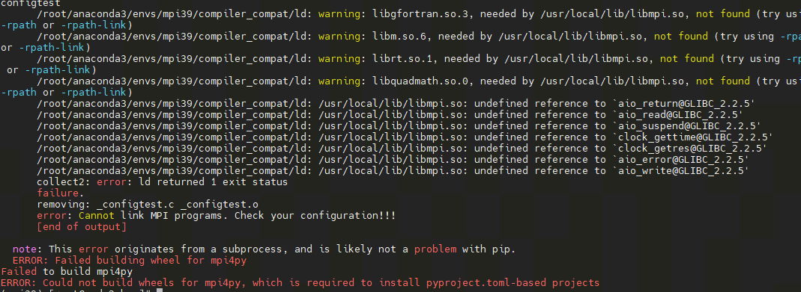

.. _vqnet_dist:

VQNet Naive Distributed Computing Module
*********************************************************

Environment deployment
=================================

The following describes the VQNet deployment of the environment under the Linux system based on CPU and GPU distributed computing, respectively.

MPI Installation
^^^^^^^^^^^^^^^^^^^^^^

MPI is a common library for inter-CPU communication, and the distributed computing function of CPU in VQNet is realized based on MPI, 
and the following section describes how to install MPI in Linux system (at present, the distributed computing function based on CPU is realized only on Linux).

Detect if gcc, gfortran compilers are installed.

.. code-block::
        
    which gcc 
    which gfortran

When the paths to gcc and gfortran are shown, you can proceed to the next step of installation, if you do not have the corresponding compilers, 
please install the compilers first. When the compilers have been checked, use the wget command to download them.

.. code-block::
        
    wget http://www.mpich.org/static/downloads/3.3.2/mpich-3.3.2.tar.gz 
    tar -zxvf mpich-3.3.2.tar.gz 
    cd mpich-3.3.2 
    ./configure --prefix=/usr/local/mpich
    make 
    make install 

Finish compiling and installing mpich and configure its environment variables.

.. code-block::
        
    vim ~/.bashrc

    # At the bottom of the document, add
    export PATH="/usr/local/mpich/bin:$PATH"

After saving and exiting, use source to execute

.. code-block::

    source ~/.bashrc

Use which to verify that the environment variables are configured correctly. If the path is displayed, the installation has completed successfully.

In addition, you can install mpi4py via pip install, if you get the following error

|

To solve the problem of incompatibility between mpi4py and python versions, you can do the following

.. code-block::

    # Staging the compiler for the current python environment with the following code
    pushd /root/anaconda3/envs/$CONDA_DEFAULT_ENV/compiler_compat && mv ld ld.bak && popd

    # Re-installation
    pip install mpi4py

    # reduction
    pushd /root/anaconda3/envs/$CONDA_DEFAULT_ENV/compiler_compat && mv ld.bak ld && popd

NCCL Installation
^^^^^^^^^^^^^^^^^^^^^^

NCCL is a common library for communication between GPUs, and the distributed computing function of GPUs in VQNet is realized based on NCCL, 
and the following introduces how to install NCCL in Linux system (at present, the distributed computing function based on GPUs is realized only on Linux).
This section requires MPI support, so the MPI environment needs to be deployed as well.

Pull the NCCL repositories from github to local

.. code-block::

    git clone https://github.com/NVIDIA/nccl.git

Go to the nccl root directory and compile

.. code-block::
    
    cd nccl
    make -j src.build

If cuda is not installed in the default path /usr/local/cuda, you need to define the path to CUDA, and compile it using the following code

.. code-block::

    make src.build CUDA_HOME=<path to cuda install>

And you can specify the installation directory according to BUILDDIR, the command is as follows

.. code-block::
    
    make src.build CUDA_HOME=<path to cuda install> BUILDDIR=/usr/local/nccl

Add configuration to the .bashrc file after installation is complete

.. code-block::
    
    vim ~/.bashrc

    # Add at the bottom
    export LD_LIBRARY_PATH=$LD_LIBRARY_PATH:/usr/local/nccl/lib
    export PATH=$PATH:/usr/local/nccl/bin

After saving, execute

.. code-block::
    
    source ~/.bashrc

It can be verified with nccl-test

.. code-block::
    
    git clone https://github.com/NVIDIA/nccl-tests.git
    cd nccl-tests
    make -j12 CUDA_HOME=/usr/local/cuda
    ./build/all_reduce_perf -b 8 -e 256M -f 2 -g 1

Inter-node communication environment deployment
^^^^^^^^^^^^^^^^^^^^^^^^^^^^^^^^^^^^^^^^^^^^^^^^^^^^^^^^^^^^^^^^^^

    To implement distributed computing on multiple nodes, first **you need to ensure the consistency of the mpich environment and the python environment on multiple nodes**, and secondly, you need to set up **secret-free communication between nodes**.
    .. code-block::

        # Execute on each node
        ssh-keygen
        
        # After that, keep entering to generate a public key (id_rsa.pub) and a private key (id_rsa) in the .ssh folder
        # Add the public keys of both of its other nodes to the authorized_keys file of the first node.
        # Then pass the authorized_keys file from the first node to the other two nodes to achieve password-free communication between the nodes.
        # Execute on child node node1
        cat ~/.ssh/id_dsa.pub >> node0:~/.ssh/authorized_keys

        # Execute on child node node2
        cat ~/.ssh/id_dsa.pub >> node0:~/.ssh/authorized_keys
        
        # After deleting the authorized_keys files on node1 and node2, copy the authorized_keys file on node0 to the other two nodes.
        scp ~/.ssh/authorized_keys  node1:~/.ssh/authorized_keys
        scp ~/.ssh/authorized_keys  node2:~/.ssh/authorized_keys

        # After deleting the authorized_keys files on node1 and node2, copy the authorized_keys file on node0 to the other two nodes.

    In addition to this, it is also a good idea to set up a shared directory so that when files in the shared directory are changed, 
    files in different nodes are also changed, preventing files in different nodes from being out of sync when the model is run on multiple nodes.
    The shared directory is implemented using nfs-utils and rpcbind.

    .. code-block::

        # Installation of software packages
        yum -y install nfs* rpcbind  

        # Edit the configuration file on the master node
        vim /etc/exports  
        /data/mpi *(rw,sync,no_all_squash,no_subtree_check)

        # Start the service on the master node
        systemctl start rpcbind
        systemctl start nfs

        # Mount the directory to be shared on all child nodes node1,node2.
        mount node1:/data/mpi/ /data/mpi
        mount node2:/data/mpi/ /data/mpi

Distributed launch
=================================
 
Using the Distributed Computing Interface, started by the ``vqnetrun`` command, the parameters of ``vqnetrun`` are described.

n, np
^^^^^^^^^^^^^^^^^^^^^^

The ``vqnetrun`` interface allows you to control the number of processes started with the ``-n``, ``-np`` parameters, as shown in the following example.

    Example::

        from pyvqnet.distributed import CommController
        Comm_OP = CommController("mpi") # init mpi controller
        
        rank = Comm_OP.getRank()
        size = Comm_OP.getSize()
        print(f"rank: {rank}, size {size}")

        # vqnetrun -n 2 python test.py
        # vqnetrun -np 2 python test.py

H, hosts
^^^^^^^^^^^^^^^^^^^^^^

The ``vqnetrun`` interface allows you to specify nodes and process assignments for cross-node execution via the ``-H``, ``--hosts`` interfaces (you must configure the node's environment successfully to execute in the same environment under the same path when running across nodes), with the following execution example.

    Example::

        from pyvqnet.distributed import CommController, get_host_name
        Comm_OP = CommController("mpi") # init mpi controller
        
        rank = Comm_OP.getRank()
        size = Comm_OP.getSize()
        print(f"rank: {rank}, size {size}")
        print(f"LocalRank {Comm_OP.getLocalRank()} hosts name {get_host_name()}")

        # vqnetrun -np 4 -H node0:1,node2:1 python test.py
        # vqnetrun -np 4 --hosts node0:1,node2:1 python test.py

.. _hostfile:

hostfile, f, hostfile
^^^^^^^^^^^^^^^^^^^^^^

The ``vqnetrun`` interface allows you to specify nodes and process assignments across nodes by specifying a hosts file (when running across nodes, you must configure the node's environment successfully, executing in the same environment and under the same path), with the command line arguments ``-hostfile``, ``-f``, and ``--hostfile``.

Each line within the file must be formatted as <hostname> slots=<slots> as;

node0 slots=1

node2 slots=1

A sample implementation is as follows

    Example::

        from pyvqnet.distributed import CommController, get_host_name
        Comm_OP = CommController("mpi") # init mpi controller
        
        rank = Comm_OP.getRank()
        size = Comm_OP.getSize()
        print(f"rank: {rank}, size {size}")
        print(f"LocalRank {Comm_OP.getLocalRank()} hosts name {get_host_name()}")

        # vqnetrun -np 4 -f hosts python test.py
        # vqnetrun -np 4 -hostfile hosts python test.py
        # vqnetrun -np 4 --hostfile hosts python test.py

output-filename
^^^^^^^^^^^^^^^^^^^^^^

The ``vqnetrun`` interface allows you to save the output to a specified file with the command line parameter ``--output-filename``.

A sample implementation is as follows:

    Example::

        from pyvqnet.distributed import CommController, get_host_name
        Comm_OP = CommController("mpi") # init mpi controller
        
        rank = Comm_OP.getRank()
        size = Comm_OP.getSize()
        print(f"rank: {rank}, size {size}")
        print(f"LocalRank {Comm_OP.getLocalRank()} hosts name {get_host_name()}")

        # vqnetrun -np 4 --hostfile hosts --output-filename output  python test.py

verbose
^^^^^^^^^^^^^^^^^^^^^^

The ``vqnetrun`` interface can be used with the command line parameter ``--verbose`` to instrument inter-node communication and additionally output the results of the instrumentation.

A sample implementation is as follows

    Example::

        from pyvqnet.distributed import CommController, get_host_name
        Comm_OP = CommController("mpi") # init mpi controller
        
        rank = Comm_OP.getRank()
        size = Comm_OP.getSize()
        print(f"rank: {rank}, size {size}")
        print(f"LocalRank {Comm_OP.getLocalRank()} hosts name {get_host_name()}")

        # vqnetrun -np 4 --hostfile hosts --verbose python test.py

start-timeout
^^^^^^^^^^^^^^^^^^^^^^

The ``vqnetrun`` interface can be used with the command line parameter ``-start-timeout`` to specify that all checks are performed and the process is started before the timeout. The default value is 30 seconds.

A sample implementation is as follows

    Example::

        from pyvqnet.distributed import CommController, get_host_name
        Comm_OP = CommController("mpi") # init mpi controller
        
        rank = Comm_OP.getRank()
        size = Comm_OP.getSize()
        print(f"rank: {rank}, size {size}")
        print(f"LocalRank {Comm_OP.getLocalRank()} hosts name {get_host_name()}")

        # vqnetrun -np 4 --start-timeout 10 python test.py

h
^^^^^^^^^^^^^^^^^^^^^^

The ``vqnetrun`` interface can output all parameters supported by vqnetrun and a detailed description of the parameters using this flag.

A sample implementation is as follows

    .. code-block::

        # vqnetrun -h

CommController
=================================

    Distributed computing is used to control the data communication of different processes under cpu and gpu, generate different controllers for cpu (mpi) and gpu (nccl), and call the communication method to complete the communication and synchronization of data between different processes.

__init__
^^^^^^^^^^^^^^^^^^^^^^
.. py:class:: pyvqnet.distributed.ControlComm.CommController(backend,rank=None,world_size=None)
    
    CommController is used to control the controller of data communication under cpu and gpu, by setting the parameter `backend` to generate the controller for cpu(mpi) and gpu(nccl). (Currently, the distributed computing function only supports the use of linux operating system system )

    :param backend: used to generate the data communication controller for cpu or gpu.
    :param rank: This parameter is only useful in non-pyvqnet backends, the default value is: None.
    :param world_size: This parameter is only useful in non-pyvqnet backends, the default value is: None.
        
    :return:
        CommController instance.

    Examples::

        from pyvqnet.distributed import CommController
        Comm_OP = CommController("nccl") # init nccl controller

        # Comm_OP = CommController("mpi") # init mpi controller

 
    .. py:method:: getRank()
        
        Used to get the process number of the current process.

        :return: Returns the process number of the current process.

        Examples::

            from pyvqnet.distributed import CommController
            Comm_OP = CommController("nccl") # init nccl controller
            
            Comm_OP.getRank()

 
    .. py:method:: getSize()
    
        Used to get the total number of processes started.

        :return: Returns the total number of processes.

        Examples::

            from pyvqnet.distributed import CommController
            Comm_OP = CommController("nccl") # init nccl controller
            
            Comm_OP.getSize()
            # vqnetrun -n 2 python test.py 
            # 2

    .. py:method:: getLocalRank()
    
        Used to get the current process number on the current machine.

        :return: The current process number on the current machine.

        Examples::

            from pyvqnet.distributed import CommController
            Comm_OP = CommController("nccl") # init nccl controller
            
            Comm_OP.getLocalRank()
            # vqnetrun -n 2 python test.py 

    .. py:method:: split_group(rankL)
        
        Divide multiple communication groups according to the process number list set by the input parameter.

        :param rankL: A list of process group ranks.

        :return: When the backend is `nccl`, a tuple of process group ranks is returned. 
                 When the backend is `mpi`, returns a list whose length is equal to the number of groups; each element is a tuple (comm, rank), where comm is the MPI communicator of the group and rank is the sequence number within the group..

        Examples::
            
            from pyvqnet.distributed import CommController,get_rank,get_local_rank
            from pyvqnet.tensor import tensor
            import numpy as np
            Comm_OP = CommController("mpi")

            groups = Comm_OP.split_group([[0, 1],[2,3]])
            print(groups)
            #[[<mpi4py.MPI.Intracomm object at 0x7f53691f3230>, [0, 3]], [<mpi4py.MPI.Intracomm object at 0x7f53691f3010>, [2, 1]]]

 
    .. py:method:: barrier()
    
        Synchronization.

        :return: Synchronization.

        Examples::

            from pyvqnet.distributed import CommController
            Comm_OP = CommController("nccl")
            
            Comm_OP.barrier()

 
    .. py:method:: get_device_num()
    
        Used to get the number of graphics cards on the current node, (only supported on gpu).

        :return: Returns the number of graphics cards on the current node.

        Examples::

            from pyvqnet.distributed import CommController
            Comm_OP = CommController("nccl")
            
            Comm_OP.get_device_num()
            # python test.py

 
    .. py:method:: allreduce(tensor, c_op = "avg")
    
        Supports allreduce communication of data.

        :param tensor: Input data.
        :param c_op: Calculation.

        Examples::

            from pyvqnet.distributed import CommController
            from pyvqnet.tensor import tensor
            import numpy as np
            Comm_OP = CommController("mpi")

            num = tensor.to_tensor(np.random.rand(1, 5))
            print(f"rank {Comm_OP.getRank()}  {num}")

            Comm_OP.allreduce(num, "sum")
            print(f"rank {Comm_OP.getRank()}  {num}")
            # vqnetrun -n 2 python test.py

 
    .. py:method:: reduce(tensor, root = 0, c_op = "avg")
    
        Supports reduce communication of data.

        :param tensor: input.
        :param root: Specifies the node to which the data is returned.
        :param c_op: Calculation.

        Examples::

            from pyvqnet.distributed import CommController
            from pyvqnet.tensor import tensor
            import numpy as np
            Comm_OP = CommController("mpi")

            num = tensor.to_tensor(np.random.rand(1, 5))
            print(f"rank {Comm_OP.getRank()}  {num}")
            
            Comm_OP.reduce(num, 1)
            print(f"rank {Comm_OP.getRank()}  {num}")
            # vqnetrun -n 2 python test.py

 
    .. py:method:: broadcast(tensor, root = 0)
    
        Broadcasts data on the specified process root to all processes.

        :param tensor: input.
        :param root: Specifies node.

        Examples::

            from pyvqnet.distributed import CommController
            from pyvqnet.tensor import tensor
            import numpy as np
            Comm_OP = CommController("mpi")

            num = tensor.to_tensor(np.random.rand(1, 5))
            print(f"rank {Comm_OP.getRank()}  {num}")
            
            Comm_OP.broadcast(num, 1)
            print(f"rank {Comm_OP.getRank()}  {num}")
            # vqnetrun -n 2 python test.py

 
    .. py:method:: allgather(tensor)
    
        Allgather the data on all processes together.

        :param tensor: input.

        Examples::

            from pyvqnet.distributed import CommController
            from pyvqnet.tensor import tensor
            import numpy as np
            Comm_OP = CommController("mpi")

            num = tensor.to_tensor(np.random.rand(1, 5))
            print(f"rank {Comm_OP.getRank()}  {num}")

            num = Comm_OP.allgather(num)
            print(f"rank {Comm_OP.getRank()}  {num}")
            # vqnetrun -n 2 python test.py

    .. py:method:: send(tensor, dest)
    
        p2p communication interface.

        :param tensor: input.
        :param dest: Destination process.

        Examples::

            from pyvqnet.distributed import CommController,get_rank
            from pyvqnet.tensor import tensor
            import numpy as np
            Comm_OP = CommController("mpi")

            num = tensor.to_tensor(np.random.rand(1, 5))
            recv = tensor.zeros_like(num)

            if get_rank() == 0:
                Comm_OP.send(num, 1)
            elif get_rank() == 1:
                Comm_OP.recv(recv, 0)
            print(f"rank {Comm_OP.getRank()}  {num}")
            print(f"rank {Comm_OP.getRank()}  {recv}")
            
            # vqnetrun -n 2 python test.py

 
    .. py:method:: recv(tensor, source)
    
        p2p communication interface.

        :param tensor: input.
        :param source: Acceptance process.

        Examples::

            from pyvqnet.distributed import CommController,get_rank
            from pyvqnet.tensor import tensor
            import numpy as np
            Comm_OP = CommController("mpi")

            num = tensor.to_tensor(np.random.rand(1, 5))
            recv = tensor.zeros_like(num)

            if get_rank() == 0:
                Comm_OP.send(num, 1)
            elif get_rank() == 1:
                Comm_OP.recv(recv, 0)
            print(f"rank {Comm_OP.getRank()}  {num}")
            print(f"rank {Comm_OP.getRank()}  {recv}")
            
            # vqnetrun -n 2 python test.py

 
    .. py:method:: allreduce_group(tensor, c_op = "avg", group = None)
    
        The group allreduce communication interface.

        :param tensor: input.
        :param c_op: Calculation.
        :param group: Communication group. When using the mpi backend, enter the group generated by `init_group` or `split_group` corresponding to the communication group. When using the nccl backend, enter the group number generated by `split_group`.

        Examples::

            from pyvqnet.distributed import CommController,get_rank,get_local_rank
            from pyvqnet.tensor import tensor
            import numpy as np
            Comm_OP = CommController("nccl")

            groups = Comm_OP.split_group([[0, 1]])

            complex_data = tensor.QTensor([3+1j, 2, 1 + get_rank()],dtype=8).reshape((3,1)).toGPU(1000+ get_local_rank())

            print(f"allreduce_group before rank {get_rank()}: {complex_data}")

            Comm_OP.allreduce_group(complex_data, c_op="sum",group = groups[0])
            print(f"allreduce_group after rank {get_rank()}: {complex_data}")
            # vqnetrun -n 2 python test.py

 
    .. py:method:: reduce_group(tensor, root = 0, c_op = "avg", group = None)
    
        Intra-group reduce communication interface.

        :param tensor: Input.
        :param root: Specify the process number.
        :param c_op: Calculation.
        :param group: Communication group. When using the mpi backend, enter the group generated by `init_group` or `split_group` corresponding to the communication group. When using the nccl backend, enter the group number generated by `split_group`.

        Examples::
            
            from pyvqnet.distributed import CommController,get_rank,get_local_rank
            from pyvqnet.tensor import tensor
            import numpy as np
            Comm_OP = CommController("nccl")

            groups = Comm_OP.split_group([[0, 1]])

            complex_data = tensor.QTensor([3+1j, 2, 1 + get_rank()],dtype=8).reshape((3,1)).toGPU(1000+ get_local_rank())

            print(f"reduce_group before rank {get_rank()}: {complex_data}")

            Comm_OP.reduce_group(complex_data, c_op="sum",group = groups[0])
            print(f"reduce_group after rank {get_rank()}: {complex_data}")
            # vqnetrun -n 2 python test.py

 
    .. py:method:: broadcast_group(tensor, root = 0, group = None)
    
        Intra-group broadcast communication interface.

        :param tensor: Input.
        :param root: Specify the process number to broadcast from, default:0.
        :param group: Communication group. When using the mpi backend, enter the group generated by `init_group` or `split_group` corresponding to the communication group. When using the nccl backend, enter the group number generated by `split_group`.

        Examples::
            
            from pyvqnet.distributed import CommController,get_rank,get_local_rank
            from pyvqnet.tensor import tensor
            import numpy as np
            Comm_OP = CommController("nccl")

            groups = Comm_OP.split_group([[0, 1]])

            complex_data = tensor.QTensor([3+1j, 2, 1 + get_rank()],dtype=8).reshape((3,1)).toGPU(1000+ get_local_rank())

            print(f"broadcast_group before rank {get_rank()}: {complex_data}")

            Comm_OP.broadcast_group(complex_data,group = groups[0])
            Comm_OP.barrier()
            print(f"broadcast_group after rank {get_rank()}: {complex_data}")
            # vqnetrun -n 2 python test.py

 
    .. py:method:: allgather_group(tensor, group = None)
    
        The group allgather communication interface.

        :param tensor: Input.
        :param group: Communication group. When using the mpi backend, enter the group generated by `init_group` or `split_group` corresponding to the communication group. When using the nccl backend, enter the group number generated by `split_group`.

        Examples::
            
            from pyvqnet.distributed import CommController,get_rank,get_local_rank
            from pyvqnet.tensor import tensor
            import numpy as np
            Comm_OP = CommController("nccl")

            groups = Comm_OP.split_group([[0, 1]])

            complex_data = tensor.QTensor([3+1j, 2, 1 + get_rank()],dtype=8).reshape((3,1)).toGPU(1000+ get_local_rank())

            print(f"allgather_group before rank {get_rank()}: {complex_data}")

            complex_data = Comm_OP.allgather_group(complex_data,group = groups[0])
            print(f"allgather_group after rank {get_rank()}: {complex_data}")
            # vqnetrun -n 2 python test.py

 
    .. py:method:: grad_allreduce(optimizer)
    
        Update the gradient of the parameters in the optimizer with allreduce.

        :param optimizer: optimizer.

        Examples::
            
            from pyvqnet.distributed import CommController,get_rank,get_local_rank
            from pyvqnet.tensor import tensor
            from pyvqnet.nn.module import Module
            from pyvqnet.nn.linear import Linear
            from pyvqnet.nn.loss import MeanSquaredError
            from pyvqnet.optim import Adam
            from pyvqnet.nn import activation as F
            import pyvqnet
            import numpy as np
            Comm_OP = CommController("nccl")

            class Net(Module):
                def __init__(self):
                    super(Net, self).__init__()
                    self.fc = Linear(input_channels=5, output_channels=1)
                def forward(self, x):
                    x = F.ReLu()(self.fc(x))
                    return x
                
            model = Net().toGPU(1000+ get_local_rank())
            opti = Adam(model.parameters(), lr=0.01)
            actual = tensor.QTensor([1,1,1,1,1,0,0,0,0,0],dtype=pyvqnet.kfloat32).reshape((10,1)).toGPU(1000+ get_local_rank())
            x = tensor.randn((10, 5)).toGPU(1000+ get_local_rank())
            for i in range(10):
                opti.zero_grad()
                model.train()
                result = model(x)
                loss = MeanSquaredError()(actual, result)
                loss.backward()
                # print(f"rank {get_rank()} grad is {model.parameters()[0].grad} para {model.parameters()[0]}")
                Comm_OP.grad_allreduce(opti)
                # print(Comm_OP._allgather(model.parameters()[0]))
                if get_rank() == 0 :
                    print(f"rank {get_rank()} grad is {model.parameters()[0].grad} para {model.parameters()[0]} after")
                opti.step()
            # vqnetrun -n 2 python test.py

 
    .. py:method:: param_allreduce(model)
    
        Update the parameters in the model in an allreduce manner.

        :param model: Model.

        Examples::
        
            from pyvqnet.distributed import CommController,get_rank,get_local_rank
            from pyvqnet.tensor import tensor
            from pyvqnet.nn.module import Module
            from pyvqnet.nn.linear import Linear
            from pyvqnet.nn import activation as F
            import numpy as np
            Comm_OP = CommController("nccl")

            class Net(Module):
                def __init__(self):
                    super(Net, self).__init__()
                    self.fc = Linear(input_channels=5, output_channels=1)
                def forward(self, x):
                    x = F.ReLu()(self.fc(x))
                    return x
                
            model = Net().toGPU(1000+ get_local_rank())
            print(f"rank {get_rank()} parameters is {model.parameters()}")
            Comm_OP.param_allreduce(model)
                
            if get_rank() == 0:
                print(model.parameters())

 
    .. py:method:: broadcast_model_params(model, root = 0)
    
        Broadcasts the model parameters on the specified process number.

        :param model: Models.
        :param root: Specify the process number.

        Examples::
        
            from pyvqnet.distributed import CommController,get_rank,get_local_rank
            from pyvqnet.tensor import tensor
            from pyvqnet.nn.module import Module
            from pyvqnet.nn.linear import Linear
            from pyvqnet.nn import activation as F
            import numpy as np
            Comm_OP = CommController("nccl")

            class Net(Module):
                def __init__(self):
                    super(Net, self).__init__()
                    self.fc = Linear(input_channels=5, output_channels=1)
                def forward(self, x):
                    x = F.ReLu()(self.fc(x))
                    return x
                
            model = Net().toGPU(1000+ get_local_rank())
            print(f"bcast before rank {get_rank()}:{model.parameters()}")
            Comm_OP.broadcast_model_params(model, 0)
            # model = model
            print(f"bcast after rank {get_rank()}: {model.parameters()}")

    .. py:method:: nccl_async_all_gather( output, input, group=None, async_op=False):

        Use NCCL for asynchronous or synchronous all_gather on GPU data.

        :param output: QTensor - The target QTensor for all_gather result.
        :param input: QTensor - The QTensor to be gathered.
        :param group: Communication process group, group is a tuple containing group indices. Default: None, no group is used.
        :param async_op: Whether this operation is asynchronous, default: False.
        :return: Work - An asynchronous communication handle. Use wait() to wait for this operation to complete.

        Examples::

            from pyvqnet import tensor
            import pyvqnet
            from pyvqnet.distributed import CommController,get_rank,get_local_rank
            Comm_OP = CommController("nccl")

            complex_data = tensor.QTensor([3+1j, 2, 1 + get_rank()],dtype=8).reshape((3,1)).toGPU(1000+ get_local_rank())

            out_data = tensor.empty([2,3,1],dtype=pyvqnet.kcomplex64).toGPU(pyvqnet.DEV_GPU_0+ get_local_rank())
            work = Comm_OP.nccl_async_all_gather(out_data, complex_data, group = None,async_op=True)
            work.wait()

    .. py:method:: nccl_async_all_reduce(tensor, c_op="avg",group=None, async_op=False):

        Use NCCL for asynchronous or synchronous allreduce on GPU data.

        :param tensor: QTensor - The QTensor that needs to be reduced.
        :param c_op: Computation method, can be "sum" or "avg", default value is "avg".
        :param group: Communication process group, group is a tuple containing group indices. Default: None, no group is used.
        :param async_op: Whether this operation is asynchronous, default: False.
        :return: Work - An asynchronous communication handle. Use wait() to wait for this operation to complete.

        Examples::

            import pyvqnet
            from pyvqnet.tensor import tensor
            from pyvqnet.distributed.ControlComm import CommController,get_local_rank

            Comm_OP = CommController("nccl")
            complex_data = tensor.ones([500,500],dtype=pyvqnet.kcomplex64).toGPU(pyvqnet.DEV_GPU_0 + get_local_rank())
            work = Comm_OP.nccl_async_all_reduce(complex_data, "sum",group = None,async_op = True)
            work.wait()

    .. py:method:: nccl_async_reduce( tensor_, dest, c_op="avg", group=None, async_op=False ):

        Use NCCL for asynchronous or synchronous reduce on GPU data.

        :param tensor_: QTensor - The QTensor that needs to be reduced.
        :param dest: The destination rank of the reduced QTensor.
        :param c_op: Computation method, can be "sum" or "avg", default value is "avg".
        :param group: Communication process group, group is a tuple containing group indices. Default: None, no group is used.
        :param async_op: Whether this operation is asynchronous, default: False.
        :return: Work - An asynchronous communication handle. Use wait() to wait for this operation to complete.

        Examples::

            from pyvqnet import tensor
            import pyvqnet
            from pyvqnet.distributed import CommController,get_rank,get_local_rank
            Comm_OP = CommController("nccl")

            complex_data = tensor.ones([500,500],dtype=pyvqnet.kcomplex64).toGPU(pyvqnet.DEV_GPU_0 + get_local_rank())
            work = Comm_OP.nccl_async_reduce(complex_data, 0,"sum",group = None,async_op = True)
            work.wait()

    .. py:method:: nccl_async_broadcast(tensor, src, group=None, async_op=False )

        Use NCCL for asynchronous or synchronous broadcast on GPU data.

        :param tensor: QTensor - The QTensor that needs to be broadcast.
        :param src: The source rank of the broadcast QTensor.
        :param group: Communication process group, group is a tuple containing group indices. Default: None, no group is used.
        :param async_op: Whether this operation is asynchronous, default: False.
        :return: Work - An asynchronous communication handle. Use wait() to wait for this operation to complete.

        Examples::

            import pyvqnet
            from pyvqnet.tensor import tensor
            from pyvqnet.distributed.ControlComm import CommController,get_local_rank
            Comm_OP = CommController("nccl")
            if get_local_rank() == 1:
                complex_data = tensor.ones([5,5],dtype=pyvqnet.kcomplex64).toGPU(pyvqnet.DEV_GPU_0+ get_local_rank())
            else:
                complex_data = tensor.zeros([5,5],dtype=pyvqnet.kcomplex64).toGPU(pyvqnet.DEV_GPU_0+ get_local_rank())
            work = Comm_OP.nccl_async_broadcast(complex_data, 1, group = None,async_op=True)

            work.wait()

    .. py:method:: nccl_async_send( t, dest, async_op=False ):

        Use NCCL for asynchronous or synchronous P2P send on GPU data.

        :param t: QTensor - The QTensor that needs to be sent.
        :param dest: The destination rank to send the QTensor to.
        :param async_op: Whether this operation is asynchronous, default: False.
        :return: Work - An asynchronous communication handle. Use wait() to wait for this operation to complete.

        Examples::

            import pyvqnet
            from pyvqnet.tensor import tensor
            from pyvqnet.distributed.ControlComm import CommController,get_local_rank
            Comm_OP = CommController("nccl")

            if get_local_rank() == 0:
                complex_data = tensor.ones([5000,5000],dtype=pyvqnet.kcomplex64).toGPU(pyvqnet.DEV_GPU_0+ get_local_rank())*10
            else:
                complex_data = tensor.ones([5000,5000],dtype=pyvqnet.kcomplex64).toGPU(pyvqnet.DEV_GPU_0+ get_local_rank())

            if get_local_rank() == 0:
                work = Comm_OP.nccl_async_send(complex_data, 1 ,True)
            else:
                work = Comm_OP.nccl_async_recv(complex_data, 0 ,True)
            work.wait()

    .. py:method:: nccl_async_recv( t, src, async_op=False ):

        Use NCCL for asynchronous or synchronous P2P receive on GPU data.

        :param t: QTensor - The QTensor that receives the data.
        :param src: The source rank of the received QTensor.
        :param async_op: Whether this operation is asynchronous, default: False.
        :return: Work - An asynchronous communication handle. Use wait() to wait for this operation to complete.

        Examples::

            import pyvqnet
            from pyvqnet.tensor import tensor
            from pyvqnet.distributed.ControlComm import CommController,get_local_rank
            Comm_OP = CommController("nccl")

            if get_local_rank() == 0:
                complex_data = tensor.ones([5000,5000],dtype=pyvqnet.kcomplex64).toGPU(pyvqnet.DEV_GPU_0+ get_local_rank())*10
            else:
                complex_data = tensor.ones([5000,5000],dtype=pyvqnet.kcomplex64).toGPU(pyvqnet.DEV_GPU_0+ get_local_rank())

            if get_local_rank() == 0:
                work = Comm_OP.nccl_async_send(complex_data, 1 ,True)
            else:
                work = Comm_OP.nccl_async_recv(complex_data, 0 ,True)
            work.wait()

split_data
~~~~~~~~~~~~~~~~~~~~~~~~~~

In multi-process, use ``split_data`` to slice the data according to the number of processes and return the data on the corresponding process.

.. py:function:: pyvqnet.distributed.datasplit.split_data(x_train, y_train, shuffle=False)

Set parameters for distributed computation.

    :param x_train: `np.array` - training data.
    :param y_train: `np.array` - Training data labels.
    :param shuffle: `bool` - Whether to shuffle and then slice, default is False.

    :return: sliced training data and labels.

    Example::

        from pyvqnet.distributed import split_data
        import numpy as np

        x_train = np.random.randint(255, size = (100, 5))
        y_train = np.random.randint(2, size = (100, 1))

        x_train, y_train= split_data(x_train, y_train)

get_local_rank
~~~~~~~~~~~~~~~~~~~~~~~~~~~

Use ``get_local_rank`` to get the process number on the current machine.

.. py:function:: pyvqnet.distributed.ControlComm.get_local_rank()

    Used to get the current process number on the current machine.

    :return: current process number on the current machine.

    Example::

        from pyvqnet.distributed.ControlComm import get_local_rank

        print(get_local_rank())
        # vqnetrun -n 2 python test.py

get_rank
~~~~~~~~~~~~~~~~~~~~~~~~~~~
Use ``get_rank`` to get the process number on the current machine.

.. py:function:: pyvqnet.distributed.ControlComm.get_rank()

    Used to get the process number of the current process.

    :return: the process number of the current process.

    Example::

        from pyvqnet.distributed.ControlComm import get_rank

        print(get_rank())
        # vqnetrun -n 2 python test.py

init_group
~~~~~~~~~~~~~~~~~~~~~~~~~~~
Use ``init_group`` to initialise cpu-based process groups based on the given list of process numbers.

.. py:function:: pyvqnet.distributed.ControlComm.init_group(rank_lists)

    Used to initialise the process communication group for `mpi` backend.

    :param rank_lists: List of communication process groups.
    :return: A list of initialised process groups.

    Example::

        from pyvqnet.distributed import *

        Comm_OP = CommController("mpi")
        num = tensor.to_tensor(np.random.rand(1, 5))
        print(f"rank {Comm_OP.getRank()}  {num}")
        
        group_l = init_group([[0,2], [1]])

        for comm_ in group_l:
            if Comm_OP.getRank() in comm_[1]:
                Comm_OP.allreduce_group(num, "sum", group = comm_[0])
                print(f"rank {Comm_OP.getRank()}  {num} after")
        
        # vqnetrun -n 3 python test.py
        

PipelineParallelTrainingWrapper
~~~~~~~~~~~~~~~~~~~~~~~~~~~~~~~~~~~~~~~~~~~~~~~~~~~~
.. py:class:: pyvqnet.distributed.pp.PipelineParallelTrainingWrapper(args,join_layers,trainset)
    
    Pipeline Parallel Training Wrapper implements 1F1B training. Available only on Linux platforms with a GPU.
    More algorithm details can be found at (https://www.deepspeed.ai/tutorials/pipeline/).

    :param args: Parameter dictionary. See examples.
    :param join_layers: List of Sequential modules.
    :param trainset: Dataset.

    :return:
        PipelineParallelTrainingWrapper instance.

    The following uses the CIFAR10 database `CIFAR10_Dataset` to train the classification task on AlexNet on 2 GPUs.
    In this example, it is divided into two pipeline parallel processes `pipeline_parallel_size` = 2.
    The batch size is `train_batch_size` = 64, on a single GPU it is `train_micro_batch_size_per_gpu` = 32.
    Other configuration parameters can be found in `args`.
    In addition, each process needs to configure the environment variable `LOCAL_RANK` in the `__main__` function.

    Examples::

        import os
        import pyvqnet

        from pyvqnet.nn import Module,Sequential,CrossEntropyLoss
        from pyvqnet.nn import Linear
        from pyvqnet.nn import Conv2D
        from pyvqnet.nn import activation as F
        from pyvqnet.nn import MaxPool2D
        from pyvqnet.nn import CrossEntropyLoss

        from pyvqnet.tensor import tensor
        from pyvqnet.distributed.pp import PipelineParallelTrainingWrapper
        from pyvqnet.distributed.configs import comm as dist
        from pyvqnet.distributed import *

        pipeline_parallel_size = 2

        num_steps = 1000

        def cifar_trainset_vqnet(local_rank, dl_path='./cifar10-data'):
            transform = pyvqnet.data.TransformCompose([
                pyvqnet.data.TransformResize(256),
                pyvqnet.data.TransformCenterCrop(224),
                pyvqnet.data.TransformToTensor(),
                pyvqnet.data.TransformNormalize(mean=[0.485, 0.456, 0.406], std=[0.229, 0.224, 0.225]),
            ])

            trainset = pyvqnet.data.CIFAR10_Dataset(root=dl_path,
                                                    mode="train",
                                                    transform=transform,layout="HWC")

            return trainset

        class Model(Module):
            def __init__(self):
                super(Model, self).__init__()
                self.features = Sequential( 
                Conv2D(input_channels=3, output_channels=8, kernel_size=(3, 3), stride=(1, 1), padding='same'),
                F.ReLu(),
                MaxPool2D([2, 2], [2, 2]),

                Conv2D(input_channels=8, output_channels=16, kernel_size=(3, 3), stride=(1, 1), padding='same'),
                F.ReLu(),
                MaxPool2D([2, 2], [2, 2]),

                Conv2D(input_channels=16, output_channels=32, kernel_size=(3, 3), stride=(1, 1), padding='same'),
                F.ReLu(),

                Conv2D(input_channels=32, output_channels=64, kernel_size=(3, 3), stride=(1, 1), padding='same'),
                F.ReLu(),

                Conv2D(input_channels=64, output_channels=64, kernel_size=(3, 3), stride=(1, 1), padding='same'),
                F.ReLu(),
                MaxPool2D([3, 3], [2, 2]),)
                
                self.cls = Sequential( 
                Linear(64 * 27 * 27, 512),
                F.ReLu(),

                Linear(512, 256),
                F.ReLu(),
                Linear(256, 10) )

            def forward(self, x):
                x = self.features(x)
                x = tensor.flatten(x,1)
                x = self.cls(x)

                return x
            
        def join_layers(vision_model):
            layers = [
                *vision_model.features,
                lambda x: tensor.flatten(x, 1),
                *vision_model.cls,
            ]
            return layers

        if __name__ == "__main__":

            args = {
            "backend":'nccl',  
            "train_batch_size" : 64,
            "train_micro_batch_size_per_gpu" : 32,
            "epochs":5,
        "optimizer": {
            "type": "Adam",
            "params": {
            "lr": 0.001
            }}, 
            "local_rank":dist.get_local_rank(), 
            "pipeline_parallel_size":pipeline_parallel_size, "seed":42, "steps":num_steps,
            "loss":CrossEntropyLoss(),
            }
            os.environ["LOCAL_RANK"] = str(dist.get_local_rank())
            trainset = cifar_trainset_vqnet(args["local_rank"])
            w = PipelineParallelTrainingWrapper(args,join_layers(Model()),trainset)

            all_loss = {}

            for i in range(args["epochs"]):
                w.train_batch()
                
            all_loss = w.loss_dict

ZeroModelInitial
~~~~~~~~~~~~~~~~~~~~~~~~~~~~~~~~~~~~~~~~~~~~~~~~~~~~
.. py:class:: pyvqnet.distributed.ZeroModelInitial(args,model,optimizer)
    
    Zero1 api interface, currently only for linux platform based on GPU parallel computing.

    :param args: parameters dict.
    :param model: Module.
    :param optimizer: Optimizer.

    :return:
        Zero1 Engine.

The following uses the MNIST database to train a classification task on an MLP model on 2 GPUs.

    The batch size is `train_batch_size` = 64, and the stage `stage` of `zero_optimization` is set to 1. 
    If Optimizer is None, the setting of `optimizer` in `args` is used. Other configuration parameters can be found in `args`. 
    
    In addition, each process needs to be configured with the environment variable `LOCAL_RANK`.
    
    .. code-block::

        os.environ["LOCAL_RANK"] = str(dist.get_local_rank())

    Examples::

        from pyvqnet.distributed import *
        from pyvqnet import *
        from time import time
        import pyvqnet.optim as optim
        import pyvqnet.nn as nn
        import pyvqnet
        import sys
        import pyvqnet 
        import numpy as np
        import os
        import struct

        def load_mnist(dataset="training_data",
                    digits=np.arange(2),
                    path="./"):
            """
            load mnist data
            """
            from array import array as pyarray
            if dataset == "training_data":
                fname_image = os.path.join(path, "train-images.idx3-ubyte").replace(
                    "\\", "/")
                fname_label = os.path.join(path, "train-labels.idx1-ubyte").replace(
                    "\\", "/")
            elif dataset == "testing_data":
                fname_image = os.path.join(path, "t10k-images.idx3-ubyte").replace(
                    "\\", "/")
                fname_label = os.path.join(path, "t10k-labels.idx1-ubyte").replace(
                    "\\", "/")
            else:
                raise ValueError("dataset must be 'training_data' or 'testing_data'")

            flbl = open(fname_label, "rb")
            _, size = struct.unpack(">II", flbl.read(8))

            lbl = pyarray("b", flbl.read())
            flbl.close()

            fimg = open(fname_image, "rb")
            _, size, rows, cols = struct.unpack(">IIII", fimg.read(16))
            img = pyarray("B", fimg.read())
            fimg.close()

            ind = [k for k in range(size) if lbl[k] in digits]
            num = len(ind)
            images = np.zeros((num, rows, cols),dtype=np.float32)

            labels = np.zeros((num, 1), dtype=int)
            for i in range(len(ind)):
                images[i] = np.array(img[ind[i] * rows * cols:(ind[i] + 1) * rows *
                                        cols]).reshape((rows, cols))
                labels[i] = lbl[ind[i]]

            return images, labels

        train_images_np, train_labels_np = load_mnist(dataset="training_data", digits=np.arange(10),path="../data/MNIST_data/")
        train_images_np = train_images_np / 255.

        test_images_np, test_labels_np = load_mnist(dataset="testing_data", digits=np.arange(10),path="../data/MNIST_data/")
        test_images_np = test_images_np / 255.

        local_rank = pyvqnet.distributed.get_rank()

        from pyvqnet.distributed import ZeroModelInitial

        class MNISTClassifier(nn.Module):
            
            def __init__(self):
                super(MNISTClassifier, self).__init__()
                self.fc1 = nn.Linear(28*28, 512)
                self.fc2 = nn.Linear(512, 256)
                self.fc3 = nn.Linear(256, 128)
                self.fc4 = nn.Linear(128, 64)
                self.fc5 = nn.Linear(64, 10)
                self.ac = nn.activation.ReLu()
                
            def forward(self, x:pyvqnet.QTensor):
                
                x = x.reshape([-1, 28*28])  
                x = self.ac(self.fc1(x))
                x = self.fc2(x)
                x = self.fc3(x)
                x = self.fc4(x)
                x = self.fc5(x)
                return x
        
        model = MNISTClassifier()

        model.to(local_rank + 1000)
            
        Comm_op = CommController("nccl")
        Comm_op.broadcast_model_params(model, 0)

        batch_size = 64

        criterion = nn.CrossEntropyLoss()  
        optimizer = optim.Adam(model.parameters(), lr=0.001) 

        args_ = {
                "train_batch_size": batch_size, 
                "optimizer": {
                    "type": "adam",
                    "params": {
                    "lr": 0.001,
                    }
                },
                "zero_optimization": {
                    "stage": 1, 
                }    
            }

        os.environ["LOCAL_RANK"] = str(get_local_rank())
        model = ZeroModelInitial(args=args_, model=model, optimizer=optimizer) 

        def compute_acc(outputs, labels, correct, total):
            predicted = pyvqnet.tensor.argmax(outputs, dim=1, keepdims=True)
            total += labels.size
            correct += pyvqnet.tensor.sums(predicted == labels).item()
            return correct, total

        train_acc = 0
        test_acc = 0
        epochs = 5
        loss = 0
        time1 = time()

        for epoch in range(epochs):
            model.train()
            total = 0
            correct = 0
            step = 0
            
            num_batches = (train_images_np.shape[0] + batch_size - 1) // batch_size
            
            for i in range(num_batches):
                
                data_ = tensor.QTensor(train_images_np[i*batch_size: (i+1) * batch_size,:], dtype = kfloat32)
                labels = tensor.QTensor(train_labels_np[i*batch_size: (i+1) * batch_size,:], dtype = kint64)
                    
                data_ = data_.to(local_rank + 1000)
                labels = labels.to(local_rank + 1000)
                
                outputs = model(data_)
                loss = criterion(labels, outputs)
                
                model.backward(loss) 
                model.step() 

                correct, total = compute_acc(outputs, labels, correct, total)
                step += 1
                if step % 50 == 0:
                    print(f"Train : rank {get_rank()} Epoch [{epoch+1}/{epochs}], step {step} Loss: {loss.item():.4f} acc {100 * correct / total}")
                    sys.stdout.flush()
                    
            train_acc = 100 * correct / total
            
        time2 = time()
        print(f'Accuracy of the model on the 10000 Train images: {train_acc}% time cost {time2 - time1}')

ColumnParallelLinear
~~~~~~~~~~~~~~~~~~~~~~~~~~~~~~~~~~~~~~~~~~~~~~~~~~~~
.. py:class:: pyvqnet.distributed.ColumnParallelLinear(input_size,output_size,weight_initializer,bias_initializer,use_bias,dtype,name,tp_comm)
    
    Tensor-parallel computation with column-parallel linear layer
    
    The linear layer is defined as Y = XA + b. Its 2D parallel rows are A = [A_1, ... , A_p].

    :param input_size: first dimension of matrix A.
    :param output_size: second dimension of matrix A.
    :param weight_initializer: `callable` - defaults to normal.
    :param bias_initializer: `callable` - defaults to zeros.
    :param use_bias: `bool` - defaults to True.
    :param dtype: default: None,use default data type.
    :param name: name of module,default:"".
    :param tp_comm: Comm Controller.

    The following uses the MNIST database to train a classification task on an MLP model on 2 GPUs.

    The usage is similar to that of the classic Linear layer.

    Multi-process usage based on `vqnetrun -n 2 python test.py`.

    Examples::

        import pyvqnet.distributed
        import pyvqnet.optim as optim
        import pyvqnet.nn as nn
        import pyvqnet
        import sys
        from pyvqnet.distributed.tensor_parallel import ColumnParallelLinear, RowParallelLinear
        from pyvqnet.distributed import *
        from time import time

        import pyvqnet 
        import numpy as np
        import os
        from pyvqnet import *
        import pytest

        Comm_OP = CommController("nccl")

        import struct
        def load_mnist(dataset="training_data",
                    digits=np.arange(2),
                    path="./"):
            """
            load mnist data
            """
            from array import array as pyarray
            # download_mnist(path)
            if dataset == "training_data":
                fname_image = os.path.join(path, "train-images-idx3-ubyte").replace(
                    "\\", "/")
                fname_label = os.path.join(path, "train-labels-idx1-ubyte").replace(
                    "\\", "/")
            elif dataset == "testing_data":
                fname_image = os.path.join(path, "t10k-images-idx3-ubyte").replace(
                    "\\", "/")
                fname_label = os.path.join(path, "t10k-labels-idx1-ubyte").replace(
                    "\\", "/")
            else:
                raise ValueError("dataset must be 'training_data' or 'testing_data'")

            flbl = open(fname_label, "rb")
            _, size = struct.unpack(">II", flbl.read(8))

            lbl = pyarray("b", flbl.read())
            flbl.close()

            fimg = open(fname_image, "rb")
            _, size, rows, cols = struct.unpack(">IIII", fimg.read(16))
            img = pyarray("B", fimg.read())
            fimg.close()

            ind = [k for k in range(size) if lbl[k] in digits]
            num = len(ind)
            images = np.zeros((num, rows, cols),dtype=np.float32)

            labels = np.zeros((num, 1), dtype=int)
            for i in range(len(ind)):
                images[i] = np.array(img[ind[i] * rows * cols:(ind[i] + 1) * rows *
                                        cols]).reshape((rows, cols))
                labels[i] = lbl[ind[i]]

            return images, labels

        train_images_np, train_labels_np = load_mnist(dataset="training_data", digits=np.arange(10),path="./data/MNIST/raw/")
        train_images_np = train_images_np / 255.

        test_images_np, test_labels_np = load_mnist(dataset="testing_data", digits=np.arange(10),path="./data/MNIST/raw/")
        test_images_np = test_images_np / 255.

        local_rank = pyvqnet.distributed.get_rank()

        class MNISTClassifier(nn.Module):
            def __init__(self):
                super(MNISTClassifier, self).__init__()
                self.fc1 = RowParallelLinear(28*28, 512, tp_comm = Comm_OP)
                self.fc2 = ColumnParallelLinear(512, 256, tp_comm = Comm_OP)
                self.fc3 = RowParallelLinear(256, 128, tp_comm = Comm_OP)
                self.fc4 = ColumnParallelLinear(128, 64, tp_comm = Comm_OP)
                self.fc5 = RowParallelLinear(64, 10, tp_comm = Comm_OP)  
                self.ac = nn.activation.ReLu()
                
            def forward(self, x:pyvqnet.QTensor):
                
                x = x.reshape([-1, 28*28])  
                x = self.ac(self.fc1(x))
                x = self.fc2(x)
                x = self.fc3(x)
                x = self.fc4(x)
                x = self.fc5(x)
                return x
            
        
        model = MNISTClassifier()
        total_params = sum(p.numel() for p in model.parameters() if p.requires_grad)

        model.to(local_rank + 1000)

        Comm_OP.broadcast_model_params(model, 0)

        criterion = nn.CrossEntropyLoss() 
        optimizer = optim.Adam(model.parameters(), lr=0.001)

        def compute_acc(outputs, labels, correct, total):
            predicted = pyvqnet.tensor.argmax(outputs, dim=1, keepdims=True)
            total += labels.size
            correct += pyvqnet.tensor.sums(predicted == labels).item()
            return correct, total

        train_acc = 0
        test_acc = 0
        epochs = 5
        loss = 0

        time1 = time()
        for epoch in range(epochs):
            model.train()
            total = 0
            correct = 0
            step = 0
            
            batch_size = 64
            num_batches = (train_images_np.shape[0] + batch_size - 1) // batch_size
            
            for i in range(num_batches):
                data_ = tensor.QTensor(train_images_np[i*batch_size: (i+1) * batch_size,:], dtype = kfloat32)
                labels = tensor.QTensor(train_labels_np[i*batch_size: (i+1) * batch_size,:], dtype = kint64)

                data_ = data_.to(local_rank + 1000)
                labels = labels.to(local_rank + 1000)

                optimizer.zero_grad()

                outputs = model(data_)
                loss = criterion(labels, outputs)

                loss.backward()
                optimizer.step()

                correct, total = compute_acc(outputs, labels, correct, total)
                step += 1
                if step % 50 == 0:
                    print(f"Train : rank {get_rank()} Epoch [{epoch+1}/{epochs}], step {step} Loss: {loss.item():.4f} acc {100 * correct / total}")
                    sys.stdout.flush()

            train_acc = 100 * correct / total
        time2 = time()

        print(f'Accuracy of the model on the 10000 Train images: {train_acc}% time cost {time2 - time1}')

RowParallelLinear
~~~~~~~~~~~~~~~~~~~~~~~~~~~~~~~~~~~~~~~~~~~~~~~~~~~~
.. py:class:: pyvqnet.distributed.RowParallelLinear(input_size,output_size,weight_initializer,bias_initializer,use_bias,dtype,name,tp_comm)
    
    Tensor-parallel computation with column-parallel linear layer.

    The linear layer is defined as Y = XA + b. A is parallelized along its first dimension and X along its second dimension.
    A = transpose([A_1 .. A_p]) X = [X_1, ..., X_p].

    :param input_size: first dimension of matrix A.
    :param output_size: second dimension of matrix A.
    :param weight_initializer: `callable` - defaults to normal.
    :param bias_initializer: `callable` - defaults to zeros.
    :param use_bias: `bool` - defaults to True.
    :param dtype: default: None,use default data type.
    :param name: name of module,default:"".
    :param tp_comm: Comm Controller.

    The following uses the MNIST database to train a classification task on an MLP model on 2 GPUs.

    The usage is similar to that of the classic Linear layer.

    Multi-process usage based on `vqnetrun -n 2 python test.py`.

    Examples::

        import pyvqnet.distributed
        import pyvqnet.optim as optim
        import pyvqnet.nn as nn
        import pyvqnet
        import sys
        from pyvqnet.distributed.tensor_parallel import ColumnParallelLinear, RowParallelLinear
        from pyvqnet.distributed import *
        from time import time

        import pyvqnet 
        import numpy as np
        import os
        from pyvqnet import *
        import pytest

        Comm_OP = CommController("nccl")

        import struct
        def load_mnist(dataset="training_data",
                    digits=np.arange(2),
                    path="./"):
            """
            load mnist data
            """
            from array import array as pyarray
            # download_mnist(path)
            if dataset == "training_data":
                fname_image = os.path.join(path, "train-images-idx3-ubyte").replace(
                    "\\", "/")
                fname_label = os.path.join(path, "train-labels-idx1-ubyte").replace(
                    "\\", "/")
            elif dataset == "testing_data":
                fname_image = os.path.join(path, "t10k-images-idx3-ubyte").replace(
                    "\\", "/")
                fname_label = os.path.join(path, "t10k-labels-idx1-ubyte").replace(
                    "\\", "/")
            else:
                raise ValueError("dataset must be 'training_data' or 'testing_data'")

            flbl = open(fname_label, "rb")
            _, size = struct.unpack(">II", flbl.read(8))

            lbl = pyarray("b", flbl.read())
            flbl.close()

            fimg = open(fname_image, "rb")
            _, size, rows, cols = struct.unpack(">IIII", fimg.read(16))
            img = pyarray("B", fimg.read())
            fimg.close()

            ind = [k for k in range(size) if lbl[k] in digits]
            num = len(ind)
            images = np.zeros((num, rows, cols),dtype=np.float32)

            labels = np.zeros((num, 1), dtype=int)
            for i in range(len(ind)):
                images[i] = np.array(img[ind[i] * rows * cols:(ind[i] + 1) * rows *
                                        cols]).reshape((rows, cols))
                labels[i] = lbl[ind[i]]

            return images, labels

        train_images_np, train_labels_np = load_mnist(dataset="training_data", digits=np.arange(10),path="./data/MNIST/raw/")
        train_images_np = train_images_np / 255.

        test_images_np, test_labels_np = load_mnist(dataset="testing_data", digits=np.arange(10),path="./data/MNIST/raw/")
        test_images_np = test_images_np / 255.

        local_rank = pyvqnet.distributed.get_rank()

        class MNISTClassifier(nn.Module):
            def __init__(self):
                super(MNISTClassifier, self).__init__()
                self.fc1 = RowParallelLinear(28*28, 512, tp_comm = Comm_OP)
                self.fc2 = ColumnParallelLinear(512, 256, tp_comm = Comm_OP)
                self.fc3 = RowParallelLinear(256, 128, tp_comm = Comm_OP)
                self.fc4 = ColumnParallelLinear(128, 64, tp_comm = Comm_OP)
                self.fc5 = RowParallelLinear(64, 10, tp_comm = Comm_OP)  
                self.ac = nn.activation.ReLu()
                
                
            def forward(self, x:pyvqnet.QTensor):
                
                x = x.reshape([-1, 28*28])  
                x = self.ac(self.fc1(x))
                x = self.fc2(x)
                x = self.fc3(x)
                x = self.fc4(x)
                x = self.fc5(x)
                return x
            
        model = MNISTClassifier()
        total_params = sum(p.numel() for p in model.parameters() if p.requires_grad)

        model.to(local_rank + 1000)
        Comm_OP.broadcast_model_params(model, 0)

        criterion = nn.CrossEntropyLoss()
        optimizer = optim.Adam(model.parameters(), lr=0.001)

        def compute_acc(outputs, labels, correct, total):
            predicted = pyvqnet.tensor.argmax(outputs, dim=1, keepdims=True)
            total += labels.size
            correct += pyvqnet.tensor.sums(predicted == labels).item()
            return correct, total

        train_acc = 0
        test_acc = 0
        epochs = 5
        loss = 0

        time1 = time()
        for epoch in range(epochs):
            model.train()
            total = 0
            correct = 0
            step = 0
            
            batch_size = 64
            num_batches = (train_images_np.shape[0] + batch_size - 1) // batch_size
            
            for i in range(num_batches):
                data_ = tensor.QTensor(train_images_np[i*batch_size: (i+1) * batch_size,:], dtype = kfloat32)
                labels = tensor.QTensor(train_labels_np[i*batch_size: (i+1) * batch_size,:], dtype = kint64)

                data_ = data_.to(local_rank + 1000)
                labels = labels.to(local_rank + 1000)

                optimizer.zero_grad()

                outputs = model(data_)
                loss = criterion(labels, outputs)

                loss.backward()
                optimizer.step()

                correct, total = compute_acc(outputs, labels, correct, total)
                step += 1
                if step % 50 == 0:
                    print(f"Train : rank {get_rank()} Epoch [{epoch+1}/{epochs}], step {step} Loss: {loss.item():.4f} acc {100 * correct / total}")
                    sys.stdout.flush()

            train_acc = 100 * correct / total
        time2 = time()

        print(f'Accuracy of the model on the 10000 Train images: {train_acc}% time cost {time2 - time1}')

Bit Reordering
=================================

Qubit reordering is a technique in bit parallelism. Its core goal is to reduce the number of bit transformations required by bit parallelism by changing the order of quantum logic gates. The following modules are required for building large-bit quantum circuits based on bit parallelism. Refer to the paper `Lazy Qubit Reordering for Accelerating Parallel State-Vector-based Quantum Circuit Simulation <https://export.arxiv.org/abs/2410.04252>`__.

The following interfaces require `mpi` to launch multiple processes for computation.

DistributeQMachine
^^^^^^^^^^^^^^^^^^^^^^^^^^^^
.. py:class:: pyvqnet.distributed.qubits_reorder.DistributeQMachine(num_wires, dtype, grad_mode)
    
    A class for simulating bit-parallel variational quantum computations, including quantum states on a subset of bits on each node. Each node applies for a distributed quantum variational circuit simulation via MPI. The value of N must be equal to a power of 2 raised to the number of distributed parallel bits, `global_qubit`, and can be configured via `set_qr_config`.

    :param num_wires: The number of bits in the complete quantum circuit.
    :param dtype: The data type of the computation data. The default is pyvqnet.kcomplex64, corresponding to the parameter precision of pyvqnet.kfloat32.
    :param grad_mode: Set to adjoint when backpropagating ``DistQuantumLayerAdjoint``.

    .. note::

        The number of bits input is the number of bits required for the entire quantum circuit. DistributeQMachine will build a quantum simulator based on the global number of bits, which is ``nums_wires - global_qubit``.

        Backpropagation must be based on ``DistQuantumLayerAdjoint``.

    .. warning::

        This interface only supports running under Linux;

        The bit-parallel parameters in ``DistributeQMachine`` must be configured, as shown in the example, including:

        .. code-block::

            qm.set_just_defined(True)
            qm.set_save_op_history_flag(True) # open save op
            qm.set_qr_config({'qubit': total qubits number, 'global_qubit':  distributed qubits number})
    
    
    Examples::

        from pyvqnet.distributed import get_rank
        from pyvqnet import tensor
        from pyvqnet.qnn.vqc import rx, ry, cnot, MeasureAll,rz
        import pyvqnet
        from pyvqnet.distributed.qubits_reorder import DistributeQMachine,DistQuantumLayerAdjoint
        pyvqnet.utils.set_random_seed(123)

        qubit = 10
        batch_size = 5

        class QModel(pyvqnet.nn.Module):
            def __init__(self, num_wires, dtype, grad_mode=""):
                super(QModel, self).__init__()

                self._num_wires = num_wires
                self._dtype = dtype
                self.qm = DistributeQMachine(num_wires, dtype=dtype, grad_mode=grad_mode)
                
                self.qm.set_just_defined(True)
                self.qm.set_save_op_history_flag(True) # open save op
                self.qm.set_qr_config({"qubit": num_wires, # open qubit reordered, set config
                                        "global_qubit": 1}) # global_qubit == log2(nproc)
                
                self.params = pyvqnet.nn.Parameter([qubit])

                self.measure = MeasureAll(obs={
                    "X5":1.0
                })

            def forward(self, x, *args, **kwargs):
                self.qm.reset_states(x.shape[0])

                for i in range(qubit):
                    rx(q_machine=self.qm, params=self.params[i], wires=i)
                    ry(q_machine=self.qm, params=self.params[3], wires=i)
                    rz(q_machine=self.qm, params=self.params[4], wires=i)
                cnot(q_machine=self.qm,  wires=[0, 1])
                rlt = self.measure(q_machine=self.qm)
                return rlt

        input_x = tensor.QTensor([[0.1, 0.2, 0.3]], requires_grad=True).toGPU(pyvqnet.DEV_GPU_0+get_rank())

        input_x = tensor.broadcast_to(input_x, [2, 3])

        input_x.requires_grad = True

        quantum_model = QModel(num_wires=qubit,
                            dtype=pyvqnet.kcomplex64,
                            grad_mode="adjoint").toGPU(pyvqnet.DEV_GPU_0+get_rank())

        adjoint_model = DistQuantumLayerAdjoint(quantum_model)
        adjoint_model.train()

        batch_y = adjoint_model(input_x)
        batch_y.backward()

        print(batch_y)
        # mpirun -n 2 python test.py

DistQuantumLayerAdjoint
^^^^^^^^^^^^^^^^^^^^^^^^^^^
.. py:class:: pyvqnet.distributed.qubits_reorder.DistQuantumLayerAdjoint(vqc_module,name)
    
    A DistQuantumLayer layer that computes gradients for parameters in bit-parallel computations using the adjoint matrix approach.

    :param vqc_module: The input implicit ``DistributeQMachine`` module.
    :param name: The module name.

    .. note::

        The input vqc_module module must contain ``DistributeQMachine``. Adjoint backpropagation gradient computations are performed based on ``DistributeQMachine`` in bit-parallel computations.

    .. warning::

        This interface is only supported on Linux;

    Examples::

        from pyvqnet.distributed import get_rank
        from pyvqnet import tensor
        from pyvqnet.qnn.vqc import rx, ry, cnot, MeasureAll,rz
        import pyvqnet
        from pyvqnet.distributed.qubits_reorder import DistributeQMachine,DistQuantumLayerAdjoint
        pyvqnet.utils.set_random_seed(123)

        qubit = 10
        batch_size = 5

        class QModel(pyvqnet.nn.Module):
            def __init__(self, num_wires, dtype, grad_mode=""):
                super(QModel, self).__init__()

                self._num_wires = num_wires
                self._dtype = dtype
                self.qm = DistributeQMachine(num_wires, dtype=dtype, grad_mode=grad_mode)
                
                self.qm.set_just_defined(True)
                self.qm.set_save_op_history_flag(True) # open save op
                self.qm.set_qr_config({"qubit": num_wires, # open qubit reordered, set config
                                            "global_qubit": 1}) # global_qubit == log2(nproc)
                
                self.params = pyvqnet.nn.Parameter([qubit])

                self.measure = MeasureAll(obs={
                    "X5":1.0
                })

            def forward(self, x, *args, **kwargs):
                self.qm.reset_states(x.shape[0])

                for i in range(qubit):
                    rx(q_machine=self.qm, params=self.params[i], wires=i)
                    ry(q_machine=self.qm, params=self.params[3], wires=i)
                    rz(q_machine=self.qm, params=self.params[4], wires=i)
                cnot(q_machine=self.qm,  wires=[0, 1])
                rlt = self.measure(q_machine=self.qm)
                return rlt

        input_x = tensor.QTensor([[0.1, 0.2, 0.3]], requires_grad=True).toGPU(pyvqnet.DEV_GPU_0+get_rank())

        input_x = tensor.broadcast_to(input_x, [2, 3])

        input_x.requires_grad = True

        quantum_model = QModel(num_wires=qubit,
                            dtype=pyvqnet.kcomplex64,
                            grad_mode="adjoint").toGPU(pyvqnet.DEV_GPU_0+get_rank())

        adjoint_model = DistQuantumLayerAdjoint(quantum_model)
        adjoint_model.train()

        batch_y = adjoint_model(input_x)
        batch_y.backward()

        print(batch_y)
        # mpirun -n 2 python test.py